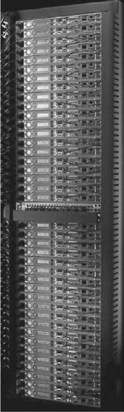

## Designing and Evaluating an I/O System— The Internet Archive Cluster

The art of I/O system design is to find a design that meets goals for cost, depend- ability, and variety of devices while avoiding bottlenecks in I/O performance and dependability. Avoiding bottlenecks means that components must be bal- anced between main memory and the I/O device, because performance and dependability—and hence effective cost-performance or cost-dependability— can only be as good as the weakest link in the I/O chain. The architect must also plan for expansion so that customers can tailor the I/O to their applications. This expansibility, both in numbers and types of I/O devices, has its costs in longer I/O buses and networks, larger power supplies to support I/O devices, and larger cabinets.

> I/O 系统设计的艺术是找到一个符合成本，依赖能力和各种设备的目标的设计，同时避免使用 I/O 性能和可靠性中的瓶颈。避免瓶颈意味着组件必须在主内存和 I/O 设备之间保持平衡，因为性能和可靠性以及有效的成本绩效或成本可依赖性 - 只能与 I/O 中最弱的链接一样好。链。工程师还必须计划扩展，以便客户可以根据其应用程序定制 I/O。I/O 设备的数量和类型的这种扩展性，其成本在更长的 I/O 公交车和网络，更大的电源以支持 I/O 设备以及较大的机柜中。

In designing an I/O system, we analyze performance, cost, capacity, and avail- ability using varying I/O connection schemes and different numbers of I/O devices of each type. Here is one series of steps to follow in designing an I/O system. The answers for each step may be dictated by market requirements or simply by cost, performance, and availability goals.

> 在设计 I/O 系统时，我们使用不同的 I/O 连接方案和每种类型的 I/O 设备的不同数量的 I/O 连接方案分析性能，成本，容量和能力。这是设计 I/O 系统时要遵循的一系列步骤。每个步骤的答案可能取决于市场需求或仅取决于成本，绩效和可用性目标。

1. List the different types of I/O devices to be connected to the machine, or list the standard buses and networks that the machine will support.

> 1.列出要连接到机器的 I/O 设备的不同类型，或列出机器将支持的标准总线和网络。

2. List the physical requirements for each I/O device. Requirements include size, power, connectors, bus slots, expansion cabinets, and so on.

> 2.列出每个 I/O 设备的物理要求。要求包括尺寸，电源，连接器，总线插槽，扩展柜等。

3. List the cost of each I/O device, including the portion of cost of any controller needed for this device.

> 3.列出每个 I/O 设备的成本，包括此设备所需的任何控制器的成本部分。

4. List the reliability of each I/O device.

> 4.列出每个 I/O 设备的可靠性。

5. Record the processor resource demands of each I/O device. This list should include:

> 5.记录每个 I/O 设备的处理器资源需求。此列表应包括：

<!--  -->

1. List the memory and I/O bus resource demands of each I/O device. Even when the processor is not using memory, the bandwidth of main memory and the I/O connection is limited.

> 1.列出每个 I/O 设备的内存以及 I/O 总线资源需求。即使处理器不使用内存，主内存和 I/O 连接的带宽也受到限制。

2. The final step is assessing the performance and availability of the different ways to organize these I/O devices. When you can afford it, try to avoid single points of failure. Performance can only be properly evaluated with simulation, although it may be estimated using queuing theory. Reliability can be calculated assuming I/O devices fail independently and that the times to failure are expo- nentially distributed. Availability can be computed from reliability by estimat- ing MTTF for the devices, taking into account the time from failure to repair.

> 2.最后一步是评估组织这些 I/O 设备的不同方式的性能和可用性。当您负担得起时，请尝试避免单点故障。尽管可以使用排队理论来估计绩效，但只能通过模拟对性能进行适当的评估。假设 I/O 设备独立故障并且失败的时间是明确分布的，则可以计算可靠性。可以考虑到无法维修的时间来从可靠性中估算 MTTF 来计算可用性。

Given your cost, performance, and availability goals, you then select the best organization.

> 鉴于您的成本，绩效和可用性目标，然后选择最佳组织。

Cost-performance goals affect the selection of the I/O scheme and physical design. Performance can be measured either as megabytes per second or I/Os per second, depending on the needs of the application. For high performance, the only limits should be speed of I/O devices, number of I/O devices, and speed of memory and processor. For low cost, most of the cost should be the I/O devices themselves. Availability goals depend in part on the cost of unavailability to an organization.

> 成本绩效目标会影响 I/O 计划和物理设计的选择。可以根据应用的需求来测量性能为每秒兆字节或每秒 I/OS。对于高性能，唯一的限制应该是 I/O 设备的速度，I/O 设备的数量以及内存和处理器的速度。对于低成本，大部分成本应该是 I/O 设备本身。可用性目标部分取决于组织不可用的成本。

Rather than create a paper design, let’s evaluate a real system.

> 与其创建纸张设计，不如评估一个真实的系统。

### The Internet Archive Cluster

> ###互联网档案集群

To make these ideas clearer, we’ll estimate the cost, performance, and availability of a large storage-oriented cluster at the Internet Archive. The Internet Archive began in 1996 with the goal of making a historical record of the Internet as it chan- ged over time. You can use the Wayback Machine interface to the Internet Archive to perform time travel to see what the Web site at a URL looked like sometime in the past. It contains over a petabyte (1015 bytes) and is growing by 20 terabytes (1012 bytes) of new data per month, so expansible storage is a requirement. In addi- tion to storing the historical record, the same hardware is used to crawl the Web every few months to get snapshots of the Internet.

> 为了使这些想法更清晰，我们将估计 Internet 存档中大型以存储为导向的集群的成本，性能和可用性。互联网档案始于 1996 年，其目的是随着时间的流逝而创建互联网的历史记录。您可以使用 Wayback Machine 接口到 Internet 存档来执行时间旅行，以查看过去某个时候的网站。它包含 Petabyte(10  15  bytes)，并且每月增加了 20 吨(10  12  bytes)的新数据，因此需要扩展存储。此外，还要存储历史记录，每隔几个月就使用相同的硬件来爬网，以获取 Internet 的快照。

Clusters of computers connected by local area networks have become a very economical computation engine that works well for some applications. Clusters also play an important role in Internet services such the Google search engine, where the focus is more on storage than it is on computation, as is the case here.

> 由局部网络连接的计算机集群已成为一种非常经济的计算引擎，适用于某些应用。群集在互联网服务(例如 Google 搜索引擎)中也起着重要作用，在 Google 搜索引擎中，重点更多地是存储在存储上，而不是在计算上。

Although it has used a variety of hardware over the years, the Internet Archive is moving to a new cluster to become more efficient in power and in floor space. The basic building block is a 1U storage node called the PetaBox GB2000 from Capricorn Technologies. In 2006, it used four 500 GB Parallel ATA (PATA) disk drives, 512 MB of DDR266 DRAM, one 10/100/1000 Ethernet interface, and a 1 GHz C3 processor from VIA, which executes the 80x86 instruction set. This node dissipates about 80 watts in typical configurations.

> 尽管多年来使用了各种硬件，但互联网档案正在转向一个新集群，以提高功率和地板空间的效率。基本的构建块是摩 ri 座技术的 1U 存储节点，称为 PETABOX GB2000。在 2006 年，它使用了四个 500 GB Parallel ATA(PATA)磁盘驱动器，512 MB 的 DDR266 DRAM，一个 10/100/1000 以太网接口和 1 GHz C3 处理器，从 VIA 执行 80x86 指令集。该节点在典型配置中耗散约 80 瓦。

[Figure D.19](#_bookmark560) shows the cluster in a standard VME rack. Forty of the GB2000s fit in a standard VME rack, which gives the rack 80 TB of raw capacity. The 40 nodes are connected together with a 48-port 10/100 or 10/100/1000 switch, and it dissipates about 3 KW. The limit is usually 10 KW per rack in computer facilities, so it is well within the guidelines.

> [图 D.19](#_bookmark560) 显示了标准 VME 机架中的群集。40 GB2000 符合标准 VME 机架，可为原始容量提供 80 吨的架子。40 个节点与 48-port 10/100 或 10/100/1000 开关连接，并消散约 3 kW。在计算机设施中，限制通常为每个机架 10 kW，因此在准则之内。

Figure D.19 The TB-80 VME rack from Capricorn Systems used by the Internet Archive. All cables, switches, and displays are accessible from the front side, and the back side is used only for airflow. This allows two racks to be placed back-to-back, which reduces the floor space demands in machine rooms.

> 图 D.19 Internet 档案中使用的摩 ri 座系统的 TB-80 VME 机架。所有电缆，开关和显示器均可从前侧访问，而背面仅用于气流。这允许背靠背放置两个机架，从而减少了机房中的地板空间需求。

A petabyte needs 12 of these racks, connected by a higher-level switch that connects the Gbit links coming from the switches in each of the racks.

> p pb 需要这些架子中的 12 个，由高级开关连接，该开关连接来自每个机架中的开关的 GBIT 链接。

### Estimating Performance, Dependability, and Cost of the Internet Archive Cluster

> ###估计互联网档案集群的性能，可靠性和成本

To illustrate how to evaluate an I/O system, we’ll make some guesses about the cost, performance, and reliability of the components of this cluster. We make the following assumptions about cost and performance:

> 为了说明如何评估 I/O 系统，我们将对此集群组件的成本，性能和可靠性进行一些猜测。我们对成本和绩效做出以下假设：

- The VIA processor, 512 MB of DDR266 DRAM, ATA disk controller, power supply, fans, and enclosure cost $500.

> - Via 处理器，512 MB 的 DDR266 DRAM，ATA 磁盘控制器，电源，风扇和外壳的价格为 500 美元。

- Each of the four 7200 RPM Parallel ATA drives holds 500 GB, has an average time seek of 8.5 ms, transfers at 50 MB/sec from the disk, and costs $375. The PATA link speed is 133 MB/sec.

> - 四个 7200 rpm 平行驱动器中的每个驱动器中的每一个均持有 500 GB，平均时间为 8.5 毫秒，从磁盘上以 50 mb/sec 的速度转移，费用为 375 美元。PATA 链路速度为 133 MB/秒。

- The average I/O size is 16 KB for accesses to the historical > record via the Way- back interface, and 50 KB when collecting > a new snapshot.

> - 对于通过前后界面访问历史记录的平均 I/O 尺寸为 16 KB，收集新快照时的历史 > 记录为 50 kb。

Example Evaluate the cost per I/O per second (IOPS) of the 80 TB rack. Assume that every disk I/O requires an average seek and average rotational delay. Assume that the workload is evenly divided among all disks and that all devices can be used at 100% of capacity; that is, the system is limited only by the weakest link, and it can operate that link at 100% utilization. Calculate for both average I/O sizes.

> 示例评估 80 TB 机架的每秒(IOP)每秒(IOPS)的成本。假设每个磁盘 I/O 都需要平均寻求和平均旋转延迟。假设工作量均匀地分配在所有磁盘之间，并且所有设备都可以以 100％的容量使用；也就是说，该系统仅受到最弱的链接的限制，并且可以在 100％利用率下操作该链接。计算两个平均 I/O 尺寸。

_Answer_ I/O performance is limited by the weakest link in the chain, so we evaluate the max- imum performance of each link in the I/O chain for each organization to determine the maximum performance of that organization.

> _answer_ I/O 性能受链中最弱的链接的限制，因此我们评估了 I/O 链中每个链接的最大性能，以确定该组织的最大性能。

Let’s start by calculating the maximum number of IOPS for the CPU, main memory, and I/O bus of one GB2000. The CPU I/O performance is determined by the speed of the CPU and the number of instructions to perform a disk I/O and to send it over the network:

> 让我们从计算 CPU，主内存和一个 GB2000 的 I/O 总线的最大 IOP 数量开始。CPU I/O 性能取决于 CPU 的速度以及执行磁盘 I/O 的说明数量并通过网络发送的指令：

Clearly, the performance bottleneck of the GB2000 is the disks. The IOPS for the whole rack is 40 308 or 12,320 IOPS to 40 292 or 11,680 IOPS. The network switch would be the bottleneck if it couldn’t support 12,320 16 K 8 or 1.6 Gbits/sec for 16 KB blocks and 11,680 50 K 8 or 4.7 Gbits/sec for 50 KB blocks. We assume that the extra 8 Gbit ports of the 48-port switch connects the rack to the rest of the world, so it could support the full IOPS of the collective 160 disks in the rack.

> 显然，GB2000 的性能瓶颈是磁盘。整个机架的 IOPS 为 40 308 或 12,320 IOPS 至 40 292 或 11,680 IOPS。网络开关将是瓶颈，如果它不能支持 16 KB 块的 12,320 16 K 8 或 1.6 Gbits/sec/sec，而 11,680 50 K 8 或 4.7 GBITS/4.7 GBITS/SEC 对于 50 KB 块。我们假设 48 端口开关的额外 8 GBIT 端口将机架连接到世界其他地方，因此它可以支持机架中集体 160 个磁盘的完整 IOPS。

Using these assumptions, the cost is 40 ($500 + 4 $375) +$3000 +$1500 or

> 使用这些假设，费用为 40($ 500 +4 $ 375) +$ 3000 +$ 1500 或

$84,500 for an 80 TB rack. The disks themselves are almost 60% of the cost. The cost per terabyte is almost $1000, which is about a factor of 10 to 15 better than storage cluster from the prior edition in 2001. The cost per IOPS is about $7.

> 84,500 美元的 80 TB 机架。磁盘本身几乎是成本的 60％。每 trabyte 的成本接近 $ 1000，比 2001 年的先前版本的存储群集优于 10 到 15 倍。每台 IOPS 的成本约为 7 美元。

### Calculating MTTF of the TB-80 Cluster

> ###计算 TB-80 群集的 MTTF

Internet services such as Google rely on many copies of the data at the application level to provide dependability, often at different geographic sites to protect against environmental faults as well as hardware faults. Hence, the Internet Archive has two copies of the data in each site and has sites in San Francisco, Amsterdam, and Alexandria, Egypt. Each site maintains a duplicate copy of the high-value con- tent—music, books, film, and video—and a single copy of the historical Web crawls. To keep costs low, there is no redundancy in the 80 TB rack.

> 诸如 Google 之类的互联网服务依靠应用程序级别的许多数据副本来提供可靠性，通常在不同的地理网站上可以防止环境故障以及硬件故障。因此，互联网档案馆在每个站点中都有两个数据副本，并在旧金山，阿姆斯特丹和埃及亚历山大的网站上都有。每个站点都保留了高价值的复制副本(音乐，书籍，电影和视频)，并保留了历史网络爬网的单个副本。为了保持低廉的成本，80 TB 机架没有冗余。

Example Let’s look at the resulting mean time to fail of the rack. Rather than use the man- ufacturer’s quoted MTTF of 600,000 hours, we’ll use data from a recent survey of disk drives \[Gray and van Ingen 2005\]. As mentioned in [Chapter 1](#_bookmark2), about 3% to 7% of ATA drives fail per year, for an MTTF of about 125,000 to 300,000 hours. Make the following assumptions, again assuming exponential lifetimes:

> 示例，让我们看一下由架子失败的结果。我们将使用最近对磁盘驱动器调查的数据\ [Gray and van Ingen 2005 \]，而不是使用 Man-ufacturer 引用的 MTTF 的引用 MTTF。如[第 1 章](#_bookmark2)中提到的，大约 125,000 至 300,000 小时的 MTTF 每年大约 3％至 7％的 ATA 驱动器失败。做出以下假设，再次假设指数寿命：

- CPU/memory/enclosure MTTF is 1,000,000 hours.

> -CPU/内存/外壳 MTTF 为 1,000,000 小时。

- PATA Disk MTTF is 125,000 hours.

> -PATA 磁盘 MTTF 为 125,000 小时。

- PATA controller MTTF is 500,000 hours.

> -PATA 控制器 MTTF 为 500,000 小时。

- Ethernet Switch MTTF is 500,000 hours.

> - 以太网开关 MTTF 为 500,000 小时。

- Power supply MTTF is 200,000 hours.

> - 电源 MTTF 为 200,000 小时。

- Fan MTTF is 200,000 hours.

> -Fan MTTF 为 200,000 小时。

- PATA cable MTTF is 1,000,000 hours.

> -PATA 电缆 MTTF 为 1,000,000 小时。

_Answer_ Collecting these together, we compute these failure rates:

> *answer* 将这些收集在一起，我们计算这些故障率：

That is, given these assumptions about the MTTF of components, something in a rack fails on average every 3 weeks. About 70% of the failures would be the disks, and about 20% would be fans or power supplies.

> 也就是说，鉴于这些关于组件 MTTF 的假设，机架中的某些东西平均每 3 周失败。大约 70％的故障将是磁盘，大约 20％是粉丝或电源。

Putting It All Together: NetApp FAS6000 Filer

> 将所有内容放在一起：NetApp FAS6000 申报机

Network Appliance entered the storage market in 1992 with a goal of providing an easy-to-operate file server running NSF using their own log-structured file system and a RAID 4 disk array. The company later added support for the Windows CIFS

> Network Appliance 于 1992 年进入存储市场，目的是使用自己的日志结构文件系统和 RAID 4 磁盘阵列提供易于操作的文件服务器。该公司后来增加了对 Windows CIFS 的支持

file system and a RAID 6 scheme called _row-diagonal parity_ or _RAID-DP_ (see page D-8). To support applications that want access to raw data blocks without the overhead of a file system, such as database systems, NetApp filers can serve data blocks over a standard Fibre Channel interface. NetApp also supports _iSCSI_, which allows SCSI commands to run over a TCP/IP network, thereby allowing the use of standard networking gear to connect servers to storage, such as Ethernet, and hence at a greater distance.

> 文件系统和 RAID 6 方案，称为 *ROW-DIAGONAL PARITY* 或 *RAID-DP*(请参阅第 D-8 页)。为了支持想要访问没有文件系统开销的原始数据块的应用程序，例如数据库系统，NetApp 申请人可以通过标准的光纤通道接口使用数据块。NetApp 还支持 *iscsi*，该 *iscsi* 允许 SCSI 命令通过 TCP/IP 网络运行，从而允许使用标准网络设备将服务器连接到存储，例如以太网，因此在更大的距离上。

The latest hardware product is the FAS6000. It is a multiprocessor based on the AMD Opteron microprocessor connected using its HyperTransport links. The microprocessors run the NetApp software stack, including NSF, CIFS, RAID-DP, SCSI, and so on. The FAS6000 comes as either a dual processor (FAS6030) or a quad processor (FAS6070). As mentioned in [Chapter 5](#_bookmark213), DRAM is distributed to each microprocessor in the Opteron. The FAS6000 connects 8 GB of DDR2700 to each Opteron, yielding 16 GB for the FAS6030 and 32 GB for the FAS6070. As mentioned in [Chapter 4](#_bookmark165), the DRAM bus is 128 bits wide, plus extra bits for SEC/DED memory. Both models dedicate four HyperTransport links to I/O.

> 最新的硬件产品是 FAS6000。它是基于使用其大型转运链接连接的 AMD Opteron 微处理器的多处理器。微处理器运行 NetApp 软件堆栈，包括 NSF，CIFS，RAID-DP，SCSI 等。FAS6000 作为双处理器(FAS6030)或四轮处理器(FAS6070)出现。如[第 5 章](#_bookmark213)所述，DRAM 分配给 Opteron 中的每个微处理器。FAS6000 将 8 GB 的 DDR2700 连接到每个 Opteron，对于 FAS6030，FAS6030 的 FAS6070 产生 16 GB。如[第 4 章](#_bookmark165)中提到的，DRAM 总线为 128 位宽，以及用于 SEC/DED 内存的额外位。两种型号都将四个大型传输链接链接到 I/O。

As a filer, the FAS6000 needs a lot of I/O to connect to the disks and to connect to the servers. The integrated I/O consists of:

> 作为申请人，FAS6000 需要大量 I/O 连接到磁盘并连接到服务器。集成的 I/O 包含：

- 8 Fibre Channel (FC) controllers and ports

> -8 光纤通道(FC)控制器和端口

- 6 Gigabit Ethernet links

> -6 千兆以太网链接

- 6 slots for x8 (2 GB/sec) PCI Express cards

> -X8(2 GB/sec)PCI Express 卡的 6 个插槽

- 3 slots for PCI-X 133 MHz, 64-bit cards

> - PCI-X 133 MHz，64 位卡的 3 个插槽

- Standard I/O options such as IDE, USB, and 32-bit PCI

> - 标准 I/O 选项，例如 IDE，USB 和 32 位 PCI

The 8 Fibre Channel controllers can each be attached to 6 shelves containing 14 3.5-inch FC disks. Thus, the maximum number of drives for the integrated I/O is 8 6 14 or 672 disks. Additional FC controllers can be added to the option slots to connect up to 1008 drives, to reduce the number of drives per FC network so as to reduce contention, and so on. At 500 GB per FC drive, if we assume the RAID RDP group is 14 data disks and 2 check disks, the available data capacity is 294 TB for 672 disks and 441 TB for 1008 disks.

> 8 个光纤通道控制器可以连接到包含 14 个 3.5 英寸 FC 磁盘的 6 个架子上。因此，集成 I/O 的最大驱动器数为 8 6 14 或 672 磁盘。可以将其他 FC 控制器添加到选项插槽中，以连接多达 1008 个驱动器，以减少每个 FC 网络的驱动器数量以减少争议，依此类推。在每个 FC 驱动器 500 GB 时，如果我们假设 RAID RDP 组为 14 个数据磁盘和 2 个检查磁盘，则可用数据容量为 672 个磁盘为 294 TB，1008 个磁盘为 441 TB。

It can also connect to Serial ATA disks via a Fibre Channel to SATA bridge controller, which, as its name suggests, allows FC and SATA to communicate.

> 它还可以通过光纤通道连接到 SATA 桥控制器的串行 ATA 磁盘，顾名思义，该磁盘允许 FC 和 SATA 进行通信。

The six 1-gigabit Ethernet links connect to servers to make the FAS6000 look like a file server if running NTFS or CIFS or like a block server if running iSCSI. For greater dependability, FAS6000 filers can be paired so that if one fails, the other can take over. Clustered failover requires that both filers have access to all disks in the pair of filers using the FC interconnect. This interconnect also allows each filer to have a copy of the log data in the NVRAM of the other filer and to keep the clocks of the pair synchronized. The health of the filers is constantly monitored, and failover happens automatically. The healthy filer maintains its own network identity and its own primary functions, but it also assumes the network identity of the failed filer and handles all its data requests via a virtual filer until an admin- istrator restores the data service to the original state.

> 如果运行 NTFS 或 CIFS，则六个 1 Gabit 以太网链接连接到服务器，以使 FAS6000 看起来像文件服务器，或者如果运行的 ISCSI，则像块服务器一样。为了获得更大的可靠性，可以配对 FAS6000 申请人，以便如果一个失败，另一个可以接管。聚类故障转移要求两个档案器都可以使用 FC InterConnect 访问这对申报者中的所有磁盘。此互连还允许每个档案中的每个档案中的日志数据副本在另一个申请人的 NVRAM 中，并保持对同步的时钟。不断监控档案的健康状况，故障转移会自动发生。健康的申报人维护自己的网络身份及其自身的主要功能，但它还假定失败的申请人的网络身份，并通过虚拟申请人处理所有数据请求，直到管理员将数据服务恢复为原始状态为止。

Fallacies and Pitfalls

> 谬论和陷阱

Fallacy _Components fail fast_

> 谬误\_科目快速失败

A good deal of the fault-tolerant literature is based on the simplifying assumption that a component operates perfectly until a latent error becomes effective, and then a failure occurs that stops the component.

> 大量容忍故障的文献是基于简化的假设，即组件完美地运行，直到潜在误差变得有效，然后发生故障会阻止组件。

The Tertiary Disk project had the opposite experience. Many components started acting strangely long before they failed, and it was generally up to the sys- tem operator to determine whether to declare a component as failed. The compo- nent would generally be willing to continue to act in violation of the service agreement until an operator “terminated” that component.

> 三级磁盘项目具有相反的经验。许多组件在失败之前就开始奇怪地发挥作用，通常由系统操作员确定是否将组件声明为失败。该组合通常愿意继续违反服务协议，直到运营商“终止”该组件。

Figure D.20 shows the history of four drives that were terminated, and the num- ber of hours they started acting strangely before they were replaced.

> 图 D.20 显示了终止的四个驱动器的历史，并且在更换之前，他们开始奇怪地行动的数量。

Fallacy _Computers systems achieve 99.999% availability (“five nines”), as advertised_

> 谬误\_Computers 系统达到 99.999％的可用性(“五个九”)，如广告

Marketing departments of companies making servers started bragging about the availability of their computer hardware; in terms of Figure D.21, they claim avail- ability of 99.999%, nicknamed _five nines_. Even the marketing departments of oper- ating system companies tried to give this impression.

> 制造服务器的公司营销部门开始吹嘘其计算机硬件的可用性；就图 D.21 而言，他们声称可用的能力为 99.999％，称为 *five nines*。即使是运营系统的营销部门，公司都试图给人以这种印象。

Five minutes of unavailability per year is certainly impressive, but given the failure data collected in surveys, it’s hard to believe. For example, Hewlett-Packard claims that the HP-9000 server hardware and HP-UX operating system can deliver

> 每年五分钟的不可用肯定令人印象深刻，但是鉴于调查中收集的失败数据很难相信。例如，惠普(Hewlett-Packard)声称 HP-9000 服务器硬件和 HP-UX 操作系统可以交付

Figure D.20 Record in system log for 4 of the 368 disks in Tertiary Disk that were replaced over 18 months. See Talagala and Patterson \[1999\]. These messages, match- ing the SCSI specification, were placed into the system log by device drivers. Messages started occurring as much as a week before one drive was replaced by the operator. The third and fourth messages indicate that the drive’s failure prediction mechanism detected and predicted imminent failure, yet it was still hours before the drives were replaced by the operator.

> 图 D.20 在第 368 个磁盘中的 4 个磁盘中有 4 个在 18 个月内被替换的 368 个磁盘中的 4 个记录。参见 Talagala 和 Patterson \ [1999 \]。这些消息与 SCSI 规范相匹配，被设备驱动程序放入系统日志中。邮件开始发生在运算符替换一次驱动器之前的一周之前。第三和第四消息表明，检测到的驱动器故障预测机制并预测了即将发生的故障，但仍有几个小时才能被操作员替换。

Figure D.21 Minutes unavailable per year to achieve availability class. (From Gray and Siewiorek \[1991\].) Note that five nines mean unavailable five minutes per year.

> 图 D.21 分钟每年无法实现可用性类别。(摘自 Gray 和 Siewiorek \ [1991 \]。)请注意，五个九表示每年无法获得五分钟。

a 99.999% availability guarantee “in certain pre-defined, pre-tested customer envi- ronments” (see Hewlett-Packard \[1998\]). This guarantee does not include failures due to operator faults, application faults, or environmental faults, which are likely the dominant fault categories today. Nor does it include scheduled downtime. It is also unclear what the financial penalty is to a company if a system does not match its guarantee.

> 99.999％的可用性保证“在某些预先定义的，预先测试的客户环境中”(请参阅 Hewlett-Packard \ [1998 \])。此保证不包括由于操作员故障，应用程序故障或环境故障而导致的故障，这可能是当今的主要故障类别。它也不包括计划停机时间。如果系统不符合其保证，则还不清楚公司对公司的罚款是多少。

Microsoft also promulgated a five nines marketing campaign. In January 2001, _[www.microsoft.com](http://www.microsoft.com/)_ was unavailable for 22 hours. For its Web site to achieve 99.999% availability, it will require a clean slate for 250 years.

> 微软还颁布了五个九个营销活动。在 2001 年 1 月，_ [www.microsoft.com](%5Bwww.microsoft.com/%5D(http://www.microsoft.com/))_ \_ \_无法使用 22 小时。为了使其网站达到 99.999％的可用性，它将需要 250 年的清洁板。

In contrast to marketing suggestions, well-managed servers typically achieve 99% to 99.9% availability.

> 与营销建议相反，管理良好的服务器通常可实现 99％至 99.9％的可用性。

Pitfall _Where a function is implemented affects its reliability_

> 陷阱*在某些地方实现函数会影响其可靠性*

In theory, it is fine to move the RAID function into software. In practice, it is very difficult to make it work reliably.

> 从理论上讲，将 RAID 功能移至软件是可以的。实际上，很难可靠地工作。

The software culture is generally based on eventual correctness via a series of releases and patches. It is also difficult to isolate from other layers of software. For example, proper software behavior is often based on having the proper version and patch release of the operating system. Thus, many customers have lost data due to software bugs or incompatibilities in environment in software RAID systems.

> 该软件文化通常基于一系列版本和补丁的最终正确性。也很难与其他软件层隔离。例如，正确的软件行为通常基于操作系统的正确版本和补丁发布。因此，由于软件突袭系统中的软件错误或环境不兼容，许多客户因软件错误或不兼容而丢失了数据。

Obviously, hardware systems are not immune to bugs, but the hardware culture tends to place a greater emphasis on testing correctness in the initial release. In addition, the hardware is more likely to be independent of the version of the oper- ating system.

> 显然，硬件系统不能免疫错误，但是硬件文化倾向于在初始版本中更加重视测试正确性。此外，硬件更有可能独立于操作系统的版本。

Fallacy _Operating systems are the best place to schedule disk accesses_

> 谬误*操作系统是安排磁盘访问的最佳场所*

Higher-level interfaces such as ATA and SCSI offer logical block addresses to the host operating system. Given this high-level abstraction, the best an OS can do is to try to sort the logical block addresses into increasing order. Since only the disk knows the mapping of the logical addresses onto the physical geometry of sectors, tracks, and surfaces, it can reduce the rotational and seek latencies.

> ATA 和 SCSI 等高级接口为主机操作系统提供逻辑块地址。鉴于此高级抽象，OS 可以做的最好的方法是尝试将逻辑块地址分类为增加的顺序。由于只有磁盘知道逻辑地址的映射到扇区，轨道和表面的物理几何形状上，因此它可以减少旋转并寻求潜伏期。

For example, suppose the workload is four reads \[Anderson 2003\]:

> 例如，假设工作负载是四个读取\ [Anderson 2003 \]：

Depending on the relative location of the data on the disk, reordering could make it worse, as [Figure D.22](#_bookmark563) shows. The disk-scheduled reads complete in three-quarters of a disk revolution, but the OS-scheduled reads take three revolutions.

> 根据[图 D.22](#_bookmark563) 所示，根据数据在磁盘上的相对位置，重新排序可能会使情况更糟。磁盘制定的读物在磁盘革命的四分之三中完成，但是 OS-Senduled Reads 进行了三革命。

Fallacy _The time of an average seek of a disk in a computer system is the time for a seek of one-third the number of cylinders_

> 谬误\_在计算机系统中平均寻求磁盘的时间是寻找三分之一圆柱数量的时间

This fallacy comes from confusing the way manufacturers market disks with the expected performance, and from the false assumption that seek times are linear in dis- tance. The one-third-distance rule of thumb comes from calculating the distance of a seek from one random location to another random location, not including the current track and assuming there is a large number of tracks. In the past, manufacturers listed the seek of this distance to offer a consistent basis for comparison. (Today, they calculate the “average” by timing all seeks and dividing by the number.) Assuming (incorrectly) that seek time is linear in distance, and using the manufacturer’s reported minimum and “average” seek times, a common technique to predict seek time is

> 这种谬论来自使制造商市场磁盘与预期性能的方式混淆，以及错误的假设是，寻求时间是线性的。经验的三分之一距离规则来自计算从一个随机位置到另一个随机位置的搜索距离，而不包括当前轨道，并且假设有大量轨道。过去，制造商列出了此距离的寻求，以提供一致的比较基础。(今天，他们通过定时所有寻求和除以数字来计算“平均”。寻找时间是

Figure D.22 Example showing OS versus disk schedule accesses, labeled host- ordered versus drive-ordered. The former takes 3 revolutions to complete the 4 reads, while the latter completes them in just 3/4 of a revolution. (From Anderson \[2003\].)

> 图 D.22 示例显示 OS 与磁盘计划访问，标记为主机排序与驱动器订购的示例。前者进行了 3 次革命完成 4 次读物，而后者仅在革命的 3/4 中完成了它们。(来自 Anderson \ [2003 \]。)。

The fallacy concerning seek time is twofold. First, seek time is _not_ linear with distance; the arm must accelerate to overcome inertia, reach its maximum traveling speed, decelerate as it reaches the requested position, and then wait to allow the arm to stop vibrating (_settle time_). Moreover, sometimes the arm must pause to control vibrations. For disks with more than 200 cylinders, Chen and Lee \[1995\] modeled the seek distance as:

> 关于寻求时间的谬论是双重的。首先，寻求时间是 *not* 线性与距离。手臂必须加速以克服惯性，达到其最大行进速度，在达到请求的位置时减速，然后等待使手臂停止振动(_settle Time_)。此外，有时手臂必须暂停以控制振动。对于具有 200 多个气缸的磁盘，Chen 和 Lee \ [1995 \]将寻求距离建模为：

where _a_, _b_, and _c_ are selected for a particular disk so that this formula will match the quoted times for Distance 1, Distance max, and Distance 1/3 max. [Figure D.23](#_bookmark564) plots this equation versus the fallacy equation. Unlike the first equa- tion, the square root of the distance reflects acceleration and deceleration.

> 其中为特定磁盘选择了其中 *a*，*b* 和 *c*，以便此公式将距离 1，距离最大和距离最大 1/3 的报价时间匹配。[图 D.23](#_bookmark564) 绘制此方程与谬误方程式。与第一个方程式不同，距离的平方根反映了加速度和减速。

The second problem is that the average in the product specification would only be true if there were no locality to disk activity. Fortunately, there is both temporal and spatial locality (see page B-2 in [Appendix B](#_bookmark436)). For example, [Figure D.24](#_bookmark565) shows sample measurements of seek distances for two workloads: a UNIX time-sharing workload and a business-processing workload. Notice the high percentage of disk accesses to the same cylinder, labeled distance 0 in the graphs, in both workloads. Thus, this fallacy couldn’t be more misleading.

> 第二个问题是，只有在没有磁盘活动的地方，产品规范中的平均值才是正确的。幸运的是，存在时间和空间位置(请参阅[附录 B](#_bookmark436) 中的 B-2 页)。例如，[图 D.24](#_bookmark565) 显示了两个工作负载寻求距离的样本测量值：UNIX 时间共享工作负载和业务处理工作负载。请注意，在两个工作负载中，磁盘可访问相同的圆柱体，标记为 0 的距离 0。因此，这种谬论并不是更多的误导性。

Figure D.23 Seek time versus seek distance for sophisticated model versus naive model. Chen and Lee \[1995\] found that the equations shown above for param- eters _a_, _b_, and _c_ worked well for several disks.

> 图 D.23 寻求时间与寻找复杂模型与幼稚模型的距离。Chen and Lee \ [1995 \]发现上面显示的方程式 *a*，*b* 和 *c* 在几个磁盘上工作良好。

Figure D.24 Sample measurements of seek distances for two systems. The measurements on the left were taken on a UNIX time-sharing system. The measurements on the right were taken from a business-processing application in which the disk seek activity was scheduled to improve throughput. Seek distance of 0 means the access was made to the same cylinder. The rest of the numbers show the collective percentage for distances between numbers on the _y_- axis. For example, 11% for the bar labeled 16 in the business graph means that the percentage of seeks between 1 and 16 cylinders was 11%. The UNIX measurements stopped at 200 of the 1000 cylinders, but this captured 85% of the accesses. The business measurements tracked all 816 cylinders of the disks. The only seek distances with 1% or greater of the seeks that are not in the graph are 224 with 4%, and 304, 336, 512, and 624, each having 1%. This total is 94%, with the difference being small but nonzero distances in other categories. Measurements courtesy of Dave Anderson of Seagate.

> 图 D.24 两个系统的寻求距离的样本测量。左侧的测量值是在 UNIX 时间共享系统上进行的。右侧的测量值是从计划进行磁盘寻求活动以改善吞吐量的业务处理应用程序中进行的。寻求 0 的距离意味着访问是对同一气缸的访问。其余数字显示了 *y*-轴上数字之间距离的集体百分比。例如，在业务图中标有 16 个标记的酒吧的 11％意味着 1 至 16 个圆柱体之间的搜索百分比为 11％。UNIX 测量值停止了 1000 个气缸中的 200 个，但这捕获了 85％的访问权限。业务测量结果跟踪了所有 816 个磁盘的圆柱体。唯一没有图表中没有 1％或以上的距离的距离为 224，为 4％，304、336、512 和 624，每个距离为 1％，每个距离为 1％。这个总数为 94％，差异很小，但在其他类别中距离为零。测量由西门特的戴夫·安德森(Dave Anderson)提供。
