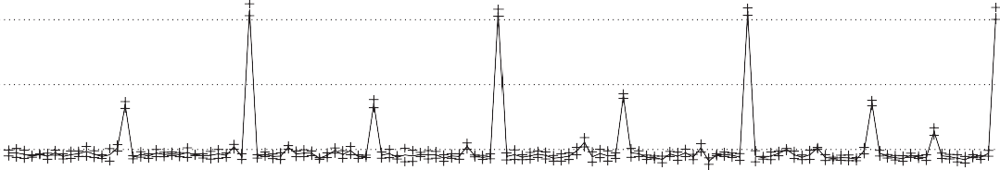
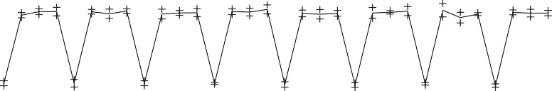

## Historical Perspective and References

[Section M.9](#_bookmark903) (available online) covers the development of storage devices and tech- niques, including who invented disks, the story behind RAID, and the history of operating systems and databases. References for further reading are included.

## Case Studies with Exercises by Andrea C. Arpaci-Dusseau and Remzi H. Arpaci-Dusseau

### Case Study 1: Deconstructing a Disk

##### _Concepts illustrated by this case study_

- Performance Characteristics
- Microbenchmarks
  The internals of a storage system tend to be hidden behind a simple interface, that of a linear array of blocks. There are many advantages to having a common inter- face for all storage systems: An operating system can use any storage system with-

out modification, and yet the storage system is free to innovate behind this interface. For example, a single disk can map its internal &lt;sector, track, surfa- ce&gt;geometry to the linear array in whatever way achieves the best performance; similarly, a multidisk RAID system can map the blocks on any number of disks to

this same linear array. However, this fixed interface has a number of disadvantages, as well; in particular, the operating system is not able to perform some perfor- mance, reliability, and security optimizations without knowing the precise layout of its blocks inside the underlying storage system.

In this case study, we will explore how software can be used to uncover the internal structure of a storage system hidden behind a block-based interface. The basic idea is to _fingerprint_ the storage system: by running a well-defined work- load on top of the storage system and measuring the amount of time required for different requests, one is able to infer a surprising amount of detail about the under- lying system.

The Skippy algorithm, from work by Nisha Talagala and colleagues at the Uni- versity of California–Berkeley, uncovers the parameters of a single disk. The key is to factor out disk rotational effects by making consecutive seeks to individual sec- tors with addresses that differ by a linearly increasing amount (increasing by 1, 2, 3, and so forth). Thus, the basic algorithm skips through the disk, increasing the dis- tance of the seek by one sector before every write, and outputs the distance and time for each write. The raw device interface is used to avoid file system optimi- zations. The SECTOR SIZE is set equal to the minimum amount of data that can be read at once from the disk (e.g., 512 bytes). (Skippy is described in more detail in Talagala and Patterson \[1999\].)

fd = open("raw disk device");

for (i = 0; i &lt; measurements; i++) { begin_time = gettime();

lseek(fd, i\*SECTOR_SIZE, SEEK_CUR); write(fd, buffer, SECTOR_SIZE); interval_time = gettime() -begin_time;

printf("Stride: %d Time: %d\\n", i, interval_time);

}

close(fd);

By graphing the time required for each write as a function of the seek distance, one can infer the minimal transfer time (with no seek or rotational latency), head switch time, cylinder switch time, rotational latency, and the number of heads in the disk. A typical graph will have four distinct lines, each with the same slope, but with different offsets. The highest and lowest lines correspond to requests that incur different amounts of rotational delay, but no cylinder or head switch costs; the difference between these two lines reveals the rotational latency of the disk. The second lowest line corresponds to requests that incur a head switch (in addition to increasing amounts of rotational delay). Finally, the third line corresponds to requests that incur a cylinder switch (in addition to rotational delay).

1. \[10/10/10/10/10\] &lt;D.2 &gt;The results of running Skippy are shown for a mock disk (Disk Alpha) in [Figure D.25](#_bookmark569).

   1. \[10\] &lt;D.2 &gt;What is the minimal transfer time?
   2. \[10\] &lt;D.2 &gt;What is the rotational latency?
   3. \[10\] &lt;D.2 &gt;What is the head switch time?
   4. \[10\] &lt;D.2 &gt;What is the cylinder switch time?
   5. \[10\] &lt;D.2 &gt;What is the number of disk heads?
2. \[25\] &lt;D.2 &gt;Draw an approximation of the graph that would result from running Skippy on Disk Beta, a disk with the following parameters:

- Minimal transfer time, 2.0 ms
- Rotational latency, 6.0 ms
  14

12

10

8

6

4

2

0

0 50

100
150

Distance (sectors)

200

250
300

Figure D.25 Results from running Skippy on Disk Alpha.

- Head switch time, 1.0 ms
- Cylinder switch time, 1.5 ms
- Number of disk heads, 4
- Sectors per track, 100

  1. \[10/10/10/10/10/10/10\] &lt;D.2 &gt;Implement and run the
     Skippy algorithm on a disk drive of your choosing.

     1. \[10\] &lt;D.2 &gt;Graph the results of running Skippy.

        > Report the manufacturer and model of your disk.
        >
     2. \[10\] &lt;D.2 &gt;What is the minimal transfer time?
     3. \[10\] &lt;D.2 &gt;What is the rotational latency?
     4. \[10\] &lt;D.2 &gt;What is the head switch time?
     5. \[10\] &lt;D.2 &gt;What is the cylinder switch time?
     6. \[10\] &lt;D.2 &gt;What is the number of disk heads?
     7. \[10\] &lt;D.2 &gt;Do the results of running Skippy on a
        real disk differ in any qual- itative way from that of the
        mock disk?

### Case Study 2: Deconstructing a Disk Array

##### _Concepts illustrated by this case study_

- Performance Characteristics
- Microbenchmarks
  The Shear algorithm, from work by Timothy Denehy and colleagues at the Uni- versity of Wisconsin \[Denehy et al. 2004\], uncovers the parameters of a RAID sys- tem. The basic idea is to generate a workload of requests to the RAID array and time those requests; by observing which sets of requests take longer, one can infer which blocks are allocated to the same disk.

We define RAID properties as follows. Data are allocated to disks in the RAID at the block level, where a _block_ is the minimal unit of data that the file system reads or writes from the storage system; thus, block size is known by the file system and the fingerprinting software. A _chunk_ is a set of blocks that is allocated contiguously within a disk. A _stripe_ is a set of chunks across each of _D_ data disks. Finally, a _pattern_ is the minimum sequence of data blocks such that block offset _i_ within the pattern is always located on disk _j._

1. \[20/20\] &lt;D.2 &gt;One can uncover the pattern size with the following code. The code accesses the raw device to avoid file system optimizations. The key to all
   of the Shear algorithms is to use random requests to avoid triggering any of the prefetch or caching mechanisms within the RAID or within individual disks. The basic idea of this code sequence is to access _N_ random blocks at a fixed interval _p_ within the RAID array and to measure the completion time of each interval.

for (p = BLOCKSIZE; p &lt;= testsize; p += BLOCKSIZE) { for (i = 0; i &lt; N; i++) {

request\[i\] = random()\*p;

}

begin_time = gettime();

issues all request\[N\] to raw device in parallel;

wait for all request\[N\] to complete; interval_time = gettime() - begin_time; printf("PatternSize: %d Time: %d\\n", p,

interval_time);

}

If you run this code on a RAID array and plot the measured time for the _N_ requests as a function of _p_, then you will see that the time is highest when all _N_ requests fall on the same disk; thus, the value of _p_ with the highest time corre- sponds to the pattern size of the RAID.

1. \[20\] &lt;D.2 &gt;[Figure D.26](#_bookmark570) shows the results of running the pattern size algorithm on an unknown RAID system.
   1.5

1.0

0.5

0.0

0

32 64

96 128

Pattern size assumed (KB)

160 192 224

256

Figure D.26 Results from running the pattern size algorithm of Shear on a mock storage system.

- What is the pattern size of this storage system?
- What do the measured times of 0.4, 0.8, and 1.6 seconds correspond to in this storage system?
- If this is a RAID 0 array, then how many disks are present?
- If this is a RAID 0 array, then what is the chunk size?

  1. \[20\] &lt;D.2 &gt;Draw the graph that would result from running

     > this Shear code on a storage system with the following
     > characteristics:
     >

     - Number of requests, _N_ = 1000
     - Time for a random read on disk, 5 ms
     - RAID level, RAID 0
     - Number of disks, 4
     - Chunk size, 8 KB

     <!-- -->
  2. \[20/20\] &lt;D.2 &gt;One can uncover the chunk size with the
     following code. The basic idea is to perform reads from _N_
     patterns chosen at random but always at controlled offsets, _c_
     and _c_ — 1, within the pattern.
     for (c = 0; c &lt; patternsize; c += BLOCKSIZE) { for (i = 0; i &lt; N; i++) {

requestA\[i\] = random()\*patternsize + c; requestB\[i\] = random()\*patternsize +

(c-1)%patternsize;

}
begin_time = gettime();

issue all requestA\[N\] and requestB\[N\] to raw device in parallel;

wait for requestA\[N\] and requestB\[N\] to complete;

interval_time = gettime() - begin_time; printf("ChunkSize: %d Time: %d\\n", c,

interval_time);

}

If you run this code and plot the measured time as a function of _c_, then you will see that the measured time is lowest when the _requestA_ and _requestB_ reads fall on two different disks. Thus, the values of _c_ with low times correspond to the chunk boundaries between disks of the RAID.

1. \[20\] &lt;D.2 &gt;[Figure D.27](#_bookmark571) shows the results of running the chunk size algorithm on an unknown RAID system.

   - What is the chunk size of this storage system?
   - What do the measured times of 0.75 and 1.5 seconds correspond to

     > in this storage system?
     >
2. \[20\] &lt;D.2 &gt;Draw the graph that would result from running this Shear code on a storage system with the following characteristics:

   - Number of requests, _N_ = 1000
   - Time for a random read on disk, 5 ms
   - RAID level, RAID 0
   - Number of disks, 8
   - Chunk size, 12 KB

<!-- -->

1. \[10/10/10/10\] &lt;D.2 &gt;Finally, one can determine the layout of chunks to disks with the following code. The basic idea is to select _N_ random patterns and to exhaustively
   read together all pairwise combinations of the chunks within the pattern.

for (a = 0; a &lt; numchunks; a += chunksize) {

for (b = a; b &lt; numchunks; b += chunksize) { for (i = 0; i &lt; N; i++) {

requestA\[i\] = random()\*patternsize + a;

requestB\[i\] = random()\*patternsize + b;

}

begin_time = gettime();

issue all requestA\[N\] and requestB\[N\] to raw device in parallel;

1.5

1.0

0.5

0.0

0

16 32 48 64

Boundary offset assumed (KB)

Figure D.27 Results from running the chunk size algorithm of Shear on a mock stor- age system.

wait for all requestA\[N\] and requestB\[N\] to complete;

interval_time = gettime() - begin_time; printf("A: %d B: %d Time: %d\\n", a, b,

interval_time);

}

}

After running this code, you can report the measured time as a function of _a_ and _b._ The simplest way to graph this is to create a two-dimensional table with _a_ and _b_ as the parameters and the time scaled to a shaded value; we use darker shadings for faster times and lighter shadings for slower times. Thus, a light shading indicates that the two offsets of _a_ and _b_ within the pattern fall on the same disk.

[Figure D.28](#_bookmark572) shows the results of running the layout algorithm on a storage system that is known to have a pattern size of 384 KB and a chunk size of 32 KB.

1. \[20\] &lt;D.2 &gt;How many chunks are in a pattern?
2. \[20\] &lt;D.2 &gt;Which chunks of each pattern appear to be allocated on the same disks?
3. \[20\] &lt;D.2 &gt;How many disks appear to be in this storage
   system?
4. \[20\] &lt;D.2 &gt;Draw the likely layout of blocks across the
   disks.

   1. \[20\] &lt;D.2 &gt;Draw the graph that would result from running
      the layout algorithm on the storage system shown in [Figure
      D.29](#_bookmark573). This storage system has four disks and
      a chunk size of four 4 KB blocks (16 KB) and is using a RAID 5 Left-Asymmetric layout.

10

8

6

4

2
0

0 2 4

6

Chunk
8 10

Figure D.28 Results from running the layout algorithm of Shear on a mock storage system.

Parity: RAID 5 Left-Asymmetric, stripe = 16, pattern = 48

Figure D.29 A storage system with four disks, a chunk size of four 4 KB blocks, and using a RAID 5 Left-Asymmetric layout. Two repetitions of the pattern are shown.

### Case Study 3: RAID Reconstruction

##### _Concepts illustrated by this case study_

- RAID Systems
- RAID Reconstruction
- Mean Time to Failure (MTTF)
- Mean Time until Data Loss (MTDL)
- Performability
- Double Failures
  A RAID system ensures that data are not lost when a disk fails. Thus, one of the key responsibilities of a RAID is to reconstruct the data that were on a disk when it failed; this process is called _reconstruction_ and is what you will explore in this case study. You will consider both a RAID system that can tolerate one disk failure and a RAID-DP, which can tolerate two disk failures.

Reconstruction is commonly performed in two different ways. In _offline recon- struction_, the RAID devotes all of its resources to performing reconstruction and does not service any requests from the workload. In _online reconstruction_, the RAID continues to service workload requests while performing the reconstruction; the reconstruction process is often limited to use some fraction of the total band- width of the RAID system.

How reconstruction is performed impacts both the _reliability_ and the _perform- ability_ of the system. In a RAID 5, data are lost if a second disk fails before the data from the first disk can be recovered; therefore, the longer the reconstruction time (MTTR), the lower the reliability or the _mean time until data loss_ (MTDL). Per- formability is a metric meant to combine both the performance of a system and its

availability; it is defined as the performance of the system in a given state multi- plied by the probability of that state. For a RAID array, possible states include nor- mal operation with no disk failures, reconstruction with one disk failure, and shutdown due to multiple disk failures.

For these exercises, assume that you have built a RAID system with six disks, plus a sufficient number of hot spares. Assume that each disk is the 37 GB SCSI disk shown in Figure D.3 and that each disk can sequentially read data at a peak of 142 MB/sec and sequentially write data at a peak of 85 MB/sec. Assume that the disks are connected to an Ultra320 SCSI bus that can transfer a total of 320 MB/ sec. You can assume that each disk failure is independent and ignore other potential failures in the system. For the reconstruction process, you can assume that the over- head for any XOR computation or memory copying is negligible. During online reconstruction, assume that the reconstruction process is limited to use a total band- width of 10 MB/sec from the RAID system.

1. \[10\] &lt;D.2 &gt;Assume that you have a RAID 4 system with six
   disks. Draw a simple diagram showing the layout of blocks across
   disks for this RAID system.
2. \[10\] &lt;D.2, D.4 &gt;When a single disk fails, the RAID 4 system
   will perform recon- struction. What is the expected time until a
   reconstruction is needed?
3. \[10/10/10\] &lt;D.2, D.4 &gt;Assume that reconstruction of the RAID
   4 array begins at time _t_.

   1. \[10\] &lt;D.2, D.4 &gt;What read and write operations are

      > required to perform the reconstruction?
      >
   2. \[10\] &lt;D.2, D.4 &gt;For offline reconstruction, when will

      > the reconstruction pro- cess be complete?
      >
   3. \[10\] &lt;D.2, D.4 &gt;For online reconstruction, when will the
      reconstruction pro- cess be complete?
4. \[10/10/10/10\] &lt;D.2, D.4 &gt;In this exercise, we will
   investigate the mean time until data loss (MTDL). In RAID 4, data
   are lost only if a second disk fails before the
   first failed disk is repaired.
5. \[10\] &lt;D.2, D.4 &gt;What is the likelihood of having a second failure during off- line reconstruction?
6. \[10\] &lt;D.2, D.4 &gt;Given this likelihood of a second failure during reconstruc- tion, what is the MTDL for offline reconstruction?
7. \[10\] &lt;D.2, D.4 &gt;What is the likelihood of having a second
   failure during online reconstruction?
8. \[10\] &lt;D.2, D.4 &gt;Given this likelihood of a second failure during reconstruc- tion, what is the MTDL for online reconstruction?

<!-- -->

1. \[10\] &lt;D.2, D.4 &gt;What is performability for the RAID 4 array
   for offline recon- struction? Calculate the performability using
   IOPS, assuming a random readonly
   workload that is evenly distributed across the disks of the RAID 4 array.
2. \[10\] &lt;D.2, D.4 &gt;What is the performability for the RAID 4 array for online recon- struction? During online repair, you can assume that the IOPS drop to 70% of their
   peak rate. Does offline or online reconstruction lead to better performability?
3. \[10\] &lt;D.2, D.4 &gt;RAID 6 is used to tolerate up to two simultaneous disk failures. Assume that you have a RAID 6 system based on row-diagonal parity, or RAID-
   DP; your six-disk RAID-DP system is based on RAID 4, with _p_ 5, as shown in [Figure D.5](#_bookmark545). If data disk 0 and data disk 3 fail, how can those disks be recon- structed? Show the sequence of steps that are required to compute the missing blocks in the first four stripes.

### Case Study 4: Performance Prediction for RAIDs

##### _Concepts illustrated by this case study_

- RAID Levels
- Queuing Theory
- Impact of Workloads
- Impact of Disk Layout
  In this case study, you will explore how simple queuing theory can be used to pre- dict the performance of the I/O system. You will investigate how both storage sys- tem configuration and the workload influence service time, disk utilization, and average response time.

The configuration of the storage system has a large impact on performance. Dif- ferent RAID levels can be modeled using queuing theory in different ways. For example, a RAID 0 array containing _N_ disks can be modeled as _N_ separate systems of M/M/1 queues, assuming that requests are appropriately distributed across the _N_ disks. The behavior of a RAID 1 array depends upon the workload: A read operation can be sent to either mirror, whereas a write operation must be sent to both disks. Therefore, for a read-only workload, a two-disk RAID 1 array can be modeled as an M/M/2 queue, whereas for a write-only workload, it can be modeled as an M/ M/1 queue. The behavior of a RAID 4 array containing _N_ disks also depends upon the workload: A read will be sent to a particular data disk, whereas writes must all update the parity disk, which becomes the bottleneck of the system. Therefore, for a read-only workload, RAID 4 can be modeled as _N_ 1 separate systems, whereas for a write-only workload, it can be modeled as one M/M/1 queue.

The layout of blocks within the storage system can have a significant impact on performance. Consider a single disk with a 40 GB capacity. If the workload ran- domly accesses 40 GB of data, then the layout of those blocks to the disk does not have much of an impact on performance. However, if the workload randomly accesses only half of the disk’s capacity (i.e., 20 GB of data on that disk), then layout does matter: To reduce seek time, the 20 GB of data can be compacted within 20 GB of consecutive tracks instead of allocated uniformly distributed over the entire 40 GB capacity.

For this problem, we will use a rather simplistic model to estimate the service time of a disk. In this basic model, the average positioning and transfer time for a small random request is a linear function of the seek distance. For the 40 GB disk in this problem, assume that the service time is 5 _ms_ \* space utilization. Thus, if the entire 40 GB disk is used, then the average positioning and transfer time for a ran- dom request is 5 ms; if only the first 20 GB of the disk is used, then the average positioning and transfer time is 2.5 ms.

Throughout this case study, you can assume that the processor sends 167 small random disk requests per second and that these requests are exponentially distributed. You can assume that the size of the requests is equal to the block size of 8 KB. Each disk in the system has a capacity of 40 GB. Regardless of the storage system configuration, the workload accesses a total of 40 GB of data; you should allocate the 40 GB of data across the disks in the system in the most efficient manner.

1. \[10/10/10/10/10\] &lt;D.5 &gt;Begin by assuming that the storage
   system consists of a single 40 GB disk.

   1. \[10\] &lt;D.5 &gt;Given this workload and storage system, what

      > is the average service time?
      >
   2. \[10\] &lt;D.5 &gt;On average, what is the utilization of the
      disk?
   3. \[10\] &lt;D.5 &gt;On average, how much time does each request
      spend waiting for the disk?
   4. \[10\] &lt;D.5 &gt;What is the mean number of requests in the
      queue?
   5. \[10\] &lt;D.5 &gt;Finally, what is the average response time
      for the disk requests?
2. \[10/10/10/10/10/10\] &lt;D.2, D.5 &gt;Imagine that the storage
   system is now config- ured to contain two 40 GB disks in a RAID 0
   array; that is, the data are striped in
   blocks of 8 KB equally across the two disks with no redundancy.
3. \[10\] &lt;D.2, D.5 &gt;How will the 40 GB of data be allocated across the disks? Given a random request workload over a total of 40 GB, what is the expected
   service time of each request?
4. \[10\] &lt;D.2, D.5 &gt;How can queuing theory be used to model this storage system?
5. \[10\] &lt;D.2, D.5 &gt;What is the average utilization of each
   disk?
6. \[10\] &lt;D.2, D.5 &gt;On average, how much time does each request spend waiting for the disk?
7. \[10\] &lt;D.2, D.5 &gt;What is the mean number of requests in each
   queue?
8. \[10\] &lt;D.2, D.5 &gt;Finally, what is the average response time
   for the disk requests?

<!-- -->

1. \[20/20/20/20/20\] &lt;D.2, D.5 &gt;Instead imagine that the storage
   system is config- ured to contain two 40 GB disks in a RAID 1 array;
   that is, the data are mirrored
   across the two disks. Use queuing theory to model this system for a read-only workload.
2. \[20\] &lt;D.2, D.5 &gt;How will the 40 GB of data be allocated across the disks? Given a random request workload over a total of 40 GB, what is the expected service time of each request?
3. \[20\] &lt;D.2, D.5 &gt;How can queuing theory be used to model this storage system?
4. \[20\] &lt;D.2, D.5 &gt;What is the average utilization of each disk?
5. \[20\] &lt;D.2, D.5 &gt;On average, how much time does each request spend waiting for the disk?
6. \[20\] &lt;D.2, D.5 &gt;Finally, what is the average response time for the disk requests?

<!-- -->

1. \[10/10\] &lt;D.2, D.5 &gt;Imagine that instead of a read-only workload, you now have a write-only workload on a RAID 1 array.

   1. \[10\] &lt;D.2, D.5 &gt;Describe how you can use queuing theory

      > to model this sys- tem and workload.
      >
   2. \[10\] &lt;D.2, D.5 &gt;Given this system and workload, what are

      > the average utili- zation, average waiting time, and average
      > response time?
      >

### Case Study 5: I/O Subsystem Design

##### _Concepts illustrated by this case study_

- RAID Systems
- Mean Time to Failure (MTTF)
- Performance and Reliability Trade-Offs
  In this case study, you will design an I/O subsystem, given a monetary budget. Your system will have a minimum required capacity and you will optimize for per- formance, reliability, or both. You are free to use as many disks and controllers as fit within your budget.

Here are your building blocks:

- A 10,000 MIPS CPU costing $1000. Its MTTF is 1,000,000 hours.
- A 1000 MB/sec I/O bus with room for 20 Ultra320 SCSI buses and controllers.
- Ultra320 SCSI buses that can transfer 320 MB/sec and support up to 15 disks per bus (these are also called _SCSI strings_). The SCSI cable MTTF is 1,000,000 hours.
- An Ultra320 SCSI controller that is capable of 50,000 IOPS, costs $250, and has an MTTF of 500,000 hours.
- A $2000 enclosure supplying power and cooling to up to eight disks.
  The enclosure MTTF is 1,000,000 hours, the fan MTTF is 200,000
  hours, and the power supply MTTF is 200,000 hours.
- The SCSI disks described in Figure D.3.
- Replacing any failed component requires 24 hours.
  You may make the following assumptions about your workload:
- The operating system requires 70,000 CPU instructions for each disk
  I/O.
- The workload consists of many concurrent, random I/Os, with an
  average size of 16 KB.
  All of your constructed systems must have the following properties:
- You have a monetary budget of $28,000.
- You must provide at least 1 TB of capacity.

  1. \[10\] &lt;D.2 &gt;You will begin by designing an I/O subsystem
     that is optimized only for capacity and performance (and not
     reliability), specifically IOPS. Discuss the
     RAID level and block size that will deliver the best performance.

1. \[20/20/20/20\] &lt;D.2, D.4, D.7 &gt;What configuration of SCSI
   disks, controllers, and enclosures results in the best performance
   given your monetary and capacity
   constraints?
2. \[20\] &lt;D.2, D.4, D.7 &gt;How many IOPS do you expect to deliver with your system?
3. \[20\] &lt;D.2, D.4, D.7 &gt;How much does your system cost?
4. \[20\] &lt;D.2, D.4, D.7 &gt;What is the capacity of your system?
5. \[20\] &lt;D.2, D.4, D.7 &gt;What is the MTTF of your system?

<!-- -->

1. \[10\] &lt;D.2, D.4, D.7 &gt;You will now redesign your system to
   optimize for reliabil- ity, by creating a RAID 10 or RAID 01 array.
   Your storage system should be robust
   not only to disk failures but also to controller, cable, power supply, and fan failures as well; specifically, a single component failure should not prohibit accessing both replicas of a pair. Draw a diagram illustrating how blocks are allocated across disks in the RAID 10 and RAID 01 configurations. Is RAID 10 or RAID 01 more appro- priate in this environment?
2. \[20/20/20/20/20\] &lt;D.2, D.4, D.7 &gt;Optimizing your RAID 10 or
   RAID 01 array only for reliability (but staying within your capacity
   and monetary constraints),
   what is your RAID configuration?
3. \[20\] &lt;D.2, D.4, D.7 &gt;What is the overall MTTF of the components in your system?
4. \[20\] &lt;D.2, D.4, D.7 &gt;What is the MTDL of your system?
5. \[20\] &lt;D.2, D.4, D.7 &gt;What is the usable capacity of this system?
6. \[20\] &lt;D.2, D.4, D.7 &gt;How much does your system cost?
7. \[20\] &lt;D.2, D.4, D.7 &gt;Assuming a write-only workload, how many IOPS can you expect to deliver?

<!-- -->

1. \[10\] &lt;D.2, D.4, D.7 &gt;Assume that you now have access to a disk that has twice the capacity, for the same price. If you continue to design only for reliability, how
   would you change the configuration of your storage system? Why?

### Case Study 6: Dirty Rotten Bits

##### _Concepts illustrated by this case study_

- Partial Disk Failure
- Failure Analysis
- Performance Analysis
- Parity Protection
- Checksumming
  You are put in charge of avoiding the problem of “bit rot”—bits or blocks in a file going bad over time. This problem is particularly important in archival scenarios, where data are written once and perhaps accessed many years later; without taking extra measures to protect the data, the bits or blocks of a file may slowly change or become unavailable due to media errors or other I/O faults.

Dealing with bit rot requires two specific components: detection and recovery. To detect bit rot efficiently, one can use checksums over each block of the file in question; a checksum is just a function of some kind that takes a (potentially long) string of data as input and outputs a fixed-size string (the checksum) of the data as output. The property you will exploit is that if the data changes then the computed checksum is very likely to change as well.

Once detected, recovering from bit rot requires some form of redundancy. Examples include mirroring (keeping multiple copies of each block) and parity (some extra redundant information, usually more space efficient than mirroring). In this case study, you will analyze how effective these techniques are given various scenarios. You will also write code to implement data integrity protection

over a set of files.

1. \[20/20/20\] &lt;D.2 &gt;Assume that you will use simple parity
   protection in Exercises

<!-- -->

1. through D.27. Specifically, assume that you will be computing _one_
   parity
   block for each file in the file system. Further, assume that you will also use a 20-byte MD5 checksum per 4 KB block of each file.

We first tackle the problem of space overhead. According to studies by Douceur and Bolosky \[1999\], these file size distributions are what is found in modern PCs:

<u>≤1 KB 2 KB 4 KB 8 KB 16 KB 32 KB 64 KB 128 KB 256 KB 512 KB ≥1 MB</u> 26.6% 11.0% 11.2% 10.9% 9.5% 8.5% 7.1% 5.1% 3.7% 2.4% 4.0%

The study also finds that file systems are usually about half full. Assume that you have a 37 GB disk volume that is roughly half full and follows that same distribu- tion, and answer the following questions:

1. \[20\] &lt; D.2 &gt; How much extra information (both in bytes and as a percent of the vol- ume) must you keep on disk to be able to detect a single error with checksums?
2. \[20\] &lt;D.2 &gt;How much extra information (both in bytes and as a percent of the volume) would you need to be able to both detect a single error with checksums
   as well as correct it?
3. \[20\] &lt;D.2 &gt;Given this file distribution, is the block size
   you are using to com- pute checksums too big, too little, or just
   right?

   1. \[10/10\] &lt;D.2, D.3 &gt;One big problem that arises in data
      protection is error detec- tion. One approach is to perform
      error detection _lazily_—that is, wait until a file is
      accessed, and at that point, check it and make sure the correct data are there. The problem with this approach is that files that are not accessed frequently may slowly rot away and when finally accessed have too many errors to be corrected. Hence, an eager approach is to perform what is sometimes called _disk scrubbing_— periodically go through all data and find errors proactively.
4. \[10\] &lt;D.2, D.3 &gt;Assume that bit flips occur independently, at a rate of 1 flip per GB of data per month. Assuming the same 20 GB volume that is half full, and assuming that you are using the SCSI disk as specified in Figure D.3 (4 ms
   seek, roughly 100 MB/sec transfer), how often should you scan through files to check and repair their integrity?
5. \[10\] &lt;D.2, D.3 &gt;At what bit flip rate does it become impossible to maintain data integrity? Again assume the 20 GB volume and the SCSI disk.

<!-- -->

1. \[10/10/10/10\] &lt;D.2, D.4 &gt;Another potential cost of added
   data protection is found in performance overhead. We now study the
   performance overhead of this
   data protection approach.
2. \[10\] &lt;D.2, D.4 &gt;Assume we write a 40 MB file to the SCSI disk sequentially, and then write out the extra information to implement our data protection
   scheme to disk once. How much _write traffic_ (both in total volume of bytes and as a percentage of total traffic) does our scheme generate?
3. \[10\] &lt;D.2, D.4 &gt;Assume we now are updating the file randomly, similar to a database table. That is, assume we perform a series of 4 KB random writes to
   the file, and each time we perform a single write, we must update the on-disk protection information. Assuming that we perform 10,000 random writes, how

much _I/O traffic_ (both in total volume of bytes and as a percentage of total traf- fic) does our scheme generate?

1. \[10\] &lt;D.2, D.4 &gt;Now assume that the data protection information is always kept in a separate portion of the disk, away from the file it is guarding (that is, assume for each file _A,_ there is another file _A_checksums that holds all the
   check-sums for _A_). Hence, one potential overhead we must incur arises upon reads—that is, upon each read, we will use the checksum to detect data corruption.

Assume you read 10,000 blocks of 4 KB each sequentially from disk. Assuming a 4 ms average seek cost and a 100 MB/sec transfer rate (like the SCSI disk in Figure D.3), how long will it take to read the file (and corresponding check- sums) from disk? What is the time penalty due to adding checksums?

1. \[10\] &lt;D.2, D.4 &gt;Again assuming that the data protection information is kept separate as in part (c), now assume you have to read 10,000 random blocks of
   4 KB each from a very large file (much bigger than 10,000 blocks, that is). For each read, you must again use the checksum to ensure data integrity. How long will it take to read the 10,000 blocks from disk, again assuming the same disk characteristics? What is the time penalty due to adding checksums?
2. \[40\] &lt;D.2, D.3, D.4 &gt;Finally, we put theory into practice by developing a user- level tool to guard against file corruption. Assume you are to write a simple set of tools to detect and repair data integrity. The first tool is used for checksums and
   parity. It should be called build and used like this:

build &lt;filename&gt;

The build program should then store the needed checksum and redundancy information for the file filename in a file in the same directory called .file name.cp (so it is easy to find later).

A second program is then used to check and potentially repair damaged files. It should be called repair and used like this:

repair &lt;filename&gt;

The repair program should consult the .cp file for the filename in question and verify that all the stored checksums match the computed checksums for the data. If the checksums don’t match for a single block, repair should use the redundant information to reconstruct the correct data and fix the file. However, if two or more blocks are bad, repair should simply report that the file has been corrupted beyond repair. To test your system, we will provide a tool to corrupt files called corrupt. It works as follows:

corrupt &lt;filename&gt; &lt;blocknumber&gt;

All corrupt does is fill the specified block number of the file with random noise. For checksums you will be using MD5. MD5 takes an input string and gives you a

128-bit “fingerprint” or checksum as an output. A great and simple implementation of MD5 is available here:

_[http://sourceforge.net/project/showfiles.php?group\_](http://sourceforge.net/project/showfiles.php?group_id=42360) [id=42360](http://sourceforge.net/project/showfiles.php?group_id=42360)_

Parity is computed with the XOR operator. In C code, you can compute the parity of two blocks, each of size BLOCKSIZE, as follows:

unsigned char block1\[BLOCKSIZE\]; unsigned char block2\[BLOCKSIZE\];

unsigned char parity\[BLOCKSIZE\];

// first, clear parity block

for (int i = 0; i &lt; BLOCKSIZE; i++) parity\[i\] = 0;

// then compute parity; carat symbol does XOR in C for (int i = 0; i &lt; BLOCKSIZE; i++) {

parity\[i\] = block1\[i\] ^block2\[i\];

}

### Case Study 7: Sorting Things Out

##### _Concepts illustrated by this case study_

- Benchmarking
- Performance Analysis
- Cost/Performance Analysis
- Amortization of Overhead
- Balanced Systems
  The database field has a long history of using benchmarks to compare systems. In this question, you will explore one of the benchmarks introduced by Anon. et al. \[1985\] (see [Chapter 1](#_bookmark2)): external, or disk-to-disk, sorting.

Sorting is an exciting benchmark for a number of reasons. First, sorting exercises a computer system across all its components, including disk, memory, and proces- sors. Second, sorting at the highest possible performance requires a great deal of expertise about how the CPU caches, operating systems, and I/O subsystems work. Third, it is simple enough to be implemented by a student (see below!).

Depending on how much data you have, sorting can be done in one or multiple passes. Simply put, if you have enough memory to hold the entire dataset in mem- ory, you can read the entire dataset into memory, sort it, and then write it out; this is called a “one-pass” sort.

If you do not have enough memory, you must sort the data in multiple passes. There are many different approaches possible. One simple approach is to sort each

chunk of the input file and write it to disk; this leaves (input file size)/(memory size) sorted files on disk. Then, you have to merge each sorted temporary file into a final sorted output. This is called a “two-pass” sort. More passes are needed in the unlikely case that you cannot merge all the streams in the second pass.

In this case study, you will analyze various aspects of sorting, determining its effectiveness and cost-effectiveness in different scenarios. You will also write your own version of an external sort, measuring its performance on real hardware.

1. \[20/20/20\] &lt;D.4 &gt;We will start by configuring a system to complete a sort in the least possible time, with no limits on how much we can spend. To get peak band-
   width from the sort, we have to make sure all the paths through the system have sufficient bandwidth.

Assume for simplicity that the time to perform the in-memory sort of keys is lin- early proportional to the CPU rate and memory bandwidth of the given machine (e.g., sorting 1 MB of records on a machine with 1 MB/sec of memory bandwidth and a 1 MIPS processor will take 1 second). Assume further that you have carefully written the I/O phases of the sort so as to achieve sequential bandwidth. And, of course, realize that if you don’t have enough memory to hold all of the data at once that sort will take two passes.

One problem you may encounter in performing I/O is that systems often perform extra _memory copies_; for example, when the read() system call is invoked, data may first be read from disk into a system buffer and then subsequently copied into the specified user buffer. Hence, memory bandwidth during I/O can be an issue.

Finally, for simplicity, assume that there is no overlap of reading, sorting, or writ- ing. That is, when you are reading data from disk, that is all you are doing; when sorting, you are just using the CPU and memory bandwidth; when writing, you are just writing data to disk.

Your job in this task is to configure a system to extract peak performance when sorting 1 GB of data (i.e., roughly 10 million 100-byte records). Use the following table to make choices about which machine, memory, I/O interconnect, and disks to buy.

_Note:_ Assume that you are buying a single-processor system and that you can have up to two I/O interconnects. However, the amount of memory and number of disks are up to you (assume there is no limit on disks per I/O interconnect).

1. \[20\] &lt;D.4 &gt;What is the total cost of your machine? (Break this down by part, including the cost of the CPU, amount of memory, number of disks, and I/O
   bus.)
2. \[20\] &lt;D.4 &gt;How much time does it take to complete the sort of 1 GB worth of records? (Break this down into time spent doing reads from disk, writes to disk,
   and time spent sorting.)
3. \[20\] &lt;D.4 &gt;What is the bottleneck in your system?

   1. \[25/25/25\] &lt;D.4 &gt;We will now examine cost-performance
      issues in sorting. After all, it is easy to buy a
      high-performing machine; it is much harder to buy a
      costeffective one.

One place where this issue arises is with the PennySort competition (_research. microsoft.com/barc/SortBenchmark/_). PennySort asks that you sort as many records as you can for a single penny. To compute this, you should assume that a system you buy will last for 3 years (94,608,000 seconds), and divide this by the total cost in pennies of the machine. The result is your time budget per penny.

Our task here will be a little simpler. Assume you have a fixed budget of $2000 (or less). What is the fastest sorting machine you can build? Use the same hardware table as in Exercise D.28 to configure the winning machine.

(_Hint:_ You might want to write a little computer program to generate all the pos- sible configurations.)

1. \[25\] &lt;D.4 &gt;What is the total cost of your machine? (Break this down by part, including the cost of the CPU, amount of memory, number of disks, and I/O
   bus.)
2. \[25\] &lt;D.4 &gt;How does the reading, writing, and sorting time break down with this configuration?
3. \[25\] &lt;D.4 &gt;What is the bottleneck in your system?

<!-- -->

1. \[20/20/20\] &lt;D.4, D.6 &gt;Getting good disk performance often
   requires _amortiza- tion of overhead_. The idea is simple: If you
   must incur an overhead of some kind,
   do as much useful work as possible after paying the cost and hence reduce its impact. This idea is quite general and can be applied to many areas of computer systems; with disks, it arises with the seek and rotational costs (overheads) that you must incur before transferring data. You can amortize an expensive seek and rotation by transferring a large amount of data.

In this exercise, we focus on how to amortize seek and rotational costs during the second pass of a two-pass sort. Assume that when the second pass begins, there are _N_ sorted runs on the disk, each of a size that fits within main memory. Our task here is to read in a chunk from each sorted run and merge the results into a final sorted

output. Note that a read from one run will incur a seek and rotation, as it is very likely that the last read was from a different run.

1. \[20\] &lt;D.4, D.6 &gt;Assume that you have a disk that can transfer at 100 MB/sec, with an average seek cost of 7 ms, and a rotational rate of 10,000 RPM. Assume further that every time you read from a run, you read 1 MB of data and that there
   are 100 runs each of size 1 GB. Also assume that writes (to the final sorted out- put) take place in large 1 GB chunks. How long will the merge phase take, assuming I/O is the dominant (i.e., only) cost?
2. \[20\] &lt;D.4, D.6 &gt;Now assume that you change the read size from 1 MB to 10 MB. How is the total time to perform the second pass of the sort affected?
3. \[20\] &lt;D.4, D.6 &gt;In both cases, assume that what we wish to maximize is _disk efficiency_. We compute disk efficiency as the ratio of the time spent transferring
   data over the total time spent accessing the disk. What is the disk efficiency in each of the scenarios mentioned above?
4. \[40\] &lt;D.2, D.4, D.6 &gt;In this exercise, you will write your own external sort. To generate the data set, we provide a tool generate that works as follows:
   generate &lt;filename&gt; &lt;size (in MB)&gt;

By running generate, you create a file named filename of size size MB. The file consists of 100 byte keys, with 10-byte records (the part that must be sorted).

We also provide a tool called check that checks whether a given input file is sorted or not. It is run as follows:

check &lt;filename&gt;

The basic one-pass sort does the following: reads in the data, sorts the data, and then writes the data out. However, numerous optimizations are available to you: overlapping reading and sorting, separating keys from the rest of the record for better cache behavior and hence faster sorting, overlapping sorting and writing, and so forth.

One important rule is that data must always start on disk (and not in the file system cache). The easiest way to ensure this is to unmount and remount the file system.

One goal: Beat the Datamation sort record. Currently, the record for sorting 1 mil- lion 100-byte records is 0.44 seconds, which was obtained on a cluster of 32 machines. If you are careful, you might be able to beat this on a single PC config- ured with a few disks.
