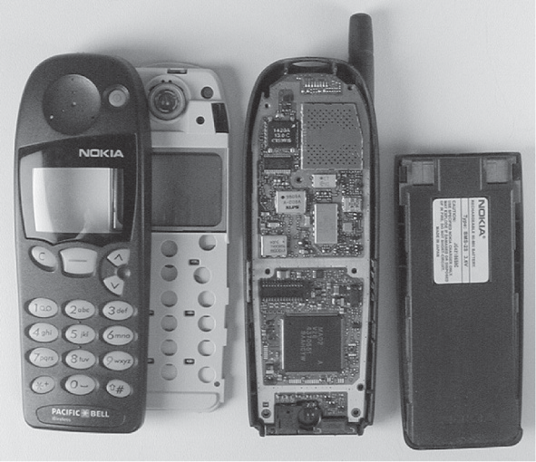

## Case Study: Inside a Cell Phone

Although gaming consoles and digital cameras are familiar embedded systems, today the most familiar embedded system is the cell phone. In 1999, there were 76 million cellular subscribers in the United States, a 25% growth rate from the year before. That growth rate is almost 35% per year worldwide, as developing countries find it much cheaper to install cellular towers than copper-wire-based infrastructure. Thus, in many countries, the number of cell phones in use exceeds the number of wired phones in use.

> 虽然游戏机和数码相机是我们熟悉的嵌入式系统，但如今最熟悉的嵌入式系统是手机。1999 年，美国有 7600 万手机用户，比前一年增长了 25%。这一增长率在全球范围内每年接近 35%，因为发展中国家发现安装蜂窝塔比基于铜线的基础设施便宜得多。因此，在许多国家，使用中的手机数量超过使用中的有线电话数量。

Not surprisingly, the cellular handset market is growing at 35% per year, with about 280 million cellular phone handsets sold worldwide in 1999. To put that in perspective, in the same year sales of personal computers were 120 million. These numbers mean that tremendous engineering resources are available to improve cell phones, and cell phones are probably leaders in engineering innovation per cubic inch [Grice and Kanellos 2000].

> 毫不奇怪，手机市场每年增长 35%，1999 年全球手机销量约为 2.8 亿部。从这个角度来看，同年个人电脑的销量为 1.2 亿部。这些数字意味着有大量的工程资源可用于改进手机，而手机可能是每立方英寸工程创新的领导者 [Grice 和 Kanellos 2000]。

Before unveiling the anatomy of a cell phone, let’s try a short introduction to **wireless technology**.

### Background on Wireless Networks

Networks can be created out of thin air as well as out of copper and glass, creating `wireless networks.` Much of this section is based on a report from the National Research Council [1997].

> 网络可以凭空创建，也可以用铜和玻璃创建 "无线网络" 。本节大部分内容基于国家研究委员会 [1997] 的报告。

A radio wave is an electromagnetic wave propagated by an antenna. Radio waves are modulated, which means that the sound signal is superimposed on the stronger radio wave that carries the sound signal, and hence is called the `carrier signal.` Radio waves have a particular wavelength or frequency: They are measured either as the length of the complete wave or as the number of waves per second. Long waves have low frequencies, and short waves have high frequencies. FM radio stations transmit on the band of 88 MHz to 108 MHz using frequency modulations (FM) to record the sound signal.

> 无线电波是通过天线传播的电磁波。无线电波是调制的，这意味着声音信号叠加在承载声音信号的较强无线电波上，因此称为 "载波信号" 。无线电波具有特定的波长或频率：它们被测量为长度 完整波的数量或每秒的波数。长波频率低，短波频率高。FM 广播电台使用频率调制 (FM) 在 88 MHz 至 108 MHz 的频带上传输以记录声音信号。

By tuning in to different frequencies, a radio receiver can pick up a specific signal. In addition to AM and FM radio, other frequencies are reserved for citizens band radio, television, pagers, air traffic control radar, Global Positioning System, and so on. In the United States, the Federal Communications Commission decides who gets to use which frequencies and for what purpose.

> 通过调谐到不同的频率，无线电接收器可以接收到特定的信号。除 AM 和 FM 收音机外，其他频率保留给民用波段广播、电视、寻呼机、空中交通管制雷达、全球定位系统等。在美国，联邦通信委员会决定谁可以使用哪些频率以及用于什么目的。

The `bit error rate` (BER) of a wireless link is determined by the received signal power, noise due to interference caused by the receiver hardware, interference from other sources, and characteristics of the channel. Noise is typically proportional to the radio frequency bandwidth, and a key measure is the `signal-to-noise ratio` (SNR) required to achieve a given BER. Figure E.14 lists more challenges for wireless communication.

> 无线链路的 "误码率" (BER) 由接收到的信号功率、由接收器硬件引起的干扰引起的噪声、来自其他来源的干扰以及信道特性决定。噪声通常与射频带宽成正比，一个关键指标是实现给定 BER 所需的 "信噪比" (SNR)。图 E.14 列出了无线通信的更多挑战。

Typically, wireless communication is selected because the communicating devices are mobile or because wiring is inconvenient, which means the wireless network must rearrange itself dynamically. Such rearrangement makes routing more challenging. A second challenge is that wireless signals are not protected and hence are subject to mutual interference, especially as devices move. Power is another challenge for wireless communication, both because the devices tend to be battery powered and because antennas radiate power to communicate and little of it reaches the receiver. As a result, raw bit error rates are typically a thousand to a million times higher than copper wire.

> 通常，选择无线通信是因为通信设备是移动的或者因为布线不方便，这意味着无线网络必须动态地重新布置。这种重新安排使路由更具挑战性。第二个挑战是无线信号不受保护，因此容易受到相互干扰，尤其是在设备移动时。电源是无线通信面临的另一个挑战，这既是因为设备往往由电池供电，也是因为天线会辐射能量进行通信，但很少有能量到达接收器。因此，原始误码率通常比铜线高一千到一百万倍。

Figure E.14 Challenges for wireless communication.

There are two primary architectures for wireless networks: `base station` architectures and `peer-to-peer` architectures. Base stations are connected by landlines for longer-distance communication, and the mobile units communicate only with a single local base station. Peer-to-peer architectures allow mobile units to communicate with each other, and messages hop from one unit to the next until delivered to the desired unit. Although peer-to-peer is more reconfigurable, base stations tend to be more reliable since there is only one hop between the device and the station. _Cellular telephony_, the most popular example of wireless networks, relies on radio with base stations.

> 无线网络有两种主要架构： "基站" 架构和 "对等" 架构。基站通过固定线路连接以进行长距离通信，移动单元仅与单个本地基站通信。对等体系结构允许移动单元相互通信，消息从一个单元跳到下一个单元，直到传递到所需的单元。尽管点对点更易于重新配置，但基站往往更可靠，因为设备和基站之间只有一跳。*蜂窝电话*是无线网络最流行的例子，它依赖于带有基站的无线电。

Cellular systems exploit exponential path loss to reuse the same frequency at spatially separated locations, thereby greatly increasing the number of customers served. Cellular systems will divide a city into nonoverlapping hexagonal cells that use different frequencies if nearby, reusing a frequency only when cells are far enough apart so that mutual interference is acceptable.

> 蜂窝系统利用指数路径损耗在空间分离的位置重复使用相同的频率，从而大大增加了服务的客户数量。蜂窝系统会将一个城市划分为不重叠的六边形小区，如果附近的小区使用不同的频率，只有当小区相距足够远以便可以接受相互干扰时才重新使用频率。

At the intersection of three hexagonal cells is a base station with transmitters and antennas that is connected to a switching office that coordinates handoffs when a mobile device leaves one cell and goes into another, as well as accepts and places calls over landlines. Depending on topography, population, and so on, the radius of a typical cell is 2 to 10 miles.

> 在三个六角形小区的交汇处是一个带有发射器和天线的基站，该基站连接到交换局，当移动设备离开一个小区并进入另一个小区时协调切换，以及通过固定电话接听和拨打电话。根据地形、人口等因素，典型小区的半径为 2 到 10 英里。

### The Cell Phone

[Figure E.15](#_bookmark590) shows the components of a radio, which is the heart of a cell phone. Radio signals are first received by the antenna, amplified, passed through a mixer, then filtered, demodulated, and finally decoded. The antenna acts as the interface between the medium through which radio waves travel and the electronics of the transmitter or receiver. Antennas can be designed to work best in particular directions, giving both transmission and reception directional properties. Modulation encodes information in the amplitude, phase, or frequency of the signal to increase its robustness under impaired conditions. Radio transmitters go through the same steps, just in the opposite order.

> [图 E.15](#_bookmark590) 显示收音机的组件，它是手机的心脏。无线电信号首先由天线接收、放大、通过混频器、然后滤波、解调，最后解码。天线充当无线电波传播所通过的介质与发射器或接收器的电子设备之间的接口。天线可以设计成在特定方向上工作最好，同时提供传输和接收方向特性。调制以信号的幅度、相位或频率对信息进行编码，以提高其在受损条件下的稳健性。无线电发射机经历相同的步骤，只是顺序相反。

Originally, all components were analog, but over time most were replaced by digital components, requiring the radio signal to be converted from analog to digital. The desire for flexibility in the number of radio bands led to software routines replacing some of these functions in programmable chips, such as digital signal processors. Because such processors are typically found in mobile devices, emphasis is placed on performance per joule to extend battery life, performance per square millimeter of silicon to reduce size and cost, and bytes per task to reduce memory size.

> 最初，所有组件都是模拟的，但随着时间的推移，大多数组件被数字组件取代，需要将无线电信号从模拟转换为数字。对无线电波段数量的灵活性的渴望导致软件例程取代了可编程芯片(例如数字信号处理器)中的其中一些功能。由于此类处理器通常用于移动设备，因此重点放在每焦耳性能以延长电池寿命、每平方毫米硅的性能以减小尺寸和成本以及每任务字节数以减小内存大小。

Figure E.15 A radio receiver consists of an antenna, radio frequency amplifier, mixer, filters, demodulator, and decoder. A mixer accepts two signal inputs and forms an output signal at the sum and difference frequencies. Filters select a narrower band of frequencies to pass on to the next stage. Modulation encodes information to make it more robust. Decoding turns signals into information. Depending on the application, all electrical components can be either analog or digital. For example, a car radio is all analog components, but a PC modem is all digital except for the amplifier. Today analog silicon chips are used for the RF amplifier and first mixer in cellular phones.

> 图 E.15 无线电接收机由天线、射频放大器、混频器、滤波器、解调器和解码器组成。混频器接受两个信号输入并形成和频和差频的输出信号。滤波器选择较窄的频带以传递到下一级。调制对信息进行编码以使其更加稳健。解码将信号转化为信息。根据应用的不同，所有电子元件都可以是模拟的或数字的。例如，汽车收音机全是模拟元件，但 PC 调制解调器除了放大器外全是数字元件。今天，模拟硅芯片被用于手机中的 RF 放大器和第一级混频器。

Figure E.16 Block diagram of a cell phone. The DSP performs the signal processing steps of [Figure E.15](#_bookmark590), and the microcontroller controls the user interface, battery management, and call setup. (Based on Figure 1.3 of Groe and Larson [2000].)

> 图 E.16 手机框图。DSP 执行[图 E.15](#_bookmark590) 的信号处理步骤，微控制器控制用户界面、电池管理和呼叫设置。(基于 Groe 和 Larson [2000] 的图 1.3。)

[Figure E.16](#_bookmark591) shows the generic block diagram of the electronics of a cell phone handset, with the DSP performing the signal processing and the microcontroller handling the rest of the tasks. Cell phone handsets are basically mobile computers acting as a radio. They include standard I/O devices—keyboard and LCD display—plus a microphone, speaker, and antenna for wireless networking. Battery efficiency affects sales, both for standby power when waiting for a call and for minutes of speaking.

> [图 E.16](#_bookmark591) 显示了手机电子设备的通用框图，其中 DSP 执行信号处理，微控制器处理其余任务。手机基本上是充当收音机的移动计算机。它们包括标准 I/O 设备(键盘和 LCD 显示器)以及用于无线网络的麦克风、扬声器和天线。电池效率会影响销售，无论是等待电话时的待机功率还是通话时间。

When a cell phone is turned on, the first task is to find a cell. It scans the full bandwidth to find the strongest signal, which it keeps doing every seven seconds or if the signal strength drops, since it is designed to work from moving vehicles. It then picks an unused radio channel. The local switching office registers the cell phone and records its phone number and electronic serial number, and assigns it a voice channel for the phone conversation. To be sure the cell phone got the right channel, the base station sends a special tone on it, which the cell phone sends back to acknowledge it. The cell phone times out after 5 seconds if it doesn’t hear the supervisory tone, and it starts the process all over again. The original base station makes a handoff request to the incoming base station as the signal strength drops offs.

> 手机开机后，首要任务就是找手机。它会扫描整个带宽以找到最强信号，它会每七秒扫描一次，或者在信号强度下降时扫描一次，因为它设计用于在移动的车辆上工作。然后它会选择一个未使用的无线电频道。本地交换局对手机进行登记并记录其电话号码和电子序列号，并为其分配通话语音通道。为了确保手机获得正确的频道，基站会在其上发送一个特殊的音调，手机会发回以确认它。如果没有听到监控音，手机将在 5 秒后超时，并重新开始该过程。当信号强度下降时，原始基站向传入基站发出切换请求。

To achieve a two-way conversation over radio, frequency bands are set aside for each direction, forming a frequency pair or `channel.` The original cellular base stations transmitted at 869.04 to 893.97 MHz (called the _forward path_), and cell phones transmitted at 824.04 to 848.97 MHz (called t*he reverse path*), with the frequency gap to keep them from interfering with each other. Cells might have had between 4 and 80 channels. Channels were divided into setup channels for call setup and voice channels to handle the data or voice traffic.

> 为了通过无线电实现双向通话，每个方向都预留了频段，形成一个频率对或 "信道" 。原始蜂窝基站以 869.04 至 893.97 MHz(称为*前向路径*)传输，手机传输 在 824.04 到 848.97 MHz(称为*反向路径*)，具有频率间隙以防止它们相互干扰。细胞可能有 4 到 80 个通道。信道分为用于呼叫建立的建立信道和用于处理数据或语音流量的语音信道。

The communication is done digitally, just like a modem, at 9600 bits/sec. Since wireless is a lossy medium, especially from a moving vehicle, the handset sends each message five times. To preserve battery life, the original cell phones typically transmit at two signal strengths—0.6 W and 3.0 W—depending on the distance to the cell. This relatively low power not only allows smaller batteries and thus smaller cell phones, but it also aids frequency reuse, which is the key to cellular telephony.

> 通信以数字方式完成，就像调制解调器一样，速度为 9600 位/秒。由于无线是一种有损介质，尤其是来自移动的车辆，手机将每条消息发送五次。为了延长电池寿命，最初的手机通常以两种信号强度传输——0.6 W 和 3.0 W——这取决于与电池的距离。这种相对较低的功率不仅允许使用更小的电池，从而使手机更小，而且还有助于频率重用，这是蜂窝电话的关键。

[Figure E.17](#_bookmark592) shows a circuit board from a Nokia digital phone, with the components identified. Note that the board contains two processors. A Z-80 microcontroller is responsible for controlling the functions of the board, I/O with the keyboard and display, and coordinating with the base station. The DSP handles all signal compression and decompression. In addition there are dedicated chips for analog-to-digital and digital-to-analog conversion, amplifiers, power management, and RF interfaces.

> [图 E.17](#_bookmark592) 显示了诺基亚数字电话的电路板，其中标识了组件。请注意，该板包含两个处理器。Z-80 微控制器负责控制板的功能、键盘和显示器的 I/O，并与基站协调。DSP 处理所有信号压缩和解压缩。此外，还有用于模数和数模转换、放大器、电源管理和射频接口的专用芯片。

In 2001, a cell phone had about 10 integrated circuits, including parts made in exotic technologies like gallium arsinide and silicon germanium as well as standard CMOS. The economics and desire for flexibility have shrunk this to just a few chips. However, these SOCs still contain a separate microcontroller and DSP, with code implementing many of the functions just described.

> 2001 年，一部手机有大约 10 个集成电路，包括采用特殊技术制造的部件，如砷化镓和硅锗以及标准 CMOS。经济性和对灵活性的渴望已经将其缩小到只有几个芯片。然而，这些 SOC 仍然包含一个单独的微控制器和 DSP，代码实现了刚刚描述的许多功能。

Figure E.17 Circuit board from a Nokia cell phone. (Courtesy HowStuffWorks, Inc.)

### Cell Phone Standards and Evolution

Improved communication speeds for cell phones were developed with multiple standards. `Code division multiple access` (CDMA), as one popular example, uses a wider radio frequency band for a path than the original cell phones, called `advanced mobile phone service` (AMPS), a mostly analog system. The wider frequency makes it more difficult to block and is called `spread spectrum.` Other standards are *time division multiple acces*s (TDMA) and `global system for mobile communication` (GSM). These second-generation standards—CDMA, GSM, and TDMA—are mostly digital.

> 改进的手机通信速度是通过多种标准开发的。作为一个流行的例子，"码分多址" (CDMA) 使用比原始手机更宽的无线电频带作为路径，称为 "高级移动电话服务" (AMPS)，这是一种主要是模拟的系统。更宽的频率使其更难阻塞，称为 "扩频" 。其他标准是*时分多址* (TDMA) 和 "全球移动通信系统" (GSM)。这些第二代标准——CDMA、GSM 和 TDMA——大多是数字的。

The big difference for CDMA is that all callers share the same channel, which operates at a much higher rate, and it then distinguishes the different calls by encoding each one uniquely. Each CDMA phone call starts at 9600 bits/sec; it is then encoded and transmitted as equal-sized messages at 1.25 Mbits/sec. Rather than send each signal five times as in AMPS, each bit is stretched so that it takes 11 times the minimum frequency, thereby accommodating interference and yet successful transmission. The base station receives the messages, and it separates them into the separate 9600 bit/sec streams for each call.

> CDMA 的最大区别在于所有呼叫者共享同一个信道，该信道以更高的速率运行，然后通过对每个呼叫进行唯一编码来区分不同的呼叫。每个 CDMA 电话呼叫的起始速率为 9600 位/秒；然后将其编码并以 1.25 Mbits/sec 的速度作为等大小的消息传输。与在 AMPS 中发送每个信号五次不同，每个位都被拉伸，使其占用最小频率的 11 倍，从而适应干扰并成功传输。基站接收消息，并将它们分成单独的 9600 比特/秒流用于每个呼叫。

To enhance privacy, CDMA uses pseudorandom sequences from a set of 64 predefined codes. To synchronize the handset and base station so as to pick a common pseudorandom seed, CDMA relies on a clock from the Global Positioning System, which continuously transmits an accurate time signal. By carefully selecting the codes, the shared traffic sounds like random noise to the listener. Hence, as more users share a channel there is more noise, and the signal-to-noise ratio gradually degrades. Thus, the capacity of the CDMA system is a matter of taste, depending upon the sensitivity of the listener to background noise.

> 为了增强隐私性，CDMA 使用来自一组 64 个预定义代码的伪随机序列。为了使手机和基站同步以选择一个共同的伪随机种子，CDMA 依赖于来自全球定位系统的时钟，该时钟连续传输准确的时间信号。通过仔细选择代码，共享的流量对听众来说听起来像是随机噪音。因此，随着越来越多的用户共享一个频道，就会有更多的噪音，信噪比也会逐渐降低。因此，CDMA 系统的容量是一个品味问题，取决于听众对背景噪声的敏感度。

In addition, CDMA uses speech compression and varies the rate of data transferred depending upon how much activity is going on in the call. Both these techniques preserve bandwidth, which allows for more calls per cell. CDMA must regulate power carefully so that signals near the cell tower do not overwhelm those from far away, with the goal of all signals reaching the tower at about the same level. The side benefit is that CDMA handsets emit less power, which both helps battery life and increases capacity when users are close to the tower.

> 此外，CDMA 使用语音压缩并根据通话中的活动量改变数据传输速率。这两种技术都保留了带宽，从而允许每个小区进行更多呼叫。CDMA 必须谨慎地调节功率，以使信号塔附近的信号不会压倒远处的信号，目标是所有信号以大致相同的水平到达信号塔。附带的好处是 CDMA 手机发出的功率更少，这既有助于延长电池寿命，又能在用户靠近信号塔时增加容量。

Thus, compared to AMPS, CDMA improves the capacity of a system by up to an order of magnitude, has better call quality, has better battery life, and enhances users’ privacy. After considerable commercial turmoil, there is a new thirdgeneration standard called `International Mobile Telephony 2000` (IMT-2000), based primarily on two competing versions of CDMA and one TDMA. This standard may lead to cell phones that work anywhere in the world.

> 因此，与 AMPS 相比，CDMA 将系统容量提高了一个数量级，具有更好的通话质量、更长的电池寿命并增强了用户的隐私。在经历了相当大的商业动荡之后，出现了一种新的第三代标准，称为 "国际移动电话 2000" (IMT-2000)，主要基于两个竞争版本的 CDMA 和一个 TDMA。该标准可能会导致手机可以在世界任何地方使用。
