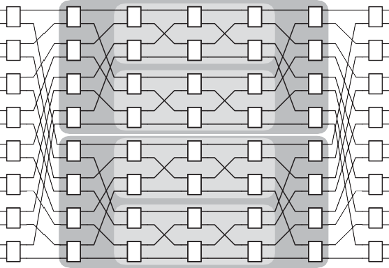
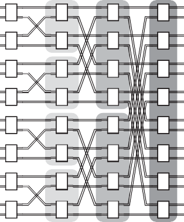

## Network Topology

When the number of devices is small enough, a single switch is sufficient to inter- connect them within a switched-media network. However, the number of `switch ports` is limited by existing very-large-scale integration (VLSI) technology, cost considerations, power consumption, and so on. When the number of required `net- work ports` exceeds the number of ports supported by a single switch, a fabric of interconnected switches is needed. To embody the necessary property of `full access` (i.e., `connectedness`), the network switch fabric must provide a path from every end node device to every other device. All the connections to the network fabric and between switches within the fabric use point-to-point links as opposed to shared links—that is, links with only one switch or end node device on either end. The interconnection structure across all the components—including switches, links, and end node devices—is referred to as the network `topology`.

> 当设备数量足够少时，单个交换机就足以将它们互连在交换媒体网络中。然而，"交换机端口" 的数量受到现有超大规模集成 (VLSI) 技术、成本考虑、功耗等因素的限制。当所需的 "网络端口" 数量超过单个交换机支持的端口数量时，就需要互连交换机的结构。为了体现 "完全访问" (即 "连通性" )的必要属性，网络交换结构必须提供从每个终端节点设备到每个其他设备的路径。与网络结构和结构内交换机之间的所有连接都使用点对点链路而不是共享链路，即两端只有一个交换机或终端节点设备的链路。跨所有组件(包括交换机、链路和终端节点设备)的互连结构称为网络 "拓扑" 。

The number of network topologies described in the literature would be difficult to count, but the number that have been used commercially is no more than about a dozen or so. During the 1970s and early 1980s, researchers struggled to propose new topologies that could reduce the number of switches through which packets must traverse, referred to as the `hop count`. In the 1990s, thanks to the introduction of pipelined transmission and switching techniques, the hop count became less crit- ical. Nevertheless, today, topology is still important, particularly for OCNs and SANs, as subtle relationships exist between topology and other network design parameters that impact performance, especially when the number of end nodes is very large (e.g., 64 K in the Blue Gene/L supercomputer) or when the latency is critical (e.g., in multicore processor chips). Topology also greatly impacts the implementation cost of the network.

> 文献中描述的网络拓扑数量难以统计，但商业上使用的不超过十几种。在 1970 年代和 80 年代初期，研究人员努力提出新的拓扑结构，以减少数据包必须经过的交换机数量，称为 "跳数" 。在 1990 年代，由于引入了流水线传输和交换技术，跳数变得不那么重要了。然而，今天，拓扑仍然很重要，特别是对于 OCN 和 SAN，因为拓扑和影响性能的其他网络设计参数之间存在微妙的关系，特别是当端节点数量非常大时(例如，蓝色基因中的 64 K / L 超级计算机)或当延迟很关键时(例如，在多核处理器芯片中)。拓扑结构也会极大地影响网络的实施成本。

Topologies for parallel supercomputer SANs have been the most visible and imaginative, usually converging on regularly structured ones to simplify routing, packaging, and scalability. Those for LANs and WANs tend to be more haphazard or ad hoc, having more to do with the challenges of long distance or connecting across different communication subnets. Switch-based topologies for OCNs are only recently emerging but are quickly gaining in popularity. This section describes the more popular topologies used in commercial products. Their advan- tages, disadvantages, and constraints are also briefly discussed.

> 并行超级计算机 SAN 的拓扑结构是最明显和最有想象力的，通常汇聚在规则结构的拓扑结构上以简化路由、打包和可扩展性。用于 LAN 和 WAN 的那些往往更加随意或临时，更多地与长距离或跨不同通信子网连接的挑战有关。OCN 的基于交换机的拓扑最近才出现，但迅速流行起来。本节介绍商业产品中使用的更流行的拓扑。还简要讨论了它们的优点、缺点和限制。

### Centralized Switched Networks

As mentioned above, a single switch suffices to interconnect a set of devices when the number of switch ports is equal to or larger than the number of devices. This simple network is usually referred to as a `crossbar` or `crossbar switch`. Within the crossbar, crosspoint switch complexity increases quadratically with the number of ports, as illustrated in [Figure F.11(a)](#_bookmark609). Thus, a cheaper solution is desirable when the number of devices to be interconnected scales beyond the point supportable by implementation technology.

> 如上所述，当交换机端口数量等于或大于设备数量时，单个交换机足以互连一组设备。这个简单的网络通常被称为 "crossbar" 或 "crossbar switch" 。在交叉开关内，交叉点开关的复杂性随端口数量呈二次方增长，如 [图 F.11(a)](#_bookmark609) 所示。因此，当要互连的设备数量超过实现技术可支持的点时，需要更便宜的解决方案。

A common way of addressing the crossbar scaling problem consists of splitting the large crossbar switch into several stages of smaller switches interconnected in such a way that a single pass through the switch fabric allows any destination to be reached from any source. Topologies arranged in this way are usually referred to as `multistage interconnection networks` or `multistage switch fabrics`, and these net- works typically have complexity that increases in proportion to `N` log `N`. Multistage interconnection networks (MINs) were initially proposed for telephone exchanges in the 1950s and have since been used to build the communication backbone for parallel supercomputers, symmetric multiprocessors, multicomputer clusters, and IP router switch fabrics.

> 解决 crossbar 缩放问题的一种常见方法包括将大型 crossbar 交换机拆分为若干级的较小交换机，这些交换机以这样一种方式互连，即通过交换机结构的单次传递允许从任何源到达任何目的地。以这种方式排列的拓扑通常称为 "多级互连网络" 或 "多级交换结构" ，这些网络的复杂性通常与 "N" log "N" 成比例增加。多级互连网络 (MIN) 最初是在 1950 年代为电话交换机提出的，此后被用于构建并行超级计算机、对称多处理器、多计算机集群和 IP 路由器交换结构的通信骨干网。

Figure F.11 Popular centralized switched networks: (a) the crossbar network requires `N`\_2 crosspoint switches, shown as black dots; (b) the Omega, a MIN, requires `N`/2 log2 `N` switches, shown as vertical rectangles. End node devices are shown as numbered squares (total of eight). Links are unidirectional—data enter at the left and exit out the top or right.

> 图 F.11 流行的集中式交换网络：(a) crossbar 网络需要 `N`\_2 个交叉点开关，如黑点所示；(b) Omega，一个 MIN，需要 `N`/2 log2 `N` 开关，显示为垂直矩形。终端节点设备显示为带编号的方块(总共八个)。链接是单向的——数据从左侧进入，从顶部或右侧退出。

The interconnection pattern or patterns between MIN stages are permutations that can be represented mathematically by a set of functions, one for each stage. [Figure F.11(b)](#_bookmark609) shows a well-known MIN topology, the `Omega`, which uses the perfect-shuffle permutation as its interconnection pattern for each stage, followed by exchange switches, giving rise to a `perfect-shuffle exchange` for each stage. In this example, eight input-output ports are interconnected with three stages of 2 2 switches. It is easy to see that a single pass through the three stages allows any input port to reach any output port. In general, when using `k k` switches, a MIN with `N` input-output ports requires at least log*k N* stages, each of which contains `N/k` switches, for a total of `N`/_k_ (log*k N*) switches.

> MIN 阶段之间的互连模式或模式是排列，可以用一组函数在数学上表示，每个阶段一个。[图 F.11(b)](#_bookmark609) 显示了一个著名的 MIN 拓扑结构，即 "Omega" ，它使用完美随机排列作为每个阶段的互连模式，然后是交换开关，从而产生 每个阶段的 "完美洗牌交换" 。在此示例中，八个输入输出端口与三级 2 2 开关互连。很容易看出，单次通过三个阶段允许任何输入端口到达任何输出端口。通常，当使用 "k k" 开关时，具有 "N" 个输入输出端口的 MIN 至少需要 log*k N* 个阶段，每个阶段都包含 "N/k" 个开关，对于 总共 `N`/_k_ (log*k N*) 个开关。

Despite their internal structure, MINs can be seen as centralized switch fabrics that have end node devices connected at the network periphery, hence the name `centralized switched network`. From another perspective, MINs can be viewed as interconnecting nodes through a set of switches that may not have any nodes directly connected to them, which gives rise to another popular name for central- ized switched networks—_indirect networks_.

> 尽管具有内部结构，但 MIN 可以看作是集中式交换结构，其终端节点设备连接在网络外围，因此得名 "集中式交换网络" 。从另一个角度来看，MIN 可以被视为通过一组交换机互连的节点，这些交换机可能没有任何节点直接连接到它们，这产生了集中式交换网络的另一个流行名称——间接网络。

Example Compute the cost of interconnecting 4096 nodes using a single crossbar switch relative to doing so using a MIN built from 2 2, 4 4, and 16 16 switches. Con- sider separately the relative cost of the unidirectional links and the relative cost of the switches. Switch cost is assumed to grow quadratically with the number of input (alternatively, output) ports, `k`, for `k` × `k` switches.

> 示例 计算使用单个交叉开关互连 4096 个节点的成本，相对于使用由 2 2、4 4 和 16 16 开关构建的 MIN 进行互连的成本。分别考虑单向链路的相对成本和交换机的相对成本。对于 `k` × `k` 开关，假设开关成本随着输入(或者输出)端口的数量 k 呈二次方增长。

_Answer_ The switch cost of the network when using a single crossbar is proportional to 4096*2. The unidirectional link cost is 8192, which accounts for the set of links from the end nodes to the crossbar and also from the crossbar back to the end nodes. When using a MIN with `k k` switches, the cost of each switch is proportional to `k`\_2 but there are 4096/\_k* (log*k* 4096) total switches. Likewise, there are (log*k* 4096) stages of `N` unidirectional links per stage from the switches plus `N` links to the MIN from the end nodes. Therefore, the relative costs of the crossbar with respect to each MIN is given by the following:

> _Answer_ 使用单个交叉开关时网络的切换成本与 4096*2 成正比。单向链路成本为 8192，它考虑了从端节点到交叉开关以及从交叉开关回到端节点的链路集。当使用带有 `k k` 开关的 MIN 时，每个开关的成本与 `k`\_2 成正比，但总共有 4096/\_k* (log*k* 4096) 开关。同样，有 (log*k* 4096) 个阶段，每个阶段从交换机开始有 "N" 个单向链路，加上从终端节点到 MIN 的 "N" 个链路。因此，crossbar 相对于每个 MIN 的相对成本由下式给出：

In all cases, the single crossbar has much higher switch cost than the MINs. The most dramatic reduction in cost comes from the MIN composed from the smallest sized but largest number of switches, but it is interesting to see that the MINs with 2 × 2 and 4 × 4 switches yield the same relative switch cost. The relative link cost of the crossbar is lower than the MINs, but by less than an order of magnitude in all cases. We must keep in mind that end node links are different from switch links in their length and packaging requirements, so they usually have different associ- ated costs. Despite the lower link cost, the crossbar has higher overall relative cost.

> 在所有情况下，单个交叉开关的开关成本都比 MIN 高得多。最显着的成本降低来自由尺寸最小但数量最多的开关组成的 MIN，但有趣的是，具有 2 × 2 和 4 × 4 开关的 MIN 产生相同的相对开关成本。crossbar 的相对链路成本低于 MIN，但在所有情况下都低于一个数量级。我们必须牢记，端节点链路在长度和封装要求方面不同于交换机链路，因此它们通常具有不同的相关成本。尽管链路成本较低，但交叉开关的总体相对成本较高。

The reduction in switch cost of MINs comes at the price of performance: con- tention is more likely to occur on network links, thus degrading performance. Con- tention in the form of packets `blocking` in the network arises due to paths from different sources to different destinations simultaneously sharing one or more links. The amount of contention in the network depends on communication traffic behavior. In the Omega network shown in [Figure F.11(b)](#_bookmark609), for example, a packet from port 0 to port 1 blocks in the first stage of switches while waiting for a packet from port 4 to port 0. In the crossbar, no such blocking occurs as links are not shared among paths to unique destinations. The crossbar, therefore, is `nonblock- ing`. Of course, if two nodes try to send packets to the same destination, there will be blocking at the reception link even for crossbar networks. This is accounted for by the average reception factor parameter (σ) when analyzing performance, as dis- cussed at the end of the previous section.

> MIN 交换成本的降低是以性能为代价的：竞争更有可能发生在网络链路上，从而降低性能。由于从不同来源到不同目的地的路径同时共享一个或多个链接，因此网络中以数据包 "阻塞" 形式出现的竞争。网络中的争用量取决于通信流量行为。在[图 F.11(b)](#_bookmark609)所示的 Omega 网络中，例如，从端口 0 到端口 1 的数据包在交换机的第一阶段阻塞，同时等待从端口 4 到端口 0 的数据包。在交叉开关中，不会发生这种阻塞，因为链接不会在通往唯一目的地的路径之间共享。因此，crossbar 是 "非阻塞的" 。当然，如果两个节点试图向同一个目的地发送数据包，即使是交叉网络，在接收链路上也会出现阻塞。正如上一节末尾所讨论的，在分析性能时，这是由平均接收因子参数 (σ) 解释的。

To reduce blocking in MINs, extra switches must be added or larger ones need to be used to provide alternative paths from every source to every destination. The first commonly used solution is to add a minimum of log*k N* 1 extra switch stages to the MIN in such a way that they mirror the original topology. The resulting net- work is `rearrangeably nonblocking` as it allows nonconflicting paths among new source-destination pairs to be established, but it also doubles the hop count and could require the paths of some existing communicating pairs to be rearranged under some centralized control. The second solution takes a different approach. Instead of using more switch stages, larger switches—which can be implemented by multiple stages if desired—are used in the middle of two other switch stages in such a way that enough alternative paths through the middle-stage switches allow for nonconflicting paths to be established between the first and last stages. The best-known example of this is the Clos network, which is nonblocking. The multi- path property of the three-stage Clos topology can be recursively applied to the middle-stage switches to reduce the size of all the switches down to 2 2, assum- ing that switches of this size are used in the first and last stages to begin with. What results is a Beneŝ topology consisting of 2(log*2 N*) 1 stages, which is rearrange- ably nonblocking. [Figure F.12(a)](#_bookmark610) illustrates both topologies, where all switches not in the first and last stages comprise the middle-stage switches (recursively) of the Clos network.

> 为了减少 MIN 中的阻塞，必须添加额外的开关或需要使用更大的开关来提供从每个源到每个目的地的替代路径。第一个常用的解决方案是将最少 log*k N* 1 个额外开关级添加到 MIN，以使其镜像原始拓扑。由此产生的网络是 "可重新排列的非阻塞" ，因为它允许在新的源-目的地对之间建立非冲突路径，但它也会使跳数加倍，并且可能需要在某些集中控制下重新排列某些现有通信对的路径。第二种解决方案采用不同的方法。不是使用更多的开关级，而是在其他两个开关级的中间使用更大的开关(如果需要可以由多个级实现)，这样通过中间级开关的足够多的替代路径允许不冲突的路径是 建立在第一阶段和最后阶段之间。最著名的例子是 Clos 网络，它是非阻塞的。三级 Clos 拓扑的多路径属性可以递归地应用于中间级开关，以将所有开关的大小减少到 2 2，假设这种大小的开关用于第一个和最后一个 阶段开始。结果是一个由 2(log*2 N*) 1 个阶段组成的 Beneŝ 拓扑，它是可重新排列的非阻塞的。[图 F.12(a)](#_bookmark610) 说明了这两种拓扑结构，其中所有不在第一级和最后一级的交换机都构成了 Clos 网络的中间级交换机(递归地)。

The MINs described so far have unidirectional network links, but bidirectional forms are easily derived from symmetric networks such as the Clos and Beneŝ sim- ply by folding them. The overlapping unidirectional links run in different direc- tions, thus forming bidirectional links, and the overlapping switches merge into a single switch with twice the ports (i.e., 4 4 switch). [Figure F.12(b)](#_bookmark610) shows the resulting folded Beneŝ topology but in this case with the end nodes connected

> 到目前为止描述的 MIN 具有单向网络链接，但双向形式很容易从对称网络(例如 Clos 和 Beneŝ)中简单地通过折叠它们来导出。重叠的单向链路在不同的方向上运行，从而形成双向链路，并且重叠的交换机合并为具有两倍端口的单个交换机(即 4 4 交换机)。[图 F.12(b)](#_bookmark610) 显示了最终的折叠 Beneŝ 拓扑，但在这种情况下连接了端节点

Figure F.12 Two Beneŝ networks. (a) A 16-port Clos topology, where the middle-stage switches shown in the darker shading are implemented with another Clos network whose middle-stage switches shown in the lighter shading are implemented with yet another Clos network, and so on, until a Beneŝ network is produced that uses only 2 2 switches everywhere. (b) A folded Beneŝ network (bidirectional) in which 4 4 switches are used; end nodes attach to the innermost set of the Beneŝ network (unidirectional) switches. This topology is equivalent to a fat tree, where tree vertices are shown in shades.

> 图 F.12 两个 Beneŝ 网络。(a) 一个 16 端口的 Clos 拓扑结构，其中深色阴影中显示的中间级交换机与另一个 Clos 网络实现，其浅色阴影中显示的中间级交换机与另一个 Clos 网络实现，依此类推，直到 一个 Beneŝ 网络在任何地方都只使用 2 2 个交换机。(b) 一个折叠的 Beneŝ 网络(双向)，其中使用了 4 个 4 个交换机；端节点连接到最里面的一组 Beneŝ 网络(单向)交换机。此拓扑相当于一棵胖树，其中树的顶点以阴影显示。

to the innermost switch stage of the original Beneŝ. Ports remain free at the other side of the network but can be used for later expansion of the network to larger sizes. These kind of networks are referred to as `bidirectional multistage intercon- nection networks.` Among many useful properties of these networks are their mod- ularity and their ability to exploit communication locality, which saves packets from having to hop across all network stages. Their regularity also reduces routing complexity and their multipath property enables traffic to be routed more evenly across network resources and to tolerate faults.

> 到原始 Beneŝ 的最内向开关阶段。端口在网络的另一侧保持免费，但可用于以后将网络扩展到更大的尺寸。这些网络称为_bidirectional 多阶段互连网络。它们的规律性还降低了路由的复杂性，其多路径属性使流量可以在网络资源之间更均匀地路由并容忍故障。

Another way of deriving bidirectional MINs with nonblocking (rearrangeable) properties is to form a balanced tree, where end node devices occupy leaves of the tree and switches occupy vertices within the tree. Enough links in each tree level must be provided such that the total link bandwidth remains constant across all levels. Also, except for the root, switch ports for each vertex typically grow as `k_i k_i`, where `i` is the tree level. This can be accomplished by using `k_i`_—1 total switches at each vertex, where each switch has `k` input and `k` output ports, or `k` bidirectional ports (i.e., `k k` input-output ports). Networks having such topologies are called `fat tree` networks. As only half of the `k` bidirectional ports are used in each direction, 2 `N`/\_k_ switches are needed in each stage, totaling 2 `N`/_k_ (log*k*/2 `N`) switches in the fat tree. The number of switches in the root stage can be halved as no forward links are needed, reducing switch count by `N/k`. [Figure F.12(b)](#_bookmark610) shows a fat tree for 4 4 switches. As can be seen, this is identical to the folded Beneŝ.

> 导出具有非阻塞(可重新排列)属性的双向 MIN 的另一种方法是形成平衡树，其中终端节点设备占据树的叶子，交换机占据树内的顶点。必须在每个树级别中提供足够的链接，以便所有级别的总链接带宽保持不变。此外，除了根之外，每个顶点的交换机端口通常增长为 "k*i k_i" ，其中 "i" 是树级别。这可以通过在每个顶点使用 `k_i`*-1 个开关来实现，其中每个开关有 `k` 输入和 `k` 输出端口，或 `k` 双向端口(即 `k k` 输入输出端口) . 具有这种拓扑结构的网络称为 "胖树" 网络。由于每个方向只使用 `k` 个双向端口的一半，因此每个阶段需要 2 个 `N`/_k_ 开关，总共 2 `N`/_k_ (log*k*/2 `N  `) 在胖树中切换。由于不需要前向链路，根级中的交换机数量可以减半，从而将交换机数量减少 "N/k" 。[图 F.12(b)](#_bookmark610) 显示了 4 4 个开关的胖树。可以看出，这与折叠的 Beneŝ 相同。

The fat tree is the topology of choice across a wide range of network sizes for most commercial systems that use multistage interconnection networks. Most SANs used in multicomputer clusters, and many used in the most powerful supercomputers, are based on fat trees. Commercial communication subsystems offered by Myrinet, Mellanox, and Quadrics are also built from fat trees.

> 对于使用多级互连网络的大多数商业系统，胖树是各种网络规模的首选拓扑。大多数用于多计算机集群的 SAN，以及许多用于最强大的超级计算机的 SAN，都是基于胖树。Myrinet、Mellanox 和 Quadrics 提供的商业通信子系统也是由胖树构建的。

### Distributed Switched Networks

> [!note]
> 分布式交换网络，看这标题觉得还可以哈

Switched-media networks provide a very flexible framework to design communi- cation subsystems external to the devices that need to communicate, as presented above. However, there are cases where it is convenient to more tightly integrate the end node devices with the network resources used to enable them to communicate. Instead of centralizing the switch fabric in an external subsystem, an alternative approach is to distribute the network switches among the end nodes, which then become `network nodes` or simply `nodes`, yielding a `distributed switched network`. As a consequence, each network switch has one or more end node devices directly connected to it, thus forming a network node. These nodes are directly connected to other nodes without indirectly going through some external switch, giving rise to another popular name for these networks—_direct networks_.

> 交换媒体网络提供了一个非常灵活的框架来设计需要通信的设备外部的通信子系统，如上所述。然而，在某些情况下，将终端节点设备与用于使它们能够通信的网络资源更紧密地集成起来会很方便。另一种方法不是将交换结构集中在外部子系统中，而是将网络交换机分布在终端节点之间，这些终端节点随后成为 "网络节点" 或简称为 "节点" ，从而产生 "分布式交换网络" 。因此，每个网络交换机都有一个或多个终端节点设备直接连接到它，从而形成一个网络节点。这些节点直接连接到其他节点，而无需间接通过某些外部交换机，从而为这些网络产生了另一个流行的名称——_直接网络_。

The topology for distributed switched networks takes on a form much differ- ent from centralized switched networks in that end nodes are connected across the area of the switch fabric, not just at one or two of the peripheral edges of the fabric. This causes the number of switches in the system to be equal to the total number of nodes. A quite obvious way of interconnecting nodes consists of connecting a dedicated link between each node and every other node in the network. This `fully connected` topology provides the best connectivity (full con- nectivity in fact), but it is more costly than a crossbar network, as the following example shows.

> 分布式交换网络的拓扑结构与集中式交换网络有很大不同，因为终端节点跨交换结构区域连接，而不仅仅是在结构的一两个外围边缘连接。这导致系统中的交换机数量等于节点总数。一种非常明显的互连节点的方法包括在网络中的每个节点和每个其他节点之间连接一条专用链路。这种 "完全连接" 的拓扑结构提供了最好的连接性(实际上是完全连接)，但它比交叉网络更昂贵，如下例所示。

Example Compute the cost of interconnecting `N` nodes using a fully connected topology rel- ative to doing so using a crossbar topology. Consider separately the relative cost of the unidirectional links and the relative cost of the switches. Switch cost is assumed to grow quadratically with the number of unidirectional ports for `k` × `k` switches but to grow only linearly with 1 × `k` switches.

> 示例 相对于使用交叉拓扑，使用完全连接的拓扑计算互连 "N" 节点的成本。分别考虑单向链路的相对成本和交换机的相对成本。假设开关成本随着 `k` × `k` 开关的单向端口数量呈二次方增长，但仅随着 1 × `k` 开关线性增长。

_Answer_ The crossbar topology requires an `N N` switch, so the switch cost is proportional to `N` _2. The link cost is 2*N*, which accounts for the unidirectional links from the end nodes to the centralized crossbar, and `vice versa`. In the fully connected topology, two sets of 1 (\_N_ 1) switches (possibly merged into one set) are used in each of the `N` nodes to connect nodes directly to and from all other nodes. Thus, the total switch cost for all `N` nodes is proportional to 2*N*(_N_ 1). Regarding link cost, each of the `N` nodes requires two unidirectional links in opposite directions between its end node device and its local switch. In addition, each of the `N` nodes has `N` 1 unidirectional links from its local switch to other switches distributed across all the other end nodes. Thus, the total number of unidirectional links is 2*N* +_N_(_N_ 1), which is equal to `N`(_N_ + 1) for all `N` nodes. The relative costs of the fully connected topology with respect to the crossbar is, therefore, the following:

> _Answer_ crossbar 拓扑需要一个 "N N" 开关，因此开关成本与 "N" _2 成正比。链路成本是 2*N*，它考虑了从端节点到集中式交叉开关的单向链路，反之亦然。在全连接拓扑中，在每个 "N" 节点中使用两组 1 (\_N_ 1) 个开关(可能合并为一组)以将节点直接连接到所有其他节点或从所有其他节点连接。因此，所有 "N" 个节点的总切换成本与 2*N*(_N_1) 成正比。关于链路成本，"N" 个节点中的每一个都需要在其终端节点设备与其本地交换机之间反向的两条单向链路。此外，"N" 个节点中的每个节点都具有从其本地交换机到分布在所有其他终端节点上的其他交换机的 "N" 1 个单向链路。因此，单向链接的总数为 2*N* +\_N_(_N_ 1)，对于所有 `N` 个节点，它等于 `N`(_N_ + 1)。因此，全连接拓扑相对于 crossbar 的相对成本如下：

As the number of interconnected devices increases, the switch cost of the fully connected topology is nearly double the crossbar, with both being very high (i.e., quadratic growth). Moreover, the fully connected topology always has higher relative link cost, which grows linearly with the number of nodes. Again, keep in mind that end node links are different from switch links in their length and pack- aging, particularly for direct networks, so they usually have different associated costs. Despite its higher cost, the fully connected topology provides no extra per- formance benefits over the crossbar as both are nonblocking. Thus, crossbar net- works are usually used in practice instead of fully connected networks.

> 随着互连设备数量的增加，全连接拓扑的开关成本几乎是交叉开关的两倍，两者都非常高(即二次增长)。此外，全连接拓扑总是具有较高的相对链接成本，其随节点数量线性增长。同样，请记住，终端节点链路在长度和封装方面与交换机链路不同，特别是对于直接网络，因此它们通常具有不同的相关成本。尽管成本较高，但完全连接的拓扑结构并没有提供比 crossbar 额外的性能优势，因为两者都是非阻塞的。因此，在实践中通常使用交叉网络而不是全连接网络。

A lower-cost alternative to fully connecting all nodes in the network is to directly connect nodes in sequence along a `ring` topology, as shown in [Figure F.13](#_bookmark611). For bidirectional rings, each of the `N` nodes now uses only 3 3 switches and just two bidirectional network links (shared by neighboring nodes), for a total of `N` switches and `N` bidirectional network links. This linear cost excludes the `N` injection-reception bidirectional links required within nodes.

> 完全连接网络中所有节点的一种成本较低的替代方法是沿着 "环形" 拓扑按顺序直接连接节点，如[图 F.13](#_bookmark611) 所示。对于双向环，"N" 个节点中的每个节点现在仅使用 3 3 个交换机和两个双向网络链路(由相邻节点共享)，总共有 "N" 个交换机和 "N" 个双向网络链路。此线性成本不包括节点内所需的 "N" 个注入-接收双向链接。

Unlike shared-media networks, rings can allow many simultaneous transfers: the first node can send to the second while the second sends to the third, and so on. However, as dedicated links do not exist between logically nonadjacent node pairs, packets must hop across intermediate nodes before arriving at their destination, increasing their transport latency. For bidirectional rings, packets can be trans- ported in either direction, with the shortest path to the destination usually being the one selected. In this case, packets must travel `N`/4 network switch hops, on average, with total switch hop count being one more to account for the local switch at the packet source node. Along the way, packets may block on network resources due to other packets contending for the same resources simultaneously.

> 与共享媒体网络不同，环可以允许多个同时传输：第一个节点可以向第二个节点发送数据，而第二个节点可以向第三个节点发送数据，依此类推。然而，由于逻辑上不相邻的节点对之间不存在专用链路，因此数据包必须在到达目的地之前跳过中间节点，从而增加了传输延迟。对于双向环，数据包可以在任一方向传输，通常选择到达目的地的最短路径。在这种情况下，数据包平均必须经过 "N" /4 个网络交换机跳数，总交换机跳数要多一个，以说明数据包源节点处的本地交换机。在此过程中，由于其他数据包同时竞争相同的资源，数据包可能会阻塞网络资源。

Fully connected and ring-connected networks delimit the two extremes of dis- tributed switched topologies, but there are many points of interest in between for a given set of cost-performance requirements. Generally speaking, the ideal switched-media topology has cost approaching that of a ring but performance approaching that of a fully connected topology. [Figure F.14](#_bookmark612) illustrates three pop- ular direct network topologies commonly used in systems spanning the cost- performance spectrum. All of them consist of sets of nodes arranged along multiple dimensions with a regular interconnection pattern among nodes that can be expressed mathematically. In the `mesh` or `grid` topology, all the nodes in each dimension form a linear array. In the `torus` topology, all the nodes in each dimen- sion form a ring. Both of these topologies provide direct communication to neigh- boring nodes with the aim of reducing the number of hops suffered by packets in the network with respect to the ring. This is achieved by providing greater connec- tivity through additional dimensions, typically no more than three in commercial systems. The `hypercube` or `n-cube` topology is a particular case of the mesh in which only two nodes are interconnected along each dimension, leading to a num- ber of dimensions, `n`, that must be large enough to interconnect all `N` nodes in the system (i.e., `n` =log2 `N`). The hypercube provides better connectivity than meshes and tori at the expense of higher link and switch costs, in terms of the number of links and number of ports per node.

> 全连接和环连接网络划定了分布式交换拓扑的两个极端，但对于一组给定的成本性能要求，两者之间有许多兴趣点。一般来说，理想的交换媒体拓扑的成本接近于环形，但性能接近于全连接拓扑。[图 F.14](#_bookmark612) 说明了跨越成本性能范围的系统中常用的三种流行的直接网络拓扑。它们全部由沿多个维度排列的节点集组成，节点之间具有可以数学表达的规则互连模式。在 "网状" 或 "网格" 拓扑中，每个维度中的所有节点形成一个线性阵列。在 "torus" 拓扑中，每个维度中的所有节点形成一个环。这两种拓扑都提供与相邻节点的直接通信，目的是减少网络中数据包相对于环的跳数。这是通过额外的维度提供更大的连接性来实现的，在商业系统中通常不超过三个。"超立方体" 或 "n 立方体" 拓扑是网格的一种特殊情况，其中每个维度上只有两个节点互连，导致一定数量的维度 "n" 必须足够大以互连所有节点 系统中的 `N` 个节点(即 `n` =log2 `N`)。超立方体提供了比网格和圆环更好的连接性，但代价是链路和交换机成本更高，就链路数量和每个节点的端口数量而言。

Figure F.13 A ring network topology, folded to reduce the length of the longest link. Shaded circles represent switches, and black squares represent end node devices. The gray rectangle signifies a network node consisting of a switch, a device, and its connecting link.
Figure F.14 Direct network topologies that have appeared in commercial systems, mostly supercomputers.

The shaded circles represent switches, and the black squares represent end node devices. Switches have many bidirectional network links, but at least one link goes to the end node device. These basic topologies can be supplemented with extra links to improve performance and reliability. For example, connecting the switches on the periphery of the 2D mesh, shown in (a), using the unused ports on each switch forms a 2D torus, shown in (b). The hypercube topology, shown in (c) is an `n`-dimensional inter- connect for 2*\_n* nodes, requiring `n` + 1 ports per switch: one for the `n` nearest neighbor nodes and one for the end node device.

> 阴影圆表示开关，而黑色正方形表示末端节点设备。开关具有许多双向网络链接，但是至少一个链接进入了最终节点设备。这些基本拓扑可以补充额外的链接，以提高性能和可靠性。例如，使用每个开关上的未使用端口形成一个 2D 圆圈，将 2D 网格周围的开关连接在(a)中所示，如(b)所示。(c)中显示的超立方体拓扑是一个 *n*-dimensional Inter-连接 2* _n *节点，需要* n* + 1 个端口：一个用于 *n* 最近的邻居节点，一个用于 *n* 结束节点设备。

Example Compute the cost of interconnecting `N` devices using a torus topology relative to doing so using a fat tree topology. Consider separately the relative cost of the bidi- rectional links and the relative cost of the switches—which is assumed to grow quadratically with the number of bidirectional ports. Provide an approximate expression for the case of switches being similar in size.

> 示例使用圆环拓扑来计算互连 *n* 设备的成本，相对于使用脂肪树拓扑结构。单独考虑双向链接的相对成本和开关的相对成本，假定会随着双向端口的数量四次增长。为开关大小相似的情况提供了大致的表达。

_Answer_ Using `k k` switches, the fat tree requires 2 `N`/_k_ (log*k*/2 `N`) switches, assuming the last stage (the root) has the same number of switches as each of the other stages. Given that the number of bidirectional ports in each switch is `k` (i.e., there are `k` input ports and `k` output ports for a `k k` switch) and that the switch cost grows quadratically with this, total network switch cost is proportional to 2*kN* log*k*/2*N*. The link cost is `N` log*k*/2 `N` as each of the log*k*/2 `N` stages requires `N` bidirectional links, including those between the devices and the fat tree. The torus requires as many switches as nodes, each of them having 2*n* + 1 bidirectional ports, including the port to attach the communicating device, where `n` is the number of dimensions. Hence, total switch cost for the torus is (2*n* + 1)_2_N_. Each of the torus nodes requires 2*n* + 1 bidirectional links for the `n` different dimensions and the connection for its end node device, but as the dimensional links are shared by two nodes, the total number of links is (2*n*/2 + 1)_N_ (_n_ + 1)_N_ bidirectional links for all `N` nodes. Thus, the relative costs of the torus topology with respect to the fat tree are

> _Answer_ 使用 `k k` 开关，胖树需要 2 `N`/_k_ (log*k*/2 `N`) 开关，假设最后一个阶段(根)具有与其他每个阶段相同数量的开关 . 假设每个交换机中的双向端口数量为 "k" (即，"k k" 交换机有 "k" 个输入端口和 "k" 个输出端口)，并且交换机成本与此呈二次方增长，总网络交换机 成本与 2*kN* log*k*/2*N* 成正比。链接成本为 `N` log*k*/2 `N`，因为每个 log*k*/2 `N` 阶段都需要 `N` 双向链接，包括设备和胖树之间的链接。环面需要与节点一样多的开关，每个开关都有 2*n* + 1 个双向端口，包括连接通信设备的端口，其中 "n" 是维数。因此，环面的总开关成本为 (2*n* + 1)_2_N_。每个环面节点都需要 2*n* + 1 个双向链接用于 "n" 个不同的维度及其终端节点设备的连接，但由于维度链接由两个节点共享，因此链接总数为 (2* n*/2 + 1)_N_ (_n_ + 1)_N_ 个双向链接用于所有 "N" 节点。因此，环面拓扑相对于胖树的相对成本是

Relative cost*switches* = (2*n* + 1)2*N*/2*kN* log _k_/2 `N` = (2*n* + 1)2/2*k* log _k_/2 `N`
Relative cost*links* = (_n_ + 1)_N_/_N_ log _k_/2 `N` = (_n_ + 1)/ log _k_/2 `N`

When switch sizes are similar, 2*n* +1 ffi `k`. In this case, the relative cost is

Relative cost*switches* = (2*n* + 1) /2*k* log _k_/2 `N` = (2*n* + 1)/2 log _k_/2 `N` = `k`/2 log _k_/2 `N`

When the number of switch ports (also called `switch degree`) is small, tori have lower cost, particularly when the number of dimensions is low. This is an espe- cially useful property when `N` is large. On the other hand, when larger switches and/or a high number of tori dimensions are used, fat trees are less costly and pref- erable. For example, when interconnecting 256 nodes, a fat tree is four times more expensive in terms of switch and link costs when 4 4 switches are used. This higher cost is compensated for by lower network contention, on average. The fat tree is comparable in cost to the torus when 8 8 switches are used (e.g., for interconnecting 256 nodes). For larger switch sizes beyond this, the torus costs more than the fat tree as each node includes a switch. This cost can be amortized by connecting multiple end node devices per switch, called `bristling`.

> 当开关端口的数量(也称为 *switch deger*)的数量很小时，托里的成本较低，尤其是当尺寸较低时。当 *n* 大时，这是一个尤其有用的属性。另一方面，当使用较大的开关和/或大量的圆锥形尺寸时，脂肪树的成本较小且偏爱。例如，当互连 256 个节点时，当使用 4 个 4 开关时，胖树的开关和链接成本贵四倍。平均而言，较低的网络争夺可以补偿这种较高的成本。当使用 8 8 个开关时(例如，用于互连 256 个节点)，脂肪树的成本与圆环相当。对于除此之外的较大开关尺寸，由于每个节点都包含一个开关，因此圆环的成本比脂肪树高。可以通过连接每个开关的多个端节点设备，称为 *bristling* 来摊销此成本。

The topologies depicted in [Figure F.14](#_bookmark612) all have in common the interesting characteristic of having their network links arranged in several orthogonal dimensions in a regular way. In fact, these topologies all happen to be particular instances of a larger class of direct network topologies known as `k`-ary `n`-cubes, where `k` signifies the number of nodes interconnected in each of the `n` dimen- sions. The symmetry and regularity of these topologies simplify network imple- mentation (i.e, packaging) and packet routing as the movement of a packet along a given network dimension does not modify the number of remain- ing hops in any other dimension toward its destination. As we will see in the next section, this topological property can be readily exploited by simple rout- ing algorithms.

> [图 F.14](#_bookmark612) 中描述的拓扑都具有一个有趣的特征，即以常规方式将其网络链接以几个正交维度排列。实际上，这些拓扑都恰好是较大类的直接网络拓扑的特殊实例，称为 *k*-ary `n`-cubes，其中 *k* 表示在每个 *n* dimensions 中互连的节点的数量。这些拓扑的对称性和规律性简化了网络的影响(即包装)和数据包路由，因为数据包沿给定的网络维度的移动不会改变任何其他维度在其目的地的其他维度的剩余啤酒花数量。正如我们将在下一部分中看到的那样，可以通过简单的途径很容易利用此拓扑属性。

Like their indirect counterpart, direct networks can introduce blocking among packets that concurrently request the same path, or part of it. The only exception is fully connected networks. The same way that the number of stages and switch hops in indirect networks can be reduced by using larger switches, the hop count in direct networks can likewise be reduced by increasing the number of topological dimensions via increased switch degree.

> 像他们的间接对应物一样，直接网络可以在同时要求相同路径或部分路径的数据包之间引入阻止。唯一的例外是完全连接的网络。通过使用较大的开关可以减少间接网络中的阶段和开关跃点的数量，直接网络中的 HOP 计数也可以通过增加开关度量来减少拓扑维度的数量来减少。

It may seem to be a good idea always to maximize the number of dimen- sions for a system of a certain size and switch cost. However, this is not nec- essarily the case. Most electronic systems are built within our three-dimensional (3D) world using planar (2D) packaging technology such as integrated circuit chips, printed circuit boards, and backplanes. Direct networks with up to three dimensions can be implemented using relatively short links within this 3D space, independent of system size. Links in higher-dimensioned networks would require increasingly longer wires or fiber. This increase in link length with system size is also indicative of MINs, including fat trees, which require either long links within all the stages or increasingly longer links as more stages are added. As we saw in the first example given in [Section F.2](#interconnecting-two-devices), flow-controlled buffers increase in size proportionally to link length, thus requiring greater sil- icon area. This is among the reasons why the supercomputer with the largest number of compute nodes existing in 2005, the IBM Blue Gene/L, implemented a 3D torus network for interprocessor communication. A fat tree would have required much longer links, rendering a 64K node system less feasible. This highlights the importance of correctly selecting the proper network topology that meets system requirements.

> 最大化具有一定规模和切换成本的系统的维数似乎总是一个好主意。然而，情况并非一定如此。大多数电子系统都是在我们的三维 (3D) 世界中使用平面 (2D) 封装技术构建的，例如集成电路芯片、印刷电路板和背板。可以使用此 3D 空间内相对较短的链接来实现最多三个维度的直接网络，而与系统大小无关。更高维网络中的链路需要越来越长的电线或光纤。链接长度随系统大小的增加也表明 MIN，包括胖树，它需要所有阶段内的长链接，或者随着更多阶段的添加而增加更长的链接。正如我们在 [F.2 节](#interconnecting-two-devices) 中给出的第一个示例中看到的那样，流量控制缓冲区的大小与链路长度成正比，因此需要更大的硅片面积。这就是 2005 年计算节点数量最多的超级计算机 IBM Blue Gene/L 为处理器间通信实施 3D 环面网络的原因之一。胖树需要更长的链接，使 64K 节点系统不太可行。这突出了正确选择满足系统要求的适当网络拓扑的重要性。

Besides link length, other constraints derived from implementing the topology may also limit the degree to which a topology can scale. These are available `pin-out` and achievable `bisection bandwidth`. Pin count is a local restriction on the band- width of a chip, printed circuit board, and backplane (or chassis) connector. In a direct network that integrates processor cores and switches on a single chip or multichip module, pin bandwidth is used both for interfacing with main memory and for implementing node links. In this case, limited pin count could reduce the number of switch ports or bit lines per link. In an indirect network, switches are implemented separately from processor cores, allowing most of the pins to be ded- icated to communication bandwidth. However, as switches are grouped onto boards, the aggregate of all input-output links of the switch fabric on a board for a given topology must not exceed the board connector pin-outs.

> 除了链路长度之外，从实现拓扑中导出的其他约束也可能限制拓扑可缩放的程度。这些是可用的 "pin-out" 和可实现的 "二分带宽" 。引脚数是对芯片、印刷电路板和背板(或机箱)连接器带宽的局部限制。在将处理器内核和交换机集成到单芯片或多芯片模块上的直接网络中，管脚带宽既用于与主存储器的接口，也用于实现节点链接。在这种情况下，有限的引脚数可以减少每个链路的开关端口或位线的数量。在间接网络中，交换机与处理器内核分开实现，允许大部分引脚专用于通信带宽。然而，由于交换机被分组到板上，对于给定拓扑，板上交换结构的所有输入-输出链路的总和不得超过板连接器的引脚分配。

The bisection bandwidth is a more global restriction that gives the interconnect density and bandwidth that can be achieved by a given implementation (packaging) technology. Interconnect density and clock frequency are related to each other: When wires are packed closer together, crosstalk and parasitic capac- itance increase, which usually impose a lower clock frequency. For example, the availability and spacing of metal layers limit wire density and frequency of on-chip networks, and copper track density limits wire density and frequency on a printed circuit board. To be implementable, the topology of a network must not exceed the available bisection bandwidth of the implementation technology. Most networks implemented to date are constrained more so by pin-out limitations rather than bisection bandwidth, particularly with the recent move to blade-based systems. Nevertheless, bisection bandwidth largely affects performance.

> 二等带宽是一个更全球的限制，可以通过给定的实现(包装)技术实现互连密度和带宽。互连密度和时钟频率彼此相关：当电线靠近封闭时，串扰和寄生能力增加，通常会施加较低的时钟频率。例如，金属层的可用性和间距限制了芯片网络的电线密度和频率，并且铜轨道密度限制了印刷电路板上的电线密度和频率。为了实现，网络的拓扑不得超过实施技术的可用二等带宽。迄今为止，大多数实施的网络都受到限制的限制而不是二等带宽的限制，尤其是最近移至基于刀片的系统。然而，一分为二的带宽在很大程度上影响了性能。

For a given topology, bisection bandwidth, BWBisection, is calculated by dividing the network into two roughly equal parts—each with half the nodes—and summing the bandwidth of the links crossing the imaginary divid- ing line. For nonsymmetric topologies, bisection bandwidth is the smallest of all pairs of equal-sized divisions of the network. For a fully connected network, the bisection bandwidth is proportional to `N`\_2/2 unidirectional links (or `N`\_2/4 bidi- rectional links), where `N` is the number of nodes. For a bus, bisection bandwidth is the bandwidth of just the one shared half-duplex link. For other topologies, values lie in between these two extremes. Network injection and reception bisection bandwidth is commonly used as a reference value, which is `N`/2 for a network with `N` injection and reception links, respectively. Any network topology that provides this bisection bandwidth is said to have `full bisection bandwidth.`

> 对于给定的拓扑，通过将网络分为两个大致相等的部分(每个有一半的节点)来计算得分，bw 一分为 cection ，并求和跨越虚线的链路带宽。对于非对称拓扑结构，一分为二的带宽是网络相等大小的所有对组中最小的。对于完全连接的网络，二级带宽与 *n* _ 2 /2 单向链接成正比(或 *n* _ 2 /4 bidi-ection-ection-ectional 链接)，其中 *n* 是 *n* 节点。对于公共汽车，二等带宽是一个共享半双链链路的带宽。对于其他拓扑，值在这两个极端之间。网络注入和接收一分配带宽通常用作参考值，对于具有 *n* 注入和接收链路的网络，它为 *n*/2。据说提供此一分配带宽的任何网络拓扑都具有\_full Bisection 带宽。

Figure F.15 summarizes the number of switches and links required, the corre- sponding switch size, the maximum and average switch hop distances between nodes, and the bisection bandwidth in terms of links for several topologies discussed in this section for interconnecting 64 nodes.

> 图 F.15 总结了所需的开关和链接的数量，相关开关的大小，节点之间的最大和平均开关跃距以及本节中讨论的几个拓扑的链接，以互连 64 个节点。

Figure F.15 Performance and cost of several network topologies for 64 nodes. The bus is the standard reference at unit network link cost and bisection bandwidth. Values are given in terms of bidirectional links and ports. Hop count includes a switch and its output link, but not the injection link at end nodes. Except for the bus, values are given for the number of network links and total number of links, including injection/reception links between end node devices and the network.

> 图 F.15 64 个节点的几个网络拓扑的性能和成本。公共汽车是单位网络链路成本和一分配带宽处的标准参考。值是根据双向链接和端口给出的。Hop Count 包括一个开关及其输出链接，但不包括末端节点处的注入链接。除了总线外，还为网络链接的数量和链接总数提供了值，包括 End Node 设备和网络之间的注入/接收链接。

### Effects of Topology on Network Performance

Switched network topologies require packets to take one or more hops to reach their destination, where each hop represents the transport of a packet through a switch and one of its corresponding links. Interestingly, each switch and its corre- sponding links can be modeled as a black box network connecting more than two devices, as was described in the previous section, where the term "devices" here refers to end nodes or other switches. The only differences are that the sending and receiving overheads are null through the switches, and the routing, switching, and arbitration delays are not cumulative but, instead, are delays associated with each switch.

> 开关网络拓扑要求数据包采用一个或多个啤酒花以达到其目的地，每个跳跃代表通过开关和其相应链接之一将数据包传输。有趣的是，可以将每个开关及其共同链接建模为连接两个以上设备的黑匣子网络，如上一节所述，此处的 "设备" 一词是指结束节点或其他开关。唯一的区别是，发送和接收开销是通过交换机为无效的，并且路由，开关和仲裁延迟不是累积的，而是与每个交换机关联的延迟。

As a consequence of the above, if the average packet has to traverse `d` hops to its destination, then `T` R + `T` A + `T` S (\_T_r + `T` a + `T` s) `d,` where `T` r, `T` a, and `T` s are the routing, arbitration, and switching delays, respectively, of a switch. With the assumption that pipelining over the network is staged on each hop at the packet level (this assumption will be challenged in the next section), the transmission delay is also increased by a factor of the number of hops. Finally, with the simpli- fying assumption that all injection links to the first switch or stage of switches and all links (including reception links) from the switches have approximately the same length and delay, the total propagation delay through the network `T` TotalProp is the propagation delay through a single link, `T` LinkProp, multiplied by `d` + 1, which is the hop count plus one to account for the injection link. Thus, the best-case lower- bound expression for average packet latency in the network (i.e., the latency in the absence of contention) is given by the following expression:

> 由于上述原因，如果平均数据包必须遍历 `d` 跳到其目的地，则 `T` R + `T` A + `T` S (\_T_r + `T` a + `T` s ) `d,` 其中 `T` r、`T` a 和 `T` s 分别是交换机的路由、仲裁和切换延迟。假设网络上的流水线是在数据包级别的每一跳上进行的(这一假设将在下一节中受到挑战)，传输延迟也会增加跳数。最后，假设所有到第一个开关或开关级的注入链路以及来自开关的所有链路(包括接收链路)具有大致相同的长度和延迟，通过网络的总传播延迟 "T" TotalProp 的简化假设 是通过单个链路的传播延迟，`T` LinkProp，乘以 `d` + 1，即跳数加一以计算注入链路。因此，网络中平均数据包延迟的最佳情况下限表达式(即没有争用时的延迟)由以下表达式给出：

Again, the expression on page F-40 assumes that switches are able to pipeline packet transmission at the packet level.

> 同样，F-40 页上的表达式假设开关能够在数据包级别输送数据包传输。

Following the method presented previously, we can estimate the best-case upper bound for effective bandwidth by finding the narrowest section of the end-to-end network pipe. Focusing on the internal network portion of that pipe, network bandwidth is determined by the blocking properties of the topology. Non-blocking behavior can be achieved only by providing many alternative paths between every source-destination pair, leading to an aggregate network bandwidth that is many times higher than the aggregate network injection or reception band- width. This is quite costly. As this solution usually is prohibitively expensive, most networks have different degrees of blocking, which reduces the utilization of the aggregate bandwidth provided by the topology. This, too, is costly but not in terms of performance.

> 按照前面介绍的方法，我们可以通过找到端到端网络管道的最窄部分来估计有效带宽的最佳情况上限。着眼于该管道的内部网络部分，网络带宽由拓扑的阻塞属性决定。非阻塞行为只能通过在每个源-目的地对之间提供许多替代路径来实现，从而导致聚合网络带宽比聚合网络注入或接收带宽高许多倍。这是相当昂贵的。由于此解决方案通常非常昂贵，因此大多数网络都具有不同程度的阻塞，从而降低了拓扑提供的聚合带宽的利用率。这也是昂贵的，但不是在性能方面。

The amount of blocking in a network depends on its topology and the traffic distribution. Assuming the bisection bandwidth, BWBisection, of a topology is implementable (as typically is the case), it can be used as a constant measure of the maximum degree of blocking in a network. In the ideal case, the network always achieves full bisection bandwidth irrespective of the traffic behavior, thus transferring the bottlenecking point to the injection or reception links. However, as packets destined to locations in the other half of the network necessarily must cross the bisection links, those links pose as potential bottleneck links—potentially reducing the network bandwidth to below full bisection bandwidth. Fortunately, not all of the traffic must cross the network bisection, allowing more of the aggre- gate network bandwidth provided by the topology to be utilized. Also, network topologies with a higher number of bisection links tend to have less blocking as more alternative paths are possible to reach destinations and, hence, a higher per- centage of the aggregate network bandwidth can be utilized. If only a fraction of the traffic must cross the network bisection, as captured by a `bisection traffic fraction` parameter γ (0 &lt;γ 1), the network pipe at the bisection is, effectively, widened by the reciprocal of that fraction, assuming a traffic distribution that loads the bisection links at least as heavily, on average, as other network links. This defines the upper limit on achievable network bandwidth, BWNetwork:

> 网络中的阻塞量取决于其拓扑结构和流量分布。假设拓扑的二等分带宽 BWBisection 是可实现的(通常是这种情况)，它可以用作网络中最大阻塞程度的常量度量。在理想情况下，无论流量行为如何，网络始终实现完全二分带宽，从而将瓶颈点转移到注入或接收链路。然而，由于发往网络另一半位置的数据包必然必须穿过二等分链路，因此这些链路构成潜在的瓶颈链路——可能将网络带宽降低到低于完整二等分带宽。幸运的是，并非所有流量都必须穿过网络二等分，从而允许利用拓扑提供的更多聚合网络带宽。此外，具有更多对分链接的网络拓扑往往具有更少的阻塞，因为有更多替代路径可以到达目的地，因此可以利用更高百分比的聚合网络带宽。如果只有一小部分流量必须穿过网络二等分，正如 "二等分流量分数" 参数 γ (0 < γ 1) 所捕获的那样，则二等分处的网络管道实际上被该分数的倒数加宽，假设 平均而言，对分链接的负载至少与其他网络链接一样重的流量分布。这定义了可实现的网络带宽的上限，BWNetwork：

It is important to note that γ depends heavily on the traffic patterns generated by applications. It is a measured quantity or calculated from detailed traffic analysis.

> 重要的是要注意，γ 在很大程度上取决于应用程序生成的流量模式。它是测量的数量或根据详细的流量分析计算得出的。

Example A common communication pattern in scientific programs is to have nearest neigh- bor elements of a two-dimensional array to communicate in a given direction. This pattern is sometimes called `NEWS communication`, standing for north, east, west, and south—the directions on a compass. Map an 8 8 array of elements one-to- one onto 64 end node devices interconnected in the following topologies: bus, ring, 2D mesh, 2D torus, hypercube, fully connected, and fat tree. How long does it take in the best case for each node to send one message to its northern neighbor and one to its eastern neighbor, assuming packets are allowed to use any minimal path pro- vided by the topology? What is the corresponding effective bandwidth? Ignore ele- ments that have no northern or eastern neighbors. To simplify the analysis, assume that all networks experience unit packet transport time for each network hop—that is, `T` LinkProp, `T` r, `T` a, `T` s, and packet transmission time for each hop sum to one. Also assume the delay through injection links is included in this unit time, and sending/ receiving overhead is null.

> 示例 科学程序中的一种常见通信模式是让二维数组的最近邻元素在给定方向上进行通信。这种模式有时被称为 "新闻传播" ，代表北、东、西和南——罗盘上的方向。将 8×8 元素阵列一对一映射到 64 个终端节点设备上，这些设备按照以下拓扑互连：总线、环形、2D 网格、2D 环面、超立方体、全连接和胖树。假设允许数据包使用拓扑提供的任何最小路径，每个节点向其北部邻居发送一条消息并向其东部邻居发送一条消息的最佳情况需要多长时间？ 对应的有效带宽是多少？ 忽略没有北部或东部邻居的元素。为了简化分析，假设所有网络在每个网络跃点都经历单位数据包传输时间——即 `T` LinkProp、`T` r、`T` a、`T` s，以及每一跳的数据包传输时间总和 到一个。还假设通过注入链路的延迟包含在该单位时间内，并且发送/接收开销为空。

_Answer_ This communication pattern requires us to send 2 (64 8) or 112 total packets— that is, 56 packets in each of the two communication phases: northward and east- ward. The number of hops suffered by packets depends on the topology. Commu- nication between sources and destinations are one-to-one, so σ is 100%.

> `answer` 这种通信模式要求我们发送 2(64 8)或 112 个总包，也就是说，在两个通信阶段中的每个阶段中的每个数据包：北向和东部。数据包遭受的啤酒花数取决于拓扑。来源和目的地之间的交流是一对一的，因此 σ 为 100％。

The injection and reception bandwidth cap the effective bandwidth to a maximum of 64 BW units (even though the communication pattern requires only 56 BW units). However, this maximum may get scaled down by the achievable network bandwidth, which is determined by the bisection bandwidth and the fraction of traffic crossing it, γ, both of which are topology dependent. Here are the various cases:

> 注入和接收带宽盖有效带宽最大为 64 bw 单元(即使通信模式仅需要 56 bw 单元)。但是，该最大值可能会通过可实现的网络带宽来缩放，该网络带宽取决于一分配带宽和交通交通的交通比例，γ 均取决于拓扑。这是各种情况：

- `Bus`—The mapping of the 8 8 array elements to nodes makes no difference for the bus as all nodes are equally distant at one hop away. However, the 112 transfers are done sequentially, taking a total of 112 time units. The bisection bandwidth is 1, and γ is 100%. Thus, effective bandwidth is only 1 BW unit.

> - `bus`— 88 个数组元素对节点的映射对总线没有任何影响，因为所有节点在一个跳动中同样遥远。但是，112 个转移是顺序进行的，总共需要 112 个时间单位。一分解带宽为 1，γ 为 100％。因此，有效带宽仅为 1 BW 单元。

- `Ring`—Assume the first row of the array is mapped to nodes 0 to 7, the second row to nodes 8 to 15, and so on. It takes just one time unit for all nodes simul- taneously to send to their eastern neighbor (i.e., a transfer from node `i` to node `i` + 1). With this mapping, the northern neighbor for each node is exactly eight hops away so it takes eight time units, which also is done in parallel for all nodes. Total communication time is, therefore, 9 time units. The bisection bandwidth is 2 bidirectional links (assuming a bidirectional ring), which is less than the full bisection bandwidth of 32 bidirectional links. For eastward communication, because only 2 of the eastward 56 packets must cross the bisection in the worst case, the bisection links do not pose as bottlenecks. For northward communication, 8 of the 56 packets must cross the two bisec- tion links, yielding a γ of 10/112 8.93%. Thus, the network bandwidth is 2/.0893 22.4 BW units. This limits the effective bandwidth at 22.4 BW units as well, which is less than half the bandwidth required by the commu- nication pattern.

> - `Ring`——假设数组的第一行映射到节点 0 到 7，第二行映射到节点 8 到 15，依此类推。所有节点同时向其东部邻居发送数据只需要一个时间单位(即从节点 "i" 到节点 "i" + 1 的传输)。有了这个映射，每个节点的北邻居恰好八跳远，所以它需要八个时间单位，这也是对所有节点并行完成的。因此，总通信时间为 9 个时间单位。对分带宽为 2 个双向链路(假设为双向环)，小于 32 个双向链路的完全对分带宽。对于向东的通信，因为在最坏的情况下，向东的 56 个数据包中只有 2 个必须穿过二等分，二等分链路不会成为瓶颈。对于向北通信，56 个数据包中的 8 个必须穿过两个对分链路，产生 10/112 8.93% 的 γ。因此，网络带宽为 2/.0893 22.4 BW 单位。这也将有效带宽限制在 22.4 BW 单位，小于通信模式所需带宽的一半。

- `2D mesh`—There are eight rows and eight columns in our grid of 64 nodes, which is a perfect match to the NEWS communication. It takes a total of just 2 time units for all nodes to send simultaneously to their northern neighbors followed by simultaneous communication to their eastern neighbors. The bisection bandwidth is 8 bidirectional links, which is less than full bisection bandwidth. However, the perfect matching of this nearest neighbor communi- cation pattern on this topology allows the maximum effective bandwidth to be achieved regardless. For eastward communication, 8 of the 56 packets must cross the bisection in the worst case, which does not exceed the bisection band- width. None of the northward communications crosses the same network bisec- tion, yielding a γ of 8/112 7.14% and a network bandwidth of 8/0.0714 112 BW units. The effective bandwidth is, therefore, limited by the communication pattern at 56 BW units as opposed to the mesh network.

> - `2D 网格`——我们的 64 个节点网格中有八行八列，这与 NEWS 传播完美匹配。所有节点同时向其北部邻居发送消息，然后同时向其东部邻居进行通信，总共只需要 2 个时间单位。对分带宽为 8 个双向链路，小于完全对分带宽。然而，这种拓扑结构上这种最近邻通信模式的完美匹配允许无论如何实现最大有效带宽。对于向东通信，56 个数据包中的 8 个在最坏情况下必须穿过二分线，这不超过二分线带宽。没有向北的通信穿过相同的网络二等分，产生 8/112 7.14% 的 γ 和 8/0.0714 112 BW 单位的网络带宽。因此，与网状网络相反，有效带宽受限于 56 BW 单位的通信模式。

- `2D torus`—Wrap-around links of the torus are not used for this communication pattern, so the torus has the same mapping and performance as the mesh.

> - `2d torus `-圆环的曲线链接不用于此通信模式，因此圆环具有与网格相同的映射和性能。

- `Hypercube`—Assume elements in each row are mapped to the same location within the eight 3-cubes comprising the hypercube such that consecutive row elements are mapped to nodes only one hop away. Northern neighbors can be similarly mapped to nodes only one hop away in an orthogonal dimension. Thus, the communication pattern takes just 2 time units. The hypercube provides full bisection bandwidth of 32 links, but at most only 8 of the 112 packets must cross the bisection. Thus, effective bandwidth is limited only by the communication pattern to be 56 BW units, not by the hypercube network.

> - `hyperCube` - 每行的指示元素都映射到包含超立方体的八个 3 立方体中的同一位置，以使连续的行元素仅映射到节点仅一个跳节点。北方邻居可以类似地映射到一个正交维度的节点。因此，沟通模式仅需 2 个时间。HyperCube 提供了 32 个链接的完整一分配带宽，但最多只有 112 个数据包必须穿越二等。因此，有效的带宽仅受通信模式为 56 bw 单元的限制，而不受 HyperCube 网络的限制。

- `Fully connected`—Here, nodes are equally distant at one hop away, regardless of the mapping. Parallel transfer of packets in both the northern and eastern directions would take only 1 time unit if the injection and reception links could source and sink two packets at a time. As this is not the case, 2 time units are required. Effective bandwidth is limited by the communication pattern at 56 BW units, so the 1024 network bisection links largely go underutilized.

> - `Fully connected`——在这里，无论映射如何，节点在一跳距离内的距离相等。如果注入和接收链路一次可以发送和接收两个数据包，则在北部和东部方向并行传输数据包将仅需要 1 个时间单位。由于情况并非如此，因此需要 2 个时间单位。有效带宽受限于 56 BW 单位的通信模式，因此 1024 个网络对分链路在很大程度上未得到充分利用。

- `Fat tree`—Assume the same mapping of elements to nodes as is done for the ring and the use of switches with eight bidirectional ports. This allows simul- taneous communication to eastern neighbors that takes at most three hops and, therefore, 3 time units through the three bidirectional stages interconnecting the eight nodes in each of the eight groups of nodes. The northern neighbor for each node resides in the adjacent group of eight nodes, which requires five hops, or 5 time units. Thus, the total time required on the fat tree is 8 time units. The fat tree provides full bisection bandwidth, so in the worst case of half the traffic needing to cross the bisection, an effective bandwidth of 56 BW units (as limited by the communication pattern and not by the fattree network) is achieved when packets are continually injected.

> - `Fat tree`—假设元素到节点的映射与为环所做的相同，并使用具有八个双向端口的交换机。这允许与东部邻居的同时通信最多需要三跳，因此，通过三个双向阶段连接八个节点组中的每组中的八个节点，需要 3 个时间单位。每个节点的北邻居位于相邻的八个节点组中，这需要五跳或 5 个时间单位。因此，胖树上所需的总时间为 8 个时间单位。胖树提供完整的二分带宽，因此在一半流量需要穿过二分的最坏情况下，当数据包连续不断地传输时，可实现 56 BW 单位的有效带宽(受通信模式的限制，而不是胖树网络的限制) 注入。

The above example should not lead one to the wrong conclusion that meshes are just as good as tori, hypercubes, fat trees, and other networks with higher bisec- tion bandwidth. A number of simplifications that benefit low-bisection networks were assumed to ease the analysis. In practice, packets typically are larger than the link width and occupy links for many more than just one network cycle. Also, many communication patterns do not map so cleanly to the 2D mesh network topology; instead, usually they are more global and irregular in nature. These and other factors combine to increase the chances of packets blocking in low- bisection networks, increasing latency and reducing effective bandwidth.

> 上面的例子不应该让人得出错误的结论，即网格与圆环、超立方体、胖树和其他具有更高二等分带宽的网络一样好。假设进行了一些有利于低二等分网络的简化以简化分析。实际上，数据包通常大于链路宽度，占用链路的时间远不止一个网络周期。此外，许多通信模式并没有清晰地映射到 2D 网状网络拓扑；相反，它们通常更具全球性和不规则性。这些和其他因素结合起来增加了低平分网络中数据包阻塞的机会，增加了延迟并减少了有效带宽。

To put this discussion on topologies into further perspective, Figure F.16 lists various attributesoftopologiesusedincommercialhigh-performancecomputers.

> 为了将讨论从拓扑结构介绍到进一步的角度，图 F.16 列出了各种属性，formogyopologiessoplogysopermencilesmercialhigh-performancececomputers。
