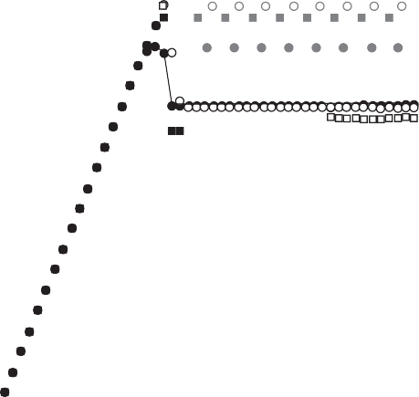

## Network Routing, Arbitration, and Switching

Routing, arbitration, and switching are performed at every switch along a packet’s path in a switched media network, no matter what the network topology. Numerous interesting techniques for accomplishing these network functions have been proposed in the literature. In this section, we focus on describing a representative set of approaches used in commercial systems for the more commonly used net- work topologies. Their impact on performance is also highlighted.

> 无论网络拓扑是什么，在切换媒体网络中的数据包路径上，每个开关都会在每个开关上执行路由，仲裁和切换。文献中已经提出了许多用于完成这些网络功能的有趣技术。在本节中，我们专注于描述商业系统中使用的代表性方法，用于更常用的净工作拓扑。它们对性能的影响也得到了强调。

Figure F.16 Topological characteristics of interconnection networks used in commercial high-performance machines.

### Routing

> [!note]
> 这里对于路由提到了一个 "活锁" 的概念，那 CS 中涉及到的计算机线程中的锁，是否也可以做这样一个设计？

The `routing algorithm` defines which network path, or paths, are allowed for each packet. Ideally, the routing algorithm supplies shortest paths to all packets such that traffic load is evenly distributed across network links to minimize contention. However, some paths provided by the network topology may not be allowed in order to guarantee that all packets can be delivered, no matter what the traffic behavior. Paths that have an unbounded number of allowed nonminimal hops from packet sources, for instance, may result in packets never reaching their destina- tions. This situation is referred to as `livelock`. Likewise, paths that cause a set of packets to block in the network forever waiting only for network resources (i.e., links or associated buffers) held by other packets in the set also prevent packets from reaching their destinations. This situation is referred to as `deadlock`. As dead- lock arises due to the finiteness of network resources, the probability of its occur- rence increases with increased network traffic and decreased availability of network resources. For the network to function properly, the routing algorithm must guard against this anomaly, which can occur in various forms—for example, routing deadlock, request-reply (protocol) deadlock, and fault-induced (reconfiguration) deadlock, etc. At the same time, for the network to provide the highest possible per- formance, the routing algorithm must be efficient—allowing as many routing options to packets as there are paths provided by the topology, in the best case.

> "路由算法" 定义了每个数据包允许的网络路径或路径。理想情况下，路由算法为所有数据包提供最短路径，以便流量负载均匀分布在网络链路上，从而最大限度地减少争用。然而，网络拓扑提供的某些路径可能不允许，以保证所有数据包都可以传递，无论流量行为如何。例如，来自数据包源的允许的非最小跳数不受限制的路径可能会导致数据包永远无法到达目的地。这种情况称为 "活锁" 。同样，导致一组数据包在网络中永远阻塞的路径仅等待该组中其他数据包持有的网络资源(即链接或相关缓冲区)也会阻止数据包到达其目的地。这种情况称为 "死锁" 。死锁是由于网络资源的有限性而产生的，其发生的概率随着网络流量的增加和网络资源可用性的降低而增加。为了使网络正常运行，路由算法必须防范这种可能以各种形式发生的异常——例如，路由死锁、请求-回复(协议)死锁和故障引发(重新配置)死锁等。同时，为了使网络提供尽可能高的性能，路由算法必须高效——在最佳情况下，允许与拓扑提供的路径一样多的数据包路由选择。

The simplest way of guarding against livelock is to restrict routing such that only minimal paths from sources to destinations are allowed or, less restrictively, only a limited number of nonminimal hops. The strictest form has the added benefit of consuming the minimal amount of network bandwidth, but it prevents packets from being able to use alternative nonminimal paths in case of contention or faults along the shortest (minimal) paths.

> 防止活锁的最简单方法是限制路由，以便只允许从源到目的地的最小路径，或者限制较少，只允许有限数量的非最小跃点。最严格的形式具有消耗最少网络带宽的额外好处，但它会阻止数据包在最短(最小)路径发生争用或故障时使用替代的非最小路径。

Deadlock is more difficult to guard against. Two common strategies are used in practice: avoidance and recovery. In `deadlock avoidance`, the routing algorithm restricts the paths allowed by packets to only those that keep the global network state deadlock-free. A common way of doing this consists of establishing an order- ing between a set of resources—the minimal set necessary to support network full access—and granting those resources to packets in some total or partial order such that cyclic dependency cannot form on those resources. This allows an escape path always to be supplied to packets no matter where they are in the network to avoid entering a deadlock state. In `deadlock recovery`, resources are granted to packets without regard for avoiding deadlock. Instead, as deadlock is possible, some mech- anism is used to detect the likely existence of deadlock. If detected, one or more packets are removed from resources in the deadlock set—possibly by regressively dropping the packets or by progressively redirecting the packets onto special dead- lock recovery resources. The freed network resources are then granted to other packets needing them to resolve the deadlock.

> 死锁更难防范。在实践中使用两种常见的策略：回避和恢复。在 "死锁避免" 中，路由算法将数据包允许的路径限制为仅保持全局网络状态无死锁的路径。这样做的一种常见方法包括在一组资源之间建立排序——支持网络完全访问所必需的最小集合——并以某种全部或部分顺序将这些资源授予数据包，这样就不会在这些资源上形成循环依赖 . 这允许始终向数据包提供逃生路径，无论它们在网络中的什么位置，以避免进入死锁状态。在 "死锁恢复" 中，资源被授予数据包而不考虑避免死锁。相反，由于可能存在死锁，因此使用某种机制来检测可能存在的死锁。如果检测到，一个或多个数据包会从死锁集中的资源中删除——可能是通过倒退式丢弃数据包或逐步将数据包重定向到特殊的死锁恢复资源。然后将释放的网络资源授予需要它们来解决死锁的其他数据包。

Let us consider routing algorithms designed for distributed switched networks. [Figure F.17(a)](#_bookmark614) illustrates one of many possible deadlocked configurations for packets within a region of a 2D mesh network. The routing algorithm can avoid all such deadlocks (and livelocks) by allowing only the use of minimal paths that cross the network dimensions in some total order. That is, links of a given dimen- sion are not supplied to a packet by the routing algorithm until no other links are needed by the packet in all of the preceding dimensions for it to reach its destination. This is illustrated in [Figure F.17(b)](#_bookmark614), where dimensions are crossed in `XY` dimension order. All the packets must follow the same order when traversing dimensions, exiting a dimension only when links are no longer required in that dimension. This well-known algorithm is referred to as `dimension-order routing` (DOR) or `e-cube routing` in hypercubes. It is used in many commercial systems built from distributed switched networks and on-chip networks. As this routing algorithm always supplies the same path for a given source-destination pair, it is a `deterministic routing` algorithm.

> 让我们考虑为分布式交换网络设计的路由算法。[图 F.17(a)](#_bookmark614) 说明了 2D 网状网络区域内数据包的许多可能死锁配置之一。路由算法可以通过仅允许使用以某种总顺序跨越网络维度的最小路径来避免所有此类死锁(和活锁)。也就是说，路由算法不会将给定维度的链接提供给数据包，直到数据包在所有前面的维度中都不需要其他链接才能到达目的地。[图 F.17(b)](#_bookmark614) 对此进行了说明，其中维度按 "XY" 维度顺序交叉。所有数据包在遍历维度时必须遵循相同的顺序，仅当该维度不再需要链接时才退出该维度。这种众所周知的算法在超立方体中被称为 "维度顺序路由" (DOR) 或 "电子立方体路由" 。它用于许多由分布式交换网络和片上网络构建的商业系统。由于此路由算法始终为给定的源-目的地对提供相同的路径，因此它是一种 "确定性路由" 算法。

Figure F.17 A mesh network with packets routing from sources, `s_i`, to destinations, `d_i`. (a) Deadlock forms from packets destined to `d`\_1 through `d`\_4 blocking on others in the same set that fully occupy their requested buffer resources one hop away from their destinations. This deadlock cycle causes other packets needing those resources also to block, like packets from `s`\_5 destined to `d`\_5 that have reached node `s`\_3. (b) Deadlock is avoided using dimension- order routing. In this case, packets exhaust their routes in the `X` dimension before turning into the `Y` dimension in order to complete their routing.

> 图 F.17 具有从源 "s_i" 到目的地 "d_i" 的数据包路由的网状网络。(a) 发往 `d`\_1 到 `d`\_4 的数据包会形成死锁，阻塞同一组中的其他数据包，这些数据包完全占用了距其目的地一跳的所请求的缓冲区资源。这个死锁循环导致其他需要这些资源的数据包也被阻塞，比如从 s `_5 到 ` d `_5 的数据包已经到达节点 ` s`\_3。(b) 使用维序路由避免了死锁。在这种情况下，数据包会在进入 "Y" 维度之前耗尽其在 "X" 维度中的路由，以完成其路由。

Crossing dimensions in order on some minimal set of resources required to support network full access avoids deadlock in meshes and hypercubes. However, for distributed switched topologies that have wrap-around links (e.g., rings and tori), a total ordering on a minimal set of resources within each dimension is also needed if resources are to be used to full capacity. Alternatively, some empty resources or `bubbles` along the dimensions would be required to remain below full capacity and avoid deadlock. To allow full access, either the physical links must be duplicated or the logical buffers associated with each link must be duplicated, resulting in `physical channels` or `virtual channels`, respectively, on which the ordering is done. Ordering is not necessary on all network resources to avoid dead- lock—it is needed only on some minimal set required to support network full access (i.e., some `escape resource set`). Routing algorithms based on this technique (called Duato’s protocol) can be defined that allow alternative paths provided by the topology to be used for a given source-destination pair in addition to the escape resource set. One of those allowed paths must be selected, preferably the most efficient one. Adapting the path in response to prevailing network traffic condi- tions enables the aggregate network bandwidth to be better utilized and contention to be reduced. Such routing capability is referred to as `adaptive routing` and is used in many commercial systems.

> 在支持网络完全访问所需的一些最小资源集上按顺序交叉维度避免了网格和超立方体中的死锁。然而，对于具有环绕式链路的分布式交换拓扑(例如环和圆环)，如果要充分利用资源，还需要对每个维度内的最小资源集进行总排序。或者，需要沿着维度的一些空资源或 "气泡" 来保持低于满容量并避免死锁。为了允许完全访问，要么必须复制物理链路，要么必须复制与每个链路关联的逻辑缓冲区，从而分别产生 "物理通道" 或 "虚拟通道" ，并在其上完成排序。不需要对所有网络资源进行排序以避免死锁——只有在支持网络完全访问所需的一些最小集合(即一些 "逃逸资源集" )上才需要排序。基于这种技术(称为 Duato 的协议)的路由算法可以被定义为允许拓扑提供的替代路径用于除了逃逸资源集之外的给定源-目的地对。必须选择这些允许的路径之一，最好是最有效的路径。根据普遍的网络流量条件调整路径可以更好地利用聚合网络带宽并减少争用。这种路由功能被称为 "自适应路由" ，并在许多商业系统中使用。

Example How many of the possible dimensional turns are eliminated by dimension-order routing on an `n`-dimensional mesh network? What is the fewest number of turns that actually need to be eliminated while still maintaining connectedness and dead- lock freedom? Explain using a 2D mesh network.

> 示例 在 "n" 维网状网络上，维度顺序路由消除了多少可能的维度转弯？ 在保持连通性和无死锁的情况下，实际需要消除的最少圈数是多少？ 使用 2D 网状网络进行解释。

_Answer_ The dimension-order routing algorithm eliminates exactly half of the possible dimensional turns as it is easily proven that all turns from any lower-ordered dimension into any higher-ordered dimension are allowed, but the converse is not true. For example, of the eight possible turns in the 2D mesh shown in [Figure F.17](#_bookmark614), the four turns from `X`+ to `Y`+, `X`+ to `Y` , `X` to `Y`+, and `X` to `Y` are allowed, where the signs (+ or ) refer to the direction of travel within a dimen- sion. The four turns from `Y`+ to `X`+, `Y`+ to `X` , `Y` to `X`+, and `Y` to `X` are dis- allowed turns. The elimination of these turns prevents cycles of any kind from forming—and, thus, avoids deadlock—while keeping the network connected. However, it does so at the expense of not allowing any routing adaptivity.

> _Answer_ 维度顺序路由算法恰好消除了一半可能的维度转向，因为很容易证明从任何低阶维度到任何高阶维度的所有转向都是允许的，但反之则不然。例如，在 [图 F.17](#_bookmark614) 所示的 2D 网格中的八个可能转弯中，从 `X`+ 到 `Y`+、`X`+ 到 `Y`、`X  ` 到 `Y`+，以及 `X` 到 `Y` 是允许的，其中符号(+ 或 )指的是维度内的行进方向。从 `Y`+ 到 `X`+、`Y`+ 到 `X`、`Y` 到 `X`+ 和 `Y` 到 `X` 这四个回合是不允许的。消除这些转弯可以防止形成任何类型的循环，从而避免死锁，同时保持网络连接。然而，这样做是以不允许任何路由自适应为代价的。

The `Turn Model` routing algorithm proves that the minimum number of elim- inated turns to prevent cycles and maintain connectedness is a quarter of the pos- sible turns, but the right set of turns must be chosen. Only some particular set of eliminated turns allow both requirements to be satisfied. With the elimination of the wrong set of a quarter of the turns, it is possible for combinations of allowed turns to emulate the eliminated ones (and, thus, form cycles and deadlock) or for the network not to be connected. For the 2D mesh, for example, it is possible to eliminate only the two turns ending in the westward direction (i.e., `Y`+ to `X` and `Y` to `X` ) by requiring packets to start their routes in the westward direction (if needed) to maintain connectedness. Alternatives to this west-first routing for 2D meshes are negative-first routing and north-last routing. For these, the extra quarter of turns beyond that supplied by DOR allows for partial adaptivity in routing, mak- ing these adaptive routing algorithms.

> "转弯模型" 路由算法证明，为防止环路和保持连通性而消除的最少转弯数是可能转弯数的四分之一，但必须选择正确的转弯组。只有一些特定的消除转弯集才能满足这两个要求。通过消除四分之一圈的错误组，允许的圈的组合可以模拟已消除的圈(并因此形成循环和死锁)或不连接网络。例如，对于 2D 网格，可以通过要求数据包开始其路由来仅消除以向西方向结束的两个转弯(即 "Y" + 到 "X" 和 "Y" 到 "X" ) 向西方向(如果需要)以保持连通性。这种 2D 网格西向优先布线的替代方案是负向优先布线和北向最后布线。对于这些，超出 DOR 提供的额外四分之一圈允许路由中的部分自适应性，从而形成这些自适应路由算法。

Routing algorithms for centralized switched networks can similarly be defined to avoid deadlocks by restricting the use of resources in some total or partial order. For fat trees, resources can be totally ordered along paths start- ing from the input leaf stage upward to the root and then back down to the out- put leaf stage. The routing algorithm can allow packets to use resources in increasing partial order, first traversing up the tree until they reach some `least common ancestor` (LCA) of the source and destination, and then back down the tree until they reach their destinations. As there are many least common ances- tors for a given destination, multiple alternative paths are allowed while going up the tree, making the routing algorithm adaptive. However, only a single deterministic path to the destination is provided by the fat tree topology from a least common ancestor. This `self-routing` property is common to many MINs and can be readily exploited: The switch output port at each stage is given sim- ply by shifts of the destination node address.

> 可以类似地定义用于集中式交换网络的路由算法，通过以某种全部或部分顺序限制资源的使用来避免死锁。对于胖树，资源可以沿着从输入叶阶段向上到根的路径完全排序，然后返回到输出叶阶段。路由算法可以允许数据包以递增的偏序使用资源，首先向上遍历树直到它们到达源和目的地的某个 "最不公共祖先" (LCA)，然后沿着树向下返回直到它们到达目的地。由于给定目的地有许多最不常见的祖先，因此在向上树时允许多条替代路径，从而使路由算法具有自适应性。然而，来自最不共同祖先的胖树拓扑仅提供到目的地的单一确定性路径。这种 "自路由" 属性是许多 MIN 所共有的，并且可以很容易地加以利用：每一级的开关输出端口仅通过目标节点地址的移位给出。

More generally, a tree graph can be mapped onto any topology—whether direct or indirect—and links between nodes at the same tree level can be allowed by assigning directions to them, where "up" designates paths moving toward the tree root and "down" designates paths moving away from the root node. This allows for generic `up\*/down\* routing` to be defined on any topology such that packets follow paths (possibly adaptively) consisting of zero or more up links followed by zero or more down links to their destination. Up/down ordering pre- vents cycles from forming, avoiding deadlock. This routing technique was used in Autonet—a self-configuring switched LAN—and in early Myrinet SANs.

> 更一般地说，树图可以映射到任何拓扑结构——无论是直接的还是间接的——并且可以通过为它们分配方向来允许同一树级别的节点之间的链接，其中 "向上" 表示向树根移动的路径，"向下"  " 指定远离根节点的路径。这允许在任何拓扑上定义通用的 "上行\*/下行\*路由" ，以便数据包遵循由零个或多个上行链路和随后的零个或多个下行链路组成的路径(可能是自适应的)到它们的目的地。上/下排序防止循环形成，避免死锁。这种路由技术被用于 Autonet(一种自配置的交换式 LAN)和早期的 Myrinet SAN。

Routing algorithms are implemented in practice by a combination of the rout- ing information placed in the packet header by the source node and the routing control mechanism incorporated in the switches. For `source routing`, the entire routing path is precomputed by the source—possibly by table lookup—and placed in the packet header. This usually consists of the output port or ports supplied for each switch along the predetermined path from the source to the destination, which can be stripped off by the routing control mechanism at each switch. An additional bit field can be included in the header to signify whether adaptive routing is allowed (i.e., that any one of the supplied output ports can be used). For `distributed routing`, the routing information usually consists of the destination address. This is used by the routing control mechanism in each switch along the path to determine the next output port, either by computing it using a finite-state machine or by look- ing it up in a local routing table (i.e., forwarding table). Compared to distributed routing, source routing simplifies the routing control mechanism within the net- work switches, but it requires more routing bits in the header of each packet, thus increasing the header overhead.

> 路由算法实际上是通过将源节点放置在数据包报头中的路由信息 ​​ 与交换机中包含的路由控制机制相结合来实现的。对于 "源路由" ，整个路由路径由源预先计算(可能通过查表)并放置在数据包标头中。这通常包括沿着从源到目的地的预定路径为每个交换机提供的一个或多个输出端口，这些端口可以由每个交换机的路由控制机制剥离。标头中可以包含一个额外的位字段，以表示是否允许自适应路由(即可以使用任何一个提供的输出端口)。对于 "分布式路由" ，路由信息通常由目的地址组成。沿路径的每个交换机中的路由控制机制使用它来确定下一个输出端口，方法是使用有限状态机计算它或在本地 ​​ 路由表(即转发表)中查找它。与分布式路由相比，源路由简化了网络交换机内部的路由控制机制，但它要求每个数据包的头部有更多的路由位，从而增加了头部开销。

### Arbitration

The `arbitration algorithm` determines when requested network paths are available for packets. Ideally, arbiters maximize the matching of free network resources and packets requesting those resources. At the switch level, arbiters maximize the matching of free output ports and packets located in switch input ports requesting those output ports. When all requests cannot be granted simultaneously, switch arbiters resolve conflicts by granting output ports to packets in a fair way such that `starvation` of requested resources by packets is prevented. This could happen to packets in shorter queues if a serve-longest-queue (SLQ) scheme is used. For packets having the same priority level, simple round-robin (RR) or age-based schemes are sufficiently fair and straightforward to implement.

> `arbitration Algorithm` 确定可用于数据包的请求网络路径。理想情况下，仲裁员最大程度地匹配了请求这些资源的免费网络资源和数据包。在开关级别上，仲裁员最大化位于开关输入端口中的自由输出端口和数据包的匹配，要求这些输出端口。如果无法同时批准所有请求，则通过以公平的方式将输出端口授予数据包来解决冲突，从而阻止了数据包的请求资源。如果使用了最长时间(SLQ)方案，则可能会在较短的队列中的数据包。对于具有相同优先级的数据包，简单的圆形旋转(RR)或基于年龄的方案就足够公平且直接实施。

Arbitration can be distributed to avoid centralized bottlenecks. A straightfor- ward technique consists of two phases: a request phase and a grant phase. Let us assume that each switch input port has an associated queue to hold incoming packets and that each switch output port has an associated local arbiter implement- ing a round-robin strategy. [Figure F.18(a)](#_bookmark615) shows a possible set of requests for a four-port switch. In the `request phase`, packets at the head of each input port queue send a single request to the arbiters corresponding to the output ports requested by them. Then, each output port arbiter independently arbitrates among the requests it receives, selecting only one. In the `grant phase`, one of the requests to each arbiter is granted the requested output port. When two packets from different input ports request the same output port, only one receives a grant, as shown in the figure. As a consequence, some output port bandwidth remains unused even though all input queues have packets to transmit.

> 仲裁可以分布式避免集中式瓶颈。一种直接的技术包括两个阶段：请求阶段和授权阶段。让我们假设每个交换机输入端口都有一个关联的队列来保存传入的数据包，并且每个交换机输出端口都有一个关联的本地仲裁器来实现循环策略。[图 F.18(a)](#_bookmark615) 显示了一组可能的四端口交换机请求。在 "请求阶段" ，每个输入端口队列头部的数据包向与它们请求的输出端口相对应的仲裁器发送单个请求。然后，每个输出端口仲裁器独立仲裁它收到的请求，只选择一个。在 "授予阶段" ，对每个仲裁器的请求之一被授予请求的输出端口。当来自不同输入端口的两个数据包请求同一个输出端口时，只有一个收到授权，如图所示。因此，即使所有输入队列都有数据包要传输，一些输出端口带宽仍未使用。

Figure F.18 Two arbitration techniques. (a) Two-phased arbitration in which two of the four input ports are granted requested output ports. (b) Three-phased arbitration in which three of the four input ports are successful in gaining the requested output ports, resulting in higher switch utilization.

> 图 F.18 两种仲裁技术。(a)两步仲裁，其中四个输入端口中有两个被请求的输出端口。(b)基于三台仲裁，其中四个输入端口中的三个成功地获得了所需的输出端口，从而导致更高的开关利用率。

The simple two-phase technique can be improved by allowing several simul- taneous requests to be made by each input port, possibly coming from different virtual channels or from multiple adaptive routing options. These requests are sent to different output port arbiters. By submitting more than one request per input port, the probability of matching increases. Now, arbitration requires three phases: request, grant, and acknowledgment. [Figure F.18(b)](#_bookmark615) shows the case in which up to two requests can be made by packets at each input port. In the request phase, requests are submitted to output port arbiters, and these arbiters select one of the received requests, as is done for the two-phase arbiter. Likewise, in the grant phase, the selected requests are granted to the corresponding requesters. Taking into account that an input port can submit more than one request, it may receive more than one grant. Thus, it selects among possibly multiple grants using some arbitration strategy such as round-robin. The selected grants are confirmed to the corresponding output port arbiters in the acknowledgment phase.

> 简单的两阶段技术可以通过允许每个输入端口同时发出多个请求来改进，这些请求可能来自不同的虚拟通道或来自多个自适应路由选项。这些请求被发送到不同的输出端口仲裁器。通过为每个输入端口提交多个请求，匹配的概率会增加。现在，仲裁需要三个阶段：请求、授权和确认。[图 F.18(b)](#_bookmark615) 显示了每个输入端口的数据包最多可以发出两个请求的情况。在请求阶段，请求被提交给输出端口仲裁器，这些仲裁器选择接收到的请求之一，就像两阶段仲裁器所做的那样。同样，在授予阶段，将选定的请求授予相应的请求者。考虑到一个输入端口可以提交多个请求，它可能会收到多个授权。因此，它使用某种仲裁策略(例如循环法)在可能的多个授权中进行选择。选定的授权在确认阶段被确认到相应的输出端口仲裁器。

As can be seen in [Figure F.18(b)](#_bookmark615), it could happen that an input port that submits several requests does not receive any grants, while some of the requested ports remain free. Because of this, a second arbitration iteration can improve the prob- ability of matching. In this iteration, only the requests corresponding to non- matched input and output ports are submitted. Iterative arbiters with multiple requests per input port are able to increase the utilization of switch output ports and, thus, the network link bandwidth. However, this comes at the expense of additional arbiter complexity and increased arbitration delay, which could increase the router clock cycle time if it is on the critical path.

> 从 [图 F.18(b)](#_bookmark615) 中可以看出，提交多个请求的输入端口可能没有收到任何授权，而一些请求的端口仍然空闲。正因为如此，第二次仲裁迭代可以提高匹配的概率。在本次迭代中，只提交不匹配的输入输出端口对应的请求。每个输入端口具有多个请求的迭代仲裁器能够提高交换机输出端口的利用率，从而提高网络链路带宽。然而，这是以额外的仲裁器复杂性和增加的仲裁延迟为代价的，如果它在关键路径上，这可能会增加路由器时钟周期时间。

### Switching

The `switching technique` defines how connections are established in the network. Ide- ally, connections between network resources are established or "switched in" only for as long as they are actually needed and exactly at the point that they are ready and needed to be used, considering both time and space. This allows efficient use of avail- ablenetwork bandwidth bycompeting traffic flowsandminimallatency. Connections at eachhop along the topological pathallowed bythe routing algorithm and granted by the arbitration algorithm can be established in three basic ways: prior to packet arrival using `circuit switching`, upon receipt of the entire packet using `store-and-forward packet switching`, or upon receipt of only portions of the packet with unit size no smal- ler than that of the packet header using `cut-through packet switching`.

> "交换技术" 定义了如何在网络中建立连接。理想情况下，考虑到时间和空间，网络资源之间的连接仅在实际需要时才建立或 "接通" ，并且恰好在它们准备好和需要使用时才建立或 "接通" 。这允许通过竞争流量和最小延迟来有效使用可用网络带宽。路由算法允许和仲裁算法允许的拓扑路径上每一跳的连接可以通过三种基本方式建立：在数据包到达之前使用 "电路交换" ，在收到整个数据包后使用 "存储转发数据包交换"  ，或者在使用 "直通包交换" 仅接收到单位大小不小于包头的部分包时。

Circuit switching establishes a circuit `a priori` such that network bandwidth is allocated for packet transmissions along an entire source-destination path. It is possible to pipeline packet transmission across the circuit using staging at each hop along the path, a technique known as `pipelined circuit switching`. As routing, arbitration, and switching are performed only once for one or more packets, routing bits are not needed in the header of packets, thus reducing latency and overhead. This can be very efficient when information is continuously transmitted between devices for the same circuit setup. However, as network bandwidth is removed from the shared pool and preallocated regardless of whether sources are in need of consuming it or not, circuit switching can be very inefficient and highly wasteful of bandwidth. Packet switching enables network bandwidth to be shared and used more efficiently when packets are transmitted intermittently, which is the more common case. Packet switching comes in two main varieties—store-and-forward and cutthrough switching, both of which allow network link bandwidth to be multi- plexed on packet-sized or smaller units of information. This better enables band- width sharing by packets originating from different sources. The finer granularity of sharing, however, increases the overhead needed to perform switching: Routing, arbitration, and switching must be performed for every packet, and routing and flow control bits are required for every packet if flow control is used.

> 电路交换建立 "先验" 电路，以便为沿整个源-目的地路径的数据包传输分配网络带宽。可以使用沿路径的每一跳处的分段来跨电路传输数据包，这种技术称为 "流水线电路交换" 。由于路由、仲裁和交换只对一个或多个数据包执行一次，因此数据包的头部不需要路由位，从而减少了延迟和开销。当信息在相同电路设置的设备之间连续传输时，这会非常有效。然而，由于网络带宽从共享池中移除并被预先分配，而不管源是否需要使用它，电路交换可能非常低效并且非常浪费带宽。数据包交换使网络带宽能够在数据包间歇传输时更有效地共享和使用，这是更常见的情况。数据包交换有两个主要类型——存储转发和直通交换，它们都允许网络链路带宽在数据包大小或更小的信息单元上进行多路复用。这更好地支持来自不同来源的数据包共享带宽。然而，更细的共享粒度增加了执行交换所需的开销：必须对每个数据包执行路由、仲裁和交换，如果使用流量控制，则每个数据包都需要路由和流量控制位。

Store-and-forward packet switching establishes connections such that a packet is forwarded to the next hop in sequence along its source-destination path only after the entire packet is first stored (staged) at the receiving switch. As packets are completely stored at every switch before being transmitted, links are completely decoupled, allowing full link bandwidth utilization even if links have very different bandwidths. This property is very important in WANs, but the price to pay is packet latency; the total routing, arbitration, and switching delay is multiplicative with the number of hops, as we have seen in [Section F.4](#network-topology) when analyzing perfor- mance under this assumption.

> 存储转发数据包交换建立连接，只有在整个数据包首先存储(暂存)在接收交换机后，数据包才会沿着其源-目的地路径按顺序转发到下一跳。由于数据包在传输之前完全存储在每个交换机中，因此链路完全解耦，即使链路具有非常不同的带宽，也可以充分利用链路带宽。此属性在 WAN 中非常重要，但要付出的代价是数据包延迟；总的路由、仲裁和切换延迟是跳数的乘法，正如我们在[第 F.4 节](#network-topology)中在此假设下分析性能时所看到的。

Cut-through packet switching establishes connections such that a packet can "cut through" switches in a pipelined manner once the header portion of the packet (or equivalent amount of payload trailing the header) is staged at receiving switches. That is, the rest of the packet need not arrive before switching in the granted resources. This allows routing, arbitration, and switching delay to be additive with the number of hops rather than multiplicative to reduce total packet latency. Cut-through comes in two varieties, the main differences being the size of the unit of information on which flow control is applied and, consequently, the buffer requirements at switches. `Virtual cut-through switching` implements flow control at the packet level, whereas `wormhole switching` implements it on flow units, or `flits`, which are smaller than the maximum packet size but usually at least as large as the packet header. Since wormhole switches need to be capable of storing only a small portion of a packet, packets that block in the network may span several switches. This can cause other packets to block on the links they occupy, leading to premature network saturation and reduced effective bandwidth unless some centralized buffer is used within the switch to store them—a technique called `buffered wormhole switching`. As chips can implement relatively large buffers in current technology, virtual cut-through is the more commonly used switching technique. However, wormhole switching may still be preferred in OCNs designed to minimize silicon resources.

> 直通数据包交换建立连接，一旦数据包的报头部分(或等量的尾随报头的有效负载)在接收交换机处暂存，数据包就可以以流水线方式 "直通" 交换机。也就是说，包的其余部分不需要在切换到授权资源之前到达。这允许路由、仲裁和交换延迟与跳数相加而不是相乘，以减少总数据包延迟。直通有两种类型，主要区别在于应用流量控制的信息单元的大小，以及因此对交换机的缓冲区要求。"虚拟直通交换" 在数据包级别实现流控制，而 "虫洞交换" 在流单元或 "flit" 上实现它，它小于最大数据包大小，但通常至少与数据包标头一样大。由于虫洞交换机只需要能够存储数据包的一小部分，因此在网络中阻塞的数据包可能会跨越多个交换机。这可能会导致其他数据包在它们占用的链路上阻塞，导致网络过早饱和并降低有效带宽，除非在交换机内使用一些集中缓冲区来存储它们——一种称为 "缓冲虫洞交换" 的技术。由于芯片在目前的技术中可以实现比较大的缓存，虚拟直通是比较常用的交换技术。然而，在设计用于最小化硅资源的 OCN 中，虫洞切换可能仍然是首选。

Premature network saturation caused by wormhole switching can be mitigated by allowing several packets to share the physical bandwidth of a link simulta- neously via time-multiplexed switching at the flit level. This requires physical links to have a set of virtual channels (i.e., the logical buffers mentioned previously) at each end, into which packets are switched. Before, we saw how virtual channels can be used to decouple physical link bandwidth from buffered packets in such a way as to avoid deadlock. Now, virtual channels are multiplexed in such a way that bandwidth is switched in and used by flits of a packet to advance even though the packet may share some links in common with a blocked packet ahead. This, again, allows network bandwidth to be used more efficiently, which, in turn, reduces the average packet latency.

> 虫洞切换导致的网络过早饱和可以通过允许多个数据包通过 flit 级别的时间复用切换同时共享链路的物理带宽来减轻。这要求物理链路在每一端都有一组虚拟通道(即前面提到的逻辑缓冲区)，数据包被交换到这些通道中。之前，我们看到了如何使用虚拟通道将物理链路带宽与缓冲数据包分离以避免死锁。现在，虚拟通道以这样一种方式进行多路复用，即带宽被切换并被数据包的数据包使用以前进，即使数据包可能与前面的阻塞数据包共享一些共同的链路。这再次允许更有效地使用网络带宽，从而减少平均数据包延迟。

### Impact on Network Performance

Routing, arbitration, and switching can impact the packet latency of a loaded network by reducing the contention delay experienced by packets. For an unloaded network that has no contention, the algorithms used to perform routing and arbitration have no impact on latency other than to determine the amount of delay incurred in implementing those functions at switches—typically, the pin-to-pin latency of a switch chip is several tens of nanoseconds. The only change to the best-case packet latency expression given in the previous section comes from the switching technique. Store-and-forward packet switching was assumed before in which transmission delay for the entire packet is incurred on all `d` hops plus at the source node. For cut-through packet switching, transmission delay is pipelined across the network links comprising the packet’s path at the granularity of the packet header instead of the entire packet. Thus, this delay component is reduced, as shown in the following lower-bound expression for packet latency:

> 路由、仲裁和交换可以通过减少数据包经历的争用延迟来影响负载网络的数据包延迟。对于没有争用的无负载网络，用于执行路由和仲裁的算法对延迟没有影响，除了确定在交换机上实现这些功能时产生的延迟量——通常是交换机的引脚到引脚延迟 芯片是几十纳秒。上一节中给出的最佳情况数据包延迟表达式的唯一变化来自交换技术。之前假设存储转发数据包交换，其中整个数据包的传输延迟发生在所有 "d" 跳以及源节点处。对于直通式数据包交换，传输延迟在包含数据包路径的网络链路上以数据包标头而不是整个数据包的粒度进行流水线传输。因此，此延迟分量减少，如以下数据包延迟的下限表达式所示：

The effective bandwidth is impacted by how efficiently routing, arbitration, and switching allow network bandwidth to be used. The routing algorithm can distrib- ute traffic more evenly across a loaded network to increase the utilization of the aggregate bandwidth provided by the topology—particularly, by the bisection links. The arbitration algorithm can maximize the number of switch output ports that accept packets, which also increases the utilization of network bandwidth. The switching technique can increase the degree of resource sharing by packets, which further increases bandwidth utilization. These combine to affect network bandwidth, BW_Network, by an `efficiency factor`, ρ, where 0 &lt;ρ≤ 1:

> 有效带宽受路由、仲裁和交换允许使用网络带宽的效率的影响。路由算法可以在负载网络中更均匀地分配流量，以提高拓扑提供的聚合带宽的利用率——特别是二分链路。仲裁算法可以最大限度地增加接受数据包的交换机输出端口的数量，这也提高了网络带宽的利用率。交换技术可以提高数据包的资源共享程度，从而进一步提高带宽利用率。这些组合通过 "效率因子" ρ 影响网络带宽 BW_Network，其中 0 <ρ≤ 1：

The efficiency factor, ρ, is difficult to calculate or to quantify by means other than simulation. Nevertheless, with this parameter we can estimate the best-case upper- bound effective bandwidth by using the following expression that takes into account the effects of routing, arbitration, and switching:

> 效率因子 ρ 很难通过仿真以外的方法计算或量化。然而，使用此参数，我们可以使用以下考虑路由、仲裁和交换影响的表达式来估计最佳情况上限有效带宽：

We note that ρ also depends on how well the network handles the traffic generated by applications. For instance, ρ could be higher for circuit switching than for cut-through switching if large streams of packets are continually transmitted between a source-destination pair, whereas the converse could be true if packets are transmitted intermittently.

> 我们注意到 ρ 还取决于网络处理应用程序生成的流量的能力。例如，如果大量数据包流在源-目的地对之间连续传输，则电路交换的 ρ 可能高于直通交换，而如果数据包间歇传输，则反之亦然。

Example Compare the performance of deterministic routing versus adaptive routing for a 3D torus network interconnecting 4096 nodes. Do so by plotting latency versus applied load and throughput versus applied load. Also compare the efficiency of the best and worst of these networks. Assume that virtual cut-through switching, three-phase arbitration, and virtual channels are implemented. Consider separately the cases for two and four virtual channels, respectively. Assume that one of the virtual channels uses bubble flow control in dimension order so as to avoid dead- lock; the other virtual channels are used either in dimension order (for deterministic routing) or minimally along shortest paths (for adaptive routing), as is done in the IBM Blue Gene/L torus network.

> 示例 比较互连 4096 个节点的 3D 环面网络的确定性路由与自适应路由的性能。通过绘制延迟与应用负载以及吞吐量与应用负载的关系图来做到这一点。还要比较这些网络中最好和最差的网络的效率。假设实现了虚拟直通切换、三相仲裁和虚拟通道。分别考虑两个和四个虚拟通道的情况。假设其中一个虚拟通道在维度顺序上使用气泡流控制以避免死锁；其他虚拟通道按维度顺序(用于确定性路由)或最小化沿最短路径(用于自适应路由)使用，就像在 IBM Blue Gene/L torus 网络中所做的那样。

_Answer_ It is very difficult to compute analytically the performance of routing algorithms given that their behavior depends on several network design parameters with com- plex interdependences among them. As a consequence, designers typically resort to cycle-accurate simulators to evaluate performance. One way to evaluate the effect of a certain design decision is to run sets of simulations over a range of net- work loads, each time modifying one of the design parameters of interest while keeping the remaining ones fixed. The use of synthetic traffic loads is quite fre- quent in these evaluations as it allows the network to stabilize at a certain working point and for behavior to be analyzed in detail. This is the method we use here (alternatively, trace-driven or execution-driven simulation can be used).

> _Answer_ 很难分析地计算路由算法的性能，因为它们的行为取决于多个网络设计参数，它们之间具有复杂的相互依赖性。因此，设计人员通常求助于周期精确的模拟器来评估性能。评估特定设计决策影响的一种方法是在一系列网络负载上运行多组模拟，每次修改一个感兴趣的设计参数，同时保持其余参数不变。在这些评估中经常使用合成流量负载，因为它允许网络稳定在某个工作点并详细分析行为。这是我们在这里使用的方法(或者，可以使用跟踪驱动或执行驱动的模拟)。

[Figure F.19](#_bookmark616) shows the typical interconnection network performance plots. On the left, average packet latency (expressed in network cycles) is plotted as a func- tion of applied load (traffic generation rate) for the two routing algorithms with two and four virtual channels each; on the right, throughput (traffic delivery rate) is similarly plotted. Applied load is normalized by dividing it by the number of nodes in the network (i.e., bytes per cycle per node). Simulations are run under the assumption of uniformly distributed traffic consisting of 256-byte packets, where flits are byte sized. Routing, arbitration, and switching delays are assumed to sum to 1 network cycle per hop while the time-of-flight delay over each link is assumed to be 10 cycles. Link bandwidth is 1 byte per cycle, thus providing results that are independent of network clock frequency.

> [图 F.19](#_bookmark616) 显示了典型的互连网络性能图。在左侧，平均数据包延迟(以网络周期表示)被绘制为两个路由算法的应用负载(流量生成率)的函数，每个路由算法具有两个和四个虚拟通道；在右侧，类似地绘制了吞吐量(流量传输率)。施加的负载通过将其除以网络中的节点数(即每个节点每个周期的字节数)来归一化。模拟是在由 256 字节数据包组成的均匀分布流量的假设下运行的，其中 flit 是字节大小的。假定路由、仲裁和交换延迟总和为每跳 1 个网络周期，而每条链路上的飞行时间延迟假定为 10 个周期。链路带宽为每周期 1 字节，因此提供的结果与网络时钟频率无关。

As can be seen, the plots within each graph have similar characteristic shapes, but they have different values. For the latency graph, all start at the no-load latency as predicted by the latency expression given above, then slightly increase with traf- fic load as contention for network resources increases. At higher applied loads, latency increases exponentially, and the network approaches its saturation point as it is unable to absorb the applied load, causing packets to queue up at their source nodes awaiting injection. In these simulations, the queues keep growing over time, making latency tend toward infinity. However, in practice, queues reach their capacity and trigger the application to stall further packet generation, or the application throttles itself waiting for acknowledgments/responses to outstanding packets. Nevertheless, latency grows at a slower rate for adaptive routing as alter- native paths are provided to packets along congested resources.

> 可以看出，每个图中的图具有相似的特征形状，但它们具有不同的值。对于延迟图，所有延迟都从上面给出的延迟表达式预测的无负载延迟开始，然后随着网络资源争用的增加而随着流量负载略有增加。在更高的应用负载下，延迟呈指数增长，并且网络接近其饱和点，因为它无法吸收应用的负载，导致数据包在其源节点排队等待注入。在这些模拟中，队列随着时间的推移不断增长，使延迟趋于无穷大。然而，在实践中，队列达到其容量并触发应用程序停止进一步的数据包生成，或者应用程序限制自身等待对未完成数据包的确认/响应。然而，自适应路由的延迟增长速度较慢，因为沿着拥塞资源向数据包提供了替代路径。

Figure F.19 Deterministic routing is compared against adaptive routing, both with either two or four virtual channels, assuming uniformly distributed traffic on a 4 K node 3D torus network with virtual cut-through switch- ing and bubble flow control to avoid deadlock. (a) Average latency is plotted versus applied load, and (b) through- put is plotted versus applied load (the upper grayish plots show peak throughput, and the lower black plots show sustained throughput). Simulation data were collected by P. Gilabert and J. Flich at the Universidad Politècnica de València, Spain (2006).

> 图 F.19 与自适应路由相比，确定性路由与两个或四个虚拟通道进行了比较，假设在 4 K 节点 3D 圆环网络上均匀分布的流量具有虚拟切割开关和气泡流量控制，以避免僵局。(a)平均延迟与施加的负载相比绘制，并且(b)构图与施加的载荷相比(上灰色地块显示峰值吞吐量，下黑色地块显示持续的吞吐量)。P. Gilabert 和 J. Flich 收集了模拟数据，该大学是西班牙政治上的 València 大学(2006 年)。

For this same reason, adaptive routing allows the network to reach a higher peak throughput for the same number of virtual channels as compared to deterministic routing. At nonsaturation loads, throughput increases fairly linearly with applied load. When the network reaches its saturation point, however, it is unable to deliver traffic at the same rate at which traffic is generated. The saturation point, therefore, indicates the maximum achievable or "peak" throughput, which would be no more than that predicted by the effective bandwidth expression given above. Beyond saturation, throughput tends to drop as a consequence of massive head-of-line blocking across the network (as will be explained further in [Section F.6](#switch-microarchitecture)), very much like cars tend to advance more slowly at rush hour. This is an important region of the throughput graph as it shows how significant of a performance drop the routing algorithm can cause if congestion management techniques (discussed briefly in [Section F.7](#practical-issues-for-commercial-interconnection-networks)) are not used effectively. In this case, adaptive routing has more of a performance drop after saturation than deterministic routing, as mea- sured by the postsaturation sustained throughput.

> 出于同样的原因，与确定性路由相比，自适应路由允许网络在相同数量的虚拟通道下达到更高的峰值吞吐量。在非饱和负载下，吞吐量随应用的负载呈线性增长。然而，当网络达到其饱和点时，它无法以与生成流量相同的速率传送流量。因此，饱和点表示最大可实现或 "峰值" 吞吐量，这不会超过上面给出的有效带宽表达式所预测的吞吐量。除了饱和之外，吞吐量往往会由于网络中大量的队首阻塞而下降(将在 [第 F.6 节](#switch-microarchitecture)中进一步解释)，就像汽车倾向于前进更多一样 在高峰时间慢慢地。这是吞吐量图中的一个重要区域，因为它显示了如果拥塞管理技术(在 [Section F.7](#practical-issues-for-commercial-interconnection-networks )) 没有有效使用。在这种情况下，自适应路由在饱和后比确定性路由有更多的性能下降，这是通过饱和后持续吞吐量来衡量的。

For both routing algorithms, more virtual channels (i.e., four) give packets a greater ability to pass over blocked packets ahead, allowing for a higher peak throughput as compared to fewer virtual channels (i.e., two). For adaptive routing with four virtual channels, the peak throughput of 0.43 bytes/cycle/node is near the maximum of 0.5 bytes/cycle/node that can be obtained with 100% efficiency (i.e., ρ 100%), assuming there is enough injection and reception bandwidth to make the network bisection the bottlenecking point. In that case, the network bandwidth is simply 100% times the network bisection bandwidth (BW_Bisection) divided by the fraction of traffic crossing the bisection (γ), as given by the expression above. Tak- ing into account that the bisection splits the torus into two equally sized halves, γ is equal to 0.5 for uniform traffic as only half the injected traffic is destined to a node at the other side of the bisection. The BW_Bisection for a 4096-node 3D torus network is 16 16 4 unidirectional links times the link bandwidth (i.e., 1 byte/cycle). If we normalize the bisection bandwidth by dividing it by the number of nodes (as we did with network bandwidth), the BW_Bisection is 0.25 bytes/cycle/node. Dividing this by γ gives the ideal maximally obtainable network bandwidth of 0.5 bytes/ cycle/node.

> 对于这两种路由算法，与较少的虚拟通道(即两个)相比，更多的虚拟通道(即四个)使数据包能够越过前面阻塞的数据包，从而实现更高的峰值吞吐量。对于具有四个虚拟通道的自适应路由，假设有足够的注入，0.43 字节/周期/节点的峰值吞吐量接近 100% 效率(即 ρ 100%)可以获得的最大值 0.5 字节/周期/节点 和接收带宽，使网络对分成为瓶颈点。在这种情况下，网络带宽只是 100% 乘以网络二等分带宽 (BW_Bisection) 除以通过二等分的流量分数 (γ)，如上式所示。考虑到二等分将圆环分成两个大小相等的两半，对于均匀流量，γ 等于 0.5，因为只有一半的注入流量被指定到二等分另一侧的节点。4096 节点 3D 环面网络的 BW_Bisection 是 16 16 4 单向链路乘以链路带宽(即 1 字节/周期)。如果我们通过将二分带宽除以节点数来对其进行归一化(就像我们对网络带宽所做的那样)，则 BW_Bisection 为 0.25 字节/周期/节点。将其除以 γ 得到理想的最大可获得网络带宽 0.5 字节/周期/节点。

We can find the efficiency factor, ρ, of the simulated network simply by divid- ing the measured peak throughput by the ideal throughput. The efficiency factor for the network with fully adaptive routing and four virtual channels is 0.43/(0.25/ 0.5) 86%, whereas for the network with deterministic routing and two virtual channels it is 0.37/(0.25/0.5) 74%. Besides the 12% difference in efficiency between the two, another 14% gain in efficiency might be obtained with even bet- ter routing, arbitration, switching, and virtual channel designs.

> 我们可以简单地将测得的峰值吞吐量划分为理想吞吐量，从而找到模拟网络的效率因子 ρ。具有完全自适应路由和四个虚拟通道的网络的效率因子为 0.43/(0.25/0.5)86％，而对于具有确定性路由的网络和两个虚拟通道的网络为 0.37/(0.25/0.5)74％。除了两者之间的效率差异为 12％外，还可以通过布线路由，仲裁，切换和虚拟通道设计获得另外 14％的效率增益。

To put this discussion on routing, arbitration, and switching in perspective, Figure F.20 lists the techniques used in SANs designed for commercial high- performance computers. In addition to being applied to the SANs as shown in the figure, the issues discussed in this section also apply to other interconnect domains: from OCNs to WANs.

> 为了将讨论在路由，仲裁和切换方面进行视角，图 F.20 列出了用于商用高性能计算机的 SAN 中使用的技术。除了被应用于图中所示的 SAN 外，本节中讨论的问题还适用于其他互连域：从 OCN 到 WANS。
