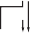

## Speeding Up Integer Multiplication and Division

> ##加速整数乘法和除法

The multiplication and division algorithms presented in [Section J.2](#basic-techniques-of-integer-arithmetic) are fairly slow, producing 1 bit per cycle (although that cycle might be a fraction of the CPU instruction cycle time). In this section, we discuss various techniques for higher-performance multiplication and division, including the division algorithm used in the Pentium chip.

> [j.2](%EF%BC%83%E5%9F%BA%E6%9C%AC%E6%8A%80%E6%9C%AF%E5%9F%BA%E7%A1%80%E7%AE%97%E6%B3%95) 中介绍的乘法和分裂算法相当慢，每周循环产生 1 位(尽管该周期可能是 CPU 指令周期时间的一部分)。在本节中，我们将讨论用于高性能乘法和分裂的各种技术，包括五角芯片中使用的分裂算法。

### Shifting over Zeros

> ###在零上转移

Although the technique of shifting over zeros is not currently used much, it is instructive to consider. It is distinguished by the fact that its execution time is oper- and dependent. Its lack of use is primarily attributable to its failure to offer enough speedup over bit-at-a-time algorithms. In addition, pipelining, synchronization with the CPU, and good compiler optimization are difficult with algorithms that run in variable time. In multiplication, the idea behind shifting over zeros is to add logic that detects when the low-order bit of the A register is 0 (see [Figure J.2(a)](#_bookmark769) on page J-4) and, if so, skips the addition step and proceeds directly to the shift step—hence the term `shifting over zeros`.

> 尽管目前使用零转移的技术并不多，但要考虑的是有启发性的。它的执行时间是运行和依赖的事实来区分。它的缺乏主要归因于其未能在时间算法上提供足够的速度。此外，在可变时间内运行的算法很难使用管道，与 CPU 同步以及良好的编译器优化。在乘法中，通过零转移背后的想法是添加逻辑，该逻辑检测何时 A 寄存器的低序位为 0(请参见[图 J.2(a)](#_bookmark769)在页面 J-4)和，如果是这样，请跳过加法步骤，直接进行移动步骤，从而在 Zeros *上进行术语* shifting。

What about shifting for division? In nonrestoring division, an ALU oper- ation (either an addition or subtraction) is performed at every step. There appears to be no opportunity for skipping an operation. But think about division this way: To compute `a`/_b_, subtract multiples of `b` from `a`, and then report how many subtractions were done. At each stage of the subtraction pro- cess the remainder must fit into the P register of [Figure J.2(b)](#_bookmark769) (page J-4). In the case when the remainder is a small positive number, you normally subtract `b`; but suppose instead you only shifted the remainder and subtracted `b` the next time. As long as the remainder was sufficiently small (its high-order bit 0), after shifting it still would fit into the P register, and no information would be lost. However, this method does require changing the way we keep track of the number of times `b` has been subtracted from `a.` This idea usually goes under the name of `SRT division`, for Sweeney, Robertson, and Tocher, who independently proposed algorithms of this nature. The main extra complica- tion of SRT division is that the quotient bits cannot be determined immediately from the sign of P at each step, as they can be in ordinary nonrestoring division.

> 那转移分裂呢？在非候选人区域中，在每个步骤都执行 ALU 操作(加法或减法)。似乎没有机会跳过操作。但是，请考虑这样做：要计算 *a `/` b*，从 *a* 中减去 *b* 的倍数，然后报告完成了多少次减去。在减法过程的每个阶段，其余部分必须适合[图 J.2(b)](#_bookmark769)(j-4 页)的 P 寄存器。如果剩余的是一个较小的正数，则通常会减去 *b*;但是，假设您仅在下一次移动剩余并减去 *b*。只要其余部分足够小(其高阶位 0)，在移动后仍将适合 P 寄存器，并且不会丢失任何信息。但是，此方法确实需要更改我们跟踪 *b* 的次数的方式。自然。SRT 划分的主要额外复杂性是商位不能在每个步骤的 p 符号中立即确定，因为它们可以处于普通的非这里提区域。

More precisely, to divide `a` by `b` where `a` and `b` are `n`-bit numbers, load `a` and `b` into the A and B registers, respectively, of [Figure J.2](#_bookmark769) (page J-4).

> 更准确地说，将 *a* 划分为 *b*，其中 *a* 和 *b* 是 *n*-bit 号码，将 *a* 和 *b* 加载 *a* 和 *b* 分别为[[图 J.2](#_kbookmark769) 的 a 和 b 寄存器(＃bookmark769)(Page j-4)。

Figure J.23 SRT division of 10002/00112. The quotient bits are shown in bold, using the notation 1 for —1.

> 图 J.23 SRT 部门 10002/00112。使用符号 1 for -1 以粗体显示。

A numerical example is given in Figure J.23. Although we are discussing integer division, it helps in explaining the algorithm to imagine the binary point just left of the most-significant bit. This changes Figure J.23 from 010002/00112 to 0.10002/.00112. Since the binary point is changed in both the numerator and denominator, the quotient is not affected. The (P,A) register pair holds the remainder and is a two’s complement number. For example, if P contains 111102 and A 0, then the remain- der is 1.11102 1/8. If `r` is the value of the remainder, then 1 `r` &lt; 1.

> 数值示例如图 J.23 给出。尽管我们正在讨论整数部门，但它有助于解释算法，以想象最重要的位置的二进制点。这将更改图 J.23 从 010002/00112 到 0.10002/.00112。由于分子和分母中的二进制点都会更改，因此商不受影响。(p，a)寄存器对持有其余部分，并且是两个的补充号码。例如，如果 P 包含 111102 和 A 0，则剩余为 1.11102 1/8。如果 *r* 是剩余的值，则为 1 `r`＆lt;1。

Given these preliminaries, we can now analyze the SRT division algorithm. The first step of the algorithm shifts `b` so that `b` 1/2. The rule for which ALU operation to perform is this: If 1/4 `r` &lt; 1/4 (true whenever the top three bits of P are equal), then compute 2*r* by shifting (P,A) left one bit; if `r` &lt; 0 (and hence `r` &lt; 1/4, since otherwise it would have been eliminated by the first condition), then compute 2*r* + `b` by shifting and then adding; if `r` 1/4 and subtract `b` from 2*r*. Using `b` 1/2, it is easy to check that these rules keep 1/2 `r` &lt; 1/2. For nonrestoring division, we only have `r b`, and we need P to be `n` + 1 bits wide. But, for SRT division, the bound on `r` is tighter, namely, 1/2 `r` &lt; 1/2. Thus, we can save a bit by elim- inating the high-order bit of P (and `b` and the adder). In particular, the test for equality of the top three bits of P becomes a test on just two bits.

> 鉴于这些初步，我们现在可以分析 SRT 部门算法。算法的第一步移动 *b*，因此 *b* 1/2。Alu 操作执行的规则是：如果 1/4 `r`＆lt;1/4(每当 p 的前三位相等时，true)，然后通过移动(p，a)剩下一位来计算 2* r*；如果 *r*＆lt;0(因此，_r_＆lt; 1/4，因为否则将通过第一个条件消除它)，然后通过移动来计算 2* r* + `b`，然后添加;如果 *r* 1/4，然后从 2*r* 中减去 *b*。使用 *b* 1/2，很容易检查这些规则是否保留 1/2 `r`＆lt;1/2。对于非招待部门，我们只有 *r b*，我们需要 p 为 *n* + 1 位宽。但是，对于 SRT 部门而言，*r* 上的界限更紧密，即 1/2 `r`＆lt;1/2。因此，我们可以通过消除 p(和 *b* 和 adder)的高阶位来节省一些。特别是，p 前三位的平等测试仅在两个位上进行了测试。

The algorithm might change slightly in an implementation of SRT division. After each ALU operation, the P register can be shifted as many places as necessary to make either `r` 1/4 or `r` &lt; 1/4. By shifting `k` places, `k` quotient bits are set equal to zero all at once. For this reason SRT division is sometimes described as one that keeps the remainder normalized to \|_r_\|≥ 1/4.

> 在 SRT 部门的实施中，该算法可能会略有变化。每个 ALU 操作后，可以将 P 寄存器移动尽可能多的位置，以制作 *r* 1/4 或 *r*＆lt;1/4。通过移动 *k* 位置，*K* 商钻头设置为同样等于零。因此，有时将 SRT 划分描述为将其剩余的归一化为\ | `r` \ |≥1/4。

Notice that the value of the quotient bit computed in a given step is based on which operation is performed in that step (which in turn depends on the result of the operation from the previous step). This is in contrast to nonrestoring division, where the quotient bit computed in the *i*th step depends on the result of the oper- ation in the same step. This difference is reflected in the fact that when the final remainder is negative, the last quotient bit must be adjusted in SRT division, but not in nonrestoring division. However, the key fact about the quotient bits in SRT division is that they can include 1. Although Figure J.23 shows the quotient bits being stored in the low-order bits of A, an actual implementation can’t do this because you can’t fit the three values 1, 0, 1 into one bit. Furthermore, the quo- tient must be converted to ordinary two’s complement in a full adder. A common way to do this is to accumulate the positive quotient bits in one register and the negative quotient bits in another, and then subtract the two registers after all the bits are known. Because there is more than one way to write a number in terms of the digits 1, 0, 1, SRT division is said to use a `redundant` quotient representation.

> 请注意，在给定步骤中计算的商位的值是基于该步骤执行的操作(又取决于上一步的操作结果)。这与非验证划分相反，在 *i *第三步中计算的商位取决于同一步骤中操作的结果。这种差异反映在以下事实中：当最终余数为负时，必须在 SRT 划分中调整最后的位，而不是在非这里选划分中进行调整。但是，关于 SRT 部门中商位的关键事实是它们可以包括 1。尽管图 J.23 显示了存储在 A 的低阶位中的商位，但实际实现无法做到这一点，因为您可以这样做 t 将三个值 1，0，1 拟合到一位中。此外，必须将 Quotient 转换为普通二人物的补充。这样做的一种常见方法是在一个寄存器中积聚正优点，而另一个寄存器中的负数位，然后在已知所有位后减去两个寄存器。因为有多种方法可以用数字 1、0、1 来编写数字，所以据说 SRT 划分使用了* redeament*商表示。

The differences between SRT division and ordinary nonrestoring division can be summarized as follows:

1. ALU decision rule—In nonrestoring division, it is determined by the sign of P; in SRT, it is determined by the two most-significant bits of P.
2. Final quotient—In nonrestoring division, it is immediate from the successive signs of P; in SRT, there are three quotient digits (1, 0, 1), and the final quotient must be computed in a full `n`-bit adder.
3. Speed—SRT division will be faster on operands that produce zero quotient bits.

The simple version of the SRT division algorithm given above does not offer enough of a speedup to be practical in most cases. However, later on in this section we will study variants of SRT division that are quite practical.

### Speeding Up Multiplication with a Single Adder

As mentioned before, shifting-over-zero techniques are not used much in current hardware. We now discuss some methods that are in widespread use. Methods that increase the speed of multiplication can be divided into two classes: those that use a single adder and those that use multiple adders. Let’s first discuss techniques that use a single adder.

> 如前所述，当前硬件中的转换为零技术不多。现在，我们讨论一些广泛使用中的方法。提高乘法速度的方法可以分为两个类：使用单个加法器和使用多个加法器的方法。让我们首先讨论使用单个加法器的技术。

In the discussion of addition we noted that, because of carry propagation, it is not practical to perform addition with two levels of logic. Using the cells of [Figure J.17](#_bookmark789), adding two 64-bit numbers will require a trip through seven cells to compute the `P`’s and `G`’s and seven more to compute the carry bits, which will require at least 28 logic levels. In the simple multiplier of [Figure J.2](#_bookmark769) on page J-4, each multiplication step passes through this adder. The amount of computation in each step can be dramatically reduced by using `carry-save adders` (CSAs). A carry- save adder is simply a collection of `n` independent full adders. A multiplier using such an adder is illustrated in [Figure J.24](#_bookmark795). Each circle marked "+" is a single-bit full adder, and each box represents one bit of a register. Each addition operation results in a pair of bits, stored in the sum and carry parts of P. Since each add is indepen- dent, only two logic levels are involved in the add—a vast improvement over 28. To operate the multiplier in [Figure J.24](#_bookmark795), load the sum and carry bits of P with zero and perform the first ALU operation. (If Booth recoding is used, it might be a subtraction rather than an addition.) Then shift the low-order sum bit of P into A, as well as shifting A itself. The `n` 1 high-order bits of P don’t need to be shifted because on the next cycle the sum bits are fed into the next lower-order adder. Each addition step is substantially increased in speed, since each add cell is working independently of the others, and no carry is propagated.

> 在加法的讨论中，我们注意到，由于进位传播，用两级逻辑执行加法是不切实际的。使用 [图 J.17](#_bookmark789) 的单元格，将两个 64 位数字相加将需要遍历七个单元格来计算 "P" 和 "G" 以及另外七个单元格来计算进位位 ，这将需要至少 28 个逻辑电平。在第 J-4 页的[图 J.2](#_bookmark769) 的简单乘法器中，每个乘法步骤都经过这个加法器。通过使用 "进位保存加法器" (CSA)，可以显着减少每个步骤中的计算量。进位保存加法器只是 "n" 个独立全加器的集合。[图 J.24](#_bookmark795) 中说明了使用此类加法器的乘法器。每个标有 "+" 的圆圈是一位全加器，每个方框代表一个寄存器的一位。每个加法运算都会产生一对位，存储在 P 的求和和进位部分中。由于每个加法都是独立的，因此加法中只涉及两个逻辑级——比 28 级有了很大改进。要在 [ 图 J.24](#_bookmark795)，将 P 的和和进位加载为零，并执行第一个 ALU 运算。(如果使用 Booth recoding，它可能是减法而不是加法。)然后将 P 的低位和位移入 A，同时将 A 本身移出。P 的 ‘n’ 1 个高位不需要移位，因为在下一个周期，和位被送入下一个低位加法器。每个加法步骤的速度都大大提高，因为每个加法单元都独立于其他单元工作，并且没有进位传播。

B

Figure J.24 Carry-save multiplier. Each circle represents a (3,2) adder working indepen- dently. At each step, the only bit of P that needs to be shifted is the low-order sum bit.

There are two drawbacks to carry-save adders. First, they require more hardware because there must be a copy of register P to hold the carry outputs of the adder. Second, after the last step, the high-order word of the result must be fed into an ordinary adder to combine the sum and carry parts. One way to accomplish this is by feeding the output of P into the adder used to perform the addition operation. Multiplying with a carry-save adder is sometimes called `redundant multiplication` because P is represented using two registers. Since there are many ways to represent P as the sum of two registers, this representation is redundant. The term `carry-propagate adder` (CPA) is used to denote an adder that is not a CSA. A propagate adder may propagate its carries using ripples, carrylookahead, or some other method.

> 进位保存加法器有两个缺点。首先，它们需要更多的硬件，因为必须有一个寄存器 P 的副本来保存加法器的进位输出。其次，在最后一步之后，结果的高位字必须被送入一个普通的加法器以组合求和和进位部分。实现此目的的一种方法是将 P 的输出馈入用于执行加法运算的加法器。与进位保存加法器相乘有时称为 "冗余乘法" ，因为 P 使用两个寄存器表示。由于有许多方法可以将 P 表示为两个寄存器的和，因此这种表示是多余的。术语 "进位传播加法器" (CPA) 用于表示不是 CSA 的加法器。传播加法器可以使用波纹、进位先行或其他一些方法来传播其进位。

Another way to speed up multiplication without using extra adders is to examine `k` low-order bits of A at each step, rather than just one bit. This is often called `higherradix multiplication`. As an example, suppose that `k` 2. If the pair of bits is 00, add 0 to P; if it is 01, add B. If it is 10, simply shift `b` one bit left before adding it to P. Unfortunately, if the pair is 11, it appears we would have to compute `b` + 2*b*. But this can be avoided by using a higher-radix version of Booth recoding. Imagine A as a base 4 number: When the digit 3 appears, change it to 1 and add 1 to the next higher digit to compensate. An extra benefit of using this scheme is that just like ordinary Booth recoding, it works for negative as well as positive integers ([Section J.2](#basic-techniques-of-integer-arithmetic)).

> 在不使用额外加法器的情况下加速乘法的另一种方法是在每一步检查 A 的 "k" 个低位，而不仅仅是一个位。这通常称为 "高基数乘法" 。举个例子，假设‘k’为 2。如果这对位是 00，就给 P 加 0；如果它是 01，则添加 B。如果它是 10，则只需将 `b` 左移一位，然后再将其添加到 P。不幸的是，如果该对为 11，则看来我们必须计算 `b` + 2*b* . 但这可以通过使用更高基数版本的 Booth 重新编码来避免。将 A 想象成一个以 4 为基数的数字：当数字 3 出现时，将其更改为 1 并在下一个更高的数字上加 1 以补偿。使用此方案的一个额外好处是，就像普通的 Booth 重新编码一样，它适用于负整数和正整数([第 J.2 节](#basic-techniques-of-integer-arithmetic))。

The precise rules for radix-4 Booth recoding are given in Figure J.25. At the *i*th multiply step, the two low-order bits of the A register contain `a_2_i` and `a_2_i_+1`. These two bits, together with the bit just shifted out (`_a_2_i_-1`), are used to select the multiple of `b` that must be added to the P register. A numerical example is given in

> radix-4 Booth 重新编码的精确规则在图 J.25 中给出。在 *i*th 乘法步骤中，A 寄存器的两个低位包含 "a*2_i" 和 "a_2_i*+1" 。这两位与刚刚移出的位 (`_a_2_i_-1`) 一起用于选择必须添加到 P 寄存器的 `b` 的倍数。一个数值例子在

Figure J.26. Another name for this multiplication technique is `overlapping triplets,` since it looks at 3 bits to determine what multiple of `b` to use, whereas ordinary Booth recoding looks at 2 bits.

> 图 J.26。这种乘法技术的另一个名称是*击球三重态，*，因为它查看了 3 位以确定要使用的 *b* 的倍数，而普通的展位重新编码对 2 位的看法。

Besides having more complex control logic, overlapping triplets also requires that the P register be 1 bit wider to accommodate the possibility of 2*b* or 2*b* being added to it. It is possible to use a radix-8 (or even higher) version of Booth recoding. In that case, however, it would be necessary to use the multiple 3B as a potential summand. Radix-8 multipliers normally compute 3B once and for all at the beginning of a multiplication operation.

> 除了具有更复杂的控制逻辑之外，重叠三元组还要求 P 寄存器宽 1 位，以适应向其添加 2*b* 或 2*b* 的可能性。可以使用 radix-8(或更高)版本的 Booth 重新编码。然而，在那种情况下，有必要使用多个 3B 作为潜在的被加数。Radix-8 乘法器通常在乘法运算开始时一次性计算 3B。

Figure J.25 Multiples of `b` to use for radix-4 Booth recoding. For example, if the two low-order bits of the A register are both 1, and the last bit to be shifted out of the A register is 0, then the correct multiple is `b`, obtained from the second-to-last row of the table.

> 图 J.25 `b` 的倍数用于 radix-4 展位重新编码。例如，如果 A 寄存器的两个低阶位均为 1，而最后要移出 A 寄存器的位为 0，则正确的倍数为 *b* 桌子。

Figure J.26 Multiplication of 27 times 25 using radix-4 Booth recoding. The column labeled L contains the last bit shifted out the right end of A.

> 图 J.26 使用 RADIX-4 展位重新编码 27 次 25 的乘法。标记为 L 的列包含最后位移出 A 的右端。

### Faster Multiplication with Many Adders

If the space for many adders is available, then multiplication speed can be improved. [Figure J.27](#_bookmark796) shows a simple array multiplier for multiplying two 5-bit numbers, using three CSAs and one propagate adder. Part (a) is a block diagram of the kind we will use throughout this section. Parts (b) and (c) show the adder in more detail. All the inputs to the adder are shown in (b); the actual adders with their interconnections are shown in (c). Each row of adders in (c) corresponds to a box in

> 如果有许多加法器的空间，则可以提高乘法速度。[图 J.27](#_bookmark796) 显示了一个简单的数组乘数，用于使用三个 CSA 和一个传播加法器，用于乘以两个 5 位编号。(a)部分是我们将在本节中使用的框图。(b)和(c)部分更详细地显示加法器。(b)中显示了加法器的所有输入；实际上及其互连的加法器显示在(c)中。(c)中的每一行加法器都对应于

Figure J.27 An array multiplier. The 5-bit number in A is multiplied by. Part \(a\) shows the block diagram, (b) shows the inputs to the array, and (c) expands the array to show all the adders.

(a). The picture is "twisted" so that bits of the same significance are in the same column. In an actual implementation, the array would most likely be laid out as a square instead.

> a. 图片被 "扭曲" ，因此具有相同重要性的位在同一列中。在实际实现中，数组很可能会被布置成正方形。

The array multiplier in [Figure J.27](#_bookmark796) performs the same number of additions as the design in [Figure J.24](#_bookmark795), so its latency is not dramatically different from that of a single carry-save adder. However, with the hardware in [Figure J.27](#_bookmark796), multiplication can be pipelined, increasing the total throughput. On the other hand, although this level of pipelining is sometimes used in array processors, it is not used in any of the single-chip, floating-point accelerators discussed in [Section J.10](#putting-it-all-together). Pipelining is dis- cussed in general in [Appendix C](#_bookmark481) and by [Kogge [1981]](#_bookmark822) in the context of multipliers. Sometimes the space budgeted on a chip for arithmetic may not hold an array large enough to multiply two double-precision numbers. In this case, a popular design is to use a two-pass arrangement such as the one shown in [Figure J.28](#_bookmark797). The first pass through the array "retires" 5 bits of B. Then the result of this first pass is fed back into the top to be combined with the next three summands. The result of this second pass is then fed into a CPA. This design, however, loses the ability to be pipelined.

> [图 J.27](#_bookmark796) 中的数组乘法器与 [图 J.24](#_bookmark795) 中的设计执行相同数量的加法运算，因此其延迟与单个进位保存的延迟没有显着差异 加法器。然而，使用 [图 J.27](#_bookmark796) 中的硬件，乘法可以流水线化，从而增加总吞吐量。另一方面，虽然这种级别的流水线有时用于阵列处理器，但它并未用于[第 J.10 节](#putting-it-all-together) 中讨论的任何单芯片浮点加速器 ). [附录 C](#_bookmark481) 和 [Kogge [1981]](#_bookmark822) 在乘法器的上下文中对流水线进行了一般性讨论。有时，芯片上用于算术的空间预算可能无法容纳足够大的数组，无法将两个双精度数相乘。在这种情况下，一种流行的设计是使用双通道布置，例如 [图 J.28](#_bookmark797) 中所示的布置。第一次通过数组 "退出" B 的 5 位。然后，第一次通过的结果被反馈到顶部，与接下来的三个加数组合。然后将第二次通过的结果输入 CPA。然而，这种设计失去了流水线的能力。

If arrays require as many addition steps as the much cheaper arrangements in [Figures J.2](#_bookmark769) and [J.24](#_bookmark795), why are they so popular? First of all, using an array has a smaller latency than using a single adder—because the array is a combinational circuit, the signals flow through it directly without being clocked. Although the two-pass adder of [Figure J.28](#_bookmark797) would normally still use a clock, the cycle time for passing through `k` arrays can be less than `k` times the clock that would be needed for designs like the ones in [Figures J.2](#_bookmark769) or [J.24](#_bookmark795). Second, the array is amenable to various schemes for further speedup. One of them is shown in [Figure J.29](#_bookmark798). The idea of this design is that two adds proceed in parallel or, to put it another way, each stream passes through only half the adders. Thus, it runs at almost twice the speed of the multiplier in [Figure J.27](#_bookmark796). This `even/odd` multiplier is popular in VLSI because of its regular structure. Arrays can also be speeded up using asyn- chronous logic. One of the reasons why the multiplier of [Figure J.2](#_bookmark769) (page J-4) needs a clock is to keep the output of the adder from feeding back into the input of the adder before the output has fully stabilized. Thus, if the array in [Figure J.28](#_bookmark797) is long enough so that no signal can propagate from the top through the bottom in the time it takes for the first adder to stabilize, it may be possible to avoid clocks alto- gether. [Williams et al. [1987]](#_bookmark838) discussed a design using this idea, although it is for dividers instead of multipliers.

> 如果数组需要的加法步骤与 [图 J.2](#_bookmark769) 和 [J.24](#_bookmark795) 中更便宜的排列一样多，为什么它们如此受欢迎？ 首先，使用阵列比使用单个加法器具有更小的延迟——因为阵列是组合电路，信号直接流过它而无需计时。尽管 [图 J.28](#_bookmark797) 的二次加法器通常仍使用时钟，但通过 "k" 数组的周期时间可能小于设计所需时钟的 "k" 倍 如[图 J.2](#_bookmark769) 或 [J.24](#_bookmark795) 中的那些。其次，该数组适用于各种进一步加速的方案。其中之一显示在[图 J.29](#_bookmark798) 中。这种设计的想法是两个加法器并行进行，或者换句话说，每个流仅通过一半的加法器。因此，它的运行速度几乎是 [图 J.27](#_bookmark796) 中乘法器速度的两倍。这种 "偶数/奇数" 乘法器因其规则结构而在 VLSI 中很受欢迎。数组也可以使用异步逻辑来加速。[图 J.2](#_bookmark769)(第 J-4 页)的乘法器需要时钟的原因之一是防止加法器的输出在输出完全稳定之前反馈到加法器的输入 . 因此，如果[图 J.28](#_bookmark797) 中的数组足够长，以至于在第一个加法器稳定下来的时间内没有信号可以从顶部传播到底部，则可以避免时钟 总而言之。[威廉姆斯等人。[1987]](#_bookmark838) 讨论了使用此想法的设计，尽管它用于除法器而不是乘法器。

Figure J.28 Multipass array multiplier. Multiplies two 8-bit numbers with about half the hardware that would be used in a one-pass design like that of [Figure J.27](#_bookmark796). At the end of the second pass, the bits flow into the CPA. The inputs used in the first pass are marked in bold.
Figure J.29 Even/odd array. The first two adders work in parallel. Their results are fed into the third and fourth adders, which also work in parallel, and so on.

The techniques of the previous paragraph still have a multiply time of `O(n)`, but the time can be reduced to log `n` using a tree. The simplest tree would combine pairs of summands `b` 0A⋯*bn*—1A, cutting the number of summands from `n` to `n/2`. Then these `n/2` numbers would be added in pairs again, reducing to `n`/4, and so on, and resulting in a single sum after log `n` steps. However, this simple binary tree idea doesn’t map into full (3,2) adders, which reduce three inputs to two rather than reducing two inputs to one. A tree that does use full adders, known as a `Wallace tree`, is shown in [Figure J.30](#_bookmark799). When computer arithmetic units were built out of

> 上一段的技术仍然有 `O(n)` 的乘法时间，但是可以使用树将时间减少到 log `n`。最简单的树将组合成对的加数 `b` 0A⋯*bn*—1A，将加数的数量从 `n` 减少到 `n/2`。然后这些 "n/2" 数字将再次成对相加，减少到 "n" /4，依此类推，并在 log "n" 步后得到一个总和。然而，这个简单的二叉树思想并没有映射到完整的 (3,2) 加法器，后者将三个输入减少为两个而不是将两个输入减少为一个。[图 J.30](#_bookmark799) 中显示了一种使用全加器的树，称为 "华莱士树" 。当计算机算术单元是用

Figure J.30 Wallace tree multiplier. An example of a multiply tree that computes a product in 0(log `n`) steps.

MSI parts, a Wallace tree was the design of choice for high-speed multipliers. There is, however, a problem with implementing it in VLSI. If you try to fill in all the adders and paths for the Wallace tree of [Figure J.30](#_bookmark799), you will discover that it does not have the nice, regular structure of [Figure J.27](#_bookmark796). This is why VLSI designers have often chosen to use other log `n` designs such as the `binary tree mul- tiplier`, which is discussed next.

> MSI 零件，华莱士树是高速乘法器的首选设计。然而，在 VLSI 中实现它存在一个问题。如果您尝试填写[图 J.30](#_bookmark799) 的 Wallace 树的所有加法器和路径，您会发现它没有 [图 J.27](#_bookmark796) 的漂亮、规则的结构 ). 这就是为什么 VLSI 设计人员经常选择使用其他 log `n` 设计，例如接下来要讨论的 `binary tree multiplier`。

The problem with adding summands in a binary tree is coming up with a (2,1) adder that combines two digits and produces a single-sum digit. Because of carries, this isn’t possible using binary notation, but it can be done with some other representation. We will use the `signed-digit representation` 1, 1, and 0, which we used previously to understand Booth’s algorithm. This representation has two costs. First, it takes 2 bits to represent each signed digit. Second, the algorithm for adding two signed-digit numbers `ai` and `bi` is complex and requires examining `aiai`—1*ai*—2 and `bibi`—1*bi*—2. Although this means you must look 2 bits back, in binary addition you might have to look an arbitrary number of bits back because of carries.

> 在二叉树中添加被加数的问题是提出一个 (2,1) 加法器，它结合两个数字并产生一个单和数字。由于进位，这不可能使用二进制表示法，但可以使用其他一些表示法来完成。我们将使用 "带符号的数字表示" 1、1 和 0，这是我们之前用来理解 Booth 算法的。这种表示有两个成本。首先，它需要 2 位来表示每个带符号的数字。其次，将两个有符号数字 "ai" 和 "bi" 相加的算法很复杂，需要检查 "aiai" —1*ai*—2 和 "bibi" —1*bi*—2。虽然这意味着您必须向后看 2 位，但在二进制加法中，由于进位，您可能必须向后看任意数量的位。

We can describe the algorithm for adding two signed-digit numbers as follows. First, compute sum and carry bits `si` and `ci`+1 using Figure J.31. Then compute the final sum as `si` + `ci`. The tables are set up so that this final sum does not generate a carry.

> 我们可以描述将两个有符号数字相加的算法如下。首先，使用图 J.31 计算和和进位 "si" 和 "ci" +1。然后将最终总和计算为 `si` + `ci`。这些表的设置使得这个最终总和不会产生进位。

Example What is the sum of the signed-digit numbers 1102 and 0012?

> 示例签名数字 1102 和 0012 的总和是多少？

Figure J.31 Signed-digit addition table. The leftmost sum shows that when comput- ing 1 + 1, the sum bit is 0 and the carry bit is 1.

> 图 J.31 签名数字加法表。最左边的总和表明，当计算 1 + 1 时，总和位为 0，而随身携带位为 1。

This, then, defines a (2,1) adder. With this in hand, we can use a straightforward binary tree to perform multiplication. In the first step it adds `b` 0A+ \_b*1A in parallel with \_b_2A+ \_b_3A, …, \_bn*—2A+ `bn`—1A. The next step adds the results of these sums in pairs, and so on. Although the final sum must be run through a carry-propagate adder to convert it from signed-digit form to two’s complement, this final add step is necessary in any multiplier using CSAs.

> 然后，这定义了(2,1)加法器。有了这一点，我们可以使用直接的二进制树来执行乘法。在第一步中，它与\ `b` 2a+ \ `b` 3a，…，\ `bn` -2a+ `bn` -1a 添加\_b_0a+ \ `b` 1a。下一步将这些总和的结果成对添加，依此类推。尽管最终总和必须通过随身携带的加法器运行，以将其从签名数字表格转换为两种补充，但是在使用 CSA 的任何乘数中，都必须使用此最终添加步骤。

To summarize, both Wallace trees and signed-digit trees are log `n` multipliers. The Wallace tree uses fewer gates but is harder to lay out. The signed-digit tree has a more regular structure, but requires 2 bits to represent each digit and has more complicated add logic. As with adders, it is possible to combine different multiply techniques. For example, Booth recoding and arrays can be combined. In [Figure J.27](#_bookmark796) instead of having each input be *bi*A, we could have it be `bibi`—1A. To avoid having to compute the multiple 3*b*, we can use Booth recoding.

> 总而言之，华莱士树和签名的树木都是日志 *n* 乘数。华莱士树使用更少的门，但很难布置。签名的树具有更规则的结构，但是需要 2 位表示每个数字，并且具有更复杂的添加逻辑。与加法器一样，可以组合不同的乘法技术。例如，可以将展位重新编码和数组组合在一起。在[图 J.27](#_bookmark796) 中，而不是让每个输入为 *bi *a，我们可以将其为* bibi* -1a。为了避免必须计算多个 3*b*，我们可以使用展位重新编码。

### Faster Division with One Adder

The two techniques we discussed for speeding up multiplication with a single adder were carry-save adders and higher-radix multiplication. However, there is a difficulty when trying to utilize these approaches to speed up nonrestoring divi- sion. If the adder in [Figure J.2(b)](#_bookmark769) on page J-4 is replaced with a carry-save adder, then P will be replaced with two registers, one for the sum bits and one for the carry bits (compare with the multiplier in [Figure J.24](#_bookmark795)). At the end of each cycle, the sign of P is uncertain (since P is the unevaluated sum of the two registers), yet it is the sign of P that is used to compute the quotient digit and decide the next ALU oper- ation. When a higher radix is used, the problem is deciding what value to subtract from P. In the paper-and-pencil method, you have to guess the quotient digit. In binary division, there are only two possibilities. We were able to finesse the prob- lem by initially guessing one and then adjusting the guess based on the sign of P. This doesn’t work in higher radices because there are more than two possible quo- tient digits, rendering quotient selection potentially quite complicated: You would have to compute all the multiples of `b` and compare them to P.

> 我们讨论的用单个加法器加速乘法的两种技术是进位保存加法器和高基数乘法。然而，在尝试利用这些方法来加速非恢复性分裂时存在困难。如果第 J-4 页[图 J.2(b)](#_bookmark769) 中的加法器被替换为进位保存加法器，则 P 将被两个寄存器替换，一个用于求和位，一个用于进位 位(与 [图 J.24](#_bookmark795) 中的乘数比较)。在每个循环结束时，P 的符号是不确定的(因为 P 是两个寄存器的未计算和)，但它是用于计算商数字和决定下一个 ALU 操作的 P 的符号。当使用更高的基数时，问题是决定从 P 中减去什么值。在纸笔法中，您必须猜测商数。在二元除法中，只有两种可能。我们能够通过最初猜测一个然后根据 P 的符号调整猜测来巧妙地解决这个问题。这在更高的基数中不起作用，因为有超过两个可能的商数字，呈现商选择可能相当 复杂：您必须计算 `b` 的所有倍数并将它们与 P 进行比较。

Both the carry-save technique and higher-radix division can be made to work if we use a redundant quotient representation. Recall from our discussion of SRT division (page J-45) that by allowing the quotient digits to be 1, 0, or 1, there is often a choice of which one to pick. The idea in the previous algorithm was to choose 0 whenever possible, because that meant an ALU operation could be skipped. In carry-save division, the idea is that, because the remainder (which is the value of the (P,A) register pair) is not known exactly (being stored in carry-save form), the exact quotient digit is also not known. But, thanks to the redundant rep- resentation, the remainder doesn’t have to be known precisely in order to pick a quotient digit. This is illustrated in [Figure J.32](#_bookmark800), where the `x`-axis represents `ri`, the remainder after `i` steps. The line labeled `qi` 1 shows the value that `ri`+1 would be if we chose `qi` 1, and similarly for the lines `qi` 0 and `qi` 1. We can choose any value for `qi`, as long as `ri`+1 2*ri qib* satisfies `ri`+1 `b`. The allowable ranges are shown in the right half of [Figure J.32](#_bookmark800). This shows that you don’t need to know the precise value of `ri` in order to choose a quotient digit `qi`. You only need to know that `r` lies in an interval small enough to fit entirely within one of the overlapping bars shown in the right half of [Figure J.32](#_bookmark800).

> 如果我们使用冗余商表示，则可以使进位保存技术和高基数除法都起作用。回想一下我们对 SRT 除法(第 J-45 页)的讨论，通过允许商数字为 1、0 或 1，通常可以选择选择哪一个。先前算法中的想法是尽可能选择 0，因为这意味着可以跳过 ALU 操作。在进位保存除法中，想法是，因为余数(即 (P,A) 寄存器对的值)不准确知道(以进位保存形式存储)，所以确切的商数字也不是 已知。但是，由于冗余表示，不必为了选择商数而精确知道余数。[图 J.32](#_bookmark800) 对此进行了说明，其中 "x" 轴表示 "ri" ，即 "i" 步之后的余数。标记为 "qi" 1 的行显示了如果我们选择 "qi" 1，则 "ri" +1 的值，"qi" 0 和 "qi" 1 行也类似。我们可以为 "qi" 选择任何值 , 只要 `ri`+1 2*ri qib* 满足 `ri`+1 `b`。允许范围显示在[图 J.32](#_bookmark800) 的右半部分。这表明您无需知道 ri 的精确值即可选择商位 qi 。您只需要知道 `r` 位于一个足够小的区间内，以完全适合[图 J.32](#_bookmark800) 右半部分所示的重叠条之一。

Figure J.32 Quotient selection for radix-2 division. The `x`-axis represents the *i*th remainder, which is the quantity in the (P,A) register pair. The `y`-axis shows the value of the remainder after one additional divide step. Each bar on the right-hand graph gives the range of `ri` values for which it is permissible to select the associated value of `qi`.

> 图 J.32 radix-2 除法的商选择。`x` 轴表示第 _i_ 个余数，即 (P,A) 寄存器对中的数量。‘y’ 轴显示了一个额外的除法步骤后的余数。右侧图表上的每个条形图都给出了 ri 值的范围，允许为其选择 qi 的关联值。

This is the basis for using carry-save adders. Look at the high-order bits of the carry-save adder and sum them in a propagate adder. Then use this approximation of `r` (together with the divisor, `b`) to compute `qi`, usually by means of a lookup table. The same technique works for higher-radix division (whether or not a carry-save adder is used). The high-order bits P can be used to index a table that gives one of the allowable quotient digits.

> 这是使用随身携带加法器的基础。查看随身携带加法器的高阶位，然后将它们加入繁殖器。然后，通常通过查找表使用 *r* 的近似值(与 Divisor，_B_)一起计算\_QI\_\_。相同的技术适用于高 radix 部门(无论是否使用随身携带的加法器)。高级位 P 可用于索引一个表格，该表提供一个允许的数字之一。

The design challenge when building a high-speed SRT divider is figuring out how many bits of P and B need to be examined. For example, suppose that we take a radix of 4, use quotient digits of 2, 1, 0, 1, 2, but have a propagate adder. How many bits of P and B need to be examined? Deciding this involves two steps. For ordinary radix-2 nonrestoring division, because at each stage `r b`, the P buffer won’t overflow. But, for radix 4, `ri`+1 4*ri qib* is computed at each stage, and if `ri` is near `b`, then 4*ri* will be near 4*b*, and even the largest quotient digit will not bring `r` back to the range `ri`+1 `b`. In other words, the remainder might grow without bound. However, restricting `ri` 2*b*/3 makes it easy to check that `ri` will stay bounded.

> 建立高速 SRT 分隔线时的设计挑战是弄清楚需要检查多少位 P 和 B。例如，假设我们采用 4 个 radix，使用 2、1、0、1、2 的商数字，但具有一个传播的加法器。需要检查多少位 P 和 B？确定这涉及两个步骤。对于普通的 radix-2 非租赁部门，因为在每个阶段 *r b*，P 缓冲区不会溢出。但是，对于 radix 4，_ri_+1 4*ri qib* 是在每个阶段计算的，如果 *ri* 靠近 *b*，则 4*ri* 将接近 4*b*，甚至最大的商数字也不会带来 *r* 返回到范围 *ri*+1 `b`。换句话说，其余的可能会没有束缚。但是，限制 *ri* 2*b*/3 使检查 *ri* 是否会保持边界。

After figuring out the bound that `ri` must satisfy, we can draw the diagram in [Figure J.33](#_bookmark801), which is analogous to [Figure J.32](#_bookmark800). For example, the diagram shows that if `ri` is between (1/12)_b_ and (5/12)_b_, we can pick `q` 1, and so on. Or, to put it another way, if `r`/_b_ is between 1/12 and 5/12, we can pick `q` 1. Suppose the divider examines 5 bits of P (including the sign bit) and 4 bits of `b` (ignoring the sign, since it is always nonnegative). The interesting case is when the high bits of P are 00011*xxx*⋯, while the high bits of `b` are 1001*xxx*⋯. Imagine the binary point at the left end of each register. Since we truncated, `r` (the value of P concatenated with A) could have a value from 0.00112 to 0.01002, and `b` could have a value from .10012 to .10102. Thus, `r`/_b_ could be as small as 0.00112/.10102 or as large as 0.01002/.10012, but 0.00112/.10102 3/10 &lt; 1/3 would require a quotient bit of 1, while 0.01002/.10012 4/9 &gt; 5/12 would require a quo- tient bit of 2. In other words, 5 bits of P and 4 bits of `b` aren’t enough to pick a quotient bit. It turns out that 6 bits of P and 4 bits of `b` are enough. This can be verified by writing a simple program that checks all the cases. The output of such a program is shown in Figure J.34.

> 在弄清楚 *ri* 必须满足的界限之后，我们可以在[图 J.33](#_bookmark801) 中绘制图表，该图类似于[图 J.32](#_bookmark800)。例如，该图显示，如果 *ri* 在(1/12)*b* 和(5/12)*b* 之间，我们可以选择 *Q* 1，等等。或者，要换句话说，如果 *r `/` b*在 1/12 和 5/12 之间，我们可以选择 *Q* 1.假设分隔线检查 5 位 P(包括符号位)和 4 位 *b*(忽略该 p(忽略)符号，因为它始终是无负的)。有趣的情况是，当 p 的高点为 00011*xxx*⋯，而 *b* 的高点为 1001*xxx*⋯。想象一下每个寄存器左端的二进制点。由于我们截断了 *r*(与 a 的 P 值的值)可能具有 0.00112 至 0.01002 的值，并且 *b* 的值可能从.10012 到.10102。因此，*r `/` b*可能小于 0.00112/.10102 或大于 0.01002/.10012，但 0.00112/.10102 3/10＆lt;1/3 需要 1 的位，而 0.01002/.10012 4/9＆gt;5/12 将需要一个 Quo-Timent 的位。事实证明，6 位 P 和 4 位 *b* 就足够了。可以通过编写一个简单的程序来检查所有情况。这种程序的输出如图 J.34 所示。

Figure J.33 Quotient selection for radix-4 division with quotient digits 22, 21, 0, 1, 2.

> 图 J.33 Radix-4 的商选择，具有商数字 22、21、0、1、2 的商。

Example Using 8-bit registers, compute 149/5 using radix-4 SRT division.

> 示例使用 8 位寄存器，使用 RADIX-4 SRT 除法计算 149/5。

_Answer_ Follow the SRT algorithm on page J-45, but replace the quotient selection rule in step 2 with one that uses Figure J.34. See Figure J.35.

> `answer` 遵循第 J-45 页的 SRT 算法，但在步骤 2 中替换了使用图 J.34 的商选择规则。参见图 J.35。

The Pentium uses a radix-4 SRT division algorithm like the one just presented, except that it uses a carry-save adder. Exercises J.34(c) and J.35 explore this in detail. Although these are simple cases, all SRT analyses proceed in the same way. First compute the range of `ri`, then plot `ri` against `ri`+1 to find the quotient ranges, and finally write a program to compute how many bits are necessary. (It is sometimes also possible to compute the required number of bits analytically.) Various details need to be considered in building a practical SRT divider.

> 奔腾使用刚刚呈现的 radix-4 SRT 分裂算法，除了它使用随身携带的加法器。练习 J.34(C)和 J.35 详细探讨了这一点。尽管这些是简单的情况，但所有 SRT 分析都以相同的方式进行。首先计算 *ri* 的范围，然后对 *ri*+1 绘制 *ri* 绘制 *ri*，以找到商范围，最后编写一个程序以计算需要多少位。(有时也可以通过分析计算所需的位数。)在构建实用的 SRT 分隔器时需要考虑各种细节。

Figure J.34 Quotient digits for radix-4 SRT division with a propagate adder. The top row says that if the high-order 4 bits of `b` are 10002 = 8, and if the top 6 bits of P are between 1101002 =— 12 and 1110012 =— 7, then —2 is a valid quotient digit.

> 图 J.34 Radix-4 SRT 分裂的商数字具有传播加法器。顶行说，如果 *b* 的高序 4 位为 10002 = 8，并且如果 P 的前 6 位在 1101002 = - 12 和 1110012 = -7 之间，那么-2 是有效的数字。

For example, the quotient lookup table has a fairly regular structure, which means it is usually cheaper to encode it as a PLA rather than in ROM. For more details about SRT division, see [Burgess and Williams [1995]](#_bookmark808).

> 例如，商查找表具有相当规则的结构，这意味着将其编码为 PLA 而不是在 ROM 中通常更便宜。有关 SRT 部门的更多详细信息，请参见 [Burgess and Williams \ [1995 ]](#_bookmark808)。
