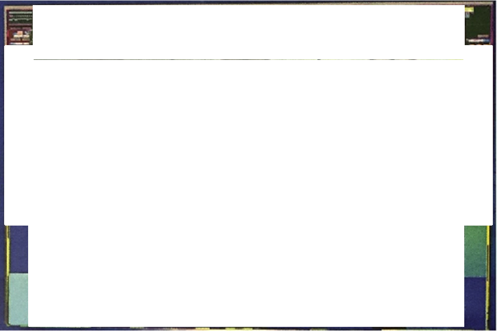
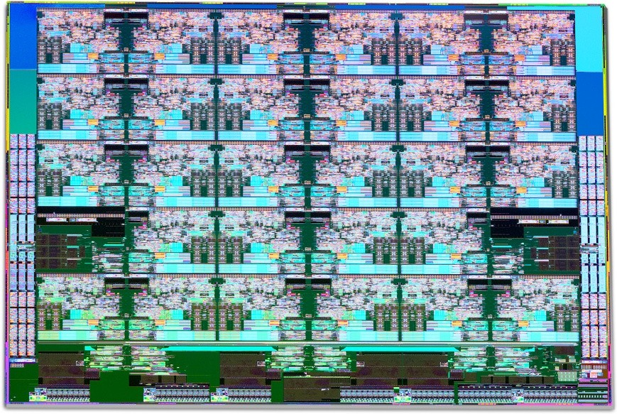
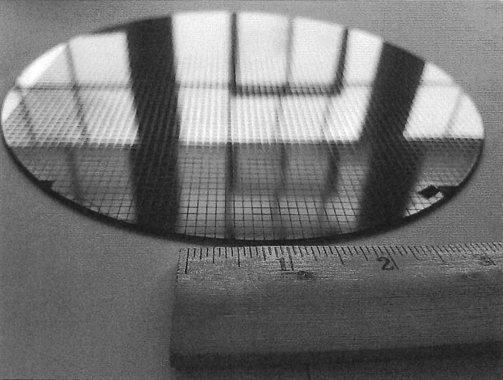

> [!note] 芯片成本
> 这一章主要给出了影响芯片成本的因素，并如何合理的控制芯片成本，这也是计算机架构师应该关注的事情。

## Trends in Cost(成本趋势)

Although costs tend to be less important in some computer designs—specifically supercomputers—cost-sensitive designs are of growing significance. Indeed, in the past 35 years, the use of technology improvements to lower cost, as well as increase performance, has been a major theme in the computer industry.

> 尽管成本在某些计算机设计(特别是超级计算机)中往往不太重要，但成本敏感的设计具有越来越重要的意义。确实，在过去的 35 年中，将技术改进来降低成本以及提高性能一直是计算机行业的主要主题。

Textbooks often ignore the cost half of cost-performance because costs change, thereby dating books, and because the issues are subtle and differ across industry segments. Nevertheless, it’s essential for computer architects to have an under- standing of cost and its factors in order to make intelligent decisions about whether a new feature should be included in designs where cost is an issue. (Imagine archi- tects designing skyscrapers without any information on costs of steel beams and concrete!)

> 教科书通常会忽略成本绩效的一半成本，因为成本变化，与书籍约会，并且由于各个行业各个细分市场都很微妙且有所不同。然而，对于计算机架构师来说，要有理解的成本及其因素至关重要，以便对是否应该在成本是问题的设计中包括新功能做出明智的决定。(想象一下设计摩天大楼，没有任何有关钢梁和混凝土成本的信息！)

This section discusses the major factors that influence the cost of a computer and how these factors are changing over time.

> 本节讨论影响计算机成本以及这些因素如何随着时间而变化的主要因素。

### The Impact of Time, Volume, and Commoditization(时间，数量和商品化的影响)

The cost of a manufactured computer component decreases over time even without significant improvements in the basic implementation technology. The underlying principle that drives costs down is the _learning curve_—manufacturing costs decrease over time. The learning curve itself is best measured by change in _yield_—the percentage of manufactured devices that survives the testing procedure. Whether it is a chip, a board, or a system, designs that have twice the yield will have half the cost.

> 即使没有显着改善基本实施技术，制成的计算机组件的成本也随着时间的推移而下降。驱动成本降低的基本原则是 _learning curve_ 制造成本随着时间的推移而下降。学习曲线本身可以通过 _yield_ 的变化来衡量，即生产测试程序的制造设备的百分比。无论是芯片，板还是系统，其产量的两倍的设计都将具有一半的成本。

Understanding how the learning curve improves yield is critical to projecting costs over a product’s life. One example is that the price per megabyte of DRAM has dropped over the long term. Since DRAMs tend to be priced in close relation- ship to cost—except for periods when there is a shortage or an oversupply—price and cost of DRAM track closely.

> 了解学习曲线如何提高产量对于将成本投射到产品的生活中至关重要。一个例子是，从长远来看，DRAM 的每兆字节的价格已经下降。由于 DRAM 倾向于以紧密的关系定价(除了短缺或过度供应的时期，DRAM 轨道的价格和成本都紧密。

Microprocessor prices also drop over time, but because they are less standard- ized than DRAMs, the relationship between price and cost is more complex. In a period of significant competition, price tends to track cost closely, although micro- processor vendors probably rarely sell at a loss.

> 微处理器价格也随时间下跌，但是由于标准的标准不如 DRAM，因此价格和成本之间的关系更为复杂。在竞争激烈的时期，价格往往会紧密跟踪成本，尽管微处理商供应商可能很少出售。

Volume is a second key factor in determining cost. Increasing volumes affect cost in several ways. First, they decrease the time needed to get through the learn- ing curve, which is partly proportional to the number of systems (or chips) man- ufactured. Second, volume decreases cost because it increases purchasing and manufacturing efficiency. As a rule of thumb, some designers have estimated that costs decrease about 10% for each doubling of volume. Moreover, volume decreases the amount of development costs that must be amortized by each com- puter, thus allowing cost and selling price to be closer and still make a profit.

> 体积是确定成本的第二个关键因素。增加的量会以多种方式影响成本。首先，它们减少了通过学习曲线所需的时间，该曲线与系统(或芯片)人工的数量部分成正比。其次，体积会降低成本，因为它提高了购买和制造效率。根据经验，一些设计师估计，每次加倍的成本降低了约 10％。此外，数量减少了每个计算机必须摊销的开发成本量，从而允许成本和销售价格更接近并仍然获利。

_Commodities_ are products that are sold by multiple vendors in large volumes and are essentially identical. Virtually all the products sold on the shelves of gro- cery stores are commodities, as are standard DRAMs, Flash memory, monitors, and keyboards. In the past 30 years, much of the personal computer industry has become a commodity business focused on building desktop and laptop com- puters running Microsoft Windows.

> _commodities_ 是由大量供应商出售的产品，本质上是相同的。几乎所有在谷物商店货架上出售的产品都是商品，标准 DRAM，闪存，监视器和键盘也是如此。在过去的 30 年中，许多个人计算机行业已成为专注于建造 Microsoft Windows 的商品业务。

Because many vendors ship virtually identical products, the market is highly competitive. Of course, this competition decreases the gap between cost and selling price, but it also decreases cost. Reductions occur because a commodity market has both volume and a clear product definition, which allows multiple suppliers to compete in building components for the commodity product. As a result, the over- all product cost is lower because of the competition among the suppliers of the components and the volume efficiencies the suppliers can achieve. This rivalry has led to the low end of the computer business being able to achieve better price-performance than other sectors and has yielded greater growth at the low end, although with very limited profits (as is typical in any commodity business).

> 由于许多供应商运送了几乎相同的产品，因此市场具有很高的竞争力。当然，这项竞争减少了成本和销售价格之间的差距，但也降低了成本。减少是因为商品市场既有数量又有明确的产品定义，从而使多个供应商能够竞争商品产品的建造组件。结果，由于组件的供应商之间的竞争以及供应商可以实现的效率，因此所有产品成本较低。这种竞争导致计算机业务的低端能够取得比其他部门更好的价格表现，并且在低端的利润非常有限(无论在任何商品业务中都是典型的)。

### Cost of an Integrated Circuit(集成电路的成本)

Why would a computer architecture book have a section on integrated circuit costs? In an increasingly competitive computer marketplace where standard parts—disks, Flash memory, DRAMs, and so on—are becoming a significant por- tion of any system’s cost, integrated circuit costs are becoming a greater portion of the cost that varies between computers, especially in the high-volume, cost- sensitive portion of the market. Indeed, with PMDs’ increasing reliance of whole _systems on a chip_ (SOC), the cost of the integrated circuits is much of the cost of the PMD. Thus computer designers must understand the costs of chips in order to understand the costs of current computers.

> 为什么一本计算机架构书有一个集成电路成本的部分？在竞争激烈的计算机市场中，标准零件(磁盘，闪存，DRAMS 等)已成为任何系统成本的重要意义，集成的电路成本正成为计算机之间变化的成本的更大部分在大量的，成本敏感的市场中。确实，随着 PMD 对整个系统对芯片(SOC)的依赖不断增加，综合电路的成本是 PMD 的大部分成本。因此，计算机设计人员必须了解芯片的成本，以了解当前计算机的成本。

Although the costs of integrated circuits have dropped exponentially, the basic process of silicon manufacture is unchanged: A _wafer_ is still tested and chopped into _dies_ that are packaged (see [Figures 1.14–1.16](#_bookmark23)). Therefore the cost of a pack- aged integrated circuit is

> 尽管集成电路的成本呈指数下降，但硅制造的基本过程却没有变化：_wafer_ 仍经过测试并切成包装的 _dies_(见[图 1.14-1.16](#_bookmark23))。因此，包装的集成电路的成本为

Cost of integrated circuit Cost of die + Cost of testing die + Cost of packaging and final test

> 综合电路成本模具的成本 + 测试成本模具 + 包装成本和最终测试成本

### Final test yield(最终测试收益)

In this section, we focus on the cost of dies, summarizing the key issues in testing and packaging at the end.

> 在本节中，我们专注于模具的成本，总结了最后的测试和包装中的关键问题。

Learning how to predict the number of good chips per wafer requires first learn- ing how many dies fit on a wafer and then learning how to predict the percentage of those that will work. From there it is simple to predict cost:

> 学习如何预测每个晶圆的良好芯片数量需要首先学习适合晶圆的模具，然后学习如何预测将有效的模具。从那里可以简单地预测成本：

> ===

The most interesting feature of this initial term of the chip cost equation is its sen- sitivity to die size, shown below.

> 芯片成本方程式的最初术语的最有趣的功能是其对模具大小的定位，如下所示。

The number of dies per wafer is approximately the area of the wafer divided by the area of the die. It can be more accurately estimated by

> 每个晶圆的模具次数大约是晶圆的面积除以模具的面积。可以更准确地估计

> ===

The first term is the ratio of wafer area (${\pi * r}^{2}$) to die area. The second compensates for the “square peg in a round hole” problem—rectangular dies near the periphery of round wafers. Dividing the circumference ($\pi * d$) by the diagonal of a square die is approximately the number of dies along the edge.

> 第一项是晶圆面积的比率。第二个补偿了“圆孔中的方形钉”问题 - 圆形晶状体周围附近的区域死亡。将圆周除以正方形模具的对角线大约是沿边缘的模具的数量。

Example Find the number of dies per 300 mm (30 cm) wafer for a die that is 1.5 cm on a side and for a die that is 1.0 cm on a side.

> 示例查找每 300 毫米(30 厘米)晶圆的模具的数量，侧面为 1.5 厘米，侧面为 1.0 厘米。




Figure 1.14 Photograph of an Intel Skylake microprocessor die, which is evaluated in [Chapter 4](#_bookmark165).

> 图 1.14 Intel Skylake 微处理器模具的照片，该图在[第 4 章](#_bookmark165)中进行了评估。

Figure 1.15 The components of the microprocessor die in [Figure 1.14](#_bookmark23) are labeled with their functions.

> 图 1.15 在[图 1.14](#_bookmark23) 中，微处理器的组件带有其功能。



Figure 1.16 This 200 mm diameter wafer of RISC-V dies was designed by SiFive. It has two types of RISC-V dies using an older, larger processing line. An FE310 die is 2.65 mm 2.72 mm and an SiFive test die that is 2.89 mm 2.72 mm. The wafer contains 1846 of the former and 1866 of the latter, totaling 3712 chips.

> 图 1.16 RISC-V 模具的直径 200 毫米直径的晶圆是由 Sifive 设计的。它具有两种类型的 RISC-V 使用较旧的较大的处理线路死亡。FE310 模具为 2.65 毫米 2.72 毫米，一个 2.89 毫米 2.72 毫米的 Sifive 测试模具。晶圆包含前者的 1846 年和 1866 年的 1866 年，总计 3712 芯片。

> ===

However, this formula gives only the maximum number of dies per wafer. The critical question is: What is the fraction of _good_ dies on a wafer, or the _die yield_?A simple model of integrated circuit yield, which assumes that defects are randomly distributed over the wafer and that yield is inversely proportional to the complexity of the fabrication process, leads to the following:

> 但是，该公式仅给出每个晶圆的最大模具数量。关键的问题是：_good_ 死亡的比例是多少，或者 _die tours_？一种简单的集成电路产量模型，假设缺陷是随机分布在晶片上，并且该产率与与之复杂的复杂性成反比制造过程，导致以下内容：

Die yield = Wafer yield × 1/(1 + Defects per unit area ×Die area)_N_

> 模量=晶片产量 ×1/(单位面积 1 + 缺陷 × 模具区域)_n_

This Bose-Einstein formula is an empirical model developed by looking at the yield of many manufacturing lines (Sydow, 2006), and it still applies today. _Wafer yield_ accounts for wafers that are completely bad and so need not be tested. For simplicity, we’ll just assume the wafer yield is 100%. Defects per unit area is a measure of the random manufacturing defects that occur. In 2017 the value was typically 0.08–0.10 defects per square inch for a 28-nm node and 0.10–0.30 for the newer 16 nm node because it depends on the maturity of the process (recall the learning curve mentioned earlier). The metric versions are 0.012–0.016 defects per square centimeter for 28 nm and 0.016–0.047 for 16 nm. Finally, N is a parameter called the process-complexity factor, a measure of manufacturing difficulty. For 28 nm processes in 2017, N is 7.5–9.5. For a 16 nm process, N ranges from 10 to 14.

> 这个 Bose-Einstein 公式是通过查看许多制造线的产量而开发的经验模型(Sydow，2006 年)，并且今天仍然适用。_wafer yield_ 对完全不好的晶粒说明，因此不必进行测试。为简单起见，我们只假设晶圆产量为 100％。单位面积缺陷是对发生的随机制造缺陷的量度。在 2017 年，对于 28 nm 节点，该值通常为 0.08–0.10 每平方英寸的缺陷，而新的 16 nm 节点的值为 0.10–0.30，因为它取决于该过程的成熟度(请回顾前面提到的学习曲线)。度量版本为 0.012-0.016 每平方厘米的缺陷为 28 nm，为 0.016-0.047，为 16 nm。最后，n 是一个称为过程复杂性因子的参数，这是制造难度的量度。对于 2017 年的 28 nm 流程，n 为 7.5–9.5。对于 16 nm 的过程，n 的范围为 10 到 14。

Example Find the die yield for dies that are 1.5 cm on a side and 1.0 cm on a side, assuming a defect density of 0.047 per ${cm}^{2}$ and _N_ is 12.

> 示例在侧面找到 1.5 厘米的模具的模具产量，侧面为 1.0 cm，假设缺陷密度为每厘米 0.047 cm，而 _n_ 为 12。

> ===

The bottom line is the number of good dies per wafer. Less than half of all the large dies are good, but nearly 70% of the small dies are good.

> 底线是每晶片的好污垢数。不到一半的大模具很好，但是将近 70％的小模具良好。

Although many microprocessors fall between 1.00 and 2.25 ${cm}^{2}$, low-end embedded 32-bit processors are sometimes as small as 0.05 ${cm}^{2}$, processors used for embedded control (for inexpensive IoT devices) are often less than 0.01 ${cm}^{2}$, and high-end server and GPU chips can be as large as 8 ${cm}^{2}$.

> 尽管许多微处理器介于 1.00 至 2.25 cm 之间，但低端嵌入式 32 位处理器有时会小至 0.05 cm，用于嵌入式控制的处理器(用于廉价的控制器)物联网设备)通常小于 0.01 cm，高端服务器和 GPU 芯片可以大至 8 cm。

Given the tremendous price pressures on commodity products such as DRAM and SRAM, designers have included redundancy as a way to raise yield. For a number of years, DRAMs have regularly included some redundant memory cells so that a certain number of flaws can be accommodated. Designers have used sim- ilar techniques in both standard SRAMs and in large SRAM arrays used for caches within microprocessors. GPUs have 4 redundant processors out of 84 for the same reason. Obviously, the presence of redundant entries can be used to boost the yield significantly.

> 鉴于 DRAM 和 SRAM 等商品产品的价格压力很大，设计师包括冗余，以提高产量。多年来，DRAM 定期包括一些冗余记忆单元，以便可以容纳一定数量的缺陷。设计师在标准 SRAM 和微处理器中用于缓存的大型 SRAM 阵列中都使用了模拟技术。出于相同的原因，GPU 在 84 个中有 4 个冗余处理器。显然，可以使用冗余条目的存在来显着提高产量。

In 2017 processing of a 300 mm (12-inch) diameter wafer in a 28-nm technol- ogy costs between `$4000` and `$5000`, and a 16-nm wafer costs about `$7000`. Assuming a processed wafer cost of `$7000`, the cost of the 1.00 ${cm }^{2}$ die would be around `$16`, but the cost per die of the 2.25 ${cm }^{2}$ die would be about `$58`, or almost four times the cost of a die that is a little over twice as large.

> 在 2017 年处理 300 毫米(12 英寸)直径的晶圆，以 28 纳米的技术成本介于 `$4000` 和 `$5000` 之间，而 16 纳米的晶圆成本约为 $7000。假设处理的晶圆成本为 $7000，则 1.00 cm 死亡的费用将大约$ 16``` $ 16'，但是 2.25 cm die 的每日费用为 2.25 cm 大约是“ $ 58”，或者是死亡成本的四倍，其大于两倍。

What should a computer designer remember about chip costs? The manufactur- ing process dictates the wafer cost, wafer yield, and defects per unit area, so the sole control of the designer is die area. In practice, because the number of defects per unit area is small, the number of good dies per wafer, and therefore the cost per die, grows roughly as the square of the die area. The computer designer affects die size, and thus cost, both by what functions are included on or excluded from the die and by the number of I/O pins.

> 计算机设计师应该记住芯片成本吗？制造过程决定了晶圆成本，晶圆产量和单位区域的缺陷，因此设计师的唯一控制权是死亡区域。实际上，由于单位面积的缺陷数量很少，因此每晶片的好数量数量，因此每次死亡的成本大致随着模具区域的正方形而大致增长。计算机设计人员会影响模具尺寸，因此成本，包括在模具中包含或排除的功能以及 I/O 引脚的数量。

Before we have a part that is ready for use in a computer, the die must be tested (to separate the good dies from the bad), packaged, and tested again after packag- ing. These steps all add significant costs, increasing the total by half.

> 在我们准备好在计算机中使用的零件之前，必须对模具进行测试(要将好死亡与不良模具分开)，打包并在包装后再次进行测试。这些步骤都增加了大量成本，将总成本增加了一半。

The preceding analysis focused on the variable costs of producing a functional die, which is appropriate for high-volume integrated circuits. There is, however, one very important part of the fixed costs that can significantly affect the cost of an integrated circuit for low volumes (less than 1 million parts), namely, the cost of a mask set. Each step in the integrated circuit process requires a separate mask. Therefore, for modern high-density fabrication processes with up to 10 metal layers, mask costs are about `$4` million for 16 nm and `$1.5` million for 28 nm.

> 前面的分析集中在产生功能性模具的可变成本上，该功能模具适用于大量综合电路。但是，固定成本中有一个非常重要的部分可以显着影响低卷(少于 100 万个零件)的集成电路的成本，即面具集的成本。集成电路过程中的每个步骤都需要单独的掩码。因此，对于具有多达 10 个金属层的现代高密度制造工艺，面罩成本约为 16 nm 的 400 万美元，而 28 nm 的面罩成本为 1500 万美元。

The good news is that semiconductor companies offer “shuttle runs” to dramat- ically lower the costs of tiny test chips. They lower costs by putting many small designs onto a single die to amortize the mask costs, and then later split the dies into smaller pieces for each project. Thus TSMC delivers 80–100 untested dies that are 1.57 1.57 mm in a 28 nm process for `$30,000` in 2017. Although these die are tiny, they offer the architect millions of transistors to play with. For example, sev- eral RISC-V processors would fit on such a die.

> 好消息是，半导体公司提供“shuttle runs”，以戏剧性地降低小型测试芯片的成本。他们通过将许多小型设计放在单个模具上以摊销面具成本，然后将模具分成小块，以降低成本。因此，TSMC 在 2017 年的 28 nm 工艺中提供 80-100 个未经测试的模具，在 28 nm 的过程中为 1.57 1.57 毫米。尽管这些模具很小，但它们为工程师提供了数百万晶体管。例如，SEV-SEV-RISC-V 处理器适合这种模具。

Although shuttle runs help with prototyping and debugging runs, they don’t address small-volume production of tens to hundreds of thousands of parts. Because mask costs are likely to continue to increase, some designers are incorpo- rating reconfigurable logic to enhance the flexibility of a part and thus reduce the cost implications of masks.

> 尽管航天飞机运行有助于原型制作和调试运行，但它们并没有解决数十至数十万个零件的小批量生产。由于面具成本可能会继续增加，因此一些设计师不可能重新配置逻辑，以增强零件的灵活性，从而降低面具的成本含义。

### Cost Versus Price(成本与价格)

With the commoditization of computers, the margin between the cost to manufac- ture a product and the price the product sells for has been shrinking. Those margins pay for a company’s research and development (R&D), marketing, sales, manufacturing equipment maintenance, building rental, cost of financing, pretax profits, and taxes. Many engineers are surprised to find that most companies spend only 4% (in the commodity PC business) to 12% (in the high-end server business) of their income on R&D, which includes all engineering.

> 随着计算机的商品化，制造产品的成本与产品出售的价格之间的余量正在缩小。这些利润率为公司的研发(R＆D)，营销，销售，制造设备维护，建筑租金，融资成本，税前利润和税收付费。许多工程师惊讶地发现，大多数公司在 R＆D 上的收入中仅花费 4％(在商品 PC 业务中)(在高端服务器业务中)，其中包括所有工程。

### Cost of Manufacturing Versus Cost of Operation(制造成本与运营成本)

For the first four editions of this book, cost meant the cost to build a computer and price meant price to purchase a computer. With the advent of WSCs, which contain tens of thousands of servers, the cost to operate the computers is significant in addi- tion to the cost of purchase. Economists refer to these two costs as capital expenses (CAPEX) and operational expenses (OPEX).

> 对于本书的前四个版本，成本意味着建造计算机的成本，价格意味着购买计算机的价格。随着 WSC 的出现，其中包含数以万计的服务器，操作计算机的成本是重大的购买成本。经济学家将这两项费用称为资本费用(CAPEX)和运营费用(OPEX)。

As [Chapter 6](#_bookmark268) shows, the amortized purchase price of servers and networks is about half of the monthly cost to operate a WSC, assuming a short lifetime of the IT equipment of 3–4 years. About 40% of the monthly operational costs are for power use and the amortized infrastructure to distribute power and to cool the IT equipment, despite this infrastructure being amortized over 10–15 years. Thus, to lower operational costs in a WSC, computer architects need to use energy efficiently.

> 正如[第 6 章](#_bookmark268)所示，服务器和网络的摊销购买价格约为经营 WSC 的每月成本的一半，假设 IT 设备的寿命为 3 - 4 年。每月运营成本的大约 40％用于电力使用和摊销基础设施，以分发电力和冷却 IT 设备，尽管该基础设施已在 10 - 15 年内摊销。因此，为了降低 WSC 中的运营成本，计算机工程师需要有效地使用能源。
