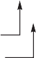

## Historical Perspective and References

Section M.5 (available online) features a discussion on the development of pipelining and instruction-level parallelism. We provide numerous references for further reading and exploration of these topics. Section M.5 covers both Chapter 3 and Appendix H.

## Case Studies and Exercises by Jason D. Bakos and Robert P. Colwell

### Case Study: Exploring the Impact of Microarchitectural Techniques

##### _Concepts illustrated by this case study_

- Basic Instruction Scheduling, Reordering, Dispatch
- Multiple Issue and Hazards
- Register Renaming
- Out-of-Order and Speculative Execution
- Where to Spend Out-of-Order Resources

You are tasked with designing a new processor microarchitecture and you are try- ing to determine how best to allocate your hardware resources. Which of the hard- ware and software techniques you learned in Chapter 3 should you apply? You have a list of latencies for the functional units and for memory, as well as some representative code. Your boss has been somewhat vague about the performance requirements of your new design, but you know from experience that, all else being equal, faster is usually better. Start with the basics. [Figure 3.47](#_bookmark157) provides a sequence of instructions and list of latencies.

1. What is the baseline performance (in cycles, per loop iteration) of the code sequence in [Figure 3.47](#_bookmark157) if no new instruction’s execution could be

| Latencies beyond single cycle |     |
| ----------------------------- | --- |
| Memory LD                     | +3  |
| Memory SD                     | +1  |
| Integer ADD, SUB              | +0  |
| Branches                      | +1  |
| fadd.d                        | +2  |
| fmul.d                        | +4  |
| fdiv.d                        | +10 |

Figure 3.47 Code and latencies for Exercises 3.1 through 3.6.

initiated until the previous instruction’s execution had completed? Ignore front-end fetch and decode. Assume for now that execution does not stall for lack of the next instruction, but only one instruction/cycle can be issued. Assume the branch is taken, and that there is a one-cycle branch delay slot.

1. [10] <3.1, 3.2> Think about what latency numbers really mean—they indicate the number of cycles a given function requires to produce its output. If the overall pipeline stalls for the latency cycles of each functional unit, then you are at least guar- anteed that any pair of back-to-back instructions (a "producer" followed by a "consumer" ) will execute correctly. But not all instruction pairs have a pro- ducer/consumer relationship. Sometimes two adjacent instructions have nothing to do with each other. How many cycles would the loop body in the code sequence in [Figure 3.47](#_bookmark157) require if the pipeline detected true data dependences and only stalled on those, rather than blindly stalling everything just because one functional unit is busy? Show the code with `<stall>` inserted where necessary to accom- modate stated latencies. (_Hint:_ an instruction with latency +2 requires two `<stall>` cycles to be inserted into the code sequence.) Think of it this way: a one-cycle instruction has latency 1 + 0, meaning zero extra wait states. So, latency 1 + 1 implies one stall cycle; latency 1 + _N_ has _N_ extra stall cycles.
2. [15] <3.1, 3.2> Consider a multiple-issue design. Suppose you have two execu- tion pipelines, each capable of beginning execution of one instruction per cycle, and enough fetch/decode bandwidth in the front end so that it will not stall your execution. Assume results can be immediately forwarded from one execution unit to another, or to itself. Further assume that the only reason an execution pipeline would stall is to observe a true data dependency. Now how many cycles does the loop require?
3. [10] <3.1, 3.2> In the multiple-issue design of Exercise 3.3, you may have rec- ognized some subtle issues. Even though the two pipelines have the exact same instruction repertoire, they are neither identical nor interchangeable, because there is an implicit ordering between them that must reflect the ordering of the instruc- tions in the original program. If instruction _N_ + 1 begins execution in Execution Pipe 1 at the same time that instruction _N_ begins in Pipe 0, and _N_ + 1 happens to require a shorter execution latency than _N_, then _N_ + 1 will complete before _N_ (even though program ordering would have implied otherwise). Recite at least two reasons why that could be hazardous and will require special considerations in the microarchitecture. Give an example of two instructions from the code in [Figure 3.47](#_bookmark157) that demonstrate this hazard.
4. [20] <3.1, 3.2> Reorder the instructions to improve performance of the code in [Figure 3.47](#_bookmark157). Assume the two-pipe machine in Exercise 3.3 and that the out-of- order completion issues of Exercise 3.4 have been dealt with successfully. Just worry about observing true data dependences and functional unit latencies for now. How many cycles does your reordered code take?
5. [10/10/10] <3.1, 3.2> Every cycle that does not initiate a new operation in a pipe is a lost opportunity, in the sense that your hardware is not living up to its potential.
6. [10] <3.1, 3.2> In your reordered code from Exercise 3.5, what fraction of all cycles, counting both pipes, were wasted (did not initiate a new op)?
7. [10] <3.1, 3.2> Loop unrolling is one standard compiler technique for finding more parallelism in code, in order to minimize the lost opportunities for performance. Hand-unroll two iterations of the loop in your reordered code from Exercise 3.5.
8. [10] <3.1, 3.2> What speedup did you obtain? (For this exercise, just color the _N_ + 1 iteration’s instructions green to distinguish them from the *N*th iteration’s instructions; if you were actually unrolling the loop, you would have to reassign registers to prevent collisions between the iterations.)
9. [15] <3.4> Computers spend most of their time in loops, so multiple loop itera- tions are great places to speculatively find more work to keep CPU resources busy.

Nothing is ever easy, though; the compiler emitted only one copy of that loop’s code, so even though multiple iterations are handling distinct data, they will appear to use the same registers. To keep multiple iterations’ register usages from colliding, we rename their registers. [Figure 3.48](#_bookmark158) shows example code that we would like our hardware to rename. A compiler could have simply unrolled the loop and used different registers to avoid conflicts, but if we expect our hardware to unroll the loop, it must also do the register renaming. How? Assume your hard- ware has a pool of temporary registers (call them T registers, and assume that there are 64 of them, T0 through T63) that it can substitute for those registers designated by the compiler. This rename hardware is indexed by the src (source) register designation, and the value in the table is the T register of the last destination that targeted that register. (Think of these table values as producers, and the src reg- isters are the consumers; it doesn’t much matter where the producer puts its result as long as its consumers can find it.) Consider the code sequence in [Figure 3.48](#_bookmark158). Every time you see a destination register in the code, substitute the next available T, beginning with T9. Then update all the src registers accordingly, so that true data dependences are maintained. Show the resulting code. (_Hint:_ see [Figure 3.49](#_bookmark159).)

1. [20] <3.4> Exercise 3.7 explored simple register renaming: when the hardware register renamer sees a source register, it substitutes the destination T register of the last instruction to have targeted that source register. When the rename table sees a destination register, it substitutes the next available T for it, but superscalar designs need to handle multiple instructions per clock cycle at every stage in the machine, including the register renaming. A SimpleScalar processor would therefore look up both src register mappings for each instruction and allocate a new dest mapping per clock cycle. Superscalar processors must be able to do that as well, but they must also ensure that any dest-to-src relationships between the two concurrent instructions are handled correctly. Consider the sample code sequence in [Figure 3.50](#_bookmark160). Assume that we would like to simultaneously rename the first two instructions. Further assume that the next two available T reg- isters to be used are known at the beginning of the clock cycle in which these two instructions are being renamed. Conceptually, what we want is for the first instruc- tion to do its rename table lookups and then update the table per its destination’s T register. Then the second instruction would do exactly the same thing, and any inter-instruction dependency would thereby be handled correctly. But there’s not enough time to write that T register designation into the renaming table and then look it up again for the second instruction, all in the same clock cycle. That register substitution must instead be done live (in parallel with the register rename table update). [Figure 3.51](#_bookmark161) shows a circuit diagram, using multiplexers and com- parators, that will accomplish the necessary on-the-fly register renaming. Your task is to show the cycle-by-cycle state of the rename table for every instruction of the code shown in [Figure 3.50](#_bookmark160). Assume the table starts out with every entry equal to its index (T0 = 0; T1 = 1, …) ([Figure 3.51](#_bookmark161)).

> Figure 3.49 Expected output of register renaming.
> Figure 3.50 Sample code for superscalar register renaming.
> 
> Figure 3.51 Initial state of the register renaming table.

1. [5] <3.4> If you ever get confused about what a register renamer has to do, go back to the assembly code you’re executing, and ask yourself what has to happen for the right result to be obtained. For example, consider a three-way superscalar machine renaming these three instructions concurrently: addi x1, x1, x1 addi x1, x1, x1 addi x1, x1, x1 If the value of x1 starts out as 5, what should its value be when this sequence has executed?
2. [20] <3.4, 3.7> Very long instruction word (VLIW) designers have a few basic choices to make regarding architectural rules for register use. Suppose a VLIW is designed with self-draining execution pipelines: once an operation is initiated, its results will appear in the destination register at most _L_ cycles later (where _L_ is the latency of the operation). There are never enough registers, so there is a temptation to wring maximum use out of the registers that exist. Consider [Figure 3.52](#_bookmark162). If loads have a 1 + 2 cycle latency, unroll this loop once, and show how a VLIW capable of two loads and two adds per cycle can use the minimum number of registers, in the absence of any pipeline interruptions or stalls. Give an example of an event that, in the presence of self-draining pipelines, could disrupt this pipelining and yield wrong results.
3. [10/10/10] <3.3> Assume a five-stage single-pipeline microarchitecture (fetch, decode, execute, memory, write-back) and the code in [Figure 3.53](#_bookmark163). All ops are one cycle except LW and SW, which are 1 + 2 cycles, and branches, which are 1 +1 cycles. There is no forwarding. Show the phases of each instruction per clock cycle for one iteration of the loop.
4. [10] <3.3> How many clock cycles per loop iteration are lost to branch overhead?
5. [10] <3.3> Assume a static branch predictor, capable of recognizing a back- ward branch in the Decode stage. Now how many clock cycles are wasted on branch overhead?

Figure 3.52 Sample VLIW code with two adds, two loads, and two stalls.
Figure 3.54 Microarchitecture for Exercise 3.12.

1. [10] <3.3> Assume a dynamic branch predictor. How many cycles are lost on a correct prediction?

<!-- -->

1. [15/20/20/10/20] <3.4, 3.6> Let’s consider what dynamic scheduling might achieve here. Assume a microarchitecture as shown in [Figure 3.54](#_bookmark164). Assume that the arithmetic-logical units (ALUs) can do all arithmetic ops (fmul.d, fdiv.d, fadd.d, addi, sub) and branches, and that the Reservation Station (RS) can dispatch, at most, one operation to each functional unit per cycle (one op to each ALU plus one memory op to the fld/ fsd).
2. [15] <3.4> Suppose all of the instructions from the sequence in [Figure 3.47](#_bookmark157) are present in the RS, with no renaming having been done. Highlight any instruc- tions in the code where register renaming would improve performance. (_Hint:_ look for read-after-write and write-after-write hazards. Assume the same func- tional unit latencies as in [Figure 3.47](#_bookmark157).)
3. [20] <3.4> Suppose the register-renamed version of the code from part (a) is resident in the RS in clock cycle _N_, with latencies as given in [Figure 3.47](#_bookmark157). Show how the RS should dispatch these instructions out of order, clock by clock, to obtain optimal performance on this code. (Assume the same RS restrictions as in part (a). Also assume that results must be written into the RS before they’re available for use—no bypassing.) How many clock cycles does the code sequence take?
4. [20] <3.4> Part (b) lets the RS try to optimally schedule these instructions. But in reality, the whole instruction sequence of interest is not usually present in the RS. Instead, various events clear the RS, and as a new code sequence streams in from the decoder, the RS must choose to dispatch what it has. Suppose that the RS is empty. In cycle 0, the first two register-renamed instructions of this sequence appear in the RS. Assume it takes one clock cycle to dispatch any op, and assume functional unit latencies are as they were for Exercise 3.2. Fur- ther assume that the front end (decoder/register-renamer) will continue to supply two new instructions per clock cycle. Show the cycle-by-cycle order of dispatch of the RS. How many clock cycles does this code sequence require now?
5. [10] <3.4> If you wanted to improve the results of part (c), which would have helped most: (1) Another ALU? (2) Another LD/ST unit? (3) Full bypassing of ALU results to subsequent operations? or (4) Cutting the longest latency in half? What’s the speedup?
6. [20] <3.6> Now let’s consider speculation, the act of fetching, decoding, and executing beyond one or more conditional branches. Our motivation to do this is twofold: the dispatch schedule we came up with in part (c) had lots of nops, and we know computers spend most of their time executing loops (which implies the branch back to the top of the loop is pretty predictable). Loops tell us where to find more work to do; our sparse dispatch schedule suggests we have opportuni- ties to do some of that work earlier than before. In part (d) you found the critical path through the loop. Imagine folding a second copy of that path onto the sched- ule you got in part (b). How many more clock cycles would be required to do two loops’ worth of work (assuming all instructions are resident in the RS)? (Assume all functional units are fully pipelined.)

### Exercises

1. [25] <3.7, 3.8> In this exercise, you will explore performance trade-offs between three processors that each employ different types of multithreading (MT). Each of these processors is superscalar, uses in-order pipelines, requires a fixed three-cycle stall following all loads and branches, and has identical L1 caches. Instructions from the same thread issued in the same cycle are read in program order and must not contain any data or control dependences.

- Processor A is a superscalar simultaneous MT architecture, capable of issuing up to two instructions per cycle from two threads.
- Processor B is a fine-grained MT architecture, capable of issuing up to four instructions per cycle from a single thread and switches threads on any pipeline stall.
- Processor C is a coarse-grained MT architecture, capable of issuing up to eight instructions per cycle from a single thread and switches threads on an L1 cache miss.

Our application is a list searcher, which scans a region of memory for a specific value stored in R9 between the address range specified in R16 and R17. It is par- allelized by evenly dividing the search space into four equal-sized contiguous blocks and assigning one search thread to each block (yielding four threads). Most of each thread’s runtime is spent in the following unrolled loop body:

Assume the following:

- A barrier is used to ensure that all threads begin simultaneously.
- The first L1 cache miss occurs after two iterations of the loop.
- None of the BEQAL branches is taken.
- The BLT is always taken.
- All three processors schedule threads in a round-robin fashion.

Determine how many cycles are required for each processor to complete the first two iterations of the loop.

1. [25/25/25] <3.2, 3.7> In this exercise, we look at how software techniques can extract instruction-level parallelism (ILP) in a common vector loop. The following loop is the so-called DAXPY loop (double-precision _aX_ plus _Y_) and is the central operation in Gaussian elimination. The following code implements the DAXPY operation, _Y aX_ + _Y_, for a vector length 100. Initially, R1 is set to the base address of array _X_ and R2 is set to the base address of _Y_:
2. [25] <3.2> Assume a single-issue pipeline. Show how the loop would look both unscheduled by the compiler and after compiler scheduling for both floating-point operation and branch delays, including any stalls or idle clock cycles. What is the execution time (in cycles) per element of the result vector, Y, unscheduled and scheduled? How much faster must the clock be for proces- sor hardware alone to match the performance improvement achieved by the scheduling compiler? (Neglect any possible effects of increased clock speed on memory system performance.)
3. [25] <3.2> Assume a single-issue pipeline. Unroll the loop as many times as necessary to schedule it without any stalls, collapsing the loop overhead instructions. How many times must the loop be unrolled? Show the instruction sched- ule. What is the execution time per element of the result?
4. [25] <3.7> Assume a VLIW processor with instructions that contain five operations, as shown in [Figure 3.20](#_bookmark121). We will compare two degrees of loop unrolling. First, unroll the loop 6 times to extract ILP and schedule it without any stalls (i.e., completely empty issue cycles), collapsing the loop overhead instructions, and then repeat the process but unroll the loop 10 times. Ignore the branch delay slot. Show the two schedules. What is the execution time per element of the result vector for each schedule? What percent of the operation slots are used in each schedule? How much does the size of the code differ between the two schedules? What is the total register demand for the two schedules?
5. [20/20] <3.4, 3.5, 3.7, 3.8> In this exercise, we will look at how variations on Tomasulo’s algorithm perform when running the loop from Exercise 3.14. The functional units (FUs) are described in the following table.

Assume the following:

- Functional units are not pipelined.
- There is no forwarding between functional units; results are communicated by the common data bus (CDB).
- The execution stage (EX) does both the effective address calculation and the memory access for loads and stores. Thus, the pipeline is IF/ID/IS/EX/WB.
- Loads require one clock cycle.
- The issue (IS) and write-back (WB) result stages each require one clock cycle.
- There are five load buffer slots and five store buffer slots.
- Assume that the Branch on Not Equal to Zero (BNEZ) instruction requires one clock cycle.

1. [20] <3.4–3.5> For this problem use the single-issue Tomasulo MIPS pipeline of [Figure 3.10](#_bookmark108) with the pipeline latencies from the preceding table. Show the number of stall cycles for each instruction and what clock cycle each instruction begins execution (i.e., enters its first EX cycle) for three iterations of the loop. How many cycles does each loop iteration take? Report your answer in the form of a table with the following column headers:

- Iteration (loop iteration number)
- Instruction
- Issues (cycle when instruction issues)
- Executes (cycle when instruction executes)
- Memory access (cycle when memory is accessed)
- Write CDB (cycle when result is written to the CDB)
- Comment (description of any event on which the instruction is waiting) Show three iterations of the loop in your table. You may ignore the first instruction.

1. [20] <3.7, 3.8> Repeat part (a) but this time assume a two-issue Tomasulo algorithm and a fully pipelined floating-point unit (FPU).

<!-- -->

1. [10] <3.4> Tomasulo’s algorithm has a disadvantage: only one result can compute per clock per CDB. Use the hardware configuration and latencies from the previous question and find a code sequence of no more than 10 instructions where Toma- sulo’s algorithm must stall due to CDB contention. Indicate where this occurs in your sequence.
2. [20] <3.3> An (_m_,_n_) correlating branch predictor uses the behavior of the most recent _m_ executed branches to choose from 2*m* predictors, each of which is an _n_- bit predictor. A two-level local predictor works in a similar fashion, but only keeps track of the past behavior of each individual branch to predict future behavior.

There is a design trade-off involved with such predictors: correlating predictors require little memory for history, which allows them to maintain 2-bit predictors for a large number of individual branches (reducing the probability of branch instructions reusing the same predictor), while local predictors require substan- tially more memory to keep history and are thus limited to tracking a relatively small number of branch instructions. For this exercise, consider a (1,2) correlating predictor that can track four branches (requiring 16 bits) versus a (1,2) local pre- dictor that can track two branches using the same amount of memory. For the fol- lowing branch outcomes, provide each prediction, the table entry used to make the prediction, any updates to the table as a result of the prediction, and the final mis- prediction rate of each predictor. Assume that all branches up to this point have been taken. Initialize each predictor to the following:

Correlating predictor

1. [10] <3.9> Suppose we have a deeply pipelined processor, for which we imple- ment a branch-target buffer for the conditional branches only. Assume that the mis- prediction penalty is always four cycles and the buffer miss penalty is always three cycles. Assume a 90% hit rate, 90% accuracy, and 15% branch frequency. How much faster is the processor with the branch-target buffer versus a processor that has a fixed two-cycle branch penalty? Assume a base clock cycle per instruction (CPI) without branch stalls of one.
2. [10/5] <3.9> Consider a branch-target buffer that has penalties of zero, two, and two clock cycles for correct conditional branch prediction, incorrect prediction, and a buffer miss, respectively. Consider a branch-target buffer design that distin- guishes conditional and unconditional branches, storing the target address for a conditional branch and the target instruction for an unconditional branch.
3. [10] <3.9> What is the penalty in clock cycles when an unconditional branch is found in the buffer?
4. [10] <3.9> Determine the improvement from branch folding for unconditional branches. Assume a 90% hit rate, an unconditional branch frequency of 5%, and a two-cycle penalty for a buffer miss. How much improvement is gained by this enhancement? How high must the hit rate be for this enhancement to provide a performance gain?
