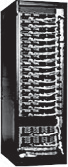

## The Efficiency and Cost of Warehouse-Scale Computers

Infrastructure costs for power distribution and cooling are the majority of the construction costs of a WSC, so we concentrate on them. ([Section 6.7](#_bookmark300) describes the power and cooling infrastructure of a WSC in detail.)

> 发电和冷却的基础设施成本是 WSC 的大部分建筑成本，因此我们专注于它们。([第 6.7 节](#_bookmark300)详细描述了 WSC 的功率和冷却基础架构。)

A _computer room air-conditioning_ (_CRAC_) unit cools the air in the server room using chilled water, similar to how a refrigerator removes heat by releasing it outside the refrigerator. As a liquid absorbs heat, it evaporates. Conversely, when a liquid releases heat, it condenses. Air conditioners pump the liquid into coils under low pressure to evaporate and absorb heat, which is then sent to an external condenser where it is released. Thus, in a CRAC unit, fans push warm air past a set of coils filled with cold water, and a pump moves the warmed water to the chillers to be cooled down. [Figure 6.9](#_bookmark283) shows the large collection of fans and water pumps that move air and water throughout the system.

> _计算机空调_(_CRAC_)使用冷水冷却服务器中的空气，类似于冰箱在冰箱外释放热量的方式。当液体吸收热量时，它会蒸发。相反，当液体释放热量时，它会凝结。空调在低压下将液体泵入线圈中，以蒸发并吸收热量，然后将其发送到释放其释放的外部冷凝器。因此，在一个 CRAC 单元中，风扇将温暖的空气推向一组充满冷水的线圈，泵将温暖的水移到冷水机中以冷却。[图 6.9](#_bookmark283) 显示了大量的风扇和水泵，这些风扇和水泵在整个系统中移动空气和水。

In addition to chillers, some data centers leverage colder outside air or water temperature to cool the water before it is sent to the chillers. However, depending on the location, the chillers may still be needed during the warmer times of the year. Surprisingly, it’s not obvious how to figure out how many servers a WSC can support after subtracting the overhead for power distribution and cooling. The _nameplate power rating_ from the server manufacturer is always conservative: it’s the maximum power a server can draw. The first step then is to measure a single server under a variety of workloads to be deployed in the WSC. (Networking is typically about 5% of power consumption, so it can be ignored at first.)

> 除了冷却器外，一些数据中心还利用更冷的外部空气或水温将其冷却水，然后再将其发送给冷水机。但是，根据位置的不同，在一年中的温暖时期仍可能需要冷却器。令人惊讶的是，在减去开销以进行电源和冷却后，如何弄清 WSC 可以支持多少服务器并不明显。服务器制造商的 *nameplate 电源额定值*始终是保守的：这是服务器可以绘制的最大功率。然后，第一步是在 WSC 中部署的各种工作负载下测量单个服务器。(网络通常约为功耗的 5％，因此一开始就可以忽略。)

To determine the number of servers for a WSC, the available power for IT equipment could be divided just by the measured server power; however, this would again be too conservative according to [Fan et al. (2007)](#_bookmark946). They found that there is a significant gap between what thousands of servers could theoretically do, in the worst case, and what they will do in practice, since no real workloads will keep thousands of servers all simultaneously at their peaks. They found that they could safely oversubscribe the number of servers by as much as 40% based on the power of a single server. They recommended that WSC architects should do so to increase the average utilization of power within a WSC; however, they also suggested using extensive monitoring software along with a safety mechanism that de-schedules lower priority tasks in case the workload shifts.

> 为了确定 WSC 的服务器数量，IT 设备的可用功率只能由测量的服务器电源划分；但是，根据 [Fan 等人，这再次太保守了。(2007)](#_bookmark946)。他们发现，在最坏的情况下，在理论上可以做什么，在实践中会做什么，因为没有真正的工作负载将使数千台服务器同时在其峰值上保持数千个服务器。他们发现，根据单个服务器的功率，他们可以安全地订阅服务器数量多达 40％。他们建议 WSC 架构师应该这样做，以增加 WSC 中功率的平均利用；但是，他们还建议使用广泛的监控软件以及安全机制，该安全机制在工作负载转移时降低优先级任务。

Here is the power usage inside the IT equipment for a Google WSC deployed in 2012 ([Barroso et al., 2013](#_bookmark925)):

> 这是 2012 年部署的 Google WSC 的 IT 设备中的功率使用情况([Barroso 等，2013](#_bookmark925))：



Figure 6.9 Mechanical design for cooling systems. CWS stands for circulating water system. From Hamilton, J., 2010. Cloud computing economies of scale. In: Paper Presented at the AWS Workshop on Genomics and Cloud Computing, June 8, 2010, Seattle, WA. [http://mvdirona.com/jrh/TalksAndPapers/JamesHamilton\_](http://mvdirona.com/jrh/TalksAndPapers/JamesHamilton_GenomicsCloud20100608.pdf) [GenomicsCloud20100608.pdf](http://mvdirona.com/jrh/TalksAndPapers/JamesHamilton_GenomicsCloud20100608.pdf).

> 图 6.9 冷却系统的机械设计。CWS 代表循环供水系统。来自 Hamilton，J.，2010 年。云计算规模经济。在：关于基因组学和云计算的 AWS 研讨会上发表的论文，2010 年 6 月 8 日，华盛顿州西雅图。[[http://mvdirona.com/jrh/talksandpapers/jameshamilton](http://mvdirona.com/jrh/talksandpapers/jameshamilton) \ \_](TalkSandPapers/Jameshamilton_genomicsCloud20100608.pdf)。

### Measuring Efficiency of a WSC

A widely used, simple metric to evaluate the efficiency of a data center or a WSC is called _power utilization effectiveness_ (or _PUE_):

> 一个广泛使用的简单指标来评估数据中心或 WSC 的效率，称为*功率利用效率*(或 _pue_)：

Figure 6.10 Power utilization efficiency of 19 data centers in 2006 ([Greenberg et al., 2009](#_bookmark955)). The power for air conditioning (AC) and other uses (such as power distribution) is normalized to the power for the IT equipment in calculating the PUE. Thus, power for IT equipment must be 1.0, and AC varies from about 0.30 to 1.40 times the power of the IT equipment. Power for "other" varies from about 0.05 to 0.60 of the IT equipment.

> 图 6.10 2006 年 19 个数据中心的功率利用效率([Greenberg et al。，2009](#_bookmark955))。空调(AC)和其他用途(例如电源分配)的功率已归一化为 IT 设备计算 PUE 的功率。因此，IT 设备的电源必须为 1.0，AC 的功率从 IT 设备的功率的 0.30 到 1.40 倍。"其他" 的功率从 IT 设备的约 0.05 到 0.60 不等。

[Greenberg et al. (2009)](#_bookmark955) reported on the PUE of 19 data centers and the portion of the overhead that went into the cooling infrastructure. [Figure 6.10](#_bookmark284) shows what they found, sorted by PUE from most to least efficient. The median PUE is 1.69, with the cooling infrastructure using more than half as much power as the servers—on average, 0.55 of the 1.69 is for cooling. Note that these are average PUEs, which can vary daily depending on workload and even external air temperature, as we will see ([Figure 6.11](#_bookmark285)).

> [Greenberg 等。(2009 年)](#_bookmark955)在 19 个数据中心和进入冷却基础设施的间接费用的一部分中报道了。[图 6.10](#_bookmark284) 显示了它们发现的东西，并以大多数效率排序。中位数为 1.69，冷却基础架构使用超过服务器的一半以上的功率 - 平均为 1.69 中的 0.55 用于冷却。请注意，这些是平均 PU，根据工作量甚至外部空气温度，每天可能会有所不同([图 6.11](#_bookmark285))。

With attention paid to PUE in the past decade, data centers are much more efficient today. However, as [Section 6.8](#_bookmark312) explains, there is no universally accepted definition of what is included in PUE: If the batteries to preserve operation during a power failure are in a separate building, are they included or not? Do you measure from the output of the power substation, or where power first enters the WSC? [Figure 6.10](#_bookmark284) shows the improvement in the average PUE of all Google data centers over time, which Google measures inclusively.

> 在过去的十年中，随着 PUE 的关注，如今的数据中心更加有效。但是，正如[第 6.8 节](#_bookmark312)解释的那样，没有普遍接受 PUE 中包含的定义：如果在电力故障期间保留操作的电池在单独的建筑物中，是否包括在内？您是从电力变电站的输出中测量的，还是电力首先进入 WSC？[图 6.10](#_bookmark284) 显示了随着时间的推移，所有 Google 数据中心的平均值的改善，Google 对此进行了包含。

Since performance per dollar is the ultimate metric, we still need to measure performance. As [Figure 6.7](#_bookmark280) shows, bandwidth drops and latency increases depending on the distance to the data. In a WSC, the DRAM bandwidth within a server is 200 times greater than within a rack, which in turn is 10 times greater than within an array. Thus, there is another kind of locality to consider in the placement of data and programs within a WSC.

> 由于每美元的性能是最终的度量标准，因此我们仍然需要衡量性能。如[图 6.7](#_bookmark280) 所示，根据数据的距离，带宽下降和延迟增加。在 WSC 中，服务器内的 DRAM 带宽比机架内的 200 倍，而车架又比数组中的 dram 带宽大 10 倍。因此，在 WSC 中数据和程序的放置时，还有另一种地方需要考虑。

1.26

Figure 6.11 Average power utilization efficiency (PUE) of the 15 Google WSCs between 2008 and 2017. The spiking line is the quarterly average PUE, and the straighter line is the trailing 12-month average PUE. For Q4 2016, the averages were 1.11 and 1.12, respectively.

> 图 6.11 在 2008 年至 2017 年之间 15 个 Google WSC 的平均功率利用效率(PUE)。尖峰线是季度平均值，直线是平均 12 个月的平均值。对于 2016 年第四季度，平均值分别为 1.11 和 1.12。

Although designers of a WSC often focus on bandwidth, programmers developing applications on a WSC are also concerned with latency because latency is visible to users. Users’ satisfaction and productivity are tied to response time of a service. Several studies from the timesharing days report that user productivity is inversely proportional to time for an interaction, which was typically broken down into human entry time, system response time, and time for the person to think about the response before hitting the next entry ([Doherty and Thadhani, 1982](#_bookmark943)). The results of experiments showed that cutting system response time by 30% shaved the time of an interaction by 70% ([Brady, 1986](#_bookmark931)). This implausible result is explained by human nature: people need less time to think when given a faster response, as they are less likely to get distracted and remain "on a roll."

> 尽管 WSC 的设计师通常专注于带宽，但程序员开发 WSC 上的应用程序也与延迟有关，因为用户可见延迟。用户的满意度和生产率与服务的响应时间有关。分时度的几项研究报告说，用户生产率与互动的时间成反比，通常将其分解为人类的进入时间，系统响应时间，以及该人在下一个条目之前考虑响应的时间([Doherty 和 Thadhani，1982](#_bookmark943))。实验的结果表明，将系统响应时间削减 30％将相互作用的时间剃光了 70％([[Brady，1986](#_bookmark931))。这种令人难以置信的结果是通过人性来解释的：人们需要更少的时间思考，因为他们不太可能分心并保持 "滚动" 。

[Figure 6.12](#_bookmark286) shows the results of a more recent experiment for the Bing search engine, where delays of 50–2000 ms were inserted at the search server ([Schurman](#_bookmark1000) [and Brutlag, 2009](#_bookmark1000)). As expected from previous studies, time to next click roughly doubled the delay; that is, a 200 ms delay at the server led to a 500 ms increase in time to next click. Revenue dropped linearly with increasing delay, as did user satisfaction. A separate study on the Google search engine found that these effects lingered long after the 4-week experiment ended. Five weeks later, there were 0.1% fewer searchers per day for users who experienced 200 ms delays, and there were 0.2% fewer searches by users who experienced 400 ms delays. Given the amount of money made in search, even such small changes are disconcerting. In fact, the results were so negative that they ended the experiment prematurely. Because of this extreme concern with satisfaction of all users of an Internet service, performance goals are typically specified so that a high percentage of requests are below a latency threshold, rather than just offer a target for the average latency. Such threshold goals are called _service level objectives_ (_SLOs_). An SLO might be that 99% of requests must be below 100 ms. Thus, the designers of

> [图 6.12](#_bookmark286) 显示了 Bing 搜索引擎的最新实验结果，其中在搜索服务器上插入了 50-2000 毫秒的延迟 ([Schurman](#_bookmark1000) [and Brutlag, 2009](#_bookmark1000))。正如之前的研究所预期的那样，下一次点击的时间大约使延迟增加了一倍；也就是说，服务器上 200 毫秒的延迟会导致下一次点击的时间增加 500 毫秒。收入随着延迟的增加而线性下降，用户满意度也是如此。对谷歌搜索引擎的另一项研究发现，在为期 4 周的实验结束后，这些影响仍然存在很长时间。五周后，经历 200 毫秒延迟的用户每天搜索量减少 0.1%，经历 400 毫秒延迟的用户每天搜索量减少 0.2%。考虑到搜索所赚的钱，即使是这么小的变化也令人不安。事实上，结果非常负面，以至于他们过早地结束了实验。由于这种对 Internet 服务所有用户满意度的极度关注，通常会指定性能目标，以便大部分请求都低于延迟阈值，而不是仅仅提供平均延迟的目标。此类阈值目标称为*服务级别目标* (_SLOs_)。SLO 可能是 99% 的请求必须低于 100 毫秒。因此，设计者

Figure 6.12 Negative impact of delays at the Bing search server on user behavior (Schurman and Brutlag, 2009).

Amazon’s Dynamo key-value storage system decided that for services to offer good latency on top of Dynamo, their storage system had to deliver on its latency goal 99.9% of the time ([DeCandia et al., 2007](#_bookmark942)). For example, one improvement of Dynamo helped the 99.9th percentile much more than the average case, which reflects their priorities.

> 亚马逊的 Dynamo 键值存储系统决定，要在 Dynamo 上提供良好的延迟，他们的存储系统必须在 99.9％的时间内实现其延迟目标([Decandia 等，2007](#_bookmark942))。例如，发电机的一种改进比平均情况有助于第 99.9 个百分位数，这反映了其优先事项。

[Dean and Barroso (2013)](#_bookmark940) proposed the term _tail tolerant_ to describe systems designed to meet such goals:

> [Dean and Barroso(2013)](#* bookmark940)提出了术语\_tail tolerant*来描述旨在满足此类目标的系统：

Just as fault-tolerant computing aims to create a reliable whole out of lessreliable parts, large online services need to create a predictably responsive whole out of less-predictable parts.

> 正如容忍故障的计算旨在从不易度的零件中创建一个可靠的整体一样，大型的在线服务需要从不可预测的零件中创建一个可预测的响应式整体。

The causes of unpredictability include contention for shared resources (processors networks, etc.), queuing, variable microprocessor performance because of optimizations like Turbo mode or energy-saving techniques like DVFS, software garbage collection, and many more. Google concluded that instead of trying to prevent such variability in a WSC, it made more sense to develop tail-tolerant techniques to mask or work around temporary latency spikes. For example, fine-grained load balancing can quickly move small amounts for work between servers to reduce queuing delays.

> 不可预测性的原因包括共享资源(处理器网络等)的争夺，排队，可变的微处理器性能，因为诸如涡轮模式或节能技术(例如 DVFS，软件垃圾收集)等优化。Google 得出结论，并没有试图防止 WSC 中的这种可变性，而是开发耐尾能的技术来掩盖或解决临时延迟尖峰更有意义。例如，细粒度的负载平衡可以快速移动服务器之间的工作少量，以减少排队延迟。

### Cost of a WSC

As mentioned in the introduction, unlike most architects, designers of WSCs worry about the cost to operate as well as the cost to build the WSC. Accounting labels the former costs as _operational expenditures_ (_OPEX_) and the latter costs as _capital expenditures_ (_CAPEX_).

> 如介绍中所述，与大多数建筑师不同，自来水公司的设计者担心运营成本以及建造自来水公司的成本。会计将前者成本标记为*运营支出* (_OPEX_)，将后者成本标记为*资本支出* (_CAPEX_)。

To put the cost of energy into perspective, [Hamilton (2010)](#_bookmark957) did a case study to estimate the costs of a WSC. He determined that the CAPEX of an 8-MW facility was $88 million and that the roughly 46,000 servers and corresponding networking equipment added another $79 million to the CAPEX for the WSC. [Figure 6.13](#_bookmark287) shows the rest of the assumptions for the case study.

> 为了将能源成本置于视角上，[Hamilton(2010)](#_bookmark957)进行了案例研究，以估算 WSC 的成本。他确定 8 兆瓦设施的资本支出为 8800 万美元，大约 46,000 台服务器和相应的网络设备为 WSC 的资本支出增加了 7,900 万美元。[图 6.13](#_bookmark287) 显示了案例研究的其余假设。

Figure 6.13 Case study for a WSC, rounded to nearest $5000. Internet bandwidth costs vary by application, so they are not included here. The remaining 18% of the CAPEX for the facility includes buying the property and the cost of construction of the building. We added people costs for security and facilities management in [Figure 6.14](#_bookmark288), which were not part of the case study. Note that Hamilton’s estimates were done before he joined Amazon, and they are not based on the WSC of a particular company. Based on Hamilton, J., 2010. Cloud computing economies of scale. In: Paper Presented at the AWS Workshop on Genomics and Cloud Computing, June 8, 2010, Seattle, WA. [http://](http://mvdirona.com/jrh/TalksAndPapers/JamesHamilton_GenomicsCloud20100608.pdf) [mvdirona.com/jrh/TalksAndPapers/JamesHamilton_GenomicsCloud20100608.pdf](http://mvdirona.com/jrh/TalksAndPapers/JamesHamilton_GenomicsCloud20100608.pdf).

> 图 6.13 WSC 的案例研究，四舍五入至最接近 5000 美元。互联网带宽的成本因应用而异，因此此处不包括在内。该设施的其余 18％的资本支出包括购买该物业和建筑物的建设成本。我们在[图 6.14](#_bookmark288) 中添加了人员的安全和设施管理费用，这不是案例研究的一部分。请注意，汉密尔顿的估计是在加入亚马逊之前就完成的，并且不是基于特定公司的 WSC。基于 Hamilton，J.，2010 年。云计算规模经济。在：关于基因组学和云计算的 AWS 研讨会上发表的论文，2010 年 6 月 8 日，华盛顿州西雅图。[http：//](http%EF%BC%9A//mvdirona.com/jrh/talksandpapers/jameshamilton_genomicscloud20100608.pdf)[mvdirona.com/jrh/talksandsandpappapers/jameshamilton_genomicsclous/20100608.pdpplhous/20100608.pdpptplymantemjmistmimtatemtratemantemtprhimt].pdf)。

Hamilton’s study works out to $11/watt for the building, power, and cooling. [Barroso et al. (2013)](#_bookmark925) reported consistent results for several cases, with the cost at $9 to $13/watt. Thus, a 16-MW facility costs $144 million to $208 million, _not_ including the computing, storage, and networking equipment.

> 汉密尔顿的研究工作量为 $ 11/瓦，用于建筑物，电力和冷却。[Barroso 等。(2013)](#_bookmark925)报告了多种情况的一致结果，费用为 9 至 13 美元/瓦。因此，一个 16 兆瓦的设施耗资 1.44 亿至 2.08 亿美元，包括计算，存储和网络设备。

We can convert CAPEX into OPEX by a cost of capital conversion, assuming 5% borrowing cost, which is a standard convention in US accounting rules. That is, we can just amortize CAPEX as a fixed amount each month for the effective life of the equipment. [Figure 6.14](#_bookmark288) breaks down the monthly OPEX for Hamilton’s case study. Note that the amortization rates differ significantly for his case study, from 10 years for the facility to 4 years for the networking equipment and 3 years for the servers. Thus, the WSC facility lasts a decade, but the servers are replaced every 3 years and the networking equipment every 4 years. By amortizing the CAPEX, Hamilton came up with a monthly OPEX, including accounting for the cost of borrowing money (5% annually) to pay for the WSC. At $3.8 million, the monthly OPEX is about 2% of the CAPEX (or 24% annually).

> 假设借贷成本为 5％，这是美国会计规则中的标准惯例，我们可以通过资本转换成本将资本支出转换为 OPEX。也就是说，我们可以将 CAPEX 摊销为每个月的固定金额，以实现设备的有效寿命。[图 6.14](#_bookmark288) 分解了汉密尔顿案例研究的每月 OPEX。请注意，他的案例研究的摊销率有很大差异，从该设施的 10 年到网络设备的 4 年和服务器的 3 年。因此，WSC 设施持续了十年，但是服务器每 3 年更换一次，每 4 年进行一次网络设备。通过摊销资本支出，汉密尔顿提出了每月一次的 OPEX，包括借出借钱的费用(每年 5％)支付 WSC 的费用。每月 OPEX 的价格为 380 万美元，约占 CAPEX 的 2％(或每年 24％)。

This figure allows us to calculate a handy guideline to keep in mind when making decisions about which components to use when being concerned about energy. The fully burdened cost of a watt per year in a WSC, including the cost of amortizing the power and cooling infrastructure, is

> 这个数字使我们能够计算出方便的准则，以确定关注能源时要使用哪些组件的决策。WSC 中每年全年瓦特的负担全部负担，包括摊销功率和冷却基础设施的成本是

Note that in [Figure 6.14](#_bookmark288), more than a third of OPEX is related to power, with that category trending up while server costs are trending down over time. The networking equipment is significant at 8% of total OPEX and 19% of the server CAPEX, and networking equipment is not trending down as quickly as servers are, perhaps because of the continuing demand for higher network bandwidth (see [Figure 6.22](#_bookmark298) on page 467). This difference is especially true for the switches in the networking hierarchy above the rack, which represent most of the networking costs (see [Section 6.6](#cross-cutting-issues-3)). People costs for security and facilities management are just 2% of OPEX. Dividing the OPEX in [Figure 6.14](#_bookmark288) by the number of servers and hours per month, the cost is about $0.11 per server per hour.

> 请注意，在 [图 6.14](#_bookmark288) 中，超过三分之一的 OPEX 与电力有关，随着时间的推移，该类别呈上升趋势，而服务器成本呈下降趋势。网络设备占总 OPEX 的 8% 和服务器 CAPEX 的 19%，并且网络设备的下降趋势不像服务器那么快，这可能是因为对更高网络带宽的持续需求(参见[图 6.22](# \_bookmark298) 第 467 页)。这种差异对于机架上方网络层次结构中的交换机尤其如此，它们代表了大部分网络成本(请参阅[第 6.6 节](#cross-cutting-issues-3))。安全和设施管理的人员成本仅为 OPEX 的 2%。将 [图 6.14](#_bookmark288) 中的 OPEX 除以每月的服务器数量和小时数，成本约为每台服务器每小时 0.11 美元。

Figure 6.14 Monthly OPEX for [Figure 6.13](#_bookmark287), rounded to the nearest $5000. Note that the 3-year amortization of servers means purchasing new servers every 3 years, whereas the facility is amortized for 10 years. Thus, the amortized capital costs for servers are about three times more than for the facility. People costs include three security guard positions continuously for 24 h a day, 365 days a year, at $20 per hour per person, and one facilities person for 24 h a day, 365 days a year, at $30 per hour. Benefits are 30% of salaries. This calculation does not include the cost of network bandwidth to the Internet because it varies by application nor vendor maintenance fees because they vary by equipment and by negotiations.

> 图 6.14 [图 6.13](#_bookmark287) 的每月 OPEX，舍入至最近的 $ 5000。请注意，服务器的 3 年摊销意味着每 3 年购买新的服务器，而该设施摊销了 10 年。因此，服务器的摊销资本成本是该设施的三倍。人们的费用包括每天 365 天，每小时 20 美元的每天 24 小时的保安职位，每年 365 天，每年 365 天，每小时 24 小时，每小时 30 美元。福利是薪水的 30％。该计算不包括网络带宽到 Internet 的成本，因为它因应用程序或供应商维护费而有所不同，因为它们因设备和谈判而异。

[Barroso et al. (2013)](#_bookmark925) evaluated CAPEX and OPEX in terms of cost per watt per month. Thus, if a 12-MW WSC is depreciated over 12 years, the depreciation cost is $0.08 per watt per month. They assumed the company got the capital for the WSC by taking out a loan at 8% annually—corporate loans are typically between 7% and 12%—and the interest payments added another $0.05, giving a total of

> [Barroso 等。(2013)](#_bookmark925)根据每瓦的费用评估了资本支出和 OPEX。因此，如果在 12 年内折旧 12 兆瓦，则折旧成本为每月 0.08 美元。他们认为该公司每年以 8％的贷款获得 WSC 的资本 - 公司贷款通常在 7％至 12％之间，而利息支付则增加了 0.05 美元

$0.13 per watt per month. They factored in the cost of servers similarly. A 500 watt server that cost $4000 was $8 per watt, and the 4-year depreciation was $0.17 per watt per month. An 8% interest on a loan for the servers added $0.02. They estimated networking at $0.03 per watt per month. They reported that the typical OPEX cost for multiple MW WSCs varied from $0.02 to $0.08 per watt per month. The grand total was $0.37 to $0.43 per watt per month. For an 8-MW WSC, the monthly cost minus the cost of electricity is about $3.0 million to $3.5 million. If we subtract the monthly power use from Hamilton’s calculation, his estimate of the monthly rate will be $3.3 million. Given the different approaches to predicting costs, these estimates are remarkably consistent.

> 每月 $ 0.13。他们同样以服务器的成本为代价。一台 500 瓦服务器的价格为 4000 美元，为每瓦 8 美元，4 年折旧为每月 0.17 美元。服务器的贷款利息 8％增加了 0.02 美元。他们估计网络每月每瓦 0.03 美元。他们报告说，多个 MW WSC 的典型 OPEX 成本从每月 0.02 美元到 0.08 美元不等。总计每月每瓦 0.37 美元至 0.43 美元。对于 8 兆瓦的 WSC，每月成本减去电力成本约为 300 万至 350 万美元。如果我们从汉密尔顿的计算中减去每月电力使用，他对每月费用的估计将为 330 万美元。鉴于预测成本的不同方法，这些估计值非常一致。

Example The cost of electricity varies by region in the United States from $0.03 to $0.15 per kilowatt-hour. What is the impact on hourly server costs of these two extreme rates?

> 示例，美国的电力成本在美国的区域从 0.03 美元到每千瓦时的 0.15 美元不等。这两个极端价格对小时服务器成本有什么影响？

_Answer_ We multiply the critical load of 8 MW by the average PUE from [Figure 6.13](#_bookmark287) (second row) to calculate the average power usage:

> _answer_ 我们将 8 MW 的临界负载乘以平均 pue，从[图 6.13](#_bookmark287)(第二行)计算出平均功率用法：

Example What would happen to monthly costs if the amortization times were all made to be the same—say, 5 years? How would that change the hourly cost per server?

> 例如，如果使摊销时间全部相同，则每月费用会发生什么？这将如何改变每台服务器的小时成本？

_Answer_ The spreadsheet is available online at _[http://mvdirona.com/jrh/TalksAndPapers/](http://mvdirona.com/jrh/TalksAndPapers/PerspectivesDataCenterCostAndPower.xls) [PerspectivesDataCenterCostAndPower.xls](http://mvdirona.com/jrh/TalksAndPapers/PerspectivesDataCenterCostAndPower.xls)._ Changing the amortization time to 5 years changes the first four rows of [Figure 6.14](#_bookmark288) to

```
| Servers | $1,260,000 | 37% |
| -------------------------------- | ---------- | --- |
| Networking equipment | $242,000 | 7% |
| Power and cooling infrastructure | $1,115,000 | 33% |
| Other infrastructure | $245,000 | 7% |
```

and the total monthly OPEX is $3,422,000. If we replaced everything every 5 years, the cost would be $0.103 per server hour, with more of the amortized costs now being for the facility rather than the servers, as in [Figure 6.14](#_bookmark288).

> 每月的 OPEX 总额为 3,422,000 美元。如果我们每 5 年更换一次所有东西，那么费用将为每小时 0.103 美元，现在，现在，设施而不是服务器的摊销成本，如[图 6.14](#_bookmark288)。

The rate of about $0.10 per server per hour can be much less than the cost for many companies that own and operate their own (smaller) conventional data centers. The cost advantage of WSCs led large Internet companies to offer computing as a utility where, like electricity, you pay only for what you use. Today, utility computing is better known as _cloud computing_.

> 对于许多拥有并经营自己(较小)常规数据中心的公司的费用约为每小时 0.10 美元。WSC 的成本优势导致大型互联网公司提供计算作为一种实用程序，例如电力，您只为使用的价格付费。如今，公用事业计算已被称为 _cloud Computing_。
