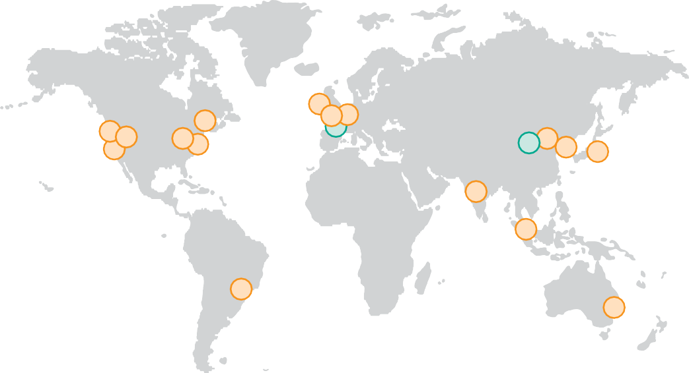
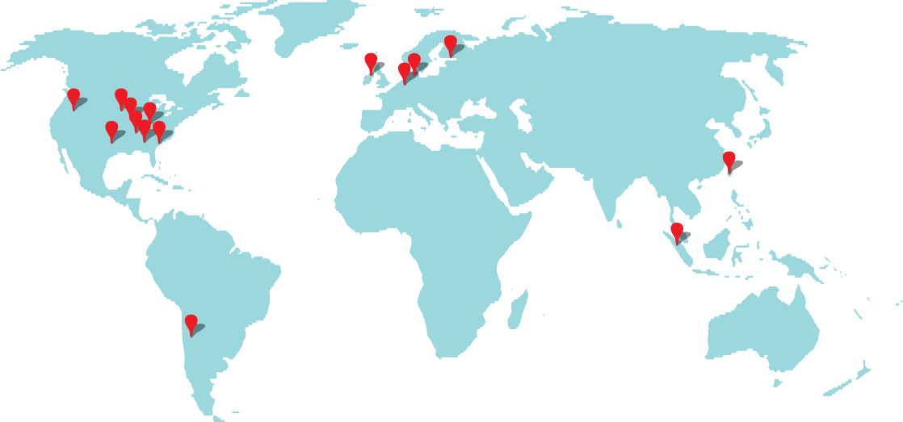

## Cloud Computing: The Return of Utility Computing

If computers of the kind I have advocated become the computers of the future, then computing may someday be organized as a public utility just as the tele- phone system is a public utility…. The computer utility could become the basis of a new and important industry.

John McCarthy,
_MIT centennial celebration_ (1961)

> 如果我主张的那种计算机成为未来的计算机，那么有一天可以将计算机作为公用事业组织，就像电信系统是公用事业一样……。计算机公用事业可能成为新重要行业的基础。

Driven by the demand of an increasing number of users, Internet companies such as Amazon, Google, and Microsoft built increasingly larger warehouse-scale computers from commodity components, making McCarthy’s prediction eventu- ally come true, but not as he thought because of the popularity of timesharing. This demand led to innovations in systems software to support operating at this scale, including BigTable, Colossus, Dynamo, GFS, and MapReduce. It also demanded improvement in operational techniques to deliver a service available at least 99.99% of the time despite component failures and security attacks. Examples of these techniques include failover, firewalls, virtual machines, and protection against distributed denial-of-service attacks. With the software and expertise providing the ability to scale and increasing customer demand that jus- tified the investment, WSCs with 50,000–100,000 servers have become common- place in 2017.

> 亚马逊，Google 和 Microsoft 等互联网公司越来越多的互联网公司从商品组件中建造了越来越大的仓库规模计算机，这使得麦卡锡的预测实在实现，但由于他的想法并非如此，但由于普及而不是正如他所想的那样，分时度假。这种需求导致系统软件的创新，以支持以这种规模运行，包括 Bigtable，Colossus，Dynamo，GFS 和 MapReduce。它还要求改进操作技术，以至少 99.99％的时间提供服务，尽管有组件故障和安全攻击。这些技术的示例包括故障转移，防火墙，虚拟机以及防止分布式拒绝服务攻击的保护。随着软件和专业知识提供了扩展和增加客户需求的能力，以使投资的投资有 50,000-100,000 台服务器的投资，2017 年已成为共同位置。

With increasing scale came increasing economies of scale. Based on a study in 2006 that compared a WSC with a data center with only 1000 servers, [Hamilton](#_bookmark957) [(2010)](#_bookmark957) reported the following advantages:

> 随着规模的增加，规模经济的增加。基于 2006 年的一项研究，该研究将 WSC 与仅 1000 台服务器进行了比较，[hamilton](#_bookmark957)[(2010)](#_bookmark957)报告了以下优点：

- _5.7 times reduction in storage costs_—It cost the WSC $4.6 per GB per year for disk storage versus $26 per GB for the data center.
- _7.1 times reduction in administrative costs_—The ratio of servers per adminis- trator was over 1000 for the WSC versus just 140 for the data center.
- _7.3 times reduction in networking costs_—Internet bandwidth cost the WSC $13 per Mbit/s/month versus $95 for the data center. Not surprisingly, one can negotiate a much better price per Mbit/s by ordering 1000 Mbit/s than by ordering 10 Mbit/s.

Another economy of scale comes during purchasing. The high level of pur- chasing leads to volume discount prices on virtually everything in the WSC.

> 在购买过程中，另一种规模经济是出现的。高水平的拨号可导致 WSC 中几乎所有内容的数量折扣价格。

Economies of scale also apply to operational costs. From the prior section, we saw that many data centers operate with a PUE of 2.0. Large firms can justify hiring mechanical and power engineers to develop WSCs with lower PUEs, in the range of 1.1–1.2 (see [Section 6.7](#_bookmark300)).

> 规模经济也适用于运营成本。从上一节中，我们看到许多数据中心以 2.0 的速度运行。大型公司可以证明招聘机械和电力工程师以 1.1-1.2 的范围开发较低的 WSC(请参阅 [6.7](#_bookmark300))。

Internet services need to be distributed to multiple WSCs both for dependabil- ity and to reduce latency, especially for international markets. All large firms use multiple WSCs for that reason. It’s much more expensive for individual firms to create multiple, small data centers around the world than a single data center in their corporate headquarters.

> 互联网服务需要分配给多个 WSC，以供依赖性和减少潜伏期，尤其是对于国际市场。因此，所有大型公司都使用多个 WSC。对于个人总部中的一个数据中心，创建多个小型数据中心的人要贵得多。

Finally, for the reasons presented in [Section 6.1](#introduction-4), servers in data centers tend to be utilized only 10%–20% of the time. By making WSCs available to the public, uncorrelated peaks between different customers can raise average utilization above 50%.

> 最后，出于[第 6.1 节]中提出的原因(＃简介-4)，数据中心中的服务器往往只有 10％–20％的时间。通过向公众提供 WSC，不同客户之间的不相关峰可以将平均利用率提高到 50％以上。

Thus, economies of scale for a WSC offer factors of 5–7 for several compo- nents of a WSC plus a few factors of 1.5–2 for the entire WSC.

> 因此，WSC 的规模经济为 WSC 的几个组成部分提供了 5-7 个因素，以及整个 WSC 的几个因素 1.5-2。

Since the last edition of this book, the concerns about security have flipped for the cloud. In 2011 there was skepticism about placing critical data in the cloud because that could make it easier for hackers to break into than if the data were kept on premises ( "on prem" ) locked down in the local data center. In 2017 data break-ins into such data centers are so routine that they barely make the news.

> 自从本书的最后一版以来，对安全性的担忧已经翻转了云。在 2011 年，人们对将关键数据放入云中的持怀疑态度，因为这可能使黑客更容易闯入，而不是将数据保存在本地数据中心的房屋( " Prem" )上。在 2017 年，数据闯入此类数据中心非常常规，以至于他们几乎没有新闻。

For example, this insecurity has even led to rapid growth of _ransomware_— where criminals break in, encrypt all the data of an organization, and won’t release the key until paid a ransom—costing firms $1 billion in 2015. In contrast, WSCs are continuously under attack, their operators respond more quickly to halt them and thus build better defenses. As a result, ransomware is unheard of inside WSCs. WSCs are clearly more secure than the vast majority of local data centers today, so many CIOs now believe that critical data is safer in the cloud than "on prem."

> 例如，这种不安全感甚至导致了 _ransomware_ 的迅速增长 - 犯罪分子闯入，加密组织的所有数据，并且在 2015 年支付赎金后不会释放钥匙 - 在 2015 年为 10 亿美元。他们的操作员不断受到攻击，更快地做出了响应，以阻止他们，从而建立更好的防御能力。结果，勒索软件是内部 WSC 的闻所未闻的。WSC 显然比当今绝大多数本地数据中心更安全，因此许多 CIO 现在认为，云中关键数据比 " PREM" 更安全。

Although there are several cloud computing providers, we feature Amazon Web Services (AWS) since it is one of the oldest and currently the largest commer- cial cloud provider.

> 尽管有几个云计算提供商，但我们配备了 Amazon Web Services(AWS)，因为它是最古老，目前最大的商业云提供商之一。

### Amazon Web Services

Utility computing goes back to commercial timesharing systems and even batch processing systems of the 1960s and 1970s, where companies only paid for a terminal and a phone line and then were billed based on how much computing they used. Many efforts since the end of timesharing have tried to offer such pay-as- you-go services, but they were often met with failure.

> 公用事业计算可以追溯到 1960 年代和 1970 年代的商业分时保存系统，甚至是批处理处理系统，在那里，公司只为终端和电话线付费，然后根据使用多少计算来计费。自从分时保存以来，许多努力都试图提供此类付费服务，但他们经常遇到失败。

When Amazon started offering utility computing via the Amazon Simple Storage Service (Amazon S3) and then Amazon Elastic Computer Cloud (Amazon EC2) in 2006, it made some novel technical and business decisions:

> 当亚马逊开始通过 Amazon 简单存储服务(Amazon S3)以及 2006 年亚马逊弹性计算机云(Amazon EC2)提供实用程序计算时，它做出了一些新颖的技术和业务决策：

- _Virtual machines_. Building the WSC using x86-commodity computers run- ning the Linux operating system and the Xen virtual machine solved several problems. First, it allowed Amazon to protect users from each other. Second, it simplified software distribution within a WSC, in that customers needed to install only an image and then AWS automatically distributed it to all the instances being used. Third, the ability to kill a virtual machine reliably made it easy for Amazon and customers to control resource usage. Fourth, virtual machines could limit the rate at which they used the physical processors, disks, and the network as well as the amount of main memory, which gave AWS multiple price points: the lowest price option by packing many virtual cores on a single server, the highest price option of exclusive access to all the machine resources, as well as several intermediary points. Fifth, virtual machines hid the identity of hardware, allowing AWS to continue to sell time on older machines that might otherwise be unattractive to customers if they knew the age of the machines. Finally, virtual machines allowed AWS to intro- duce new and faster hardware either by packing even more virtual cores per server or simply by offering instances that had higher performance per virtual core; virtualization meant that offered performance need not be an integer multiple of the performance of the hardware.

> - _virtual Machines_。使用 X86-Commodity 计算机构建 WSC，运行 Linux 操作系统，而 Xen 虚拟机解决了几个问题。首先，它允许亚马逊彼此保护用户。其次，它简化了 WSC 中的软件分发，因为客户只需要安装图像，然后 AWS 自动将其分配给所使用的所有实例。第三，杀死虚拟机的能力可靠地使亚马逊和客户可以轻松控制资源使用情况。第四，虚拟机可以限制使用物理处理器，磁盘和网络的速率以及主内存的数量，
>   这给出了 AWS 多个价格点：通过在单个服务器上打包许多虚拟内核的最低价格选项，独家访问所有机器资源的最高价格选择以及几个中介点。第五，虚拟机隐藏了硬件的身份，使 AWS 能够继续在旧机器上出售时间，如果客户知道机器的年龄，否则他们可能对客户没有吸引力。最后，虚拟机允许 AWS 通过包装每台服务器的更多虚拟内核，或者仅通过提供每个虚拟核心性能较高的实例来启动新的和更快的硬件；虚拟化意味着提供的性能不必是硬件性能的整数倍数。

- _Very low cost_. When AWS announced a rate of $0.10 per hour per instance in 2006, it was a startlingly low amount. An instance is one virtual machine, and at $0.10 per hour, AWS allocated two instances per core on a multicore server. Thus, one EC2 computer unit is equivalent to a 1.0–1.2 GHz AMD Opteron or Intel Xeon of that era.

> - \_非常低成本。当 AWS 在 2006 年宣布每个实例每小时 0.10 美元时，这是一个惊人的低价。实例是一台虚拟机，以每小时 0.10 美元的价格在多层服务器上分配了每个核心的两个实例。因此，一个 EC2 计算机单元相当于该时代的 1.0-1.2 GHz AMD Opteron 或 Intel Xeon。

- _(Initial) reliance on open source software_. The availability of good-quality software that had no licensing problems or costs associated with running on hundreds or thousands of servers made utility computing much more econom- ical for both Amazon and its customers. AWS later started offering instances including commercial third-party software at higher prices.

> - \_(初始)对开源软件的依赖。具有与数百或数千台服务器运行相关的许可问题或成本的优质软件的可用性使得实用程序计算对亚马逊及其客户的经济性更为出色。AWS 随后开始以更高的价格提供包括商业第三方软件在内的实例。

- _No (initial) guarantee of service_. Amazon originally promised only best effort. The low cost was so attractive that many could live without a service guarantee. Today AWS provides availability SLOs of up to 99.95% on services such as Amazon EC2 and Amazon S3. Additionally, Amazon S3 was designed for durability by saving multiple replicas of each object across multiple locations. (According to AWS, the chances of permanently losing an object are one in 100 billion.) AWS also provides a Service Health Dashboard that shows the current operational status of each of the AWS services in real time so that AWS uptime and performance are fully transparent.

> - *no(初始)服务*的保证。亚马逊最初只承诺要尽力而为。低成本是如此吸引人，许多人可以没有服务保证就可以生活。如今，AWS 在亚马逊 EC2 和 Amazon S3 等服务上提供高达 99.95％的可用性 SLO。此外，亚马逊 S3 是通过在多个位置保存每个对象的多个复制品来设计用于耐久性的。(根据 AWS 的说法，永久失去对象的机会是 1000 亿分之一。)AWS 还提供了一个服务健康仪表板，该仪表板显示了实时的每个 AWS 服务的当前操作状态，因此 AWS 的正常运行时间和性能是完全透明的。

- _No contract required_. In part because the costs are so low, all that is necessary to start using EC2 is a credit card.

> - 无需合同。部分原因是成本如此之低，因此开始使用 EC2 所需的一切都是信用卡。

[Figures 6.15](#_bookmark290) and [6.16](#_bookmark291) show the hourly price of the many types of EC2 instances in 2017. Expanding from the 10 instance types in 2006, there are now more than 50. The fastest instance is 100 times quicker than the slowest, and the largest offers 2000 times more memory than the smallest. Rent for the cheapest instance for a whole year is just $50.

> [图 6.15](#_bookmark290) 和 [6.16](#_bookmark291) 显示 2017 年许多类型的 EC2 实例的小时价格。从 2006 年的 10 种实例类型扩展，现在有 50 多个。最快的实例是比最慢的 100 倍，最大的记忆比最小的记忆高 2000 倍。全年最便宜的实例的租金仅为 50 美元。

Figure 6.15 Price and characteristics of on-demand general-purpose and compute-optimized EC2 instances in the Virginia region of the United States in February 2017. When AWS started, one EC2 computer unit was equiv- alent to a 1.0–1.2 GHz AMD Opteron or Intel Xeon of 2006. Variable instances are the newest and cheapest category. They offer the full performance of a high-frequency Intel CPU core if your workload utilizes less than 5% of the core on average over 24 h, such as for serving web pages. AWS also offers Spot Instances at a much lower cost (about 25%). With Spot Instances, customers set the price they are willing to pay and the number of instances they are willing to run, and then AWS runs the bids when the spot price drops below their level. AWS also offers Reserved Instances for cases where customers know they will use most of the instance for a year. They pay a yearly fee per instance and then an hourly rate that is about 30% of column 1 to use the service. If a Reserved Instance is used 100% for a whole year, the average cost per hour including amortization of the annual fee will be about 65% of the rate in the first column. EBS is Elastic Block Storage, which is a raw block-level storage system found elsewhere on the network, rather than in a local disk or local solid stage disk (SSD) within the same server as the VM.

> 图 6.15 2017 年 2 月在美国弗吉尼亚地区的按需通用和计算优化的 EC2 实例的价格和特征。当 AWS 启动时，一个 EC2 计算机单元等于 1.0-1.2 GHz AMD OPTERON 或 2006 年的英特尔 Xeon。可变实例是最新，最便宜的类别。如果您的工作负载在 24 小时内平均使用不到 5％的核心，例如用于服务网页，则它们提供高频 Intel CPU 核心的全部性能。AWS 还以低得多的成本(约 25％)提供现场实例。通过现货实例，客户设定了愿意支付的价格和愿意运行的实例数量，然后当现货价格下跌以下时，AWS 会运行出价。AWS 还为客户知道他们将在一年中使用大部分实例的情况提供了预留的实例。他们每个实例支付年度费用，然后支付使用该服务第 1 列的 30％的小时费率。如果全年使用保留实例 100％，则包括年费在内的平均每小时成本约为第一列中该费率的 65％。EBS 是弹性块存储，它是网络其他位置的原始块级存储系统，而不是与 VM 同一服务器内的本地磁盘或本地磁盘或本地实心舞台磁盘(SSD)。

Figure 6.16 Price and characteristics of on-demand GPUs, FPGAs, memory-optimized, and storage-optimized EC2 instances in the Virginia region of the United States in February 2017.

> 图 6.16 2017 年 2 月在美国弗吉尼亚地区，按需 GPU，FPGA，FPGA，内存优化和存储优化的 EC2 实例的价格和特征。

In addition to computation, EC2 charges for long-term storage and for Internet traffic. (There is no cost for network traffic inside AWS regions.) Elastic Block Storage (EBS) costs $0.10 per GB per month when using SSDs and $0.045 per GB monthly for hard disk drives. Internet traffic costs $0.01 per GB going to EC2 and $0.09 per GB coming from EC2.

> 除了计算外，EC2 还需要用于长期存储和互联网流量。(AWS 区域内的网络流量没有成本。)使用 SSD 时，弹性块存储(EBS)每月每月 0.10 美元，硬盘驱动器每月每月 0.045 美元。Internet 流量每 GB 的价格为 0.01 美元，到 EC2，每 GB $ 0.09 来自 EC2。

Example Calculate the cost of running the average MapReduce job in [Figure 6.2](#_bookmark274) on page 438 on EC2 for several months over the years. Assume there are plenty of jobs, so there is no significant extra cost to round up so as to get an integer number of hours. Next calculate the cost per month to run all the MapReduce jobs.

> 示例计算在 EC2 上的第 438 页的[图 6.2](#_bookmark274) 中运行平均 MAPREDUCE 作业的成本，多年来几个月。假设有很多工作，因此没有额外的额外费用需要汇总以获取整数小时。接下来，计算每月运行所有 MapReduce 工作的成本。

_Answer_ The first question is, what is the right size instance to match the typical server at Google? Let’s assume the closest match in [Figure 6.15](#_bookmark290) is a c4.large with 2 virtual cores and 3.6 GiB of memory, which costs $0.100 per hour. [Figure 6.17](#_bookmark292) calculates the average and total cost per year of running the Google MapReduce workload on EC2. The average September 2016 MapReduce job would cost a little over $1 on EC2, and the total workload for that month would cost $114 million on AWS.

> _answer_ 第一个问题是，在 Google 上匹配典型服务器的适当尺寸实例是什么？让我们假设[图 6.15](#_bookmark290) 中的最接近的匹配是 C4。带有 2 个虚拟内核和 3.6 GIB 内存，每小时的价格为 0.100 美元。[图 6.17](#_bookmark292) 计算在 EC2 上运行 Google MapReduce 工作量的平均成本和总成本。2016 年 9 月的 MapReduce 工作的平均成本将在 EC2 上的成本略高于 1 美元，而该月的总工作量为 1.14 亿美元。

Figure 6.17 Estimated cost to run the Google MapReduce workload for select months between 2004 and 2016 ([Figure 6.2](#_bookmark274)) using 2017 prices for AWS EC2. Because we are using 2017 prices, these are underestimates of actual AWS costs.

> 图 6.17 使用 AWS EC2 的 2017 年价格，在 2004 年至 2016 年之间运行 Google MapReduce 工作量的估计成本([图 6.2](#_bookmark274))。因为我们正在使用 2017 年的价格，所以这些是对实际 AWS 成本的低估。

Example Given the cost of MapReduce jobs, imagine that your boss wants you to investigate ways to lower costs. How much might you save using AWS Spot Instances?

> 鉴于 MapReduce 工作的成本，请想象您的老板希望您研究降低成本的方法。使用 AWS 现场实例可以节省多少？

_Answer_ The MapReduce jobs could be disrupted by being kicked off a spot instance, but MapReduce is designed to tolerate and restart failed jobs. The AWS Spot price for c4.large was $0.0242 versus $0.100, which meant a savings of $87 million for Sep- tember 2016, but there were no guarantees on the response times!

> _answer _ MAPREDUCE 作业可能会被启动一个现场实例而被破坏，但 MapReduce 旨在耐受和重新启动失败的作业。C4.large 的 AWS 现货价格为 0.0242 美元，比 0.100 美元，这意味着 2016 年 9 月的 AWS 价格为 8700 万美元，但没有保证响应时间！

In addition to the low-cost and a pay-for-use model of utility computing, another strong attractor for cloud computing users is that the cloud-computing pro- viders take on the risks of over-provisioning or under-provisioning. Because either mistake could be fatal, risk avoidance is a godsend for startup companies. If too much of the precious investment is spent on servers before the product is ready for heavy use, a company could run out of money. If the service suddenly became popular but there weren’t enough servers to match the demand, a company could make a very bad impression with the potential new customers it desperately needs in order to grow.

> 除了实用程序计算的低成本和使用付费模型外，另一个用于云计算用户的强大吸引子是，云计算的程序承担了过度提供或提供欠缺的风险。因为这两个错误都可能是致命的，所以避免风险是初创公司的天赐之物。如果在产品准备大量使用之前，在服务器上花费了太多的宝贵投资，那么公司可能会用尽资金。如果该服务突然变得流行，但没有足够的服务器来符合需求，那么一家公司可能会与它迫切需要的新客户产生非常不良的印象。

The poster child for this scenario is FarmVille from Zynga, a social networking game on Facebook. Before FarmVille was announced, the largest social game was about five million daily players. FarmVille had one million players 4 days after launching and 10 million players after 60 days. After 270 days, it had 28 million daily players and 75 million monthly players. Because FarmVille is deployed on AWS, it is able to grow seamlessly with the number of users. Moreover, it is able to shed load based on customer demand and time of day.

> 这种情况的海报孩子是 Facebook 上的社交网络游戏 Zynga 的 Farmville。在宣布 Farmville 之前，最大的社交比赛是每天约 500 万人。Farmville 在推出后 4 天有 100 万球员和 60 天后的 1000 万球员。270 天后，它每天有 2800 万球员和每月 7500 万球员。由于 Farmville 部署在 AWS 上，因此它能够与用户数量无缝增长。此外，它能够根据客户需求和一天中的时间减轻负载。

FarmVille was so successful that Zynga decided to open its own data centers in 2012. In 2015, Zynga returned to AWS, deciding it was better to let AWS run its data centers ([Hamilton, 2015](#_bookmark959)). When FarmVille dropped from the most popular Facebook application to 110th in 2016, Zynga was able to downsize gracefully with AWS, much as it grew with AWS in the beginning.

> Farmville 如此成功，以至于 Zynga 决定在 2012 年开设自己的数据中心。2015 年，Zynga 返回 AWS，认为让 AWS 运营其数据中心是更好的([Hamilton，2015](#_Bookmark959))。当 Farmville 从 2016 年最受欢迎的 Facebook 应用程序下降到第 110 位时，Zynga 能够与 AWS 优雅地缩小尺寸，就像它一开始会随着 AWS 的增长而缩小。

In 2014, AWS offered a new service that hearkened back to the timesharing days of the 1960s that John McCarthy was referring to in the opening quote of this section. Instead of managing virtual machines in the cloud, _Lambda_ lets users supply a function in source code (such as Python) and lets AWS automatically manage the resources required by that code to scale with input size and to make it highly available. Google Cloud Compute Functions and Microsoft Azure Func- tions are equivalent capabilities from competing cloud providers. As [Section 6.10](#historical-perspectives-and-references-3) explains, Google App Engine originally offered a quite similar service in 2008.

> 2014 年，AWS 提供了一项新服务，可以追溯到约翰·麦卡锡(John McCarthy)在本节的开头报价中所指的 1960 年代的分时度。_lambda_ 不用管理云中的虚拟机，而是让用户在源代码(例如 Python)中提供功能，并让 AWS 自动管理该代码所需的资源以扩展使用输入大小并使其高度可用。Google Cloud Compute 功能和 Microsoft Azure 功能是竞争云提供商的等效功能。正如[第 6.10 节](＃历史光谱和参考 3)所解释的那样，Google App Engine 最初在 2008 年提供了非常相似的服务。

This trend is referred to as _Serverless Computing_, in that users don’t have to manage servers (but these functions _are_ in fact run on servers). The tasks provided include operating system maintenance, capacity provisioning and automatic scal- ing, code and security patch deployment, and code monitoring and logging. It runs code in response to events, such as an http request or database update. One way to think of Serverless Computing is as a set of processes running in parallel across the entire WSC that share data through a disaggregated storage service such as AWS S3.

> 这种趋势称为 _serverless Computing_，因为用户不必管理服务器(但是这些功能 _ARE_ 实际上在服务器上运行)。提供的任务包括操作系统维护，容量配置和自动扩展，代码和安全补丁部署以及代码监视和记录。它根据事件(例如 HTTP 请求或数据库更新)运行代码。考虑无服务器计算的一种方法是在整个 WSC 上并行运行的一组流程，该过程通过分类的存储服务(例如 AWS S3)共享数据。

There is no cost for Serverless Computing when a program is idle. The AWS accounting is six orders of magnitude finer than EC2, recording usage per 100 ms instead of per hour. Cost varies depending on the amount of memory needed, but if your program used 1 GiB of memory, the cost is $0.000001667 per 100 ms or about $6 per hour.

> 当程序闲置时，无服务器计算没有成本。AWS 会计比 EC2 的六个数量级，每 100 ms 而不是每小时记录使用情况。费用取决于所需的内存量，但是如果您的程序使用 1 GIB 的内存，则成本为 $ 0.000001667 每 100 毫秒或每小时约 6 美元。

Serverless Computing can be thought of as the next evolutionary step toward realizing the cloud computing ideals of the data center as a computer, as pay-as- you-go pricing, and as a means for automatic dynamic scaling.

> 可以将无服务器计算视为实现数据中心的云计算理想的下一个进化步骤，作为计算机，作为计算机的付费定价，以及用于自动动态缩放的手段。

Cloud computing has made the benefits of WSC available to everyone. Cloud computing offers cost associativity with the illusion of infinite scalability at no extra cost to the user: 1000 servers for 1 h cost no more than 1 server for 1000 h. It is up to the cloud computing provider to ensure that there are enough servers, storage, and Internet bandwidth available to meet the demand. The previ- ously mentioned optimized supply chain, which drops time-to-delivery to a week for new computers, is a considerable aid in providing that illusion without bankrupting the provider. This transfer of risks, cost associativity, pay-as-you-go pricing, and greater security is a powerful argument for companies of varying sizes to use cloud computing.

> 云计算使所有人都可以使用 WSC 的好处。云计算提供了成本关联性，无需额外的成本与无限可伸缩性的幻想：1000 服务器的 1000 h 持续 1 h 的成本不超过 1000 h 的 1 个服务器。云计算提供商可以确保有足够的服务器，存储和互联网带宽可满足需求。预先提到的优化供应链将新计算机的一周拖延时间为一周，这是提供这种幻觉而不会破坏提供商的大量帮助。风险转移，成本关联性，付费定价和更高的安全性是使用云计算的各种大小的公司的有力论点。

### How Big Is the AWS Cloud?

AWS started in 2006 and grew so large that Amazon.com, rather than use a separate computing infrastructure, became one of AWS’s customers in 2010. [Figure 6.18](#_bookmark293) shows that AWS had facilities in 16 locations around the world in 2017, with two more on the way. As a point of interest, [Figures 6.19](#_bookmark294) and [6.20](#_bookmark295) show similar maps for Google and Microsoft.

> AWS 始于 2006 年，增长如此之大，以至于 Amazon.com 在 2010 年成为 AWS 的客户之一，而不是使用单独的计算基础架构。[图 6.18](#_bookmark293) 表明，AWS 在 2017 年在世界各地的 16 个地点都有设施，还有两个。作为感兴趣的点，[图 6.19](#_bookmark294) 和 [6.20](#_bookmark295) 显示了 Google 和 Microsoft 的类似地图。

Each AWS location consists of two to three nearby facilities (one or two kilometers apart) called _availability zones_. They are so named because it should be safe to have your software running on two of them to ensure dependability as it is unlikely that both would fail simultaneously because of power outages or a natural disaster ([Hamilton, 2014](#_bookmark958)). These 16 locations contain 42 availability zones, and each of those zones has one or more WSCs. In 2014 each WSC had at least 50,000 servers, and some had more than 80,000.

> 每个 AWS 位置都由附近的两个至三个设施(相距一公里)组成，称为* Vailability Zones*。他们之所以如此命名，是因为让您的软件在其中两个上运行以确保可靠性是安全的，因为由于停电或自然灾害，两者都不太可能同时失败([[Hamilton，2014](#_bookmark958))。这 16 个位置包含 42 个可用性区域，每个区域中的每个区域都有一个或多个 WSC。在 2014 年，每个 WSC 至少有 50,000 台服务器，有些服务器拥有 80,000 多个服务器。

Figure 6.18 In 2017 AWS had 16 sites ( "regions" ), with two more opening soon. Most sites have two to three _availability zones_, which are located nearby but are unlikely to be affected by the same natural disaster or power outage, if one were to occur. (The number of availability zones are listed inside each circle on the map.) These 16 sites or regions collectively have 42 availability zones. Each availability zone has one or more WSCs. [https://aws.ama](https://aws.amazon.com/about-aws/global-infrastructure/) [zon.com/about-aws/global-infrastructure/](https://aws.amazon.com/about-aws/global-infrastructure/).

> 图 6.18 2017 年 AWS 有 16 个站点( "区域" )，另外两个即将开放。大多数站点都有两到三个*可用区*，它们位于附近但不太可能受到同样的自然灾害或停电的影响，如果发生的话。(地图上每个圆圈内列出了可用区的数量。)这 16 个站点或区域共有 42 个可用区。每个可用区都有一个或多个 WSC。[https://aws.ama](https://aws.amazon.com/about-aws/global-infrastructure/) [zon.com/about-aws/global-infrastructure/](https://aws. amazon.com/about-aws/global-infrastructure/)。

Figure 6.19 In 2017 Google had 15 sites. In the Americas: Berkeley County, South Carolina; Council Bluffs, Iowa; Douglas County, Georgia; Jackson County, Alabama; Lenoir, North Carolina; Mayes County, Oklahoma; Montgomery County, Tennessee; Quilicura, Chile; and The Dalles, Oregon. In Asia: Changhua County, Taiwan; Singapore. In Europe: Dublin, Ireland; Eemshaven, Netherlands; Hamina, Finland; St. Ghislain, Belgium. [https://www.google.com/about/](https://www.google.com/about/datacenters/inside/locations/) [datacenters/inside/locations/](https://www.google.com/about/datacenters/inside/locations/).

> 图 6.19 在 2017 年 Google 有 15 个网站。在美洲：南卡罗来纳州伯克利县；爱荷华州议会悬崖；佐治亚州道格拉斯县；阿拉巴马州杰克逊县；北卡罗来纳州莱诺尔；俄克拉荷马州梅斯县；田纳西州蒙哥马利县；Quilicura，智利；和俄勒冈州的达勒斯。在亚洲：台湾的 Changhua 县；新加坡。在欧洲：爱尔兰都柏林；荷兰 Eemshaven；芬兰的哈米娜；比利时圣吉斯兰。[[https://www.google.com/about/](https://www.google.com/about/)](。

[Hamilton (2017)](#_bookmark960) says its best to have at least three WSCs per region. The reason is simply that when one WSC fails, the other in the region needs to take on the load of the failed WSC. If there were only one other WSC, each would have to reserve half of its capacity for failover. With three, they could be used at two-thirds of capacity and still handle a quick failover. The more data centers you have, the less reserved excess capacity; AWS has regions with more than 10 WSCs.

> [汉密尔顿(2017)](#_bookmark960)说，每个地区至少拥有三个 WSC。原因仅仅是当一个 WSC 失败时，该区域中的另一个需要承担失败的 WSC 的负载。如果只有另一个 WSC，则每个 WSC 都必须保留其一半的故障转移。使用三个，它们可以以容量的三分之二使用，并且仍然可以处理快速故障转移。您拥有的数据中心越多，保留的过量容量就越少；AWS 拥有超过 10 个 WSC 的区域。

We have found two published estimates of the total number of servers in AWS in 2014. One estimate was 2 million servers, when AWS had just 11 regions and 28 availability zones ([Clark, 2014](#_bookmark936)). Another estimate was between 2.8 and 5.6 million servers (Morgan 2014). If we extrapolate from 2014 to 2017 based on the increased number of availability zones, the estimates will grow to 3.0 million servers on the low end and 8.4 million on the high end. The total number of WSCs (data centers) is 84–126. [Figure 6.21](#_bookmark296) shows the growth over time, using extrapolations from these two projections to offer high and low estimates of the number of severs and WSCs over time.

> 我们已经发现了 2014 年 AWS 服务器总数的两个已发表估计值。一个估计是 200 万服务器，当 AWS 仅有 11 个区域和 28 个可用性区域([Clark，2014](#_bookmark936))。另一个估计是 2.8 至 560 万台服务器(Morgan 2014)。如果根据可用性区域数量的增加，我们从 2014 年到 2017 年推断，估计值将在低端增长到 300 万台服务器，高端的估计数将增长到 840 万。WSC(数据中心)的总数为 84-126。[图 6.21](#_bookmark296) 显示了随着时间的推移的增长，使用这两个投影中的推断，提供对随着时间的流逝和 WSC 数量的高估计值。

AWS is understandably mum on the actual number. They said that AWS had more than 1 million customers in 2014 and that "every _day_ AWS adds enough physical server capacity equivalent to that needed to support Amazon.com in 2004" when it was a $7 billion annual revenue company ([Hamilton, 2014](#_bookmark958)).

> 可以理解，AWS 对实际数字是妈妈。他们说，AWS 在 2014 年有超过 100 万客户，"每一个 _Day_ AWS 都增加了足够的物理服务器容量，相当于 2004 年支持 Amazon.com 所需的物理服务器" 。(＃\_Bookmark958))。

One way to check the validity of these estimates is to look at investments. Amazon spent $24 billion in capital investments in property and equipment between 2013 and 2015, and one estimate is that two-thirds of that investment was for AWS (Gonzalez and Day 2016; Morgan 2016). Assume that it takes a year to construct a new WSC. The estimate in [Figure 6.21](#_bookmark296) for 2014 to 2016 is from 34 to 51 WSCs. The cost per AWS WSC will then be $310 million to $470 million. Hamilton states that "even a medium sized datacenter (WSC) will likely exceed $200M." ([Hamilton, 2017](#_bookmark960)). He goes on to say that today cloud providers currently have "O(102)" WSCs; [Figure 6.21](#_bookmark296) estimate is 84–126 AWS WSCs. Despite the fuzziness of these estimates, they appear to be surprisingly consistent. He goes on to predict that to meet the future demands, the largest cloud providers will even- tually rise to "O(105)" WSCs, or _1000_ times more WSCs than today!

> 检查这些估计的有效性的一种方法是查看投资。在 2013 年至 2015 年之间，亚马逊在房地产和设备上花费了 240 亿美元的资本投资，其中一个估计是该投资的三分之二是针对 AWS 的(Gonzalez and Day 2016; Morgan 2016)。假设构建新的 WSC 需要一年的时间。2014 年至 2016 年的[图 6.21](图 6.21](#\_bookmark296)中的估计值为 34 至 51 WSC。然后，每个 AWS WSC 的成本将为 3.1 亿至 4.7 亿美元。汉密尔顿指出： "即使是中型数据中心(WSC)也可能超过 2 亿美元。" ([汉密尔顿，2017](#_bookmark960))。他继续说，今天的云提供商目前有 " O(10  2 )" WSC；[图 6.21](#* bookmark296)估计为 84–126 AWS WSC。尽管这些估计值有模糊性，但它们似乎令人惊讶地保持一致。他继续预测，要满足未来的需求，最大的云提供商将甚至可以提高到 " O(10  5 )" WSC，或者\_1000*的 WSC 比今天高！

Figure 6.20 In 2017 Microsoft had 34 sites, with four more opening soon. [https://azure.microsoft.com/en-us/regions/](https://azure.microsoft.com/en-us/regions/).

Figure 6.21 Growth of AWS regions and availability zones (right vertical axis) over time. Most regions have two or three availability zones. Each availability zone can have one or more WSCs, with the largest having more than 10 WSCs. Each WSC has at least 50,000 servers, with the biggest having more than 80,000 servers ([Hamilton, 2014](#_bookmark958)). Based on two published estimates for the number of AWS servers in 2014 ([Clark, 2014](#_bookmark936); Morgan 2014), we project the number of servers per year (left vertical axis) and WSCs (right vertical access) as a function of the actual number of availability zones.

> 图 6.21 随着时间的推移，AWS 区域和可用性区域(右垂直轴)的生长。大多数地区都有两个或三个可用性区域。每个可用性区可以具有一个或多个 WSC，最大的 WSC 具有 10 个以上的 WSC。每个 WSC 至少有 50,000 台服务器，其中最大的服务器拥有 80,000 多个服务器([[Hamilton，2014](#_bookmark958))。基于 2014 年 AWS 服务器数量的两个已发表的估计([Clark，2014](#_bookmark936)；Morgan 2014)，我们将每年的服务器数量(左垂直轴)和 WSC(右垂直访问)投射为一个实际可用性区域数量的功能。

No matter how many servers and WSCs are in the cloud, two cross-cutting issues that shape the cost-performance of WSCs and thus cloud computing are the WSC network and the efficiency of the server hardware and software.

> 不管云中有多少个服务器和 WSC，都会塑造 WSC 成本绩效的两个横切问题，因此云计算是 WSC 网络以及服务器硬件和软件的效率。
