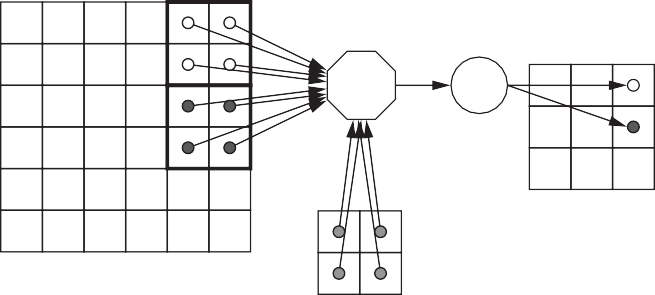
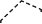

## Example Domain: Deep Neural Networks

Artificial intelligence (AI) is not only the next big wave in computing—it’s the next major turning point in human history… the Intelligence Revolution will be driven by data, neural networks and computing power. Intel is committed to AI [thus]… we’ve added a set of leading-edge accelerants required for the growth and widespread adoption of AI.

> 人工智能(AI)不仅是计算中的下一个大波，而且是人类历史上的下一个主要转折点……情报革命将由数据，神经网络和计算能力驱动。英特尔致力于 AI [SO ]…我们添加了一组用于增长和广泛采用 AI 所需的领先加速剂。

Brian Krzanich,
_Intel CEO_ (2016)

Figure 7.4 A handy guide to DSA terms used in [Sections 7.3–7.6](#_bookmark385). [Figure 7.29](#_bookmark360) on page 472 has a guide for [Section 7.7](#pixel-visual-core-a-personal-mobile-device-image-processing-unit).

> 图 7.4 [7.3-7.6 节]中使用的 DSA 术语方便指南(#\_bookmark385)。[图 7.29](#_bookmark360) 第 472 页上有[第 7.7 节]的指南(＃pixel-visual-core-a-personal-mobile-mobile-device-evice-image-image-image-apocessing-unit)。

Artificial intelligence (AI) has made a dramatic comeback since the turn of the cen- tury. Instead of _building_ artificial intelligence as a large set of logical rules, the focus switched to _machine learning_ from example data as the path to artificial intel- ligence. The amount of data needed to learn was much greater than thought. The warehouse scale computers (WSCs) of this century, which harvest and store peta- bytes of information found on the Internet from the billions of users and their smartphones, supply the ample data. We also underestimated the amount of com- putation needed to learn from the massive data, but GPUs—which have excellent single-precision floating-point cost-performance—embedded in the thousands of servers of WSCs deliver sufficient computing.

> 自从转会以来，人工智能(AI)就引起了戏剧性的卷土重来。焦点不是 _building_ 人工智能作为大型逻辑规则，而是从示例数据中切换到 _Machine Learning_ 作为人工 intel-ligence 的路径。学习所需的数据量远大于思想。本世纪的仓库比例计算机(WSC)，从数十亿用户及其智能手机中收获和存储互联网上的 PETA 字节，提供充足的数据。我们还低估了从大量数据中学习所需的合并数量，但是在数千台 WSC 的服务器中，GPU(具有出色的单精度浮点数效率表现绩效表现)提供了足够的计算。

One part of machine learning, called DNNs, has been the AI star for the past five years. Example DNN breakthroughs are in language translation, which DNNs improved more in a single leap than all the advances from the prior decade ([Tung,](#_bookmark1013) [2016; Lewis-Kraus, 2016](#_bookmark1013)); the switch to DNNs in the past five years reduced the error rate in an image recognition competition from 26% to 3.5% ([Krizhevsky](#_bookmark972) [et al., 2012; Szegedy et al., 2015; He et al., 2016](#_bookmark972)); and in 2016, DNNs enabled a computer program for the first time to beat a human champion at Go ([Silver](#_bookmark1002) [et al., 2016](#_bookmark1002)). Although many of these run in the cloud, they have also enabled Goo- gle Translate on smartphones, which we described in [Chapter 1](#_bookmark2). In 2017 new, sig- nificant DNN results appear nearly every week.

> 机器学习的一部分，称为 DNN，在过去五年中一直是 AI 明星。DNN 突破的例子是语言翻译，DNN 在一次飞跃中的改进比过去十年的所有进步都多 ([Tung,](#_bookmark1013) [2016; Lewis-Kraus, 2016](#_bookmark1013))；过去五年转向 DNN 将图像识别竞赛中的错误率从 26% 降低到 3.5% ([Krizhevsky](#_bookmark972) [et al., 2012; Szegedy et al., 2015; He et al. , 2016](#_bookmark972)); 2016 年，DNN 首次使计算机程序能够在围棋中击败人类冠军([Silver](#_bookmark1002) [et al., 2016](#_bookmark1002))。尽管其中许多在云端运行，但它们也在智能手机上启用了谷歌翻译，我们在[第 1 章](#_bookmark2) 中对此进行了描述。在 2017 年，几乎每周都会出现新的、重要的 DNN 结果。

Readers interested in learning more about DNNs than found in this section should download and try the tutorials in TensorFlow ([TensorFlow Tutorials,](#_bookmark1011) [2016](#_bookmark1011)), or for the less adventurous, consult a free online textbook on DNNs ([Nielsen, 2016](#_bookmark981)).

> 读者对了解 DNN 的知识比本节中的更多有关 DNN 的知识应下载并尝试在 TensorFlow 中尝试并尝试教程([tensorflow 教程，]，(#\_bookmark1011)[2016] [2016](#_bookmark1011))或较少冒险的人，请咨询免费的在线在线教科书在 DNNS 上([Nielsen，2016](#_bookmark981))。

### The Neurons of DNNs

DNNs were inspired by the neuron of the brain. The artificial neuron used for neu- ral networks simply computes the sum over a set of products of _weights_ or _param- eters_ and data values that is then put through a nonlinear function to determine its output. As we will see, each artificial neuron has a large fan-in and a large fan-out. For an image-processing DNN, the input data would be the pixels of a photo, with the pixel values multiplied by the weights. Although many nonlinear func- tions have been tried, a popular one today is simply f(x) max(x,0), which returns 0 if the x is negative or the original value if positive or zero. (This simple function goes by the complicated name _rectified linear unit_ or _ReLU_.) The output of a nonlinear function is called an _activation_, in that it is the output of the artificial neuron that has been "activated."

> DNN 受到大脑神经元的启发。用于神经网络的人工神经元简单地计算一组 *weights* 或 *parameters* 和数据值的乘积的总和，然后通过非线性函数确定其输出。正如我们将看到的，每个人工神经元都有一个大扇入和一个大扇出。对于图像处理 DNN，输入数据将是照片的像素，像素值乘以权重。尽管已经尝试了许多非线性函数，但今天流行的函数只是 f(x) max(x,0)，如果 x 为负，则返回 0，如果为正或为零，则返回原始值。(这个简单的函数有一个复杂的名称 _rectified linear unit_ 或 _ReLU_。)非线性函数的输出称为 _activation_，因为它是已 "激活" 的人工神经元的输出。

A cluster of artificial neurons might process different portions of the input, and the output of that cluster becomes the input to the next layer of artificial neurons. The layers between the input layer and the output layer are called _hidden layers_. For image processing, you can think of each layer as looking for different types of fea- tures, going from lower-level ones like edges and angles to higher-level ones like eyes and ears. If the image-processing application was trying to decide if the image contained a dog, the output of the last layer could be a probability number between 0 and 1 or perhaps a list of probabilities corresponding to a list of dog breeds.

> 一组人造神经元可能会处理输入的不同部分，该群集的输出成为下一层人造神经元的输入。输入层和输出层之间的层称为 _hidden Loasers_。对于图像处理，您可以将每一层视为寻找不同类型的效果，从较低层的边缘和角度到更高级别的效果，例如眼睛和耳朵。如果图像处理应用程序试图确定图像是否包含狗，则最后一层的输出可能是 0 到 1 之间的概率数，也许是与狗品种列表相对应的概率列表。

Figure 7.5 Six DNN applications that represent 95% of DNN workloads for inference at Google in 2016, which we use in [Section 7.9](#putting-it-all-together-cpus-versus-gpus-versus-dnn-accelerators). The columns are the DNN name, the number of layers in the DNN, the number of weights, and operations per weight (oper- ational intensity). [Figure 7.41](#_bookmark374) on page 595 goes into more detail on these DNNs.

> 图 7.5 六个 DNN 应用，代表 2016 年在 Google 推断的 DNN 工作负载的 95％，我们在 [7.9 节](%EF%BC%83putting-it-it-it-all-Together-Together-t-cpus-cpus-vers-vpus-gpus-vers-versus-versus-dnn-accelerators)中使用。这些列是 DNN 名称，DNN 中的层数，权重数量和每个重量的操作(操作强度)。[图 7.41](#_bookmark374) 第 595 页上有关这些 DNN 的详细信息。

The number of layers gave DNNs their name. The original lack of data and computing horsepower kept most neural networks relatively shallow. [Figure 7.5](#_bookmark331) shows the number of layers for a variety of recent DNNs, the number of weights, and the number of operations per weight fetched. In 2017 some DNNs have 150 layers.

> 层数给 DNNS 的名字命名。最初缺乏数据和计算马力使大多数神经网络相对较浅。[图 7.5](#_bookmark331) 显示了各种近期 DNN 的层数，权重的数量和每次供应的操作数量。2017 年，一些 DNN 有 150 层。

### Training Versus Inference

The preceding discussion concerns DNNs that are in production. DNN develop- ment starts by defining the neural network architecture, picking the number and type of layers, the dimensions of each layer, and the size of the data. Although experts may develop new neural network architectures, most practitioners will choose among the many existing designs (e.g., [Figure 7.5](#_bookmark331)) that have been shown to perform well on problems similar to theirs.

> 前面的讨论涉及生产中的 DNN。DNN 的开发首先定义神经网络体系结构，选择图层的数量和类型，每一层的尺寸以及数据的大小。尽管专家可能会开发新的神经网络体系结构，但大多数从业者将在许多现有设计(例如[图 7.5](#_bookmark331))中进行选择，这些设计已证明在类似于他们的问题上表现出色。

Once the neural architecture has been selected, the next step is to learn the weights associated with each edge in the neural network graph. The weights deter- mine the behavior of the model. Depending on the choice of neural architecture, there can be anywhere from thousands to hundreds of millions of weights in a sin- gle model (see [Figure 7.5](#_bookmark331)). Training is the costly process of tuning these weights so that the DNN approximates the complex function (e.g., mapping from pictures to the objects in that picture) described by the training data.

> 一旦选择了神经体系结构，下一步就是学习与神经网络图中每个边缘相关的权重。权重确定模型的行为。根据神经体系结构的选择，在 single 模型中可能有数千到数亿个重量(请参见[图 7.5](#_bookmark331))。训练是调整这些权重的昂贵过程，因此 DNN 近似训练数据描述的复杂函数(例如，从图片到该图片中的对象映射到对象)。

This development phase is universally called _training_ or _learning_, whereas the production phase has many names: _inference_, _prediction_, _scoring_, _implemen- tation_, _evaluation_, _running_, or _testing_. Most DNNs use _supervised learning_ in that they are given a training set to learn from where the data is preprocessed in order to have the correct labels. Thus, in the ImageNet DNN competition ([Russakovsky et al., 2015](#_bookmark997)), the training set consists of 1.2 million photos, and each photo has been labeled as one of 1000 categories. Several of these categories are quite detailed, such as specific breeds of dogs and cats. The winner is deter- mined by evaluating a separate secret set of 50,000 photos to see which DNN has the lowest error rate.

> 这个开发阶段通常被称为 *training* 或 *learning*，而生产阶段有许多名称：_inference_、_prediction_、_scoring_、_implementation_、_evaluation_、*running* 或 *testing*。大多数 DNN 使用*监督学习*，因为它们会获得一个训练集，以便从预处理数据的位置进行学习，以获得正确的标签。因此，在 ImageNet DNN 竞赛 ([Russakovsky et al., 2015](#_bookmark997)) 中，训练集包含 120 万张照片，每张照片都被标记为 1000 个类别之一。其中一些类别非常详细，例如特定品种的狗和猫。获胜者是通过评估一组单独的 50,000 张照片来确定哪个 DNN 的错误率最低。

Setting the weights is an iterative process that goes _backward_ through the neu- ral network using the training set. This process is called _backpropagation_. For example, because you know the breed of a dog image in the training set, you see what your DNN says about the image, and then you adjust the weights to improve the answer. Amazingly, the weights at the start of the training process should be set to random data, and you just keep iterating until you’re satisfied with the DNN accuracy using the training set.

> 设置权重是一个迭代过程，它使用训练集 "向后" 通过神经网络。这个过程称为*反向传播*。例如，因为你知道训练集中狗图像的品种，你会看到你的 DNN 对图像的评价，然后你调整权重以改进答案。令人惊讶的是，训练过程开始时的权重应该设置为随机数据，您只需不断迭代，直到您对使用训练集的 DNN 精度感到满意为止。

For the mathematically inclined, the goal of learning is to find a function that maps the inputs to the correct outputs over the multilayer neural network architec- ture. Backpropagation stands for "back propagation of errors." It calculates a gra- dient over all the weights as input to an optimization algorithm that tries to minimize the errors by updating the weights. The most popular optimization algorithm for DNNs is _stochastic gradient descent_. It adjusts the weights propor- tionally to maximize the descent of the gradient obtained from backpropagation. Readers interested in learning more should see [Nielsen (2016)](#_bookmark981) or [TensorFlow](#_bookmark1011) [Tutorials (2016)](#_bookmark1011).

> 对于数学爱好者来说，学习的目标是找到一个函数，将输入映射到多层神经网络架构上的正确输出。反向传播代表 "错误的反向传播" 。它计算所有权重的梯度作为优化算法的输入，该算法试图通过更新权重来最小化错误。最流行的 DNN 优化算法是*随机梯度下降*。它按比例调整权重以最大化从反向传播获得的梯度下降。有兴趣了解更多信息的读者应参阅 [Nielsen (2016)](#_bookmark981) 或 [TensorFlow](#_bookmark1011) [教程 (2016)](#_bookmark1011)。

Training can take weeks of computation, as [Figure 7.6](#_bookmark332) shows. The inference phase is often below 100 ms per data sample, which is a million times less. Although training takes much longer than a single inference, the total compute time for inference is a product of the number of customers of the DNN and how frequently they invoke it.

> 训练可能需要数周的计算时间，如 [图 7.6](#_bookmark332) 所示。每个数据样本的推理阶段通常低于 100 毫秒，少了一百万倍。尽管训练比单个推理花费的时间长得多，但推理的总计算时间是 DNN 的客户数量和他们调用它的频率的产物。

After training, you deploy your DNN, hoping that your training set is representative of the real world, and that your DNN will be so popular that your users will spend much more time employing it than you’ve put into devel- oping it!

> 训练后，您部署了 DNN，希望您的培训场景代表现实世界，并且您的 DNN 将非常受欢迎，以至于您的用户将花费更多的时间来使用它，而不是您投入使用它！

Figure 7.6 Training set sizes and training time for several DNNs (Iandola, 2016).

There are tasks that don’t have training datasets, such as when trying to predict the future of some real-world event. Although we won’t cover it here, _reinforce- ment learning_ (_RL_) is a popular algorithm for such learning in 2017. Instead of a training set to learn from, RL acts on the real world and then gets a signal from a reward function, depending on whether that action made the situation better or worse.

> 有些任务没有培训数据集，例如试图预测某些现实世界事件的未来时。尽管我们不会在这里介绍它，但 _reinforcement Learning_(_RL_)是 2017 年这种学习的流行算法。而不是培训设置，而不是向现实世界中的 RL 行事，然后从奖励功能中获得信号，取决于该行动是否使情况变得更好。

Although it’s hard to imagine a faster changing field, only three types of DNNs reign as most popular in 2017: _MultiLayer Perceptrons_ (_MLPs_), _Convolutional Neural Networks_ (_CNNs_), and _Recurrent Neural Networks_ (_RNNs_). They are all examples of supervised learning, which rely on training sets.

> 尽管很难想象更快的领域，但在 2017 年最受欢迎的 DNN 统治只有三种类型：_Multilayer Perceptrons_(_MLPS_)，_Conconvolutional Neural Networks_(_cnns_)和 _recurrent neurent neuralt neural necurnets_(_RNNS_)。它们都是监督学习的例子，这些示例依赖于培训集。

### Multilayer Perceptron

MLPs were the original DNNs. Each new layer is a set of nonlinear functions _F_ of weighted sum of all outputs from a prior one _yn F_(_W yn_—1). The weighted sum consists of a vector-matrix multiply of the outputs with the weights (see

> MLP 是原始的 DNN。每个新层都是从前一个输出的加权总和的一组非线性函数 _F_>)。加权总和由输出的矢量矩阵乘以具有权重的输出(请参阅

[Figure 7.7](#_bookmark333)). Such a layer is called _fully connected_ because each output neuron result depends on _all_ input neurons of the prior layer.

> [图 7.7](#_bookmark333))。这样的层被称为*连接*，因为每个输出神经元结果都取决于\_ALL\*的输入神经元。

We can calculate the number of neurons, operations, and weights per layer for each of the DNN types. The easiest is MLP because it is just a vector-matrix multiply of the input vector times the weights array. Here are the parameters and the equations to determine weights and operations for inference (we count multiply and add as two operations):

> 我们可以计算每种 DNN 类型的每层神经元，操作和权重的数量。最简单的是 MLP，因为它只是输入矢量乘以权重阵列的矢量矩阵倍数。以下是确定推理权重和操作的参数和方程(我们计数倍数并添加为两个操作)：

Figure 7.7 MLP showing the input Layer [*i*21] on the left and the output Layer [_i_] on the right. ReLU is a popular nonlinear function for MLPs. The dimensions of the input and output layers are often different. Such a layer is called fully connected because it depends on all the inputs from the prior layer, even if many of them are zeros. One study suggested that 44% were zeros, which presumably is in part because ReLU turns neg- ative numbers into zeros.

> 图 7.7 MLP 显示左侧的输入层 [*I*21 ]，右侧的输出层 [_ I_ ]。Relu 是 MLP 的流行非线性功能。输入和输出层的尺寸通常不同。这样的层被称为完全连接，因为它取决于先前层的所有输入，即使其中许多是零。一项研究表明，零是 44％，这大概部分是因为 Relu 将负数变成零。

- Dim [_i_]: Dimension of the output vector, which is the number of neurons
- Dim [_i_—1]: Dimension of the input vector
- Number of weights: Dim [_i_—1] ×Dim [_i_]
- Operations: 2 ×Number of weights
- Operations/Weight: 2

This final term is the _operational intensity_ from the Roofline model discussed in [Chapter 4](#_bookmark165). We use operations per _weight_ because there can be millions of weights, which usually don’t fit on the chip. For example, the dimensions of one stage of an MLP in [Section 7.9](#putting-it-all-together-cpus-versus-gpus-versus-dnn-accelerators) has Dim [_i_ 1] 4096 and Dim [_i_] 2048, so for that layer, the number of neurons is 2048, number of weights is 8,388,608, the number of operations is 16,777,216, and the operational intensity is 2. As we recall from the Roofline model, low operational intensity makes it harder to deliver high performance.

> 这个最后一个术语是[第 4 章](#_bookmark165)中讨论的屋顶线模型的*操作强度*。我们使用每个\_weight\*的操作，因为可能会有数百万个重量，通常不适合芯片。例如，[7.9]中的 MLP 一个阶段的尺寸(＃putting-it-it-all-together-togeth-cpus-vers-vpus-vers-versus-versus-dnn-accelerators)具有昏暗的 [_ I_ 1 ] 4096 和 dim [_i_ ] 2048，因此，对于该层，神经元的数量为 2048，权重为 8,388,608，操作数量为 16,777,216，操作强度为 2。正如我们从屋顶线模型中回忆起的，低操作强度使得低操作强度。很难提供高性能。

### Convolutional Neural Network

CNNs are widely used for computer vision applications. As images have a two- dimensional structure, neighboring pixels are the natural place to look to find rela- tionships. CNNs take as inputs a set of nonlinear functions from spatially nearby regions of outputs from the prior layer and then multiplies by the weights, which reuses the weights many times.

> CNN 广泛用于计算机视觉应用。由于图像具有二维结构，因此相邻的像素是寻找相互关系的自然场所。CNN 将作为输入的一组非线性函数从上一层的空间附近的输出区域，然后乘以重量，从而将权重重复多次。

The idea behind CNNs is that each layer raises the level of abstraction of the image. For example, the first layer might identify only horizontal lines and vertical lines. The second layer might combine them to identify corners. The next step might be rectangles and circles. The following layer could use that input to detect portions of a dog, like eyes or ears. The higher layers would be trying to identify characteristics of different breeds of dogs.

> CNN 背后的想法是，每一层都提高了图像的抽象水平。例如，第一层可能仅识别水平线和垂直线。第二层可能将它们结合在一起以识别角。下一步可能是矩形和圆圈。以下一层可以使用该输入来检测狗的部分，例如眼睛或耳朵。较高的层将试图确定不同品种的狗的特征。

Each neural layer produces a set of two-dimensional _feature maps_, where each cell of the two-dimensional feature map is trying to identify one feature in the cor- responding area of the input.

> 每个神经层都会产生一组二维 _Feature Maps_，其中二维特征映射的每个单元格都试图在输入的响应区域中识别一个特征。

[Figure 7.8](#_bookmark334) shows the starting point where a 2 2 stencil computation from the input image creates the elements of the first feature map. A _stencil computation_ uses neighboring cells in a fixed pattern to update all the elements of an array. The number of output feature maps will depend on how many different features you are trying to capture from the image and the stride used to apply the stencil.

> [图 7.8](#_bookmark334) 显示了一个起点，其中 2 2 个来自输入图像的模具计算创建了第一个特征映射的元素。\_stencial Computation\*使用固定模式的相邻单元格来更新数组的所有元素。输出特征地图的数量将取决于您试图从图像中捕获的不同功能以及用于应用模板的步幅。

The process is actually more complicated because the image is usually not just a single, flat two-dimensional layer. Typically, a color image will have three levels for red, green, and blue. For example, a 2 × 2 stencil will access 12 elements: 2 × 2

> 该过程实际上更为复杂，因为图像通常不仅是单个平坦的二维层。通常，颜色图像将具有三个层次，用于红色，绿色和蓝色。例如，2×2 模板将访问 12 个元素：2×2

Figure 7.8 Simplified first step of a CNN. In this example, every group of four pixels of the input image are multiplied by the same four weights to create the cells of the output feature map. The pattern depicted shows a stride of two between the groups of input pixels, but other strides are possible. To relate this figure to MLP, you can think of each

> 图 7.8 CNN 的简化第一步。在此示例中，将输入图像的四个像素组成的每组乘以相同的四个权重以创建输出特征映射的单元格。所描述的模式显示了两组输入像素之间的大步，但其他步伐是可能的。要将这个数字与 MLP 联系起来，您可以想到每个人

2 2 convolution as a tiny fully connected operation to produce one point of the output feature map. [Figure 7.9](#_bookmark335) shows how multiple feature maps turn the points into a vector in the third dimension.

> 2 2 卷积为微小连接的操作，以产生输出特征图的一个点。[图 7.9](#_bookmark335) 显示了多个特征地图如何将点变成第三维中的向量。

of red pixels, 2 2 of green pixels, and 2 2 of blue pixels. In this case, you need 12 weights per output feature map for a 2 2 stencil on three input levels of an image.

> 红色像素，2 2 个绿色像素和 2 2 个蓝色像素。在这种情况下，您需要在图像的三个输入级别上进行 2 2 模块的每个输出功能映射 12 个权重。

[Figure 7.9](#_bookmark335) shows the general case of an arbitrary number of input and output feature maps, which occurs after that first layer. The calculation is a three- dimensional stencil over all the input feature maps with a set of weights to produce one output feature map.

> [图 7.9](#_bookmark335) 显示了任意数量的输入和输出特征映射的一般情况，该图是在第一层之后发生的。计算是所有输入特征图上的三维模板，并具有一组权重，以产生一个输出特征映射。

For the mathematically oriented, if the number of input feature maps and output feature maps both equal 1 and the stride is 1, then a single layer of a two-dimensional CNN is the same calculation as a two-dimensional discrete convolution.

> 对于以数学为导向的，如果输入特征映射和输出特征映射的数量同时等于 1 且步幅为 1，则二维 CNN 的单层与二维离散卷积相同。

As we see in [Figure 7.9](#_bookmark335), CNNs are more complicated than MLPs. Here are the parameter and the equations to calculate the weights and operations:

> 正如我们在[图 7.9](#_bookmark335) 中看到的那样，CNN 比 MLP 复杂。这是计算权重和操作的参数和方程式：

- DimFM [_i_—1]: Dimension of the (square) input Feature Map
- DimFM [_i_]: Dimension of the (square) output Feature Map
- DimSten [_i_]: Dimension of the (square) stencil
- NumFM [_i_—1]: Number of input Feature Maps
- NumFM [_i_]: Number of output Feature Maps
- Number of neurons: NumFM [_i_] ×DimFM [_i_]2

Figure 7.9 CNN general step showing input feature maps of Layer [*i*21] on the left, the output feature maps of Layer [_i_] on the right, and a three-dimensional stencil over input feature maps to produce a single output feature map. Each output feature map has its own unique set of weights, and the vector-matrix multiply happens for every one. The dotted lines show future output feature maps in this figure. As this figure illustrates, the dimensions and number of the input and output feature maps are often different. As with MLPs, ReLU is a popular nonlinear function for CNNs.

> 图 7.9 CNN 一般步骤显示左侧 [*I*21 ]的输入特征图，右侧的 [_ i_ ]的输出特征图和三维模板在输入特征图上以生成单个输出功能图。每个输出功能映射都有其自己独特的权重集，并且矢量矩阵倍数都会发生。虚线显示了该图中的未来输出特征图。如该图所示，输入和输出特征图的尺寸和数量通常不同。与 MLP 一样，Relu 是 CNN 的流行非线性函数。

- Number of weights per output Feature Map: NumFM [_i_—1] ×DimSten [_i_]2
- Total number of weights per layer: NumFM [_i_] Number of weights per output Feature Map
- Number of operations per output Feature Map: 2 DimFM [_i_]2 Number of weights per output Feature Map
- Total number of operations per layer: NumFM [_i_] ×Number of operations per output Feature Map= 2 ×DimFM [_i_]2 ×NumFM [_i_] ×Number of weights per output Feature Map= 2 ×DimFM [_i_]2 ×Total number of weights per layer
- Operations/Weight: 2 ×DimFM [_i_]2

A CNN in [Section 7.9](#putting-it-all-together-cpus-versus-gpus-versus-dnn-accelerators) has a layer with DimFM [_i_ 1] 28, DimFM [_i_] 14, Dim- Sten [_i_] 3, NumFM [_i_ 1] 64 (number of input feature maps), and NumFM [_i_] 128 (number of output feature maps). That layer has 25,088 neurons, 73,728 weights, does 28,901,376 operations, and has an operational intensity of 392. As our example indicates, CNN layers generally have fewer weights and greater operational intensity than the fully connected layers found in MLPs.

> [第 7.9 节]中的 CNN(＃putting-it-it-all-together-cpus-cpus-vpus-gpus-versus-dnn-accelerators)具有带有 dimfm [_ i_ 1 ] 28，dimfm [_ I_ i* ] 14，14，14，14，dimfm [* i* 1 ]的图层 dim- sten [* i* ] 3，numfm [* i* 1 ] 64(输入特征映射的数量)和 numfm [* i_] 128(输出特征映射的数量)。该层具有 25,088 个神经元，73,728 个重量，进行 28,901,376 个操作，并且操作强度为 392。如我们的示例表明，CNN 层通常比 MLP 中的完全连接的层具有更少的权重和更大的操作强度。

### Recurrent Neural Network

The third type of DNN is RNNs, which are popular for speech recognition or lan- guage translation. RNNs add the ability to explicitly model sequential inputs by adding state to the DNN model so that RNNs can remember facts. It’s analogous to the difference in hardware between combinational logic and a state machine. For example, you might learn the gender of the person, which you would want to pass along to remember later when translating words. Each layer of an RNN is a col- lection of weighted sums of inputs from the prior layer and the previous state. The weights are reused across time steps.

> 第三种 DNN 是 RNN，在语音识别或语言翻译中很受欢迎。RNN 通过将状态添加到 DNN 模型，以使 RNN 可以记住事实，从而添加了可以显式建模顺序输入的能力。它类似于组合逻辑和状态机之间硬件的差异。例如，您可能会学会这个人的性别，您想在翻译单词时要记住这一点。RNN 的每个层都是从上一层和先前状态的加权总和的集合。权重跨时间步骤重复使用。

_Long short-term memory_ (_LSTM_) is by far the most popular RNN today. LSTMs mitigate a problem that previous RNNs had with their inability to remem- ber important long-term information.

> 长期的短期记忆(LSTM)是迄今为止最受欢迎的 RNN。LSTMS 减轻了以前 RNN 的问题，因为他们无法纪念重要的长期信息。

Unlike the other two DNNs, LSTM is a hierarchical design. LSTM consists of modules called _cells_. You can think of cells as templates or macros that are linked together to create the full DNN model, similar to how layers of an MLP line up to form a complete DNN model.

> 与其他两个 DNN 不同，LSTM 是层次设计。LSTM 由称为 _cells_ 的模块组成。您可以将单元格视为模板或宏，这些模板或宏可以连接在一起以创建完整的 DNN 模型，类似于 MLP 的层如何排列以形成完整的 DNN 模型。

[Figure 7.10](#_bookmark336) shows how the LSTM cells are linked together. They are hooked up from left to right, connecting the output of one cell to the input of the next. They are also unrolled in time, which runs top down in [Figure 7.10](#_bookmark336). Thus a sentence is input a word at a time per iteration of the unrolled loop. The long-term and short- term memory information that gives the LSTM its name is also passed top-down from one iteration to the next.

> [图 7.10](#_bookmark336) 显示了 LSTM 单元格是如何链接在一起的。它们从左向右连接，将一个单元的输出连接到下一个单元的输入。它们也随着时间的推移而展开，它在[图 7.10](#_bookmark336) 中流行起来。因此，根据展开的循环的迭代，句子是输入一个单词。赋予 LSTM 的长期和短期内存信息也从一个迭代到下一个迭代也通过了自上而下。

[Figure 7.11](#_bookmark337) shows the contents of an LSTM cell. As we would expect from [Figure 7.10](#_bookmark336), the input is on the left, the output is on the right, the two memory inputs are at the top, and the two memory outputs are at the bottom.

> [图 7.11](#_bookmark337) 显示了 LSTM 单元的内容。正如我们从[图 7.10](#_bookmark336) 中所期望的那样，输入在左侧，输出在右侧，两个内存输入在顶部，两个内存输出在底部。

Each cell does five vector-matrix multiplies using five unique sets of weights. The matrix multiply on the input is just like the MLP in [Figure 7.7](#_bookmark333). Three others are called _gates_ in that they gate or limit how much information from one source is passed along to the standard output or the memory output. The amount of infor- mation sent per gate is set by their weights. If the weights are mostly zeros or small values, then little gets through; conversely, if they are mostly large, then the gate lets most information flow. The three gates are called the _input gate_, the _output gate_, and the _forget gate_. The first two filter the input and output, and the last one determines what to forget along the long-term memory path.

> 每个单元使用五组唯一的权重乘以五个矢量矩阵。输入上的矩阵乘以[图 7.7]中的 MLP(#_bookmark333)。另外三个被称为\_gates_，因为它们 got 或限制了从一个源中传递到标准输出或内存输出的多少信息。每个门发送的信息量由其重量设置。如果权重主要是零或小值，那么几乎没有通过。相反，如果它们大部分很大，则门可以让大多数信息流动。这三个门称为 _input 门_，*Output 门*和* forget 门*。前两个过滤输入和输出，最后一个确定了沿着长期存储路径的忘记。

The short-term memory output is a vector-matrix multiply using the Short Term Weights and the output of this cell. The short-term label is applied because it does not directly use any of the inputs to the cell.

> 短期内存输出是使用该单元格的短期权重和输出的矢量矩阵乘法。应用短期标签是因为它不直接使用电池的任何输入。

Because the LSTM cell inputs and outputs are all connected together, the size of the three input-output pairs must be the same. Looking inside the cell, there are enough dependencies that all of the inputs and outputs are often the same size. Let’s assume they are all the same size, called _Dim_.

> 由于 LSTM 单元格输入和输出都连接在一起，因此三个输入输出对的大小必须相同。看着单元格内部，有足够的依赖项，所有输入和输出通常都相同。假设它们都是相同的大小，称为 _dim_。

Even so, the vector-matrix multiplies are not all the same size. The vectors for the three gate multiplies are 3 ×Dim, because the LSTM concatenates all three inputs. The vector for the input multiply is 2 ×Dim, because the LSTM concatenates the input with the short-term memory input as the vector. The vector for the last multiply is just 1 Dim, because it is just the output.

> 即便如此，矢量矩阵乘以乘以所有相同的大小。这三个门的向量乘以 3×dim，因为 LSTM 会串联所有三个输入。输入倍数的向量为 2×DIM，因为 LSTM 将输入与短期内存输入作为向量连接。最后一个倍数的向量仅为 1 个昏暗的，因为它只是输出。

Figure 7.10 LSTM cells connected together. The inputs are on the left (English words), and the outputs are on the right (the translated Spanish words). The cells can be thought of as being unrolled over time, from top to bottom. Thus the short-term and long-term memory of LSTM is implemented by passing information top-down between unrolled cells. They are unrolled enough to translate whole sentences or even paragraphs. Such sequence-to-sequence translation models delay their output until they get to the end of the input ([Wu et al., 2016](#_bookmark1019)). They produce the translation in _reverse order_, using the most recent translated word as input to the next step, so "now is the time" becomes "ahora es el momento." (This figure and the next are often shown turned 90 degrees in LSTM litera- ture, but we’ve rotated them to be consistent with [Figures 7.7](#_bookmark333) and [7.8](#_bookmark334).)

> 图 7.10 LSTM 细胞连接在一起。输入在左侧(英语单词)，输出在右侧(翻译的西班牙语单词)。可以将细胞从上到下视为随着时间的流逝而展开。因此，LSTM 的短期和长期记忆是通过在展开的细胞之间传递信息来实现的。它们的展开足以翻译整个句子甚至段落。这样的序列到序列翻译模型延迟了输出，直到输入结束([Wu 等，2016](#_bookmark1019))。它们以\_reverse Order\*的形式产生翻译，使用最新的翻译单词作为下一步的输入，因此 "现在是现在的时间" 变为 " Ahora es es el Momento" 。(在 LSTM 文学中经常显示该图和下一个图，但我们旋转它们与[图 7.7](#_bookmark333) 和 [7.8](#_bookmark334) 一致。

Now we can finally calculate the weights and operations:

> 现在，我们最终可以计算重量和操作：

Figure 7.11 This LSTM cell contains 5 vector-matrix multiplies, 3 element-wise multiplies, 1 element-wise add, and 6 nonlinear functions. The standard input and short-term memory input are concatenated to form the vector operand for the input vector-matrix multiply. The standard input, long-term memory input, and short-term memory input are concatenated to form the vector that is used in three of the other four vector-matrix multiplies. The non- linear functions for the three gates are Sigmoids _f_(_x_) 1/(1 +exp( _x_)); the others are hyperbolic tangents. (This figure and the previous one are often shown turned 90 degrees in LSTM literature, but we’ve rotated them to be consistent with [Figures 7.7](#_bookmark333) and [7.8](#_bookmark334).)

> 图 7.11 该 LSTM 单元包含 5 个矢量 - 矩阵乘以乘，3 个元素乘以乘以 1 个元素的添加和 6 个非线性函数。标准输入和短期内存输入被串联以形成输入矢量 - 矩阵乘法的向量操作数。标准输入，长期内存输入和短期内存输入是连接的，以形成在其他四个矢量矩阵中使用的矢量。三个门的非线性函数是 sigmoids _f _(_ x_)1/(1 +exp(_x_));其他是双曲线切线。(在 LSTM 文献中经常显示该图和上一张图，但我们旋转它们与[图 7.7](#_bookmark333) 和 [7.8](#_bookmark334) 一致。

Dim is 1024 for one of the six cells of an LSTM in [Section 7.9](#putting-it-all-together-cpus-versus-gpus-versus-dnn-accelerators). Its number of weights is 12,582,912, its number of operations is 25,169,920, and its operational intensity is 2.0003. Thus LSTMs are like MLPs in that they typically have more weights and a lower operational intensity than CNNs.

> [第 7.9 节](#putting-it-all-together-cpus-versus-gpus-versus-dnn-accelerators)中 LSTM 的六个单元之一的 Dim 为 1024。其权重数为 12,582,912，运算次数为 25,169,920，运算强度为 2.0003。因此，LSTM 与 MLP 类似，因为它们通常比 CNN 具有更多的权重和更低的操作强度。

### Batches

Because DNNs can have many weights, a performance optimization is to reuse the weights once they have been fetched from memory across a set of inputs, thereby increasing effective operational intensity. For example, an image- processing DNN might work on a set of 32 images at a time to reduce the effective cost of fetching weights by a factor of 32. Such datasets are called _batches_ or _minibatches_. In addition to improving the performance of inference, backpropagation needs a batch of examples instead of one at a time in order to train well.

> 由于 DNN 可以具有许多权重，因此性能优化是一旦权重从存储器中从内存中获取，从而增加了一组输入，从而提高了有效的操作强度。例如，图像处理 DNN 可能一次在一组 32 张图像上使用，以将其获取权重的有效成本减少 32。此类数据集称为 _batches_ 或 _minibatches_。除了提高推理的性能外，反向传播还需要一个示例，而不是一次示例才能训练。

Looking at an MLP in [Figure 7.7](#_bookmark333), a batch can be seen as a sequence of input row vectors, which you can think of as a matrix with a height dimension that matches the batch size. A sequence of row vector inputs to the five matrix multi- plies of LSTMs in [Figure 7.11](#_bookmark337) can also be considered a matrix. In both cases, com- puting them as matrices instead of sequentially as independent vectors improves computing efficiency.

> 查看[图 7.7](#_bookmark333) 中的 MLP，可以将批次视为输入行向量的序列，您可以将其视为具有与批量大小相匹配的高度尺寸的矩阵。[图 7.11](#_bookmark337) 中 LSTM 的五个矩阵多层的行矢量输入序列也可以视为矩阵。在这两种情况下，将它们作为矩阵而不是顺序地构成，因为独立向量提高了计算效率。

### Quantization

Numerical precision is less important for DNNs than for many applications. For example, there is no need for double-precision floating-point arithmetic, which is the standard bearer of high-performance computing. It’s even unclear that you need the full accuracy of the IEEE 754 floating-point standard, which aims to be accurate within one-half of a unit in the last place of the floating-point significand.

> 对于 DNN 而言，数值精度不如许多应用重要。例如，不需要双精度浮点算术，这是高性能计算的标准承载者。甚至还不清楚您需要 IEEE 754 浮点标准的全部精度，该标准的目的是在浮点点的最后一个位置中精确地在一个单元的一半之内准确。

To take advantage of the flexibility in numerical precision, some devel- opers use fixed point instead of floating point for the inference phase. (Train- ing is almost always done in floating-point arithmetic.) This conversion is called _quantization_, and such a transformed application is said to be _quantized_ ([Vanhoucke et al., 2011](#_bookmark1015)). The fixed-point data width is usually 8 or 16 bits, with the standard multiply-add operation accumulating at twice the width of the multiplies. This transformation typically occurs after training, and it can reduce DNN accuracy by a few percentage points ([Bhattacharya and](#_bookmark928) [Lane, 2016](#_bookmark928)).

> 为了利用数值精度的灵活性，一些开发器使用固定点而不是推理阶段的浮点。(训练几乎总是以浮点算术进行。)此转换称为 _quantization_，这种转换的应用程序被称为 _Quantized_([[Vanhoucke 等，2011](#_bookmark1015))。定点数据宽度通常为 8 或 16 位，标准的多重 ADD 操作以乘以倍数的两倍。这种转换通常是在训练后发生的，并且可以将 DNN 精度降低几个百分点([Bhattacharya and](#_bookmark928)[Lane，2016](#_bookmark928))。

### Summary of DNNs

Even this quick overview suggests that DSAs for DNNs will need to perform at least these matrix-oriented operations well: vector-matrix multiply, matrix-matrix multiply, and stencil computations. They will also need support for the nonlinear functions, which include at a minimum ReLU, Sigmoid, and tanh. These modest requirements still leave open a very large design space, which the next four sections explore.

> 即使是这个快速概述，DNNS 的 DSA 至少需要很好地执行这些面向矩阵的操作：Vector-Matrix Multiply，Matrix-Matrix Multiply 和模板计算。他们还需要支持非线性函数，其中包括最小的 Relu，Sigmoid 和 Tanh。这些适度的要求仍然留下一个很大的设计空间，接下来的四个部分探索了这一空间。
