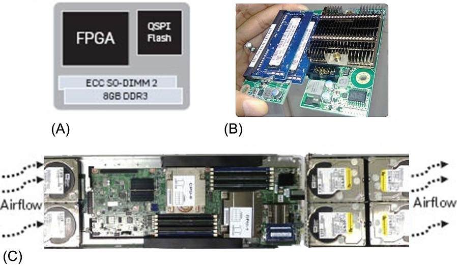
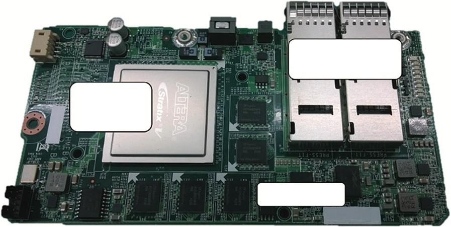

## Microsoft Catapult, a Flexible Data Center Accelerator

> [!note]
> 这里提及的几个原则，是否也可以用在功能安全上？！

At the same time that Google was thinking about deploying a custom ASIC in its data centers, Microsoft was considering accelerators for theirs. The Microsoft perspective was that any solution had to follow these guidelines:

> 同时，Google 正在考虑在其数据中心部署自定义 ASIC，Microsoft 正在考虑为他们的加速器。微软的观点是，任何解决方案都必须遵循以下准则：

- It had to preserve homogeneity of servers to enable rapid redeployment of machines and to avoid making maintenance and scheduling even more com- plicated, even if that notion is a bit at odds with the concept of DSAs.
- It had to scale to applications that might need more resources than could fit into a single accelerator without burdening all applications with multiple accelerators.
- It needed to be power-efficient.
- It couldn’t become a dependability problem by being a single point of failure.
- It had to fit within the available spare space and power in existing servers.
- It could not hurt data center network performance or reliability.
- The accelerator had to improve the cost-performance of the server.

> - 它必须保留服务器的均匀性，以便快速重新部署机器，并避免使维护和安排更加复杂，即使该概念与 DSA 的概念有些不符。
> - 它必须扩展到可能需要更多资源的应用程序，而不是可以适合单个加速器的应用程序，而不会为所有应用程序带来多个加速器的负担。
> - 需要发挥力量。
> - 通过成为单点失败，这不会成为一个可靠性问题。
> - 它必须适合现有服务器中可用的备用空间和电源。
> - 它不会损害数据中心网络的性能或可靠性。
> - 加速器必须提高服务器的成本绩效。

The first rule prevented deploying an ASIC that helped only some applications on some servers, which was the decision that Google made.

> 第一条规则阻止了部署 ASIC，该 ASIC 仅帮助某些服务器上的某些应用程序，这是 Google 做出的决定。

Microsoft started a project called Catapult that placed an FPGA on a PCIe bus board into data center servers. These boards have a dedicated network for appli- cations that need more than one FPGA. The plan was to use the flexibility of the FPGA to tailor its use for varying applications both on different servers and to reprogram the same server to accelerate distinct applications over time. This plan increased the return on its investment of the accelerator. Another advantage of FPGAs is that they should have lower NRE than ASICs, which could again improve return on investment. We discuss two generations of Catapult, showing how the design evolved to meet the needs of WSCs.

> 微软启动了一个名为弹射器的项目，该项目将 FPGA 放在 PCIE 巴士板上，进入数据中心服务器。这些董事会具有针对需要多个 FPGA 的应用程序的专用网络。该计划是利用 FPGA 的灵活性来定制其用于不同服务器上不同应用程序的使用，并重新编程同一服务器，以随着时间的推移加速不同的应用程序。该计划增加了其对加速器的投资回报。FPGA 的另一个优点是，它们的 NRE 应该低于 ASIC，这可以再次提高投资回报率。我们讨论了两代弹射器，展示了设计如何发展以满足 WSC 的需求。

One interesting upside of FPGAs is that each application—or even each phase of an application—can be thought of as its own DSA, so in this section, we get to see many examples of novel architectures in one hardware platform.

> FPGA 的一个有趣的好处是，每个应用程序(甚至是应用程序的每个阶段)都可以将其视为自己的 DSA，因此在本节中，我们可以在一个硬件平台中看到许多新型架构的示例。

### Catapult Implementation and Architecture

[Figure 7.19](#_bookmark348) shows a PCIe board that Microsoft designed to fit within its servers, which limited power and cooling to 25 W. This constraint led to the selection of the 28-nm Altera Stratix V D5 FPGA for its first implemen- tation of Catapult. The board also has 32 MiB of flash memory and includes two banks of DDR3-1600 DRAM with a total capacity of 8 GiB. The FPGA has 3926 18-bit ALUs, 5 MiB of on-chip memory, and 11 GB/s bandwidth to DDR3 DRAMs.

> [图 7.19](#_bookmark348) 显示了 Microsoft 旨在适合其服务器的 PCIE 板，该板将功率和冷却限制在 25 W 中。此约束导致选择了 28 nm Altera Stratix V D5 FPGA 的第一个启动器 - 弹射器的影响。董事会还具有 32 个 MIB 的闪存，其中包括两岸 DDR3-1600 DRAM 的库，总容量为 8 GIB。FPGA 有 3926 位 18 位 Alus，5 个芯片内存的 MIB 和 11 GB/S 带宽到 DDR3 DRAM。

Figure 7.19 The Catapult board design. (A) shows the block diagram, and (B) is a pho- tograph of both sides of the board, which is 10 cm 9 cm 16 mm. The PCIe and inter- FPGA network are wired to a connector on the bottom of the board that plugs directly into the motherboard. (C) is a photograph of the server, which is 1U (4.45 cm) high and half a standard rack wide. Each server has two 12-core Intel Sandy Bridge Xeon CPUs, 64 GiB of DRAM, 2 solid-state drives, 4 hard-disk drives, and a 10-Gbit Ethernet network card. The highlighted rectangle on the right in (C) shows the location of the Catapult FPGA board on the server. The cool air is sucked in from the left in (C), and the hot air exhausts to the right, which passes over the Catapult board. This hot spot and the amount of the power that the connector could deliver mean that the Catapult board is limited to 25 watts. Forty-eight servers share an Ethernet switch that connects to the data center network, and they occupy half of a data center rack.

> 图 7.19 弹射板设计。(a)显示了框图，(b)是板两侧的 pho 图，即 10 cm 9 cm 16 毫米。PCIE 和 FPGA 网络连接到直接插入主板的板底部的连接器。(c)是服务器的照片，即 1U(4.45 厘米)高和一半标准架子宽。每个服务器都有两个 12 核 Intel Sandy Bridge Xeon CPU，64 个 GIB DRAM，2 个固态驱动器，4 个硬盘驱动器和一张 10 Gbit 的以太网网络卡。(c)中右侧的突出显示的矩形显示了服务器上弹射器 FPGA 板的位置。凉爽的空气从左侧(C)中吸入，热空气驶向右侧，然后驶过弹射板。这个热点和连接器可以提供的功率量意味着弹射板限制为 25 瓦。四十八服务器共享连接到数据中心网络的以太网开关，它们占据了数据中心架的一半。

Each of the 48 servers in half of a data center rack contains a Catapult board. Catapult follows the preceding guidelines about supporting applications that need more than a single FPGA without affecting the performance of the data center net- work. It adds a separate low-latency 20 Gbit/s network that connects 48 FPGAs. The network topology is a two-dimensional 6 8 torus network.

> 数据中心机架一半的 48 个服务器中的每台都包含一个弹射板。弹射器遵循了前面的指南，有关支持应用程序需要超过单个 FPGA 的应用，而不会影响数据中心网络的性能。它添加了连接 48 FPGA 的单独的低延迟 20 GBIT/S 网络。网络拓扑是一个二维 6 8 圆环网络。

To follow the guideline about not being a single point of failure, this network can be reconfigured to operate even if one of the FPGAs fails. The board also has SECDED protection on all memories outside the FPGA, which is required for large-scale deployment in a data center.

> 要遵循有关不是单个故障点的准则，即使其中一个 FPGA 失败，也可以重新配置该网络以操作。董事会还对 FPGA 以外的所有记忆进行了保护，这是数据中心大规模部署所必需的。

Because FPGAs use a great deal of memory on the chip to deliver programma- bility, they are more vulnerable than ASICs to _single-event upsets (SEUs)_ because of radiation as the process geometries shrink. The Altera FPGA in Catapult boards includes mechanisms to detect and correct SEUs inside the FPGA and reduces the chances of SEUs by periodically scrubbing the FPGA configuration state.

> 由于 FPGA 在芯片上使用大量内存来提供程序能力，因此它们比 ASIC 更容易受到 *Single-Vent-Vent Upsets(SEUS)* _的脆弱性(SEUS)_，因为随着过程几何形式的辐射缩小。弹射板中的 Altera FPGA 包括在 FPGA 内部检测和纠正 SEU 的机制，并通过定期擦洗 FPGA 配置状态来降低 SEU 的机会。

The separate network has an added benefit of reducing the variability of com- munication performance as compared to a data center network. Network unpredict- ability increases tail latency—which is especially detrimental for applications that face end users—so a separate network makes it easier to successfully offload work from the CPU to the accelerator. This FPGA network can run a much simpler pro- tocol than in the data center because the error rates are considerably lower and the network topology is well defined.

> 与数据中心网络相比，单独的网络具有降低通信性能的可变性的额外好处。网络不可预测的能力增加了尾部潜伏期(对于面对最终用户的应用程序尤其有害)，因此单独的网络使得成功地将工作从 CPU 转移到加速器变得更加容易。该 FPGA 网络可以运行比数据中心更简单的预付款，因为错误率较低，并且网络拓扑的定义很好。

Note that resiliency requires care when reconfiguring FPGAs so that they nei- ther appear as failed nodes nor crash the host server or corrupt their neighbors. Microsoft developed a high-level protocol for ensuring safety when reconfiguring one or more FPGAs.

> 请注意，弹性在重新配置 FPGA 时需要护理，以使它们看起来像是失败的节点，也不会使主机服务器崩溃或破坏其邻居。Microsoft 开发了一种高级协议，以确保重新配置一个或多个 FPGA 时的安全性。

### Catapult Software

Possibly the biggest difference between Catapult and the TPU is having to program in a hardware-description language such as Verilog or VHDL. As the Catapult authors write ([Putnam et al., 2016](#_bookmark992)):

> 弹射器和 TPU 之间的最大区别可能是必须用硬件描述语言(例如 Verilog 或 VHDL)进行编程。正如弹射器作者所写([Putnam 等，2016](#_bookmark992))：

Going forward, the biggest obstacle to widespread adoption of FPGAs in the datacenter is likely to be programmability. FPGA development still requires extensive hand-coding in Register Transfer Level and manual tuning.

> 展望未来，在数据中心中广泛采用 FPGA 的最大障碍很可能是可编程的。FPGA 开发仍需要大量的手工编码在寄存器转移级别和手动调整中。

To reduce the burden of programming Catapult FPGAs, the Register Transfer Level (RTL) code is divided into the _shell_ and the _role_, as [Figure 7.20](#_bookmark349) shows. The shell code is like the system library on an embedded CPU. It contains the RTL code that will be reused across applications on the same FPGA board, such as data marshaling, CPU-to-FPGA communication, FPGA-to-FPGA communication, data movement, reconfiguration, and health monitoring. The shell RTL code is 23% of the Altera FPGA. The role code is the application logic, which the Catapult programmer writes using the remaining 77% of the FPGA resources. Having a shell has the added benefit of offering a standard API and standard behavior across applications.

> 为了减轻编程弹射 FPGA 的负担，如[图 7.20](#_bookmark349) 所示，将寄存器传输级别(RTL)代码分为 *shell* 和 *role*。外壳代码就像嵌入式 CPU 上的系统库一样。它包含了 RTL 代码，该代码将在同一 FPGA 板上的应用程序中重复使用，例如数据申请，CPU 到 FPGA 通信，FPGA 到 FPGA 通信，数据移动，重新配置和健康监控。Shell RTL 代码是 Altera FPGA 的 23％。角色代码是应用程序逻辑，弹射器程序员使用其余 77％的 FPGA 资源编写。拥有外壳具有在应用程序中提供标准 API 和标准行为的额外好处。

256 Mb QSPI
Figure 7.20 Components of Catapult shell and role split of the RTL code.

### CNNs on Catapult

Microsoft developed a configurable CNN accelerator as an application for Catapult. Configuration parameters include the number of neural network layers, the dimension of those layers, and even the numerical precision to be used. [Figure 7.21](#_bookmark350) shows the block diagram of the CNN accelerator. Its key features are:

> Microsoft 开发了可配置的 CNN 加速器作为弹射器的应用程序。配置参数包括神经网络层的数量，这些层的维度，甚至包括要使用的数值精度。[图 7.21](#_bookmark350) 显示了 CNN 加速器的框图。它的主要特征是：

- Run-time configurable design, without requiring recompilation using the FPGA tools.
- To minimize memory accesses, it offers efficient buffering of CNN data struc- tures (see [Figure 7.21](#_bookmark350)).
- A two-dimensional array of Processing Elements (PEs) that can scale up to thousands of units.

Figure 7.21 CNN Accelerator for Catapult. The Input Volume of the left correspond to Layer [_i_ 1] on the left of [Figure 7.20](#_bookmark349), with NumFM [_i_ 1] corresponding to y and DimFM [_i_ 1] corresponding to _z_. Output Volume at the top maps to Layer [_i_], with z mapping to NumFM [_i_] and DimFM [_i_] mapping to _x_. The next figure shows the inside of the Processing Element (PE).

> 图 7.21 CNN 弹射器加速器。左侧的输入卷对应于[图 7.20](#_bookmark349) 左侧的 layer [_i_ 1 ]，带有 numfm [_i_ 1 ]，对应于 y 和 dimfm [_i_ i_ 1 ]。在顶部地图上的输出音量\ [_i_ ]，z 映射到 numfm [_i_ ]，dimfm [_i_ ]映射到 *x*。下图显示了处理元素(PE)的内部。

Images are sent to DRAM and then input into a multibank buffer in the FPGA. The inputs are sent to multiple PEs to perform the stencil computations that produce the output feature maps. A controller (upper left in [Figure 7.21](#_bookmark350)) orchestrates the flow of data to each PE. The final results are then recirculated to the input buffers to compute the next layer of the CNN.

> 图像被发送到 DRAM，然后输入到 FPGA 中的多翼缓冲区中。输入发送到多个 PES，以执行产生输出特征图的模具计算。控制器(图 7.21](#\_bookmark350)中的左上方)协调数据流向每个 PE 的流。然后将最终结果再循环到输入缓冲区，以计算 CNN 的下一层。

Like the TPU, the PEs are designed to be used as a systolic array. [Figure 7.22](#_bookmark351) shows the details of the PE design.

> 像 TPU 一样，PES 被设计为用作收缩期阵列。[图 7.22](#_bookmark351) 显示了 PE 设计的详细信息。

Figure 7.22 The Processing Element (PE) of the CNN Accelerator for Catapult in [Figure 7.21](#_bookmark350). The two-dimension Functional Units (FU) consist of just an ALU and a few registers.

### Search Acceleration on Catapult

The primary application to test the return on investmentof Catapult was a critical func- tion of the Microsoft Bing search engine called _ranking_. It ranks the order ofthe results from a search. The output is a document score, which determines the position of the document on the web page that is presented to the user. The algorithm has three stages:

> 测试弹射器投资回报率的主要应用是 Microsoft Bing 搜索引擎的关键功能，称为 *ranking*。它从搜索中对结果的顺序进行排名。输出是文档分数，它确定了向用户提供的网页上文档的位置。该算法有三个阶段：

1. _Feature Extraction_ extracts thousands of interesting features from a document based on the search query, such as the frequency that the query phrase appears in a document.
2. _Free-Form Expressions_ calculates thousands of combinations of features from the prior stage.
3. _Machine-Learned Scoring_ uses machine-learning algorithms to evaluate the features from the first two stages to calculate a floating-point score of a docu- ment that is returned to the host search software.

The Catapult implementation of ranking produces identical results to equivalent Bing software, even reproducing known bugs!

> 排名的弹射实施与同等的 Bing 软件产生相同的结果，甚至再现已知错误！

Taking advantage of one of the preceding guidelines, the ranking function does not have to fit within a single FPGA. Here is how the ranking stages are split across eight FPGAs:

> 利用前一个准则之一，排名函数不必适合单个 FPGA。这是如何在八个 FPGA 中拆分排名阶段：

- One FPGA does Feature Extraction.
- Two FPGAs do Free-Form Expressions.
- One FPGA does a compression stage that increases scoring engine efficiency.
- Three FPGA do Machine-Learned Scoring.

The remaining FPGA is a spare used to tolerate faults. Using multiple FPGAs for one application works well because of the dedicated FPGA network.

> 其余的 FPGA 是用于耐受故障的备用。由于专用的 FPGA 网络，使用多个 FPGA 用于一个应用程序效果很好。

[Figure 7.23](#_bookmark352) shows the Feature Extraction stage organization. It uses 43 feature- extraction state machines to compute in parallel 4500 features per document- query pair.

> [图 7.23](#_bookmark352) 显示了特征提取阶段组织。它使用 43 个功能提取状态计算机以每个文档查询对的并行 4500 个功能计算。

Next is the following Free-Form Expressions stage. Rather than implement the functions directly in gates or in state machines, Microsoft developed a 60-core pro- cessor that overcomes long-latency operations with multithreading. Unlike a GPU, Microsoft’s processor does not require SIMD execution. It has three features that let it match the latency target:

> 接下来是以下自由形式表达式阶段。Microsoft 并没有直接在门机或州机器中实现功能，而是开发了一个 60 核的专业，该专业将通过多线程克服长期操作。与 GPU 不同，Microsoft 的处理器不需要 SIMD 执行。它具有三个使其与延迟目标匹配的功能：

1. Each core supports four simultaneous threads where one can stall on a long operation but the others can continue. All functional units are pipelined, so they can accept a new operation every clock cycle.

> 1.每个核心都支持四个同时的线程，其中一个可以在长时间操作中停滞不前，但其他核心可以继续进行。所有功能单元均由管道插入，因此他们可以在每个时钟周期接受新操作。

2. Threads are statically prioritized using a priority encoder. Expressions with the longest latency use thread slot 0 on all cores, then the next slowest is in slot 1 on all cores, and so on.

> 2.使用优先级编码器在静态优先位置线程。所有内核上具有最长延迟使用线程插槽 0 的表达式，然后下一个最慢的是在所有内核上的插槽 1 中，依此类推。

Figure 7.23 The architecture of FPGA implementation of the Feature Extraction stage. A hit vector, which describes the locations of query words in each document, is streamed into the hit vector preprocessing state machine and then split into control and data tokens. These tokens are issued in parallel to the 43 unique feature state machines. The feature-gathering network collects generated feature and value pairs and forwards them to the following Free-Form Expressions stage.

> 图 7.23 特征提取阶段的 FPGA 实现的体系结构。一个命中向量描述了每个文档中查询单词的位置，将流传输到 HIT 矢量预处理状态计算机中，然后分为控制和数据令牌。这些代币与 43 台独特的状态机平行发行。功能收集的网络收集生成的功能和价值对，并将其转发到以下自由形式表达式阶段。

1. Expressions that are too large to fit in the time allocated for a single FPGA can be split across the two FPGAs used for free-form expressions.

> 1.可以在分配给单个 FPGA 的时间的时间太大的表达式上分配在用于自由形式表达式的两个 FPGA 上。

One cost of the reprogrammability in an FPGA is a slower clock rate than custom chips. Machine-Learned Scoring uses two forms of parallelism to try to overcome that disadvantage. The first is to have a pipeline that matches the available pipeline parallelism in the application. For ranking, the limit is 8 μs per stage. The second version of parallelism is the rarely seen _multiple instruction streams, single data stream (MISD)_ parallelism, where a large number of independent instruction streams operate in parallel on a single document.

> FPGA 中重编程性的成本比定制芯片慢。机器学习的评分使用两种形式的并行性来克服这种不利地位。首先是具有与应用程序中可用管道并行性匹配的管道。对于排名，极限为每个阶段 8μs。并行性的第二版是很少见的* multiple 指令流<ub>，单个数据流(Misd)*并行性，其中大量独立的指令流在单个文档上并行在单个文档上并行运行。

[Figure 7.24](#_bookmark353) shows the performance of the ranking function on Catapult. As we will see in [Section 7.9](#putting-it-all-together-cpus-versus-gpus-versus-dnn-accelerators), user-facing applications often have rigid response times; it doesn’t matter how high the throughput is if the application misses the deadline. The _x_-axis shows the response-time limit, with 1.0 as the cutoff. At this maximum latency, Catapult is 1.95 times as fast as the host Intel server.

> [图 7.24](#_bookmark353) 显示了弹射器上排名函数的性能。正如我们将在[第 7.9 节]中看到的那样(＃putting-it-it-all-Together-cpus-vers-vpus-vers-versus-dnn-accelerators)，面向用户的应用程序通常具有严格的响应时间；如果应用程序错过截止日期，吞吐量有多高。_x_-axis 显示响应时间限制，以 1.0 为截止时间。在此最大延迟下，弹射器的速度是主机英特尔服务器的 1.95 倍。

### Catapult Version 1 Deployment

Before populating a whole warehouse-scale computer with tens of thousands of servers, Microsoft did a test deployment of 17 full racks, which contained 17 48 2 or 1632 Intel servers. The Catapult cards and network links were tested at manufacture and system integration, but at deployment, seven of the 1632 cards failed (0.43%), and one of the 3264 FPGA network links (0.03%) was defective. After several months of deployment, nothing else failed.

> Microsoft 在使用数以万计的服务器填充整个仓库规模的计算机之前，进行了 17 个完整架子的测试部署，其中包含 17 48 2 或 1632 Intel 服务器。弹射卡和网络链接在制造和系统集成下进行了测试，但是在部署时，1632 张卡中的 7 张失败(0.43％)，3264 FPGA 网络链接中的一个(0.03％)有缺陷。经过几个月的部署，没有其他任何失败。

Figure 7.24 Performance for the ranking function on Catapult for a given latency bound. The _x_-axis shows the response time for the Bing ranking function. The maximum response time at the 95th percentile for the Bing application on the _x_-axis is 1.0, so data points to the right may have a higher throughput but arrive too late to be useful. The _y_-axis shows the 95% throughputs on Catapult and pure software for a given response time. At a normalized response time of 1.0, Catapult has 1.95 the throughput of Intel server running in pure software mode. Stated alternatively, if Cat- apult matches the throughput that the Intel server has at 1.0 normalized response time, Catapult’s response time is 29% less.

> 图 7.24 给定延迟绑定的弹射器上排名函数的性能。_x_-axis 显示了 Bing 排名函数的响应时间。_x_-axis 上 BING 应用程序的第 95 个百分位数的最大响应时间为 1.0，因此右边的数据点可能具有更高的吞吐量，但到达太晚了，无法有用。_y_-axis 在给定的响应时间中显示了弹射器和纯软件上的 95％吞吐量。在 1.0 的归一化响应时间下，弹射器具有 1.95 英特尔服务器以纯软件模式运行的吞吐量。另外，如果 Cat-afult 与 Intel Server 在 1.0 归一化响应时间时具有的吞吐量匹配，则 Catapult 的响应时间少 29％。

### Catapult Version 2

Although the test deployment was successful, Microsoft changed the architecture for the real deployment to enable both Bing and Azure Networking to use the same boards and architecture ([Caulfield et al., 2016](#_bookmark934)). The main problem with the V1 architecture was that the independent FPGA network did not enable the FPGA to see and process standard Ethernet/IP packets, which prevented it from being used to accelerate the data center network infrastructure. In addition, the cabling was expensive and complicated, it was limited to 48 FPGAs, and the rerouting of traffic during certain failure patterns reduced performance and could isolate nodes.

> 尽管测试部署成功了，但微软更改了实际部署的体系结构，以使 Bing 和 Azure 网络同时使用相同的板和体系结构([Caulfield 等，2016](#_bookmark934))。V1 体系结构的主要问题是独立的 FPGA 网络没有使 FPGA 能够查看和处理标准以太网/IP 数据包，从而阻止其用于加速数据中心网络基础架构。此外，电缆昂贵且复杂，它限制为 48 fPGA，并且在某些故障模式期间的流量重新路线降低了性能并可以隔离节点。

The solution was to place the FPGA logically between the CPU and NIC, so that all network traffic goes through the FPGA. This "bump-on-a-wire" placement removes many weaknesses of the FPGA network in Catapult V1. Moreover, it enables the FPGAs to run their own low-latency network protocol that allows them to be treated as a global pool of all the FPGAs in the data center and even across data centers.

> 解决方案是将 FPGA 逻辑放置在 CPU 和 NIC 之间，以使所有网络流量都通过 FPGA。这个 "颠簸" 放置位置消除了弹射 V1 中 FPGA 网络的许多弱点。此外，它使 FPGA 能够运行自己的低延迟网络协议，该协议可以将它们视为数据中心甚至跨数据中心中所有 FPGA 的全局池。

Three changes occurred between V1 and V2 to overcome the original concerns of Catapult applications interfering with data center network traffic. First, the data center network was upgraded from 10 Gbit/s to 40 Gbit/s, increasing the headroom. Second, Catapult V2 added a rate limiter for FPGA logic, ensuring that an FPGA application could not overwhelm the network. The final and perhaps most important change was that the networking engineers would now had their own use cases for the FPGA, given its bump-in-the-wire placement. That placement trans- formed these former interested bystanders into enthusiastic collaborators.

> V1 和 V2 之间发生了三个变化，以克服 Catapult 应用程序干扰数据中心网络流量的最初担忧。首先，数据中心网络从 10Gbit/s 升级到 40Gbit/s，增加了净空。其次，Catapult V2 为 FPGA 逻辑添加了速率限制器，确保 FPGA 应用程序不会压垮网络。最后一个也许也是最重要的变化是，网络工程师现在可以拥有自己的 FPGA 用例，考虑到它的在线放置。这种安置将这些以前感兴趣的旁观者变成了热情的合作者。

By deploying Catapult V2 in the majority of its new servers, Microsoft essen- tially has a second supercomputer composed of distributed FPGAs that shares the same network wires as the CPU servers and is at the same scale, as there is one FPGA per server. [Figures 7.25](#_bookmark354) and [7.26](#_bookmark355) show the block diagram and the board for Catapult V2.

> 通过在其大多数新服务器中部署弹射器 V2，Microsoft 本质上具有第二个由分布式 FPGA 组成的超级计算机，该超级计算机与 CPU 服务器共享相同的网络线，并且处于相同的尺度，因为每个服务器都有一个 FPGA。[图 7.25](#_bookmark354) 和 [7.26](#_bookmark355) 显示了弹奏 v2 的框图和董事会。

Catapult V2 follows the same shell and role split of the RTL to simplify pro- gramming, but at the time of publication, the shell uses almost half of the FPGA resources (44%) because of the more complicated network protocol that shares the data center network wires.

> 弹射 V2 遵循 RTL 的相同外壳和角色拆分以简化程序，但是在发布时，由于具有更复杂的网络协议，分享了数据中心，因此外壳几乎使用了 FPGA 资源(44％)(44％)网络线。

Catapult V2 is used for both Ranking acceleration and function network accel- eration. In Ranking acceleration, rather than perform nearly all of the ranking func- tion inside the FPGA, Microsoft implemented only the most compute-intensive portions and left the rest to the host CPU:

> 弹射 V2 用于排名加速度和函数网络加速度。在排名加速度时，微软并没有在 FPGA 内部执行几乎所有排名功能，而是仅实施了最强化的部分，而将其余部分留给了主机 CPU：

- The _feature functional unit (FFU)_ is a collection of finite statemachines that measure standard features in search, such as countingthe frequency of a par- ticular search term. It is similar inconcept to the Feature Extraction stage of Catapult V1.

> - *feature 功能单元(FFU)*是有限的 statemachines 的集合，可测量搜索中的标准功能，例如计算较低的搜索术语的频率。这与弹射 V1 的特征提取阶段相似。

Figure 7.25 The Catapult V2 block diagram. All network traffic is routed through the FPGA to the NIC. There is also a PCIe connector to the CPUs, which allows the FPGA to be used as a local compute accelerator, as in Catapult V1.

> 图 7.25 弹射器 V2 框图。所有网络流量均通过 FPGA 路由到 NIC。CPU 还有一个 PCIE 连接器，该连接器允许 FPGA 用作局部计算加速器，如弹射 V1 中。

Figure 7.26 The Catapult V2 board uses a PCIe slot. It uses the same FPGA as Catapult V1 and has a TDP of 32 W. A 256-MB Flash chip holds the _golden image_ for the FPGA that is loaded at power on, as well as one application image.

> 图 7.26 弹射器 V2 板使用 PCIE 插槽。它使用与弹射 V1 相同的 FPGA，并且 TDP 为 32W。256-MB 闪存芯片可容纳 *golden image* for Pater On 加载的 FPGA 以及一个应用程序图像。

- The _dynamic programming feature (DPF)_ creates a Microsoft proprietary set of features using dynamic programming and bears some similarity to the Free- Form Expressions stage of Catapult V1.

> - *DYNAMIC 编程功能(DPF)*使用动态编程创建 Microsoft 专有功能集，并与 Catapult V1 的自由式表达式阶段相似。

Both are designed so that they can use non-local FPGAs for these tasks, which simplifies scheduling.

> 两者都经过设计，以便他们可以使用非本地 FPGA 进行这些任务，从而简化了调度。

[Figure 7.27](#_bookmark356) shows the performance of Catapult V2 compared to software in a format similar to [Figure 7.24](#_bookmark353). The throughput can now be increased 2.25 without endangering latency, whereas the speedup was previously 1.95 . When ranking was deployed and measured in production, Catapult V2 had bet- ter tail latencies than software; that is, the FPGA latencies never exceeded the software latencies at any given demand despite being able to absorb twice the workload.

> [图 7.27](#_bookmark356) 显示了与软件相比的弹射 V2 的性能，类似于[图 7.24](#_bookmark353)。现在，吞吐量可以增加 2.25，而无需危害延迟，而速度先前为 1.95。当在生产中部署和测量排名时，弹射 V2 比软件的尾巴潜伏期降低了。也就是说，尽管能够吸收两倍的工作量，但 FPGA 潜伏期从未在任何给定的需求下超过软件潜伏期。

### Summary: How Catapult Follows the Guidelines

Microsoft reported that adding Catapult V1 to the servers in the pilot phase increased the total cost of ownership (TCO) by less than 30%. Thus, for this appli- cation, the net gain in cost-performance for Ranking was at least 1.95/1.30, or a return on investment of about 1.5. Although no comment was made about TCO concerning Catapult V2, the board has a similar number of the same type of chips, so we might guess that the TCO is no higher. If so, the cost-performance of Cat- apult V2 is about 2.25/1.30, or 1.75 for Ranking.

> 微软报告说，在试点阶段将弹射器 V1 添加到服务器中，将总拥有成本(TCO)增加了不到 30％。因此，对于此应用，排名成本绩效的净收益至少为 1.95/1.30，或者投资回报率约为 1.5。尽管没有对 TCO 关于弹射线 V2 的评论，但董事会有相似数量的相同类型的芯片，因此我们可能会猜测 TCO 不高。如果是这样，Cat-Afult V2 的成本绩效约为 2.25/1.30，排名为 1.75。

Here is how Catapult followed the guidelines from [Section 7.2](#guidelines-for-dsas).

> 这是弹射器遵循[7.2 节](＃指南 - fsas)的准则。

Figure 7.27 Performance for the ranking function on Catapult V2 in the same format as [Figure 7.24](#_bookmark353). Note that this version measures 99th percentile while the earlier figure plots 95th percentile.

> 图 7.27 与[图 7.24]相同格式的弹射 V2 上排名函数的性能(#\_bookmark353)。请注意，此版本的尺寸为第 99 个百分点，而较早的图则绘制了 95 个百分位数。

1. _Use dedicated memories to minimize the distance over which data is moved_. The Altera V FPGA has 5 MiB of memory on-chip, which an application can customize for its use. For example, for CNNs, it is used for the input and output feature maps of [Figure 7.21](#_bookmark350).

> 1. \_使用专用记忆，以最大程度地减少移动数据的距离。Altera V FPGA 在片上具有 5 个 MIB 内存，应用程序可以自定义其使用。例如，对于 CNN，它用于[图 7.21](#_bookmark350) 的输入和输出特征图。

2. _Invest the resources saved from dropping advanced microarchitectural optimi- zations into more arithmetic units or bigger memories_. The Altera V FPGA also has 3926 18-bit ALUs that are tailored to the appli- cation. For CNNs, they are used to create the systolic array that drives the Pro- cessing Elements in [Figure 7.22](#_bookmark351), and they form the datapaths of the 60-core multiprocessor used by Free Form Expression stage of ranking.

> 2. \_投资从将高级微构造优化的优势删除到更多算术单元或更大的记忆中。Altera v FPGA 还具有 3926 个 18 位 Alus，该 Alus 量身定制为应用。对于 CNN，它们用于创建收缩期数组，该数组在[图 7.22](#_bookmark351) 中驱动元素，并形成由 60 核多处理器的 datapaths，由自由形式的表达式阶段使用。

3. _Use the easiest form of parallelism that matches the domain_. Catapult picks the form of parallelism that matches the application. For exam- ple, Catapult uses two-dimensional SIMD parallelism for the CNN application and MISD parallelism in the Machine Scoring phase stream Ranking.

> 3. *使用与域*匹配的最简单的并行形式。弹射器选择与应用程序相匹配的并行性形式。为了进行检查，弹射器在机器评分相位流排名中使用二维 SIMD 并行性来用于 CNN 应用程序和 MISD 并行性。

4. _Reduce data size and type to the simplest needed for the domain_. Catapult can use whatever size and type of data that the application wants, from an 8-bit integer to a 64-bit floating point.

> 4. \_将数据大小和键入域所需的最简单。弹射器可以使用应用程序所需的任何大小和类型的数据，从 8 位整数到 64 位浮点。

5. _Use a domain-specific programming language to port code to the DSA_. In this case, programming is done in the hardware register-transfer language (RTL) Verilog, which is an even less productive language than C or C++. Micro- soft did not (and possibly could not) follow this guideline given its use of FPGAs.

> 5. *将特定于域的编程语言用于将 DSA *端口代码放置。在这种情况下，编程是在硬件寄存器转移语言(RTL)Verilog 中完成的，该语言的生产力甚至比 C 或 C ++ 更低。鉴于其使用 FPGA，Micro-Soft(也可能无法)遵循该指南。

Although this guideline concerns the one-time porting of an application from software to FPGA, applications are not frozen in time. Almost by definition, software evolves to add features or fix bugs, especially for something as important as web search.

> 尽管该指南涉及从软件到 FPGA 的应用程序的一次性移植，但应用程序并未及时冻结。几乎从定义上讲，软件进化以添加功能或修复错误，尤其是对于像 Web 搜索一样重要的内容。

Maintenance of successful programs can be most of software’s development costs. Moreover, when programming in an RTL, software maintenance is even more burden- some. The Microsoft developers, like all others who use FPGAs as accelerators, hope that future advances in domain-specific languages and systems for hardware-software co-design will reduce the difficulty of programming FPGAs.

> 维护成功程序可能是软件开发成本的大部分。此外，当在 RTL 中编程时，软件维护更加负担 - 一些。与所有其他使用 FPGA 作为加速器的其他人一样，Microsoft 开发人员希望未来在特定于域的语言和硬件软件共同设计的系统中取得进步，将减少编程 FPGA 的难度。
