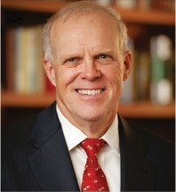
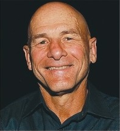

# references

### References

Abadi, M., Agarwal, A., Barham, P., Brevdo, E., Chen, Z., Citro, C., Corrado, G. S., Davis, A., Dean, J., Devin, M., Ghemawat, S., 2016. Tensor-flow: large- scale machine learning on heterogeneous distributed systems. arXiv preprint arXiv:1603.04467.

Adolf, R., Rama, S., Reagen, B., Wei, G.Y., Brooks, D., 2016. Fathom: reference workloads for modern deep learning methods. In: IEEE International Sympo- sium on Workload Characterization (IISWC).

Amodei, D., et al., 2015. Deep speech 2: end-to-end speech recognition in English and mandarin, arXiv:1512.02595.

Asanovi´c, K., 2002. Programmable neurocomputing. In: Arbib, M.A. (Ed.), The Handbook of Brain Theory and Neural Networks, second ed. MIT Press, Cam- bridge, MA. ISBN: 0-262-01197-2. [https://people.eecs.berkeley.edu/](https://people.eecs.berkeley.edu/~krste/papers/neurocomputing.pdf) [krste/](https://people.eecs.berkeley.edu/~krste/papers/neurocomputing.pdf) [papers/neurocomputing.pdf](https://people.eecs.berkeley.edu/~krste/papers/neurocomputing.pdf).

Asanovi´c, K., Beck, A., Johnson, J., Wawrzynek, J., Kingsbury, B., Morgan, N., 1998. Training neural networks with Spert-II. In: Sundararajan, N., Saratchan- dran, P. (Eds.), Parallel Architectures for Artificial Networks: Paradigms and Implementations. IEEE Computer Society Press. ISBN: 0-8186-8399-6. (Chapter 11) [https://people.eecs.berkeley.edu/](https://people.eecs.berkeley.edu/~krste/papers/annbook.pdf) [krste/papers/annbook.pdf](https://people.eecs.berkeley.edu/~krste/papers/annbook.pdf).

Bachrach, J., Vo, H., Richards, B., Lee, Y., Waterman, A., Avižienis, R., Wawrzynek, J., Asanovi´c, K., 2012. Chisel: constructing hardware in a Scala embedded language. In: Proceedings of the 49th Annual Design Automation Conference, pp. 1216–1225.

Barnes, G.H., Brown, R.M., Kato, M., Kuck, D.J., Slotnick, D.L., Stokes, R., 1968. The ILLIAC IV computer. IEEE Trans. Comput. 100 (8), 746–757.

Bhattacharya, S., Lane, N.D., 2016. Sparsification and separation of deep learning layers for constrained resource inference on wearables. In: Proceedings of the 14th ACM Conference on Embedded Network Sensor Systems CD-ROM,

pp. 176–189.

Brunhaver, J., 2014. PhD thesis. Stanford.

Canis, A., Choi, J., Aldham, M., Zhang, V., Kammoona, A., Czajkowski, T., Brown, S.D., Anderson, J.H., 2013. LegUp: an open-source high-level synthesis tool for FPGA-based processor/accelerator systems. ACM Trans. Embed. Com- put. Syst. 13 (2).

Canny, J., et al., 2015. Machine learning at the limit. In: IEEE International Con- ference on Big Data.

Caulfield, A.M., Chung, E.S., Putnam, A., Haselman, H.A.J.F.M., Humphrey, S.H.M., Daniel, P.K.J.Y.K., Ovtcharov, L.T.M.K., Lanka, M.P.L.W.S.,

Burger, D.C.D., 2016. A cloud-scale acceleration architecture. In: MICRO Conference.

Charlesworth, A.E., 1981. An approach to scientific array processing: the architec- tural design of the AP-120B/FPS-164 family. Computer 9, 18–27.

Clark, J., October 26, 2015. Google Turning Its Lucrative Web Search Over to AI Machines. Bloomberg Technology, [www.bloomberg.com](http://www.bloomberg.com/).

Dally, W.J., 2002. Computer architecture is all about interconnect. In: Proceed- ings of the 8th International Symposium High Performance Computer Architecture.

Freescale as part of i.MX31 Applications Processor, 2006. [http://cache.freescale.](http://cache.freescale.com/files/32bit/doc/white_paper/IMX31MULTIWP.pdf) [com/files/32bit/doc/white\_paper/IMX31MULTIWP.pdf](http://cache.freescale.com/files/32bit/doc/white_paper/IMX31MULTIWP.pdf).

Galal, S., Shacham, O., Brunhaver II, J.S., Pu, J., Vassiliev, A., Horowitz, M., 2013. FPU generator for design space exploration. In: 21st IEEE Symposium on Computer Arithmetic (ARITH).

Hameed, R., Qadeer, W., Wachs, M., Azizi, O., Solomatnikov, A., Lee, B.C., Richardson, S., Kozyrakis, C., Horowitz, M., 2010. Understanding sources of inefficiency in general-purpose chips. ACM SIGARCH Comput. Architect. News 38 (3), 37–47.

Hammerstrom, D., 1990. A VLSI architecture for high-performance, low-cost, on- chip learning. In: IJCNN International Joint Conference on Neural Networks. He, K., Zhang, X., Ren, S., Sun, J., 2016. Identity mappings in deep residual net-

works. Also in arXiv preprint arXiv:1603.05027.

Huang, M., Wu, D., Yu, C.H., Fang, Z., Interlandi, M., Condie, T., Cong, J., 2016. Programming and runtime support to blaze FPGA accelerator deployment at datacenter scale. In: Proceedings of the Seventh ACM Symposium on Cloud Computing. ACM, pp. 456–469.

Iandola, F., 2016. Exploring the Design Space of Deep Convolutional Neural Net- works at Large Scale (Ph.D. dissertation). UC Berkeley.

Ienne, P., Cornu, T., Kuhn, G., 1996. Special-purpose digital hardware for neural networks: an architectural survey. J. VLSI Signal Process. Syst. Signal Image Video Technol. 13 (1).

Jouppi, N., 2016. Google supercharges machine learning tasks with TPU custom chip. [https://cloudplatform.googleblog.com](https://cloudplatform.googleblog.com/).

Jouppi, N., Young, C., Patil, N., Patterson, D., Agrawal, G., et al., 2017. Datacenter performance analysis of a matrix processing unit. In: 44th International Sympo- sium on Computer Architecture.

Karpathy, A., et al., 2014. Large-scale video classification with convolutional neu- ral networks. CVPR.

Krizhevsky, A., Sutskever, I., Hinton, G., 2012. Imagenet classification with deep convolutional neural networks. Adv. Neural Inf. Process. Syst.

Kung, H.T., Leiserson, C.E., 1980. Algorithms for VLSI processor arrays. Intro- duction to VLSI systems.

Lee, Y., Waterman, A., Cook, H., Zimmer, B., Keller, B., Puggelli, A., Kwak, J., Jevtic, R., Bailey, S., Blagojevic, M., Chiu, P.-F., Avizienis, R., Richards, B., Bachrach, J., Patterson, D., Alon, E., Nikolic, B., Asanovic, K., 2016. An agile approach to building RISC-V microprocessors. IEEE Micro 36 (2), 8–20.

Lewis-Kraus, G., 2016. The Great A.I. Awakening. New York Times Magazine.

Nielsen, M., 2016. Neural Networks and Deep Learning. [http://](http://neuralnetworksanddeeplearning.com/) [neuralnetworksanddeeplearning.com/](http://neuralnetworksanddeeplearning.com/).

Nvidia, 2016. Tesla GPU Accelerators For Servers. [http://www.nvidia.com/object/](http://www.nvidia.com/object/teslaservers.html) [teslaservers.html](http://www.nvidia.com/object/teslaservers.html).

Olofsson, A., 2011. Debunking the myth of the $100 M ASIC. EE Times. [http://](http://www.eetimes.com/author.asp?section_id=36&doc_id=1266014) [www.eetimes.com/author.asp?section\_id](http://www.eetimes.com/author.asp?section_id=36&doc_id=1266014) [36&doc\_id](http://www.eetimes.com/author.asp?section_id=36&doc_id=1266014) [1266014](http://www.eetimes.com/author.asp?section_id=36&doc_id=1266014).

Ovtcharov, K., Ruwase, O., Kim, J.Y., Fowers, J., Strauss, K., Chung, E.S., 2015a. Accelerating deep convolutional neural networks using specialized hardware. Microsoft Research Whitepaper. [https://www.microsoft.com/en-us/research/](https://www.microsoft.com/en-us/research/publication/accelerating-deepconvolutional-neural-networks-using-specialized-hardware/) [publication/accelerating-deepconvolutional-neural-networks-using-specialized-](https://www.microsoft.com/en-us/research/publication/accelerating-deepconvolutional-neural-networks-using-specialized-hardware/) [hardware/](https://www.microsoft.com/en-us/research/publication/accelerating-deepconvolutional-neural-networks-using-specialized-hardware/).

Ovtcharov, K., Ruwase, O., Kim, J.Y., Fowers, J., Strauss, K., Chung, E.S., 2015b. Toward accelerating deep learning at scale using specialized hardware in the datacenter. In: 2015 IEEE Hot Chips 27 Symposium.

Patterson, D., Nikoli´c, B., 7/25/2015, Agile Design for Hardware, Parts I, II, and

III\. EE Times, [http://www.eetimes.com/author.asp?doc\_id](http://www.eetimes.com/author.asp?doc_id=1327239) [1327239](http://www.eetimes.com/author.asp?doc_id=1327239). Patterson, D.A., Ditzel, D.R., 1980. The case for the reduced instruction set com-

puter. ACM SIGARCH Comput. Architect. News 8 (6), 25–33.

Prabhakar, R., Koeplinger, D., Brown, K.J., Lee, H., De Sa, C., Kozyrakis, C., Olukotun, K., 2016. Generating configurable hardware from parallel patterns. In: Proceedingsofthe Twenty-First International Conference on Architectural Sup- port for Programming Languages and Operating Systems. ACM, pp. 651–665.

Putnam, A., Caulfield, A.M., Chung, E.S., Chiou, D., Constantinides, K., Demme, J., Esmaeilzadeh, H., Fowers, J., Gopal, G.P., Gray, J., Haselman, M., Hauck, S., Heil, S., Hormati, A., Kim, J.-Y., Lanka, S., Larus, J., Peterson, E., Pope, S., Smith, A., Thong, J., Xiao, P.Y., Burger, D., 2014. A reconfigurable fabric for accelerating large-scale datacenter services. In: 41st International Symposium on Computer Architecture.

Putnam, A., Caulfield, A.M., Chung, E.S., Chiou, D., Constantinides, K., Demme, J., Esmaeilzadeh, H., Fowers, J., Gopal, G.P., Gray, J., Haselman, M., Hauck, S., Heil, S., Hormati, A., Kim, J.-Y., Lanka, S., Larus, J., Peterson, E., Pope, S., Smith, A., Thong, J., Xiao, P.Y., Burger, D., 2015. A reconfigurable fabric for accelerating large-scale datacenter services. IEEE Micro. 35 (3).

Putnam, A., Caulfield, A.M., Chung, E.S., Chiou, D., Constantinides, K., Demme, J., Esmaeilzadeh, H., Fowers, J., Gopal, G.P., Gray, J., Haselman, M., Hauck, S., Heil, S., Hormati, A., Kim, J.-Y., Lanka, S., Larus, J., Peterson, E., Pope, S., Smith, A., Thong, J., Xiao, P.Y., Burger, D., 2016. A reconfigurable fabric for accelerating large-scale datacenter services. Commun. ACM.

Qadeer, W., Hameed, R., Shacham, O., Venkatesan, P., Kozyrakis, C., Horowitz, M.A., 2015. Convolution engine: balancing efficiency & flexibility in special- ized computing. Commun. ACM 58 (4).

Ragan-Kelley, J., Barnes, C., Adams, A., Paris, S., Durand, F., Amarasinghe, S., 2013. Halide: a language and compiler for optimizing parallelism, locality, and recomputation in image processing pipelines. ACM SIGPLAN Not. 48 (6), 519–530.

Ramacher, U., Beichter, J., Raab, W., Anlauf, J., Bruels, N., Hachmann, A., Wesseling, M., 1991. Design of a 1st generation neurocomputer. VLSI Design of Neural Networks. Springer, USA.

Rau, B.R., Fisher, J.A., 1993. Instruction-level parallelism. J. Supercomput. 235, Springer Science & Business Media.

Russakovsky, O., Deng, J., Su, H., Krause, J., Satheesh, S., Ma, S., Huang, Z., Karpathy, A., Khosla, A., Bernstein, M., Berg, A.C., 2015. Imagenet large scale visual recognition challenge. Int. J. Comput. Vis. 115 (3).

Sergio Guadarrama, 2015. BVLC googlenet. [https://github.com/BVLC/caffe/tree/](https://github.com/BVLC/caffe/tree/master/models/bvlc_googlenet) [master/models/bvlc\_googlenet](https://github.com/BVLC/caffe/tree/master/models/bvlc_googlenet).

Shao, Y.S., Brooks, D., 2015. Research infrastructures for hardware accelerators. Synth. Lect. Comput. Architect. 10 (4), 1–99.

Sharangpani, H., Arora, K., 2000. Itanium processor microarchitecture. IEEE Micro 20 (5), 24–43.

Silver, D., Huang, A., Maddison, C.J., Guez, A., Sifre, L., Van Den Driessche, G., Schrittwieser, J., Antonoglou, I., Panneershelvam, V., Lanctot, M., Dieleman, S., 2016. Mastering the game of Go with deep neural networks and tree search. Nature 529 (7587).

Smith, J.E., 1982. Decoupled access/execute computer architectures. In: Proceed- ings of the 11th International Symposium on Computer Architecture.

Sony/Toshiba, 1999. ‘Emotion Engine’ in PS2 (“IPU is basically an MPEG2 decoder…”). [http://www.cpu-collection.de/?l0](http://www.cpu-collection.de/?l0=co&l1=Sony&l2=Emotion%2BEngine) [co&l1](http://www.cpu-collection.de/?l0=co&l1=Sony&l2=Emotion%2BEngine) [Sony&l2](http://www.cpu-collection.de/?l0=co&l1=Sony&l2=Emotion%2BEngine) [Emotion](http://www.cpu-collection.de/?l0=co&l1=Sony&l2=Emotion%2BEngine)

[+Engine](http://www.cpu-collection.de/?l0=co&l1=Sony&l2=Emotion%2BEngine), [http://arstechnica.com/gadgets/2000/02/ee/3/](http://arstechnica.com/gadgets/2000/02/ee/3/).

Steinberg, D., 2015. Full-Chip Simulations, Keys to Success. In: Proceedings of the Synopsys Users Group (SNUG) Silicon Valley 2015.

Szegedy, C., Liu, W., Jia, Y., Sermanet, P., Reed, S., Anguelov, D., Erhan, D., Vanhoucke, V., Rabinovich, A., 2015. Going deeper with convolutions. In: Pro- ceedings of the IEEE Conference on Computer Vision and Pattern Recognition.

TensorFlow Tutorials, 2016. [https://www.tensorflow.org/versions/r0.12/tutorials/](https://www.tensorflow.org/versions/r0.12/tutorials/index.html) [index.html](https://www.tensorflow.org/versions/r0.12/tutorials/index.html).

Tung, L., 2016. Google Translate: ‘This landmark update is our biggest single leap in 10 years’, ZDNet. [http://www.zdnet.com/article/google-translate-this-](http://www.zdnet.com/article/google-translate-this-landmarkupdate-is-our-biggest-single-leap-in-10years/) [landmarkupdate-is-our-biggest-single-leap-in-10years/](http://www.zdnet.com/article/google-translate-this-landmarkupdate-is-our-biggest-single-leap-in-10years/).

Vanhoucke, V., Senior, A., Mao, M.Z., 2011. Improving the speed of neural net- works on CPUs. [https://static.googleusercontent.com/media/research.google.](https://static.googleusercontent.com/media/research.google.com/en//pubs/archive/37631.pdf) [com/en//pubs/archive/37631.pdf](https://static.googleusercontent.com/media/research.google.com/en//pubs/archive/37631.pdf).

Wu, Y., Schuster, M., Chen, Z., Le, Q., Norouzi, M., Macherey, W., Krikun, M.,

Cao, Y., Gao, Q., Macherey, K., Klingner, J., Shah, A., Johnson, M., Liu, X.,

Kaiser, Ł., Gouws, S., Kato, Y., Kudo, T., Kazawa, H., Stevens, K., Kurian, G.,

Patil, N., Wang, W., Young, C., Smith, J., Riesa, J., Rudnick, A., Vinyals, O., Corrado, G., Hughes, M., Dean, J., 2016. Google’s Neural Machine Translation System: Bridging the Gap between Human and Machine Translation. [http://](http://arxiv.org/abs/1609.08144) [arxiv.org/abs/1609.08144](http://arxiv.org/abs/1609.08144).

## The History of Magnetic Storage, RAID, and I/O Buses (Appendix D)

*Mass storage is a term used there to imply a unit capacity in excess of one million alphanumeric characters* …

Hoagland \[1963\]

The variety of storage I/O and issues leads to a varied history for the rest of the story. (Smotherman \[1989\] explored the history of I/O in more depth.) This section discusses magnetic storage, RAID, and I/O buses and controllers. Jain \[1991\] and Lazowska et al. \[1984\] are books for those interested in learning more about queuing theory.

### Magnetic Storage

Magnetic recording was invented to record sound, and by 1941 magnetic tape was able to compete with other storage devices. It was the success of the ENIAC in 1947 that led to the push to use tapes to record digital information. Reels of mag- netic tapes dominated removable storage through the 1970s. In the 1980s, the IBM 3480 cartridge became the *de facto* standard, at least for mainframes. It can transfer at 3 MB/sec by reading 18 tracks in parallel. The capacity is just 200 MB for this 1/ 2-inch tape. The 9840 cartridge, used by StorageTek in the Powder-Horn, transfers at 10 MB/sec and stores 20,000 MB. This device records the tracks in a zigzag fashion rather than just longitudinally, so that the head reverses direction to follow the track. This technique is called *serpentine recording*. Another 1/2-inch tape is Digital Linear Tape; the DLT7000 stores 35,000 MB and transfers at 5 MB/sec. Its competitor is helical scan, which rotates the head to get the increased recording density. In 2001, the 8-mm helical-scan tapes contain 20,000 MB and transfer at about 3 MB/sec. Whatever their density and cost, the serial nature of tapes cre- ates an appetite for storage devices with random access.

In 1953, Reynold B. Johnson of IBM picked a staff of 15 scientists with the goal of building a radically faster random access storage system than tape. The goal was to have the storage equivalent of 50,000 standard IBM punch cards and to fetch the data in a single second. Johnson’s disk drive design was simple but untried: The magnetic read/write sensors would have to float a few thousandths of an inch above the continuously rotating disk. Twenty-four months later the team emerged with the functional prototype. It weighed 1 ton and occupied about 300 cubic feet of space. The RAMAC-350 (Random Access Method of Accounting Control) used 50 platters that were 24 inches in diameter, rotated at 1200 RPM, with a total capacity of 5 MB and an access time of 1 second.

Starting with the RAMAC, IBM maintained its leadership in the disk industry, with its storage headquarters in San Jose, California, where Johnson’s team did its work. Many of the future leaders of competing disk manufacturers started their careers at IBM, and many disk companies are located near San Jose.

Although RAMAC contained the first disk, a major breakthrough in magnetic recording was found in later disks with air-bearing read/write heads, where the head would ride on a cushion of air created by the fast-moving disk surface. This cushion meant the head could both follow imperfections in the surface and yet be very close to the surface. Subsequent advances have come largely from improved quality of components and higher precision. In 2001, heads flew 2 to 3 microinches above the surface, whereas in the RAMAC drive they were 1000 microinches away.

Moving-head disks quickly became the dominant high-speed magnetic stor- age, although their high cost meant that magnetic tape continued to be used extensively until the 1970s. The next important development for hard disks was the removable hard disk drive developed by IBM in 1962; this made it possible to share the expensive drive electronics and helped disks overtake tapes as the pre- ferred storage medium. The IBM 1311 disk in 1962 had an areal density of 50,000

bits per square inch and a cost of about $800 per megabyte. IBM also invented the floppy disk drive in 1970, originally to hold microcode for the IBM 370 series. Floppy disks became popular with the PC about 10 years later.

The second major disk breakthrough was the so-called Winchester disk design in about 1973. Winchester disks benefited from two related properties. First, inte- grated circuits lowered the costs of not only CPUs but also of disk controllers and the electronics to control disk arms. Reductions in the cost of the disk electronics made it unnecessary to share the electronics and thus made nonremovable disks economical. Since the disk was fixed and could be in a sealed enclosure, both the environmental and control problems were greatly reduced. Sealing the system allowed the heads to fly closer to the surface, which in turn enabled increases in areal density. The first sealed disk that IBM shipped had two spindles, each with a 30 MB disk; the moniker “30-30” for the disk led to the name Winchester. (America’s most popular sporting rifle, the Winchester 94, was nicknamed the “30-30” after the caliber of its cartridge.) Winchester disks grew rapidly in popu- larity in the 1980s, completely replacing removable disks by the middle of that decade. Before this time, the cost of the electronics to control the disk meant that the media had to be removable.

As mentioned in Appendix D, as DRAMs started to close the areal density gap and appeared to be catching up with disk storage, internal meetings at IBM called into question the future of disk drives. Disk designers concluded that disks must improve at 60% per year to forestall the DRAM threat, in contrast to the historical 29% per year. The essential enabler was magnetoresistive heads, with giant magnetoresistive heads enabling the current densities. Because of this competition, the gap in time between when a density record is achieved in the lab and when a disk is shipped with that density has closed considerably.

The personal computer created a market for small form factor (SFF) disk drives, since the 14-inch disk drives used in mainframes were bigger than the PC. In 2006, the 3.5-inch drive was the market leader, although the smaller 2.5-inch drive required for laptop computers was significant in sales volume. It remains to be seen whether handheld devices such as iPODs or video cameras, which require even smaller disks, will remain significant in sales volume. For example, 1.8-inch drives were developed in the early 1990s for palmtop com- puters, but that market chose Flash instead and 1.8-inch drives disappeared.

### RAID

The SFF hard disks for PCs in the 1980s led a group at Berkeley to propose redun- dant arrays of inexpensive disks (RAID). This group had worked on the reduced instruction set computer effort and so expected much faster CPUs to become avail- able. They asked: What could be done with the small disks that accompanied their PCs? and What could be done in the area of I/O to keep up with much faster pro- cessors? They argued to replace one mainframe drive with 50 small drives to gain much greater performance from that many independent arms. The many small

drives even offered savings in power consumption and floor space. The downside of many disks was much lower mean time to failure (MTTF). Hence, on their own they reasoned out the advantages of redundant disks and rotating parity to address how to get greater performance with many small drives yet have reliability as high as that of a single mainframe disk.

The problem they experienced when explaining their ideas was that some researchers had heard of disk arrays with some form of redundancy, and they didn’t understand the Berkeley proposal. Hence, the first RAID paper \[Patterson, Gibson, and Katz 1987\] is not only a case for arrays of SFF disk drives but also something of a tutorial and classification of existing work on disk arrays. Mirroring (RAID 1) had long been used in fault-tolerant computers such as those sold by Tandem. Thinking Machines had arrays with 32 data disks and 7 check disks using ECC for correction (RAID 2) in 1987, and Honeywell Bull had a RAID 2 product even earlier. Also, disk arrays with a single parity disk had been used in scientific com- puters in the same time frame (RAID 3). Their paper then described a single parity disk with support for sector accesses (RAID 4) and rotated parity (RAID 5). Chen et al. \[1994\] surveyed the original RAID ideas, commercial products, and more recent developments.

Unknown to the Berkeley group, engineers at IBM working on the AS/400 computer also came up with rotated parity to give greater reliability for a collection of large disks. IBM filed a patent on RAID 5 before the Berkeley group wrote their paper. Patents for RAID 1, RAID 2, and RAID 3 from several companies predate the IBM RAID 5 patent, which has led to plenty of courtroom action.

The Berkeley paper was written before the World Wide Web, but it captured the imagination of many engineers, as copies were faxed around the world. One engineer at what is now Seagate received seven copies of the paper from friends and customers. EMC had been a supplier of DRAM boards for IBM computers, but around 1988 new policies from IBM made it nearly impossible for EMC to con- tinue to sell IBM memory boards. Apparently, the Berkeley paper also crossed the desks of EMC executives, and they decided to go after the market dominated by IBM disk storage products instead. As the paper advocated, their model was to use many small drives to compete with mainframe drives, and EMC announced a RAID product in 1990. It relied on mirroring (RAID 1) for reliability; RAID 5 products came much later for EMC. Over the next year, Micropolis offered a RAID 3 product, Compaq offered a RAID 4 product, and Data General, IBM, and NCR offered RAID 5 products.

The RAID ideas soon spread to the rest of the workstation and server industry. An article explaining RAID in *Byte* magazine (see Anderson \[1990\]) led to RAID products being offered on desktop PCs, which was something of a surprise to the Berkeley group. They had focused on performance with good availability, but higher availability was attractive to the PC market.

Another surprise was the cost of the disk arrays. With redundant power sup- plies and fans, the ability to “hot swap” a disk drive, the RAID hardware controller itself, the redundant disks, and so on, the first disk arrays cost many times the cost of the disks. Perhaps as a result, the “inexpensive” in RAID morphed into

“independent.” Many marketing departments and technical writers today know of RAID only as “redundant arrays of independent disks.”

The EMC transformation was successful; in 2006, EMC was the leading supplier of storage systems, and NetApp was the leading supplier of Network- Attached Storage systems. RAID was a $30 billion industry in 2006, and more than 80% of the non-PC drive sales were found in RAIDs. In recognition of their role, in 1999 Garth Gibson, Randy Katz, and David Patterson received the IEEE Reynold

B. Johnson Information Storage Award “for the development of Redundant Arrays of Inexpensive Disks (RAID).”

### I/O Buses and Controllers

The ubiquitous microprocessor inspired not only the personal computers of the 1970s but also the trend in the late 1980s and 1990s of moving controller functions into I/O devices. I/O devices have continued this trend by moving controllers into the devices themselves. These devices are called *intelligent devices*, and some bus standards (e.g., SCSI) have been created specifically for them. Intelligent devices can relax the timing constraints by handling many low-level tasks themselves and queuing the results. For example, many SCSI-compatible disk drives include a track buffer on the disk itself, supporting read ahead and connect/disconnect. Thus, on a SCSI string some disks can be seeking and others loading their track buffer while one is transferring data from its buffer over the SCSI bus. The controller in the original RAMAC, built from vacuum tubes, only needed to move the head over the desired track, wait for the data to pass under the head, and transfer data with calculated parity. SCSI, which stands for *small computer systems interface*, is an example of one company inventing a bus and generously encouraging other com- panies to build devices that would plug into it. Shugart created this bus, originally called SASI. It was later standardized by the IEEE.

There have been several candidates to be the successor to SCSI, with the cur- rent leading contender being Fibre Channel Arbitrated Loop (FC-AL). The SCSI committee continues to increase the clock rate of the bus, giving this standard a new life, and SCSI is lasting much longer than some of its proposed successors. With the creation of serial interfaces for SCSI (“Serial Attach SCSI”) and ATA (“Serial ATA”), they may have very long lives.

Perhaps the first multivendor bus was the PDP-11 Unibus in 1970 from DEC. Alas, this open-door policy on buses is in contrast to companies with proprietary buses using patented interfaces, thereby preventing competition from plug- compatible vendors. Making a bus proprietary also raises costs and lowers the number of available I/O devices that plug into it, since such devices must have an interface designed just for that bus. The PCI bus pushed by Intel represented a return to open, standard I/O buses inside computers. Its immediate successor is PCI-X, with Infiniband under development in 2000. Both were standardized by multicompany trade associations.

The machines of the RAMAC era gave us I/O interrupts as well as storage devices. The first machine to extend interrupts from detecting arithmetic abnor- malities to detecting asynchronous I/O events is credited as the NBS DYSEAC in 1954 \[Leiner and Alexander 1954\]. The following year, the first machine with DMA was operational, the IBM SAGE. Just as today’s DMA has, the SAGE had address counters that performed block transfers in parallel with CPU operations.

The early IBM 360s pioneered many of the ideas that we use in I/O systems today. The 360 was the first commercial machine to make heavy use of DMA, and it introduced the notion of I/O programs that could be interpreted by the device. Chaining of I/O programs was an important feature. The concept of channels intro- duced in the 360 corresponds to the I/O bus of today.

Myer and Sutherland \[1968\] wrote a classic paper on the trade-off of complex- ity and performance in I/O controllers. Borrowing the religious concept of the “wheel of reincarnation,” they eventually noticed they were caught in a loop of continuously increasing the power of an I/O processor until it needed its own simpler coprocessor. Their quote in Appendix D captures their cautionary tale.

The IBM mainframe I/O channels, with their I/O processors, can be thought of as an inspiration for Infiniband, with their processors on their Host Channel Adaptor cards.

### References

Anderson, D. \[2003\]. “You don’t know jack about disks,” *Queue* 1:4 (June), 20–30.

Anderson, D., J. Dykes, and E. Riedel \[2003\]. “SCSI vs. ATA—more than an interface,” *Proc. 2nd USENIX Conf. on File and Storage Technology (FAST* ’*03)*, March 31–April 2, 2003, San Francisco.

Anderson, M. H. \[1990\]. “Strength (and safety) in numbers (RAID, disk storage technology),” *Byte* 15:13 (December), 337–339.

Anon. et al. \[1985\]. *A Measure of Transaction Processing Power*, Tandem Tech. Rep. TR 85.2. Also appeared in *Datamation*, 31:7 (April), 112–118.

Bashe, C. J., W. Buchholz, G. V. Hawkins, J. L. Ingram, and N. Rochester \[1981\]. “The architecture of IBM’s early computers,” *IBM J. Research and Develop- ment* 25:5 (September), 363–375.

Bashe, C. J., L. R. Johnson, J. H. Palmer, and E. W. Pugh \[1986\]. *IBM*’*s Early Computers*, MIT Press, Cambridge, Mass.

Blaum, M., J. Brady, J. Bruck, and J. Menon \[1994\]. “EVENODD: An optimal scheme for tolerating double disk failures in RAID architectures,” *Proc. 21st Annual Int*’*l. Symposium on Computer Architecture (ISCA)*, April 18–21, 1994, Chicago, 245–254.

Blaum, M., J. Brady, J. Bruck, and J. Menon \[1995\]. “EVENODD: An optimal scheme for tolerating double disk failures in RAID architectures,” *IEEE Trans. on Computers* 44:2 (February), 192–202.

Blaum, M., J. Brady, J., Bruck, J. Menon, and A. Vardy \[2001\]. “The EVENODD code and its generalization,” in H. Jin, T. Cortes, and R. Buyya, eds., *High Per- formance Mass Storage and Parallel I/O: Technologies and Applications*, IEEE & Wiley Press, New York, 187–208.

Blaum, M., J. Bruck, and A. Vardy \[1996\]. “MDS array codes with independent parity symbols,” *IEEE Trans. on Information Theory*, IT-42 (March), 529–542.

Brady, J. T. \[1986\]. “A theory of productivity in the creative process,” *IEEE CG&A* (May), 25–34.

Brown, A., and D. A. Patterson \[2000\]. “Towards maintainability, availability, and growth benchmarks: A case study of software RAID systems.” *Proc. 2000 USE- NIX Annual Technical Conf.*, June 18–23, San Diego, Calif.

Bucher, I. V., and A. H. Hayes \[1980\]. “I/O performance measurement on Cray-1 and CDC 7000 computers,” *Proc. Computer Performance Evaluation Users Group, 16th Meeting*, October 20–23, 1980, Orlando, Fl., 245–254.

Chen, P. M., G. A. Gibson, R. H. Katz, and D. A. Patterson \[1990\]. “An evaluation of redundant arrays of inexpensive disks using an Amdahl 5890,” *Proc. ACM SIGMETRICS Conf. on Measurement and Modeling of Computer Systems*, May 22–25, 1990, Boulder, Colo.

Chen, P. M., and E. K. Lee \[1995\]. “Striping in a RAID level 5 disk array,” *Proc. ACM SIGMETRICS Conf. on Measurement and Modeling of Computer Systems*, May 15–19, 1995, Ottawa, Canada, 136–145.

Chen, P. M., E. K. Lee, G. A. Gibson, R. H. Katz, and D. A. Patterson \[1994\]. “RAID: High-performance, reliable secondary storage,” *ACM Computing Sur- veys* 26:2 (June), 145–188.

Corbett, P., B. English, A. Goel, T. Grcanac, S. Kleiman, J. Leong, and S. Sankar \[2004\]. “Row-diagonal parity for double disk failure correction,” *Proc. 3rd USENIX Conf. on File and Storage Technology (FAST* ’*04)*, March 31–April 2, 2004, San Francisco.

Denehy, T. E., J. Bent, F. I. Popovici, A. C. Arpaci-Dusseau, and R. H. Arpaci- Dusseau \[2004\]. “Deconstructing storage arrays,” *Proc. 11th Int*’*l. Conf. on Architectural Support for Programming Languages and Operating Systems (ASPLOS)*, October 7–13, 2004, Boston, Mass., 59–71.

Doherty, W. J., and R. P. Kelisky \[1979\]. “Managing VM/CMS systems for user effectiveness,” *IBM Systems J.* 18:1, 143–166.

Douceur, J. R., and W. J. Bolosky \[1999\]. “A large scale study of file-system con- tents,” *Proc. ACM SIGMETRICS Conf. on Measurement and Modeling of Com- puter Systems*, May 1–9, 1999, Atlanta, Ga., 59–69.

Enriquez, P. \[2001\]. “What happened to my dial tone? A study of FCC service disruption reports,” poster, *Richard Tapia Symposium on the Celebration of Diversity in Computing*, October 18–20, 2001, Houston, Tex.

Friesenborg, S. E., and R. J. Wicks \[1985\]. *DASD Expectations: The 3380, 3380- 23, and MVS/XA*, Tech. Bulletin GG22-9363-02, IBM Washington Systems Center, Gaithersburg, Md.

Gibson, G. A. \[1992\]. *Redundant Disk Arrays: Reliable, Parallel Secondary Stor- age*, ACM Distinguished Dissertation Series, MIT Press, Cambridge, Mass. Goldstein, S. \[1987\]. *Storage Performance*—*An Eight Year Outlook*, Tech. Rep.

TR 03.308-1, IBM Santa Teresa Laboratory, San Jose, Calif.

Gray, J. \[1990\]. “A census of Tandem system availability between 1985 and 1990,” *IEEE Trans. on Reliability*, 39:4 (October), 409–418.

Gray, J. (ed.) \[1993\]. *The Benchmark Handbook for Database and Transaction Processing Systems*, 2nd ed., Morgan Kaufmann, San Francisco.

Gray, J., and A. Reuter \[1993\]. *Transaction Processing: Concepts and Tech- niques*, Morgan Kaufmann, San Francisco.

Gray, J., and D. P. Siewiorek \[1991\]. “High-availability computer systems.” *Com- puter* 24:9 (September), 39–48.

Gray, J., and C. van Ingen \[2005\]. *Empirical Measurements of Disk Failure Rates and Error Rates*,” MSR-TR-2005-166, Microsoft Research, Redmond, Wash. Gurumurthi, S., A. Sivasubramaniam, and V. Natarajan \[2005\]. Disk Drive Road- map from the Thermal Perspective: A Case for Dynamic Thermal Management, *Proceedings of the International Symposium on Computer Architecture (ISCA)*,

June, 38–49.

Henly, M., and B. McNutt \[1989\]. *DASD I/O Characteristics: A Comparison of MVS to VM*, Tech. Rep. TR 02.1550, IBM General Products Division, San Jose, Calif.

Hewlett-Packard. \[1998\]. “HP’s ‘5NINES:5MINUTES’ vision extends leadership and re-defines high availability in mission-critical environments,” February 10, *[www.future.enterprisecomputing.hp.com/ia64/news/5nines\_vision\_pr.html](http://www.future.enterprisecomputing.hp.com/ia64/news/5nines_vision_pr.html).*

Hoagland, A. S. \[1963\]. *Digital Magnetic Recording*, Wiley, New York. Hospodor, A. D., and A. S. Hoagland \[1993\]. “The changing nature of disk con-

trollers.” *Proc. IEEE* 81:4 (April), 586–594.

IBM. \[1982\]. *The Economic Value of Rapid Response Time*, GE20-0752-0, IBM, White Plains, N.Y., 11–82.

Imprimis. \[1989\]. *Imprimis Product Specification, 97209 Sabre Disk Drive IPI-2 Interface 1.2 GB*, Document No. 64402302, Imprimis, Dallas, Tex.

Jain, R. \[1991\]. *The Art of Computer Systems Performance Analysis: Techniques for Experimental Design, Measurement, Simulation, and Modeling*, Wiley, New York. Katz, R. H., D. A. Patterson, and G. A. Gibson \[1989\]. “Disk system architectures for high performance computing,” *Proc. IEEE* 77:12 (December), 1842–1858. Kim, M. Y. \[1986\]. “Synchronized disk interleaving,” *IEEE Trans. on Computers*

C-35:11 (November), 978–988.

Kuhn, D. R. \[1997\]. “Sources of failure in the public switched telephone network,”

*IEEE Computer* 30:4 (April), 31–36.

Lambright, D. \[2000\]. “Experiences in measuring the reliability of a cache-based storage system,” *Proc. of First Workshop on Industrial Experiences with Sys- tems Software (WIESS 2000), Co-Located with the 4th Symposium on Operating Systems Design and Implementation (OSDI)*, October 22, 2000, San Diego, Calif.

Laprie, J.-C. \[1985\]. “Dependable computing and fault tolerance: Concepts and terminology,” *Proc. 15th Annual Int*’*l. Symposium on Fault-Tolerant Comput- ing*, June 19–21, 1985, Ann Arbor, Mich., 2–11.

Lazowska, E. D., J. Zahorjan, G. S. Graham, and K. C. Sevcik \[1984\]. *Quantitative System Performance: Computer System Analysis Using Queueing Network Models*, Prentice Hall, Englewood Cliffs, N.J. (Although out of print, it is avail- able online at *[www.cs.washington.edu/homes/lazowska/qsp/](http://www.cs.washington.edu/homes/lazowska/qsp/).)*

Leiner, A. L. \[1954\]. “System specifications for the DYSEAC,” *J. ACM* 1:2 (April), 57–81.

Leiner, A. L., and S. N. Alexander \[1954\]. “System organization of the DYSEAC,”

*IRE Trans. of Electronic Computers* EC-3:1 (March), 1–10.

Maberly, N. C. \[1966\]. *Mastering Speed Reading*, New American Library, New York.

Major, J. B. \[1989\]. “Are queuing models within the grasp of the unwashed?” *Proc. Int*’*l. Conf. on Management and Performance Evaluation of Computer Systems*, December 11–15, 1989, Reno, Nev., 831–839.

Mueller, M., L. C. Alves, W. Fischer, M. L. Fair, and I. Modi \[1999\]. “RAS strat- egy for IBM S/390 G5 and G6,” *IBM J. Research and Development*, 43:5–6 (September–November), 875–888.

Murphy, B., and T. Gent \[1995\]. “Measuring system and software reliability using an automated data collection process,” *Quality and Reliability Engineering International*, 11:5 (September–October), 341–353.

Myer, T. H., and I. E. Sutherland \[1968\]. “On the design of display processors,”

*Communications of the ACM*, 11:6 (June), 410–414.

National Storage Industry Consortium. \[1998\]. “Tape Roadmap,” *[www.nsic.org](http://www.nsic.org/).*

Nelson, V. P. \[1990\]. “Fault-tolerant computing: Fundamental concepts,” *Com- puter* 23:7 (July), 19–25.

Nyberg, C. R., T. Barclay, Z. Cvetanovic, J. Gray, and D. Lomet \[1994\]. “Alpha- Sort: A RISC machine sort,” *Proc. ACM SIGMOD*, May 24–27, 1994, Minneapolis, Minn.

Okada, S., S. Okada, Y. Matsuda, T. Yamada, and A. Kobayashi \[1999\]. “System on a chip for digital still camera,” *IEEE Trans. on Consumer Electron- ics* 45:3 (August), 584–590.

Patterson, D. A., G. A. Gibson, and R. H. Katz \[1987\]. *A Case for Redundant Arrays of Inexpensive Disks (RAID)*, Tech. Rep. UCB/CSD 87/391, University of California, Berkeley. Also appeared in *Proc. ACM SIGMOD*, June 1–3, 1988, Chicago, 109–116.

Pavan, P., R. Bez, P. Olivo, and E. Zanoni \[1997\]. “Flash memory cells—an over- view,” *Proc. IEEE* 85:8 (August), 1248–1271.

Robinson, B., and L. Blount \[1986\]. *The VM/HPO 3880-23 Performance Results*, IBM Tech. Bulletin GG66-0247-00, IBM Washington Systems Center, Gaithersburg, Md.

Salem, K., and H. Garcia-Molina \[1986\]. “Disk striping,” *Proc. 2nd Int*’*l. IEEE Conf. on Data Engineering*, February 5–7, 1986, Washington, D.C., 249–259.

Scranton, R. A., D. A. Thompson, and D. W. Hunter \[1983\]. *The Access Time Myth*, Tech. Rep. RC 10197 (45223), IBM, Yorktown Heights, N.Y.

Seagate. \[2000\]. *Seagate Cheetah 73 Family: ST173404LW/LWV/LC/LCV Prod- uct Manual*, Vol. 1, Seagate, Scotts Valley, Calif. (*[www.seagate.com/support/](http://www.seagate.com/support/disc/manuals/scsi/29478b.pdf) [disc/manuals/scsi/29478b.pdf](http://www.seagate.com/support/disc/manuals/scsi/29478b.pdf)*).

Smotherman, M. \[1989\]. “A sequencing-based taxonomy of I/O systems and review of historical machines,” *Computer Architecture News* 17:5 (September), 5–15. Reprinted in *Computer Architecture Readings*, M. D. Hill, N. P. Jouppi, and G. S. Sohi, eds., Morgan Kaufmann, San Francisco, 1999, 451–461.

Talagala, N. \[2000\]. “Characterizing Large Storage Systems: Error Behavior and Performance Benchmarks,” Ph.D. dissertation, Computer Science Division, University of California, Berkeley.

Talagala, N., and D. Patterson \[1999\]. *An Analysis of Error Behavior in a Large Storage System*, Tech. Report UCB//CSD-99-1042, Computer Science Divi- sion, University of California, Berkeley.

Talagala, N., R. Arpaci-Dusseau, and D. Patterson \[2000\]. *Micro-Benchmark Based Extraction of Local and Global Disk Characteristics*, CSD-99-1063, Computer Science Division, University of California, Berkeley.

Talagala, N., S. Asami, D. Patterson, R. Futernick, and D. Hart \[2000\]. “The art of massive storage: A case study of a Web image archive,” *IEEE Computer* (November), 22–28.

Thadhani, A. J. \[1981\]. “Interactive user productivity,” *IBM Systems J.* 20:4, 407– 423.

Abadi, M., Barham, P., Chen, J., Chen, Z., Davis, A., Dean, J., Devin, M., Ghemawat, S., Irving, G., Isard, M., Kudlur, M., 2016. TensorFlow: A System for Large-Scale Machine Learning. In: OSDI (November), vol. 16, pp. 265–283.

[Adolf, R., Rama, S., Reagen, B., Wei, G.Y., Brooks, D., 2016. Fathom: reference workloads](http://refhub.elsevier.com/B978-0-12-811905-1.09994-6/rf0010) [for modern deep learning methods. In: IEEE International Symposium on Workload](http://refhub.elsevier.com/B978-0-12-811905-1.09994-6/rf0010) [Characterization (IISWC).](http://refhub.elsevier.com/B978-0-12-811905-1.09994-6/rf0010)

[Adve, S.V., Gharachorloo, K., 1996. Shared memory consistency models: a tutorial. IEEE](http://refhub.elsevier.com/B978-0-12-811905-1.09994-6/rf0015) [Comput. 29 (12), 66–76.](http://refhub.elsevier.com/B978-0-12-811905-1.09994-6/rf0015)

[Adve, S.V., Hill, M.D., 1990. Weak ordering: a new definition. In: Proceedings of 17th](http://refhub.elsevier.com/B978-0-12-811905-1.09994-6/rf0020) [Annual International Symposium on Computer Architecture (ISCA), May 28–31,](http://refhub.elsevier.com/B978-0-12-811905-1.09994-6/rf0020) [1990, Seattle, Washington, pp. 2–14.](http://refhub.elsevier.com/B978-0-12-811905-1.09994-6/rf0020)

Agarwal, A., 1987. Analysis of Cache Performance for Operating Systems and Multipro- gramming (Ph.D. thesis). Tech. Rep. No. CSL-TR-87-332. Stanford University, Palo Alto, CA.

[Agarwal, A., 1991. Limits on interconnection network performance. IEEE Trans. Parallel](http://refhub.elsevier.com/B978-0-12-811905-1.09994-6/rf0025) [Distrib. Syst. 2 (4), 398–412.](http://refhub.elsevier.com/B978-0-12-811905-1.09994-6/rf0025)

[Agarwal, A., Pudar, S.D., 1993. Column-associative caches: a technique for reducing the](http://refhub.elsevier.com/B978-0-12-811905-1.09994-6/rf0030) [miss rate of direct-mapped caches. In: 20th Annual International Symposium on Com-](http://refhub.elsevier.com/B978-0-12-811905-1.09994-6/rf0030) [puter Architecture (ISCA), May 16–19, 1993, San Diego, California. Also appears in](http://refhub.elsevier.com/B978-0-12-811905-1.09994-6/rf0030) [Computer Architecture News 21:2 (May), 179–190, 1993.](http://refhub.elsevier.com/B978-0-12-811905-1.09994-6/rf0030)

[Agarwal, A., Hennessy, J.L., Simoni, R., Horowitz, M.A., 1988. An evaluation of directory](http://refhub.elsevier.com/B978-0-12-811905-1.09994-6/rf0035) [schemes for cache coherence. In: Proceedings of 15th International Symposium on](http://refhub.elsevier.com/B978-0-12-811905-1.09994-6/rf0035) [Computer Architecture (June), pp. 280–289.](http://refhub.elsevier.com/B978-0-12-811905-1.09994-6/rf0035)

[Agarwal, A., Kubiatowicz, J., Kranz, D., Lim, B.-H., Yeung, D., D’Souza, G., Parkin, M.,](http://refhub.elsevier.com/B978-0-12-811905-1.09994-6/rf0040) [1993. Sparcle: an evolutionary processor design for large-scale multiprocessors. IEEE](http://refhub.elsevier.com/B978-0-12-811905-1.09994-6/rf0040) [Micro 13, 48–61.](http://refhub.elsevier.com/B978-0-12-811905-1.09994-6/rf0040)

[Agarwal, A., Bianchini, R., Chaiken, D., Johnson, K., Kranz, D., 1995. The MIT Alewife](http://refhub.elsevier.com/B978-0-12-811905-1.09994-6/rf0045) [machine: architecture and performance. In: International Symposium on Computer](http://refhub.elsevier.com/B978-0-12-811905-1.09994-6/rf0045) [Architecture (Denver, CO), June, 2–13.](http://refhub.elsevier.com/B978-0-12-811905-1.09994-6/rf0045)

Agerwala, T., Cocke, J., 1987. High Performance Reduced Instruction Set Processors. IBM Tech. Rep. RC12434, IBM, Armonk, NY.

[Akeley, K., Jermoluk, T., 1988. High-performance polygon rendering. In: Proceedings of](http://refhub.elsevier.com/B978-0-12-811905-1.09994-6/rf0050) [15th Annual Conference on Computer Graphics and Interactive Techniques](http://refhub.elsevier.com/B978-0-12-811905-1.09994-6/rf0050) [(SIGGRAPH 1988), August 1–5, 1988, Atlanta, GA, pp. 239–246.](http://refhub.elsevier.com/B978-0-12-811905-1.09994-6/rf0050)

[Alexander, W.G., Wortman, D.B., 1975. Static and dynamic characteristics of XPL](http://refhub.elsevier.com/B978-0-12-811905-1.09994-6/rf0055) [programs. IEEE Comput. 8 (11), 41–46.](http://refhub.elsevier.com/B978-0-12-811905-1.09994-6/rf0055)

Alles, A., 1995. ATM Internetworking. White Paper (May). Cisco Systems, Inc., San Jose, CA. [www.cisco.com/warp/public/614/12.html](http://www.cisco.com/warp/public/614/12.html).

[Alliant, 1987. Alliant FX/Series: Product Summary. Alliant Computer Systems Corp,](http://refhub.elsevier.com/B978-0-12-811905-1.09994-6/rf0065) [Acton, MA.](http://refhub.elsevier.com/B978-0-12-811905-1.09994-6/rf0065)

[Almasi, G.S., Gottlieb, A., 1989. Highly Parallel Computing. Benjamin/Cummings,](http://refhub.elsevier.com/B978-0-12-811905-1.09994-6/rf0070) [Redwood City, CA.](http://refhub.elsevier.com/B978-0-12-811905-1.09994-6/rf0070)

R-1

[Alverson, G., Alverson, R., Callahan, D., Koblenz, B., Porterfield, A., Smith, B., 1992.](http://refhub.elsevier.com/B978-0-12-811905-1.09994-6/rf0075) [Exploiting heterogeneous parallelism on a multithreaded multiprocessor.](http://refhub.elsevier.com/B978-0-12-811905-1.09994-6/rf0075) [In: Proceedings of ACM/IEEE Conference on Supercomputing, November 16–20,](http://refhub.elsevier.com/B978-0-12-811905-1.09994-6/rf0075) [1992, Minneapolis, MN, pp. 188–197.](http://refhub.elsevier.com/B978-0-12-811905-1.09994-6/rf0075)

[Amdahl, G.M., 1967. Validity of the single processor approach to achieving large scale](http://refhub.elsevier.com/B978-0-12-811905-1.09994-6/rf0080) [computing capabilities. In: Proceedings of AFIPS Spring Joint Computer Conference,](http://refhub.elsevier.com/B978-0-12-811905-1.09994-6/rf0080) [April 18–20, 1967, Atlantic City, NJ, pp. 483–485.](http://refhub.elsevier.com/B978-0-12-811905-1.09994-6/rf0080)

[Amdahl, G.M., Blaauw, G.A., Brooks Jr., F.P., 1964. Architecture of the IBM System 360.](http://refhub.elsevier.com/B978-0-12-811905-1.09994-6/rf0085)

[IBM J. Res. Dev. 8 (2), 87–101.](http://refhub.elsevier.com/B978-0-12-811905-1.09994-6/rf0085)

Amodei, D., Ananthanarayanan, S., Anubhai, R., Bai, J., Battenberg, E., Case, C., Casper, J., Catanzaro, B., Cheng, Q., Chen, G., Chen, J., 2016. Deep speech 2: End- to-end speech recognition in english and mandarin. In: International Conference on Machine Learning (June), pp. 173–182.

[Amza, C., Cox, A.L., Dwarkadas, S., Keleher, P., Lu, H., Rajamony, R., Yu, W.,](http://refhub.elsevier.com/B978-0-12-811905-1.09994-6/rf0090) [Zwaenepoel, W., 1996. Treadmarks: shared memory computing on networks of work-](http://refhub.elsevier.com/B978-0-12-811905-1.09994-6/rf0090) [stations. IEEE Comput. 29 (2), 18–28.](http://refhub.elsevier.com/B978-0-12-811905-1.09994-6/rf0090)

[Anderson, M.H., 1990. Strength (and safety) in numbers (RAID, disk storage technology).](http://refhub.elsevier.com/B978-0-12-811905-1.09994-6/rf0095)

[Byte 15 (13), 337–339.](http://refhub.elsevier.com/B978-0-12-811905-1.09994-6/rf0095)

[Anderson, D., 2003. You don’t know jack about disks. Queue 1 (4), 20–30.](http://refhub.elsevier.com/B978-0-12-811905-1.09994-6/rf0100)

[Anderson, D.W., Sparacio, F.J., Tomasulo, R.M., 1967. The IBM 360 Model 91: processor](http://refhub.elsevier.com/B978-0-12-811905-1.09994-6/rf0105) [philosophy and instruction handling. IBM J. Res. Dev. 11 (1), 8–24.](http://refhub.elsevier.com/B978-0-12-811905-1.09994-6/rf0105)

[Anderson, T.E., Culler, D.E., Patterson, D., 1995. A case for NOW (networks of worksta-](http://refhub.elsevier.com/B978-0-12-811905-1.09994-6/rf0110) [tions). IEEE Micro 15 (1), 54–64.](http://refhub.elsevier.com/B978-0-12-811905-1.09994-6/rf0110)

[Anderson, D., Dykes, J., Riedel, E., 2003. SCSI vs. ATA—more than an interface.](http://refhub.elsevier.com/B978-0-12-811905-1.09994-6/rf0115) [In: Proceedings of 2nd USENIX Conference on File and Storage Technology](http://refhub.elsevier.com/B978-0-12-811905-1.09994-6/rf0115) [(FAST’03), March 31–April 2.](http://refhub.elsevier.com/B978-0-12-811905-1.09994-6/rf0115)

[Ang, B., Chiou, D., Rosenband, D., Ehrlich, M., Rudolph, L., Arvind, A., 1998. StarT-](http://refhub.elsevier.com/B978-0-12-811905-1.09994-6/rf0120) [Voyager: a flexible platform for exploring scalable SMP issues. In: Proceedings of](http://refhub.elsevier.com/B978-0-12-811905-1.09994-6/rf0120) [ACM/IEEE Conference on Supercomputing, November 7–13, 1998, Orlando, FL.](http://refhub.elsevier.com/B978-0-12-811905-1.09994-6/rf0120)

[Anjan, K.V., Pinkston, T.M., 1995. An efficient, fully-adaptive deadlock recovery scheme:](http://refhub.elsevier.com/B978-0-12-811905-1.09994-6/rf0125) [Disha. In: Proceedings of 22nd Annual International Symposium on Computer Archi-](http://refhub.elsevier.com/B978-0-12-811905-1.09994-6/rf0125) [tecture (ISCA), June 22–24, 1995, Santa Margherita, Italy.](http://refhub.elsevier.com/B978-0-12-811905-1.09994-6/rf0125)

Anon. et al., 1985. A Measure of Transaction Processing Power. Tandem Tech. Rep.

TR85.2. Also appears in *Datamation* 31:7 (April), 112–118, 1985.

Apache Hadoop, 2011. [http://hadoop.apache.org](http://hadoop.apache.org/).

[Archibald, J., Baer, J.-L., 1986. Cache coherence protocols: evaluation using a multiproces-](http://refhub.elsevier.com/B978-0-12-811905-1.09994-6/rf0130) [sor simulation model. ACM Trans. Comput. Syst. 4 (4), 273–298.](http://refhub.elsevier.com/B978-0-12-811905-1.09994-6/rf0130)

Armbrust, M., Fox, A., Griffith, R., Joseph, A.D., Katz, R., Konwinski, A., Lee, G., Patter- son, D., Rabkin, A., Stoica, I., Zaharia, M., 2009. Above the Clouds: A Berkeley View of Cloud Computing, Tech. Rep. UCB/EECS-2009-28, University of California, Berke- ley. [http://www.eecs.berkeley.edu/Pubs/TechRpts/2009/EECS-2009-28.html](http://www.eecs.berkeley.edu/Pubs/TechRpts/2009/EECS-2009-28.html).

[Armbrust, M., Fox, A., Griffith, R., Joseph, A.D., Katz, R., Konwinski, A., Lee, G.,](http://refhub.elsevier.com/B978-0-12-811905-1.09994-6/rf98800) [Patterson, D., Rabkin, A., Stoica, I., Zaharia, M., 2010. A view of cloud computing.](http://refhub.elsevier.com/B978-0-12-811905-1.09994-6/rf98800) [Commun. ACM. 53 (4), 50–58.](http://refhub.elsevier.com/B978-0-12-811905-1.09994-6/rf98800)

[Arpaci, R.H., Culler, D.E., Krishnamurthy, A., Steinberg, S.G., Yelick, K., 1995. Empirical](http://refhub.elsevier.com/B978-0-12-811905-1.09994-6/rf0135) [evaluation of the CRAY-T3D: a compiler perspective. In: 22nd Annual International](http://refhub.elsevier.com/B978-0-12-811905-1.09994-6/rf0135) [Symposium on Computer Architecture (ISCA), June 22–24, 1995, Santa Margherita,](http://refhub.elsevier.com/B978-0-12-811905-1.09994-6/rf0135) [Italy.](http://refhub.elsevier.com/B978-0-12-811905-1.09994-6/rf0135)

Asanovic, K., 1998. Vector Microprocessors (Ph.D. thesis). Computer Science Division, University of California, Berkeley.

Asanovi´c, K., 2002. Programmable neurocomputing. In: Arbib, M.A. (Ed.), The Handbook of Brain Theory and Neural Networks, second ed. MIT Press, Cambridge, MA. ISBN: 0-262-01197-2. [https://people.eecs.berkeley.edu/](https://people.eecs.berkeley.edu/~krste/papers/neurocomputing.pdf)~[krste/papers/neurocomputing.pdf](https://people.eecs.berkeley.edu/~krste/papers/neurocomputing.pdf).

Asanovi´c, K., Beck, A., Johnson, J., Wawrzynek, J., Kingsbury, B., Morgan, N., 1998. Training neural networks with Spert-II. In: Sundararajan, N., Saratchandran, P. (Eds.), Parallel Architectures for Artificial Networks: Paradigms and Implementations. IEEE Computer Society Press, California, USA. ISBN: 0-8186-8399-6. (Chapter 11) [https://people.eecs.berkeley.edu/](https://people.eecs.berkeley.edu/~krste/papers/annbook.pdf) [krste/papers/annbook.pdf](https://people.eecs.berkeley.edu/~krste/papers/annbook.pdf).

Associated Press, 2005. Gap Inc. shuts down two Internet stores for major overhaul. USA- TODAY.com, August 8, 2005.

[Atanasoff, J.V., 1940. Computing Machine for the Solution of Large Systems of Linear](http://refhub.elsevier.com/B978-0-12-811905-1.09994-6/rf0150) [Equations. Internal Report. Iowa State University, Ames.](http://refhub.elsevier.com/B978-0-12-811905-1.09994-6/rf0150)

[Atkins, M., 1991. Performance and the i860 microprocessor. IEEE Micro 11 (5), 24–27.](http://refhub.elsevier.com/B978-0-12-811905-1.09994-6/rf0155)

[72–78.](http://refhub.elsevier.com/B978-0-12-811905-1.09994-6/rf0155)

[Austin, T.M., Sohi, G., 1992. Dynamic dependency analysis of ordinary programs.](http://refhub.elsevier.com/B978-0-12-811905-1.09994-6/rf0160) [In: Proceedings of 19th Annual International Symposium on Computer Architecture](http://refhub.elsevier.com/B978-0-12-811905-1.09994-6/rf0160) [(ISCA), May 19–21, 1992, Gold Coast, Australia, pp. 342–351.](http://refhub.elsevier.com/B978-0-12-811905-1.09994-6/rf0160)

[Azizi, O., Mahesri, A., Lee, B.C., Patel, S.J., Horowitz, M., 2010. Energy-performance](http://refhub.elsevier.com/B978-0-12-811905-1.09994-6/rf201708121815178973) [tradeoffs in processor architecture and circuit design: a marginal cost analysis.](http://refhub.elsevier.com/B978-0-12-811905-1.09994-6/rf201708121815178973) [In: Proceedings of the International Symposium on Computer Architecture, pp. 26–36.](http://refhub.elsevier.com/B978-0-12-811905-1.09994-6/rf201708121815178973)

[Babbay, F., Mendelson, A., 1998. Using value prediction to increase the power of specu-](http://refhub.elsevier.com/B978-0-12-811905-1.09994-6/rf0165) [lative execution hardware. ACM Trans. Comput. Syst. 16 (3), 234–270.](http://refhub.elsevier.com/B978-0-12-811905-1.09994-6/rf0165)

[Bachrach, J., Vo, H., Richards, B., Lee, Y., Waterman, A., Avižienis, R., Wawrzynek, J.,](http://refhub.elsevier.com/B978-0-12-811905-1.09994-6/rf0170) [Asanovi´](http://refhub.elsevier.com/B978-0-12-811905-1.09994-6/rf0170)c, [K., 2012. Chisel: constructing hardware in a Scala embedded language.](http://refhub.elsevier.com/B978-0-12-811905-1.09994-6/rf0170) [In: Proceedings of the 49th Annual Design Automation Conference, pp. 1216–1225.](http://refhub.elsevier.com/B978-0-12-811905-1.09994-6/rf0170)

[Baer, J.-L., Wang, W.-H., 1988. On the inclusion property for multi-level cache hierarchies.](http://refhub.elsevier.com/B978-0-12-811905-1.09994-6/rf0175) [In: Proceedings of 15th Annual International Symposium on Computer Architecture,](http://refhub.elsevier.com/B978-0-12-811905-1.09994-6/rf0175) [May 30–June 2, 1988, Honolulu, Hawaii, pp. 73–80.](http://refhub.elsevier.com/B978-0-12-811905-1.09994-6/rf0175)

[Bailey, D.H., Barszcz, E., Barton, J.T., Browning, D.S., Carter, R.L., Dagum, L.,](http://refhub.elsevier.com/B978-0-12-811905-1.09994-6/rf0180) [Fatoohi, R.A., Frederickson, P.O., Lasinski, T.A., Schreiber, R.S., Simon, H.D.,](http://refhub.elsevier.com/B978-0-12-811905-1.09994-6/rf0180) [Venkatakrishnan, V., Weeratunga, S.K., 1991. The NAS parallel benchmarks. Int.](http://refhub.elsevier.com/B978-0-12-811905-1.09994-6/rf0180)

[J. Supercomput. Appl. 5, 63–73.](http://refhub.elsevier.com/B978-0-12-811905-1.09994-6/rf0180)

[Bakoglu, H.B., Grohoski, G.F., Thatcher, L.E., Kaeli, J.A., Moore, C.R., Tattle, D.P.,](http://refhub.elsevier.com/B978-0-12-811905-1.09994-6/rf0185)

[Male, W.E., Hardell, W.R., Hicks, D.A., Nguyen Phu, M., Montoye, R.K.,](http://refhub.elsevier.com/B978-0-12-811905-1.09994-6/rf0185) [Glover, W.T., Dhawan, S., 1989. IBM second-generation RISC processor organization.](http://refhub.elsevier.com/B978-0-12-811905-1.09994-6/rf0185) [In: Proceedings of IEEE International Conference on Computer Design, September](http://refhub.elsevier.com/B978-0-12-811905-1.09994-6/rf0185) [30–October 4, 1989, Rye, NY, pp. 138–142.](http://refhub.elsevier.com/B978-0-12-811905-1.09994-6/rf0185)

[Balakrishnan, H., Padmanabhan, V.N., Seshan, S., Katz, R.H., 1997. A comparison of](http://refhub.elsevier.com/B978-0-12-811905-1.09994-6/rf0190) [mechanisms for improving TCP performance over wireless links. IEEE/ACM Trans.](http://refhub.elsevier.com/B978-0-12-811905-1.09994-6/rf0190) [Netw. 5 (6), 756–769.](http://refhub.elsevier.com/B978-0-12-811905-1.09994-6/rf0190)

[Ball, T., Larus, J., 1993. Branch prediction for free. In: Proceedings of ACM SIGPLAN’93](http://refhub.elsevier.com/B978-0-12-811905-1.09994-6/rf0195) [Conference on Programming Language Design and Implementation (PLDI), June](http://refhub.elsevier.com/B978-0-12-811905-1.09994-6/rf0195) [23–25, 1993, Albuquerque, NM, pp. 30 0–313.](http://refhub.elsevier.com/B978-0-12-811905-1.09994-6/rf0195)

Banerjee, U., 1979. Speedup of Ordinary Programs (Ph.D. thesis). Department of Computer Science, University of Illinois at Urbana-Champaign.

[Barham, P., Dragovic, B., Fraser, K., Hand, S., Harris, T., Ho, A., Neugebauer, R., 2003.](http://refhub.elsevier.com/B978-0-12-811905-1.09994-6/rf0200) [Xen and the art of virtualization. In: Proceedings of the 19th ACM Symposium on Oper-](http://refhub.elsevier.com/B978-0-12-811905-1.09994-6/rf0200) [ating Systems Principles, October 19–22, 2003, Bolton Landing, NY.](http://refhub.elsevier.com/B978-0-12-811905-1.09994-6/rf0200)

[Barnes, G.H., Brown, R.M., Kato, M., Kuck, D.J., Slotnick, D.L., Stokes, R., 1968. The](http://refhub.elsevier.com/B978-0-12-811905-1.09994-6/rf0205) [ILLIAC IV computer. IEEE Trans. Comput. 100 (8), 746–757.](http://refhub.elsevier.com/B978-0-12-811905-1.09994-6/rf0205)

[Barroso, L.A., 2010. Warehouse scale computing \[keynote address\]. In: Proceedings of](http://refhub.elsevier.com/B978-0-12-811905-1.09994-6/rf0210) [ACM SIGMOD, June 8–10, 2010, Indianapolis, IN.](http://refhub.elsevier.com/B978-0-12-811905-1.09994-6/rf0210)

[Barroso, L.A., H€olzle, U., 2007. The case for energy-proportional computing. IEEE](http://refhub.elsevier.com/B978-0-12-811905-1.09994-6/rf0215) [Comput. 40 (12), 33–37.](http://refhub.elsevier.com/B978-0-12-811905-1.09994-6/rf0215)

[Barroso, L.A., H€olzle, U., 2009. The Datacenter as a Computer: An Introduction to the](http://refhub.elsevier.com/B978-0-12-811905-1.09994-6/rf0220) [Design of Warehouse-Scale Machines. Morgan & Claypool, San Rafael, CA.](http://refhub.elsevier.com/B978-0-12-811905-1.09994-6/rf0220)

[Barroso, L.A., Gharachorloo, K., Bugnion, E., 1998. Memory system characterization of](http://refhub.elsevier.com/B978-0-12-811905-1.09994-6/rf0225) [commercial workloads. In: Proceedings of 25th Annual International Symposium on](http://refhub.elsevier.com/B978-0-12-811905-1.09994-6/rf0225) [Computer Architecture (ISCA), July 3–14, 1998, Barcelona, Spain, pp. 3–14.](http://refhub.elsevier.com/B978-0-12-811905-1.09994-6/rf0225)

[Barroso, L.A., Clidaras, J., H€](http://refhub.elsevier.com/B978-0-12-811905-1.09994-6/rf0230)olz[le, U., 2013. The datacenter as a computer: An introduction to](http://refhub.elsevier.com/B978-0-12-811905-1.09994-6/rf0230) [the design of warehouse-scale machines. Synth. Lect. Comput. Architect. 8 (3), 1–154.](http://refhub.elsevier.com/B978-0-12-811905-1.09994-6/rf0230) [Barroso, L.A., Marty, M., Patterson, D., Ranganathan, P., 2017. Attack of the killer micro-](http://refhub.elsevier.com/B978-0-12-811905-1.09994-6/rf0235)

[seconds. Commun. ACM 56(2).](http://refhub.elsevier.com/B978-0-12-811905-1.09994-6/rf0235)

[Barton, R.S., 1961. A new approach to the functional design of a computer. In: Proceedings of](http://refhub.elsevier.com/B978-0-12-811905-1.09994-6/rf0240) [Western Joint Computer Conference, May 9–11, 1961, Los Angeles, CA, pp. 393–396.](http://refhub.elsevier.com/B978-0-12-811905-1.09994-6/rf0240) [Bashe, C.J., Buchholz, W., Hawkins, G.V., Ingram, J.L., Rochester, N., 1981. The architec-](http://refhub.elsevier.com/B978-0-12-811905-1.09994-6/rf0245)

[ture of IBM’s early computers. IBM J. Res. Dev. 25 (5), 363–375.](http://refhub.elsevier.com/B978-0-12-811905-1.09994-6/rf0245)

[Bashe, C.J., Johnson, L.R., Palmer, J.H., Pugh, E.W., 1986. IBM’s Early Computers. MIT](http://refhub.elsevier.com/B978-0-12-811905-1.09994-6/rf0250) [Press, Cambridge, MA.](http://refhub.elsevier.com/B978-0-12-811905-1.09994-6/rf0250)

[Baskett, F., Keller, T.W., 1977. An evaluation of the Cray-1 processor. In: Kuck, D.J.,](http://refhub.elsevier.com/B978-0-12-811905-1.09994-6/rf0255) [Lawrie, D.H., Sameh, A.H. (Eds.), High Speed Computer and Algorithm Organization.](http://refhub.elsevier.com/B978-0-12-811905-1.09994-6/rf0255) [Academic Press, San Diego, pp. 71–84.](http://refhub.elsevier.com/B978-0-12-811905-1.09994-6/rf0255)

[Baskett, F., Jermoluk, T., Solomon, D., 1988. The 4D-MP graphics superworkstation:](http://refhub.elsevier.com/B978-0-12-811905-1.09994-6/rf0260) [Computing + graphics](http://refhub.elsevier.com/B978-0-12-811905-1.09994-6/rf0260) [40 MIPS + 40 MFLOPS and 10,000 lighted polygons per sec-](http://refhub.elsevier.com/B978-0-12-811905-1.09994-6/rf0260) [ond. In: Proceedings of IEEE COMPCON, February 29–March 4, 1988, San Francisco,](http://refhub.elsevier.com/B978-0-12-811905-1.09994-6/rf0260)

[pp. 468–471.](http://refhub.elsevier.com/B978-0-12-811905-1.09994-6/rf0260)

BBN Laboratories, 1986. Butterfly Parallel Processor Overview, Tech. Rep. 6148. BBN Laboratories, Cambridge, MA.

[Bell, C.G., 1984. The mini and micro industries. IEEE Comput. 17 (10), 14–30.](http://refhub.elsevier.com/B978-0-12-811905-1.09994-6/rf0265) [Bell, C.G., 1985. Multis: a new class of multiprocessor computers. Science 228 (6), 462–467.](http://refhub.elsevier.com/B978-0-12-811905-1.09994-6/rf0270) [Bell, C.G., 1989. The future of high performance computers in science and engineering.](http://refhub.elsevier.com/B978-0-12-811905-1.09994-6/rf0275)

[Commun. ACM 32 (9), 1091–1101.](http://refhub.elsevier.com/B978-0-12-811905-1.09994-6/rf0275)

Bell, G., Gray, J., 2001. Crays, Clusters and Centers, Tech. Rep. MSR-TR-2001-76. Micro- soft Research, Redmond, WA.

[Bell, C.G., Gray, J., 2002. What’s next in high performance computing? CACM 45 (2),](http://refhub.elsevier.com/B978-0-12-811905-1.09994-6/rf0280) [91–95.](http://refhub.elsevier.com/B978-0-12-811905-1.09994-6/rf0280)

[Bell, C.G., Newell, A., 1971. Computer Structures: Readings and Examples. McGraw-Hill,](http://refhub.elsevier.com/B978-0-12-811905-1.09994-6/rf0285) [New York.](http://refhub.elsevier.com/B978-0-12-811905-1.09994-6/rf0285)

[Bell, C.G., Strecker, W.D., 1976. Computer structures: what have we learned from the PDP-](http://refhub.elsevier.com/B978-0-12-811905-1.09994-6/rf0290) [11? In: Third Annual International Symposium on Computer Architecture (ISCA), Jan-](http://refhub.elsevier.com/B978-0-12-811905-1.09994-6/rf0290) [uary 19–21, 1976, Tampa, FL, pp. 1–14.](http://refhub.elsevier.com/B978-0-12-811905-1.09994-6/rf0290)

[Bell, C.G., Strecker, W.D., 1998. Computer structures: what have we learned from the PDP-](http://refhub.elsevier.com/B978-0-12-811905-1.09994-6/rf0295) [11? In: 25 Years of the International Symposia on Computer Architecture (Selected](http://refhub.elsevier.com/B978-0-12-811905-1.09994-6/rf0295) [Papers), ACM, New York, pp. 138–151.](http://refhub.elsevier.com/B978-0-12-811905-1.09994-6/rf0295)

[Bell, C.G., Cady, R., McFarland, H., DeLagi, B., O’Laughlin, J., Noonan, R., Wulf, W.,](http://refhub.elsevier.com/B978-0-12-811905-1.09994-6/rf0300) [1970. A new architecture for mini-computers: The DEC PDP-11. In: Proceedings of](http://refhub.elsevier.com/B978-0-12-811905-1.09994-6/rf0300) [AFIPS Spring Joint Computer Conference, May 5–May 7, 1970, Atlantic City, NJ,](http://refhub.elsevier.com/B978-0-12-811905-1.09994-6/rf0300)

[pp. 657–675.](http://refhub.elsevier.com/B978-0-12-811905-1.09994-6/rf0300)

[Bell, C.G., Mudge, J.C., McNamara, J.E., 1978. A DEC View of Computer Engineering.](http://refhub.elsevier.com/B978-0-12-811905-1.09994-6/rf0305)

[Digital Press, Bedford, MA.](http://refhub.elsevier.com/B978-0-12-811905-1.09994-6/rf0305)

[Benes, V.E., 1962. Rearrangeable three stage connecting networks. Bell Syst. Tech. J.](http://refhub.elsevier.com/B978-0-12-811905-1.09994-6/rf0310)

[41, 1481–1492.](http://refhub.elsevier.com/B978-0-12-811905-1.09994-6/rf0310)

[Bertozzi, D., Jalabert, A., Murali, S., Tamhankar, R., Stergiou, S., Benini, L., De](http://refhub.elsevier.com/B978-0-12-811905-1.09994-6/rf0315) [Micheli, G., 2005. NoC synthesis flow for customized domain specific multiprocessor](http://refhub.elsevier.com/B978-0-12-811905-1.09994-6/rf0315) [systems-on-chip. IEEE Trans. Parallel Distrib. Syst. 16 (2), 113–130.](http://refhub.elsevier.com/B978-0-12-811905-1.09994-6/rf0315)

[Bhandarkar, D.P., 1995. Alpha Architecture and Implementations. Digital Press, Newton,](http://refhub.elsevier.com/B978-0-12-811905-1.09994-6/rf0320) [MA.](http://refhub.elsevier.com/B978-0-12-811905-1.09994-6/rf0320)

[Bhandarkar, D.P., Clark, D.W., 1991. Performance from architecture: comparing a RISC](http://refhub.elsevier.com/B978-0-12-811905-1.09994-6/rf0325) [and a CISC with similar hardware organizations. In: Proceedings of Fourth International](http://refhub.elsevier.com/B978-0-12-811905-1.09994-6/rf0325) [Conference on Architectural Support for Programming Languages and Operating](http://refhub.elsevier.com/B978-0-12-811905-1.09994-6/rf0325) [Systems (ASPLOS), April 8–11, 1991, Palo Alto, CA, pp. 310–319.](http://refhub.elsevier.com/B978-0-12-811905-1.09994-6/rf0325)

[Bhandarkar, D.P., Ding, J., 1997. Performance characterization of the Pentium Pro proces-](http://refhub.elsevier.com/B978-0-12-811905-1.09994-6/rf0330) [sor. In: Proceedings of Third International Symposium on High-Performance Computer](http://refhub.elsevier.com/B978-0-12-811905-1.09994-6/rf0330) [Architecture, February 1–February 5, 1997, San Antonio, TX, pp. 288–297.](http://refhub.elsevier.com/B978-0-12-811905-1.09994-6/rf0330)

[Bhattacharya, S., Lane, N.D., 2016. Sparsification and separation of deep learning layers for](http://refhub.elsevier.com/B978-0-12-811905-1.09994-6/rf0335) [constrained resource inference on wearables. In: Proceedings of the 14th ACM Confer-](http://refhub.elsevier.com/B978-0-12-811905-1.09994-6/rf0335) [ence on Embedded Network Sensor Systems CD-ROM, pp. 176–189.](http://refhub.elsevier.com/B978-0-12-811905-1.09994-6/rf0335)

[Bhuyan, L.N., Agrawal, D.P., 1984. Generalized hypercube and hyperbus structures for a](http://refhub.elsevier.com/B978-0-12-811905-1.09994-6/rf0340) [computer network. IEEE Trans. Comput. 32 (4), 322–333.](http://refhub.elsevier.com/B978-0-12-811905-1.09994-6/rf0340)

Bienia, C., Kumar, S., Jaswinder, P.S., Li, K., 2008. The Parsec Benchmark Suite: Charac- terization and Architectural Implications, Tech. Rep. TR-811-08. Princeton University, Princeton, NJ.

[Bier, J., 1997. The evolution of DSP processors. In: Presentation at University of California,](http://refhub.elsevier.com/B978-0-12-811905-1.09994-6/rf0345) [Berkeley, November 14.](http://refhub.elsevier.com/B978-0-12-811905-1.09994-6/rf0345)

[Bird, S., Phansalkar, A., John, L.K., Mericas, A., Indukuru, R., 2007. Characterization of](http://refhub.elsevier.com/B978-0-12-811905-1.09994-6/rf0350) [performance of SPEC CPU benchmarks on Intel’s Core Microarchitecture based pro-](http://refhub.elsevier.com/B978-0-12-811905-1.09994-6/rf0350) [cessor. In: Proceedings of 2007 SPEC Benchmark Workshop, January 21, 2007,](http://refhub.elsevier.com/B978-0-12-811905-1.09994-6/rf0350) [Austin, TX.](http://refhub.elsevier.com/B978-0-12-811905-1.09994-6/rf0350)

[Birman, M., Samuels, A., Chu, G., Chuk, T., Hu, L., McLeod, J., Barnes, J., 1990. Devel-](http://refhub.elsevier.com/B978-0-12-811905-1.09994-6/rf0355) [oping the WRL3170/3171 SPARC floating-point coprocessors. IEEE Micro 10 (1),](http://refhub.elsevier.com/B978-0-12-811905-1.09994-6/rf0355) [55–64.](http://refhub.elsevier.com/B978-0-12-811905-1.09994-6/rf0355)

[Blackburn, M., Garner, R., Hoffman, C., Khan, A.M., McKinley, K.S., Bentzur, R.,](http://refhub.elsevier.com/B978-0-12-811905-1.09994-6/rf0360) [Diwan, A., Feinberg, D., Frampton, D., Guyer, S.Z., Hirzel, M., Hosking, A.,](http://refhub.elsevier.com/B978-0-12-811905-1.09994-6/rf0360) [Jump, M., Lee, H., Moss, J.E.B., Phansalkar, A., Stefanovic, D., VanDrunen, T.,](http://refhub.elsevier.com/B978-0-12-811905-1.09994-6/rf0360) [von Dincklage, D., Wiedermann, B., 2006. The DaCapo benchmarks: Java benchmark-](http://refhub.elsevier.com/B978-0-12-811905-1.09994-6/rf0360) [ing development and analysis. In: ACM SIGPLAN Conference on Object-Oriented](http://refhub.elsevier.com/B978-0-12-811905-1.09994-6/rf0360) [Programming, Systems, Languages, and Applications (OOPSLA), October 22–26,](http://refhub.elsevier.com/B978-0-12-811905-1.09994-6/rf0360) [2006, pp. 169–190.](http://refhub.elsevier.com/B978-0-12-811905-1.09994-6/rf0360)

[Blaum, M., Brady, J., Bruck, J., Menon, J., 1994. EVENODD: an optimal scheme for tol-](http://refhub.elsevier.com/B978-0-12-811905-1.09994-6/rf0365) [erating double disk failures in RAID architectures. In: Proceedings of 21st Annual Inter-](http://refhub.elsevier.com/B978-0-12-811905-1.09994-6/rf0365) [national Symposium on Computer Architecture (ISCA), April 18–21, 1994, Chicago,](http://refhub.elsevier.com/B978-0-12-811905-1.09994-6/rf0365) [IL, pp. 245–254.](http://refhub.elsevier.com/B978-0-12-811905-1.09994-6/rf0365)

[Blaum, M., Brady, J., Bruck, J., Menon, J., 1995. EVENODD: an optimal scheme for](http://refhub.elsevier.com/B978-0-12-811905-1.09994-6/rf0370) [tolerating double disk failures in RAID architectures. IEEE Trans. Comput. 44 (2),](http://refhub.elsevier.com/B978-0-12-811905-1.09994-6/rf0370) [192–202.](http://refhub.elsevier.com/B978-0-12-811905-1.09994-6/rf0370)

[Blaum, M., Bruck, J., Vardy, A., 1996. MDS array codes with independent parity symbols.](http://refhub.elsevier.com/B978-0-12-811905-1.09994-6/rf0375)

[IEEE Trans. Inf. Theory 42, 529–542.](http://refhub.elsevier.com/B978-0-12-811905-1.09994-6/rf0375)

[Blaum, M., Brady, J., Bruck, J., Menon, J., Vardy, A., 2001. The EVENODD code and its](http://refhub.elsevier.com/B978-0-12-811905-1.09994-6/rf0380) [generalization. In: Jin, H., Cortes, T., Buyya, R. (Eds.), High Performance Mass Storage](http://refhub.elsevier.com/B978-0-12-811905-1.09994-6/rf0380) [and Parallel I/O: Technologies and Applications. Wiley-IEEE, New York, pp. 187–208.](http://refhub.elsevier.com/B978-0-12-811905-1.09994-6/rf0380) [Bloch, E., 1959. The engineering design of the Stretch computer. In: 1959 Proceedings of](http://refhub.elsevier.com/B978-0-12-811905-1.09994-6/rf0385) [the Eastern Joint Computer Conference, December 1–3, 1959, Boston, MA, pp. 48–59.](http://refhub.elsevier.com/B978-0-12-811905-1.09994-6/rf0385)

Boddie, J.R., 2000. History of DSPs, [www.lucent.com/micro/dsp/dsphist.html](http://www.lucent.com/micro/dsp/dsphist.html).

[Boggs, D., Baktha, A., Hawkins, J., Marr, D.T., Miller, J.A., Roussel, P., et al., 2004. The](http://refhub.elsevier.com/B978-0-12-811905-1.09994-6/rf8000) [Microarchitecture of the Intel Pentium 4 processor on 90 nm technology. Intel Technol.](http://refhub.elsevier.com/B978-0-12-811905-1.09994-6/rf8000)

[J. 8 (1), 7–23.](http://refhub.elsevier.com/B978-0-12-811905-1.09994-6/rf8000)

Bolt, K.M., 2005. Amazon sees sales rise, profit fall. Seattle Post-Intelligencer. [http://](http://seattlepi.nwsource.com/business/245943_techearns26.html) [seattlepi.nwsource.com/business/245943\_techearns26.html](http://seattlepi.nwsource.com/business/245943_techearns26.html).

[Bordawekar, R., Bondhugula, U., Rao, R., 2010. Believe it or not!: multi-core CPUs can](http://refhub.elsevier.com/B978-0-12-811905-1.09994-6/rf0395) [match GPU performance for a FLOP-intensive application! In: 19th International](http://refhub.elsevier.com/B978-0-12-811905-1.09994-6/rf0395) [Conference on Parallel Architecture and Compilation Techniques (PACT 2010).](http://refhub.elsevier.com/B978-0-12-811905-1.09994-6/rf0395) [Vienna, Austria, September 11–15, 2010, pp. 537–538.](http://refhub.elsevier.com/B978-0-12-811905-1.09994-6/rf0395)

[Borg, A., Kessler, R.E., Wall, D.W., 1990. Generation and analysis of very long address](http://refhub.elsevier.com/B978-0-12-811905-1.09994-6/rf0400) [traces. In: 19th Annual International Symposium on Computer Architecture (ISCA),](http://refhub.elsevier.com/B978-0-12-811905-1.09994-6/rf0400) [May 19–21, 1992, Gold Coast, Australia, pp. 270–279.](http://refhub.elsevier.com/B978-0-12-811905-1.09994-6/rf0400)

[Bouknight, W.J., Deneberg, S.A., McIntyre, D.E., Randall, J.M., Sameh, A.H.,](http://refhub.elsevier.com/B978-0-12-811905-1.09994-6/rf0405) [Slotnick, D.L., 1972. The Illiac IV system. Proc. IEEE 60 (4), 369–379. Also appears](http://refhub.elsevier.com/B978-0-12-811905-1.09994-6/rf0405) [in Siewiorek, D.P., Bell, C.G., Newell, A. 1982. Computer Structures: Principles and](http://refhub.elsevier.com/B978-0-12-811905-1.09994-6/rf0405) [Examples. McGraw-Hill, New York, pp. 306–316.](http://refhub.elsevier.com/B978-0-12-811905-1.09994-6/rf0405)

[Brady, J.T., 1986. A theory of productivity in the creative process. IEEE Comput. Graph.](http://refhub.elsevier.com/B978-0-12-811905-1.09994-6/rf0410)

[Appl. 6 (5), 25–34.](http://refhub.elsevier.com/B978-0-12-811905-1.09994-6/rf0410)

Brain, M., 2000. Inside a Digital Cell Phone. [www.howstuffworks.com/-inside-cellphone.](http://www.howstuffworks.com/-inside-cellphone.htm) [htm](http://www.howstuffworks.com/-inside-cellphone.htm).

[Brandt, M., Brooks, J., Cahir, M., Hewitt, T., Lopez-Pineda, E., Sandness, D., 2000. The](http://refhub.elsevier.com/B978-0-12-811905-1.09994-6/rf0420) [Benchmarker’s Guide for Cray SV1 Systems. Cray Inc., Seattle, WA.](http://refhub.elsevier.com/B978-0-12-811905-1.09994-6/rf0420)

[Brent, R.P., Kung, H.T., 1982. A regular layout for parallel adders. IEEE Trans. Comput.](http://refhub.elsevier.com/B978-0-12-811905-1.09994-6/rf0425)

[C-31, 260–264.](http://refhub.elsevier.com/B978-0-12-811905-1.09994-6/rf0425)

[Brewer, E.A., Kuszmaul, B.C., 1994. How to get good performance from the CM-5 data](http://refhub.elsevier.com/B978-0-12-811905-1.09994-6/rf0430) [network. In: Proceedings of Eighth International Parallel Processing Symposium, April](http://refhub.elsevier.com/B978-0-12-811905-1.09994-6/rf0430) [26–27, 1994, Cancun, Mexico.](http://refhub.elsevier.com/B978-0-12-811905-1.09994-6/rf0430)

[Brin, S., Page, L., 1998. The anatomy of a large-scale hypertextual Web search engine.](http://refhub.elsevier.com/B978-0-12-811905-1.09994-6/rf0435) [In: Proceedings of 7th International World Wide Web Conference, April 14–18,](http://refhub.elsevier.com/B978-0-12-811905-1.09994-6/rf0435) [1998, Brisbane, Queensland, Australia, pp. 107–117.](http://refhub.elsevier.com/B978-0-12-811905-1.09994-6/rf0435)

[Brown, A., Patterson, D.A., 2000. Towards maintainability, availability, and growth bench-](http://refhub.elsevier.com/B978-0-12-811905-1.09994-6/rf0440) [marks: a case study of software RAID systems. In: Proceedings of 2000 USENIX](http://refhub.elsevier.com/B978-0-12-811905-1.09994-6/rf0440) [Annual Technical Conference, June 18–23, 2000, San Diego, CA.](http://refhub.elsevier.com/B978-0-12-811905-1.09994-6/rf0440)

Brunhaver, J.S., 2015. Design and optimization of a stencil engine (Ph.D. dissertation).

Stanford University.

[Bucher, I.Y., 1983. The computational speed of supercomputers. In: Proceedings of Inter-](http://refhub.elsevier.com/B978-0-12-811905-1.09994-6/rf0445) [national Conference on Measuring and Modeling of Computer Systems (SIGMETRICS](http://refhub.elsevier.com/B978-0-12-811905-1.09994-6/rf0445) [1983), August 29–31, 1983, Minneapolis, MN, pp. 151–165.](http://refhub.elsevier.com/B978-0-12-811905-1.09994-6/rf0445)

[Bucher, I.V., Hayes, A.H., 1980. I/O performance measurement on Cray-1 and CDC 7000](http://refhub.elsevier.com/B978-0-12-811905-1.09994-6/rf0450) [computers. In: Proceedings of Computer Performance Evaluation Users Group, 16th](http://refhub.elsevier.com/B978-0-12-811905-1.09994-6/rf0450) [Meeting, NBS 500-65, pp. 245–254.](http://refhub.elsevier.com/B978-0-12-811905-1.09994-6/rf0450)

[Bucholtz, W., 1962. Planning a Computer System: Project Stretch. McGraw-Hill,](http://refhub.elsevier.com/B978-0-12-811905-1.09994-6/rf0455) [New York.](http://refhub.elsevier.com/B978-0-12-811905-1.09994-6/rf0455)

[Burgess, N., Williams, T., 1995. Choices of operand truncation in the SRT division algo-](http://refhub.elsevier.com/B978-0-12-811905-1.09994-6/rf0460) [rithm. IEEE Trans. Comput. 44 (7), 933–938.](http://refhub.elsevier.com/B978-0-12-811905-1.09994-6/rf0460)

Burkhardt III, H., Frank, S., Knobe, B., Rothnie, J., 1992. Overview of the KSR1 Computer System, Tech. Rep. KSR-TR-9202001. Kendall Square Research, Boston, MA.

Burks, A.W., Goldstine, H.H., von Neumann, J., 1946. Preliminary discussion of the logical design of an electronic computing instrument. Report to the U.S. Army Ordnance Department, p. 1; also appears in Papers of John von Neumann, Aspray, W., Burks,

A. (Eds.), MIT Press, Cambridge, MA, and Tomash Publishers, Los Angeles, CA, 1987, pp. 97–146.

[Calder, B., Grunwald, D., Jones, M., Lindsay, D., Martin, J., Mozer, M., Zorn, B., 1997.](http://refhub.elsevier.com/B978-0-12-811905-1.09994-6/rf0465) [Evidence-based static branch prediction using machine learning. ACM Trans. Program.](http://refhub.elsevier.com/B978-0-12-811905-1.09994-6/rf0465) [Lang. Syst. 19 (1), 188–222.](http://refhub.elsevier.com/B978-0-12-811905-1.09994-6/rf0465)

[Calder, B., Reinman, G., Tullsen, D.M., 1999. Selective value prediction. In: Proceedings of](http://refhub.elsevier.com/B978-0-12-811905-1.09994-6/rf0470) [26th Annual International Symposium on Computer Architecture (ISCA), May 2–4,](http://refhub.elsevier.com/B978-0-12-811905-1.09994-6/rf0470) [1999, Atlanta, GA.](http://refhub.elsevier.com/B978-0-12-811905-1.09994-6/rf0470)

[Callahan, D., Dongarra, J., Levine, D., 1988. Vectorizing compilers: a test suite and results.](http://refhub.elsevier.com/B978-0-12-811905-1.09994-6/rf0475) [In: Proceedings of ACM/IEEE Conference on Supercomputing, November 12–17,](http://refhub.elsevier.com/B978-0-12-811905-1.09994-6/rf0475) [1988, Orland, FL, pp. 98–105.](http://refhub.elsevier.com/B978-0-12-811905-1.09994-6/rf0475)

[Canis, A., Choi, J., Aldham, M., Zhang, V., Kammoona, A., Czajkowski, T., Brown, S.D.,](http://refhub.elsevier.com/B978-0-12-811905-1.09994-6/rf0480) [Anderson, J.H., 2013. LegUp: an open-source high-level synthesis tool for FPGA-based](http://refhub.elsevier.com/B978-0-12-811905-1.09994-6/rf0480) [processor/accelerator systems. ACM Trans. Embed. Comput. Syst. 13(2).](http://refhub.elsevier.com/B978-0-12-811905-1.09994-6/rf0480)

[Canny, J., et al., 2015. Machine learning at the limit. In: IEEE International Conference on](http://refhub.elsevier.com/B978-0-12-811905-1.09994-6/rf0485) [Big Data.](http://refhub.elsevier.com/B978-0-12-811905-1.09994-6/rf0485)

Cantin, J.F., Hill, M.D., 2001. Cache performance for selected SPEC CPU2000 bench- marks. [www.jfred.org/cache-data.html](http://www.jfred.org/cache-data.html).

Cantin, J.F., Hill, M.D., 2003. Cache performance for SPEC CPU2000 benchmarks, version

3.0. [www.cs.wisc.edu/multifacet/misc/spec2000cache-data/index.html](http://www.cs.wisc.edu/multifacet/misc/spec2000cache-data/index.html).

Carles, S., 2005. Amazon reports record Xmas season, top game picks. Gamasutra, December 27. [http://www.gamasutra.com/php-bin/news\_index.php?story](http://www.gamasutra.com/php-bin/news_index.php?story=7630) [7630](http://www.gamasutra.com/php-bin/news_index.php?story=7630).

[Carter, J., Rajamani, K., 2010. Designing energy-efficient servers and data centers. IEEE](http://refhub.elsevier.com/B978-0-12-811905-1.09994-6/rf0505) [Comput. 43 (7), 76–78.](http://refhub.elsevier.com/B978-0-12-811905-1.09994-6/rf0505)

[Case, R.P., Padegs, A., 1978. The architecture of the IBM System/370. Commun. ACM](http://refhub.elsevier.com/B978-0-12-811905-1.09994-6/rf0510) [21 (1), 73–96. Also appears in Siewiorek, D.P., Bell, C.G., Newell, A., 1982. Computer](http://refhub.elsevier.com/B978-0-12-811905-1.09994-6/rf0510) [Structures: Principles and Examples. McGraw-Hill, New York, pp. 830–855.](http://refhub.elsevier.com/B978-0-12-811905-1.09994-6/rf0510)

[Caulfield, A.M., Chung, E.S., Putnam, A., Haselman, H.A.J.F.M., Humphrey, S.H.M.,](http://refhub.elsevier.com/B978-0-12-811905-1.09994-6/rf0515)

[Daniel, P.K.J.Y.K., Ovtcharov, L.T.M.K., Lanka, M.P.L.W.S., Burger, D.C.D.,](http://refhub.elsevier.com/B978-0-12-811905-1.09994-6/rf0515) [2016. A cloud-scale acceleration architecture. In: MICRO Conference.](http://refhub.elsevier.com/B978-0-12-811905-1.09994-6/rf0515)

[Censier, L., Feautrier, P., 1978. A new solution to coherence problems in multicache](http://refhub.elsevier.com/B978-0-12-811905-1.09994-6/rf0520) [systems. IEEE Trans. Comput. C-27 (12), 1112–1118.](http://refhub.elsevier.com/B978-0-12-811905-1.09994-6/rf0520)

[Chandra, R., Devine, S., Verghese, B., Gupta, A., Rosenblum, M., 1994. Scheduling and](http://refhub.elsevier.com/B978-0-12-811905-1.09994-6/rf0525) [page migration for multiprocessor compute servers. In: Sixth International Conference](http://refhub.elsevier.com/B978-0-12-811905-1.09994-6/rf0525) [on Architectural Support for Programming Languages and Operating Systems](http://refhub.elsevier.com/B978-0-12-811905-1.09994-6/rf0525) [(ASPLOS), October 4–7, 1994, San Jose, CA, pp. 12–24.](http://refhub.elsevier.com/B978-0-12-811905-1.09994-6/rf0525)

[Chang, P.P., Mahlke, S.A., Chen, W.Y., Warter, N.J., Hwu, W.W., 1991. IMPACT: an](http://refhub.elsevier.com/B978-0-12-811905-1.09994-6/rf0530) [architectural framework for multiple-instruction-issue processors. In: 18th Annual](http://refhub.elsevier.com/B978-0-12-811905-1.09994-6/rf0530) [International Symposium on Computer Architecture (ISCA), May 27–30, 1991,](http://refhub.elsevier.com/B978-0-12-811905-1.09994-6/rf0530) [Toronto, Canada, pp. 266–275.](http://refhub.elsevier.com/B978-0-12-811905-1.09994-6/rf0530)

[Chang, F., Dean, J., Ghemawat, S., Hsieh, W.C., Wallach, D.A., Burrows, M., Chandra, T.,](http://refhub.elsevier.com/B978-0-12-811905-1.09994-6/rf0535) [Fikes, A., Gruber, R.E., 2006. Bigtable: a distributed storage system for structured data.](http://refhub.elsevier.com/B978-0-12-811905-1.09994-6/rf0535) [In: Proceedings of 7th USENIX Symposium on Operating Systems Design and Imple-](http://refhub.elsevier.com/B978-0-12-811905-1.09994-6/rf0535) [mentation (OSDI’06), November 6–8, 2006, Seattle, WA.](http://refhub.elsevier.com/B978-0-12-811905-1.09994-6/rf0535)

[Chang, J., Meza, J., Ranganathan, P., Bash, C., Shah, A., 2010. Green server design: beyond](http://refhub.elsevier.com/B978-0-12-811905-1.09994-6/rf0540) [operational energy to sustainability. In: Proceedings of Workshop on Power Aware Com-](http://refhub.elsevier.com/B978-0-12-811905-1.09994-6/rf0540) [puting and Systems (HotPower’10), October 3, 2010, Vancouver, British Columbia.](http://refhub.elsevier.com/B978-0-12-811905-1.09994-6/rf0540)

[Charlesworth, A.E., 1981. An approach to scientific array processing: the architectural](http://refhub.elsevier.com/B978-0-12-811905-1.09994-6/rf0545) [design of the AP-120B/FPS-164 family. Computer 9, 18–27.](http://refhub.elsevier.com/B978-0-12-811905-1.09994-6/rf0545)

[Charlesworth, A., 1998. Starfire: extending the SMP envelope. IEEE Micro 18 (1), 39–49.](http://refhub.elsevier.com/B978-0-12-811905-1.09994-6/rf0550) [Chen, T.C., 1980. Overlap and parallel processing. In: Stone, H. (Ed.), Introduction to](http://refhub.elsevier.com/B978-0-12-811905-1.09994-6/rf0555)

[Computer Architecture. Science Research Associates, Chicago, pp. 427–486.](http://refhub.elsevier.com/B978-0-12-811905-1.09994-6/rf0555)

[Chen, S., 1983. Large-scale and high-speed multiprocessor system for scientific applica-](http://refhub.elsevier.com/B978-0-12-811905-1.09994-6/rf0560) [tions. In: Proceedings of NATO Advanced Research Workshop on High-Speed Com-](http://refhub.elsevier.com/B978-0-12-811905-1.09994-6/rf0560) [puting, June 20–22, 1983, J€ulich, West Germany. Also appears in Hwang, K. (Ed.),](http://refhub.elsevier.com/B978-0-12-811905-1.09994-6/rf0560) [1984. Superprocessors: design and applications, *IEEE* (August), 602–609.](http://refhub.elsevier.com/B978-0-12-811905-1.09994-6/rf0560)

[Chen, P.M., Lee, E.K., 1995. Striping in a RAID level 5 disk array. In: Proceedings of ACM](http://refhub.elsevier.com/B978-0-12-811905-1.09994-6/rf0565) [SIGMETRICS Conference on Measurement and Modeling of Computer Systems, May](http://refhub.elsevier.com/B978-0-12-811905-1.09994-6/rf0565) [15–19, 1995, Ottawa, Canada, pp. 136–145.](http://refhub.elsevier.com/B978-0-12-811905-1.09994-6/rf0565)

[Chen, P.M., Gibson, G.A., Katz, R.H., Patterson, D.A., 1990. An evaluation of redundant](http://refhub.elsevier.com/B978-0-12-811905-1.09994-6/rf0570) [arrays of inexpensive disks using an Amdahl 5890. In: Proceedings of ACM SIG-](http://refhub.elsevier.com/B978-0-12-811905-1.09994-6/rf0570) [METRICS Conference on Measurement and Modeling of Computer Systems, May](http://refhub.elsevier.com/B978-0-12-811905-1.09994-6/rf0570) [22–25, 1990, Boulder, CO.](http://refhub.elsevier.com/B978-0-12-811905-1.09994-6/rf0570)

[Chen, P.M., Lee, E.K., Gibson, G.A., Katz, R.H., Patterson, D.A., 1994. RAID: high-](http://refhub.elsevier.com/B978-0-12-811905-1.09994-6/rf0575) [performance, reliable secondary storage. ACM Comput. Surv. 26 (2), 145–188.](http://refhub.elsevier.com/B978-0-12-811905-1.09994-6/rf0575)

Chow, F.C., 1983. A Portable Machine-Independent Global Optimizer—Design and Measurements (Ph.D. thesis). Stanford University, Palo Alto, CA.

[Chrysos, G.Z., Emer, J.S., 1998. Memory dependence prediction using store sets.](http://refhub.elsevier.com/B978-0-12-811905-1.09994-6/rf0580) [In: Proceedings of 25th Annual International Symposium on Computer Architecture](http://refhub.elsevier.com/B978-0-12-811905-1.09994-6/rf0580) [(ISCA), July 3–14, 1998, Barcelona, Spain, pp. 142–153.](http://refhub.elsevier.com/B978-0-12-811905-1.09994-6/rf0580)

[Clark, W.A., 1957. The Lincoln TX-2 computer development. In: Proceedings of Western](http://refhub.elsevier.com/B978-0-12-811905-1.09994-6/rf0585) [Joint Computer Conference, February 26–28, 1957, Los Angeles, pp. 143–145.](http://refhub.elsevier.com/B978-0-12-811905-1.09994-6/rf0585)

[Clark, D.W., 1983. Cache performance of the VAX-11/780. ACM Trans. Comput. Syst.](http://refhub.elsevier.com/B978-0-12-811905-1.09994-6/rf0590)

[1 (1), 24–37.](http://refhub.elsevier.com/B978-0-12-811905-1.09994-6/rf0590)

[Clark, D.W., 1987. Pipelining and performance in the VAX 8800 processor. In: Proceedings of](http://refhub.elsevier.com/B978-0-12-811905-1.09994-6/rf0595) [Second International Conference on Architectural Support for Programming Languages](http://refhub.elsevier.com/B978-0-12-811905-1.09994-6/rf0595) [and Operating Systems (ASPLOS), October 5–8, 1987, Palo Alto, CA, pp. 173–177.](http://refhub.elsevier.com/B978-0-12-811905-1.09994-6/rf0595)

Clark, J., 2014. Five Numbers That Illustrate the Mind-Bending Size of Amazon's Cloud. Bloomberg. [https://www.bloomberg.com/news/2014-11-14/5-numbersthat-illustrate-](https://www.bloomberg.com/news/2014-11-14/5-numbersthat-illustrate-the-mind-bending-size-of-amazon-s-cloud.html) [the-mind-bending-size-of-amazon-s-cloud.html](https://www.bloomberg.com/news/2014-11-14/5-numbersthat-illustrate-the-mind-bending-size-of-amazon-s-cloud.html).

Clark, J., October 26, 2015. Google Turning Its Lucrative Web Search Over to AI Machines.

Bloomberg Technology, [www.bloomberg.com](http://www.bloomberg.com/).

[Clark, D.W., Emer, J.S., 1985. Performance of the VAX-11/780 translation buffer: simula-](http://refhub.elsevier.com/B978-0-12-811905-1.09994-6/rf0600) [tion and measurement. ACM Trans. Comput. Syst. 3 (1), 31–62.](http://refhub.elsevier.com/B978-0-12-811905-1.09994-6/rf0600)

[Clark, D., Levy, H., 1982. Measurement and analysis of instruction set use in the VAX-11/](http://refhub.elsevier.com/B978-0-12-811905-1.09994-6/rf0605) [780. In: Proceedings of Ninth Annual International Symposium on Computer Architec-](http://refhub.elsevier.com/B978-0-12-811905-1.09994-6/rf0605) [ture (ISCA), April 26–29, 1982, Austin, TX, pp. 9–17.](http://refhub.elsevier.com/B978-0-12-811905-1.09994-6/rf0605)

[Clark, D., Strecker, W.D., 1980. Comments on ‘the case for the reduced instruction set com-](http://refhub.elsevier.com/B978-0-12-811905-1.09994-6/rf0610) [puter’. Comput. Architect. News 8 (6), 34–38.](http://refhub.elsevier.com/B978-0-12-811905-1.09994-6/rf0610)

[Clark, B., Deshane, T., Dow, E., Evanchik, S., Finlayson, M., Herne, J., Neefe Matthews, J.,](http://refhub.elsevier.com/B978-0-12-811905-1.09994-6/rf0615) [2004. Xen and the art of repeated research. In: Proceedings of USENIX Annual Tech-](http://refhub.elsevier.com/B978-0-12-811905-1.09994-6/rf0615) [nical Conference, June 27–July 2, 2004, pp. 135–144.](http://refhub.elsevier.com/B978-0-12-811905-1.09994-6/rf0615)

Clidaras, J., Johnson, C., Felderman, B., 2010. Private communication.

Climate Savers Computing Initiative, 2007. Efficiency Specs. [http://www.climatesavers](http://www.climatesaverscomputing.org/) [computing.org/](http://www.climatesaverscomputing.org/).

[Clos, C., 1953. A study of non-blocking switching networks. Bell Syst. Tech. J. 32 (2),](http://refhub.elsevier.com/B978-0-12-811905-1.09994-6/rf0625) [406–424.](http://refhub.elsevier.com/B978-0-12-811905-1.09994-6/rf0625)

Cloud, Bloomberg, n.d. [https://www.bloomberg.com/news/2014-11-14/5-numbersthat-](https://www.bloomberg.com/news/2014-11-14/5-numbersthat-illustrate-the-mind-bending-size-of-amazon-s-cloud.html) [illustrate-the-mind-bending-size-of-amazon-s-cloud.html](https://www.bloomberg.com/news/2014-11-14/5-numbersthat-illustrate-the-mind-bending-size-of-amazon-s-cloud.html).

[Cody, W.J., Coonen, J.T., Gay, D.M., Hanson, K., Hough, D., Kahan, W., Karpinski, R.,](http://refhub.elsevier.com/B978-0-12-811905-1.09994-6/rf0630) [Palmer, J., Ris, F.N., Stevenson, D., 1984. A proposed radix- and word-length indepen-](http://refhub.elsevier.com/B978-0-12-811905-1.09994-6/rf0630) [dent standard for floating-point arithmetic. IEEE Micro 4 (4), 86–100.](http://refhub.elsevier.com/B978-0-12-811905-1.09994-6/rf0630)

[Colwell, R.P., Steck, R., 1995. A 0.6](http://refhub.elsevier.com/B978-0-12-811905-1.09994-6/rf0635) μ[m BiCMOS processor with dynamic execution.](http://refhub.elsevier.com/B978-0-12-811905-1.09994-6/rf0635) [In: Proceedings of IEEE International Symposium on Solid State Circuits (ISSCC),](http://refhub.elsevier.com/B978-0-12-811905-1.09994-6/rf0635) [February 15–17, 1995, San Francisco, pp. 176–177.](http://refhub.elsevier.com/B978-0-12-811905-1.09994-6/rf0635)

[Colwell, R.P., Nix, R.P., O’Donnel, J.J., Papworth, D.B., Rodman, P.K., 1987. A VLIW](http://refhub.elsevier.com/B978-0-12-811905-1.09994-6/rf0640) [architecture for a trace scheduling compiler. In: Proceedings of Second International](http://refhub.elsevier.com/B978-0-12-811905-1.09994-6/rf0640)

[Conference on Architectural Support for Programming Languages and Operating](http://refhub.elsevier.com/B978-0-12-811905-1.09994-6/rf0640) [Systems (ASPLOS), October 5–8, 1987, Palo Alto, CA, pp. 180–192.](http://refhub.elsevier.com/B978-0-12-811905-1.09994-6/rf0640)

[Comer, D., 1993. Internetworking with TCP/IP, second ed. Prentice Hall, Englewood](http://refhub.elsevier.com/B978-0-12-811905-1.09994-6/rf0645) [Cliffs, NJ.](http://refhub.elsevier.com/B978-0-12-811905-1.09994-6/rf0645)

Compaq Computer Corporation, 1999. Compiler Writer’s Guide for the Alpha 21264, Order Number EC-RJ66A-TE, June, [www1.support.compaq.com/alpha-tools/-documentation/](http://www1.support.compaq.com/alpha-tools/-documentation/current/21264_EV67/ec-rj66a-te_comp_writ_gde_for_alpha21264.pdf) [current/21264\_EV67/ec-rj66a-te\_comp\_writ\_gde\_for\_alpha21264.pdf](http://www1.support.compaq.com/alpha-tools/-documentation/current/21264_EV67/ec-rj66a-te_comp_writ_gde_for_alpha21264.pdf).

[Conti, C., Gibson, D.H., Pitkowsky, S.H., 1968. Structural aspects of the System/360 Model](http://refhub.elsevier.com/B978-0-12-811905-1.09994-6/rf0650)

[85. Part I. General organization. IBM Syst. J. 7 (1), 2–14.](http://refhub.elsevier.com/B978-0-12-811905-1.09994-6/rf0650)

Coonen, J., 1984. Contributions to a Proposed Standard for Binary Floating-Point Arithmetic (Ph.D. thesis). University of California, Berkeley.

[Corbett, P., English, B., Goel, A., Grcanac, T., Kleiman, S., Leong, J., Sankar, S., 2004.](http://refhub.elsevier.com/B978-0-12-811905-1.09994-6/rf0655) [Row-diagonal parity for double disk failure correction. In: Proceedings of 3rd USENIX](http://refhub.elsevier.com/B978-0-12-811905-1.09994-6/rf0655) [Conference on File and Storage Technology (FAST’04), March 31–April 2, 2004, San](http://refhub.elsevier.com/B978-0-12-811905-1.09994-6/rf0655) [Francisco.](http://refhub.elsevier.com/B978-0-12-811905-1.09994-6/rf0655)

[Crawford, J., Gelsinger, P., 1988. Programming the 80386. Sybex Books, Alameda, CA.](http://refhub.elsevier.com/B978-0-12-811905-1.09994-6/rf0660) [Culler, D.E., Singh, J.P., Gupta, A., 1999. Parallel Computer Architecture: A Hardware/](http://refhub.elsevier.com/B978-0-12-811905-1.09994-6/rf0665)

[Software Approach. Morgan Kaufmann, San Francisco.](http://refhub.elsevier.com/B978-0-12-811905-1.09994-6/rf0665)

[Curnow, H.J., Wichmann, B.A., 1976. A synthetic benchmark. Comput. J. 19 (1), 43–49.](http://refhub.elsevier.com/B978-0-12-811905-1.09994-6/rf0670) [Cvetanovic, Z., Kessler, R.E., 2000. Performance analysis of the Alpha 21264-based](http://refhub.elsevier.com/B978-0-12-811905-1.09994-6/rf0675) [Compaq ES40 system. In: Proceedings of 27th Annual International Symposium on](http://refhub.elsevier.com/B978-0-12-811905-1.09994-6/rf0675) [Computer Architecture (ISCA), June 10–14, 2000, Vancouver, Canada, pp. 192–202.](http://refhub.elsevier.com/B978-0-12-811905-1.09994-6/rf0675)

[Dally, W.J., 1990. Performance analysis of *k*-ary *n*-cube interconnection networks. IEEE](http://refhub.elsevier.com/B978-0-12-811905-1.09994-6/rf0680) [Trans. Comput. 39 (6), 775–785.](http://refhub.elsevier.com/B978-0-12-811905-1.09994-6/rf0680)

[Dally, W.J., 1992. Virtual channel flow control. IEEE Trans. Parallel Distrib. Syst. 3 (2),](http://refhub.elsevier.com/B978-0-12-811905-1.09994-6/rf0685) [194–205.](http://refhub.elsevier.com/B978-0-12-811905-1.09994-6/rf0685)

[Dally, W.J., 1999. Interconnect limited VLSI architecture. In: Proceedings of the Interna-](http://refhub.elsevier.com/B978-0-12-811905-1.09994-6/rf0690) [tional Interconnect Technology Conference, May 24–26, 1999, San Francisco.](http://refhub.elsevier.com/B978-0-12-811905-1.09994-6/rf0690)

[Dally, W.J., 2002. Computer architecture is all about interconnect. In: Proceedings of the 8th](http://refhub.elsevier.com/B978-0-12-811905-1.09994-6/rf0695) [International Symposium High Performance Computer Architecture.](http://refhub.elsevier.com/B978-0-12-811905-1.09994-6/rf0695)

Dally, W.J., 2016. High Performance Hardware for Machine Learning. Cadence Embedded Neural Network Summit, February 9, 2016. [http://ip.cadence.com/uploads/](http://ip.cadence.com/uploads/presentations/1000AM_Dally_Cadence_ENN.pdf) [presentations/1000AM\_Dally\_Cadence\_ENN.pdf](http://ip.cadence.com/uploads/presentations/1000AM_Dally_Cadence_ENN.pdf).

[Dally, W.J., Seitz, C.I., 1986. The torus routing chip. Distrib. Comput. 1 (4), 187–196.](http://refhub.elsevier.com/B978-0-12-811905-1.09994-6/rf0700) [Dally, W.J., Towles, B., 2001. Route packets, not wires: on-chip interconnection networks.](http://refhub.elsevier.com/B978-0-12-811905-1.09994-6/rf0705)

[In: Proceedings of 38th Design Automation Conference, June 18–22, 2001, Las Vegas.](http://refhub.elsevier.com/B978-0-12-811905-1.09994-6/rf0705) [Dally, W.J., Towles, B., 2003. Principles and Practices of Interconnection Networks.](http://refhub.elsevier.com/B978-0-12-811905-1.09994-6/rf0710)

[Morgan Kaufmann, San Francisco.](http://refhub.elsevier.com/B978-0-12-811905-1.09994-6/rf0710)

Darcy, J.D., Gay, D., 1996. FLECKmarks: measuring floating point performance using a full IEEE compliant arithmetic benchmark. CS 252 class project, University of California, Berkeley. See [http.CS.Berkeley.EDU/](http://http.CS.Berkeley.EDU/~darcy/Projects/cs252/) [darcy/Projects/cs252/](http://http.CS.Berkeley.EDU/~darcy/Projects/cs252/).

Darley, H.M., et al., 1989. Floating Point/Integer Processor with Divide and Square Root Functions, U.S. Patent 4,878,190, October 31.

[Davidson, E.S., 1971. The design and control of pipelined function generators.](http://refhub.elsevier.com/B978-0-12-811905-1.09994-6/rf0715) [In: Proceedings of IEEE Conference on Systems, Networks, and Computers, January](http://refhub.elsevier.com/B978-0-12-811905-1.09994-6/rf0715) [19–21, 1971, Oaxtepec, Mexico, pp. 19–21.](http://refhub.elsevier.com/B978-0-12-811905-1.09994-6/rf0715)

[Davidson, E.S., Thomas, A.T., Shar, L.E., Patel, J.H., 1975. Effective control for pipelined](http://refhub.elsevier.com/B978-0-12-811905-1.09994-6/rf0720) [processors. In: Proceedings of IEEE COMPCON, February 25–27, 1975, San](http://refhub.elsevier.com/B978-0-12-811905-1.09994-6/rf0720) [Francisco, pp. 181–184.](http://refhub.elsevier.com/B978-0-12-811905-1.09994-6/rf0720)

[Davie, B.S., Peterson, L.L., Clark, D., 1999. Computer Networks: A Systems Approach,](http://refhub.elsevier.com/B978-0-12-811905-1.09994-6/rf0725) [second ed. Morgan Kaufmann, San Francisco.](http://refhub.elsevier.com/B978-0-12-811905-1.09994-6/rf0725)

[Dean, J., 2009. Designs, lessons and advice from building large distributed systems \[key-](http://refhub.elsevier.com/B978-0-12-811905-1.09994-6/rf0730) [note address\]. In: Proceedings of 3rd ACM SIGOPS International Workshop on](http://refhub.elsevier.com/B978-0-12-811905-1.09994-6/rf0730) [Large-Scale Distributed Systems and Middleware, Co-located with the 22nd](http://refhub.elsevier.com/B978-0-12-811905-1.09994-6/rf0730) [ACM Symposium on Operating Systems Principles, October 11–14, 2009, Big](http://refhub.elsevier.com/B978-0-12-811905-1.09994-6/rf0730) [Sky, Mont.](http://refhub.elsevier.com/B978-0-12-811905-1.09994-6/rf0730)

[Dean, J., Barroso, L.A., 2013. The tail at scale. Commun. ACM 56 (2), 74–80.](http://refhub.elsevier.com/B978-0-12-811905-1.09994-6/rf0735)

[Dean, J., Ghemawat, S., 2004. MapReduce: simplified data processing on large clusters.](http://refhub.elsevier.com/B978-0-12-811905-1.09994-6/rf0740) [In: Proceedings of Operating Systems Design and Implementation (OSDI), December](http://refhub.elsevier.com/B978-0-12-811905-1.09994-6/rf0740) [6–8, 2004, San Francisco, CA, pp. 137–150.](http://refhub.elsevier.com/B978-0-12-811905-1.09994-6/rf0740)

[Dean, J., Ghemawat, S., 2008. MapReduce: simplified data processing on large clusters.](http://refhub.elsevier.com/B978-0-12-811905-1.09994-6/rf0745)

[Commun. ACM 51 (1), 107–113.](http://refhub.elsevier.com/B978-0-12-811905-1.09994-6/rf0745)

[DeCandia, G., Hastorun, D., Jampani, M., Kakulapati, G., Lakshman, A., Pilchin, A.,](http://refhub.elsevier.com/B978-0-12-811905-1.09994-6/rf0750) [Sivasubramanian, S., Vosshall, P., Vogels, W., 2007. Dynamo: Amazon’s highly avail-](http://refhub.elsevier.com/B978-0-12-811905-1.09994-6/rf0750) [able key-value store. In: Proceedings of 21st ACM Symposium on Operating Systems](http://refhub.elsevier.com/B978-0-12-811905-1.09994-6/rf0750) [Principles, October 14–17, 2007, Stevenson, WA.](http://refhub.elsevier.com/B978-0-12-811905-1.09994-6/rf0750)

[Dehnert, J.C., Hsu, P.Y.-T., Bratt, J.P., 1989. Overlapped loop support on the Cydra 5.](http://refhub.elsevier.com/B978-0-12-811905-1.09994-6/rf0755) [In: Proceedings of Third International Conference on Architectural Support for](http://refhub.elsevier.com/B978-0-12-811905-1.09994-6/rf0755) [Programming Languages and Operating Systems (ASPLOS), April 3–6, 1989, Boston,](http://refhub.elsevier.com/B978-0-12-811905-1.09994-6/rf0755) [MA, pp. 26–39.](http://refhub.elsevier.com/B978-0-12-811905-1.09994-6/rf0755)

[Demmel, J.W., Li, X., 1994. Faster numerical algorithms via exception handling. IEEE](http://refhub.elsevier.com/B978-0-12-811905-1.09994-6/rf0760) [Trans. Comput. 43 (8), 983–992.](http://refhub.elsevier.com/B978-0-12-811905-1.09994-6/rf0760)

[Denehy, T.E., Bent, J., Popovici, F.I., Arpaci-Dusseau, A.C., Arpaci-Dusseau, R.H., 2004.](http://refhub.elsevier.com/B978-0-12-811905-1.09994-6/rf0765) [Deconstructing storage arrays. In: Proceedings of 11th International Conference on](http://refhub.elsevier.com/B978-0-12-811905-1.09994-6/rf0765) [Architectural Support for Programming Languages and Operating Systems (ASPLOS),](http://refhub.elsevier.com/B978-0-12-811905-1.09994-6/rf0765) [October 7–13, 2004, Boston, MA, pp. 59–71.](http://refhub.elsevier.com/B978-0-12-811905-1.09994-6/rf0765)

[Desurvire, E., 1992. Lightwave communications: the fifth generation. Sci. Am. (Int. Ed.)](http://refhub.elsevier.com/B978-0-12-811905-1.09994-6/rf0770) [266 (1), 96–103.](http://refhub.elsevier.com/B978-0-12-811905-1.09994-6/rf0770)

[Diep, T.A., Nelson, C., Shen, J.P., 1995. Performance evaluation of the PowerPC 620](http://refhub.elsevier.com/B978-0-12-811905-1.09994-6/rf0775) [microarchitecture. In: Proceedings of 22nd Annual International Symposium on](http://refhub.elsevier.com/B978-0-12-811905-1.09994-6/rf0775) [Computer Architecture (ISCA), June 22–24, 1995, Santa Margherita, Italy.](http://refhub.elsevier.com/B978-0-12-811905-1.09994-6/rf0775)

[Digital Semiconductor, 1996. Alpha Architecture Handbook, Version 3. Digital Press,](http://refhub.elsevier.com/B978-0-12-811905-1.09994-6/rf0780) [Maynard, MA.](http://refhub.elsevier.com/B978-0-12-811905-1.09994-6/rf0780)

[Ditzel, D.R., McLellan, H.R., 1987. Branch folding in the CRISP microprocessor: reducing](http://refhub.elsevier.com/B978-0-12-811905-1.09994-6/rf0785) [the branch delay to zero. In: Proceedings of 14th Annual International Symposium on](http://refhub.elsevier.com/B978-0-12-811905-1.09994-6/rf0785) [Computer Architecture (ISCA), June 2–5, 1987, Pittsburgh, PA, pp. 2–7.](http://refhub.elsevier.com/B978-0-12-811905-1.09994-6/rf0785)

[Ditzel, D.R., Patterson, D.A., 1980. Retrospective on high-level language computer archi-](http://refhub.elsevier.com/B978-0-12-811905-1.09994-6/rf0790) [tecture. In: Proceedings of Seventh Annual International Symposium on Computer](http://refhub.elsevier.com/B978-0-12-811905-1.09994-6/rf0790) [Architecture (ISCA), May 6–8, 1980, La Baule, France, pp. 97–104.](http://refhub.elsevier.com/B978-0-12-811905-1.09994-6/rf0790)

[Doherty, W.J., Kelisky, R.P., 1979. Managing VM/CMS systems for user effectiveness.](http://refhub.elsevier.com/B978-0-12-811905-1.09994-6/rf0795)

[IBM Syst. J. 18 (1), 143–166.](http://refhub.elsevier.com/B978-0-12-811905-1.09994-6/rf0795)

Doherty, W.J., Thadhani, A.J., 1982. The economic value of rapid response time. IBM Report. [Dongarra, J.J., 1986. A survey of high performance processors. In: Proceedings of IEEE](http://refhub.elsevier.com/B978-0-12-811905-1.09994-6/rf0800)

[COMPCON, March 3–6, 1986, San Francisco, pp. 8–11.](http://refhub.elsevier.com/B978-0-12-811905-1.09994-6/rf0800)

[Dongarra, J.J., Luszczek, P., Petitet, A., 2003. The LINPACK benchmark: past, present and](http://refhub.elsevier.com/B978-0-12-811905-1.09994-6/rf0805) [future. Concurr. Comput. Pract. Exp. 15 (9), 803–820.](http://refhub.elsevier.com/B978-0-12-811905-1.09994-6/rf0805)

[Dongarra, J., Sterling, T., Simon, H., Strohmaier, E., 2005. High-performance computing: clus-](http://refhub.elsevier.com/B978-0-12-811905-1.09994-6/rf0810) [ters, constellations, MPPs, and future directions. Comput. Sci. Eng. 7 (2), 51–59.](http://refhub.elsevier.com/B978-0-12-811905-1.09994-6/rf0810)

[Douceur, J.R., Bolosky, W.J., 1999. A large scale study of file-system contents.](http://refhub.elsevier.com/B978-0-12-811905-1.09994-6/rf0815) [In: Proceedings of ACM SIGMETRICS Conference on Measurement and Modeling](http://refhub.elsevier.com/B978-0-12-811905-1.09994-6/rf0815) [of Computer Systems, May 1–9, 1999, Atlanta, GA, pp. 59–69.](http://refhub.elsevier.com/B978-0-12-811905-1.09994-6/rf0815)

[Douglas, J., 2005. Intel 8xx series and Paxville Xeon-MP microprocessors. In: Paper](http://refhub.elsevier.com/B978-0-12-811905-1.09994-6/rf0820) [Presented at Hot Chips 17, August 14–16, 2005, Stanford University, Palo Alto, CA.](http://refhub.elsevier.com/B978-0-12-811905-1.09994-6/rf0820)

[Duato, J., 1993. A new theory of deadlock-free adaptive routing in wormhole networks.](http://refhub.elsevier.com/B978-0-12-811905-1.09994-6/rf0825)

[IEEE Trans. Parallel Distrib. Syst. 4 (12), 1320–1331.](http://refhub.elsevier.com/B978-0-12-811905-1.09994-6/rf0825)

[Duato, J., Pinkston, T.M., 2001. A general theory for deadlock-free adaptive routing using a](http://refhub.elsevier.com/B978-0-12-811905-1.09994-6/rf0830) [mixed set of resources. IEEE Trans. Parallel Distrib. Syst. 12 (12), 1219–1235.](http://refhub.elsevier.com/B978-0-12-811905-1.09994-6/rf0830)

[Duato, J., Yalamanchili, S., Ni, L., 2003. Interconnection Networks: An Engineering](http://refhub.elsevier.com/B978-0-12-811905-1.09994-6/rf0835) [Approach, 2nd printing Morgan Kaufmann, San Francisco.](http://refhub.elsevier.com/B978-0-12-811905-1.09994-6/rf0835)

[Duato, J., Johnson, I., Flich, J., Naven, F., Garcia, P., Nachiondo, T., 2005a. A new scalable](http://refhub.elsevier.com/B978-0-12-811905-1.09994-6/rf0840) [and cost-effective congestion management strategy for lossless multistage interconnec-](http://refhub.elsevier.com/B978-0-12-811905-1.09994-6/rf0840) [tion networks. In: Proceedings of 11th International Symposium on High-Performance](http://refhub.elsevier.com/B978-0-12-811905-1.09994-6/rf0840) [Computer Architecture, February 12–16, 2005, San Francisco.](http://refhub.elsevier.com/B978-0-12-811905-1.09994-6/rf0840)

[Duato, J., Lysne, O., Pang, R., Pinkston, T.M., 2005b. Part I: a theory for deadlock-free](http://refhub.elsevier.com/B978-0-12-811905-1.09994-6/rf0845) [dynamic reconfiguration of interconnection networks. IEEE Trans. Parallel Distrib.](http://refhub.elsevier.com/B978-0-12-811905-1.09994-6/rf0845) [Syst. 16 (5), 412–427.](http://refhub.elsevier.com/B978-0-12-811905-1.09994-6/rf0845)

[Dubois, M., Scheurich, C., Briggs, F., 1988. Synchronization, coherence, and event order-](http://refhub.elsevier.com/B978-0-12-811905-1.09994-6/rf0850) [ing. IEEE Comput. 21 (2), 9–21.](http://refhub.elsevier.com/B978-0-12-811905-1.09994-6/rf0850)

[Dunigan, W., Vetter, K., White, K., Worley, P., 2005. Performance evaluation of the Cray](http://refhub.elsevier.com/B978-0-12-811905-1.09994-6/rf0855) [X1 distributed shared memory architecture. IEEE Micro, 30–40.](http://refhub.elsevier.com/B978-0-12-811905-1.09994-6/rf0855)

[Eden, A., Mudge, T., 1998. The YAGS branch prediction scheme. In: Proceedings of the](http://refhub.elsevier.com/B978-0-12-811905-1.09994-6/rf0860) [31st Annual ACM/IEEE International Symposium on Microarchitecture, November](http://refhub.elsevier.com/B978-0-12-811905-1.09994-6/rf0860) [30–December 2, 1998, Dallas, TX, pp. 69–80.](http://refhub.elsevier.com/B978-0-12-811905-1.09994-6/rf0860)

[Edmondson, J.H., Rubinfield, P.I., Preston, R., Rajagopalan, V., 1995. Superscalar instruc-](http://refhub.elsevier.com/B978-0-12-811905-1.09994-6/rf0865) [tion execution in the 21164 Alpha microprocessor. IEEE Micro 15 (2), 33–43.](http://refhub.elsevier.com/B978-0-12-811905-1.09994-6/rf0865)

Eggers, S., 1989. Simulation Analysis of Data Sharing in Shared Memory Multiprocessors (Ph.D. thesis). University of California, Berkeley.

[Elder, J., Gottlieb, A., Kruskal, C.K., McAuliffe, K.P., Randolph, L., Snir, M., Teller, P.,](http://refhub.elsevier.com/B978-0-12-811905-1.09994-6/rf0870) [Wilson, J., 1985. Issues related to MIMD shared-memory computers: the NYU ultra-](http://refhub.elsevier.com/B978-0-12-811905-1.09994-6/rf0870) [computer approach. In: Proceedings of 12th Annual International Symposium on Com-](http://refhub.elsevier.com/B978-0-12-811905-1.09994-6/rf0870) [puter Architecture (ISCA), June 17–19, 1985, Boston, MA, pp. 126–135.](http://refhub.elsevier.com/B978-0-12-811905-1.09994-6/rf0870)

[Ellis, J.R., 1986. Bulldog: A Compiler for VLIW Architectures. MIT Press, Cambridge, MA.](http://refhub.elsevier.com/B978-0-12-811905-1.09994-6/rf0875) [Emer, J.S., Clark, D.W., 1984. A characterization of processor performance in the VAX-11/](http://refhub.elsevier.com/B978-0-12-811905-1.09994-6/rf0880) [780. In: Proceedings of 11th Annual International Symposium on Computer Architec-](http://refhub.elsevier.com/B978-0-12-811905-1.09994-6/rf0880)

[ture (ISCA), June 5–7, 1984, Ann Arbor, MI, pp. 301–310.](http://refhub.elsevier.com/B978-0-12-811905-1.09994-6/rf0880)

[Enriquez, P., 2001. What happened to my dial tone? A study of FCC service disruption](http://refhub.elsevier.com/B978-0-12-811905-1.09994-6/rf0885) [reports. In: Poster, Richard Tapia Symposium on the Celebration of Diversity in](http://refhub.elsevier.com/B978-0-12-811905-1.09994-6/rf0885) [Computing, October 18–20, Houston, TX.](http://refhub.elsevier.com/B978-0-12-811905-1.09994-6/rf0885)

[Erlichson, A., Nuckolls, N., Chesson, G., Hennessy, J.L., 1996. SoftFLASH: analyzing the](http://refhub.elsevier.com/B978-0-12-811905-1.09994-6/rf0890) [performance of clustered distributed virtual shared memory. In: Proceedings of Seventh](http://refhub.elsevier.com/B978-0-12-811905-1.09994-6/rf0890) [International Conference on Architectural Support for Programming Languages and](http://refhub.elsevier.com/B978-0-12-811905-1.09994-6/rf0890) [Operating Systems (ASPLOS), October 1–5, 1996, Cambridge, MA, pp. 210–220.](http://refhub.elsevier.com/B978-0-12-811905-1.09994-6/rf0890)

[Esmaeilzadeh, H., Cao, T., Xi, Y., Blackburn, S.M., McKinley, K.S., 2011. Looking back](http://refhub.elsevier.com/B978-0-12-811905-1.09994-6/rf0895) [on the language and hardware revolution: measured power, performance, and scaling.](http://refhub.elsevier.com/B978-0-12-811905-1.09994-6/rf0895) [In: Proceedings of 16th International Conference on Architectural Support for Program-](http://refhub.elsevier.com/B978-0-12-811905-1.09994-6/rf0895) [ming Languages and Operating Systems (ASPLOS), March 5–11, 2011, Newport](http://refhub.elsevier.com/B978-0-12-811905-1.09994-6/rf0895) [Beach, CA.](http://refhub.elsevier.com/B978-0-12-811905-1.09994-6/rf0895)

[Esmaeilzadeh, H., Blem, E., St Amant, R., Sankaralingam, K., Burger, D., 2012. Power lim-](http://refhub.elsevier.com/B978-0-12-811905-1.09994-6/rf9000) [itations and dark silicon challenge the future of multicore. ACM Trans. Comput. Syst.](http://refhub.elsevier.com/B978-0-12-811905-1.09994-6/rf9000) [30 (3), 115–138.](http://refhub.elsevier.com/B978-0-12-811905-1.09994-6/rf9000)

[Evers, M., Patel, S.J., Chappell, R.S., Patt, Y.N., 1998. An analysis of correlation and](http://refhub.elsevier.com/B978-0-12-811905-1.09994-6/rf0900) [predictability: what makes two-level branch predictors work. In: Proceedings of 25th](http://refhub.elsevier.com/B978-0-12-811905-1.09994-6/rf0900) [Annual International Symposium on Computer Architecture (ISCA), July 3–14,](http://refhub.elsevier.com/B978-0-12-811905-1.09994-6/rf0900) [1998, Barcelona, Spain, pp. 52–61.](http://refhub.elsevier.com/B978-0-12-811905-1.09994-6/rf0900)

[Fabry, R.S., 1974. Capability based addressing. Commun. ACM 17 (7), 403–412.](http://refhub.elsevier.com/B978-0-12-811905-1.09994-6/rf0905)

[Falsafi, B., Wood, D.A., 1997. Reactive NUMA: a design for unifying S-COMA and CC-](http://refhub.elsevier.com/B978-0-12-811905-1.09994-6/rf0910) [NUMA. In: Proceedings of 24th Annual International Symposium on Computer Archi-](http://refhub.elsevier.com/B978-0-12-811905-1.09994-6/rf0910) [tecture (ISCA), June 2–4, 1997, Denver, CO, pp. 229–240.](http://refhub.elsevier.com/B978-0-12-811905-1.09994-6/rf0910)

[Fan, X., Weber, W., Barroso, L.A., 2007. Power provisioning for a warehouse-sized com-](http://refhub.elsevier.com/B978-0-12-811905-1.09994-6/rf0915) [puter. In: Proceedings of 34th Annual International Symposium on Computer Architec-](http://refhub.elsevier.com/B978-0-12-811905-1.09994-6/rf0915) [ture (ISCA), June 9–13, 2007, San Diego, CA.](http://refhub.elsevier.com/B978-0-12-811905-1.09994-6/rf0915)

[Farkas, K.I., Jouppi, N.P., 1994. Complexity/performance trade-offs with non-blocking](http://refhub.elsevier.com/B978-0-12-811905-1.09994-6/rf0920) [loads. In: Proceedings of 21st Annual International Symposium on Computer Architec-](http://refhub.elsevier.com/B978-0-12-811905-1.09994-6/rf0920) [ture (ISCA), April 18–21, 1994, Chicago.](http://refhub.elsevier.com/B978-0-12-811905-1.09994-6/rf0920)

[Farkas, K.I., Jouppi, N.P., Chow, P., 1995. How useful are non-blocking loads, stream](http://refhub.elsevier.com/B978-0-12-811905-1.09994-6/rf0925) [buffers and speculative execution in multiple issue processors? In: Proceedings of First](http://refhub.elsevier.com/B978-0-12-811905-1.09994-6/rf0925) [IEEE Symposium on High-Performance Computer Architecture, January 22–25, 1995,](http://refhub.elsevier.com/B978-0-12-811905-1.09994-6/rf0925) [Raleigh, NC, pp. 78–89.](http://refhub.elsevier.com/B978-0-12-811905-1.09994-6/rf0925)

[Farkas, K.I., Chow, P., Jouppi, N.P., Vranesic, Z., 1997. Memory-system design consider-](http://refhub.elsevier.com/B978-0-12-811905-1.09994-6/rf0930) [ations for dynamically-scheduled processors. In: Proceedings of 24th Annual Interna-](http://refhub.elsevier.com/B978-0-12-811905-1.09994-6/rf0930) [tional Symposium on Computer Architecture (ISCA), June 2–4, 1997, Denver, CO,](http://refhub.elsevier.com/B978-0-12-811905-1.09994-6/rf0930)

[pp. 133–143.](http://refhub.elsevier.com/B978-0-12-811905-1.09994-6/rf0930)

[Fazio, D., 1987. It’s really much more fun building a supercomputer than it is simply invent-](http://refhub.elsevier.com/B978-0-12-811905-1.09994-6/rf0935) [ing one. In: Proceedings of IEEE COMPCON, February 23–27, 1987, San Francisco,](http://refhub.elsevier.com/B978-0-12-811905-1.09994-6/rf0935)

[pp. 102–105.](http://refhub.elsevier.com/B978-0-12-811905-1.09994-6/rf0935)

[Fikes, A., 2010. Storage architecture and challenges. In: Google Faculty Summit.](http://refhub.elsevier.com/B978-0-12-811905-1.09994-6/rf0940)

[Fisher, J.A., 1981. Trace scheduling: a technique for global microcode compaction. IEEE](http://refhub.elsevier.com/B978-0-12-811905-1.09994-6/rf0945) [Trans. Comput. 30 (7), 478–490.](http://refhub.elsevier.com/B978-0-12-811905-1.09994-6/rf0945)

[Fisher, J.A., 1983. Very long instruction word architectures and ELI-512. In: 10th Annual](http://refhub.elsevier.com/B978-0-12-811905-1.09994-6/rf0950) [International Symposium on Computer Architecture (ISCA), June 5–7, 1982, Stock-](http://refhub.elsevier.com/B978-0-12-811905-1.09994-6/rf0950) [holm, Sweden, pp. 140–150.](http://refhub.elsevier.com/B978-0-12-811905-1.09994-6/rf0950)

[Fisher, J.A., Freudenberger, S.M., 1992. Predicting conditional branches from previous runs](http://refhub.elsevier.com/B978-0-12-811905-1.09994-6/rf0955) [of a program. In: Proceedings of Fifth International Conference on Architectural Sup-](http://refhub.elsevier.com/B978-0-12-811905-1.09994-6/rf0955) [port for Programming Languages and Operating Systems (ASPLOS), October 12–15,](http://refhub.elsevier.com/B978-0-12-811905-1.09994-6/rf0955) [1992, Boston, MA, pp. 85–95.](http://refhub.elsevier.com/B978-0-12-811905-1.09994-6/rf0955)

Fisher, J.A., Rau, B.R., 1993. J. Supercomput., January (special issue).

[Fisher, J.A., Ellis, J.R., Ruttenberg, J.C., Nicolau, A., 1984. Parallel processing: a smart](http://refhub.elsevier.com/B978-0-12-811905-1.09994-6/rf0960) [compiler and a dumb processor. In: Proceedings of SIGPLAN Conference on Compiler](http://refhub.elsevier.com/B978-0-12-811905-1.09994-6/rf0960) [Construction, June 17–22, 1984, Montreal, Canada, pp. 11–16.](http://refhub.elsevier.com/B978-0-12-811905-1.09994-6/rf0960)

[Flemming, P.J., Wallace, J.J., 1986. How not to lie with statistics: the correct way to sum-](http://refhub.elsevier.com/B978-0-12-811905-1.09994-6/rf0965) [marize benchmarks results. Commun. ACM 29 (3), 218–221.](http://refhub.elsevier.com/B978-0-12-811905-1.09994-6/rf0965)

[Flynn, M.J., 1966. Very high-speed computing systems. Proc. IEEE 54 (12), 1901–1909.](http://refhub.elsevier.com/B978-0-12-811905-1.09994-6/rf0970) [Forgie, J.W., 1957. The Lincoln TX-2 input-output system. In: Proceedings of Western Joint](http://refhub.elsevier.com/B978-0-12-811905-1.09994-6/rf0975) [Computer Conference (February), Institute of Radio Engineers, Los Angeles, pp. 156–160.](http://refhub.elsevier.com/B978-0-12-811905-1.09994-6/rf0975)

[Foster, C.C., Riseman, E.M., 1972. Percolation of code to enhance parallel dispatching and](http://refhub.elsevier.com/B978-0-12-811905-1.09994-6/rf0980) [execution. IEEE Trans. Comput. C-21 (12), 1411–1415.](http://refhub.elsevier.com/B978-0-12-811905-1.09994-6/rf0980)

[Frank, S.J., 1984. Tightly coupled multiprocessor systems speed memory access time. Elec-](http://refhub.elsevier.com/B978-0-12-811905-1.09994-6/rf0985) [tronics 57 (1), 164–169.](http://refhub.elsevier.com/B978-0-12-811905-1.09994-6/rf0985)

Freescale as part of i.MX31 Applications Processor, 2006. [http://cache.freescale.com/files/](http://cache.freescale.com/files/32bit/doc/white_paper/IMX31MULTIWP.pdf) [32bit/doc/white\_paper/IMX31MULTIWP.pdf](http://cache.freescale.com/files/32bit/doc/white_paper/IMX31MULTIWP.pdf).

[Freiman, C.V., 1961. Statistical analysis of certain binary division algorithms. Proc. IRE](http://refhub.elsevier.com/B978-0-12-811905-1.09994-6/rf0990) [49 (1), 91–103.](http://refhub.elsevier.com/B978-0-12-811905-1.09994-6/rf0990)

Friesenborg, S.E., Wicks, R.J., 1985. DASD Expectations: The 3380, 3380-23, and MVS/XA, Tech. Bulletin GG22-9363-02. IBM Washington Systems Center, Gaithers- burg, MD.

[Fuller, S.H., Burr, W.E., 1977. Measurement and evaluation of alternative computer archi-](http://refhub.elsevier.com/B978-0-12-811905-1.09994-6/rf0995) [tectures. Computer 10 (10), 24–35.](http://refhub.elsevier.com/B978-0-12-811905-1.09994-6/rf0995)

Furber, S.B., 1996. ARM System Architecture. Addison-Wesley, Harlow, England. [www.](http://www.cs.man.ac.uk/amulet/publications/books/ARMsysArch) [cs.man.ac.uk/amulet/publications/books/ARMsysArch](http://www.cs.man.ac.uk/amulet/publications/books/ARMsysArch).

[Gagliardi, U.O., 1973. Report of workshop 4—software-related advances in computer hard-](http://refhub.elsevier.com/B978-0-12-811905-1.09994-6/rf1005) [ware. In: Proceedings of Symposium on the High Cost of Software, September 17–19,](http://refhub.elsevier.com/B978-0-12-811905-1.09994-6/rf1005) [1973, Monterey, CA, pp. 99–120.](http://refhub.elsevier.com/B978-0-12-811905-1.09994-6/rf1005)

[Gajski, D., Kuck, D., Lawrie, D., Sameh, A., 1983. CEDAR—a large scale multiprocessor.](http://refhub.elsevier.com/B978-0-12-811905-1.09994-6/rf1010) [In: Proceedings of International Conference on Parallel Processing (ICPP), August,](http://refhub.elsevier.com/B978-0-12-811905-1.09994-6/rf1010) [Columbus, Ohio, pp. 524–529.](http://refhub.elsevier.com/B978-0-12-811905-1.09994-6/rf1010)

[Galal, S., Shacham, O., Brunhaver II, J.S., Pu, J., Vassiliev, A., Horowitz, M., 2013. FPU](http://refhub.elsevier.com/B978-0-12-811905-1.09994-6/rf1015) [generator for design space exploration. In: 21st IEEE Symposium on Computer Arith-](http://refhub.elsevier.com/B978-0-12-811905-1.09994-6/rf1015) [metic (ARITH).](http://refhub.elsevier.com/B978-0-12-811905-1.09994-6/rf1015)

[Gallagher, D.M., Chen, W.Y., Mahlke, S.A., Gyllenhaal, J.C., Hwu, W.W., 1994.](http://refhub.elsevier.com/B978-0-12-811905-1.09994-6/rf1020) [Dynamic memory disambiguation using the memory conflict buffer. In: Proceedings of](http://refhub.elsevier.com/B978-0-12-811905-1.09994-6/rf1020) [Sixth International Conference on Architectural Support for Programming Languages](http://refhub.elsevier.com/B978-0-12-811905-1.09994-6/rf1020) [and Operating Systems (ASPLOS), October 4–7, Santa Jose, CA, pp. 183–193.](http://refhub.elsevier.com/B978-0-12-811905-1.09994-6/rf1020)

[Galles, M., 1996. Scalable pipelined interconnect for distributed endpoint routing: the SGI](http://refhub.elsevier.com/B978-0-12-811905-1.09994-6/rf1025) [SPIDER chip. In: Proceedings of IEEE HOT Interconnects’96, August 15–17, 1996,](http://refhub.elsevier.com/B978-0-12-811905-1.09994-6/rf1025) [Stanford University, Palo Alto, CA.](http://refhub.elsevier.com/B978-0-12-811905-1.09994-6/rf1025)

Game, M., Booker, A., 1999. CodePack code compression for PowerPC processors. Micro- News. 5 (1). [www.chips.ibm.com/micronews/vol5\_no1/codepack.html](http://www.chips.ibm.com/micronews/vol5_no1/codepack.html).

[Gao, Q.S., 1993. The Chinese remainder theorem and the prime memory system. In: 20th](http://refhub.elsevier.com/B978-0-12-811905-1.09994-6/rf1035) [Annual International Symposium on Computer Architecture (ISCA), May 16–19, 1993,](http://refhub.elsevier.com/B978-0-12-811905-1.09994-6/rf1035) [San Diego, CA (Computer Architecture News 21:2 (May), pp. 337–340.](http://refhub.elsevier.com/B978-0-12-811905-1.09994-6/rf1035)

Gap, 2005. Gap Inc. Reports Third Quarter Earnings. [http://gapinc.com/public/documents/](http://gapinc.com/public/documents/PR_Q405EarningsFeb2306.pdf) [PR\_Q405EarningsFeb2306.pdf](http://gapinc.com/public/documents/PR_Q405EarningsFeb2306.pdf).

Gap, 2006. Gap Inc. Reports Fourth Quarter and Full Year Earnings. [http://-gapinc.com/](http://-gapinc.com/public/documents/Q32005PressRelease_Final22.pdf) [public/documents/Q32005PressRelease\_Final22.pdf](http://-gapinc.com/public/documents/Q32005PressRelease_Final22.pdf).

[Garner, R., Agarwal, A., Briggs, F., Brown, E., Hough, D., Joy, B., Kleiman, S.,](http://refhub.elsevier.com/B978-0-12-811905-1.09994-6/rf1050) [Muchnick, S., Namjoo, M., Patterson, D., Pendleton, J., Tuck, R., 1988. Scalable pro-](http://refhub.elsevier.com/B978-0-12-811905-1.09994-6/rf1050) [cessor architecture (SPARC). In: Proceedings of IEEE COMPCON, February](http://refhub.elsevier.com/B978-0-12-811905-1.09994-6/rf1050) [29–March 4, 1988, San Francisco, pp. 278–283.](http://refhub.elsevier.com/B978-0-12-811905-1.09994-6/rf1050)

[Gebis, J., Patterson, D., 2007. Embracing and extending 20th-century instruction set archi-](http://refhub.elsevier.com/B978-0-12-811905-1.09994-6/rf1055) [tectures. IEEE Comput. 40 (4), 68–75.](http://refhub.elsevier.com/B978-0-12-811905-1.09994-6/rf1055)

[Gee, J.D., Hill, M.D., Pnevmatikatos, D.N., Smith, A.J., 1993. Cache performance of the](http://refhub.elsevier.com/B978-0-12-811905-1.09994-6/rf1060) [SPEC92 benchmark suite. IEEE Micro 13 (4), 17–27.](http://refhub.elsevier.com/B978-0-12-811905-1.09994-6/rf1060)

[Gehringer, E.F., Siewiorek, D.P., Segall, Z., 1987. Parallel Processing: The Cm\* Experi-](http://refhub.elsevier.com/B978-0-12-811905-1.09994-6/rf1065) [ence. Digital Press, Bedford, MA.](http://refhub.elsevier.com/B978-0-12-811905-1.09994-6/rf1065)

[Gharachorloo, K., Lenoski, D., Laudon, J., Gibbons, P., Gupta, A., Hennessy, J.L., 1990.](http://refhub.elsevier.com/B978-0-12-811905-1.09994-6/rf1070) [Memory consistency and event ordering in scalable shared-memory multiprocessors.](http://refhub.elsevier.com/B978-0-12-811905-1.09994-6/rf1070) [In: Proceedings of 17th Annual International Symposium on Computer Architecture](http://refhub.elsevier.com/B978-0-12-811905-1.09994-6/rf1070) [(ISCA), May 28–31, 1990, Seattle, WA, pp. 15–26.](http://refhub.elsevier.com/B978-0-12-811905-1.09994-6/rf1070)

[Gharachorloo, K., Gupta, A., Hennessy, J.L., 1992. Hiding memory latency using dynamic](http://refhub.elsevier.com/B978-0-12-811905-1.09994-6/rf1075) [scheduling in shared-memory multiprocessors. In: Proceedings of 19th Annual Interna-](http://refhub.elsevier.com/B978-0-12-811905-1.09994-6/rf1075) [tional Symposium on Computer Architecture (ISCA), May 19–21, 1992, Gold Coast,](http://refhub.elsevier.com/B978-0-12-811905-1.09994-6/rf1075) [Australia.](http://refhub.elsevier.com/B978-0-12-811905-1.09994-6/rf1075)

[Ghemawat, S., Gobioff, H., Leung, S.-T., 2003. The Google file system. In: Proceedings of](http://refhub.elsevier.com/B978-0-12-811905-1.09994-6/rf1080) [19th ACM Symposium on Operating Systems Principles, October 19–22, 2003, Bolton](http://refhub.elsevier.com/B978-0-12-811905-1.09994-6/rf1080) [Landing, NY.](http://refhub.elsevier.com/B978-0-12-811905-1.09994-6/rf1080)

[Gibson, D.H., 1967. Considerations in block-oriented systems design. AFIPS Conf. Proc.](http://refhub.elsevier.com/B978-0-12-811905-1.09994-6/rf1085)

[30, 75–80.](http://refhub.elsevier.com/B978-0-12-811905-1.09994-6/rf1085)

Gibson, J.C., 1970. The Gibson mix, Rep. TR. 00.2043. IBM Systems Development Divi- sion, Poughkeepsie, NY (research done in 1959).

[Gibson, G.A., 1992. In: Redundant Disk Arrays: Reliable, Parallel Secondary Storage.](http://refhub.elsevier.com/B978-0-12-811905-1.09994-6/rf1090)

[ACM Distinguished Dissertation Series, MIT Press, Cambridge, MA.](http://refhub.elsevier.com/B978-0-12-811905-1.09994-6/rf1090)

[Gibson, J., Kunz, R., Ofelt, D., Horowitz, M., Hennessy, J., Heinrich, M., 2000.](http://refhub.elsevier.com/B978-0-12-811905-1.09994-6/rf1095) [FLASH vs. (simulated) FLASH: Closing the simulation loop. In: Proceedings of](http://refhub.elsevier.com/B978-0-12-811905-1.09994-6/rf1095) [Ninth International Conference on Architectural Support for Programming](http://refhub.elsevier.com/B978-0-12-811905-1.09994-6/rf1095) [Languages and Operating Systems (ASPLOS), November 12–15, Cambridge,](http://refhub.elsevier.com/B978-0-12-811905-1.09994-6/rf1095) [MA, pp. 49–58.](http://refhub.elsevier.com/B978-0-12-811905-1.09994-6/rf1095)

[Glass, C.J., Ni, L.M., 1992. The Turn Model for adaptive routing. In: 19th Annual Interna-](http://refhub.elsevier.com/B978-0-12-811905-1.09994-6/rf1100) [tional Symposium on Computer Architecture (ISCA), May 19–21, 1992, Gold Coast,](http://refhub.elsevier.com/B978-0-12-811905-1.09994-6/rf1100) [Australia.](http://refhub.elsevier.com/B978-0-12-811905-1.09994-6/rf1100)

[Goldberg, I.B., 1967. 27 bits are not enough for 8-digit accuracy. Commun. ACM 10 (2),](http://refhub.elsevier.com/B978-0-12-811905-1.09994-6/rf1105) [105–106.](http://refhub.elsevier.com/B978-0-12-811905-1.09994-6/rf1105)

[Goldberg, D., 1991. What every computer scientist should know about floating-point arith-](http://refhub.elsevier.com/B978-0-12-811905-1.09994-6/rf1110) [metic. Comput. Surv. 23 (1), 5–48.](http://refhub.elsevier.com/B978-0-12-811905-1.09994-6/rf1110)

Goldstein, S., 1987. Storage Performance—An Eight Year Outlook, Tech. Rep. TR 03.308-

1\. Santa Teresa Laboratory, IBM Santa Teresa Laboratory, San Jose, CA.

[Goldstine, H.H., 1972. The Computer: From Pascal to von Neumann. Princeton University](http://refhub.elsevier.com/B978-0-12-811905-1.09994-6/rf1115) [Press, Princeton, NJ.](http://refhub.elsevier.com/B978-0-12-811905-1.09994-6/rf1115)

González, A., Day, M., 2016. Amazon, Microsoft invest billions as computing shifts to cloud. The Seattle Times. [http://www.seattletimes.com/business/technology/amazon-](http://www.seattletimes.com/business/technology/amazon-microsoft-invest-billions-as-computing-shifts-to-cloud/) [microsoft-invest-billions-as-computing-shifts-to-cloud/](http://www.seattletimes.com/business/technology/amazon-microsoft-invest-billions-as-computing-shifts-to-cloud/).

[González, J., González, A., 1998. Limits of instruction level parallelism with data specula-](http://refhub.elsevier.com/B978-0-12-811905-1.09994-6/rf1125) [tion. In: Proceedings of Vector and Parallel Processing (VECPAR) Conference, June](http://refhub.elsevier.com/B978-0-12-811905-1.09994-6/rf1125) [21–23, 1998, Porto, Portugal, pp. 585–598.](http://refhub.elsevier.com/B978-0-12-811905-1.09994-6/rf1125)

[Goodman, J.R., 1983. Using cache memory to reduce processor memory traffic.](http://refhub.elsevier.com/B978-0-12-811905-1.09994-6/rf1130) [In: Proceedings of 10th Annual International Symposium on Computer Architecture](http://refhub.elsevier.com/B978-0-12-811905-1.09994-6/rf1130) [(ISCA), June 5–7, 1982, Stockholm, Sweden, pp. 124–131.](http://refhub.elsevier.com/B978-0-12-811905-1.09994-6/rf1130)

[Goralski, W., 1997. SONET: A Guide to Synchronous Optical Network. McGraw-Hill,](http://refhub.elsevier.com/B978-0-12-811905-1.09994-6/rf1135) [New York.](http://refhub.elsevier.com/B978-0-12-811905-1.09994-6/rf1135)

[Gosling, J.B., 1980. Design of Arithmetic Units for Digital Computers. Springer-Verlag,](http://refhub.elsevier.com/B978-0-12-811905-1.09994-6/rf1140) [New York.](http://refhub.elsevier.com/B978-0-12-811905-1.09994-6/rf1140)

[Gray, J., 1990. A census of Tandem system availability between 1985 and 1990. IEEE](http://refhub.elsevier.com/B978-0-12-811905-1.09994-6/rf1145) [Trans. Reliab. 39 (4), 409–418.](http://refhub.elsevier.com/B978-0-12-811905-1.09994-6/rf1145)

[Gray, J. (Ed.), 1993. The Benchmark Handbook for Database and Transaction Processing](http://refhub.elsevier.com/B978-0-12-811905-1.09994-6/rf1150) [Systems, second ed. Morgan Kaufmann, San Francisco.](http://refhub.elsevier.com/B978-0-12-811905-1.09994-6/rf1150)

Gray, J., 2006. Sort benchmark home page. [http://sortbenchmark.org/](http://sortbenchmark.org/).

[Gray, J., Reuter, A., 1993. Transaction Processing: Concepts and Techniques. Morgan](http://refhub.elsevier.com/B978-0-12-811905-1.09994-6/rf1160) [Kaufmann, San Francisco.](http://refhub.elsevier.com/B978-0-12-811905-1.09994-6/rf1160)

[Gray, J., Siewiorek, D.P., 1991. High-availability computer systems. Computer 24 (9),](http://refhub.elsevier.com/B978-0-12-811905-1.09994-6/rf1165) [39–48.](http://refhub.elsevier.com/B978-0-12-811905-1.09994-6/rf1165)

[Gray, J., van Ingen, C., 2005. Empirical Measurements of Disk Failure Rates and Error](http://refhub.elsevier.com/B978-0-12-811905-1.09994-6/rf1170) [Rates, MSR-TR-2005-166. Microsoft Research, Redmond, WA.](http://refhub.elsevier.com/B978-0-12-811905-1.09994-6/rf1170)

[Greenberg, A., Jain, N., Kandula, S., Kim, C., Lahiri, P., Maltz, D., Patel, P., Sengupta, S.,](http://refhub.elsevier.com/B978-0-12-811905-1.09994-6/rf1175) [2009. VL2: a scalable and flexible data center network. In: Proceedings of ACM SIG-](http://refhub.elsevier.com/B978-0-12-811905-1.09994-6/rf1175) [COMM, August 17–21, 2009, Barcelona, Spain.](http://refhub.elsevier.com/B978-0-12-811905-1.09994-6/rf1175)

[Grice, C., Kanellos, M., 2000. Cell phone industry at crossroads: go high or low? CNET](http://refhub.elsevier.com/B978-0-12-811905-1.09994-6/rf1180) [News.technews.netscape.com/news/0-1004-201-2518386-0.html?tag](http://refhub.elsevier.com/B978-0-12-811905-1.09994-6/rf1180) [st.ne.1002.tgif.sf.](http://refhub.elsevier.com/B978-0-12-811905-1.09994-6/rf1180)

[Groe, J.B., Larson, L.E., 2000. CDMA Mobile Radio Design. Artech House, Boston.](http://refhub.elsevier.com/B978-0-12-811905-1.09994-6/rf1185)

[Gunther, K.D., 1981. Prevention of deadlocks in packet-switched data transport systems.](http://refhub.elsevier.com/B978-0-12-811905-1.09994-6/rf1190)

[IEEE Trans. Commun. 29 (4), 512–524.](http://refhub.elsevier.com/B978-0-12-811905-1.09994-6/rf1190)

[Hagersten, E., Koster, M., 1998. WildFire: a scalable path for SMPs. In: Proceedings of](http://refhub.elsevier.com/B978-0-12-811905-1.09994-6/rf1195) [Fifth International Symposium on High-Performance Computer Architecture, January](http://refhub.elsevier.com/B978-0-12-811905-1.09994-6/rf1195) [9–12, 1999, Orlando, FL.](http://refhub.elsevier.com/B978-0-12-811905-1.09994-6/rf1195)

[Hagersten, E., Landin, A., Haridi, S., 1992. DDM—a cache-only memory architecture.](http://refhub.elsevier.com/B978-0-12-811905-1.09994-6/rf1200)

[IEEE Comput. 25 (9), 44–54.](http://refhub.elsevier.com/B978-0-12-811905-1.09994-6/rf1200)

[Hamacher, V.C., Vranesic, Z.G., Zaky, S.G., 1984. Computer Organization, second ed.](http://refhub.elsevier.com/B978-0-12-811905-1.09994-6/rf1205)

[McGraw-Hill, New York.](http://refhub.elsevier.com/B978-0-12-811905-1.09994-6/rf1205)

[Hameed, R., Qadeer, W., Wachs, M., Azizi, O., Solomatnikov, A., Lee, B.C.,](http://refhub.elsevier.com/B978-0-12-811905-1.09994-6/rf1210) [Richardson, S., Kozyrakis, C., Horowitz, M., 2010. Understanding sources of ineffi-](http://refhub.elsevier.com/B978-0-12-811905-1.09994-6/rf1210) [ciency in general-purpose chips. ACM SIGARCH Comput. Architect. News 38 (3),](http://refhub.elsevier.com/B978-0-12-811905-1.09994-6/rf1210) [37–47.](http://refhub.elsevier.com/B978-0-12-811905-1.09994-6/rf1210)

Hamilton, J., 2009. Data center networks are in my way. In: Paper Presented at the Stanford Clean Slate CTO Summit, October 23, 2009. [http://mvdirona.com/jrh/-](http://mvdirona.com/jrh/-TalksAndPapers/JamesHamilton_CleanSlateCTO2009.pdf) [TalksAndPapers/JamesHamilton\_CleanSlateCTO2009.pdf](http://mvdirona.com/jrh/-TalksAndPapers/JamesHamilton_CleanSlateCTO2009.pdf).

Hamilton, J., 2010. Cloud computing economies of scale. In: Paper Presented at the AWS Workshop on Genomics and Cloud Computing, June 8, 2010, Seattle, WA. [http://](http://mvdirona.com/jrh/TalksAndPapers/JamesHamilton_GenomicsCloud20100608.pdf) [mvdirona.com/jrh/TalksAndPapers/JamesHamilton\_GenomicsCloud20100608.pdf](http://mvdirona.com/jrh/TalksAndPapers/JamesHamilton_GenomicsCloud20100608.pdf).

Hamilton, J., 2014. AWS Innovation at Scale, AWS Re-invent conference. [https://www.](https://www.youtube.com/watch?v=JIQETrFC_SQ) [youtube.com/watch?v](https://www.youtube.com/watch?v=JIQETrFC_SQ) [JIQETrFC\_SQ](https://www.youtube.com/watch?v=JIQETrFC_SQ).

Hamilton, J., 2015. The Return to the Cloud. [http://perspectives.mvdirona.com/2015/05/](http://perspectives.mvdirona.com/2015/05/the-return-to-the-cloud//) [the-return-to-the-cloud//](http://perspectives.mvdirona.com/2015/05/the-return-to-the-cloud//).

Hamilton, J., 2017. How Many Data Centers Needed World-Wide. [http://perspectives.](http://perspectives.mvdirona.com/2017/04/how-many-data-centers-needed-worldwide/) [mvdirona.com/2017/04/how-many-data-centers-needed-worldwide/](http://perspectives.mvdirona.com/2017/04/how-many-data-centers-needed-worldwide/).

[Hammerstrom, D., 1990. A VLSI architecture for high-performance, low-cost, on-chip](http://refhub.elsevier.com/B978-0-12-811905-1.09994-6/rf1240) [learning. In: IJCNN International Joint Conference on Neural Networks.](http://refhub.elsevier.com/B978-0-12-811905-1.09994-6/rf1240)

[Handy, J., 1993. The Cache Memory Book. Academic Press, Boston.](http://refhub.elsevier.com/B978-0-12-811905-1.09994-6/rf1245)

[Hauck, E.A., Dent, B.A., 1968. Burroughs’ B6500/B7500 stack mechanism.](http://refhub.elsevier.com/B978-0-12-811905-1.09994-6/rf1250) [In: Proceedings of AFIPS Spring Joint Computer Conference, April 30–May 2,](http://refhub.elsevier.com/B978-0-12-811905-1.09994-6/rf1250) [1968, Atlantic City, NJ, pp. 245–251.](http://refhub.elsevier.com/B978-0-12-811905-1.09994-6/rf1250)

He, K., Zhang, X., Ren, S., Sun, J., 2016. Identity mappings in deep residual networks. Also in arXiv preprint arXiv:1603.05027.

[Heald, R., Aingaran, K., Amir, C., Ang, M., Boland, M., Das, A., Dixit, P.,](http://refhub.elsevier.com/B978-0-12-811905-1.09994-6/rf1255)

[Gouldsberry, G., Hart, J., Horel, T., Hsu, W.-J., Kaku, J., Kim, C., Kim, S.,](http://refhub.elsevier.com/B978-0-12-811905-1.09994-6/rf1255)

[Klass, F., Kwan, H., Lo, R., McIntyre, H., Mehta, A., Murata, D., Nguyen, S.,](http://refhub.elsevier.com/B978-0-12-811905-1.09994-6/rf1255)

[Pai, Y.-P., Patel, S., Shin, K., Tam, K., Vishwanthaiah, S., Wu, J., Yee, G.,](http://refhub.elsevier.com/B978-0-12-811905-1.09994-6/rf1255) [You, H., 2000. Implementation of third-generation SPARC V9 64-b microprocessor.](http://refhub.elsevier.com/B978-0-12-811905-1.09994-6/rf1255) [In: ISSCC Digest of Technical Papers, pp. 412–413.](http://refhub.elsevier.com/B978-0-12-811905-1.09994-6/rf1255)

[Heinrich, J., 1993. MIPS R4000 User’s Manual. Prentice Hall, Englewood Cliffs, NJ.](http://refhub.elsevier.com/B978-0-12-811905-1.09994-6/rf1260) Henly, M., McNutt, B., 1989. DASD I/O Characteristics: A Comparison of MVS to VM,

Tech. Rep. TR 02.1550 (May). IBM General Products Division, San Jose, CA. [Hennessy, J., 1984. VLSI processor architecture. IEEE Trans. Comput. C-33 (11), 1221–1246.](http://refhub.elsevier.com/B978-0-12-811905-1.09994-6/rf1265) [Hennessy, J., 1985. VLSI RISC processors. VLSI Syst. Des. 6 (10), 22–32.](http://refhub.elsevier.com/B978-0-12-811905-1.09994-6/rf1270)

[Hennessy, J., Jouppi, N., Baskett, F., Gill, J., 1981. MIPS: a VLSI processor architecture.](http://refhub.elsevier.com/B978-0-12-811905-1.09994-6/rf1275) [In: CMU Conference on VLSI Systems and Computations. Computer Science Press,](http://refhub.elsevier.com/B978-0-12-811905-1.09994-6/rf1275) [Rockville, MD.](http://refhub.elsevier.com/B978-0-12-811905-1.09994-6/rf1275)

[Hewlett-Packard, 1994. PA-RISC 2.0 Architecture Reference Manual, third ed. Hewlett-](http://refhub.elsevier.com/B978-0-12-811905-1.09994-6/rf1280) [Packard, Palo Alto, CA.](http://refhub.elsevier.com/B978-0-12-811905-1.09994-6/rf1280)

Hewlett-Packard, 1998. HP’s ‘5NINES:5MINUTES’ Vision Extends Leadership and Redefines High Availability in Mission-Critical Environments. [www.future.](http://www.future.enterprisecomputing.hp.com/ia64/news/5nines_vision_pr.html) [enterprisecomputing.hp.com/ia64/news/5nines\_vision\_pr.html](http://www.future.enterprisecomputing.hp.com/ia64/news/5nines_vision_pr.html).

Hill, M.D., 1987. Aspects of Cache Memory and Instruction Buffer Performance (Ph.D. thesis). Tech. Rep. UCB/CSD 87/381. Computer Science Division, University of California, Berkeley.

[Hill, M.D., 1988. A case for direct mapped caches. Computer 21 (12), 25–40.](http://refhub.elsevier.com/B978-0-12-811905-1.09994-6/rf1290)

[Hill, M.D., 1998. Multiprocessors should support simple memory consistency models.](http://refhub.elsevier.com/B978-0-12-811905-1.09994-6/rf1295)

[IEEE Comput. 31 (8), 28–34.](http://refhub.elsevier.com/B978-0-12-811905-1.09994-6/rf1295)

[Hillis, W.D., 1985. The Connection Multiprocessor. MIT Press, Cambridge, MA.](http://refhub.elsevier.com/B978-0-12-811905-1.09994-6/rf1300)

[Hillis, W.D., Steele, G.L., 1986. Data parallel algorithms. Commun. ACM 29 (12),](http://refhub.elsevier.com/B978-0-12-811905-1.09994-6/rf1305) [1170–1183.](http://refhub.elsevier.com/B978-0-12-811905-1.09994-6/rf1305)

[Hinton, G., Sager, D., Upton, M., Boggs, D., Carmean, D., Kyker, A., Roussel, P., 2001.](http://refhub.elsevier.com/B978-0-12-811905-1.09994-6/rf1310)

[The microarchitecture of the Pentium 4 processor. Intel Technol. J.](http://refhub.elsevier.com/B978-0-12-811905-1.09994-6/rf1310)

[Hintz, R.G., Tate, D.P., 1972. Control data STAR-100 processor design. In: Proceedings of](http://refhub.elsevier.com/B978-0-12-811905-1.09994-6/rf1315) [IEEE COMPCON, September 12–14, 1972, San Francisco, pp. 1–4.](http://refhub.elsevier.com/B978-0-12-811905-1.09994-6/rf1315)

[Hirata, H., Kimura, K., Nagamine, S., Mochizuki, Y., Nishimura, A., Nakase, Y.,](http://refhub.elsevier.com/B978-0-12-811905-1.09994-6/rf1320) [Nishizawa, T., 1992. An elementary processor architecture with simultaneous instruction](http://refhub.elsevier.com/B978-0-12-811905-1.09994-6/rf1320) [issuing from multiple threads. In: Proceedings of 19th Annual International Symposium](http://refhub.elsevier.com/B978-0-12-811905-1.09994-6/rf1320) [on Computer Architecture (ISCA), May 19–21, 1992, Gold Coast, Australia,](http://refhub.elsevier.com/B978-0-12-811905-1.09994-6/rf1320)

[pp. 136–145.](http://refhub.elsevier.com/B978-0-12-811905-1.09994-6/rf1320)

Hitachi, 1997. SuperH RISC Engine SH7700 Series Programming Manual. Hitachi, Santa Clara, CA. [www.halsp.hitachi.com/tech\_prod/](http://www.halsp.hitachi.com/tech_prod/).

[Ho, R., Mai, K.W., Horowitz, M.A., 2001. The future of wires. In: Proc. of the IEEE, 89. 4,](http://refhub.elsevier.com/B978-0-12-811905-1.09994-6/rf1330)

[pp. 490–504.](http://refhub.elsevier.com/B978-0-12-811905-1.09994-6/rf1330)

[Hoagland, A.S., 1963. Digital Magnetic Recording. Wiley, New York.](http://refhub.elsevier.com/B978-0-12-811905-1.09994-6/rf1335)

[Hockney, R.W., Jesshope, C.R., 1988. Parallel Computers 2: Architectures, Programming](http://refhub.elsevier.com/B978-0-12-811905-1.09994-6/rf1340) [and Algorithms. Adam Hilger, Ltd., Bristol, England.](http://refhub.elsevier.com/B978-0-12-811905-1.09994-6/rf1340)

[Holland, J.H., 1959. A universal computer capable of executing an arbitrary number of](http://refhub.elsevier.com/B978-0-12-811905-1.09994-6/rf1345) [subprograms simultaneously. Proc. East Joint Comput. Conf. 16, 108–113.](http://refhub.elsevier.com/B978-0-12-811905-1.09994-6/rf1345)

[Holt, R.C., 1972. Some deadlock properties of computer systems. ACM Comput. Surv.](http://refhub.elsevier.com/B978-0-12-811905-1.09994-6/rf1350)

[4 (3), 179–196.](http://refhub.elsevier.com/B978-0-12-811905-1.09994-6/rf1350)

[H€olzle, U., 2010. Brawny cores still beat wimpy cores, most of the time. IEEE Micro 30, 4](http://refhub.elsevier.com/B978-0-12-811905-1.09994-6/rf1355) [(July/August).](http://refhub.elsevier.com/B978-0-12-811905-1.09994-6/rf1355)

[Hopkins, M., 2000. A critical look at IA-64: massive resources, massive ILP, but can it](http://refhub.elsevier.com/B978-0-12-811905-1.09994-6/rf1360) [deliver? Microprocessor Rep. February.](http://refhub.elsevier.com/B978-0-12-811905-1.09994-6/rf1360)

[Hord, R.M., 1982. The Illiac-IV, The First Supercomputer. Computer Science Press,](http://refhub.elsevier.com/B978-0-12-811905-1.09994-6/rf1365) [Rockville, MD.](http://refhub.elsevier.com/B978-0-12-811905-1.09994-6/rf1365)

[Horel, T., Lauterbach, G., 1999. UltraSPARC-III: designing third-generation 64-bit perfor-](http://refhub.elsevier.com/B978-0-12-811905-1.09994-6/rf1370) [mance. IEEE Micro 19 (3), 73–85.](http://refhub.elsevier.com/B978-0-12-811905-1.09994-6/rf1370)

[Hospodor, A.D., Hoagland, A.S., et al., 1993. The changing nature of disk controllers. Proc.](http://refhub.elsevier.com/B978-0-12-811905-1.09994-6/rf1375)

[IEEE 81 (4), 586–594.](http://refhub.elsevier.com/B978-0-12-811905-1.09994-6/rf1375)

[Hristea, C., Lenoski, D., Keen, J., 1997. Measuring memory hierarchy performance of](http://refhub.elsevier.com/B978-0-12-811905-1.09994-6/rf1380) [cache-coherent multiprocessors using micro benchmarks. In: Proceedings of ACM/](http://refhub.elsevier.com/B978-0-12-811905-1.09994-6/rf1380) [IEEE Conference on Supercomputing, November 16–21, 1997, San Jose, CA.](http://refhub.elsevier.com/B978-0-12-811905-1.09994-6/rf1380)

[Hsu, P., 1994. Designing the TFP microprocessor. IEEE Micro 18(2).](http://refhub.elsevier.com/B978-0-12-811905-1.09994-6/rf1385) [Huang, M., Wu, D., Yu, C.H., Fang, Z., Interlandi, M., Condie, T., Cong, J., 2016. Program-](http://refhub.elsevier.com/B978-0-12-811905-1.09994-6/rf1390)

[ming and runtime support to blaze FPGA accelerator deployment at datacenter scale.](http://refhub.elsevier.com/B978-0-12-811905-1.09994-6/rf1390) [In: Proceedings of the Seventh ACM Symposium on Cloud Computing. ACM,](http://refhub.elsevier.com/B978-0-12-811905-1.09994-6/rf1390)

[pp. 456–469.](http://refhub.elsevier.com/B978-0-12-811905-1.09994-6/rf1390)

[Huck, J., et al., 2000. Introducing the IA-64 Architecture. IEEE Micro 20 (5), 12–23.](http://refhub.elsevier.com/B978-0-12-811905-1.09994-6/rf1395)

[Hughes, C.J., Kaul, P., Adve, S.V., Jain, R., Park, C., Srinivasan, J., 2001. Variability in the](http://refhub.elsevier.com/B978-0-12-811905-1.09994-6/rf1400) [execution of multimedia applications and implications for architecture. In: Proceedings](http://refhub.elsevier.com/B978-0-12-811905-1.09994-6/rf1400)

[of 28th Annual International Symposium on Computer Architecture (ISCA), June](http://refhub.elsevier.com/B978-0-12-811905-1.09994-6/rf1400) [30–July 4, 2001, Goteborg, Sweden, pp. 254–265.](http://refhub.elsevier.com/B978-0-12-811905-1.09994-6/rf1400)

[Hwang, K., 1979. Computer Arithmetic: Principles, Architecture, and Design. Wiley,](http://refhub.elsevier.com/B978-0-12-811905-1.09994-6/rf1405) [New York.](http://refhub.elsevier.com/B978-0-12-811905-1.09994-6/rf1405)

[Hwang, K., 1993. Advanced Computer Architecture and Parallel Programming.](http://refhub.elsevier.com/B978-0-12-811905-1.09994-6/rf1410)

[McGraw-Hill, New York.](http://refhub.elsevier.com/B978-0-12-811905-1.09994-6/rf1410)

[Hwu, W.-M., Patt, Y., 1986. HPSm, a high performance restricted data flow architecture](http://refhub.elsevier.com/B978-0-12-811905-1.09994-6/rf1415) [having minimum functionality. In: Proceedings of 13th Annual International Sympo-](http://refhub.elsevier.com/B978-0-12-811905-1.09994-6/rf1415) [sium on Computer Architecture (ISCA), June 2–5, 1986, Tokyo, pp. 297–307.](http://refhub.elsevier.com/B978-0-12-811905-1.09994-6/rf1415)

[Hwu, W.W., Mahlke, S.A., Chen, W.Y., Chang, P.P., Warter, N.J., Bringmann, R.A.,](http://refhub.elsevier.com/B978-0-12-811905-1.09994-6/rf1420)

[Ouellette, R.O., Hank, R.E., Kiyohara, T., Haab, G.E., Holm, J.G., Lavery, D.M.,](http://refhub.elsevier.com/B978-0-12-811905-1.09994-6/rf1420) [1993. The superblock: an effective technique for VLIW and superscalar compilation.](http://refhub.elsevier.com/B978-0-12-811905-1.09994-6/rf1420)

[J. Supercomput. 7 (1), 229–248.](http://refhub.elsevier.com/B978-0-12-811905-1.09994-6/rf1420)

Iandola, F., 2016. Exploring the Design Space of Deep Convolutional Neural Networks at Large Scale (Ph.D. dissertation). UC Berkeley.

[IBM, 1982. The Economic Value of Rapid Response Time, GE20-0752-0. IBM, White](http://refhub.elsevier.com/B978-0-12-811905-1.09994-6/rf1425) [Plains, NY, pp. 11–82.](http://refhub.elsevier.com/B978-0-12-811905-1.09994-6/rf1425)

[IBM, 1990. The IBM RISC System/6000 processor. IBM J. Res. Dev. 34(1).](http://refhub.elsevier.com/B978-0-12-811905-1.09994-6/rf1430) [IBM, 1994. The PowerPC Architecture. Morgan Kaufmann, San Francisco.](http://refhub.elsevier.com/B978-0-12-811905-1.09994-6/rf1435) [IBM, 2005. Blue Gene. IBM J. Res. Dev. 49 (2/3) (Special issue).](http://refhub.elsevier.com/B978-0-12-811905-1.09994-6/rf1440)

[IEEE, 1985. IEEE standard for binary floating-point arithmetic. SIGPLAN Notices 22 (2),](http://refhub.elsevier.com/B978-0-12-811905-1.09994-6/rf1445) [9–25.](http://refhub.elsevier.com/B978-0-12-811905-1.09994-6/rf1445)

[IEEE, 2005. Intel virtualization technology, computer. IEEE Comput. Soc. 38 (5),](http://refhub.elsevier.com/B978-0-12-811905-1.09994-6/rf1450) [48–56.](http://refhub.elsevier.com/B978-0-12-811905-1.09994-6/rf1450)

IEEE 754-2008 Working Group, 2006. DRAFT Standard for Floating-Point Arithmetic 754-2008, [https://doi.org/10.1109/IEEESTD.2008.4610935](https://doi.org/10.1109/IEEESTD.2008.4610935).

[Ienne, P., Cornu, T., Kuhn, G., 1996. Special-purpose digital hardware for neural networks: an](http://refhub.elsevier.com/B978-0-12-811905-1.09994-6/rf1455) [architectural survey. J. VLSI Signal Process. Syst. Signal Image Video Technol. 13(1).](http://refhub.elsevier.com/B978-0-12-811905-1.09994-6/rf1455) Imprimis Product Specification, 97209 Sabre Disk Drive IPI-2 Interface 1.2 GB, Document

No. 64402302, Imprimis, Dallas, TX.

InfiniBand Trade Association, 2001. InfiniBand Architecture Specifications Release 1.0.a. [www.infinibandta.org](http://www.infinibandta.org/).

[Inoue, K., Ishihara, T., Murakami, K., 1999. Way-predicting set-associative cache for high](http://refhub.elsevier.com/B978-0-12-811905-1.09994-6/rf8010) [performance and low energy consumption. In: Proc. 1999 International Symposium on](http://refhub.elsevier.com/B978-0-12-811905-1.09994-6/rf8010) [Low Power Electronics and Design, ACM, pp. 273–275.](http://refhub.elsevier.com/B978-0-12-811905-1.09994-6/rf8010)

Intel, 2001. Using MMX Instructions to Convert RGB to YUV Color Conversion. [cedar.](http://cedar.intel.com/cgi-bin/ids.dll/content/content.jsp?cntKey=Legacy%3A%3Airtm_AP548_9996&%20cntType=IDS_EDITORIAL) [intel.com/cgi-bin/ids.dll/content/content.jsp?cntKey](http://cedar.intel.com/cgi-bin/ids.dll/content/content.jsp?cntKey=Legacy%3A%3Airtm_AP548_9996&%20cntType=IDS_EDITORIAL) [Legacy::irtm\_AP548\_9996&](http://cedar.intel.com/cgi-bin/ids.dll/content/content.jsp?cntKey=Legacy%3A%3Airtm_AP548_9996&%20cntType=IDS_EDITORIAL) [cntType](http://cedar.intel.com/cgi-bin/ids.dll/content/content.jsp?cntKey=Legacy%3A%3Airtm_AP548_9996&%20cntType=IDS_EDITORIAL) [IDS\_EDITORIAL](http://cedar.intel.com/cgi-bin/ids.dll/content/content.jsp?cntKey=Legacy%3A%3Airtm_AP548_9996&%20cntType=IDS_EDITORIAL).

Internet Retailer, 2005. The Gap launches a new site—after two weeks of downtime. Inter- net Retailer. [http://www.internetretailer.com/2005/09/28/the-gap-launches-a-new-site-](http://www.internetretailer.com/2005/09/28/the-gap-launches-a-new-site-after-two-weeks-of-downtime) [after-two-weeks-of-downtime](http://www.internetretailer.com/2005/09/28/the-gap-launches-a-new-site-after-two-weeks-of-downtime).

[Jain, R., 1991. The Art of Computer Systems Performance Analysis: Techniques for](http://refhub.elsevier.com/B978-0-12-811905-1.09994-6/rf1475) [Experimental Design, Measurement, Simulation, and Modeling. Wiley, New York.](http://refhub.elsevier.com/B978-0-12-811905-1.09994-6/rf1475)

[Jantsch, A., Tenhunen, H. (Eds.), 2003. Networks on Chips. Kluwer Academic Publishers,](http://refhub.elsevier.com/B978-0-12-811905-1.09994-6/rf1480) [The Netherlands.](http://refhub.elsevier.com/B978-0-12-811905-1.09994-6/rf1480)

[Jimenez, D.A., Lin, C., 2001. Dynamic branch prediction with perceptrons. In: Proceedings](http://refhub.elsevier.com/B978-0-12-811905-1.09994-6/rf9005) [of the 7th International Symposium on High-Performance Computer Architecture](http://refhub.elsevier.com/B978-0-12-811905-1.09994-6/rf9005) [(HPCA '01). IEEE, Washington, DC, pp. 197–206.](http://refhub.elsevier.com/B978-0-12-811905-1.09994-6/rf9005)

[Jimenez, D.A., Lin, C., 2002. Neural methods for dynamic branch prediction. ACM Trans.](http://refhub.elsevier.com/B978-0-12-811905-1.09994-6/rf1485)

[Comput. Syst. 20 (4), 369–397.](http://refhub.elsevier.com/B978-0-12-811905-1.09994-6/rf1485)

[Johnson, M., 1990. Superscalar Microprocessor Design. Prentice Hall, Englewood Cliffs,](http://refhub.elsevier.com/B978-0-12-811905-1.09994-6/rf1490) [NJ.](http://refhub.elsevier.com/B978-0-12-811905-1.09994-6/rf1490)

[Jordan, H.F., 1983. Performance measurements on HEP—a pipelined MIMD computer.](http://refhub.elsevier.com/B978-0-12-811905-1.09994-6/rf1495) [In: Proceedings of 10th Annual International Symposium on Computer Architecture](http://refhub.elsevier.com/B978-0-12-811905-1.09994-6/rf1495) [(ISCA), June 5–7, 1982, Stockholm, Sweden, pp. 207–212.](http://refhub.elsevier.com/B978-0-12-811905-1.09994-6/rf1495)

[Jordan, K.E., 1987. Performance comparison of large-scale scientific processors: scalar main-](http://refhub.elsevier.com/B978-0-12-811905-1.09994-6/rf1500) [frames, mainframes with vector facilities, and supercomputers. Computer 20 (3), 10–23.](http://refhub.elsevier.com/B978-0-12-811905-1.09994-6/rf1500) [Jouppi, N.P., 1990. Improving direct-mapped cache performance by the addition of a small](http://refhub.elsevier.com/B978-0-12-811905-1.09994-6/rf1505) [fully-associative cache and prefetch buffers. In: Proceedings of 17th Annual Interna-](http://refhub.elsevier.com/B978-0-12-811905-1.09994-6/rf1505) [tional Symposium on Computer Architecture (ISCA), May 28–31, 1990, Seattle,](http://refhub.elsevier.com/B978-0-12-811905-1.09994-6/rf1505)

[WA, pp. 364–373.](http://refhub.elsevier.com/B978-0-12-811905-1.09994-6/rf1505)

[Jouppi,N.P.,1998.Retrospective:Improvingdirect-mappedcacheperformancebythe addition](http://refhub.elsevier.com/B978-0-12-811905-1.09994-6/rf1510) [of a small fully-associative cache and prefetch buffers. In: 25 Years of the International](http://refhub.elsevier.com/B978-0-12-811905-1.09994-6/rf1510) [Symposia on Computer Architecture (Selected Papers). ACM, New York, pp. 71–73.](http://refhub.elsevier.com/B978-0-12-811905-1.09994-6/rf1510)

Jouppi, N., 2016. Google supercharges machine learning tasks with TPU custom chip. [https://cloudplatform.googleblog.com](https://cloudplatform.googleblog.com/).

[Jouppi, N.P., Wall, D.W., 1989. Available instruction-level parallelism for super-scalar and](http://refhub.elsevier.com/B978-0-12-811905-1.09994-6/rf1520) [superpipelined processors. In: Proceedings of Third International Conference on Archi-](http://refhub.elsevier.com/B978-0-12-811905-1.09994-6/rf1520) [tectural Support for Programming Languages and Operating Systems (ASPLOS), April](http://refhub.elsevier.com/B978-0-12-811905-1.09994-6/rf1520) [3–6, 1989, Boston, pp. 272–282.](http://refhub.elsevier.com/B978-0-12-811905-1.09994-6/rf1520)

[Jouppi, N.P., Wilton, S.J.E., 1994. Trade-offs in two-level on-chip caching. In: Proceedings](http://refhub.elsevier.com/B978-0-12-811905-1.09994-6/rf1525) [of 21st Annual International Symposium on Computer Architecture (ISCA), April 18–](http://refhub.elsevier.com/B978-0-12-811905-1.09994-6/rf1525) [21, 1994, Chicago, pp. 34–45.](http://refhub.elsevier.com/B978-0-12-811905-1.09994-6/rf1525)

[Jouppi, N., Young, C., Patil, N., Patterson, D., Agrawal, G., et al., 2017. Datacenter perfor-](http://refhub.elsevier.com/B978-0-12-811905-1.09994-6/rf1530) [mance analysis of a matrix processing unit. In: 44th International Symposium on](http://refhub.elsevier.com/B978-0-12-811905-1.09994-6/rf1530) [Computer Architecture.](http://refhub.elsevier.com/B978-0-12-811905-1.09994-6/rf1530)

[Kaeli, D.R., Emma, P.G., 1991. Branch history table prediction of moving target branches](http://refhub.elsevier.com/B978-0-12-811905-1.09994-6/rf1535) [due to subroutine returns. In: Proceedings of 18th Annual International Symposium on](http://refhub.elsevier.com/B978-0-12-811905-1.09994-6/rf1535) [Computer Architecture (ISCA), May 27–30, 1991, Toronto, Canada, pp. 34–42.](http://refhub.elsevier.com/B978-0-12-811905-1.09994-6/rf1535)

Kahan, W., 1968. 7094-II system support for numerical analysis, SHARE Secretarial Distribution SSD-159. Department of Computer Science, University of Toronto.

Kahan, J., 1990. On the advantage of the 8087’s stack, unpublished course notes. Computer Science Division, University of California, Berkeley.

[Kahaner, D.K., 1988. Benchmarks for ‘real’ programs. SIAM News. November.](http://refhub.elsevier.com/B978-0-12-811905-1.09994-6/rf1540)

[Kahn, R.E., 1972. Resource-sharing computer communication networks. Proc. IEEE](http://refhub.elsevier.com/B978-0-12-811905-1.09994-6/rf1545) [60 (11), 1397–1407.](http://refhub.elsevier.com/B978-0-12-811905-1.09994-6/rf1545)

[Kane, G., 1986. MIPS R2000 RISC Architecture. Prentice Hall, Englewood Cliffs, NJ.](http://refhub.elsevier.com/B978-0-12-811905-1.09994-6/rf1550) [Kane, G., 1996. PA-RISC 2.0 Architecture. Prentice Hall, Upper Saddle River, NJ.](http://refhub.elsevier.com/B978-0-12-811905-1.09994-6/rf1555) [Kane, G., Heinrich, J., 1992. MIPS RISC Architecture. Prentice Hall, Englewood Cliffs, NJ.](http://refhub.elsevier.com/B978-0-12-811905-1.09994-6/rf1560) [Kanev, S., Darago, J.P., Hazelwood, K., Ranganathan, P., Moseley, T., Wei, G.Y.,](http://refhub.elsevier.com/B978-0-12-811905-1.09994-6/rf1565)

[Brooks, D., 2015. Profiling a warehouse-scale computer. In: ACM/IEEE 42nd Annual](http://refhub.elsevier.com/B978-0-12-811905-1.09994-6/rf1565) [International Symposium on Computer Architecture (ISCA).](http://refhub.elsevier.com/B978-0-12-811905-1.09994-6/rf1565)

[Karpathy, A., et al., 2014. Large-scale video classification with convolutional neural](http://refhub.elsevier.com/B978-0-12-811905-1.09994-6/rf1570) [networks. CVPR.](http://refhub.elsevier.com/B978-0-12-811905-1.09994-6/rf1570)

[Katz, R.H., Patterson, D.A., Gibson, G.A., 1989. Disk system architectures for high perfor-](http://refhub.elsevier.com/B978-0-12-811905-1.09994-6/rf1575) [mance computing. Proc. IEEE 77 (12), 1842–1858.](http://refhub.elsevier.com/B978-0-12-811905-1.09994-6/rf1575)

[Keckler, S.W., Dally, W.J., 1992. Processor coupling: integrating compile time and runtime](http://refhub.elsevier.com/B978-0-12-811905-1.09994-6/rf1580) [scheduling for parallelism. In: Proceedings of 19th Annual International Symposium on](http://refhub.elsevier.com/B978-0-12-811905-1.09994-6/rf1580) [Computer Architecture (ISCA), May 19–21, 1992, Gold Coast, Australia, pp. 202–213.](http://refhub.elsevier.com/B978-0-12-811905-1.09994-6/rf1580)

[Keller, R.M., 1975. Look-ahead processors. ACM Comput. Surv. 7 (4), 177–195.](http://refhub.elsevier.com/B978-0-12-811905-1.09994-6/rf1585)

[Keltcher, C.N., McGrath, K.J., Ahmed, A., Conway, P., 2003. The AMD Opteron processor](http://refhub.elsevier.com/B978-0-12-811905-1.09994-6/rf1590) [for multiprocessor servers. IEEE Micro 23 (2), 66–76.](http://refhub.elsevier.com/B978-0-12-811905-1.09994-6/rf1590)

[Kembel, R., 2000. Fibre channel: a comprehensive introduction. Internet Week. April.](http://refhub.elsevier.com/B978-0-12-811905-1.09994-6/rf1595)

[Kermani, P., Kleinrock, L., 1979. Virtual cut-through: a new computer communication](http://refhub.elsevier.com/B978-0-12-811905-1.09994-6/rf1600) [switching technique. Comput. Netw. 3, 267–286.](http://refhub.elsevier.com/B978-0-12-811905-1.09994-6/rf1600)

[Kessler, R., 1999. The Alpha 21264 microprocessor. IEEE Micro 19 (2), 24–36.](http://refhub.elsevier.com/B978-0-12-811905-1.09994-6/rf1605) [Kilburn, T., Edwards, D.B.G., Lanigan, M.J., Sumner, F.H., 1962. One-level storage sys-](http://refhub.elsevier.com/B978-0-12-811905-1.09994-6/rf1610)

[tem. IRE Trans. Electron. Comput. EC-11, 223–235. Also appears in Siewiorek, D.P.,](http://refhub.elsevier.com/B978-0-12-811905-1.09994-6/rf1610) [Bell, C.G., Newell, A. 1982. Computer Structures: Principles and Examples. McGraw-](http://refhub.elsevier.com/B978-0-12-811905-1.09994-6/rf1610) [Hill, New York. pp. 135–148.](http://refhub.elsevier.com/B978-0-12-811905-1.09994-6/rf1610)

[Killian, E., 1991. MIPS R4000 technical overview–64 bits/100 MHz or bust. In: Hot Chips](http://refhub.elsevier.com/B978-0-12-811905-1.09994-6/rf1615) [III Symposium Record, August 26–27, 1991, Stanford University, Palo Alto, CA.](http://refhub.elsevier.com/B978-0-12-811905-1.09994-6/rf1615)

[pp. 1.6–1.19.](http://refhub.elsevier.com/B978-0-12-811905-1.09994-6/rf1615)

[Kim, M.Y., 1986. Synchronized disk interleaving. IEEE Trans. Comput. 35 (11),](http://refhub.elsevier.com/B978-0-12-811905-1.09994-6/rf1620) [978–988.](http://refhub.elsevier.com/B978-0-12-811905-1.09994-6/rf1620)

[Kim, K., 2005. Technology for sub-50nm DRAM and NAND flash manufacturing. In: Elec-](http://refhub.elsevier.com/B978-0-12-811905-1.09994-6/rf9710) [tron Devices Meeting Technical Digest (December), pp. 323–326.](http://refhub.elsevier.com/B978-0-12-811905-1.09994-6/rf9710)

Kissell, K.D., 1997. MIPS16: High-density for the embedded market. In: Proceedings of Real Time Systems’97, June 15, 1997, Las Vegas, Nev. [www.sgi.com/MIPS/arch/](http://www.sgi.com/MIPS/arch/MIPS16/MIPS16.whitepaper.pdf) [MIPS16/MIPS16.whitepaper.pdf](http://www.sgi.com/MIPS/arch/MIPS16/MIPS16.whitepaper.pdf).

[Kitagawa, K., Tagaya, S., Hagihara, Y., Kanoh, Y., 2003. A hardware overview of SX-6](http://refhub.elsevier.com/B978-0-12-811905-1.09994-6/rf1630) [and SX-7 supercomputer. NEC Res. Dev. J. 44 (1), 2–7.](http://refhub.elsevier.com/B978-0-12-811905-1.09994-6/rf1630)

[Knuth, D., 1981. second ed. The Art of Computer Programming, vol. II. Addison-Wesley,](http://refhub.elsevier.com/B978-0-12-811905-1.09994-6/rf1635) [Reading, MA.](http://refhub.elsevier.com/B978-0-12-811905-1.09994-6/rf1635)

[Kogge, P.M., 1981. The Architecture of Pipelined Computers. McGraw-Hill, New York.](http://refhub.elsevier.com/B978-0-12-811905-1.09994-6/rf1640) [Kohn, L., Fu, S.-W., 1989. A 1,000,000 transistor microprocessor. In: Proceedings of IEEE](http://refhub.elsevier.com/B978-0-12-811905-1.09994-6/rf1645) [International Symposium on Solid State Circuits (ISSCC), February 15–17, 1989,](http://refhub.elsevier.com/B978-0-12-811905-1.09994-6/rf1645)

[New York, pp. 54–55.](http://refhub.elsevier.com/B978-0-12-811905-1.09994-6/rf1645)

[Kohn, L., Margulis, N., 1989. Introducing the Intel i860 64-Bit Microprocessor. IEEE Micro](http://refhub.elsevier.com/B978-0-12-811905-1.09994-6/rf1650) [9 (4), 15–30.](http://refhub.elsevier.com/B978-0-12-811905-1.09994-6/rf1650)

[Kontothanassis, L., Hunt, G., Stets, R., Hardavellas, N., Cierniak, M., Parthasarathy, S.,](http://refhub.elsevier.com/B978-0-12-811905-1.09994-6/rf1655) [Meira, W., Dwarkadas, S., Scott, M., 1997. VM-based shared memory on low-latency,](http://refhub.elsevier.com/B978-0-12-811905-1.09994-6/rf1655) [remote-memory-access networks. In: Proceedings of 24th Annual International](http://refhub.elsevier.com/B978-0-12-811905-1.09994-6/rf1655) [Symposium on Computer Architecture (ISCA), June 2–4, 1997, Denver, CO.](http://refhub.elsevier.com/B978-0-12-811905-1.09994-6/rf1655)

[Koren, I., 1989. Computer Arithmetic Algorithms. Prentice Hall, Englewood Cliffs, NJ.](http://refhub.elsevier.com/B978-0-12-811905-1.09994-6/rf1660) [Kozyrakis, C., 2000. Vector IRAM: a media-oriented vector processor with embedded](http://refhub.elsevier.com/B978-0-12-811905-1.09994-6/rf1665)

[DRAM. In: Paper Presented at Hot Chips 12, August 13–15, 2000, Palo Alto, CA,](http://refhub.elsevier.com/B978-0-12-811905-1.09994-6/rf1665)

[pp. 13–15.](http://refhub.elsevier.com/B978-0-12-811905-1.09994-6/rf1665)

[Kozyrakis, C., Patterson, D., 2002. Vector vs. superscalar and VLIW architectures for](http://refhub.elsevier.com/B978-0-12-811905-1.09994-6/rf1670) [embedded multimedia benchmarks. In: Proceedings of 35th Annual International](http://refhub.elsevier.com/B978-0-12-811905-1.09994-6/rf1670) [Symposium on Microarchitecture (MICRO-35), November 18–22, 2002, Istanbul,](http://refhub.elsevier.com/B978-0-12-811905-1.09994-6/rf1670) [Turkey.](http://refhub.elsevier.com/B978-0-12-811905-1.09994-6/rf1670)

[Krizhevsky, A., Sutskever, I., Hinton, G., 2012. Imagenet classification with deep convolu-](http://refhub.elsevier.com/B978-0-12-811905-1.09994-6/rf1675) [tional neural networks. Adv. Neural Inf. Process. Syst.](http://refhub.elsevier.com/B978-0-12-811905-1.09994-6/rf1675)

[Kroft, D., 1981. Lockup-free instruction fetch/prefetch cache organization. In: Proceedings](http://refhub.elsevier.com/B978-0-12-811905-1.09994-6/rf1680) [of Eighth Annual International Symposium on Computer Architecture (ISCA), May](http://refhub.elsevier.com/B978-0-12-811905-1.09994-6/rf1680) [12–14, 1981, Minneapolis, MN, pp. 81–87.](http://refhub.elsevier.com/B978-0-12-811905-1.09994-6/rf1680)

[Kroft, D., 1998. Retrospective: lockup-free instruction fetch/prefetch cache organization.](http://refhub.elsevier.com/B978-0-12-811905-1.09994-6/rf1685) [In: 25 Years of the International Symposia on Computer Architecture (Selected Papers),](http://refhub.elsevier.com/B978-0-12-811905-1.09994-6/rf1685) [ACM, New York, pp. 20–21.](http://refhub.elsevier.com/B978-0-12-811905-1.09994-6/rf1685)

[Kuck, D., Budnik, P.P., Chen, S.-C., Lawrie, D.H., Towle, R.A., Strebendt, R.E.,](http://refhub.elsevier.com/B978-0-12-811905-1.09994-6/rf1690) [Davis Jr., E.W., Han, J., Kraska, P.W., Muraoka, Y., 1974. Measurements of parallelism](http://refhub.elsevier.com/B978-0-12-811905-1.09994-6/rf1690) [in ordinary FORTRAN programs. Computer 7 (1), 37–46.](http://refhub.elsevier.com/B978-0-12-811905-1.09994-6/rf1690)

[Kuhn, D.R., 1997. Sources of failure in the public switched telephone network. IEEE](http://refhub.elsevier.com/B978-0-12-811905-1.09994-6/rf1695) [Comput. 30 (4), 31–36.](http://refhub.elsevier.com/B978-0-12-811905-1.09994-6/rf1695)

[Kumar, A., 1997. The HP PA-8000 RISC CPU. IEEE Micro 17 (2), 27–32.](http://refhub.elsevier.com/B978-0-12-811905-1.09994-6/rf1700)

[Kung, H.T., Leiserson, C.E., 1980. Algorithms for VLSI processor arrays. Introduction to](http://refhub.elsevier.com/B978-0-12-811905-1.09994-6/rf1705) [VLSI systems.](http://refhub.elsevier.com/B978-0-12-811905-1.09994-6/rf1705)

[Kunimatsu, A., Ide, N., Sato, T., Endo, Y., Murakami, H., Kamei, T., Hirano, M.,](http://refhub.elsevier.com/B978-0-12-811905-1.09994-6/rf1710)

[Ishihara, F., Tago, H., Oka, M., Ohba, A., Yutaka, T., Okada, T., Suzuoki, M.,](http://refhub.elsevier.com/B978-0-12-811905-1.09994-6/rf1710) [2000. Vector unit architecture for emotion synthesis. IEEE Micro 20 (2), 40–47.](http://refhub.elsevier.com/B978-0-12-811905-1.09994-6/rf1710)

[Kunkel, S.R., Smith, J.E., 1986. Optimal pipelining in supercomputers. In: Proceedings of](http://refhub.elsevier.com/B978-0-12-811905-1.09994-6/rf1715) [13th Annual International Symposium on Computer Architecture (ISCA), June 2–5,](http://refhub.elsevier.com/B978-0-12-811905-1.09994-6/rf1715) [1986, Tokyo, pp. 404–414.](http://refhub.elsevier.com/B978-0-12-811905-1.09994-6/rf1715)

[Kurose, J.F., Ross, K.W., 2001. Computer Networking: A Top-Down Approach Featuring](http://refhub.elsevier.com/B978-0-12-811905-1.09994-6/rf1720) [the Internet. Addison-Wesley, Boston.](http://refhub.elsevier.com/B978-0-12-811905-1.09994-6/rf1720)

[Kuskin, J., Ofelt, D., Heinrich, M., Heinlein, J., Simoni, R., Gharachorloo, K., Chapin, J.,](http://refhub.elsevier.com/B978-0-12-811905-1.09994-6/rf1725) [Nakahira, D., Baxter, J., Horowitz, M., Gupta, A., Rosenblum, M., Hennessy, J.L.,](http://refhub.elsevier.com/B978-0-12-811905-1.09994-6/rf1725) [1994. The Stanford FLASH multiprocessor. In: Proceedings of 21st Annual](http://refhub.elsevier.com/B978-0-12-811905-1.09994-6/rf1725) [International Symposium on Computer Architecture (ISCA), April 18–21, 1994, Chicago.](http://refhub.elsevier.com/B978-0-12-811905-1.09994-6/rf1725) [Lam, M., 1988. Software pipelining: an effective scheduling technique for VLIW proces-](http://refhub.elsevier.com/B978-0-12-811905-1.09994-6/rf1730) [sors. In: SIGPLAN Conference on Programming Language Design and Implementa-](http://refhub.elsevier.com/B978-0-12-811905-1.09994-6/rf1730)

[tion, June 22–24, 1988, Atlanta, GA, pp. 318–328.](http://refhub.elsevier.com/B978-0-12-811905-1.09994-6/rf1730)

[Lam, M.S., Wilson, R.P., 1992. Limits of control flow on parallelism. In: Proceedings of](http://refhub.elsevier.com/B978-0-12-811905-1.09994-6/rf1735) [19th Annual International Symposium on Computer Architecture (ISCA), May](http://refhub.elsevier.com/B978-0-12-811905-1.09994-6/rf1735) [19–21, 1992, Gold Coast, Australia, pp. 46–57.](http://refhub.elsevier.com/B978-0-12-811905-1.09994-6/rf1735)

[Lam, M.S., Rothberg, E.E., Wolf, M.E., 1991. The cache performance and optimizations of](http://refhub.elsevier.com/B978-0-12-811905-1.09994-6/rf1740) [blocked algorithms. In: Proceedings of Fourth International Conference on Architec-](http://refhub.elsevier.com/B978-0-12-811905-1.09994-6/rf1740) [tural Support for Programming Languages and Operating Systems (ASPLOS), April](http://refhub.elsevier.com/B978-0-12-811905-1.09994-6/rf1740) [8–11, 1991, Santa Clara, CA. (SIGPLAN Notices 26:4 (April), 63–74).](http://refhub.elsevier.com/B978-0-12-811905-1.09994-6/rf1740)

[Lambright, D., 2000. Experiences in measuring the reliability of a cache-based storage](http://refhub.elsevier.com/B978-0-12-811905-1.09994-6/rf1745) [system. In: Proceedings of First Workshop on Industrial Experiences with Systems](http://refhub.elsevier.com/B978-0-12-811905-1.09994-6/rf1745) [Software (WIESS 2000), Co-Located with the 4th Symposium on Operating Systems](http://refhub.elsevier.com/B978-0-12-811905-1.09994-6/rf1745) [Design and Implementation (OSDI), October 22, 2000, San Diego, CA.](http://refhub.elsevier.com/B978-0-12-811905-1.09994-6/rf1745)

[Lamport, L., 1979. How to make a multiprocessor computer that correctly executes multi-](http://refhub.elsevier.com/B978-0-12-811905-1.09994-6/rf1750) [process programs. IEEE Trans. Comput. C-28 (9), 241–248.](http://refhub.elsevier.com/B978-0-12-811905-1.09994-6/rf1750)

Landstrom, B., 2014. The Cost of Downtime. [http://www.interxion.com/blogs/2014/07/the-](http://www.interxion.com/blogs/2014/07/the-cost-of-downtime/) [cost-of-downtime/](http://www.interxion.com/blogs/2014/07/the-cost-of-downtime/).

[Lang, W., Patel, J.M., Shankar, S., 2010. Wimpy node clusters: what about non-wimpy](http://refhub.elsevier.com/B978-0-12-811905-1.09994-6/rf1755) [workloads? In: Proceedings of Sixth International Workshop on Data Management](http://refhub.elsevier.com/B978-0-12-811905-1.09994-6/rf1755) [on New Hardware (DaMoN), June 7, Indianapolis, IN.](http://refhub.elsevier.com/B978-0-12-811905-1.09994-6/rf1755)

[Laprie, J.-C., 1985. Dependable computing and fault tolerance: concepts and terminology.](http://refhub.elsevier.com/B978-0-12-811905-1.09994-6/rf1760) [In: Proceedings of 15th Annual International Symposium on Fault-Tolerant Computing,](http://refhub.elsevier.com/B978-0-12-811905-1.09994-6/rf1760) [June 19–21, 1985, Ann Arbor, Mich, pp. 2–11.](http://refhub.elsevier.com/B978-0-12-811905-1.09994-6/rf1760)

Larabel, M., 2016. Google Looks To Open Up StreamExecutor To Make GPGPU Program- ming Easier. Phoronix, March 10. [https://www.phoronix.com/](https://www.phoronix.com/).

Larson, E.R., 1973. Findings of fact, conclusions of law, and order for judgment, File No. 4-67, Civ. 138, Honeywell v. Sperry-Rand and Illinois Scientific Develop- ment, U.S. District Court for the State of Minnesota, Fourth Division (October 19). [Laudon, J., Lenoski, D., 1997. The SGI Origin: a ccNUMA highly scalable server.](http://refhub.elsevier.com/B978-0-12-811905-1.09994-6/rf1765)

[In: Proceedings of 24th Annual International Symposium on Computer Architecture](http://refhub.elsevier.com/B978-0-12-811905-1.09994-6/rf1765) [(ISCA), June 2–4, 1997, Denver, CO, pp. 241–251.](http://refhub.elsevier.com/B978-0-12-811905-1.09994-6/rf1765)

[Laudon, J., Gupta, A., Horowitz, M., 1994. Interleaving: a multithreading technique target-](http://refhub.elsevier.com/B978-0-12-811905-1.09994-6/rf1770) [ing multiprocessors and workstations. In: Proceedings of Sixth International Confer-](http://refhub.elsevier.com/B978-0-12-811905-1.09994-6/rf1770) [ence on Architectural Support for Programming Languages and Operating Systems](http://refhub.elsevier.com/B978-0-12-811905-1.09994-6/rf1770) [(ASPLOS), October 4–7, San Jose, CA, pp. 308–318.](http://refhub.elsevier.com/B978-0-12-811905-1.09994-6/rf1770)

[Lauterbach, G., Horel, T., 1999. UltraSPARC-III: designing third generation 64-bit perfor-](http://refhub.elsevier.com/B978-0-12-811905-1.09994-6/rf1775) [mance. IEEE Micro 19, 3 (May/June).](http://refhub.elsevier.com/B978-0-12-811905-1.09994-6/rf1775)

Lazowska, E.D., Zahorjan, J., Graham, G.S., Sevcik, K.C., 1984. Quantitative System Performance: Computer System Analysis Using Queueing Network Models. Prentice Hall, Englewood Cliffs, NJ (Although out of print, it is available online at [www.cs.](http://www.cs.washington.edu/homes/lazowska/qsp/) [washington.edu/homes/lazowska/qsp/](http://www.cs.washington.edu/homes/lazowska/qsp/)).

[Lebeck, A.R., Wood, D.A., 1994. Cache profiling and the SPEC benchmarks: a case study.](http://refhub.elsevier.com/B978-0-12-811905-1.09994-6/rf1785)

[Computer 27 (10), 15–26.](http://refhub.elsevier.com/B978-0-12-811905-1.09994-6/rf1785)

[Lee, R., 1989. Precision architecture. Computer 22 (1), 78–91.](http://refhub.elsevier.com/B978-0-12-811905-1.09994-6/rf1790)

[Lee, W.V., et al., 2010. Debunking the 100X GPU vs. CPU myth: an evaluation of](http://refhub.elsevier.com/B978-0-12-811905-1.09994-6/rf1795) [throughput computing on CPU and GPU. In: Proceedings of 37th Annual Interna-](http://refhub.elsevier.com/B978-0-12-811905-1.09994-6/rf1795) [tional Symposium on Computer Architecture (ISCA), June 19–23, 2010, Saint-](http://refhub.elsevier.com/B978-0-12-811905-1.09994-6/rf1795) [Malo, France.](http://refhub.elsevier.com/B978-0-12-811905-1.09994-6/rf1795)

[Lee, Y., Waterman, A., Cook, H., Zimmer, B., Keller, B., Puggelli, A., Kwak, J., Jevtic, R.,](http://refhub.elsevier.com/B978-0-12-811905-1.09994-6/rf1800) [Bailey, S., Blagojevic, M., Chiu, P.-F., Avizienis, R., Richards, B., Bachrach, J.,](http://refhub.elsevier.com/B978-0-12-811905-1.09994-6/rf1800) [Patterson, D., Alon, E., Nikolic, B., Asanovic, K., 2016. An agile approach to building](http://refhub.elsevier.com/B978-0-12-811905-1.09994-6/rf1800) [RISC-V microprocessors. IEEE Micro 36 (2), 8–20.](http://refhub.elsevier.com/B978-0-12-811905-1.09994-6/rf1800)

[Leighton, F.T., 1992. Introduction to Parallel Algorithms and Architectures: Arrays, Trees,](http://refhub.elsevier.com/B978-0-12-811905-1.09994-6/rf1805) [Hypercubes. Morgan Kaufmann, San Francisco.](http://refhub.elsevier.com/B978-0-12-811905-1.09994-6/rf1805)

[Leiner, A.L., 1954. System specifications for the DYSEAC. J. ACM 1 (2), 57–81.](http://refhub.elsevier.com/B978-0-12-811905-1.09994-6/rf1810) [Leiner, A.L., Alexander, S.N., 1954. System organization of the DYSEAC. IRE Trans.](http://refhub.elsevier.com/B978-0-12-811905-1.09994-6/rf1815)

[Electron. Comput. 3 (1), 1–10.](http://refhub.elsevier.com/B978-0-12-811905-1.09994-6/rf1815)

[Leiserson, C.E., 1985. Fat trees: universal networks for hardware-efficient supercomputing.](http://refhub.elsevier.com/B978-0-12-811905-1.09994-6/rf1820)

[IEEE Trans. Comput. C-34 (10), 892–901.](http://refhub.elsevier.com/B978-0-12-811905-1.09994-6/rf1820)

[Lenoski, D., Laudon, J., Gharachorloo, K., Gupta, A., Hennessy, J.L., 1990. The Stanford](http://refhub.elsevier.com/B978-0-12-811905-1.09994-6/rf1825) [DASH multiprocessor. In: Proceedings of 17th Annual International Symposium on](http://refhub.elsevier.com/B978-0-12-811905-1.09994-6/rf1825) [Computer Architecture (ISCA), May 28–31, 1990, Seattle, WA, pp. 148–159.](http://refhub.elsevier.com/B978-0-12-811905-1.09994-6/rf1825)

[Lenoski, D., Laudon, J., Gharachorloo, K., Weber, W.-D., Gupta, A., Hennessy, J.L.,](http://refhub.elsevier.com/B978-0-12-811905-1.09994-6/rf1830) [Horowitz, M.A., Lam, M., 1992. The Stanford DASH multiprocessor. IEEE Comput.](http://refhub.elsevier.com/B978-0-12-811905-1.09994-6/rf1830) [25 (3), 63–79.](http://refhub.elsevier.com/B978-0-12-811905-1.09994-6/rf1830)

[Levy, H., Eckhouse, R., 1989. Computer Programming and Architecture: The VAX. Digital](http://refhub.elsevier.com/B978-0-12-811905-1.09994-6/rf1835) [Press, Boston.](http://refhub.elsevier.com/B978-0-12-811905-1.09994-6/rf1835)

[Lewis-Kraus, G., 2016. The Great A.I. Awakening. New York Times Magazine..](http://refhub.elsevier.com/B978-0-12-811905-1.09994-6/rf1840)

[Li, K., 1988. IVY: a shared virtual memory system for parallel computing. In: Proceedings](http://refhub.elsevier.com/B978-0-12-811905-1.09994-6/rf1845) [of 1988 International Conference on Parallel Processing. Pennsylvania State University](http://refhub.elsevier.com/B978-0-12-811905-1.09994-6/rf1845) [Press, University Park, PA.](http://refhub.elsevier.com/B978-0-12-811905-1.09994-6/rf1845)

Li, S., Chen, K., Brockman, J.B., Jouppi, N., 2011. Performance Impacts of Non-blocking Caches in Out-of-order Processors. HP Labs Tech Report HPL-2011-65 (full text avail- able at [http://Library.hp.com/techpubs/2011/Hpl-2011-65.html)](http://Library.hp.com/techpubs/2011/Hpl-2011-65.html)).

[Lim, K., Ranganathan, P., Chang, J., Patel, C., Mudge, T., Reinhardt, S., 2008. Understand-](http://refhub.elsevier.com/B978-0-12-811905-1.09994-6/rf1850) [ing and designing new system architectures for emerging warehouse-computing](http://refhub.elsevier.com/B978-0-12-811905-1.09994-6/rf1850) [environments. In: Proceedings of 35th Annual International Symposium on Computer](http://refhub.elsevier.com/B978-0-12-811905-1.09994-6/rf1850) [Architecture (ISCA), June 21–25, 2008, Beijing, China.](http://refhub.elsevier.com/B978-0-12-811905-1.09994-6/rf1850)

[Lincoln, N.R., 1982. Technology and design trade offs in the creation of a modern super-](http://refhub.elsevier.com/B978-0-12-811905-1.09994-6/rf1855) [computer. IEEE Trans. Comput. C-31 (5), 363–376.](http://refhub.elsevier.com/B978-0-12-811905-1.09994-6/rf1855)

[Lindholm, T., Yellin, F., 1999. The Java Virtual Machine Specification, 2nd ed. Addi-](http://refhub.elsevier.com/B978-0-12-811905-1.09994-6/rf1860) [son-Wesley, Reading, MA (Also available online at java.sun.com/docs/books/](http://refhub.elsevier.com/B978-0-12-811905-1.09994-6/rf1860) [vmspec/).](http://refhub.elsevier.com/B978-0-12-811905-1.09994-6/rf1860)

[Lipasti, M.H., Shen, J.P., 1996. Exceeding the dataflow limit via value prediction.](http://refhub.elsevier.com/B978-0-12-811905-1.09994-6/rf1865) [In: Proceedings of 29th International Symposium on Microarchitecture, December](http://refhub.elsevier.com/B978-0-12-811905-1.09994-6/rf1865) [2–4, 1996, Paris, France.](http://refhub.elsevier.com/B978-0-12-811905-1.09994-6/rf1865)

[Lipasti, M.H., Wilkerson, C.B., Shen, J.P., 1996. Value locality and load value prediction.](http://refhub.elsevier.com/B978-0-12-811905-1.09994-6/rf1870) [In: Proceedings of Seventh Conference on Architectural Support for Programming Lan-](http://refhub.elsevier.com/B978-0-12-811905-1.09994-6/rf1870) [guages and Operating Systems (ASPLOS), October 1–5, 1996, Cambridge, MA,](http://refhub.elsevier.com/B978-0-12-811905-1.09994-6/rf1870)

[pp. 138–147.](http://refhub.elsevier.com/B978-0-12-811905-1.09994-6/rf1870)

[Liptay, J.S., 1968. Structural aspects of the System/360 Model 85, Part II: The cache. IBM](http://refhub.elsevier.com/B978-0-12-811905-1.09994-6/rf1875) [Syst. J. 7 (1), 15–21.](http://refhub.elsevier.com/B978-0-12-811905-1.09994-6/rf1875)

[Lo, J., Eggers, S., Emer, J., Levy, H., Stamm, R., Tullsen, D., 1997. Converting thread-level](http://refhub.elsevier.com/B978-0-12-811905-1.09994-6/rf1880) [parallelism into instruction-level parallelism via simultaneous multithreading. ACM](http://refhub.elsevier.com/B978-0-12-811905-1.09994-6/rf1880) [Trans. Comput. Syst. 15 (2), 322–354.](http://refhub.elsevier.com/B978-0-12-811905-1.09994-6/rf1880)

[Lo, J., Barroso, L., Eggers, S., Gharachorloo, K., Levy, H., Parekh, S., 1998. An analysis of](http://refhub.elsevier.com/B978-0-12-811905-1.09994-6/rf1885) [database workload performance on simultaneous multithreaded processors.](http://refhub.elsevier.com/B978-0-12-811905-1.09994-6/rf1885) [In: Proceedings of 25th Annual International Symposium on Computer Architecture](http://refhub.elsevier.com/B978-0-12-811905-1.09994-6/rf1885) [(ISCA), July 3–14, 1998, Barcelona, Spain, pp. 39–50.](http://refhub.elsevier.com/B978-0-12-811905-1.09994-6/rf1885)

Lo, D., Cheng, L., Govindaraju, R., Barroso, L.A., Kozyrakis, C., 2014. Towards energy proportionality for large-scale latency-critical workloads. In: ACM/IEEE 41st Annual International Symposium on Computer Architecture (ISCA).

[Loh, G.H., Hill, M.D., 2011. Efficiently enabling conventional block sizes for very large](http://refhub.elsevier.com/B978-0-12-811905-1.09994-6/rf8020) [die-stacked DRAM caches. In: Proc. 44th Annual IEEE/ACM International Symposium](http://refhub.elsevier.com/B978-0-12-811905-1.09994-6/rf8020) [on Microarchitecture, ACM, pp. 454–464.](http://refhub.elsevier.com/B978-0-12-811905-1.09994-6/rf8020)

[Lovett, T., Thakkar, S., 1988. The symmetry multiprocessor system. In: Proceedings of](http://refhub.elsevier.com/B978-0-12-811905-1.09994-6/rf1890) [1988 International Conference of Parallel Processing, University Park, PA,](http://refhub.elsevier.com/B978-0-12-811905-1.09994-6/rf1890)

[pp. 303–310.](http://refhub.elsevier.com/B978-0-12-811905-1.09994-6/rf1890)

[Lubeck, O., Moore, J., Mendez, R., 1985. A benchmark comparison of three supercom-](http://refhub.elsevier.com/B978-0-12-811905-1.09994-6/rf1895) [puters: Fujitsu VP-200, Hitachi S810/20, and Cray X-MP/2. Computer 18 (12),](http://refhub.elsevier.com/B978-0-12-811905-1.09994-6/rf1895) [10–24.](http://refhub.elsevier.com/B978-0-12-811905-1.09994-6/rf1895)

[Luk, C.-K., Mowry, T.C., 1999. Automatic compiler-inserted prefetching for pointer-based](http://refhub.elsevier.com/B978-0-12-811905-1.09994-6/rf1900) [applications. IEEE Trans. Comput. 48 (2), 134–141.](http://refhub.elsevier.com/B978-0-12-811905-1.09994-6/rf1900)

[Lunde, A., 1977. Empirical evaluation of some features of instruction set processor archi-](http://refhub.elsevier.com/B978-0-12-811905-1.09994-6/rf1905) [tecture. Commun. ACM 20 (3), 143–152.](http://refhub.elsevier.com/B978-0-12-811905-1.09994-6/rf1905)

Luszczek, P., Dongarra, J.J., Koester, D., Rabenseifner, R., Lucas, B., Kepner, J., McCalpin, J., Bailey, D., Takahashi, D., 2005. Introduction to the HPC challenge benchmark suite. Lawrence Berkeley National Laboratory, Paper LBNL-57493 (April 25), repositories. cdlib.org/lbnl/LBNL-57493.

[Maberly, N.C., 1966. Mastering Speed Reading. New American Library, New York.](http://refhub.elsevier.com/B978-0-12-811905-1.09994-6/rf1910)

[Magenheimer, D.J., Peters, L., Pettis, K.W., Zuras, D., 1988. Integer multiplication and](http://refhub.elsevier.com/B978-0-12-811905-1.09994-6/rf1915) [division on the HP precision architecture. IEEE Trans. Comput. 37 (8), 980–990.](http://refhub.elsevier.com/B978-0-12-811905-1.09994-6/rf1915)

[Mahlke, S.A., Chen, W.Y., Hwu, W.-M., Rau, B.R., Schlansker, M.S., 1992. Sentinel](http://refhub.elsevier.com/B978-0-12-811905-1.09994-6/rf1920) [scheduling for VLIW and superscalar processors. In: Proceedings of Fifth International](http://refhub.elsevier.com/B978-0-12-811905-1.09994-6/rf1920) [Conference on Architectural Support for Programming Languages and Operating](http://refhub.elsevier.com/B978-0-12-811905-1.09994-6/rf1920) [Systems (ASPLOS), October 12–15, 1992, Boston, pp. 238–247.](http://refhub.elsevier.com/B978-0-12-811905-1.09994-6/rf1920)

[Mahlke, S.A., Hank, R.E., McCormick, J.E., August, D.I., Hwu, W.W., 1995. A comparison](http://refhub.elsevier.com/B978-0-12-811905-1.09994-6/rf1925) [of full and partial predicated execution support for ILP processors. In: Proceedings of](http://refhub.elsevier.com/B978-0-12-811905-1.09994-6/rf1925) [22nd Annual International Symposium on Computer Architecture (ISCA), June 22–24,](http://refhub.elsevier.com/B978-0-12-811905-1.09994-6/rf1925) [1995, Santa Margherita, Italy, pp. 138–149.](http://refhub.elsevier.com/B978-0-12-811905-1.09994-6/rf1925)

[Major, J.B., 1989. Are queuing models within the grasp of the unwashed? In: Proceedings of](http://refhub.elsevier.com/B978-0-12-811905-1.09994-6/rf1930) [International Conference on Management and Performance Evaluation of Computer](http://refhub.elsevier.com/B978-0-12-811905-1.09994-6/rf1930) [Systems, December 11–15, 1989, Reno, Nev, pp. 831–839.](http://refhub.elsevier.com/B978-0-12-811905-1.09994-6/rf1930)

[Markstein, P.W., 1990. Computation of elementary functions on the IBM RISC System/](http://refhub.elsevier.com/B978-0-12-811905-1.09994-6/rf1935) [6000 processor. IBM J. Res. Dev. 34 (1), 111–119.](http://refhub.elsevier.com/B978-0-12-811905-1.09994-6/rf1935)

[Mathis, H.M., Mercias, A.E., McCalpin, J.D., Eickemeyer, R.J., Kunkel, S.R., 2005. Char-](http://refhub.elsevier.com/B978-0-12-811905-1.09994-6/rf1940) [acterization of the multithreading (SMT) efficiency in Power5. IBM J. Res. Dev.](http://refhub.elsevier.com/B978-0-12-811905-1.09994-6/rf1940) [49 (4/5), 555–564.](http://refhub.elsevier.com/B978-0-12-811905-1.09994-6/rf1940)

McCalpin, J., 2005. STREAM: Sustainable Memory Bandwidth in High Performance Computers. [www.cs.virginia.edu/stream/](http://www.cs.virginia.edu/stream/).

McCalpin, J., Bailey, D., Takahashi, D., 2005. Introduction to the HPC Challenge Bench- mark Suite, Paper LBNL-57493. Lawrence Berkeley National Laboratory, University of California, Berkeley, repositories.cdlib.org/lbnl/LBNL-57493.

[McCormick, J., Knies, A., 2002. A brief analysis of the SPEC CPU2000 benchmarks on the](http://refhub.elsevier.com/B978-0-12-811905-1.09994-6/rf1950) [Intel Itanium 2 processor. In: Paper Presented at Hot Chips 14, August 18–20, 2002,](http://refhub.elsevier.com/B978-0-12-811905-1.09994-6/rf1950) [Stanford University, Palo Alto, CA.](http://refhub.elsevier.com/B978-0-12-811905-1.09994-6/rf1950)

[McFarling, S., 1989. Program optimization for instruction caches. In: Proceedings of Third](http://refhub.elsevier.com/B978-0-12-811905-1.09994-6/rf1955) [International Conference on Architectural Support for Programming Languages and](http://refhub.elsevier.com/B978-0-12-811905-1.09994-6/rf1955) [Operating Systems (ASPLOS), April 3–6, 1989, Boston, pp. 183–191.](http://refhub.elsevier.com/B978-0-12-811905-1.09994-6/rf1955)

McFarling, S., 1993. Combining Branch Predictors, WRL Technical Note TN-36, Digital Western Research Laboratory, Palo Alto, CA.

[McFarling, S., Hennessy, J., 1986. Reducing the cost of branches. In: Proceedings of 13th](http://refhub.elsevier.com/B978-0-12-811905-1.09994-6/rf1960) [Annual International Symposium on Computer Architecture (ISCA), June 2–5, 1986,](http://refhub.elsevier.com/B978-0-12-811905-1.09994-6/rf1960) [Tokyo, pp. 396–403.](http://refhub.elsevier.com/B978-0-12-811905-1.09994-6/rf1960)

[McGhan, H., O’Connor, M., 1998. PicoJava: a direct execution engine for Java bytecode.](http://refhub.elsevier.com/B978-0-12-811905-1.09994-6/rf1965)

[Computer 31 (10), 22–30.](http://refhub.elsevier.com/B978-0-12-811905-1.09994-6/rf1965)

[McKeeman, W.M., 1967. Language directed computer design. In: Proceedings of AFIPS](http://refhub.elsevier.com/B978-0-12-811905-1.09994-6/rf1970) [Fall Joint Computer Conference, November 14–16, 1967, Washington, DC, pp. 413–417.](http://refhub.elsevier.com/B978-0-12-811905-1.09994-6/rf1970) McMahon, F.M., 1986. The Livermore FORTRAN Kernels: A Computer Test of Numerical Performance Range, Tech. Rep. UCRL-55745. Lawrence Livermore National Labora-

tory, University of California, Livermore.

[McNairy, C., Soltis, D., 2003. Itanium 2 processor microarchitecture. IEEE Micro 23 (2),](http://refhub.elsevier.com/B978-0-12-811905-1.09994-6/rf1975)

[44–55.](http://refhub.elsevier.com/B978-0-12-811905-1.09994-6/rf1975)

[Mead, C., Conway, L., 1980. Introduction to VLSI Systems. Addison-Wesley, Reading, MA.](http://refhub.elsevier.com/B978-0-12-811905-1.09994-6/rf1980)

[Mellor-Crummey, J.M., Scott, M.L., 1991. Algorithms for scalable synchronization on](http://refhub.elsevier.com/B978-0-12-811905-1.09994-6/rf1985) [shared-memory multiprocessors. ACM Trans. Comput. Syst. 9 (1), 21–65.](http://refhub.elsevier.com/B978-0-12-811905-1.09994-6/rf1985)

[Menabrea, L.F., 1842. Sketch of the analytical engine invented by Charles Babbage.](http://refhub.elsevier.com/B978-0-12-811905-1.09994-6/rf1990)

[Bibliothèque Universelle de Genève. 82.](http://refhub.elsevier.com/B978-0-12-811905-1.09994-6/rf1990)

[Menon, A., Renato Santos, J., Turner, Y., Janakiraman, G., Zwaenepoel, W., 2005. Diag-](http://refhub.elsevier.com/B978-0-12-811905-1.09994-6/rf1995) [nosing performance overheads in the xen virtual machine environment. In: Proceedings](http://refhub.elsevier.com/B978-0-12-811905-1.09994-6/rf1995) [of First ACM/USENIX International Conference on Virtual Execution Environments,](http://refhub.elsevier.com/B978-0-12-811905-1.09994-6/rf1995) [June 11–12, 2005, Chicago, pp. 13–23.](http://refhub.elsevier.com/B978-0-12-811905-1.09994-6/rf1995)

[Merlin, P.M., Schweitzer, P.J., 1980. Deadlock avoidance in store-and-forward networks.](http://refhub.elsevier.com/B978-0-12-811905-1.09994-6/rf2000)

[Part I. Store-and-forward deadlock. IEEE Trans. Commun. 28 (3), 345–354.](http://refhub.elsevier.com/B978-0-12-811905-1.09994-6/rf2000)

[Metcalfe, R.M., 1993. Computer/network interface design: lessons from Arpanet and Ether-](http://refhub.elsevier.com/B978-0-12-811905-1.09994-6/rf2005) [net. IEEE J. Sel. Area. Commun. 11 (2), 173–180.](http://refhub.elsevier.com/B978-0-12-811905-1.09994-6/rf2005)

[Metcalfe, R.M., Boggs, D.R., 1976. Ethernet: distributed packet switching for local](http://refhub.elsevier.com/B978-0-12-811905-1.09994-6/rf2010) [computer networks. Commun. ACM 19 (7), 395–404.](http://refhub.elsevier.com/B978-0-12-811905-1.09994-6/rf2010)

[Metropolis, N., Howlett, J., Rota, G.C. (Eds.), 1980. A History of Computing in the](http://refhub.elsevier.com/B978-0-12-811905-1.09994-6/rf2015) [Twentieth Century. Academic Press, New York.](http://refhub.elsevier.com/B978-0-12-811905-1.09994-6/rf2015)

[Meyer, R.A., Seawright, L.H., 1970. A virtual machine time sharing system. IBM Syst. J.](http://refhub.elsevier.com/B978-0-12-811905-1.09994-6/rf2020)

[9 (3), 199–218.](http://refhub.elsevier.com/B978-0-12-811905-1.09994-6/rf2020)

[Meyers, G.J., 1978. The evaluation of expressions in a storage-to-storage architecture.](http://refhub.elsevier.com/B978-0-12-811905-1.09994-6/rf2025)

[Comput. Architect. News 7 (3), 20–23.](http://refhub.elsevier.com/B978-0-12-811905-1.09994-6/rf2025)

[Meyers, G.J., 1982. Advances in Computer Architecture, second ed. Wiley, New York.](http://refhub.elsevier.com/B978-0-12-811905-1.09994-6/rf2030)

Micron, 2004. Calculating Memory System Power for DDR2. [http://download.micron.com/](http://download.micron.com/pdf/pubs/designline/dl1Q04.pdf) [pdf/pubs/designline/dl1Q04.pdf](http://download.micron.com/pdf/pubs/designline/dl1Q04.pdf).

Micron, 2006. The Micron System-Power Calculator. [http://www.micron.com/-systemcalc](http://www.micron.com/-systemcalc). MIPS, 1997. MIPS16 Application Specific Extension Product Description. [www.sgi.com/](http://www.sgi.com/MIPS/arch/MIPS16/mips16.pdf)

[MIPS/arch/MIPS16/mips16.pdf](http://www.sgi.com/MIPS/arch/MIPS16/mips16.pdf).

[Miranker, G.S., Rubenstein, J., Sanguinetti, J., 1988. Squeezing a Cray-class supercomputer](http://refhub.elsevier.com/B978-0-12-811905-1.09994-6/rf2050) [into a single-user package. In: Proceedings of IEEE COMPCON, February 29–March 4,](http://refhub.elsevier.com/B978-0-12-811905-1.09994-6/rf2050) [1988, San Francisco, pp. 452–456.](http://refhub.elsevier.com/B978-0-12-811905-1.09994-6/rf2050)

[Mitchell, D., 1989. The transputer: the time is now. Comput. Des. (RISC suppl.) 40–41.](http://refhub.elsevier.com/B978-0-12-811905-1.09994-6/rf2055) [Mitsubishi, 1996. Mitsubishi 32-Bit Single Chip Microcomputer M32R Family Software](http://refhub.elsevier.com/B978-0-12-811905-1.09994-6/rf2060)

[Manual. Mitsubishi, Cypress, CA.](http://refhub.elsevier.com/B978-0-12-811905-1.09994-6/rf2060)

[Miura, K., Uchida, K., 1983. FACOM vector processing system: VP100/200.](http://refhub.elsevier.com/B978-0-12-811905-1.09994-6/rf2065) [In: Proceedings of NATO Advanced Research Workshop on High-Speed Computing,](http://refhub.elsevier.com/B978-0-12-811905-1.09994-6/rf2065) [June 20–22, 1983, J€ulich, West Germany. Also appears in Hwang, K. (Ed.), 1984.](http://refhub.elsevier.com/B978-0-12-811905-1.09994-6/rf2065) [Superprocessors: Design and Applications. IEEE (August), pp. 59–73.](http://refhub.elsevier.com/B978-0-12-811905-1.09994-6/rf2065)

[Miya, E.N., 1985. Multiprocessor/distributed processing bibliography. Comput. Architect.](http://refhub.elsevier.com/B978-0-12-811905-1.09994-6/rf2070)

[News 13 (1), 27–29.](http://refhub.elsevier.com/B978-0-12-811905-1.09994-6/rf2070)

Money, M.S.N., 2005. Amazon Shares Tumble after Rally Fizzles. [http://moneycentral.](http://moneycentral.msn.com/content/CNBCTV/Articles/Dispatches/P133695.asp) [msn.com/content/CNBCTV/Articles/Dispatches/P133695.asp](http://moneycentral.msn.com/content/CNBCTV/Articles/Dispatches/P133695.asp).

[Montoye, R.K., Hokenek, E., Runyon, S.L., 1990. Design of the IBM RISC System/6000](http://refhub.elsevier.com/B978-0-12-811905-1.09994-6/rf2080) [floating-point execution. IBM J. Res. Dev. 34 (1), 59–70.](http://refhub.elsevier.com/B978-0-12-811905-1.09994-6/rf2080)

[Moore, G.E., 1965. Cramming more components onto integrated circuits. Electronics 38 (8),](http://refhub.elsevier.com/B978-0-12-811905-1.09994-6/rf2085) [114–117.](http://refhub.elsevier.com/B978-0-12-811905-1.09994-6/rf2085)

[Moore, B., Padegs, A., Smith, R., Bucholz, W., 1987. Concepts of the System/370 vector](http://refhub.elsevier.com/B978-0-12-811905-1.09994-6/rf2090) [architecture. In: 14th Annual International Symposium on Computer Architecture](http://refhub.elsevier.com/B978-0-12-811905-1.09994-6/rf2090) [(ISCA), June 2–5, 1987, Pittsburgh, PA, pp. 282–292.](http://refhub.elsevier.com/B978-0-12-811905-1.09994-6/rf2090)

Morgan, T., 2014. A rare peek into the massive scale of AWS. Enterprise Tech. [https://www.](https://www.enterprisetech.com/2014/11/14/rare-peek-massive-scale-aws/) [enterprisetech.com/2014/11/14/rare-peek-massive-scale-aws/](https://www.enterprisetech.com/2014/11/14/rare-peek-massive-scale-aws/).

Morgan, T., 2016. How long can AWS keep climbing its steep growth curve? https://[www.](http://www/) nextplatform.com/2016/02/01/how-long-can-aws-keep-climbingits-steep-growth-curve/. [Morse, S., Ravenal, B., Mazor, S., Pohlman, W., 1980. Intel microprocessors—8080 to](http://refhub.elsevier.com/B978-0-12-811905-1.09994-6/rf2095)

[8086. Computer 13, 10.](http://refhub.elsevier.com/B978-0-12-811905-1.09994-6/rf2095)

[Moshovos, A., Sohi, G.S., 1997. Streamlining inter-operation memory communication](http://refhub.elsevier.com/B978-0-12-811905-1.09994-6/rf2100) [via data dependence prediction. In: Proceedings of 30th Annual International](http://refhub.elsevier.com/B978-0-12-811905-1.09994-6/rf2100) [Symposium on Microarchitecture, December 1–3, Research Triangle Park, NC,](http://refhub.elsevier.com/B978-0-12-811905-1.09994-6/rf2100)

[pp. 235–245.](http://refhub.elsevier.com/B978-0-12-811905-1.09994-6/rf2100)

[Moshovos, A., Breach, S., Vijaykumar, T.N., Sohi, G.S., 1997. Dynamic speculation and](http://refhub.elsevier.com/B978-0-12-811905-1.09994-6/rf2105) [synchronization of data dependences. In: 24th Annual International Symposium on](http://refhub.elsevier.com/B978-0-12-811905-1.09994-6/rf2105) [Computer Architecture (ISCA), June 2–4, 1997, Denver, CO.](http://refhub.elsevier.com/B978-0-12-811905-1.09994-6/rf2105)

[Moussouris, J., Crudele, L., Freitas, D., Hansen, C., Hudson, E., Przybylski, S., Riordan, T.,](http://refhub.elsevier.com/B978-0-12-811905-1.09994-6/rf2110) [Rowen, C., 1986. A CMOS RISC processor with integrated system functions.](http://refhub.elsevier.com/B978-0-12-811905-1.09994-6/rf2110) [In: Proceedings of IEEE COMPCON, March 3–6, 1986, San Francisco, p. 191.](http://refhub.elsevier.com/B978-0-12-811905-1.09994-6/rf2110)

[Mowry, T.C., Lam, S., Gupta, A., 1992. Design and evaluation of a compiler algorithm for](http://refhub.elsevier.com/B978-0-12-811905-1.09994-6/rf2115) [prefetching. In: Proceedings of Fifth International Conference on Architectural Support](http://refhub.elsevier.com/B978-0-12-811905-1.09994-6/rf2115) [for Programming Languages and Operating Systems (ASPLOS), October 12–15, 1992,](http://refhub.elsevier.com/B978-0-12-811905-1.09994-6/rf2115) [Boston (SIGPLAN Notices 27:9 (September), pp. 62–73.](http://refhub.elsevier.com/B978-0-12-811905-1.09994-6/rf2115)

[Muchnick, S.S., 1988. Optimizing compilers for SPARC. Sun Technol. 1 (3), 64–77.](http://refhub.elsevier.com/B978-0-12-811905-1.09994-6/rf2120) [Mueller, M., Alves, L.C., Fischer, W., Fair, M.L., Modi, I., 1999. RAS strategy for IBM S/](http://refhub.elsevier.com/B978-0-12-811905-1.09994-6/rf2125)

[390 G5 and G6. IBM J. Res. Dev. 43 (5-6), 875–888.](http://refhub.elsevier.com/B978-0-12-811905-1.09994-6/rf2125)

[Mukherjee, S.S., Weaver, C., Emer, J.S., Reinhardt, S.K., Austin, T.M., 2003. Measuring](http://refhub.elsevier.com/B978-0-12-811905-1.09994-6/rf2130) [architectural vulnerability factors. IEEE Micro 23 (6), 70–75.](http://refhub.elsevier.com/B978-0-12-811905-1.09994-6/rf2130)

[Murphy, B., Gent, T., 1995. Measuring system and software reliability using an automated](http://refhub.elsevier.com/B978-0-12-811905-1.09994-6/rf2135) [data collection process. Qual. Reliab. Eng. Int. 11 (5), 341–353.](http://refhub.elsevier.com/B978-0-12-811905-1.09994-6/rf2135)

[Myer, T.H., Sutherland, I.E., 1968. On the design of display processors. Commun. ACM](http://refhub.elsevier.com/B978-0-12-811905-1.09994-6/rf2140) [11 (6), 410–414.](http://refhub.elsevier.com/B978-0-12-811905-1.09994-6/rf2140)

[Narayanan, D., Thereska, E., Donnelly, A., Elnikety, S., Rowstron, A., 2009. Migrating](http://refhub.elsevier.com/B978-0-12-811905-1.09994-6/rf2145) [server storage to SSDs: analysis of trade-offs. In: Proceedings of 4th ACM European](http://refhub.elsevier.com/B978-0-12-811905-1.09994-6/rf2145) [Conference on Computer Systems, April 1–3, 2009, Nuremberg, Germany.](http://refhub.elsevier.com/B978-0-12-811905-1.09994-6/rf2145)

[National Research Council, 1997. The Evolution of Untethered Communications. Computer](http://refhub.elsevier.com/B978-0-12-811905-1.09994-6/rf2150) [Science and Telecommunications Board, National Academy Press, Washington, DC.](http://refhub.elsevier.com/B978-0-12-811905-1.09994-6/rf2150)

National Storage Industry Consortium, 1998. Tape Roadmap. [www.nsic.org](http://www.nsic.org/). [Nelson, V.P., 1990. Fault-tolerant computing: fundamental concepts. Computer 23 (7), 19–25.](http://refhub.elsevier.com/B978-0-12-811905-1.09994-6/rf2160) [Ngai, T.-F., Irwin, M.J., 1985. Regular, area-time efficient carry-lookahead adders.](http://refhub.elsevier.com/B978-0-12-811905-1.09994-6/rf2165)

[In: Proceedings of Seventh IEEE Symposium on Computer Arithmetic, June 4–6,](http://refhub.elsevier.com/B978-0-12-811905-1.09994-6/rf2165) [1985, University of Illinois, Urbana, pp. 9–15.](http://refhub.elsevier.com/B978-0-12-811905-1.09994-6/rf2165)

[Nicolau, A., Fisher, J.A., 1984. Measuring the parallelism available for very long instruction](http://refhub.elsevier.com/B978-0-12-811905-1.09994-6/rf2170) [word architectures. IEEE Trans. Comput. C33 (11), 968–976.](http://refhub.elsevier.com/B978-0-12-811905-1.09994-6/rf2170)

Nielsen, M., 2016. Neural Networks and Deep Learning. [http://neuralnetwork](http://neuralnetworksanddeeplearning.com/) [sanddeeplearning.com/](http://neuralnetworksanddeeplearning.com/).

[Nikhil, R.S., Papadopoulos, G.M., Arvind, 1992. \*T: a multithreaded massively parallel](http://refhub.elsevier.com/B978-0-12-811905-1.09994-6/rf2180) [architecture. In: Proceedings of 19th Annual International Symposium on Computer](http://refhub.elsevier.com/B978-0-12-811905-1.09994-6/rf2180) [Architecture (ISCA), May 19–21, 1992, Gold Coast, Australia, pp. 156–167.](http://refhub.elsevier.com/B978-0-12-811905-1.09994-6/rf2180)

[Noordergraaf, L., van der Pas, R., 1999. Performance experiences on Sun’s WildFire](http://refhub.elsevier.com/B978-0-12-811905-1.09994-6/rf2185) [prototype. In: Proceedings of ACM/IEEE Conference on Supercomputing, November](http://refhub.elsevier.com/B978-0-12-811905-1.09994-6/rf2185) [13–19, 1999, Portland, Ore.](http://refhub.elsevier.com/B978-0-12-811905-1.09994-6/rf2185)

Nvidia, 2016. Tesla GPU Accelerators For Servers. http:// [www.nvidia.com/object/tesla-](http://www.nvidia.com/object/tesla-) servers.html.

[Nyberg, C.R., Barclay, T., Cvetanovic, Z., Gray, J., Lomet, D., 1994. AlphaSort: a RISC](http://refhub.elsevier.com/B978-0-12-811905-1.09994-6/rf2195) [machine sort. In: Proceedings of ACM SIGMOD, May 24–27, 1994, Minneapolis, Minn.](http://refhub.elsevier.com/B978-0-12-811905-1.09994-6/rf2195) [Oka, M., Suzuoki, M., 1999. Designing and programming the emotion engine. IEEE Micro](http://refhub.elsevier.com/B978-0-12-811905-1.09994-6/rf2200)

[19 (6), 20–28.](http://refhub.elsevier.com/B978-0-12-811905-1.09994-6/rf2200)

[Okada, S., Okada, S., Matsuda, Y., Yamada, T., Kobayashi, A., 1999. System on a chip for](http://refhub.elsevier.com/B978-0-12-811905-1.09994-6/rf2205) [digital still camera. IEEE Trans. Consum. Electron. 45 (3), 584–590.](http://refhub.elsevier.com/B978-0-12-811905-1.09994-6/rf2205)

[Oliker, L., Canning, A., Carter, J., Shalf, J., Ethier, S., 2004. Scientific computations on](http://refhub.elsevier.com/B978-0-12-811905-1.09994-6/rf2210) [modern parallel vector systems. In: Proceedings of ACM/IEEE Conference on](http://refhub.elsevier.com/B978-0-12-811905-1.09994-6/rf2210) [Supercomputing, November 6–12, 2004, Pittsburgh, Penn, p. 10.](http://refhub.elsevier.com/B978-0-12-811905-1.09994-6/rf2210)

Olofsson, A., 2011. Debunking the myth of the $100M ASIC. EE Times. [http://www.](http://www.eetimes.com/author.asp?section_id=36&doc_id=1266014) [eetimes.com/author.asp?section\_id](http://www.eetimes.com/author.asp?section_id=36&doc_id=1266014) [36&doc\_id](http://www.eetimes.com/author.asp?section_id=36&doc_id=1266014) [1266014](http://www.eetimes.com/author.asp?section_id=36&doc_id=1266014).

Ovtcharov, K., Ruwase, O., Kim, J.Y., Fowers, J., Strauss, K., Chung, E.S., 2015a. Accel- erating deep convolutional neural networks using specialized hardware. Microsoft Research Whitepaper. [https://www.microsoft.com/en-us/research/publication/accelerating-deep-](https://www.microsoft.com/en-us/research/publication/accelerating-deep-convolutional-neural-networks-using-specialized-hardware/) [convolutional-neural-networks-using-specialized-hardware/](https://www.microsoft.com/en-us/research/publication/accelerating-deep-convolutional-neural-networks-using-specialized-hardware/).

[Ovtcharov, K., Ruwase, O., Kim, J.Y., Fowers, J., Strauss, K., Chung, E.S., 2015b. Toward](http://refhub.elsevier.com/B978-0-12-811905-1.09994-6/rf2225) [accelerating deep learning at scale using specialized hardware in the datacenter. In: 2015](http://refhub.elsevier.com/B978-0-12-811905-1.09994-6/rf2225) [IEEE Hot Chips 27 Symposium.](http://refhub.elsevier.com/B978-0-12-811905-1.09994-6/rf2225)

Pabst, T., 2000. Performance Showdown at 133 MHz FSB—The Best Platform for Coppermine. [www6.tomshardware.com/mainboard/00q1/000302/](http://www6.tomshardware.com/mainboard/00q1/000302/).

[Padua, D., Wolfe, M., 1986. Advanced compiler optimizations for supercomputers.](http://refhub.elsevier.com/B978-0-12-811905-1.09994-6/rf2235)

[Commun. ACM 29 (12), 1184–1201.](http://refhub.elsevier.com/B978-0-12-811905-1.09994-6/rf2235)

[Palacharla, S., Kessler, R.E., 1994. Evaluating stream buffers as a secondary cache replace-](http://refhub.elsevier.com/B978-0-12-811905-1.09994-6/rf2240) [ment. In: Proceedings of 21st Annual International Symposium on Computer Architec-](http://refhub.elsevier.com/B978-0-12-811905-1.09994-6/rf2240) [ture (ISCA), April 18–21, 1994, Chicago, pp. 24–33.](http://refhub.elsevier.com/B978-0-12-811905-1.09994-6/rf2240)

[Palmer, J., Morse, S., 1984. The 8087 Primer. John Wiley & Sons, New York, p. 93.](http://refhub.elsevier.com/B978-0-12-811905-1.09994-6/rf2245)

[Pan, S.-T., So, K., Rameh, J.T., 1992. Improving the accuracy of dynamic branch prediction](http://refhub.elsevier.com/B978-0-12-811905-1.09994-6/rf2250) [using branch correlation. In: Proceedings of Fifth International Conference on Architec-](http://refhub.elsevier.com/B978-0-12-811905-1.09994-6/rf2250) [tural Support for Programming Languages and Operating Systems (ASPLOS), October](http://refhub.elsevier.com/B978-0-12-811905-1.09994-6/rf2250) [12–15, 1992, Boston, pp. 76–84.](http://refhub.elsevier.com/B978-0-12-811905-1.09994-6/rf2250)

[Partridge, C., 1994. Gigabit Networking. Addison-Wesley, Reading, MA.](http://refhub.elsevier.com/B978-0-12-811905-1.09994-6/rf2255)

[Patterson, D., 1985. Reduced instruction set computers. Commun. ACM 28 (1), 8–21.](http://refhub.elsevier.com/B978-0-12-811905-1.09994-6/rf2260)

[Patterson, D., 2004. Latency lags bandwidth. Commun. ACM 47 (10), 71–75.](http://refhub.elsevier.com/B978-0-12-811905-1.09994-6/rf2265) [Patterson, D.A., Ditzel, D.R., 1980. The case for the reduced instruction set computer. ACM](http://refhub.elsevier.com/B978-0-12-811905-1.09994-6/rf2270)

[SIGARCH Comput. Architect. News 8 (6), 25–33.](http://refhub.elsevier.com/B978-0-12-811905-1.09994-6/rf2270)

[Patterson, D.A., Hennessy, J.L., 2004. Computer Organization and Design: The Hardware/](http://refhub.elsevier.com/B978-0-12-811905-1.09994-6/rf2275) [Software Interface, third ed. Morgan Kaufmann, San Francisco.](http://refhub.elsevier.com/B978-0-12-811905-1.09994-6/rf2275)

Patterson, D., Nikoli´c, B., 7/25/2015, Agile Design for Hardware, Parts I, II, and III. EE Times, [http://www.eetimes.com/author.asp?doc\_id](http://www.eetimes.com/author.asp?doc_id=1327239) [1327239](http://www.eetimes.com/author.asp?doc_id=1327239).

[Patterson, D.A., Garrison, P., Hill, M., Lioupis, D., Nyberg, C., Sippel, T., Van Dyke, K.,](http://refhub.elsevier.com/B978-0-12-811905-1.09994-6/rf2280) [1983. Architecture of a VLSI instruction cache for a RISC. In: 10th Annual International](http://refhub.elsevier.com/B978-0-12-811905-1.09994-6/rf2280) [Conference on Computer Architecture Conf. Proc., June 13–16, 1983, Stockholm,](http://refhub.elsevier.com/B978-0-12-811905-1.09994-6/rf2280) [Sweden, pp. 108–116.](http://refhub.elsevier.com/B978-0-12-811905-1.09994-6/rf2280)

Patterson, D.A., Gibson, G.A., Katz, R.H., 1987. A Case for Redundant Arrays of Inexpen- sive Disks (RAID), Tech. Rep. UCB/CSD 87/391, University of California, Berkeley. Also appeared in Proc. ACM SIGMOD, June 1–3, 1988, Chicago, pp. 109–116.

[Pavan, P., Bez, R., Olivo, P., Zanoni, E., 1997. Flash memory cells—an overview. Proc.](http://refhub.elsevier.com/B978-0-12-811905-1.09994-6/rf2285)

[IEEE 85 (8), 1248–1271.](http://refhub.elsevier.com/B978-0-12-811905-1.09994-6/rf2285)

[Peh, L.S., Dally, W.J., 2001. A delay model and speculative architecture for pipe-lined](http://refhub.elsevier.com/B978-0-12-811905-1.09994-6/rf2290) [routers. In: Proceedings of 7th International Symposium on High-Performance Com-](http://refhub.elsevier.com/B978-0-12-811905-1.09994-6/rf2290) [puter Architecture, January 22–24, 2001, Monterrey, Mexico.](http://refhub.elsevier.com/B978-0-12-811905-1.09994-6/rf2290)

[Peng, V., Samudrala, S., Gavrielov, M., 1987. On the implementation of shifters, multi-](http://refhub.elsevier.com/B978-0-12-811905-1.09994-6/rf2295) [pliers, and dividers in VLSI floating point units. In: Proceedings of 8th IEEE Sympo-](http://refhub.elsevier.com/B978-0-12-811905-1.09994-6/rf2295) [sium on Computer Arithmetic, May 19–21, 1987, Como, Italy, pp. 95–102.](http://refhub.elsevier.com/B978-0-12-811905-1.09994-6/rf2295)

[Pfister, G.F., 1998. In Search of Clusters, second ed. Prentice Hall, Upper Saddle River, NJ.](http://refhub.elsevier.com/B978-0-12-811905-1.09994-6/rf2300) [Pfister, G.F., Brantley, W.C., George, D.A., Harvey, S.L., Kleinfekder, W.J.,](http://refhub.elsevier.com/B978-0-12-811905-1.09994-6/rf2305) [McAuliffe, K.P., Melton, E.A., Norton, V.A., Weiss, J., 1985. The IBM research](http://refhub.elsevier.com/B978-0-12-811905-1.09994-6/rf2305) [parallel processor prototype (RP3): introduction and architecture. In: Proceedings of](http://refhub.elsevier.com/B978-0-12-811905-1.09994-6/rf2305) [12th Annual International Symposium on Computer Architecture (ISCA), June](http://refhub.elsevier.com/B978-0-12-811905-1.09994-6/rf2305)

[17–19, 1985, Boston, MA, pp. 764–771.](http://refhub.elsevier.com/B978-0-12-811905-1.09994-6/rf2305)

[Pinheiro, E., Weber, W.D., Barroso, L.A., 2007. Failure trends in a large disk drive popu-](http://refhub.elsevier.com/B978-0-12-811905-1.09994-6/rf2310) [lation. In: Proceedings of 5th USENIX Conference on File and Storage Technologies](http://refhub.elsevier.com/B978-0-12-811905-1.09994-6/rf2310) [(FAST ’07), February 13–16, 2007, San Jose, CA.](http://refhub.elsevier.com/B978-0-12-811905-1.09994-6/rf2310)

[Pinkston, T.M., 2004. Deadlock characterization and resolution in interconnection net-](http://refhub.elsevier.com/B978-0-12-811905-1.09994-6/rf2315) [works. In: Zhu, M.C., Fanti, M.P. (Eds.), Deadlock Resolution in Computer-Integrated](http://refhub.elsevier.com/B978-0-12-811905-1.09994-6/rf2315) [Systems. CRC Press, Boca Raton, FL, pp. 445–492.](http://refhub.elsevier.com/B978-0-12-811905-1.09994-6/rf2315)

[Pinkston, T.M., Shin, J., 2005. Trends toward on-chip networked microsystems. Int. J. High](http://refhub.elsevier.com/B978-0-12-811905-1.09994-6/rf2320) [Perform. Comput. Netw. 3 (1), 3–18.](http://refhub.elsevier.com/B978-0-12-811905-1.09994-6/rf2320)

[Pinkston, T.M., Warnakulasuriya, S., 1997. On deadlocks in interconnection networks.](http://refhub.elsevier.com/B978-0-12-811905-1.09994-6/rf2325) [In: 24th Annual International Symposium on Computer Architecture (ISCA), June](http://refhub.elsevier.com/B978-0-12-811905-1.09994-6/rf2325) [2–4, 1997, Denver, CO.](http://refhub.elsevier.com/B978-0-12-811905-1.09994-6/rf2325)

[Pinkston, T.M., Benner, A., Krause, M., Robinson, I., Sterling, T., 2003. InfiniBand: the ‘de](http://refhub.elsevier.com/B978-0-12-811905-1.09994-6/rf2330) [facto’ future standard for system and local area networks or just a scalable replacement](http://refhub.elsevier.com/B978-0-12-811905-1.09994-6/rf2330) [for PCI buses?”. Cluster Comput. 6 (2), 95–104 (Special issue on communication archi-](http://refhub.elsevier.com/B978-0-12-811905-1.09994-6/rf2330) [tecture for clusters).](http://refhub.elsevier.com/B978-0-12-811905-1.09994-6/rf2330)

[Postiff, M.A., Greene, D.A., Tyson, G.S., Mudge, T.N., 1999. The limits of instruction level](http://refhub.elsevier.com/B978-0-12-811905-1.09994-6/rf2335) [parallelism in SPEC95 applications. Comput. Architect. News 27 (1), 31–40.](http://refhub.elsevier.com/B978-0-12-811905-1.09994-6/rf2335)

[Prabhakar, R., Koeplinger, D., Brown, K.J., Lee, H., De Sa, C., Kozyrakis, C., Olukotun, K.,](http://refhub.elsevier.com/B978-0-12-811905-1.09994-6/rf2340) [2016. Generating configurable hardware from parallel patterns. In: Proceedings of the](http://refhub.elsevier.com/B978-0-12-811905-1.09994-6/rf2340) [Twenty-First International Conference on Architectural Support for Programming Lan-](http://refhub.elsevier.com/B978-0-12-811905-1.09994-6/rf2340) [guages and Operating Systems. ACM, pp. 651–665.](http://refhub.elsevier.com/B978-0-12-811905-1.09994-6/rf2340)

[Prakash, T.K., Peng, L., 2008. Performance characterization of spec cpu2006 benchmarks](http://refhub.elsevier.com/B978-0-12-811905-1.09994-6/rf8030) [on intel core 2 duo processor. ISAST Trans. Comput. Softw. Eng. 2 (1), 36–41.](http://refhub.elsevier.com/B978-0-12-811905-1.09994-6/rf8030)

[Przybylski, S.A., 1990. Cache Design: A Performance-Directed Approach. Morgan Kauf-](http://refhub.elsevier.com/B978-0-12-811905-1.09994-6/rf2345) [mann, San Francisco.](http://refhub.elsevier.com/B978-0-12-811905-1.09994-6/rf2345)

[Przybylski, S.A., Horowitz, M., Hennessy, J.L., 1988. Performance trade-offs in cache](http://refhub.elsevier.com/B978-0-12-811905-1.09994-6/rf2350) [design. In: 15th Annual International Symposium on Computer Architecture, May](http://refhub.elsevier.com/B978-0-12-811905-1.09994-6/rf2350) [30–June 2, 1988, Honolulu, Hawaii, pp. 290–298.](http://refhub.elsevier.com/B978-0-12-811905-1.09994-6/rf2350)

[Puente, V., Beivide, R., Gregorio, J.A., Prellezo, J.M., Duato, J., Izu, C., 1999. Adaptive](http://refhub.elsevier.com/B978-0-12-811905-1.09994-6/rf2355) [bubble router: a design to improve performance in torus networks. In: Proceedings](http://refhub.elsevier.com/B978-0-12-811905-1.09994-6/rf2355) [of the 28th International Conference on Parallel Processing, September 21–24, 1999,](http://refhub.elsevier.com/B978-0-12-811905-1.09994-6/rf2355) [Aizu-Wakamatsu, Fukushima, Japan.](http://refhub.elsevier.com/B978-0-12-811905-1.09994-6/rf2355)

[Putnam, A., Caulfield, A.M., Chung, E.S., Chiou, D., Constantinides, K., Demme, J.,](http://refhub.elsevier.com/B978-0-12-811905-1.09994-6/rf2360) [Esmaeilzadeh, H., Fowers, J., Gopal, G.P., Gray, J., Haselman, M., Hauck, S., Heil, S.,](http://refhub.elsevier.com/B978-0-12-811905-1.09994-6/rf2360) [Hormati, A., Kim, J.-Y., Lanka, S., Larus, J., Peterson, E., Pope, S., Smith, A.,](http://refhub.elsevier.com/B978-0-12-811905-1.09994-6/rf2360) [Thong, J., Xiao, P.Y., Burger, D., 2014. A reconfigurable fabric for accelerating large-](http://refhub.elsevier.com/B978-0-12-811905-1.09994-6/rf2360) [scale datacenter services. In: 41st International Symposium on Computer Architecture.](http://refhub.elsevier.com/B978-0-12-811905-1.09994-6/rf2360)

[Putnam, A., Caulfield, A.M., Chung, E.S., Chiou, D., Constantinides, K., Demme, J.,](http://refhub.elsevier.com/B978-0-12-811905-1.09994-6/rf2365) [Esmaeilzadeh, H., Fowers, J., Gopal, G.P., Gray, J., Haselman, M., Hauck, S.,](http://refhub.elsevier.com/B978-0-12-811905-1.09994-6/rf2365) [Heil, S., Hormati, A., Kim, J.-Y., Lanka, S., Larus, J., Peterson, E., Pope, S.,](http://refhub.elsevier.com/B978-0-12-811905-1.09994-6/rf2365) [Smith, A., Thong, J., Xiao, P.Y., Burger, D., 2015. A reconfigurable fabric for accel-](http://refhub.elsevier.com/B978-0-12-811905-1.09994-6/rf2365) [erating large-scale datacenter services. IEEE Micro. 35(3).](http://refhub.elsevier.com/B978-0-12-811905-1.09994-6/rf2365)

[Putnam, A., Caulfield, A.M., Chung, E.S., Chiou, D., Constantinides, K., Demme, J.,](http://refhub.elsevier.com/B978-0-12-811905-1.09994-6/rf2370) [Esmaeilzadeh, H., Fowers, J., Gopal, G.P., Gray, J., Haselman, M., Hauck, S., Heil, S.,](http://refhub.elsevier.com/B978-0-12-811905-1.09994-6/rf2370) [Hormati, A., Kim, J.-Y., Lanka, S., Larus, J., Peterson, E., Pope, S., Smith, A.,](http://refhub.elsevier.com/B978-0-12-811905-1.09994-6/rf2370) [Thong, J., Xiao, P.Y., Burger, D., 2016. A reconfigurable fabric for accelerating large-scale](http://refhub.elsevier.com/B978-0-12-811905-1.09994-6/rf2370) [datacenter services. Commun. ACM. 59 (11), 114–122.](http://refhub.elsevier.com/B978-0-12-811905-1.09994-6/rf2370)

[Qadeer, W., Hameed, R., Shacham, O., Venkatesan, P., Kozyrakis, C., Horowitz, M.A.,](http://refhub.elsevier.com/B978-0-12-811905-1.09994-6/rf2375) [2015. Convolution engine: balancing efficiency & flexibility in specialized computing.](http://refhub.elsevier.com/B978-0-12-811905-1.09994-6/rf2375) [Commun. ACM 58(4).](http://refhub.elsevier.com/B978-0-12-811905-1.09994-6/rf2375)

[Qureshi, M.K., Loh, G.H., 2012. Fundamental latency trade-off in architecting dram caches:](http://refhub.elsevier.com/B978-0-12-811905-1.09994-6/rf8040) [Outperforming impractical sram-tags with a simple and practical design. In: Proc. 2012](http://refhub.elsevier.com/B978-0-12-811905-1.09994-6/rf8040) [45th Annual IEEE/ACM International Symposium on Microarchitecture, IEEE Com-](http://refhub.elsevier.com/B978-0-12-811905-1.09994-6/rf8040) [puter Society, pp. 235–246.](http://refhub.elsevier.com/B978-0-12-811905-1.09994-6/rf8040)

[Radin, G., 1982. The 801 minicomputer. In: Proceedings of Symposium Architectural](http://refhub.elsevier.com/B978-0-12-811905-1.09994-6/rf2380) [Support for Programming Languages and Operating Systems (ASPLOS), March](http://refhub.elsevier.com/B978-0-12-811905-1.09994-6/rf2380) [1–3, 1982, Palo Alto, CA, pp. 39–47.](http://refhub.elsevier.com/B978-0-12-811905-1.09994-6/rf2380)

[Ragan-Kelley, J., Barnes, C., Adams, A., Paris, S., Durand, F., Amarasinghe, S., 2013.](http://refhub.elsevier.com/B978-0-12-811905-1.09994-6/rf2385) [Halide: a language and compiler for optimizing parallelism, locality, and recomputation](http://refhub.elsevier.com/B978-0-12-811905-1.09994-6/rf2385) [in image processing pipelines. ACM SIGPLAN Not. 48 (6), 519–530.](http://refhub.elsevier.com/B978-0-12-811905-1.09994-6/rf2385)

[Ramacher, U., Beichter, J., Raab, W., Anlauf, J., Bruels, N., Hachmann, A., Wesseling, M.,](http://refhub.elsevier.com/B978-0-12-811905-1.09994-6/rf2390) [1991. Design of a 1st generation neurocomputer. VLSI Design of Neural Networks.](http://refhub.elsevier.com/B978-0-12-811905-1.09994-6/rf2390) [Springer, USA.](http://refhub.elsevier.com/B978-0-12-811905-1.09994-6/rf2390)

[Ramamoorthy, C.V., Li, H.F., 1977. Pipeline architecture. ACM Comput. Surv. 9 (1),](http://refhub.elsevier.com/B978-0-12-811905-1.09994-6/rf2395) [61–102.](http://refhub.elsevier.com/B978-0-12-811905-1.09994-6/rf2395)

[Ranganathan, P., Leech, P., Irwin, D., Chase, J., 2006. Ensemble-level power management](http://refhub.elsevier.com/B978-0-12-811905-1.09994-6/rf2400) [for dense blade servers. In: Proceedings of 33rd Annual International Symposium on](http://refhub.elsevier.com/B978-0-12-811905-1.09994-6/rf2400) [Computer Architecture (ISCA), June 17–21, 2006, Boston, MA, pp. 66–77.](http://refhub.elsevier.com/B978-0-12-811905-1.09994-6/rf2400)

[Rau, B.R., 1994. Iterative modulo scheduling: an algorithm for software pipelining loops.](http://refhub.elsevier.com/B978-0-12-811905-1.09994-6/rf2405) [In: Proceedings of 27th Annual International Symposium on Microarchitecture,](http://refhub.elsevier.com/B978-0-12-811905-1.09994-6/rf2405) [November 30–December 2, 1994, San Jose, CA, pp. 63–74.](http://refhub.elsevier.com/B978-0-12-811905-1.09994-6/rf2405)

[Rau, B.R., Fisher, J.A., 1993. Instruction-level parallelism. J. Supercomput. 235, Springer](http://refhub.elsevier.com/B978-0-12-811905-1.09994-6/rf2410) [Science & Business Media.](http://refhub.elsevier.com/B978-0-12-811905-1.09994-6/rf2410)

[Rau, B.R., Glaeser, C.D., Picard, R.L., 1982. Efficient code generation for horizontal](http://refhub.elsevier.com/B978-0-12-811905-1.09994-6/rf2415) [architectures: compiler techniques and architectural support. In: Proceedings of Ninth](http://refhub.elsevier.com/B978-0-12-811905-1.09994-6/rf2415) [Annual International Symposium on Computer Architecture (ISCA), April 26–29,](http://refhub.elsevier.com/B978-0-12-811905-1.09994-6/rf2415) [1982, Austin, TX, pp. 131–139.](http://refhub.elsevier.com/B978-0-12-811905-1.09994-6/rf2415)

[Rau, B.R., Yen, D.W.L., Yen, W., Towle, R.A., 1989. The Cydra 5 departmental](http://refhub.elsevier.com/B978-0-12-811905-1.09994-6/rf2420) [supercomputer: design philosophies, decisions, and trade-offs. IEEE Comput. 22 (1),](http://refhub.elsevier.com/B978-0-12-811905-1.09994-6/rf2420) [12–34.](http://refhub.elsevier.com/B978-0-12-811905-1.09994-6/rf2420)

[Reddi, V.J., Lee, B.C., Chilimbi, T., Vaid, K., 2010. Web search using mobile cores:](http://refhub.elsevier.com/B978-0-12-811905-1.09994-6/rf2425) [quantifying and mitigating the price of efficiency. In: Proceedings of 37th Annual Inter-](http://refhub.elsevier.com/B978-0-12-811905-1.09994-6/rf2425) [national Symposium on Computer Architecture (ISCA), June 19–23, 2010, Saint-Malo,](http://refhub.elsevier.com/B978-0-12-811905-1.09994-6/rf2425) [France.](http://refhub.elsevier.com/B978-0-12-811905-1.09994-6/rf2425)

[Redmond, K.C., Smith, T.M., 1980. Project Whirlwind—The History of a Pioneer](http://refhub.elsevier.com/B978-0-12-811905-1.09994-6/rf2430) [Computer. Digital Press, Boston.](http://refhub.elsevier.com/B978-0-12-811905-1.09994-6/rf2430)

[Reinhardt, S.K., Larus, J.R., Wood, D.A., 1994. Tempest and typhoon: user-level shared](http://refhub.elsevier.com/B978-0-12-811905-1.09994-6/rf2435) [memory. In: 21st Annual International Symposium on Computer Architecture (ISCA),](http://refhub.elsevier.com/B978-0-12-811905-1.09994-6/rf2435) [April 18–21, 1994, Chicago, pp. 325–336.](http://refhub.elsevier.com/B978-0-12-811905-1.09994-6/rf2435)

Reinman, G., Jouppi, N.P., 1999. Extensions to CACTI. [research.compaq.com/wrl/people/](http://research.compaq.com/wrl/people/jouppi/CACTI.html) [jouppi/CACTI.html](http://research.compaq.com/wrl/people/jouppi/CACTI.html).

[Rettberg, R.D., Crowther, W.R., Carvey, P.P., Towlinson, R.S., 1990. The Monarch parallel](http://refhub.elsevier.com/B978-0-12-811905-1.09994-6/rf2445) [processor hardware design. IEEE Comput. 23 (4), 18–30.](http://refhub.elsevier.com/B978-0-12-811905-1.09994-6/rf2445)

[Riemens, A., Vissers, K.A., Schutten, R.J., Sijstermans, F.W., Hekstra, G.J., La Hei, G.D.,](http://refhub.elsevier.com/B978-0-12-811905-1.09994-6/rf2450) [1999. Trimedia CPU64 application domain and benchmark suite. In: Proceedings of](http://refhub.elsevier.com/B978-0-12-811905-1.09994-6/rf2450) [IEEE International Conference on Computer Design: VLSI in Computers and Proces-](http://refhub.elsevier.com/B978-0-12-811905-1.09994-6/rf2450) [sors (ICCD’99), October 10–13, 1999, Austin, TX, pp. 580–585.](http://refhub.elsevier.com/B978-0-12-811905-1.09994-6/rf2450)

[Riseman, E.M., Foster, C.C., 1972. Percolation of code to enhance parallel dispatching and](http://refhub.elsevier.com/B978-0-12-811905-1.09994-6/rf2455) [execution. IEEE Trans. Comput. C-21 (12), 1411–1415.](http://refhub.elsevier.com/B978-0-12-811905-1.09994-6/rf2455)

[Robin, J., Irvine, C., 2000. Analysis of the Intel Pentium’s ability to support a secure virtual](http://refhub.elsevier.com/B978-0-12-811905-1.09994-6/rf2460) [machine monitor. In: Proceedings of USENIX Security Symposium, August 14–17,](http://refhub.elsevier.com/B978-0-12-811905-1.09994-6/rf2460) [2000, Denver, CO.](http://refhub.elsevier.com/B978-0-12-811905-1.09994-6/rf2460)

Robinson, B., Blount, L., 1986. The VM/HPO 3880-23 Performance Results, IBM Tech.

Bulletin GG66-0247-00. IBM Washington Systems Center, Gaithersburg, MD. Ropers, A., Lollman, H.W., Wellhausen, J., 1999. DSPstone: Texas Instruments

TMS320C54x, Tech. Rep. IB 315 1999/9-ISS-Version 0.9. Aachen University of Tech- nology, Aachen, Germany ([www.ert.rwth-aachen.de/Projekte/Tools/coal/dspstone\_](http://www.ert.rwth-aachen.de/Projekte/Tools/coal/dspstone_c54x/index.html) [c54x/index.html](http://www.ert.rwth-aachen.de/Projekte/Tools/coal/dspstone_c54x/index.html)).

[Rosenblum, M., Herrod, S.A., Witchel, E., Gupta, A., 1995. Complete computer simulation:](http://refhub.elsevier.com/B978-0-12-811905-1.09994-6/rf2465) [the SimOS approach. IEEE Parallel Distrib. Technol. 4 (3), 34–43.](http://refhub.elsevier.com/B978-0-12-811905-1.09994-6/rf2465)

[Rowen, C., Johnson, M., Ries, P., 1988. The MIPS R3010 floating-point coprocessor. IEEE](http://refhub.elsevier.com/B978-0-12-811905-1.09994-6/rf2470) [Micro 8 (3), 53–62.](http://refhub.elsevier.com/B978-0-12-811905-1.09994-6/rf2470)

[Russakovsky, O., Deng, J., Su, H., Krause, J., Satheesh, S., Ma, S., Huang, Z., Karpathy, A.,](http://refhub.elsevier.com/B978-0-12-811905-1.09994-6/rf2475) [Khosla, A., Bernstein, M., Berg, A.C., 2015. Imagenet large scale visual recognition](http://refhub.elsevier.com/B978-0-12-811905-1.09994-6/rf2475) [challenge. Int. J. Comput. Vis. 115(3).](http://refhub.elsevier.com/B978-0-12-811905-1.09994-6/rf2475)

[Russell, R.M., 1978. The Cray-1 processor system. Commun. ACM 21 (1), 63–72.](http://refhub.elsevier.com/B978-0-12-811905-1.09994-6/rf2480) [Rymarczyk, J., 1982. Coding guidelines for pipelined processors. In: Proceeding of Sym-](http://refhub.elsevier.com/B978-0-12-811905-1.09994-6/rf2485)

[posium Architectural Support for Programming Languages and Operating Systems](http://refhub.elsevier.com/B978-0-12-811905-1.09994-6/rf2485) [(ASPLOS), March 1–3, 1982, Palo Alto, CA, pp. 12–19.](http://refhub.elsevier.com/B978-0-12-811905-1.09994-6/rf2485)

Saavedra-Barrera, R.H., 1992. CPU Performance Evaluation and Execution Time Predic- tion Using Narrow Spectrum Benchmarking (Ph.D. dissertation). University of Califor- nia, Berkeley.

[Salem, K., Garcia-Molina, H., 1986. Disk striping. In: Proceedings of 2nd International](http://refhub.elsevier.com/B978-0-12-811905-1.09994-6/rf2490) [IEEE Conference on Data Engineering, February 5–7, 1986, Washington, DC,](http://refhub.elsevier.com/B978-0-12-811905-1.09994-6/rf2490)

[pp. 249–259.](http://refhub.elsevier.com/B978-0-12-811905-1.09994-6/rf2490)

[Saltzer, J.H., Reed, D.P., Clark, D.D., 1984. End-to-end arguments in system design. ACM](http://refhub.elsevier.com/B978-0-12-811905-1.09994-6/rf2495) [Trans. Comput. Syst. 2 (4), 277–288.](http://refhub.elsevier.com/B978-0-12-811905-1.09994-6/rf2495)

Samples, A.D., Hilfinger, P.N., 1988. Code Reorganization for Instruction Caches, Tech.

Rep. UCB/CSD 88/447, University of California, Berkeley.

[Santoro, M.R., Bewick, G., Horowitz, M.A., 1989. Rounding algorithms for IEEE multi-](http://refhub.elsevier.com/B978-0-12-811905-1.09994-6/rf2500) [pliers. In: Proceedings of Ninth IEEE Symposium on Computer Arithmetic, September](http://refhub.elsevier.com/B978-0-12-811905-1.09994-6/rf2500) [6–8, Santa Monica, CA, pp. 176–183.](http://refhub.elsevier.com/B978-0-12-811905-1.09994-6/rf2500)

Satran, J., Smith, D., Meth, K., Sapuntzakis, C., Wakeley, M., Von Stamwitz, P., Haagens, R., Zeidner, E., Dalle Ore, L., Klein, Y., 2001. “iSCSI,” IPS Working Group of IETF, Internet draft. [www.ietf.org/internet-drafts/draft-ietf-ips-iscsi-07.txt](http://www.ietf.org/internet-drafts/draft-ietf-ips-iscsi-07.txt).

[Saulsbury, A., Wilkinson, T., Carter, J., Landin, A., 1995. An argument for simple COMA.](http://refhub.elsevier.com/B978-0-12-811905-1.09994-6/rf2505) [In: Proceedings of First IEEE Symposium on High-Performance Computer Architec-](http://refhub.elsevier.com/B978-0-12-811905-1.09994-6/rf2505) [tures, January 22–25, 1995, Raleigh, NC, pp. 276–285.](http://refhub.elsevier.com/B978-0-12-811905-1.09994-6/rf2505)

[Schneck, P.B., 1987. Superprocessor Architecture. Kluwer Academic Publishers, Norwell,](http://refhub.elsevier.com/B978-0-12-811905-1.09994-6/rf2510) [MA.](http://refhub.elsevier.com/B978-0-12-811905-1.09994-6/rf2510)

[Schroeder, B., Gibson, G.A., 2007. Understanding failures in petascale computers. J. Phys.](http://refhub.elsevier.com/B978-0-12-811905-1.09994-6/rf2515)

[Conf. Ser. 78 (1), 188–198.](http://refhub.elsevier.com/B978-0-12-811905-1.09994-6/rf2515)

[Schroeder, B., Pinheiro, E., Weber, W.-D., 2009. DRAM errors in the wild: a large-scale](http://refhub.elsevier.com/B978-0-12-811905-1.09994-6/rf2520) [field study. In: Proceedings of Eleventh International Joint Conference on Measure-](http://refhub.elsevier.com/B978-0-12-811905-1.09994-6/rf2520) [ment and Modeling of Computer Systems (SIGMETRICS), June 15–19, 2009, Seat-](http://refhub.elsevier.com/B978-0-12-811905-1.09994-6/rf2520) [tle, WA.](http://refhub.elsevier.com/B978-0-12-811905-1.09994-6/rf2520)

[Schurman, E., Brutlag, J., 2009. The user and business impact of server delays.](http://refhub.elsevier.com/B978-0-12-811905-1.09994-6/rf2525) [In: Proceedings of Velocity: Web Performance and Operations Conference, June 22–](http://refhub.elsevier.com/B978-0-12-811905-1.09994-6/rf2525) [24, 2009, San Jose, CA.](http://refhub.elsevier.com/B978-0-12-811905-1.09994-6/rf2525)

[Schwartz, J.T., 1980. Ultracomputers. ACM Trans. Program. Lang. Syst. 4 (2), 484–521.](http://refhub.elsevier.com/B978-0-12-811905-1.09994-6/rf2530) [Scott, N.R., 1985. Computer Number Systems and Arithmetic. Prentice Hall, Englewood](http://refhub.elsevier.com/B978-0-12-811905-1.09994-6/rf2535)

[Cliffs, NJ.](http://refhub.elsevier.com/B978-0-12-811905-1.09994-6/rf2535)

[Scott, S.L., 1996. Synchronization and communication in the T3E multiprocessor.](http://refhub.elsevier.com/B978-0-12-811905-1.09994-6/rf2540) [In: Seventh International Conference on Architectural Support for Programming](http://refhub.elsevier.com/B978-0-12-811905-1.09994-6/rf2540) [Languages and Operating Systems (ASPLOS), October 1–5, 1996, Cambridge, MA.](http://refhub.elsevier.com/B978-0-12-811905-1.09994-6/rf2540)

[Scott, S.L., Goodman, J., 1994. The impact of pipelined channels on *k*-ary *n*-cube networks.](http://refhub.elsevier.com/B978-0-12-811905-1.09994-6/rf2545)

[IEEE Trans. Parallel Distrib. Syst. 5 (1), 1–16.](http://refhub.elsevier.com/B978-0-12-811905-1.09994-6/rf2545)

[Scott, S.L., Thorson, G.M., 1996. The Cray T3E network: adaptive routing in a high per-](http://refhub.elsevier.com/B978-0-12-811905-1.09994-6/rf2550) [formance 3D torus. In: Proceedings of IEEE HOT Interconnects ’96, August 15–17,](http://refhub.elsevier.com/B978-0-12-811905-1.09994-6/rf2550) [1996, Stanford University, Palo Alto, CA, pp. 14–156.](http://refhub.elsevier.com/B978-0-12-811905-1.09994-6/rf2550)

Scranton, R.A., Thompson, D.A., Hunter, D.W., 1983. The Access Time Myth. Tech. Rep.

RC 10197 (45223). IBM, Yorktown Heights, NY. Seagate, 2000. Seagate Cheetah 73 Family: ST173404LW/LWV/LC/LCV Product Manual,

vol. 1. Seagate, Scotts Valley, CA. [www.seagate.com/support/disc/manuals/scsi/](http://www.seagate.com/support/disc/manuals/scsi/29478b.pdf) [29478b.pdf](http://www.seagate.com/support/disc/manuals/scsi/29478b.pdf).

[Seitz, C.L., 1985. The Cosmic Cube (concurrent computing). Commun. ACM 28 (1), 22–33.](http://refhub.elsevier.com/B978-0-12-811905-1.09994-6/rf2560) [Senior, J.M., 1993. Optical Fiber Communications: Principles and Practice, second ed.](http://refhub.elsevier.com/B978-0-12-811905-1.09994-6/rf2565)

[Prentice Hall, Hertfordshire, UK.](http://refhub.elsevier.com/B978-0-12-811905-1.09994-6/rf2565)

Sergio Guadarrama, 2015. BVLC googlenet. [https://github.com/BVLC/caffe/tree/ master/](https://github.com/BVLC/caffe/tree/%20master/%20models/bvlc_googlenet) [models/bvlc\_googlenet](https://github.com/BVLC/caffe/tree/%20master/%20models/bvlc_googlenet).

[Seznec, A., Michaud, P., 2006. A case for (partially) TAgged GEometric history length](http://refhub.elsevier.com/B978-0-12-811905-1.09994-6/rf9030) [branch prediction. J. Instruction Level Parallel. 8, 1–23.](http://refhub.elsevier.com/B978-0-12-811905-1.09994-6/rf9030)

[Shao, Y.S., Brooks, D., 2015. Research infrastructures for hardware accelerators. Synth.](http://refhub.elsevier.com/B978-0-12-811905-1.09994-6/rf2575)

[Lect. Comput. Architect. 10 (4), 1–99.](http://refhub.elsevier.com/B978-0-12-811905-1.09994-6/rf2575)

[Sharangpani, H., Arora, K., 2000. Itanium processor microarchitecture. IEEE Micro 20 (5),](http://refhub.elsevier.com/B978-0-12-811905-1.09994-6/rf2580) [24–43.](http://refhub.elsevier.com/B978-0-12-811905-1.09994-6/rf2580)

[Shurkin, J., 1984. Engines of the Mind: A History of the Computer. W.W. Norton,](http://refhub.elsevier.com/B978-0-12-811905-1.09994-6/rf2585) [New York.](http://refhub.elsevier.com/B978-0-12-811905-1.09994-6/rf2585)

Shustek, L.J., 1978. Analysis and Performance of Computer Instruction Sets (Ph.D. disser- tation). Stanford University, Palo Alto, CA.

Silicon Graphics, 1996. MIPS V Instruction Set. [http://www.sgi.com/MIPS/arch/ISA5/](http://www.sgi.com/MIPS/arch/ISA5/#MIPSV_indx) [\#MIPSV\_indx](http://www.sgi.com/MIPS/arch/ISA5/#MIPSV_indx).

[Silver, D., Huang, A., Maddison, C.J., Guez, A., Sifre, L., Van Den Driessche, G.,](http://refhub.elsevier.com/B978-0-12-811905-1.09994-6/rf2595) [Schrittwieser, J., Antonoglou, I., Panneershelvam, V., Lanctot, M., Dieleman, S.,](http://refhub.elsevier.com/B978-0-12-811905-1.09994-6/rf2595) [2016. Mastering the game of Go with deep neural networks and tree search. Nature](http://refhub.elsevier.com/B978-0-12-811905-1.09994-6/rf2595) [529(7587).](http://refhub.elsevier.com/B978-0-12-811905-1.09994-6/rf2595)

[Singh, J.P., Hennessy, J.L., Gupta, A., 1993. Scaling parallel programs for multiprocessors:](http://refhub.elsevier.com/B978-0-12-811905-1.09994-6/rf2600) [methodology and examples. In: Computer, 2. 7, pp. 22–33.](http://refhub.elsevier.com/B978-0-12-811905-1.09994-6/rf2600)

Singh, A., Ong, J., Agarwal, A., Anderson, G., Armistead, A., Bannon, R., Boving, S., Desai, G., Felderman, B., Germano, P., Kanagala, A., Provost, J., Simmons, J., Eiichi Tanda, E., Wanderer, J., H€olzle, U., Stuart, S., Vahdat, A., 2015. Jupiter rising: a decade of CLOS topologies and centralized control in Google’s datacenter network. ACM SIG- COMM Comput. Commun. Rev. 45 (4), 183–197.

[Sinharoy, B., Koala, R.N., Tendler, J.M., Eickemeyer, R.J., Joyner, J.B., 2005. POWER5](http://refhub.elsevier.com/B978-0-12-811905-1.09994-6/rf2605) [system microarchitecture. IBM J. Res. Dev. 49 (4–5), 505–521.](http://refhub.elsevier.com/B978-0-12-811905-1.09994-6/rf2605)

Sites, R., 1979. Instruction Ordering for the CRAY-1 Computer, Tech. Rep. 78-CS-023.

Dept. of Computer Science, University of California, San Diego.

[Sites, R.L. (Ed.), 1992. Alpha Architecture Reference Manual. Digital Press, Burlington,](http://refhub.elsevier.com/B978-0-12-811905-1.09994-6/rf2610) [MA.](http://refhub.elsevier.com/B978-0-12-811905-1.09994-6/rf2610)

[Sites, R.L., Witek, R. (Eds.), 1995. Alpha Architecture Reference Manual, second ed. Dig-](http://refhub.elsevier.com/B978-0-12-811905-1.09994-6/rf2615) [ital Press, Newton, MA.](http://refhub.elsevier.com/B978-0-12-811905-1.09994-6/rf2615)

[Skadron, K., Clark, D.W., 1997. Design issues and tradeoffs for write buffers.](http://refhub.elsevier.com/B978-0-12-811905-1.09994-6/rf2620) [In: Proceedings of Third International Symposium on High-Performance Computer](http://refhub.elsevier.com/B978-0-12-811905-1.09994-6/rf2620) [Architecture, February 1–5, 1997, San Antonio, TX, pp. 144–155.](http://refhub.elsevier.com/B978-0-12-811905-1.09994-6/rf2620)

[Skadron, K., Ahuja, P.S., Martonosi, M., Clark, D.W., 1999. Branch prediction, instruction-](http://refhub.elsevier.com/B978-0-12-811905-1.09994-6/rf2625) [window size, and cache size: performance tradeoffs and simulation techniques. IEEE](http://refhub.elsevier.com/B978-0-12-811905-1.09994-6/rf2625) [Trans. Comput. 48(11).](http://refhub.elsevier.com/B978-0-12-811905-1.09994-6/rf2625)

[Slater, R., 1987. Portraits in Silicon. MIT Press, Cambridge, MA.](http://refhub.elsevier.com/B978-0-12-811905-1.09994-6/rf2630)

[Slotnick, D.L., Borck, W.C., McReynolds, R.C., 1962. The Solomon computer.](http://refhub.elsevier.com/B978-0-12-811905-1.09994-6/rf2635) [In: Proceedings of AFIPS Fall Joint Computer Conference, December 4–6, 1962,](http://refhub.elsevier.com/B978-0-12-811905-1.09994-6/rf2635) [Philadelphia, PA, pp. 97–107.](http://refhub.elsevier.com/B978-0-12-811905-1.09994-6/rf2635)

[Smith, B.J., 1978. A pipelined, shared resource MIMD computer. In: Proceedings of Inter-](http://refhub.elsevier.com/B978-0-12-811905-1.09994-6/rf2640) [national Conference on Parallel Processing (ICPP), August, Bellaire, MI, pp. 6–8.](http://refhub.elsevier.com/B978-0-12-811905-1.09994-6/rf2640)

[Smith, B.J., 1981a. Architecture and applications of the HEP multiprocessor system. Real](http://refhub.elsevier.com/B978-0-12-811905-1.09994-6/rf2645) [Time Signal Process. IV 298, 241–248.](http://refhub.elsevier.com/B978-0-12-811905-1.09994-6/rf2645)

[Smith, J.E., 1981b. A study of branch prediction strategies. In: Proceedings of Eighth](http://refhub.elsevier.com/B978-0-12-811905-1.09994-6/rf2650) [Annual International Symposium on Computer Architecture (ISCA), May 12–14,](http://refhub.elsevier.com/B978-0-12-811905-1.09994-6/rf2650) [1981, Minneapolis, MN, pp. 135–148.](http://refhub.elsevier.com/B978-0-12-811905-1.09994-6/rf2650)

[Smith, A.J., 1982a. Cache memories. Comput. Surv., 14, 3, pp. 473–530.](http://refhub.elsevier.com/B978-0-12-811905-1.09994-6/rf2655)

[Smith, J.E., 1982b. Decoupled access/execute computer architectures. In: Proceedings of](http://refhub.elsevier.com/B978-0-12-811905-1.09994-6/rf2660) [the 11th International Symposium on Computer Architecture.](http://refhub.elsevier.com/B978-0-12-811905-1.09994-6/rf2660)

[Smith, J.E., 1984. Decoupled access/execute computer architectures. ACM Trans. Comput.](http://refhub.elsevier.com/B978-0-12-811905-1.09994-6/rf2665)

[Syst. 2 (4), 289–308.](http://refhub.elsevier.com/B978-0-12-811905-1.09994-6/rf2665)

[Smith, J.E., 1988. Characterizing computer performance with a single number. Commun.](http://refhub.elsevier.com/B978-0-12-811905-1.09994-6/rf2670)

[ACM 31 (10), 1202–1206.](http://refhub.elsevier.com/B978-0-12-811905-1.09994-6/rf2670)

[Smith, J.E., 1989. Dynamic instruction scheduling and the Astronautics ZS-1. Computer](http://refhub.elsevier.com/B978-0-12-811905-1.09994-6/rf2675) [22 (7), 21–35.](http://refhub.elsevier.com/B978-0-12-811905-1.09994-6/rf2675)

[Smith, J.E., Goodman, J.R., 1983. A study of instruction cache organizations and replace-](http://refhub.elsevier.com/B978-0-12-811905-1.09994-6/rf2680) [ment policies. In: Proceedings of 10th Annual International Symposium on Computer](http://refhub.elsevier.com/B978-0-12-811905-1.09994-6/rf2680) [Architecture (ISCA), June 5–7, 1982, Stockholm, Sweden, pp. 132–137.](http://refhub.elsevier.com/B978-0-12-811905-1.09994-6/rf2680)

[Smith, A., Lee, J., 1984. Branch prediction strategies and branch-target buffer design. Com-](http://refhub.elsevier.com/B978-0-12-811905-1.09994-6/rf2685) [puter 17 (1), 6–22.](http://refhub.elsevier.com/B978-0-12-811905-1.09994-6/rf2685)

[Smith, J.E., Pleszkun, A.R., 1988. Implementing precise interrupts in pipelined processors.](http://refhub.elsevier.com/B978-0-12-811905-1.09994-6/rf2690) [IEEE Trans. Comput. 37 (5), 562–573. (This paper is based on an earlier paper that](http://refhub.elsevier.com/B978-0-12-811905-1.09994-6/rf2690) [appeared in Proceedings of the 12th Annual International Symposium on Computer](http://refhub.elsevier.com/B978-0-12-811905-1.09994-6/rf2690) [Architecture (ISCA), June 17–19, 1985, Boston, MA.](http://refhub.elsevier.com/B978-0-12-811905-1.09994-6/rf2690)

[Smith, J.E., Dermer, G.E., Vanderwarn, B.D., Klinger, S.D., Rozewski, C.M.,](http://refhub.elsevier.com/B978-0-12-811905-1.09994-6/rf2695) [Fowler, D.L., Scidmore, K.R., Laudon, J.P., 1987. The ZS-1 central processor.](http://refhub.elsevier.com/B978-0-12-811905-1.09994-6/rf2695) [In: Proceedings of Second International Conference on Architectural Support for](http://refhub.elsevier.com/B978-0-12-811905-1.09994-6/rf2695) [Programming Languages and Operating Systems (ASPLOS), October 5–8, 1987,](http://refhub.elsevier.com/B978-0-12-811905-1.09994-6/rf2695) [Palo Alto, CA, pp. 199–204.](http://refhub.elsevier.com/B978-0-12-811905-1.09994-6/rf2695)

[Smith, M.D., Johnson, M., Horowitz, M.A., 1989. Limits on multiple instruction issue.](http://refhub.elsevier.com/B978-0-12-811905-1.09994-6/rf2700) [In: Proceedings of Third International Conference on Architectural Support for](http://refhub.elsevier.com/B978-0-12-811905-1.09994-6/rf2700) [Programming Languages and Operating Systems (ASPLOS), April 3–6, 1989, Boston,](http://refhub.elsevier.com/B978-0-12-811905-1.09994-6/rf2700)

[pp. 290–302.](http://refhub.elsevier.com/B978-0-12-811905-1.09994-6/rf2700)

[Smith, M.D., Horowitz, M., Lam, M.S., 1992. Efficient superscalar performance through](http://refhub.elsevier.com/B978-0-12-811905-1.09994-6/rf2705) [boosting. In: Proceedings of Fifth International Conference on Architectural Support](http://refhub.elsevier.com/B978-0-12-811905-1.09994-6/rf2705) [for Programming Languages and Operating Systems (ASPLOS), October 12–15,](http://refhub.elsevier.com/B978-0-12-811905-1.09994-6/rf2705) [1992, Boston, pp. 248–259.](http://refhub.elsevier.com/B978-0-12-811905-1.09994-6/rf2705)

[Smotherman, M., 1989. A sequencing-based taxonomy of I/O systems and review of](http://refhub.elsevier.com/B978-0-12-811905-1.09994-6/rf2710) [historical machines. Comput. Architect. News 17 (5), 5–15. Reprinted in Computer](http://refhub.elsevier.com/B978-0-12-811905-1.09994-6/rf2710) [Architecture Readings, Hill, M.D., Jouppi, N.P., Sohi, G.S. (Eds.), 1999. Morgan](http://refhub.elsevier.com/B978-0-12-811905-1.09994-6/rf2710) [Kaufmann, San Francisco, pp. 451–461.](http://refhub.elsevier.com/B978-0-12-811905-1.09994-6/rf2710)

[Sodani, A., Sohi, G., 1997. Dynamic instruction reuse. In: Proceedings of 24th Annual Inter-](http://refhub.elsevier.com/B978-0-12-811905-1.09994-6/rf2715) [national Symposium on Computer Architecture (ISCA), June 2–4, 1997, Denver, CO.](http://refhub.elsevier.com/B978-0-12-811905-1.09994-6/rf2715)

[Sohi, G.S., 1990. Instruction issue logic for high-performance, interruptible, multiple](http://refhub.elsevier.com/B978-0-12-811905-1.09994-6/rf2720) [functional unit, pipelined computers. IEEE Trans. Comput. 39 (3), 349–359.](http://refhub.elsevier.com/B978-0-12-811905-1.09994-6/rf2720)

[Sohi, G.S., Vajapeyam, S., 1989. Tradeoffs in instruction format design for horizontal archi-](http://refhub.elsevier.com/B978-0-12-811905-1.09994-6/rf2725) [tectures. In: Proceedings of Third International Conference on Architectural Support for](http://refhub.elsevier.com/B978-0-12-811905-1.09994-6/rf2725) [Programming Languages and Operating Systems (ASPLOS), April 3–6, 1989, Boston,](http://refhub.elsevier.com/B978-0-12-811905-1.09994-6/rf2725)

[pp. 15–25.](http://refhub.elsevier.com/B978-0-12-811905-1.09994-6/rf2725)

Sony/Toshiba, 1999. ‘Emotion Engine’ in PS2 (“IPU is basically an MPEG2 decoder…”). [http://www.cpu-collection.de/?l0](http://www.cpu-collection.de/?l0=co&l1=Sony&l2=Emotion%2BEngine) [co&l1](http://www.cpu-collection.de/?l0=co&l1=Sony&l2=Emotion%2BEngine) [Sony&l2](http://www.cpu-collection.de/?l0=co&l1=Sony&l2=Emotion%2BEngine) [Emotion+Engine](http://www.cpu-collection.de/?l0=co&l1=Sony&l2=Emotion%2BEngine) [http://arstechnica.](http://arstechnica.com/gadgets/2000/02/ee/3/) [com/gadgets/2000/02/ee/3/](http://arstechnica.com/gadgets/2000/02/ee/3/).

[Soundararajan, V., Heinrich, M., Verghese, B., Gharachorloo, K., Gupta, A.,](http://refhub.elsevier.com/B978-0-12-811905-1.09994-6/rf2730) [Hennessy, J.L., 1998. Flexible use of memory for replication/migration in cache-](http://refhub.elsevier.com/B978-0-12-811905-1.09994-6/rf2730) [coherent DSM multiprocessors. In: Proceedings of 25th Annual International Sympo-](http://refhub.elsevier.com/B978-0-12-811905-1.09994-6/rf2730) [sium on Computer Architecture (ISCA), July 3–14, 1998, Barcelona, Spain,](http://refhub.elsevier.com/B978-0-12-811905-1.09994-6/rf2730)

[pp. 342–355.](http://refhub.elsevier.com/B978-0-12-811905-1.09994-6/rf2730)

SPEC, 1989. SPEC Benchmark Suite Release 1.0 (October 2). SPEC, 1994. SPEC Newsletter (June).

[Sporer, M., Moss, F.H., Mathais, C.J., 1988. An introduction to the architecture of the Stellar](http://refhub.elsevier.com/B978-0-12-811905-1.09994-6/rf2735) [Graphics supercomputer. In: Proceedings of IEEE COMPCON, February 29–March 4,](http://refhub.elsevier.com/B978-0-12-811905-1.09994-6/rf2735) [1988, San Francisco, p. 464.](http://refhub.elsevier.com/B978-0-12-811905-1.09994-6/rf2735)

Spurgeon, C., 2001. Charles Spurgeon’s Ethernet Web Site. [www.host.ots.utexas.edu/](http://www.host.ots.utexas.edu/ethernet/ethernet-home.html) [ethernet/ethernet-home.html](http://www.host.ots.utexas.edu/ethernet/ethernet-home.html).

[Steinberg, D., 2015. Full-Chip Simulations, Keys to Success. In: Proceedings of the](http://refhub.elsevier.com/B978-0-12-811905-1.09994-6/rf2745) [Synopsys Users Group (SNUG) Silicon Valley 2015.](http://refhub.elsevier.com/B978-0-12-811905-1.09994-6/rf2745)

[Stenstr€](http://refhub.elsevier.com/B978-0-12-811905-1.09994-6/rf2750)om, [P., Joe, T., Gupta, A., 1992. Comparative performance evaluation of cache-](http://refhub.elsevier.com/B978-0-12-811905-1.09994-6/rf2750) [coherent NUMA and COMA architectures. In: Proceedings of 19th Annual Interna-](http://refhub.elsevier.com/B978-0-12-811905-1.09994-6/rf2750) [tional Symposium on Computer Architecture (ISCA), May 19–21, 1992, Gold Coast,](http://refhub.elsevier.com/B978-0-12-811905-1.09994-6/rf2750) [Australia, pp. 80–91.](http://refhub.elsevier.com/B978-0-12-811905-1.09994-6/rf2750)

[Sterling, T., 2001. Beowulf PC Cluster Computing with Windows and Beowulf PC Cluster](http://refhub.elsevier.com/B978-0-12-811905-1.09994-6/rf2755) [Computing with Linux. MIT Press, Cambridge, MA.](http://refhub.elsevier.com/B978-0-12-811905-1.09994-6/rf2755)

[Stern, N., 1980. Who invented the first electronic digital computer? Ann. Hist. Comput.](http://refhub.elsevier.com/B978-0-12-811905-1.09994-6/rf2760)

[2 (4), 375–376.](http://refhub.elsevier.com/B978-0-12-811905-1.09994-6/rf2760)

[Stevens, W.R., 1994–1996. TCP/IP Illustrated (three volumes). Addison-Wesley, Reading,](http://refhub.elsevier.com/B978-0-12-811905-1.09994-6/rf2765) [MA.](http://refhub.elsevier.com/B978-0-12-811905-1.09994-6/rf2765)

Stokes, J., 2000. Sound and Vision: A Technical Overview of the Emotion Engine. [arstechnica.com/reviews/1q00/playstation2/ee-1.html](http://arstechnica.com/reviews/1q00/playstation2/ee-1.html).

[Stone, H., 1991. High Performance Computers. Addison-Wesley, New York.](http://refhub.elsevier.com/B978-0-12-811905-1.09994-6/rf2775)

Strauss, W., 1998. DSP Strategies 2002. [www.usadata.com/market\_research/spr\_05/](http://www.usadata.com/market_research/spr_05/spr_r127-005.htm) [spr\_r127-005.htm](http://www.usadata.com/market_research/spr_05/spr_r127-005.htm).

[Strecker, W.D., 1976. Cache memories for the PDP-11? In: Proceedings of Third Annual](http://refhub.elsevier.com/B978-0-12-811905-1.09994-6/rf2785) [International Symposium on Computer Architecture (ISCA), January 19–21, 1976,](http://refhub.elsevier.com/B978-0-12-811905-1.09994-6/rf2785) [Tampa, FL, pp. 155–158.](http://refhub.elsevier.com/B978-0-12-811905-1.09994-6/rf2785)

[Strecker, W.D., 1978. VAX-11/780: a virtual address extension of the PDP-11 family.](http://refhub.elsevier.com/B978-0-12-811905-1.09994-6/rf2790) [In: Proceedings of AFIPS National Computer Conference, June 5–8, 1978, Anaheim,](http://refhub.elsevier.com/B978-0-12-811905-1.09994-6/rf2790) [CA. vol. 47, pp. 967–980.](http://refhub.elsevier.com/B978-0-12-811905-1.09994-6/rf2790)

[Sugumar, R.A., Abraham, S.G., 1993. Efficient simulation of caches under optimal replace-](http://refhub.elsevier.com/B978-0-12-811905-1.09994-6/rf2795) [ment with applications to miss characterization. In: Proceedings of ACM SIG-](http://refhub.elsevier.com/B978-0-12-811905-1.09994-6/rf2795) [METRICS Conference on Measurement and Modeling of Computer Systems, May](http://refhub.elsevier.com/B978-0-12-811905-1.09994-6/rf2795) [17–21, 1993, Santa Clara, CA, pp. 24–35.](http://refhub.elsevier.com/B978-0-12-811905-1.09994-6/rf2795)

[Sun Microsystems, 1989. The SPARC Architectural Manual, Version 8, Part No. 8001399-](http://refhub.elsevier.com/B978-0-12-811905-1.09994-6/rf2800)

[09. Sun Microsystems, Santa Clara, CA.](http://refhub.elsevier.com/B978-0-12-811905-1.09994-6/rf2800)

[Sussenguth, E., 1999. IBM’s ACS-1 machine. IEEE Comput. 22, 11.](http://refhub.elsevier.com/B978-0-12-811905-1.09994-6/rf2805)

[Swan, R.J., Bechtolsheim, A., Lai, K.W., Ousterhout, J.K., 1977a. The implementation of](http://refhub.elsevier.com/B978-0-12-811905-1.09994-6/rf2810) [the Cm\* multi-microprocessor. In: Proceedings of AFIPS National Computing Confer-](http://refhub.elsevier.com/B978-0-12-811905-1.09994-6/rf2810) [ence, June 13–16, 1977, Dallas, TX, pp. 645–654.](http://refhub.elsevier.com/B978-0-12-811905-1.09994-6/rf2810)

[Swan, R.J., Fuller, S.H., Siewiorek, D.P., 1977b. Cm\*—a modular, multi-microprocessor.](http://refhub.elsevier.com/B978-0-12-811905-1.09994-6/rf2815) [In: Proceedings of AFIPS National Computing Conference, June 13–16, 1977, Dallas,](http://refhub.elsevier.com/B978-0-12-811905-1.09994-6/rf2815) [TX, pp. 637–644.](http://refhub.elsevier.com/B978-0-12-811905-1.09994-6/rf2815)

[Swartzlander, E. (Ed.), 1990. Computer Arithmetic. IEEE Computer Society Press, Los](http://refhub.elsevier.com/B978-0-12-811905-1.09994-6/rf2820) [Alamitos, CA.](http://refhub.elsevier.com/B978-0-12-811905-1.09994-6/rf2820)

[Szegedy, C., Liu, W., Jia, Y., Sermanet, P., Reed, S., Anguelov, D., Erhan, D.,](http://refhub.elsevier.com/B978-0-12-811905-1.09994-6/rf2825) [Vanhoucke, V., Rabinovich, A., 2015. Going deeper with convolutions.](http://refhub.elsevier.com/B978-0-12-811905-1.09994-6/rf2825) [In: Proceedings of the IEEE Conference on Computer Vision and Pattern Recognition.](http://refhub.elsevier.com/B978-0-12-811905-1.09994-6/rf2825)

[Takagi, N., Yasuura, H., Yajima, S., 1985. High-speed VLSI multiplication algorithm with a](http://refhub.elsevier.com/B978-0-12-811905-1.09994-6/rf2830) [redundant binary addition tree. IEEE Trans. Comput. C-34 (9), 789–796.](http://refhub.elsevier.com/B978-0-12-811905-1.09994-6/rf2830)

Talagala, N., 2000. Characterizing Large Storage Systems: Error Behavior and Performance Benchmarks (Ph.D. dissertation). Computer Science Division, University of California, Berkeley.

Talagala, N., Patterson, D., 1999. An Analysis of Error Behavior in a Large Storage System, Tech. Report UCB//CSD-99-1042. Computer Science Division, University of Califor- nia, Berkeley.

[Talagala, N., Arpaci-Dusseau, R., Patterson, D., 2000a. Micro-Benchmark Based Extraction](http://refhub.elsevier.com/B978-0-12-811905-1.09994-6/rf2835) [of Local and Global Disk Characteristics, CSD-99-1063. Computer Science Division,](http://refhub.elsevier.com/B978-0-12-811905-1.09994-6/rf2835) [University of California, Berkeley.](http://refhub.elsevier.com/B978-0-12-811905-1.09994-6/rf2835)

[Talagala, N., Asami, S., Patterson, D., Futernick, R., Hart, D., 2000b. The art of massive](http://refhub.elsevier.com/B978-0-12-811905-1.09994-6/rf2840) [storage: a case study of a Web image archive. Computer 33 (11), 22–28.](http://refhub.elsevier.com/B978-0-12-811905-1.09994-6/rf2840)

[Tamir, Y., Frazier, G., 1992. Dynamically-allocated multi-queue buffers for VLSI commu-](http://refhub.elsevier.com/B978-0-12-811905-1.09994-6/rf2845) [nication switches. IEEE Trans. Comput. 41 (6), 725–734.](http://refhub.elsevier.com/B978-0-12-811905-1.09994-6/rf2845)

[Tanenbaum, A.S., 1978. Implications of structured programming for machine architecture.](http://refhub.elsevier.com/B978-0-12-811905-1.09994-6/rf2850)

[Commun. ACM 21 (3), 237–246.](http://refhub.elsevier.com/B978-0-12-811905-1.09994-6/rf2850)

[Tanenbaum, A.S., 1988. Computer Networks, second ed. Prentice Hall, Englewood Cliffs, NJ.](http://refhub.elsevier.com/B978-0-12-811905-1.09994-6/rf2855) [Tang, C.K., 1976. Cache design in the tightly coupled multiprocessor system.](http://refhub.elsevier.com/B978-0-12-811905-1.09994-6/rf2860) [In: Proceedings of AFIPS National Computer Conference, June 7–10, 1976, New York,](http://refhub.elsevier.com/B978-0-12-811905-1.09994-6/rf2860)

[pp. 749–753.](http://refhub.elsevier.com/B978-0-12-811905-1.09994-6/rf2860)

[Tanqueray, D., 2002. The Cray X1 and supercomputer road map. In: Proceedings of 13th](http://refhub.elsevier.com/B978-0-12-811905-1.09994-6/rf2865) [Daresbury Machine Evaluation Workshop, December 11–12, 2002, Daresbury Labora-](http://refhub.elsevier.com/B978-0-12-811905-1.09994-6/rf2865) [tories, Daresbury, Cheshire, UK.](http://refhub.elsevier.com/B978-0-12-811905-1.09994-6/rf2865)

Tarjan, D., Thoziyoor, S., Jouppi, N., 2005. HPL Technical Report on CACTI 4.0. [www.](http://www.hpl.hp.com/techeports/2006/HPL%3D2006%2B86.html) [hpl.hp.com/techeports/2006/HPL](http://www.hpl.hp.com/techeports/2006/HPL%3D2006%2B86.html) [2006+86.html](http://www.hpl.hp.com/techeports/2006/HPL%3D2006%2B86.html).

[Taylor, G.S., 1981. Compatible hardware for division and square root. In: Proceedings of](http://refhub.elsevier.com/B978-0-12-811905-1.09994-6/rf2875) [5th IEEE Symposium on Computer Arithmetic, May 18–19, 1981, University of Mich-](http://refhub.elsevier.com/B978-0-12-811905-1.09994-6/rf2875) [igan, Ann Arbor, MI, pp. 127–134.](http://refhub.elsevier.com/B978-0-12-811905-1.09994-6/rf2875)

[Taylor, G.S., 1985. Radix 16 SRT dividers with overlapped quotient selection stages.](http://refhub.elsevier.com/B978-0-12-811905-1.09994-6/rf2880) [In: Proceedings of Seventh IEEE Symposium on Computer Arithmetic, June 4–6,](http://refhub.elsevier.com/B978-0-12-811905-1.09994-6/rf2880) [1985, University of Illinois, Urbana, IL, pp. 64–71.](http://refhub.elsevier.com/B978-0-12-811905-1.09994-6/rf2880)

[Taylor, G., Hilfinger, P., Larus, J., Patterson, D., Zorn, B., 1986. Evaluation of the SPUR](http://refhub.elsevier.com/B978-0-12-811905-1.09994-6/rf2885) [LISP architecture. In: Proceedings of 13th Annual International Symposium on Com-](http://refhub.elsevier.com/B978-0-12-811905-1.09994-6/rf2885) [puter Architecture (ISCA), June 2–5, 1986, Tokyo.](http://refhub.elsevier.com/B978-0-12-811905-1.09994-6/rf2885)

[Taylor, M.B., Lee, W., Amarasinghe, S.P., Agarwal, A., 2005. Scalar operand networks.](http://refhub.elsevier.com/B978-0-12-811905-1.09994-6/rf2890)

[IEEE Trans. Parallel Distrib. Syst. 16 (2), 145–162.](http://refhub.elsevier.com/B978-0-12-811905-1.09994-6/rf2890)

[Tendler, J.M., Dodson, J.S., Fields Jr., J.S., Le, H., Sinharoy, B., 2002. Power4 system](http://refhub.elsevier.com/B978-0-12-811905-1.09994-6/rf2895) [microarchitecture. IBM J. Res. Dev. 46 (1), 5–26.](http://refhub.elsevier.com/B978-0-12-811905-1.09994-6/rf2895)

TensorFlow Tutorials, 2016. [https://www.tensorflow.org/versions/r0.12/tutorials/index.html](https://www.tensorflow.org/versions/r0.12/tutorials/index.html).

Texas Instruments, 2000. History of Innovation: 1980s. [www.ti.com/corp/docs/company/](http://www.ti.com/corp/docs/company/history/1980s.shtml) [history/1980s.shtml](http://www.ti.com/corp/docs/company/history/1980s.shtml).

Tezzaron Semiconductor, 2004. Soft Errors in Electronic Memory, White Paper. Tezzaron Semiconductor, Naperville, IL [http://www.tezzaron.com/about/papers/soft\_errors\_1\_](http://www.tezzaron.com/about/papers/soft_errors_1_1_secure.pdf) [1\_secure.pdf](http://www.tezzaron.com/about/papers/soft_errors_1_1_secure.pdf).

[Thacker, C.P., McCreight, E.M., Lampson, B.W., Sproull, R.F., Boggs, D.R., 1982. Alto: a](http://refhub.elsevier.com/B978-0-12-811905-1.09994-6/rf2910) [personal computer. In: Siewiorek, D.P., Bell, C.G., Newell, A. (Eds.), Computer Struc-](http://refhub.elsevier.com/B978-0-12-811905-1.09994-6/rf2910) [tures: Principles and Examples. McGraw-Hill, New York, pp. 549–572.](http://refhub.elsevier.com/B978-0-12-811905-1.09994-6/rf2910)

[Thadhani, A.J., 1981. Interactive user productivity. IBM Syst. J. 20 (4), 407–423.](http://refhub.elsevier.com/B978-0-12-811905-1.09994-6/rf2915)

[Thekkath, R., Singh, A.P., Singh, J.P., John, S., Hennessy, J.L., 1997. An evaluation of a](http://refhub.elsevier.com/B978-0-12-811905-1.09994-6/rf2920) [commercial CC-NUMA architecture—the CONVEX Exemplar SPP1200.](http://refhub.elsevier.com/B978-0-12-811905-1.09994-6/rf2920) [In: Proceedings of 11th International Parallel Processing Symposium (IPPS), April](http://refhub.elsevier.com/B978-0-12-811905-1.09994-6/rf2920) [1–7, 1997, Geneva, Switzerland.](http://refhub.elsevier.com/B978-0-12-811905-1.09994-6/rf2920)

[Thorlin, J.F., 1967. Code generation for PIE (parallel instruction execution) computers.](http://refhub.elsevier.com/B978-0-12-811905-1.09994-6/rf2925) [In: Proceedings of Spring Joint Computer Conference, April 18–20, 1967, Atlantic City,](http://refhub.elsevier.com/B978-0-12-811905-1.09994-6/rf2925) [NJ, p. 27.](http://refhub.elsevier.com/B978-0-12-811905-1.09994-6/rf2925)

[Thornton, J.E., 1964. Parallel operation in the Control Data 6600. In: Proceedings of AFIPSFall](http://refhub.elsevier.com/B978-0-12-811905-1.09994-6/rf2930) [Joint Computer Conference, Part II, October 27–29, 1964, San Francisco. 26, pp. 33–40.](http://refhub.elsevier.com/B978-0-12-811905-1.09994-6/rf2930) [Thornton, J.E., 1970. Design of a Computer, the Control Data 6600. Scott Foresman,](http://refhub.elsevier.com/B978-0-12-811905-1.09994-6/rf2935)

[Glenview, IL.](http://refhub.elsevier.com/B978-0-12-811905-1.09994-6/rf2935)

[Tjaden, G.S., Flynn, M.J., 1970. Detection and parallel execution of independent instruc-](http://refhub.elsevier.com/B978-0-12-811905-1.09994-6/rf2940) [tions. IEEE Trans. Comput. C-19 (10), 889–895.](http://refhub.elsevier.com/B978-0-12-811905-1.09994-6/rf2940)

[Tomasulo, R.M., 1967. An efficient algorithm for exploiting multiple arithmetic units. IBM](http://refhub.elsevier.com/B978-0-12-811905-1.09994-6/rf2945)

[J. Res. Dev. 11 (1), 25–33.](http://refhub.elsevier.com/B978-0-12-811905-1.09994-6/rf2945)

[Torrellas, J., Gupta, A., Hennessy, J., 1992. Characterizing the caching and synchroniza-](http://refhub.elsevier.com/B978-0-12-811905-1.09994-6/rf2950) [tion performance of a multiprocessor operating system. In: Proceedings of Fifth Inter-](http://refhub.elsevier.com/B978-0-12-811905-1.09994-6/rf2950) [national Conference on Architectural Support for Programming Languages and](http://refhub.elsevier.com/B978-0-12-811905-1.09994-6/rf2950) [Operating Systems (ASPLOS), October 12–15, 1992, Boston (SIGPLAN Notices](http://refhub.elsevier.com/B978-0-12-811905-1.09994-6/rf2950) [27:9 (September), pp. 162–174.](http://refhub.elsevier.com/B978-0-12-811905-1.09994-6/rf2950)

[Touma, W.R., 1993. The Dynamics of the Computer Industry: Modeling the Supply of](http://refhub.elsevier.com/B978-0-12-811905-1.09994-6/rf2955) [Workstations and Their Components. Kluwer Academic, Boston.](http://refhub.elsevier.com/B978-0-12-811905-1.09994-6/rf2955)

[Tuck, N., Tullsen, D., 2003. Initial observations of the simultaneous multithreading Pentium](http://refhub.elsevier.com/B978-0-12-811905-1.09994-6/rf2960) [4 processor. In: Proceedings of 12th International Conference on Parallel Architectures](http://refhub.elsevier.com/B978-0-12-811905-1.09994-6/rf2960) [and Compilation Techniques (PACT’03), September 27–October 1, 2003,](http://refhub.elsevier.com/B978-0-12-811905-1.09994-6/rf2960) [New Orleans, LA, pp. 26–34.](http://refhub.elsevier.com/B978-0-12-811905-1.09994-6/rf2960)

[Tullsen, D.M., Eggers, S.J., Levy, H.M., 1995. Simultaneous multithreading: Maximizing](http://refhub.elsevier.com/B978-0-12-811905-1.09994-6/rf2965) [on-chip parallelism. In: Proceedings of 22nd Annual International Symposium on](http://refhub.elsevier.com/B978-0-12-811905-1.09994-6/rf2965) [Computer Architecture (ISCA), June 22–24, 1995, Santa Margherita, Italy,](http://refhub.elsevier.com/B978-0-12-811905-1.09994-6/rf2965)

[pp. 392–403.](http://refhub.elsevier.com/B978-0-12-811905-1.09994-6/rf2965)

[Tullsen, D.M., Eggers, S.J., Emer, J.S., Levy, H.M., Lo, J.L., Stamm, R.L., 1996. Exploiting](http://refhub.elsevier.com/B978-0-12-811905-1.09994-6/rf2970) [choice: instruction fetch and issue on an implementable simultaneous multithreading](http://refhub.elsevier.com/B978-0-12-811905-1.09994-6/rf2970) [processor. In: Proceedings of 23rd Annual International Symposium on Computer](http://refhub.elsevier.com/B978-0-12-811905-1.09994-6/rf2970) [Architecture (ISCA), May 22–24, 1996, Philadelphia, PA, pp. 191–202.](http://refhub.elsevier.com/B978-0-12-811905-1.09994-6/rf2970)

Tung, L., 2016. Google Translate: ‘This landmark update is our biggest single leap in

10 years’, ZDNet. [http://www.zdnet.com/article/google-translate-this-landmark-](http://www.zdnet.com/article/google-translate-this-landmark-update-is-our-biggest-single-leap-in-10years/) [update-is-our-biggest-single-leap-in-10years/](http://www.zdnet.com/article/google-translate-this-landmark-update-is-our-biggest-single-leap-in-10years/).

[Ungar, D., Blau, R., Foley, P., Samples, D., Patterson, D., 1984. Architecture of SOAR:](http://refhub.elsevier.com/B978-0-12-811905-1.09994-6/rf2980) [Smalltalk on a RISC. In: Proceedings of 11th Annual International Symposium on](http://refhub.elsevier.com/B978-0-12-811905-1.09994-6/rf2980) [Computer Architecture (ISCA), June 5–7, 1984, Ann Arbor, MI, pp. 188–197.](http://refhub.elsevier.com/B978-0-12-811905-1.09994-6/rf2980)

[Unger, S.H., 1958. A computer oriented towards spatial problems. Proc. Inst. Radio Eng.](http://refhub.elsevier.com/B978-0-12-811905-1.09994-6/rf2985)

[46 (10), 1744–1750.](http://refhub.elsevier.com/B978-0-12-811905-1.09994-6/rf2985)

[Vahdat, A., Al-Fares, M., Farrington, N., Niranjan Mysore, R., Porter, G., Radhakrishnan, S.,](http://refhub.elsevier.com/B978-0-12-811905-1.09994-6/rf2990) [2010. Scale-out networking in the data center. IEEE Micro 30 (4), 29–41.](http://refhub.elsevier.com/B978-0-12-811905-1.09994-6/rf2990)

[Vaidya, A.S., Sivasubramaniam, A., Das, C.R., 1997. Performance benefits of virtual chan-](http://refhub.elsevier.com/B978-0-12-811905-1.09994-6/rf2995) [nels and adaptive routing: an application-driven study. In: Proceedings of ACM/IEEE](http://refhub.elsevier.com/B978-0-12-811905-1.09994-6/rf2995) [Conference on Supercomputing, November 16–21, 1997, San Jose, CA.](http://refhub.elsevier.com/B978-0-12-811905-1.09994-6/rf2995)

Vajapeyam, S., 1991. Instruction-Level Characterization of the Cray Y-MP Processor (Ph.D. thesis). Computer Sciences Department, University of Wisconsin-Madison.

[van Eijndhoven, J.T.J., Sijstermans, F.W., Vissers, K.A., Pol, E.J.D., Tromp, M.I.A.,](http://refhub.elsevier.com/B978-0-12-811905-1.09994-6/rf3000) [Struik, P., Bloks, R.H.J., van der Wolf, P., Pimentel, A.D., Vranken, H.P.E., 1999.](http://refhub.elsevier.com/B978-0-12-811905-1.09994-6/rf3000) [Trimedia CPU64 architecture. In: Proceedings of IEEE International Conference on](http://refhub.elsevier.com/B978-0-12-811905-1.09994-6/rf3000) [Computer Design: VLSI in Computers and Processors (ICCD’99), October 10–13,](http://refhub.elsevier.com/B978-0-12-811905-1.09994-6/rf3000) [1999, Austin, TX, pp. 586–592.](http://refhub.elsevier.com/B978-0-12-811905-1.09994-6/rf3000)

Van Vleck, T., 2005. The IBM 360/67 and CP/CMS. [http://www.multicians.org/thvv/](http://www.multicians.org/thvv/360-67.html) [360-67.html](http://www.multicians.org/thvv/360-67.html).

Vanhoucke, V., Senior, A., Mao, M.Z., 2011. Improving the speed of neural networks on CPUs. [https://static.googleusercontent.com/media/research.google.com/en//pubs/](https://static.googleusercontent.com/media/research.google.com/en//pubs/archive/37631.pdf) [archive/37631.pdf](https://static.googleusercontent.com/media/research.google.com/en//pubs/archive/37631.pdf).

[von Eicken, T., Culler, D.E., Goldstein, S.C., Schauser, K.E., 1992. Active messages: a](http://refhub.elsevier.com/B978-0-12-811905-1.09994-6/rf3015) [mechanism for integrated communication and computation. In: Proceedings of 19th](http://refhub.elsevier.com/B978-0-12-811905-1.09994-6/rf3015) [Annual International Symposium on Computer Architecture (ISCA), May 19–21,](http://refhub.elsevier.com/B978-0-12-811905-1.09994-6/rf3015) [1992, Gold Coast, Australia.](http://refhub.elsevier.com/B978-0-12-811905-1.09994-6/rf3015)

[Waingold, E., Taylor, M., Srikrishna, D., Sarkar, V., Lee, W., Lee, V., Kim, J., Frank, M.,](http://refhub.elsevier.com/B978-0-12-811905-1.09994-6/rf3020) [Finch, P., Barua, R., Babb, J., Amarasinghe, S., Agarwal, A., 1997. Baring it all to soft-](http://refhub.elsevier.com/B978-0-12-811905-1.09994-6/rf3020) [ware: raw machines. IEEE Comput. 30, 86–93.](http://refhub.elsevier.com/B978-0-12-811905-1.09994-6/rf3020)

[Wakerly, J., 1989. Microcomputer Architecture and Programming. Wiley, New York.](http://refhub.elsevier.com/B978-0-12-811905-1.09994-6/rf3025) [Wall, D.W., 1991. Limits of instruction-level parallelism. In: Proceedings of Fourth](http://refhub.elsevier.com/B978-0-12-811905-1.09994-6/rf3030)

[International Conference on Architectural Support for Programming Languages and](http://refhub.elsevier.com/B978-0-12-811905-1.09994-6/rf3030) [Operating Systems (ASPLOS), April 8–11, 1991, Palo Alto, CA, pp. 248–259.](http://refhub.elsevier.com/B978-0-12-811905-1.09994-6/rf3030)

[Wall, D.W., 1993. Limits of Instruction-Level Parallelism, Research Rep. 93/6, Western](http://refhub.elsevier.com/B978-0-12-811905-1.09994-6/rf3035) [Research Laboratory. Digital Equipment Corp., Palo Alto, CA.](http://refhub.elsevier.com/B978-0-12-811905-1.09994-6/rf3035)

[Walrand, J., 1991. Communication Networks: A First Course. Aksen Associates/Irwin,](http://refhub.elsevier.com/B978-0-12-811905-1.09994-6/rf3040) [Homewood, IL.](http://refhub.elsevier.com/B978-0-12-811905-1.09994-6/rf3040)

[Wang, W.-H., Baer, J.-L., Levy, H.M., 1989. Organization and performance of a two-](http://refhub.elsevier.com/B978-0-12-811905-1.09994-6/rf3045) [level virtual-real cache hierarchy. In: Proceedings of 16th Annual International](http://refhub.elsevier.com/B978-0-12-811905-1.09994-6/rf3045) [Symposium on Computer Architecture (ISCA), May 28–June 1, 1989, Jerusalem,](http://refhub.elsevier.com/B978-0-12-811905-1.09994-6/rf3045)

[pp. 140–148.](http://refhub.elsevier.com/B978-0-12-811905-1.09994-6/rf3045)

[Watanabe, T., 1987. Architecture and performance of the NEC supercomputer SX system.](http://refhub.elsevier.com/B978-0-12-811905-1.09994-6/rf3050)

[Parallel Comput. 5, 247–255.](http://refhub.elsevier.com/B978-0-12-811905-1.09994-6/rf3050)

[Waters, F. (Ed.), 1986. IBM RT Personal Computer Technology, SA 23-1057. IBM, Austin,](http://refhub.elsevier.com/B978-0-12-811905-1.09994-6/rf3055) [TX.](http://refhub.elsevier.com/B978-0-12-811905-1.09994-6/rf3055)

[Watson, W.J., 1972. The TI ASC—a highly modular and flexible super processor architec-](http://refhub.elsevier.com/B978-0-12-811905-1.09994-6/rf3060) [ture. In: Proceedings of AFIPS Fall Joint Computer Conference, December 5–7, 1972,](http://refhub.elsevier.com/B978-0-12-811905-1.09994-6/rf3060) [Anaheim, CA, pp. 221–228.](http://refhub.elsevier.com/B978-0-12-811905-1.09994-6/rf3060)

[Weaver, D.L., Germond, T., 1994. The SPARC Architectural Manual, Version 9. Prentice](http://refhub.elsevier.com/B978-0-12-811905-1.09994-6/rf3065) [Hall, Englewood Cliffs, NJ.](http://refhub.elsevier.com/B978-0-12-811905-1.09994-6/rf3065)

[Weicker, R.P., 1984. Dhrystone: a synthetic systems programming benchmark. Commun.](http://refhub.elsevier.com/B978-0-12-811905-1.09994-6/rf3070)

[ACM 27 (10), 1013–1030.](http://refhub.elsevier.com/B978-0-12-811905-1.09994-6/rf3070)

[Weiss, S., Smith, J.E., 1984. Instruction issue logic for pipelined supercomputers.](http://refhub.elsevier.com/B978-0-12-811905-1.09994-6/rf3075) [In: Proceedings of 11th Annual International Symposium on Computer Architecture](http://refhub.elsevier.com/B978-0-12-811905-1.09994-6/rf3075) [(ISCA), June 5–7, 1984, Ann Arbor, MI, pp. 110–118.](http://refhub.elsevier.com/B978-0-12-811905-1.09994-6/rf3075)

[Weiss, S., Smith, J.E., 1987. A study of scalar compilation techniques for pipelined super-](http://refhub.elsevier.com/B978-0-12-811905-1.09994-6/rf3080) [computers. In: Proceedings of Second International Conference on Architectural](http://refhub.elsevier.com/B978-0-12-811905-1.09994-6/rf3080) [Support for Programming Languages and Operating Systems (ASPLOS), October](http://refhub.elsevier.com/B978-0-12-811905-1.09994-6/rf3080) [5–8, 1987, Palo Alto, CA, pp. 105–109.](http://refhub.elsevier.com/B978-0-12-811905-1.09994-6/rf3080)

[Weiss, S., Smith, J.E., 1994. Power and PowerPC. Morgan Kaufmann, San Francisco.](http://refhub.elsevier.com/B978-0-12-811905-1.09994-6/rf3085) [Wendel, D., Kalla, R., Friedrich, J., Kahle, J., Leenstra, J., Lichtenau, C., Sinharoy, B.,](http://refhub.elsevier.com/B978-0-12-811905-1.09994-6/rf3090)

[Starke, W., Zyuban, V., 2010. The Power7 processor SoC. In: Proceedings of International](http://refhub.elsevier.com/B978-0-12-811905-1.09994-6/rf3090) [Conference on IC Design and Technology, June 2–4, 2010, Grenoble, France, pp. 71–73.](http://refhub.elsevier.com/B978-0-12-811905-1.09994-6/rf3090) [Weste, N., Eshraghian, K., 1993. Principles of CMOS VLSI Design: A Systems Perspective,](http://refhub.elsevier.com/B978-0-12-811905-1.09994-6/rf3095)

[2nd ed. Addison-Wesley, Reading, MA.](http://refhub.elsevier.com/B978-0-12-811905-1.09994-6/rf3095) [Wiecek, C., 1982. A case study of the VAX 11 instruction set usage for compiler execution.](http://refhub.elsevier.com/B978-0-12-811905-1.09994-6/rf3100)

[In: Proceedings of Symposium on Architectural Support for Programming Languages](http://refhub.elsevier.com/B978-0-12-811905-1.09994-6/rf3100) [and Operating Systems (ASPLOS), March 1–3, 1982, Palo Alto, CA, pp. 177–184.](http://refhub.elsevier.com/B978-0-12-811905-1.09994-6/rf3100)

[Wilkes, M., 1965. Slave memories and dynamic storage allocation. IEEE Trans. Electron.](http://refhub.elsevier.com/B978-0-12-811905-1.09994-6/rf3105)

[Comput. EC-14 (2), 270–271.](http://refhub.elsevier.com/B978-0-12-811905-1.09994-6/rf3105)

[Wilkes, M.V., 1982. Hardware support for memory protection: capability implementa-](http://refhub.elsevier.com/B978-0-12-811905-1.09994-6/rf3110) [tions. In: Proceedings of Symposium on Architectural Support for Programming](http://refhub.elsevier.com/B978-0-12-811905-1.09994-6/rf3110) [Languages and Operating Systems (ASPLOS), March 1–3, 1982, Palo Alto, CA,](http://refhub.elsevier.com/B978-0-12-811905-1.09994-6/rf3110)

[pp. 107–116.](http://refhub.elsevier.com/B978-0-12-811905-1.09994-6/rf3110)

[Wilkes, M.V., 1985. Memoirs of a Computer Pioneer. MIT Press, Cambridge, MA.](http://refhub.elsevier.com/B978-0-12-811905-1.09994-6/rf3115) [Wilkes, M.V., 1995. Computing Perspectives. Morgan Kaufmann, San Francisco.](http://refhub.elsevier.com/B978-0-12-811905-1.09994-6/rf3120) [Wilkes, M.V., Wheeler, D.J., Gill, S., 1951. The Preparation of Programs for an Electronic](http://refhub.elsevier.com/B978-0-12-811905-1.09994-6/rf3125)

[Digital Computer. Addison-Wesley, Cambridge, MA.](http://refhub.elsevier.com/B978-0-12-811905-1.09994-6/rf3125)

[Williams, T.E., Horowitz, M., Alverson, R.L., Yang, T.S., 1987. A self-timed chip for divi-](http://refhub.elsevier.com/B978-0-12-811905-1.09994-6/rf3130) [sion. In: Losleben, P. (Ed.), 1987 Stanford Conference on Advanced Research in VLSI.](http://refhub.elsevier.com/B978-0-12-811905-1.09994-6/rf3130) [MIT Press, Cambridge, MA.](http://refhub.elsevier.com/B978-0-12-811905-1.09994-6/rf3130)

[Williams, S., Waterman, A., Patterson, D., 2009. Roofline: an insightful visual performance](http://refhub.elsevier.com/B978-0-12-811905-1.09994-6/rf3135) [model for multicore architectures. Commun. ACM 52 (4), 65–76.](http://refhub.elsevier.com/B978-0-12-811905-1.09994-6/rf3135)

[Wilson Jr., A.W., 1987. Hierarchical cache/bus architecture for shared-memory multipro-](http://refhub.elsevier.com/B978-0-12-811905-1.09994-6/rf3140) [cessors. In: Proceedings of 14th Annual International Symposium on Computer](http://refhub.elsevier.com/B978-0-12-811905-1.09994-6/rf3140) [Architecture (ISCA), June 2–5, 1987, Pittsburgh, PA, pp. 244–252.](http://refhub.elsevier.com/B978-0-12-811905-1.09994-6/rf3140)

[Wilson, R.P., Lam, M.S., 1995. Efficient context-sensitive pointer analysis for C programs.](http://refhub.elsevier.com/B978-0-12-811905-1.09994-6/rf3145) [In: Proceedings of ACM SIGPLAN’95 Conference on Programming Language Design](http://refhub.elsevier.com/B978-0-12-811905-1.09994-6/rf3145) [and Implementation, June 18–21, 1995, La Jolla, CA, pp. 1–12.](http://refhub.elsevier.com/B978-0-12-811905-1.09994-6/rf3145)

[Wolfe, A., Shen, J.P., 1991. A variable instruction stream extension to the VLIW architec-](http://refhub.elsevier.com/B978-0-12-811905-1.09994-6/rf3150) [ture. In: Proceedings of Fourth International Conference on Architectural Support for](http://refhub.elsevier.com/B978-0-12-811905-1.09994-6/rf3150) [Programming Languages and Operating Systems (ASPLOS), April 8–11, 1991, Palo](http://refhub.elsevier.com/B978-0-12-811905-1.09994-6/rf3150) [Alto, CA, pp. 2–14.](http://refhub.elsevier.com/B978-0-12-811905-1.09994-6/rf3150)

[Wood, D.A., Hill, M.D., 1995. Cost-effective parallel computing. IEEE Comput. 28 (2), 69–72.](http://refhub.elsevier.com/B978-0-12-811905-1.09994-6/rf3155) Wu, Y., Schuster, M., Chen, Z., Le, Q., Norouzi, M., Macherey, W., Krikun, M., Cao, Y.,

Gao, Q., Macherey, K., Klingner, J., Shah, A., Johnson, M., Liu, X., Kaiser, Ł.,

Gouws, S., Kato, Y., Kudo, T., Kazawa, H., Stevens, K., Kurian, G., Patil, N.,

Wang, W., Young, C., Smith, J., Riesa, J., Rudnick, A., Vinyals, O., Corrado, G., Hughes, M., Dean, J., 2016. Google’s Neural Machine Translation System: Bridging the Gap between Human and Machine Translation. [http://arxiv.org/abs/1609.08144](http://arxiv.org/abs/1609.08144).

[Wulf, W., 1981. Compilers and computer architecture. Computer 14 (7), 41–47.](http://refhub.elsevier.com/B978-0-12-811905-1.09994-6/rf3165) [Wulf, W., Bell, C.G., 1972. C.mmp—a multi-mini-processor. In: Proceedings of AFIPS Fall](http://refhub.elsevier.com/B978-0-12-811905-1.09994-6/rf3170)

[Joint Computer Conference, December 5–7, 1972, Anaheim, CA, pp. 765–777.](http://refhub.elsevier.com/B978-0-12-811905-1.09994-6/rf3170)

[Wulf, W., Harbison, S.P., 1978. Reflections in a pool of processors—an experience report](http://refhub.elsevier.com/B978-0-12-811905-1.09994-6/rf3175) [on C.mmp/Hydra. In: Proceedings of AFIPS National Computing Conference, June 5–](http://refhub.elsevier.com/B978-0-12-811905-1.09994-6/rf3175) [8, 1978, Anaheim, CA, pp. 939–951.](http://refhub.elsevier.com/B978-0-12-811905-1.09994-6/rf3175)

[Wulf, W.A., McKee, S.A., 1995. Hitting the memory wall: implications of the obvious.](http://refhub.elsevier.com/B978-0-12-811905-1.09994-6/rf3180)

[ACM SIGARCH Comput. Architect. News 23 (1), 20–24.](http://refhub.elsevier.com/B978-0-12-811905-1.09994-6/rf3180)

[Wulf, W.A., Levin, R., Harbison, S.P., 1981. Hydra/C.mmp: An Experimental Computer](http://refhub.elsevier.com/B978-0-12-811905-1.09994-6/rf3185) [System. McGraw-Hill, New York.](http://refhub.elsevier.com/B978-0-12-811905-1.09994-6/rf3185)

[Yamamoto, W., Serrano, M.J., Talcott, A.R., Wood, R.C., Nemirosky, M., 1994. Perfor-](http://refhub.elsevier.com/B978-0-12-811905-1.09994-6/rf3190) [mance estimation of multistreamed, superscalar processors. In: Proceedings of 27th](http://refhub.elsevier.com/B978-0-12-811905-1.09994-6/rf3190) [Annual Hawaii International Conference on System Sciences, January 4–7, 1994, Maui,](http://refhub.elsevier.com/B978-0-12-811905-1.09994-6/rf3190)

[pp. 195–204.](http://refhub.elsevier.com/B978-0-12-811905-1.09994-6/rf3190)

[Yang, Y., Mason, G., 1991. Nonblocking broadcast switching networks. IEEE Trans.](http://refhub.elsevier.com/B978-0-12-811905-1.09994-6/rf3195)

[Comput. 40 (9), 1005–1015.](http://refhub.elsevier.com/B978-0-12-811905-1.09994-6/rf3195)

[Yeager, K., 1996. The MIPS R10000 superscalar microprocessor. IEEE Micro 16 (2), 28–40.](http://refhub.elsevier.com/B978-0-12-811905-1.09994-6/rf3200) [Yeh, T., Patt, Y.N., 1993a. Alternative implementations of two-level adaptive branch](http://refhub.elsevier.com/B978-0-12-811905-1.09994-6/rf3205) [prediction. In: Proceedings of 19th Annual International Symposium on Computer](http://refhub.elsevier.com/B978-0-12-811905-1.09994-6/rf3205)

[Architecture (ISCA), May 19–21, 1992, Gold Coast, Australia, pp. 124–134.](http://refhub.elsevier.com/B978-0-12-811905-1.09994-6/rf3205)

[Yeh, T., Patt, Y.N., 1993b. A comparison of dynamic branch predictors that use two levels](http://refhub.elsevier.com/B978-0-12-811905-1.09994-6/rf3210) [of branch history. In: Proceedings of 20th Annual International Symposium on Com-](http://refhub.elsevier.com/B978-0-12-811905-1.09994-6/rf3210) [puter Architecture (ISCA), May 16–19, 1993, San Diego, CA, pp. 257–266.](http://refhub.elsevier.com/B978-0-12-811905-1.09994-6/rf3210)

Page references in bold represent figures, tables and boxes.

### A

Absolute addressing mode, K-34

Accelerated Strategic Computing

Initiative (ASCI) ASCI Red, F-104–105 ASCI White, F-71, F-105

Access 1/Access 2 stages, TI 320C55 DSP, E-7

Access bit, B-52 Access time. *See also* Average memory

access time (AMAT) DRAM/magnetic disk, D-3 DSM, 372–373

memory hierarchy design, 85 slowdown causes, B-3, B-3 SMPs, 371

Access time gap, D-3 Accumulator, 557–558 architecture, A-3

extended, A-3 Acknowledgment, packets, F-17

ACM. *See* Association for Computing

Machinery (ACM) ACS project, M-29–30 Activation hardware, 557–558 Ada language, integer division/

remainder, J-12

Adaptive routing definition, F-47–48

*vs.* deterministic routing,

F-53–56

network fault tolerance, F-98 and overhead, F-97

Adders

carry-lookahead, J-37–41 chip comparison, J-61 full, J-2–3, J-3

half, J-2–3

integer division speedup, J-54–57 integer multiplication speedup

even/odd array, J-52

many adders, J-50–54, J-50 multipass array multiplier, J-51 signed-digit addition table, J-54 single adder, J-47–49, J-48–49 Wallace tree, J-53

radix-2 division, J-55 radix-4 division, J-56 radix-4 SRT division, J-57 ripple-carry, J-3, J-3

time/space requirements, J-44

Addition operations

chip comparison, J-61 floating point

denormals, J-26–27 overview, J-21–25 rules, J-24 speedup, J-25–26

integer, speedup

carry-lookahead, J-37–41 carry-lookahead circuit, J-38 carry-lookahead tree, J-40 carry-lookahead tree adder,

J-41

carry-select adder, J-43–44,

J-43–44

carry-skip adder, J-41–43, J-42

overview, J-37

ripply-carry addition, J-2–3, J-3

Address aliasing prediction, 239–240

Address fault, B-42 Addressing modes

absolute, K-34

based indexed addressing, K-34 base plus scaled indexed, K-34 for control flow instructions,

A-17–18

data addressing modes, K-32–35 displacement, A-11–12

and instruction formats, K-6–9 instruction set architecture, 13 memory addressing, A-8–11, A-10 register indirect, K-34

RISC-V, A-36

Address offset, B-55–56 Address space

global, B-52 local, B-52

memory hierarchy, B-57 shared memory, 373

virtual memory, B-12, B-40, B-41, B-44, B-55

Address specifier, A-21, K-54 Address stage, TI 320C55 DSP, E-7 Address trace, B-4

Address translation, B-42

AMD64 paged virtual memory,

B-55

during indexing, B-36–40, 83 Opteron data TLB, B-47 translation lookaside buffers, B-37,

B-46, B-47

virtual memory, B-46, B-47, 120 Advanced load address table (ALAT)

IA-64 ISA, H-40

vector sparse matrices, G-12–13 Advanced loads, IA-64 ISA, H-40

#### I-1

Advanced mobile phone service

(AMPS), cell phones, E-25

Advanced Research Project Agency

(ARPA), F-102–103

Advanced RISC Machine (ARM), 12 architecture, K-22

GPU computing history, M-53 Advanced Simulation and Computing

(ASC) program, F-106 Advanced Switching Interconnect

(ASI), F-107

Advanced Switching SAN, F-71 Advanced Technology Attachment

(ATA) disks Berkeley’s Tertiary Disk project,

D-12–13

disk power, D-5 disk storage, D-4

historical background, M-88 RAID 6, D-8–9

Advanced vector extensions (AVX),

282, 305, 306

Affine, loop-level parallelism
dependences, H-6 After rounding rule, J-36 Aggregate bandwidth

definition, F-13

effective bandwidth calculations,

F-18–19

shared- *vs.* switched-media

networks, F-23, F-25 switched-media networks, F-24–25 switch microarchitecture, F-56

AI. *See* Artificial intelligence (AI) Aiken, Howard, M-3–4

ALAT. *See* Advanced load address

table (ALAT) Alewife machine, M-62 ALGOL, M-17–18

Aliases, address translation, B-38 Allen, Fran, M-29–30

Alliant processors, G-26 Alloy cache, 115

Alloyed predictors, 184

Alpha 21164

cache hierarchy, characteristics,

395

L1 caches, 395

AlphaServer, 395–396

AlphaServer 4100, 395

AltaVista search, cluster history, M-63, M-74–75

ALUs. *See* Arithmetic-logical units (ALUs)

AMAT. *See* Average memory access

time (AMAT)

Amazon

Dynamo key-value storage system,

485–486

Elastic Computer Cloud, 491–492 Simple Storage Service, 491–492 warehouse-scale computers, 10

Amazon Elastic Computer Cloud

(EC2), utility computing, M-75–76

Amazon Web Services (AWS) availability zones, 497–501, 497

cloud computing, 491–497 EC2 computer unit, 493–494 growth, 500

guarantee of service, 492 low cost, 492

reliance on open source software,

492

virtual machines, 491 Xen virtual machine, 126

Amdahl, Gene, M-29–30 Amdahl’s Law, 5

computer design principles, 49–52 computer system power

consumption case study, 69–71

execution time, 50

multicore scaling, 436, 438, 442 parallel processing calculations,

373–377

pitfall, 61

software overhead, F-96 speedup, 374–375 VMIPS on Linpack, G-18

AMD Athlon 64, Itanium 2

comparison, H-43

AMD Fusion, M-53 AMD K-5, M-35

AMD Opteron, 387–388 address translation, B-38

data cache example, B-12–15, B-13 implementation, 391

microprocessor, 27

misses per instruction, B-15

NetApp FAS6000 filer, D-42

paged virtual memory example,

B-54–57

*vs.* Pentium protection, B-57 processors, 403

TLB during address translation,

B-47

tournament predictors, 185–187 AMD processors

GPU computing history, M-53 power consumption, F-89 recent advances, M-35

RISC history, M-23 Amortization of overhead, D-64–67 Ample parallelism, 467 Andreessen, Marc, F-102

Andrew benchmark, 399 Annual failure rate, 62 Antenna, radio receiver, E-23 Antialiasing, B-38 Antidependence

compiler history, M-32 definition, 172

finding, H-7–8 register renaming, 196

Apollo DN 10000, M-32

Application layer, F-84 Applied Minds, M-76 Arbitration algorithm

collision detection, F-23–24 commercial interconnection

networks, F-57

interconnection networks, F-21–22,

F-49–51

network impact, F-52–53 SAN characteristics, F-76–77

switched-media networks, F-24–25 switch microarchitecture, F-56

pipelining, F-65–66

system area network, F-104–105 Architecturally visible registers, 234 Architectural Support for Compilers

and Operating Systems (ASPLOS), M-12

Architecture. *See also* Computer

architecture; Instruction set architecture (ISA)

and compiler writer, A-30–31 microarchitecture, 266–273

Areal density, D-2 Argument pointer, K-57

Arithmetic intensity, 307–308

Arithmetic-logical units (ALUs) data forwarding, C-36–37

data hazards stall minimization, C-14–17

DSP media extensions, E-10 effective address cycle, C-5 IA-64 instructions, H-35 integer division, J-54

integer multiplication, J-48 integer operations, C-46–48 integer shifting over zeros, J-45 latency, C-46–48

load interlocks, C-35

micro-op fusion, 254

MIPS R4000 pipeline, C-59 multicycle implementation, C-29 operation, C-27–28

pipeline branch issues, C-35–36 RISC classic pipeline, C-8 RISC instruction set, C-5

RISC pipeline, C-31–32, C-35 TX-2, M-50

ARM. *See* Advanced RISC Machine (ARM)

ARM AMBA, OCNs, F-3

ARM Cortex-A53 characteristics, 259

clock cycles per instruction,

251–252, 252

data miss rate, 132

memory hierarchy design,

129–131, 130

misprediction rate, 250
multiple-issue processors, 247–252

pipeline performance, 249,

250–252

virtual address, physical and data blocks, 131

ARMv8, K-4, K-9, 13, K-15, K-16,

K-22 ARPANET, F-102

Array

FFT kernel, I-7

ocean application, I-9–10 recurrences, H-12

Array multiplier example, J-50 integers, J-50

multipass system, J-51 Artificial intelligence (AI), 546 ASC Purple, F-71, F-105

ASPLOS. *See* Architectural Support

for Compilers and Operating Systems (ASPLOS)

Assembly language, 2

Association for Computing Machinery (ACM), M-3

Associativity. *See also* Set associativity Opteron data cache, B-13–14, B-13 sizes and, B-10

Astronautics ZS-1, M-31 Asynchronous events, exception, C-39 Asynchronous I/O, D-35–36 Asynchronous Transfer Mode (ATM)

interconnection networks,

F-102–103 LAN, F-93–94

packet format, F-79 total time statistics, F-94 VOQs, F-60–61

WANs, F-4, F-84–85, F-102–103

ATA disks. *See* Advanced Technology
Attachment (ATA) disks Atanasoff Berry Computer (ABC), M-5 Atanasoff, John, M-5

ATI Radeon 9700, M-51–52

Atlas computer, M-9

ATM system, TP benchmarks, D-18 Atom 230, 258, 259

Atomic exchange, 413 Atomic instructions, barrier

synchronization, I-14

Atomic operations, 386 Attributes field, B-52

Autoincrement deferred addressing, K-52–53

Autonet, F-49 Autonomous instruction fetch units, 127 Availability

computer systems, D-43

I/O system design/evaluation, D-36–37

Average instruction execution time,

M-6

Average memory access time (AMAT) block size calculations, B-26–28,

B-28

cache optimizations, B-22,

B-26–28

cache performance, B-15–17, B-22

memory hierarchy design, 82

miss rate, B-29–30, B-30 out-of-order computer, B-21 and processor performance,

B-17–20

using miss rates, B-30

Average reception factor centralized switched networks,

F-33

multi-device interconnection

networks, F-26–27 AWS. *See* Amazon Web Services

(AWS)

### B

Back-off time, shared-media networks,

F-103

Backpressure, congestion

management, F-69 Backpropagation, 548

Backside bus, 377 Balanced systems, D-64–67

Balanced tree, MINs with nonblicking,

F-34

Bandwidth. *See also* Cache bandwidth;

Throughput arbitration, F-49–50 bisection, F-39–40, F-93, 478 and cache miss, B-2

communication mechanism, I-3 compute, 350

congestion management, F-68 Cray Research T3D, F-91 definition, F-13

disparity, F-29

FP arithmetic, J-62 gap, disk storage, D-3

instruction fetch, 228–232,

229–230

latency and effective, F-25–30 log-log plot, 21

memory, 350, 356 network performance and topology,

F-41

over latency, 20
point-to-point links and switches,

D-34

shared- *vs.* switched-media

networks, F-23, F-25 snooping, 389–390

two-device networks, F-13–20 for vector load/store units, 298–299

Banerjee, Uptal, M-32

Bank busy time, vector memory

systems, G-9 Banked memory, 346

vector architectures, G-10 Barcelona Supercomputer Center, F-80 Barnes

characteristics, I-8–9 distributed-memory

multiprocessor, I-32

symmetric shared-memory

multiprocessors,
I-21–22, I-23, I-25–26

Barnes-Hut *n*-body algorithm, I-8–9 Barriers

Cray X1, G-23

fetch-and-increment, I-20–21 large-scale multiprocessor

synchronization,

I-20–21

large-scale multiprocessor,

synchronization,
I-13–16, I-14, I-16, I-19, I-20

Based indexed addressing mode, K-34

Base field, B-52

Base plus scaled indexed addressing

mode, K-34–35 Base station, E-22–23 Batches, DNNs, 556

Batch processing workloads, 467 Bay Area Research Network

(BARRNet), F-83

BBN Butterfly, M-61 BBN Monarch, M-61 Before rounding rule, J-36

Benchmarks. *See also* Thread Block;

*specific benchmark* desktop benchmarks, 41–43 distribution of data accesses by,

A-14

EEMBC, E-12, E-12

embedded applications

basic considerations, E-12 power consumption and

efficiency, E-13,

E-13–14

fallacy, 61

performance measurement, 40–45

response time restrictions, D-18 sorting case study, D-64–67 suite, 41

Beneŝ topology, F-33, F-34

Berkeley’s Tertiary Disk project failures of components, D-12 overview, D-12–13

system log, D-43 Berners-Lee, Tim, F-102 Bertram, Jack, M-29–30

Best-case lower bounds, F-26 Best-case upper bounds, F-26

Between instructions exception, C-39,

C-45

Biased exponent, J-15–16 Bidirectional multistage

interconnection networks, F-33–34

Bidirectional rings, F-36 Big Endian

byte order, A-7 interconnection networks, F-12

BINAC, M-5

Binary code compatibility, embedded

systems, E-15 Binary-coded decimal, A-14 Binary-to-decimal conversion, FP

precisions, J-33–34 Bing search engine

negative impact, 486

WSCs, 485

Bisection bandwidth, 478

as network cost constraint, F-93 network performance and topology,

F-93

NEWS communication, F-42 topology, F-39

Bisection traffic fraction, F-41–42 Bit error rate (BER), wireless networks,

E-21

Bit rot, case study, D-61–64 Bit selection, B-8

Black box network basic concept, F-5–6

effective bandwidth, F-18 performance, F-13

switched-media networks, F-24–25 switched network topologies, F-41

Block. *See also* Cache block addressing, B-7–9

cache optimization, 107–109

centralized switched networks,

F-33

definition, B-2
disk array deconstruction,

D-51–54

disk deconstruction case study,

D-48–50

factor, 108

global code scheduling, H-15–16 head-of-line, F-59–60 identification

memory hierarchy, B-8–9 virtual memory, B-44–45

LU kernel, I-8 memory hierarchy, 81

multithreading, M-35–36 network performance and topology,

F-41

offset, B-8–9

block identification, B-8–9 cache optimization, B-38 Opteron data cache, B-13, B-14

placement

memory hierarchy, B-7–8, B-7

virtual memory, B-44 RAID performance prediction,

D-57–59

replacement

memory hierarchy, B-9–10 virtual memory, B-45

size, miss rate and, B-26–28,

B-27

TI TMS320C55 DSP, E-8

Blocked floating point arithmetic, DSP,

E-6

Block servers, *vs.* filers, D-34–35 Block transfer engine (BLT), F-91 Boggs, David, F-103

BOMB, M-4

Booth recoding, J-8–10, J-9, J-17 integer multiplication, J-49

Bose-Einstein formula, 34 Bounds checking, B-52 Branch(es)

completion cycle, C-28 delayed, C-20, C-20 folding, 231

history table, C-23

RISC instruction set, C-5 VAX, K-57

WCET, E-4

Branch byte, K-57 Branch hazards, C-18–22

penalty reduction, C-19–20 pipeline issues, C-35–37 scheme performance, C-21–22,

C-22

simple scheme examples, C-21–22 Branch penalty

branch-target buffers, 230–231,

231

prediction schemes, C-21

reduction, C-19–20 Branch prediction

accuracy, C-25–26

buffers, C-23–25, C-24–26

correlation, 182–184

cost reduction, C-22, 182–191 dynamic, C-23–25

early schemes, M-29 instruction-level parallelism

correlating branch predictors, 182–184

Intel Core i7, 190–191 specialized branch prediction,

232–234

tagged hybrid predictors, 188–190, 188, 190

tournament predictors,

184–188, 186

integrated, 233 static, C-22, C-23

trace scheduling, H-19 Branch registers, IA-64, H-34 Branch stalls, C-61, C-64 Branch-target address

branch hazards, C-38

pipeline branch issues, C-35–36 RISC instruction set, C-5

Branch-target buffers

branch penalty, 230–231, 231 handling an instruction with, 230 instruction fetch bandwidth,

228–232, 229–230

program counter, 228–229, 229

Branch-target cache, 228 Branch word, K-57 Brewer, Eric, M-74–75 Bridges, F-82, F-83 Bubbles, F-47–48, F-54 Buckets, D-26

Buffered crossbar switch, F-66

Buffered wormhole switching, F-52 Buffers. *See also* Branch-target buffers

branch-prediction, C-23–25,

C-24–26

DSM multiprocessor cache

coherence, I-38–40 integrated instruction fetch units,

234

Intel Core i7, 256

interconnection networks,

F-10–11

network interface functions, F-7 organizations, F-59–61 translation lookaside, B-37, B-46,

B-47

write, B-11, B-14 Bundles

example calculations, H-35–36 IA-64, H-34–35, H-37

Itanium 2, H-41 Burks, Arthur, M-3

Burroughs B5000, M-17–18

Bus-based coherent multiprocessors, M-59–60

Buses

barrier synchronization, I-16 I/O bus replacements, D-34 large-scale multiprocessor

synchronization, I-12–13

NEWS communication, F-42 scientific workloads on symmetric

shared-memory multiprocessors, I-25

Sony PlayStation 2 Emotion

Engine, E-18

*vs.* switched networks, F-2 switch microarchitecture, F-56

Bypassing, C-14

SAN example, F-77

Byte displacement addressing, K-52 Byte/word/long displacement deferred

addressing, K-52–53

### C

Cache(s). *See also* Memory hierarchy

AMD Opteron example, B-12–15,

B-13, B-15

benefits, 350

block frames and memory, B-7

concept, M-11

definition, B-2 embedded systems, E-4 Itanium 2, H-42–43 parameters, B-42

Sony PlayStation 2 Emotion

Engine, E-18 vector processors, G-25

and virtual memory, B-42–43,

B-42, B-48–49, B-48

Cache bandwidth

block addressing, 100

increasing, 94

multibanked caches, 99–100

nonblocking caches, 100–104

pitfall, 143 Cache block

cache coherence protocol, 382–383,

384–385

definition, B-2

miss rate reduction, B-26–28 shared state, 386

symmetric shared-memory

multiprocessors, I-22,

I-25–26, I-25

write strategy, B-10–12 Cache coherence

atomic operations, 386 of cached data, 128–129 Cray X1, G-22

definition, 377–379

directory-based (*see* Directory-

based cache coherence) enforcement, 379–380

example protocol, 383–387, 384

extensions, 388 implementing locks using,

414–417, 416

large-scale multiprocessors,

I-34–36

deadlock and buffering,

I-38–40

directory controller, I-40–41 DSM implementation,

I-36–37

large-scale multiprocessors history,

M-61

mechanism, 384
multiprocessor, 377–379, 387

nonatomic operations, 386

problem, 377, 378

program order, 378–379

Cache coherence *(Continued)*

snooping (*see* Snooping cache coherence)

state diagram, 385, 387

Cache hit, B-2

example calculation, B-5 Opteron data cache, B-14

Cache miss

block replacement, B-10 definition, B-2 distributed-memory

multiprocessor, I-32

interconnection network,

F-91–92

large-scale multiprocessors, I-34–35

WCET, E-4

Cache-only memory architecture

(COMA), M-61–62

Cache optimization, B-22–40 advancement, 117

cache misses, 112–113

case study, 148–164

compiler-controlled prefetching, 111–114

compiler optimizations, 107–109 critical word first, 104–105

early restart, 104–105

energy consumption, 97

fallacy, 142

floating-point programs, 101–102

hardware prefetching, 109–111

HBM packaging, 114–117 hit time reduction, B-36–40,

95–98

impact, B-40, 148–150 miss categories, B-23–25 miss penalty reduction

read misses *vs.* writes,

B-35–36

via multilevel caches, B-30–35 miss rate reduction

via associativity, B-28–30

via block size, B-26–28, B-27

via cache size, B-28 multibanked caches, 99–100

nonblocking caches, 100–104

pipelined access, 99–100

power reduction, 95–98

way prediction, 98–99 write buffer merging, 105–106, 106

Cache organization

block placement, B-7–8, B-7

Opteron data cache, B-12–15,

B-13

Cache performance, B-3–6, B-15–16 average memory access time,

B-17–20

cache optimizations impact on,

B-40

equations, B-22

example calculation, B-16–17 miss penalty, B-20–21

out-of-order execution, B-20–21 Cache prefetch, 111

Cache size, B-13

miss rate *vs.*, B-24–25, B-28, B-33,

B-37

scientific workloads distributed-memory

multiprocessors,

I-29–31

symmetric shared-memory multiprocessors,

I-22–24, I-24

virtually addressed, B-37
Caching locks, 415 CACTI

energy consumption, 97

first-level caches, 95–98, 96 Callee/caller saving, A-19–20 Call gate, B-53, B-54 Canonical form, B-55

Capabilities, protection schemes, M-9 Capacity misses

cache size, B-24

definition, B-23

memory hierarchy design, 81 scientific workloads on symmetric

shared-memory multiprocessors, I-22, I-24, I-24

Capital expenditures (CAPEX), 36, 486–490

Carrier sensing, F-23–24

Carrier signal, wireless networks, E-21

Carry-in, carry-skip adder, J-41–42 Carry-lookahead adder (CLA)

chip comparison, J-61 circuit, J-38

early computer arithmetic, J-63

example calculations, J-39 integer addition speedup,

J-37–41

with ripple-carry adder, J-42

tree, J-40–41

Carry-out

carry-lookahead circuit, J-38

floating-point addition speedup,

J-25

Carry-propagate adder (CPA) integer multiplication, J-48, J-51 multipass array multiplier, J-51

Carry-save adder (CSA) integer division, J-54–55

integer multiplication, J-47–48,

J-48

Carry-select adder characteristics, J-43–44 chip comparison, J-61 example, J-43–44

Carry-skip adder (CSA) characteristics, J-41–43 example, J-42, J-44

Case statements, A-17 Catapult

board design, 568

CNNs on, 570–572, 571–572

evaluating, 601–602

guidelines, 577–579 implementation and architecture,

568–569

search acceleration on, 573–574 software, 569

version 1 deployment, 574

version 2 deployment, 575–577,

576–577

C/C++ language

dependence analysis, H-6 GPU computing history,

M-52–53

integer division/remainder, J-12 CDB. *See* Common data bus (CDB) Cedar project, M-61

Cell, Barnes-Hut *n*-body algorithm, I-9 Cell phones

block diagram, E-23

embedded system case study characteristics, E-22–24 Nokia circuit board, E-24 overview, E-20

radio receiver, E-23

standards and evolution, E-25 wireless networks, E-21–22

Flash memory, D-3–4 Nokia circuit board, E-24 wireless communication

challenges, E-21

wireless networks, E-21–22 Centralized shared-memory

multiprocessor, 371, 377

cache coherence protocol, 377–379,

378, 384

enforcement, 379–380

example protocol, 383–387,

384

extensions, 388

state diagram, 385, 387

invalidate protocol implementation,

382–383

local memory, 377
SMP and snooping limitations, 389–392

snooping coherence protocols, 380,

381

example protocol, 383–387,

384

implementation, 392–393

invalidate protocol, 381

limitations, 389–392

maintenance, 380–381

structure, 372

Centralized switched networks,

F-31–35, F-31

Centrally buffered switch, F-56 Central processing unit (CPU)

average memory access time, B-18–20

DNN and GPUs *vs.*, 595–602

early pipelined versions,

M-27–28

execution time, B-3, B-5, B-22 GPU computing history, M-53 performance measurement history,

M-6

Sony PlayStation 2 Emotion

Engine, E-17–18
time, 39

TI TMS320C55 DSP, E-8

vector memory systems, G-10 Cerf, Vint, F-102 CFM. *See* Current frame pointer (CFM)

Chaining

convoys, DAXPY code, G-16

vector processor performance,

G-11–12, G-12

Channels, cell phones, E-24
Charge-coupled device (CCD), Sanyo

VPC-SX500 digital camera, E-19

Checksum

dirty bits, D-61–64 packet format, F-7

Chime, 291

vector chaining, G-11–12 vector execution time, G-4 vector performance, G-2–4

Chip-crossing wire delay, F-3, F-74, F-108

Chip fabrication cost, 67–68 Chipkill, 94

Choke packets, F-69–70 Chunk

disk array deconstruction,

D-51–54

Shear algorithm, D-51–54 CIFS. *See* Common Internet File

System (CIFS) Circuit switching, F-51

Circulating water system (CWS), 483

CISC. *See* Complex Instruction Set

Computer (CISC)

CLA. *See* Carry-lookahead adder (CLA)

Clean block, B-11 Clock cycle

floating-point operations, C-50 pipeline scheduling, 177–179 RISC classic pipeline, C-6 RISC exception, C-42–43 RISC implementation, C-30 switch microarchitecture

pipelining, F-66 vector architectures, G-4

Clock cycles per instruction (CPI), 53,

559

ARM Cortex-A53, 251–252, 252

branch scheme, C-21–22, C-22 cache behavior impact, B-19–20 cache hit calculation, B-5 calculation, 375–376

clock rate, 261

data hazards requiring stalls, C-17

instruction-level parallelism, 168–169

Intel Core i7 6700, 256, 257 microprocessor advances, M-35 pipelined processor, 168–169 pipeline with stalls, C-11 pipelining concept, C-3 processor performance equation, 52 RISC history, M-22

SPEC92 benchmarks, C-64

SPECCPUint2006 benchmarks, 256, 257

stalls, C-64

Clock cycle time, 53

and associativity, B-29–30 cache optimization, B-19–20 cache performance, B-3 pipeline performance, C-11 pipelining, C-3

RISC implementation, C-30

shared- *vs.* switched-media

networks, F-25 Clock rate, 261, 261

microprocessor advances, M-35 Clock skew, C-8–10

Clos network, F-33, F-34, 510–511,

510–511

Cloud computing advantages, 490

AWS (*see* Amazon Web Services

(AWS))

economies of scale, 491 fallacy, 514

providers, 518

utility computing history, M-75–76 Clusters, 9–10, 369, 478

characteristics, I-45 containers, M-76 Cray X1, G-22

history background, M-62–65 IBM Blue Gene/L, I-41–44,

I-43–44

interconnection network domains,

F-3

large-scale multiprocessors, I-6 large-scale multiprocessor trends,

M-63–64

power consumption, F-89 utility computing, M-75–76

as WSC forerunners, M-74–75 Cm\*, M-57

C.mmp, M-57 CMOS

cell phone, E-24

first vector computers, M-48 ripply-carry addition, J-3 scaling, 442–443

vector processors, G-25–27 CNN. *See* Convolutional neural

network (CNN)

Coarse-grained multithreading definition, 243–244

superscalar processor, 245 Cocke, John, M-20, M-29–31 Code division multiple access

(CDMA), cell phones, E-25

Code scheduling example, H-16 parallelism, H-15–23

superblock scheduling, H-21–23,

H-22

trace scheduling, H-19–21, H-20 Coefficient of variance, D-27 Coerced exception, C-39 Coherence. *See* Cache coherence Coherence misses, I-22, 82, 393

Cold aisles, 506, 507

Cold-start misses, B-23

Collision detection, shared-media

networks, F-23–24 Collision misses, B-23

Collision, shared-media networks, F-23–24

Collocation sites, interconnection

networks, F-89 COLOSSUS, M-4

Column access strobe (CAS), 85–86 Column major order, 107

COMA. *See* Cache-only memory

architecture (COMA)

Combining tree, large-scale

multiprocessor synchronization, I-18

Command queue depth, *vs.* disk

throughput, D-4

Commercial interconnection networks congestion management,

F-68–70

connectivity, F-67

cross-company interoperability, F-67–68

DECstation 5000 reboots, F-73

fault tolerance, F-70–72 Commit stage, 211 Commoditization, and cost, 30–31 Commodity cluster, characteristics,

I-45

Common data bus (CDB), 197, 201

performance, 207

reservation stations and register tags, 202

write result, 211

Common Internet File System (CIFS),

D-35

NetApp FAS6000 filer, D-41–42 Communication bandwidth, I-3 Communication latency, I-3

hiding, I-4

Communication mechanism, 375–376 internetworking, F-85–89

large-scale multiprocessors advantages, I-4–6 metrics, I-3–4

network interfaces, F-7–8 NEWS communication, F-42–44

Communication protocol, F-8 Compare-select-store unit (CSSU), TI

TMS320C55 DSP, E-8

Compiler(s) constants, A-31 definition, C-65

interaction, A-27–30

for multimedia instructions,

A-31–32

phase, 399 primitives, A-30 regularity, A-30 role, A-24–33 structure, A-25–26 trade-offs, A-30 writer, A-30–31

Compiler-controlled prefetching,

111–114

Compiler optimization
for caches, 107–109, 148–164 instruction-level parallelism,

176–182

memory consistency, 422 Compiler scheduling, hardware

support, M-32–33 Compiler speculation, hardware

support

example calculations, H-29 memory references, H-32 overview, H-27

preserving exception behavior, H-28–32

Compiler techniques Cray X1, G-21–22

dependence analysis, H-7–8 global code scheduling, H-17–18 vectorization, G-12–14

vector sparse matrices, G-12 Complex Instruction Set Computer

(CISC), K-51

RISC history, M-23 Compulsory misses, B-23

cache size, B-24

memory hierarchy design, 81 Computation-to-communication ratios

parallel programs, I-10–12 scaling, I-11

Compute bandwidth, 350

Compute-optimized processors, F-92 Computer architecture

definition, 11–12, M-18–19 floating-point addition, rule, J-24 functional requirements, 17–18, 18

goals, 17–18

high-level language, M-19–20 instruction set architecture, 12–17 limits of energy, 28–29

of warehouse-scale computers, 477–482

Computer arithmetic

chip comparison, J-57–61,

J-58–60

floating point denormals, J-14–15 exceptions, J-34–35

fused multiply-add, J-32–33 IEEE 754, J-16

iterative division, J-27–31 and memory bandwidth, J-62

number representation, J-15–16 overview, J-13–14

precisions, J-33–34 remainder, J-31–32

special values, J-14–15, J-16

underflow, J-36–37, J-62 floating-point addition

denormals, J-26–27 overview, J-21–25

rules, J-24

speedup, J-25–26 floating-point multiplication

denormals, J-20–21 examples, J-19 overview, J-17–20 rounding, J-18, J-19

integer addition speedup carry-lookahead, J-37–41

carry-lookahead circuit, J-38 carry-lookahead tree, J-40 carry-lookahead tree adder,

J-41

carry-select adder, J-43–44,

J-43–44

carry-skip adder, J-41–43, J-42

overview, J-37 integer arithmetic

language comparison, J-12

overflow, J-11

Radix-2 multiplication/division,

J-4–7, J-4

restoring/nonrestoring division,

J-5, J-6

ripply-carry addition, J-2–3 signed numbers, J-7–10 systems issues, J-10–13

integer division

radix-2 division, J-55 radix-4 division, J-56 radix-4 SRT division, J-57 with single adder, J-54–57

SRT division, J-45–47, J-46,

J-55–57

integer-FP conversions, J-62 integer multiplication

array multiplier, J-50 Booth recoding, J-49 even/odd array, J-52

many adders, J-50–54, J-50 multipass array multiplier, J-51 signed-digit addition table,

J-54

with single adder, J-47–49,

J-48–49

Wallace tree, J-53

integer multiplication/division,

shifting over zeros, J-45 overview, J-2

rounding modes, J-14, J-17–20,

J-18, J-20

Computer chip fabrication, Cray X1E,

G-24

Computer classes clusters, 9–10

desktop computing, 8

embedded computers, 6–7 internet of things, 6–7 parallel architectures, 10–11

parallelism, 10–11

personal mobile device, 7–8 servers, 8–9

and system characteristics, E-4

warehouse-scale computers, 9–10

Computer clusters, 470 Computer design principles

Amdahl’s law, 49–52

common case, 49

locality, 48–49

parallelism, 48

processor performance equation,

52–55

Computer room air-conditioning

(CRAC), 482

Computer technology, improvements,

2–6

Compute tiles, OCNs, F-3

Compute Unified Device Architecture

(CUDA), 311

CUDA Thread, 311

GPU programming, 320

SIMD instructions, 325–326 GPU computing history, M-52–53

Computing efficiently, at low

utilization, 468 Conditional branching

global code scheduling, H-16, H-16 graphics processing units,

323–326

options, A-18–19, A-19

static branch prediction, C-22 Conditional instructions

example calculations, H-23–24 exposing parallelism, H-23–27 limitations, H-26–27

Condition codes, K-11, C-44, K-57 Conflict misses

cache optimizations, B-23 cache size, B-24

memory hierarchy design, 82 Congestion control, F-68, F-70 Congestion management, F-68–70

Connectedness, F-30, F-48 Connection Machine CM-5, F-96 Connection Multiprocessor 2, M-46,

M-56

Consistency. *See* Memory consistency Constellation, characteristics, I-45 Containers, cluster history, M-76 Contention delay, F-26

Context switching, B-49, 119 Control bits, messages, F-7 Control Data Corporation (CDC)

CDC 6600, C-66–67

computer architecture

definition, M-19 early computer arithmetic,

J-64–65

first dynamic scheduling,

M-28–29

multiple-issue processor development, M-28–29

multithreading history, M-35 RISC history, M-28–29

first vector computers, M-47 STAR-100, first vector computers,

M-47

STAR processor, G-26 Control dependences

conditional instructions, H-24 global code scheduling, H-16 hardware-based speculation, 208 instruction-level parallelism,

174–176

maintenance, 175 Control flow instructions, 14

addressing modes for, A-17–18 classes, A-17

compilers

role, A-24–33

structure, A-25–26, A-25

conditional branch options,

A-18–19, A-19
conditional instructions, H-27 procedure invocation options, A-19–20

RISC-V, A-39–40

types, A-16 Control hazards, C-11

Controllers, historical background, M-88–89

Convex Exemplar, M-62 Convex processors, G-26

Convolutional neural network (CNN),

550–552, 551

on Catapult, 570–572, 571

processing element of, 572 Convolution, DSP, E-5 Convoy, 290–292

chained, DAXPY code, G-16

DAXPY on VMIPS, G-20–21

strip-mined loop, G-5 vector starting times, G-4

Conway, Lynn, M-29–30 Cooling systems, 483

Cooling towers, 508 Copper wiring

Ethernet, F-82

interconnection networks, F-9–10 Copy propagation, H-10

Core, 17

Core i7, 346–353

Core plus ASIC, embedded systems,

E-3

Cortex-A53

ARM, 129–131, 130

performance, 132 Cosmic Cube, M-60–61 Cost

branch prediction, C-22 disk storage, D-2 DRAM/magnetic disk, D-3

interconnecting node calculations,

F-32–33

Internet Archive Cluster, D-38–40 I/O system design/evaluation, D-36 magnetic storage history,

M-85–86

SIMD supercomputer development,

M-45

Cost-performance, 467

DSAs, 600–601, 601

extensive pipelining, C-70

IBM eServer p5 multiprocessor, 440, 441

sorting case study, D-64–67 Cost trends

cost-sensitive designs, 29

integrated circuit, 31–35 manufacturing *vs.* operation, 36 *vs.* price, 35

time, volume, and

commoditization, 30–31 Counter register, K-25

CPA. *See* Carry-propagate adder (CPA)

CPI. *See* Clock cycles per instruction

(CPI)

CP-67 program, M-10

CPU. *See* Central processing unit (CPU)

Cray-1

first vector computers, M-47–48 pipeline depths, G-4

RISC history, M-20 vector performance measures, G-16

Cray-2

DRAM, G-25

first vector computers, M-47–48 tailgating, G-20–21

Cray-3, G-27 Cray-4, G-27

Cray C90

first vector computers, M-48 vector performance calculations,

G-8 Cray J90, M-48

Cray Research programmers, 303 Cray Research T3D, F-91

Cray, Seymour, G-25, G-27,

M-47–48

Cray supercomputers, early computer

arithmetic, J-63–64 Cray T90, 299

Cray T3D, M-61, F-104–105

Cray T3E, M-49, M-61, F-71, F-98–99

Cray X, 370 Cray X1, M-64

cluster history, M-64

first vector computers, M-49 MSP module, G-22, G-23–24

overview, G-21–23

Cray X1E, G-24, F-91, F-95

Cray X2, first vector computers, M-49 Cray X-MP, M-47–48

Cray XT3, M-59, M-63

Cray XT3 SeaStar, F-67 Cray Y-MP

first vector computers, M-48 parallel processing debates, M-58

Create vector index instruction (CVI),

G-13

Credit-based control flow, F-10, F-18, F-69, F-75

CRISP, M-29

Critical path

global code scheduling, H-16 trace scheduling, H-19–21, H-20

Critical word first, cache optimization, 104–105

Crossbars, F-31, F-31

Convex Exemplar, M-62 Crossbar switch

centralized switched networks,

F-31

interconnecting node calculations,

F-32–33

Cross-company interoperability,

F-67–68

Crusoe, M-32–33 Cryptanalysis, M-4

CSA. *See* Carry-save adder (CSA) CUDA. *See* Compute Unified Device

Architecture (CUDA) Current frame pointer (CFM), H-33–34 Custom cluster

characteristics, I-45

IBM Blue Gene/L, I-41–44,

I-43–44

Cut-through packet switching, F-51–53 CVI. *See* Create vector index

instruction (CVI)

CYBER 205, M-47
vector processor history,

G-26–27

Cycle time. *See also* Clock cycle time CPI calculation, 375–376

memory hierarchy design, 85 Cyclic redundancy check (CRC)

IBM Blue Gene/L 3D torus

network, F-76 network interface, F-8

Cydrome, M-31–33

### D

DAG. *See* Directed acyclic graph

(DAG)
Dark silicon, 28

DASH multiprocessor, M-61 Data addressing modes, K-32–35 Data cache

cache performance, B-16–17 TLB, B-46

Data cache miss

applications *vs.* OS, B-59

Opteron, B-12–15, B-13

sizes and associativities, B-10

writes, B-10

Datacenters, containers, M-76 Data dependences

conditional instructions, H-24 definition, 170–172

example calculations, H-3–4 instruction-level parallelism, 170–172

maintenance, 175 Data fetch (DF), C-58–59 Data flow

control dependence, 174–176 execution, hardware-based

speculation, 209 global code scheduling, H-17–18 limit, M-34

Data hazards definition, C-11

dynamic scheduling, 191–201 instruction set complications, C-45 microarchitectural techniques case

study, 266–273 pipelined execution of instructions,

C-13

program order, 173–174

stall minimization by forwarding,

C-14–15, C-15–16

stall requirements, C-16–17 types, C-12

Data integration (DI), 44

Data-level parallelism (DLP), 5, 10–11 computer design principles, 48 cross-cutting issues

banked memory and graphics memory, 346

energy and DLP, 345 strided accesses and TLB

misses, 346

energy and, 345

graphics processing units conditional branching,

323–326

multimedia SIMD computers

*vs.*, 335

NVIDIA computational structures, 313–320

NVIDIA GPU instruction set architecture, 320–323

NVIDIA GPU memory

structures, 326–328, 327

Pascal GPU architecture, 328–331

programming, 310–313

quick guide, 314

vector architectures *vs.*, 331–334, 332

loop-level parallelism analysis, 337–339

CUDA/NVIDIA term, 337–338

dependent computations, 344–345

finding dependences, 339–344 SIMD Multimedia Extensions,

304–310

vector architecture, 282

execution time, 290–293

*vs.* graphics processing units, 331–334

memory banks, 298–299 multidimensional arrays,

299–301

multiple lanes, 293–294

predicate registers, 296–298

processor example, 288–290

programming, 302–304

RV64V extension, 283–287,

284

sparse matrices, 301–302 vector-length registers,

294–296

WSCs, 467

Data link layer definition, F-84

interconnection networks, F-10 Data parallelism, M-56

Data-race-free, 419

Data races, 419 Data transfers

cache miss rate calculations, B-16 RISC-V, A-36

Data trunks, C-70

Data types, dependence analysis, H-10 Dauber, Phil, M-29–30

DAXPY loop

chained convoys, G-16

on enhanced VMIPS, G-19–21 vector performance measures, G-16 VMIPS, G-19–21

calculations, G-18 on Linpack, G-18

peak performance, G-17

D-cache, way prediction, 98–99 DDR. *See* Double data rate (DDR) DDR3 memory systems, 153–155 Deadlock, F-45–46, 386

avoidance, F-46

large-scale multiprocessor cache

coherence, I-34–35,

I-38–40

recovery, F-46

Dead time, vector pipeline, G-8, G-8

DEC Alpha processor, K-3 Decoder, radio receiver, E-23 Decode stage, TI 320C55 DSP, E-7 DEC PDP-11, address space,

B-57–58

DECstation 5000, F-73
DEC VAX

address space, B-57–58 cluster history, M-62, M-74

computer architecture definition,

M-19

early computer arithmetic,

J-63–64

early pipelined CPUs, M-28 failures, D-13–15

integer overflow, J-11

RISC history, M-20

DEC VAX-11/780, M-6–7, M-11, M-19

DEC VAX 8700

*vs.* MIPS M2000, M-22

RISC history, M-22 Dedicated link network

black box network, F-5–6 effective bandwidth, F-18 example, F-6

Deep neural networks (DNNs) acceleration, 606–613

activation, 546

applications, 547, 595

batches, 556

convolutional neural network, 550–552

CPUs and GPUs *vs.*, 595–602 multilayer perceptron, 549–550

neurons of, 546–547

performance summary, 603

quantization, 556 recurrent neural network,

553–555

training set sizes/time, 548

Deep neural networks (DNNs)

*(Continued)*

training *vs.* inference, 547–549 weights/parameters, 546

Defect tolerance, 67–68 Delayed branch

behavior, C-20 compiler history, M-33 definition, C-20

Dell PowerEdge servers, 55–58, 56 Dell Poweredge Thunderbird, F-80 Demand access, memory hierarchy

design, 138 Demodulator, radio receiver, E-23 Dennard scaling, 4–5, 58, 368–369,

442

Denormals, J-14–15, J-20–21 floating point addition, J-26–27 floating-point underflow, J-36

Dense matrix multiplication, LU

kernel, I-8

Density-optimized processors, *vs.*

SPEC-optimized, F-89

Dependability

benchmark examples, D-21–23 definition, D-10–11

disk operators, D-13–15 integrated circuits, 36–38

Internet Archive Cluster, D-38–40 in memory systems, 93–94

via redundancy, 467 Dependence analysis

basic approach, H-5 example calculations, H-7 limitations, H-8–9

Dependence distance, loop-carried

dependences, H-6

Dependences control, 174–176

data, 170–172 finding, H-6–10

loop-level parallelism, H-3 name, 172–173

sparse matrices, G-12–13 types, 170–171

Dependent computations, H-10–12, 344–345

Descriptor privilege level (DPL), B-53

Descriptor tables, B-52 Design faults, D-11

Desktop benchmarks, 41–43

Desktop computers interconnection networks, F-72 multimedia support, E-11 RAID history, M-87

RISC architectures survey for,

K-3–29

system characteristics, E-4 Desktop computing, A-2, 8 Desktop/server RISC architectures,

instruction formats for,

K-8

Destination offset, IA-32 segment, B-53 Deterministic routing algorithm,

F-46–47

DF. *See* Data fetch (DF)

Dies, 31

embedded systems, E-15

Intel Core i7 microprocessor, 32

RISC-V, 33

yield, 33–34 Digital Alpha

conditional instructions, H-27 Digital Alpha 21064, M-48 processors

MAX, multimedia support,

E-11

recent advances, M-35 synchronization history, M-64–65

Digital Equipment Vax, 2 Digital Linear Tape, M-85 Digital signal processor (DSP)

cell phones, E-23–24, E-23

definition, E-3

desktop multimedia support, E-11

embedded RISCs, K-28 examples and characteristics, E-6 media extensions, E-10–11 overview, E-5–7

TI TMS320C55, E-6–7, E-7–8 TI TMS320C6x, E-8–10

TI TMS320C64x, E-9

TI TMS320C6x instruction packet,

E-10

Dimension-order routing (DOR),

F-46–47

Direct attached disks, D-35 Directed acyclic graph (DAG), 582 Direct-mapped cache, B-7, B-8

address translation, B-38 early work, M-11

memory hierarchy, B-48, 81

Direct memory access (DMA) historical background, M-89 network interface functions, F-7 Sanyo VPC-SX500 digital camera,

E-19

Sony PlayStation 2 Emotion

Engine, E-18 TI TMS320C55 DSP, E-8

zero-copy protocols, F-95 Direct networks, F-35, F-37, F-96

Directory-based cache coherence, 380, 391–392

case study, 451–452

home node, 406

large-scale multiprocessors history,

M-61

local node, 406

operations, 406
protocol example, 408–412

remote node, 406–407

state transition diagram, 408,

409–410

Directory-based multiprocessor characteristics, I-31

scientific workloads, I-26, I-29 synchronization, I-16, I-19–20 Directory controller, cache coherence,

I-40–41

Directory protocol, 404

DirectX 9, M-51–52

DirectX 10 generation, M-52–53 Dirty bit, B-11, B-46, D-61–64

Dirty block, B-11, B-36

Discrete cosine transform, DSP, E-5 Disk arrays

deconstruction case study, D-51–54 RAID 6, D-8–9

RAID levels, D-6–10

Disk layout, RAID performance

prediction, D-57–59 Disk power, D-5

Disk storage, D-2–10, D-48–50 Disk system

performance milestones, 22 subsystem, failure rates of, 51–52

workload measurements, 400

Dispatch stage, 266–273 Displacement addressing, K-52 Displacement-style addressing mode,

A-11–12

Display lists, Sony PlayStation 2

Emotion Engine, E-17 Distributed routing, F-49 Distributed shared memory (DSM),

371, 373

access time, 372–373

architecture, 373

characteristics, I-45

directory-based cache coherence, 404–412, 405

disadvantages, 372–373

multicore processor, 373, 405, 452

Distributed shared-memory

multiprocessors

cache coherence implementation,

I-36–37

scientific application performance,

I-26–32, I-28–32

Distributed switched networks,
F-35–40

Divide operations

chip comparison, J-61

floating-point iterative, J-27–31 integer shifting over zeros, J-45 integers, speedup

radix-2 division, J-55 radix-4 division, J-56 radix-4 SRT division, J-57 with single adder, J-54–57

SRT division, J-45–47, J-46,

J-55–57

language comparison, J-12 *n*-bit unsigned integers, J-4 Radix-2, J-4–7, J-4

restoring/nonrestoring, J-5, J-6

SRT division, J-45–47, J-46

DLP. *See* Data-level parallelism (DLP) DLX, integer arithmetic, J-11–12 DNNs. *See* Deep neural networks

(DNNs)

Domain-specific architectures (DSAs),

5

architecture renaissance, 605–606

cost-performance, 600–601 CPUs and GPUs *vs.* DNN

accelerators, 595–602

custom chip, 602 deep neural networks

activation, 546

applications, 547

batches, 556

convolutional neural network, 550–552

multilayer perceptron, 549–550

neurons of, 546–547

quantization, 556 recurrent neural network,

553–555

training set sizes/time, 548 training *vs.* inference, 547–549 weights/parameters, 546

designing, 604

guidelines for, 543–544, 543

heterogeneity, 592–594

Intel Crest, 579

ISPs, 580–582

Microsoft Catapult board design, 568

CNNs on, 570–572, 571–572

evaluating, 601–602

guidelines, 577–579 implementation and

architecture, 568–569 search acceleration on, 573–574 software, 569

version 1 deployment, 574 version 2 deployment, 575–577,

576–577

open instruction set, 594 performance counters, 603

performance/watt, 600–601 Pixel Visual Core

architecture philosophy, 583–584

evaluating, 601–602

example, 588

floor plan, 592

Halo, 584–585

implementation, 590–591 instruction set architecture,

587–588

line buffers in, 590 processing element, 588–589

processor, 585–587

software, 582

two-dimensional array, 586

two-dimensional line buffers, 589–590

response time, 596–600

rooflines, 596–600

system on a chip, 592–594 systolic array, 561

TCO, 600–601

tensor processing unit architecture, 557–558

block diagram, 558

case study, 606–617

die, 562

guidelines, 566–567

implementation, 560–563

improving, 564–566 instruction set architecture, 559 microarchitecture, 559–560

origin, 557

printed circuit board, 563

software, 563

TensorFlow program, 564

throughput, 596–600

Double data rate (DDR), 87, 399 IBM Blue Gene/L, I-43 InfiniBand, F-81

Double-extended floating-point

arithmetic, J-33–34 Double failures, RAID reconstruction,

D-55–57

Double-precision floating point, C-63,

329

chip comparison, J-58

DSP media extensions, E-10 Double rounding

FP precisions, J-34

FP underflow, J-36–37

Double words, A-7, A-8, A-14, K-35,

300

DPL. *See* Descriptor privilege level (DPL)

DRAM. *See* Dynamic random-access

memory (DRAM) DRDRAM, Sony PlayStation 2,

E-16

Driver domains, Xen virtual machine,

126

DSAs. *See* Domain-specific

architectures (DSAs)

DSM. *See* Distributed shared memory

(DSM)

DSP. *See* Digital signal processor (DSP)

Dual inline memory modules

(DIMMs), F-74, 89

Dynamically allocatable multi-queues

(DAMQs), F-56

Dynamically shared libraries, A-18

Dynamic branch prediction, C-23–25 Dynamic energy, 25

Dynamic network reconfiguration, F-71–73

Dynamic power, 80

Dynamic programming feature (DPF),

577

Dynamic random-access memory

(DRAM)

arithmetic operations and energy

cost, 29

clock rates, bandwidth, and names,

89

cost *vs.* access time, D-3

Cray X1, G-22

dependability, 516

die stacking, 91

disk storage, D-3

embedded benchmarks, E-13 errors and faults, D-11

first vector computers, M-47–49 IBM Blue Gene/L, I-43–44 internal organization, 86 magnetic storage history, M-86 memory hierarchy design, 85–87 memory performance

improvement, 87–90 PlayStation 2, E-16, E-17 price pressures, 34

semiconductor, 19

stacked/embedded, 91

timing parameters, 153–155 vector memory systems, G-9–10 vector processor, G-9–10, G-25

Dynamic register typing, 287 Dynamic scheduling

advantages, 191–192

data hazards, 191–201 definition, C-65–66 first use, M-28–29

out-of-order execution,

193–194

with scoreboard, C-66–70,

C-68

Tomasulo’s algorithm, 195–204

loop-based example, 204–208,

206

steps, 205

unoptimized code, C-70 Dynamic voltage-frequency scaling

(DVFS), 27

E

Early restart, cache optimization,

104–105

Earth Simulator, M-48–49, M-63 ECC. *See* Error-Correcting Code (ECC)

Eckert, J. Presper, M-2–5, M-20 Eckert-Mauchly Computer

Corporation, M-5, M-57 ECL minicomputer, M-20

EEMBC. *See* Electronic Design News Embedded Microprocessor Benchmark Consortium (EEMBC)

Effective address, A-8–9 RISC classic pipeline, C-8 RISC instruction set, C-5

simple RISC implementation, C-27 TLB, B-49

Effective bandwidth definition, F-13

example calculations, F-18–19

*vs.* packet size, F-19

two-device networks, F-13–20 Efficiency factor, F-53, F-55–56 Eight-way set associativity

cache optimization, B-28–29 conflict misses, B-23

data cache misses, B-10

Elapsed time, 39

Electronically erasable programmable

read-only memory (EEPROM), 92

Electronic Design News Embedded

Microprocessor Benchmark Consortium (EEMBC), 41

benchmark classes, E-12 kernel suites, E-12

power consumption and efficiency metrics, E-13,

E-13–14

Electronic Discrete Variable Automatic

Computer (EDVAC), M-2–3

Electronic Numerical Integrator and

Calculator (ENIAC), M-2–3, M-85

Embedded applications, A-2 Embedded computer, 6–7

RISC architectures survey for, K-3–29

Embedded DRAM, 91 Embedded multiprocessors,

characteristics, E-14–15 Embedded systems

benchmarks

basic considerations, E-12 power consumption and

efficiency, E-13,

E-13–14

cell phone case study block diagram, E-23 characteristics, E-22–24

Nokia circuit board, E-24

overview, E-20 radio receiver, E-23

standards and evolution, E-25 wireless networks, E-21–22

characteristics, E-4

digital signal processor

cell phones, E-23–24, E-23

definition, E-3

desktop multimedia support,

E-11

examples and characteristics, E-6 media extensions, E-10–11 overview, E-5–7

TI TMS320C55, E-6–7, E-7–8 TI TMS320C6x, E-8–10

TI TMS320C64x, E-9

TI TMS320C6x instruction packet, E-10

EEMBC benchmark suite, E-12

overview, E-2 performance, E-13–14

real-time processing, E-3–4

Sanyo digital cameras, SOC, E-20

Sanyo VPC-SX500 digital camera

case study, E-19 Sony PlayStation 2 case study,

E-15–18

block diagram, E-16

organization, E-18

EMC, M-87–88

Emotion Engine

organization modes, E-18

Sony PlayStation 2 case study,

E-15–18

empowerTel Networks, MXP

processor, E-14–15

Enclaves, instruction set extensions,

125

Encore Multimax, M-59–60 End-to-end flow control, F-69 Energy

and DLP, 345

limits of, 28–29

within microprocessor, 25–28

proportionality, 503

systems perspective, 23–24

Energy efficiency, 434–437, 467.

*See also* Power consumption

embedded benchmarks, E-13 Engineering Research Associates

(ERA), M-4–5

ENIAC. *See* Electronic Numerical

Integrator and Calculator (ENIAC)

Enigma coding machine, M-4

Entry time, transactions, D-16, D-17

Environmental faults, storage systems,

D-11

EPIC approach

historical background, M-33 IA-64, H-33

E-24 RF. *See* Register fetch (RF) Error correcting codes (ECCs),

93–94

disk storage, D-11

hardware dependability, D-15 RAID 2, D-6

Error handling, interconnection

networks, F-9–12 Errors, definition, D-10

Escape resource set, F-47–48 ETA processor, G-26–27 Ethernet, 478

and bandwidth, F-82, F-93 LANs, F-4, F-82–84, F-103–104

packet format, F-79

shared-media networks, F-23–24 shared- *vs.* switched-media

networks, F-23

switch *vs.* NIC, F-90

system area networks, F-76–77 total time statistics, F-94 WAN, F-84–85

Eugene, Miya, M-65

European Center for Particle Research

(CERN), F-102

Even/odd array example, J-52

integer multiplication, J-51–52 EVEN-ODD scheme development,

D-10

Exception

arithmetic-logical units, C-5 categories, C-40

control dependence, 174–175 floating-point, C-41–42

floating-point arithmetic, J-34–35 imprecise, 194

memory protection, 175 precise, C-41–44

preservation via hardward support,

H-28–32 RISC V, C-42–43, C-42

stopping/restarting, C-41–42 types and requirements, C-38–41,

C-40

unexpected sequences, C-70 Execute step

Itanium 2, H-42

TI 320C55 DSP, E-7

Execution, C-69, 198, 211 Execution address cycle (EX)

data hazards requiring stalls, C-18

data hazards stall minimization,

C-14

dynamic scheduling pipelines, C-66 exception stopping/restarting, C-41 floating point pipeline, C-46 longer latency pipelines, C-51 MIPS R4000 pipeline, C-58–59 pipeline branch issues, C-35–36 RISC exception, C-42–43, C-43 RISC instruction set, C-5, C-6 RISC pipeline, C-32–35

simple RISC implementation, C-27 Execution time, 39

Amdahl’s law, 50 application/OS misses, B-59 cache performance, B-3

central processing unit, B-3, B-5,

B-22

components, 400

multiprocessor, 438 multiprogrammed parallel “make”

workload, 400

pipelining performance, C-3, C-8–10

second-level cache size, B-32, B-34 and stall time, B-21

vector length, G-7 Expand-down field, B-53 Explicit parallelism, H-34–37 Explicit unit-stride, 333 Exponential back-off

large-scale multiprocessor

synchronization,

I-17–18

spin lock, I-17

Exponential distribution, D-27 Extended accumulator, A-3, K-30 Extended stack architecture, K-30

### F

Fabrication cost, 67–68

Fabrication yield, 67–68

Failure. *See also* Mean time between

failures (MTBF); Mean time to failure (MTTF)

Berkeley’s Tertiary Disk project,
D-12

definition, D-10 dependability, 37–38 dirty bits, D-61–64 RAID

reconstruction, D-55–57 row-diagonal parity, D-9

rates of disk subsystem, 51–52 storage system, D-6–10

components, D-43 Tertiary Disk, D-13

Failures in time (FIT), 37 False sharing, 393–394, 398

Fast Fourier transformation (FFT) characteristics, I-7

distributed-memory

multiprocessor, I-32 example calculations, I-27–29 symmetric shared-memory

multiprocessors, I-22,

I-23, I-25–26

Fat trees, F-34, F-38

Fault, 111

definition, D-10

dependability benchmarks, D-21 programming mistakes, D-11 Tandem Computers, D-13

Fault detection, 64

Fault-induced deadlock, F-45–46

Fault tolerance, F-70–72, F-98 dependability benchmarks, D-21 RAID, D-7

Fault-tolerant routing, F-70–71,

F-98–99

FC. *See* Fibre Channel (FC)
FC-AL. *See* Fibre Channel Arbitrated

Loop (FC-AL)
Feature Extraction, 573, 574 Feature functional unit (FFU), 576 Feature maps, two-dimensional, 550 Feature size, 21

FEC. *See* Forward error correction (FEC)

Federal Communications Commission (FCC), D-15

FENCE in RISC V, 420–422

Fetch-and-increment, 413–414 large-scale multiprocessor

synchronization, I-20–21 sense-reversing barrier, I-21

Fetch stage, TI 320C55 DSP, E-7 FFT. *See* Fast Fourier transformation

(FFT)

Fibre Channel (FC), F-106

file system benchmarking, D-20

NetApp FAS6000 filer, D-41–42 Fibre Channel Arbitrated Loop (FC-

AL), M-88, F-106

block servers *vs.* filers, D-35 Fibre Channel Switched (FC-SW), F-106

Filers

*vs.* block servers, D-34–35 NetApp FAS6000 filer, D-41–43 servers, SPEC benchmarking,

D-20–21

Filters, radio receiver, E-23

Fine-grained multithreading, 243–244 Fingerprint, storage system, D-48 Finite-state machine, F-49, F-56–58 Firmware, network interfaces, F-7–8 First-in first-out (FIFO), B-9, B-10, 197

definition, D-26 First-level caches

cache optimization, B-30–35

hit time/power reduction, 95–98 interconnection network, F-74 Itanium 2, H-41

memory hierarchy, B-48–49, B-48

parameter ranges, B-42

First-reference misses, B-23 Fixed-field decoding, C-5 Fixed length, 14

Fixed-point arithmetic, DSP, E-5–6 Flash memory

disk storage, D-3–4 embedded benchmarks, E-13

memory hierarchy design, 92–93 technology trends, 19

FLASH multiprocessor, M-62 Flexible chaining, 290–291

vector processor, G-11 Flex point, 579

Floating-point (FP) operations,

K-38–40

addition

denormals, J-26–27 overview, J-21–25 rules, J-24 speedup, J-25–26

chip comparison, J-58

CPI, C-64

data dependences, 171 denormals, J-14–15, J-20–21,

J-26–27

double-precision, C-63

DSP media extensions, E-10–11 early computer arithmetic, J-64–65 exceptions, J-34–35, C-41–42 fused multiply-add, J-32–33

IEEE 754, J-16

integer conversions, J-62 Itanium 2, H-41

iterative division, J-27–31 latency, C-61, C-63, 177

and memory bandwidth, J-62 micro-op fusion, 254

MIPS R4000 pipeline, C-60–61,

C-60

mispeculation, 239

multiplication denormals, J-20–21 examples, J-19 overview, J-17–20 rounding, J-18, J-19

multiplication precision, J-21 multiply and add operation, C-62 number representation, J-15–16 overflow, J-11

overview, J-13–14 performance, 308

pipeline scheduling, 178 precisions, J-33–34 programs, 101–102 register file, C-50 remainder, J-31–32 result stalls, C-61, C-64 RISC exception, C-43

RISC multicycle operations, C-45–55

RISC pipeline, C-45–55, C-47–48,

C-57

RISC-V, A-40–41

special values, J-14–15, J-16

square root, 51

static branch prediction, C-23 structural stalls, C-61, C-64 Tomasulo’s algorithm, 198 underflow, J-36–37, J-62 vector chaining, G-11

Floating-point registers (FPRs) IA-64, H-34

IBM Blue Gene/L, I-42 Floating Point Systems AP-120B,

M-30

Floppy disks, M-85–86 Flow-balanced state, D-24 Flow control

and arbitration, F-22 interconnection networks, F-9–12

Fluent, F-80–81

Flush, branch penalty reduction, C-19 Forget gate, 553

Form factor, interconnection networks,

F-9–10

FORTRAN

compiler vectorization, G-14, G-15

dependence analysis, H-6 integer division/remainder, J-12

performance measurement history,

M-6

Forward error correction (FEC), E-5–7 Forwarding, C-14

arithmetic-logical units, C-36–37

data hazards stall minimization,

C-14–15, C-15–16

load instruction, C-17

longer latency pipelines, C-49–52 table, F-56–58

Forward path, cell phones, E-24 Fourier-Motzkin algorithm, M-32 Fourier transform, DSP, E-5

Four-way set associativity, B-23 FPGA, 568–569

Catapult, 567

Feature Extraction, 574

FP operations. *See* Floating-point (FP) operations

Fragmentation problem, 114 Frame pointer, K-57

Free-form expressions, 573–574 Freeze, branch penalty reduction, C-19 Frequency modulation (FM), wireless

neworks, E-21 Front-end stage, Itanium 2, H-42 FU. *See* Functional unit (FU)

Fujitsu Primergy BX3000 blade server,

F-89

Fujitsu SPARC64 X+, 389, 426, 429

feature, 427

performance, 429–431, 432

Fujitsu VP100, M-48 Fujitsu VP200, M-48 Full access

dimension-order routing, F-47–48 interconnection network topology,

F-30

Full adders, J-2–3, J-3

Full-duplex mode, F-23

Fully associative cache, B-7–9, B-12,

81

Fully connected layer, 549

Fully connected topology, F-35–36,

F-35–36

Functional hazards, 266–273 Functional unit (FU), C-46

execution slots, superscalar

processors, 244–245, 244 Itanium 2, H-41–43

latency, C-47, 177 OCNs, F-3

Function pointers, A-18

Fused multiply-add, floating point, J-32–33

Future file approach, C-54

### G

Gates, 553

Gateways, Ethernet, F-83

Gather-scatter, A-31–32, 301–302, 352 sparse matrices, G-13–14

GE 645, M-9–10

GeForce 8800, M-52

General-Purpose Computing on GPUs

(GPGPU), M-52

General-purpose electronic computers,

M-2–4

General-purpose registers (GPRs) architectures, A-3

IA-64, H-38

Geometric mean, 46 Gibson mix, M-6

Global address space, B-52 Global code scheduling

example, H-16

parallelism, H-15–23

superblock scheduling, H-21–23,

H-22

trace scheduling, H-19–21, H-20

Global common subexpression

elimination, A-26 Global data area, A-29

Global Environment for Network

Innovation (GENI), F-102

Global miss rate, B-31 Global optimizations, A-26

Global Positioning System, CDMA,

E-25

Global predictors, 184–188 Global scheduling algorithms, 219–220 Global system for mobile

communication (GSM), cell phones, E-25

Goldschmidt’s division algorithm, J-29–30

Goldstine, Herman, M-2–3 Google

clusters history, M-63 containers, M-76

Google App Engine, M-75–76 Google Clusters, 94

power consumption, F-89 Google File System (GFS), 474 Google Translate, 4, 7, 40–45 Google WSCs

airflow, 506

availability zones, 498

cooling, 506–508

generators, 505

networking, 510–511

network switches, 502

network traffic, 501

on-site substation, 504

power distribution, 504–506 power utilization efficiency of, 485 racks, 509–510, 509, 512

servers, 505, 512–513, 513

switch gear, 505

transformers, 505

Gordon Bell Prize, M-58 GPGPU. *See* General-Purpose

Computing on GPUs (GPGPU)

GPRs. *See* General-purpose registers (GPRs)

Gradual underflow, J-15, J-36 Grain size, 370

Grant phase, arbitration, F-49–50 Graph coloring, A-27

Graphical Processor Units (GPUs) computing history, M-52–53 historical background, M-50–51 scalable, M-51

Graphics data RAMs (GDRAMs), 90 Graphics-intensive benchmarks, 41

Graphics memory, 346 Graphics pipelines, M-51–52

Graphics processing unit (GPU), 10 conditional branching, 323–326 DNN and CPUs *vs.*, 595–602

embedded *vs.* server, 346–353 fallacy, 353

multimedia SIMD and MIMD *vs.*,

347–353

multimedia SIMD computers *vs.*,

335

NVIDIA computational structures,

313–320

NVIDIA GPU instruction set

architecture, 320–323 NVIDIA GPU memory structures,

326–328, 327

Pascal GPU architecture, 328–331 programming, 310–313

quick guide, 314

vector architectures *vs.*, 331–334,

332

vector kernel implementation, 357–359

Graphics synchronous DRAMs

(GSDRAMs), 90

Graphics Synthesizer, Sony

PlayStation 2, E-16–18,

E-16

Greatest common divisor (GCD),

342–343

test, loop-level parallelism

dependences, H-7 Grid computing, M-75

Grid mapping, 315, 316 Grid topology, F-36–38 Gshare predictors

tagged hybrid *vs.*, 190

2-bit predictor, 184, 186, 262

Guest domains, 126

Guest virtual machine, 121

### H

Half adders, J-2–3

Half-duplex mode, F-23 Half-precision floating-point

arithmetic, 329

Halo, 584–585

HAMR, 19

Handshaking, interconnection
networks, F-10 Hard cores, Cortex-A53, 130

Hard errors, memory hierarchy design,

93

Hard real-time systems, definition, E-3–4

Hardware, 17

compiler scheduling support,

M-32–33

compiler speculation support memory references, H-32 overview, H-27

preserving exception behavior,

H-28–32

designing, 17–18

for exposing parallelism, H-23–27 faults, D-11

interconnection networks, F-8 pipeline hazard detection, C-34

Hardware-based speculation, 208–217 data flow execution, 209 definition, 208

disadvantage, 241 instruction execution step, 211–212 key ideas, 208

reorder buffer, 209–212, 214–215 *vs.* software speculation, 240–241 write result, 217

Hardware prefetching, 109–111,

148–164

Hardware primitives, 412–414 large-scale multiprocessor

synchronization, I-18–21

Harvard architecture, M-3–4 Hazards. *See also* Data hazards

control hazards, C-11 data (*see* Data hazards) definition, C-10–11 detection, hardware, C-34 functional, 266–273

instruction set complications, C-45 longer latency pipelines, C-49–52 read after write, C-12–14 structural (*see* Structural hazards) write after read, C-12

write after write, C-12 Header

messages, F-7 packet format, F-7

switch microarchitecture

pipelining, F-64 TCP/IP, F-87–89

Head-of-line (HOL) blocking,

F-59–61, F-60
Heap, A-29

HEP processor, M-35 Heterogeneity, DSAs, 592–594

Heterogeneous architecture, 282 Hewlett-Packard AlphaServer,

F-104–105

Hewlett-Packard PA-RISC EPIC approach, M-33

floating-point precisions, J-33 MAX2, multimedia support, E-11

Hewlett-Packard RISC

microprocessors, G-26 Hewlett Packard server, WSCs, 476 Hewlett-Packard’s PA-RISC, K-3 Hidden layers, 546–547

High bandwidth memory (HBM), 346 cache optimization, 114–117 memory hierarchy design, 91 Pascal GPU architecture, 329

Higher-radix division, J-54–55 Higher-radix multiplication, integer,

J-48

High-level language computer

architecture (HLLCA), M-20

High-level optimizations, A-26

Highly parallel memory systems,

150–153

High-order functions, A-18

High-performance computing (HPC),

466

vector processor history,

G-27–28

High Performance Fortran (HPF)—

programs, 422

High-speed chip-to-chip interconnect,

329

Hillis, Danny, M-46, M-56, M-58–59,

M-76

Histogram, D-26

History file approach, C-54 Hitachi S810, M-48

Hit time, B-15–16 address translation, 83

first-level caches, 95–98

latency, 115

memory hierarchy design, 82 reducing, 94

reduction, B-36–40 way prediction, 98–99

HLLCA. *See* High-level language

computer architecture (HLLCA)

Home node, 406 Hop count, F-30 Hops, F-36, F-40

Host

NVIDIA GPU memory structures,

327

virtual machine, 121

Host channel adapters (HCAs), F-90 historical background, M-89

Hot aisles, 506, 506

Hot swapping, F-71–73 HPC. *See* High-performance

computing (HPC)

HP Precision Architecture, integer

arithmetic, J-11–12
HP ProLiant BL10e G2 blade server,

F-89

HPSm, M-31

Hybrid predictors, 184 Hypercube networks, F-44, F-96 HyperTransport, F-67

NetApp FAS6000 filer, D-42 Hypervisor. *See* Virtual machine

monitor (VMM)

### I

IAS machine, M-3, M-5

IBM

BlueGene, 370

Chipkill, 94

cluster history, M-62, M-74 computer history, M-5 early VM work, M-10

IBM 360, address space, B-58 IBM 370 architecture, 124 magnetic storage, M-85–86 multiple-issue processor

development, M-29–30 RAID history, M-87

IBM 360

architects, M-10

computer architecture definition,

M-18

I/O bus history, M-89

memory hierarchy development,

M-9–10

parallel processing debates, M-58 IBM 360/85, M-11, M-29

IBM 360/91

early computer arithmetic, J-63 history, M-29

speculation concept origins, M-31 IBM 370

early computer arithmetic,

J-63–64

integer overflow, J-11

vector processor history, G-27 IBM 370/158, M-6–7

IBM 650, M-5

IBM 701, M-5

IBM 702, M-5

IBM 704, M-5, M-27–28 IBM 705, M-5

IBM 801, M-20

IBM 3081, M-61

IBM 7030, M-27–28

IBM 360/370 architecture, K-69–70 branches and special loads and

stores—RX format,

K-72

branches and status setting R-R

instructions, K-71 branches/logical and floating-point

instructions—RX format, K-71

definition, K-69

360 detailed measurements,

K-70–74

historical perspective and

references, K-75 integer/logical and floating-point R-

R instructions, K-70 measurements, K-70–74 RS and SI format instructions, K-72 SS format instructions, K-73

IBM AS/400, M-87

IBM Blue Gene/L, F-4, I-44 cluster history, M-64 computing node, I-42–44, I-43

as custom cluster, I-41–44, I-43–44 deterministic *vs.* adaptive routing,

F-53–56

parallel processing debates, M-59 system area network, F-76–77 3D torus network, F-39

IBM 3840 cartridge, M-85 IBM 9840 cartridge, M-85 IBM CoreConnect

cross-company interoperability,

F-68 OCNs, F-3

IBM eServer p5 multiprocessor benchmarks, 440

cost-performance, 440, 441

IBM Federation network interfaces, F-18

IBM Power 1, M-31 IBM Power 2, M-31

IBM Power 4

multithreading history, M-36 recent advances, M-35

IBM Power 5, 424

Itanium 2 comparison, H-43

multithreading history, M-36 IBM Power 8, 371, 389–390, 426

design, 429

feature, 427

on-chip organizations, 428

performance, 431–432, 432

IBM Power processors

branch-prediction buffer, C-25

characteristics, 265

IBM Pulsar processor, M-35–36 IBM RP3, M-61

IBM RS/6000, M-58 IBM RT-PC, M-21 IBM SAGE, M-89

IBM Stretch, M-6
IBM 3090 Vector Facility, G-27 IBM zSeries, G-27

IC. *See* Instruction count (IC) I-cache, way prediction, 98–99

ID. *See* Instruction decode (ID) Ideal pipeline CPI, 169

IDE disks, Berkeley’s Tertiary Disk

project, D-12 Idle Control Register (ICR), TI

TMS320C55 DSP, E-8

Idle domains, TI TMS320C55 DSP,

E-8
IEEE arithmetic

floating point, J-13–14 addition, J-21–27 exceptions, J-34–35 multiplication, J-17–21 remainder, J-31–32 underflow, J-36–37

historical background, J-63–65 iterative division, J-30

NaN, J-14

rounding modes, J-20

single-precision numbers, J-15

–*x vs.* 0 –*x*, J-62

IEEE 754 floating-point standard, J-16

IEEE 1394, Sony PlayStation 2

Emotion Engine case study, E-15

IEEE standard 802.3 (Ethernet), F-82 LAN history, F-82

IF cycle. *See* Instruction fetch (IF) cycle Illiac IV, M-45, M-55, F-104

ILP. *See* Instruction-level parallelism

(ILP)
Image processing units (IPUs),

580–582

Image signal processors (ISPs),

580–582

hardwired predecessors of,

580–581

interconnection of, 582 Immediate addressing, K-52 IMPACT, M-33

Implicit unit stride, 333 Imprecise exceptions, 194

Inclusion, 383 drawback, B-35

implementation, 423–424

L1 caches, 423–424

Inclusion *(Continued)*

L2 caches, 423–424

L3 caches, 424

memory hierarchy history, M-12 multilevel, B-34, 423

property, 78

Indexed addressing, K-34, K-53 Indexes

address translation during, B-36–40 Opteron data cache, B-13 recurrences, H-12

Index field, B-8–9 Index vector, 301–302

Indirect addressing, K-52

Indirect jumps, branch prediction,

232–234

Indirect networks, F-32–33 Inexact exception

floating-point arithmetic, J-35 floating-point underflow, J-36

InfiniBand, F-62, F-68, F-77–81, F-79

cluster history, M-64 Infinite population model, D-30 Initiation rate, 290

Inktomi, M-63, M-74–75

In-order commit, speculation concept

origins, M-31 In-order execution

average memory access time, B-18 cache miss, B-2

IBM Power processors, 265 Input buffered switch, F-56 Input gate, 553

Input-output buffered switch, F-56,

F-58, F-65

Instruction cache

AMD Opteron example, B-15,

B-15

application/OS misses, B-59

branch prediction, C-24 TI TMS320C55 DSP, E-8

Instruction commit, C-43–44, 209, 235 Instruction count (IC), B-4, 53

cache performance, B-15–16 processor performance equation, 52 RISC history, M-23

Instruction decode (ID) branch hazards, C-18

data hazards requiring stalls, C-18 dynamic scheduling, C-66, 193 longer latency pipelines, C-50–51

MIPS R4000 pipeline, C-56 pipeline branch issues, C-35–36 RISC classic pipeline, C-8 RISC instruction set, C-5, C-6 RISC pipeline, C-32–34, C-35 simple RISC implementation,

C-27

Instruction delivery, 228–240 stage, Itanium 2, H-42

Instruction fetch (IF), 253 bandwidth, 228–232, 229–230 cycle

ARM Cortex-A53, 249–250

branch hazards, C-18

branch-prediction buffer, C-24 data hazards requiring stalls,

C-18

exception stopping/restarting, C-41

MIPS R4000 pipeline, C-56 RISC exception, C-42–43, C-43 RISC instruction set, C-4, C-6 RISC pipeline, C-31–33

simple RISC implementation,

C-27

units, integrated, 233–234 Instruction formats

addressing modes and, K-6–9 high-level language computer

architecture, M-20 IA-64 ISA, H-34–38, H-39

Instruction groups, IA-64, H-34 Instruction issue, C-33–34

Itanium 2, H-41–43

Instruction-level parallelism (ILP), 5,

10, 368, 370

aggressive compiler-based

approaches, 168
approaches, 168 branch prediction

correlating branch predictors, 182–184

Intel Core i7, 190–191 specialized, 232–234 tagged hybrid predictors,

188–190, 188, 190

tournament predictors,

184–188, 186

branch-prediction buffer, C-25,

C-25

clock cycles per instruction, 168–169

compiler scheduling, M-32 compiler techniques, 176–182

concepts, 169–170

control dependences, 174–176

data dependences, 170–172 data flow limit, M-34

data hazards, 173–174

definition, 168

dynamic scheduling, 222–227

advantages, 191–192

data hazards, 191–201 out-of-order execution, 193–194

Tomasulo’s algorithm,

195–208, 205–206

early studies, M-33–34 exploitation methods, H-21–23 exploitation of, 2

exploitation statically, H-2 exposing with hardware support,

H-23–27 IA-64, H-32

loop unrolling, 177–182 microarchitectural techniques case

study, 266–273 multiple-issue processors, M-31,

218–227

advantages, 221–222

challenges, 182, 221–222

characteristics, 219

dynamically scheduled

processor, 222, 224

EPIC approach, 221 microarchitectural techniques

case study, 266–273

with speculation, 223

superscalar, 218, 223

VLIW approach, 218–222, 220

multithreading history, M-36 name dependences, 172–173

pipeline scheduling, 177–182

scaling, 442

speculation, 222–227

address aliasing prediction, 239–240

advanced techniques, 228–240

advantages, 237–238 challenge of issues per clock,

236–237

control dependence, 175–176

disadvantages, 238

and energy efficiency, 238–239 exception handling, 199

execution, 241

hardware *vs.* software, 240–241 microarchitectural techniques

case study, 266–273

multiple branches, 238 register renaming *vs.* ROB,

234–236

static scheduling, 218–222 TI 320C6x DSP, E-8

Instruction path length, 52 Instruction prefetch, 234 Instruction register (IR)

RISC pipeline, C-31–32

simple RISC implementation, C-27 Instruction set architecture (ISA),

12–17. *See also* Intel 80x86 processors; Reduced Instruction Set Computer (RISC)

byte-addressed computers, A-8

changes, A-46–47 classes, A-4 classifying, A-3–6 class of, 12

complications, C-43–45 computer architecture definition,

M-18–19 Cray X1, G-21–22

cross-cutting issues, 126–127 encoding, 14, A-21–24, A-22 fallacies and pitfalls, A-42–55 first vector computers, M-49

general-purpose register computers,

A-6

high-level language computer

architecture, M-20
IA-64

instruction formats, H-34–37,

H-39

instructions, H-35–37 instruction set basics, H-38 overview, H-32–40 predication and speculation,

H-38–40

register model, H-33–34 memory addressing, A-7–13 memory and total operands, A-5

MIPS

RISC history, M-20–23, M-22

stack architectures, M-17–18 operands, A-4, A-13–15 operations in, A-15–16 optimizations impact on

performance, A-27 performance and energy efficiency,

258

Pixel Visual Core, 587–588 register allocation, A-27 RISC-V, A-34

TPU, 559

virtual machine, 120–121

for virtual machine, 122–123 Instruction set, extension, 124–125 Instructions per clock (IPC), 52, 169 Integer arithmetic

addition speedup

carry-lookahead, J-37–41 carry-lookahead circuit, J-38 carry-lookahead tree, J-40 carry-lookahead tree adder,

J-41

carry-select adder, J-43–44,

J-43–44

carry-skip adder, J-41–43, J-42

overview, J-37 division

radix-2 division, J-55 radix-4 division, J-56 radix-4 SRT division, J-57 with single adder, J-54–57

SRT division, J-45–47, J-46, J-55–57

FP conversions, J-62 language comparison, J-12 multiplication

array multiplier, J-50 Booth recoding, J-49 even/odd array, J-52

many adders, J-50–54, J-50

multipass array multiplier,

J-51

signed-digit addition table,

J-54

with single adder, J-47–49,

J-48–49

Wallace tree, J-53

multiplication/division, shifting

over zeros, J-45

overflow, J-11

Radix-2 multiplication/division,

J-4–7, J-4

restoring/nonrestoring division, J-5,

J-6

ripply-carry addition, J-2–3 signed numbers, J-7–10 SRT division, J-45–47, J-46 systems issues, J-10–13

Integer operations

ARM Cortex-A53, 249

data dependences, 171

Itanium 2, H-41

mispeculation, 239 RISC pipeline, C-45–55 stalls, C-55

static branch prediction, C-22, C-23

Integer registers, IA-64, H-33–34 Integrated branch prediction, 233 Integrated circuits

basics, cell phones, E-24, E-24

cost of, 31–35

dependability, 36–38

logic technology, 19

power and energy in, 23–29 Intel 80286, M-9–10

Intel Core i7, 100

branch prediction, 190–191 buffers and queues, 256 hardware prefetching, 110

Intel Core i7 920 characteristics, 259

clock cycles per instruction, 256,

257

misprediction rate, 192

relative performance and energy

efficiency, 260

Intel Core i7 6700, 55–56

clock cycles per instruction, 256,

257

memory hierarchy design,

133–142, 134–135

misprediction rate, 192

multiple-issue processors, 247,

252–257

performance, 138–142, 255–257

pipeline structure, 254

Intel Core i7 microprocessor die, 32

fallacy, 61

floorplan, 32

Intel Core i7 920 multicore computer,

309

Intel Crest, 579, 580

Intel 8087, floating point remainder,

J-31

Intel Haswell CPU Roofline, 599

Intel i7, 388, 395

Intel i7 920

performance and energy efficiency,

434–437

simultaneous multithreading, 246 Intel i860, M-30, M-32, M-50,

M-60–61

Intel IA-32 architecture call gate, B-53, B-54 descriptor table, B-52

instruction set complications, C-45 OCNs, F-3

segment descriptor, B-52, B-53

segmented virtual memory, B-51–54

Intel IA-64 architecture compiler scheduling history,

M-32–33

conditional instructions, H-27 explicit parallelism, H-34–37 historical background, M-33 ISA

instruction formats, H-34–37,

H-39

instructions, H-35–37 instruction set basics, H-38 overview, H-32–40 predication and speculation,

H-38–40

Itanium 2 processor instruction latency, H-41 overview, H-40–41 performance, H-43, H-43

parallelism exploitation statically,

H-2

register model, H-33–34 RISC history, M-23

software pipelining, H-14–15 synchronization history, M-64–65

Intel iPSC 860, M-60–61

Intel Itanium, 168

instruction-level parallelism, 261–262

sparse matrices, G-13 speculation, 241

Intel Itanium 2 IA-64

functional units and instruction issue, H-41–43

instruction latency, H-41 overview, H-40–41 performance, H-43, H-43

Intellectual property, DSAs, 593 Intelligent devices, historical

background, M-88 Intel Paragon, M-60–61, F-96 Intel Pentium 4, 110, 261–262

Extreme, M-35

Itanium 2 comparison, H-43

multithreading history, M-36 Intel Pentium II, M-35

Intel Pentium III, power consumption,

F-89

Intel Pentium M, F-89

Intel Pentium MMX, multimedia

support, E-11 Intel Pentium Pro, M-35 Intel Pentium processors

early computer arithmetic, J-65

*vs.* Opteron memory protection,

B-57

segmented virtual memory, B-51–54

Intel processor, 261

instruction set extensions, 125 multiple processors, 5

power consumption, F-89

Intel Teraflops processors, OCNs, F-3 Intel Thunder Tiger 4 QsNetII, F-67 Intel 80x86

comparative operation

measurements, K-45–48 floating-point operations, K-38–40 instruction encoding, K-40–43 integer operations, K-35–37 measurements of instruction set

usage, K-44–48 operand addressing, K-44–45 processors

address space, B-58 integer overflow, J-11 memory hierarchy

development, M-9–10 protection structure, B-50

registers and data addressing

modes, K-32–35

SPECint92 programs, K-44, K-46,

K-48–50

Intel x86, conditional instructions, H-27

Intel Xeon, F-80, 354, 387 Intel Xeon E7, 426 Interactive workloads, 467 Interarrival times, D-30 Interconnection networks

adaptive routing, F-97 adaptive routing and fault tolerance,

F-98

arbitration, F-49–51

basic characteristics, F-2, F-21 bisection bandwidth, F-93 commercial

congestion management,

F-68–70

connectivity, F-67

cross-company interoperability, F-67–68

DECstation 5000 reboots,

F-73

fault tolerance, F-70–72 communication bandwidth, I-3 compute-optimized processors *vs.*

receiver overhead, F-92 definition, F-2

density- *vs.* SPEC-optimized

processors, F-89 device example, F-3

direct *vs.* high-dimensional, F-96 domains, F-3–4, F-3

Ethernet, F-82–84 examples, F-73–85 HOL blocking, F-59–61 IBM Blue Gene/L, I-43 InfiniBand, F-77–81 LAN, F-82–84

link bandwidth, F-94 memory hierarchy interface,

F-91–92

mesh network routing, F-47

MIN *vs.* direct network costs, F-96 multi-device connections

basic considerations, F-20–21 effective bandwidth *vs.* nodes,

F-29

latency *vs.* nodes, F-28

performance characterization, F-25–30

shared-media networks, F-23–24 shared- *vs.* switched-media

networks, F-23, F-25 switched-media networks,

F-24–25

topology, routing, arbitration, switching, F-21–22

OCN, F-27–29

protection, F-91 routing, F-22, F-44–56

routing/arbitration/switching

impact, F-21–22 SAN characteristics, F-27–29 software overhead, F-96

storage area networks, F-106–108 switching, F-51–52

switch microarchitecture, F-56–66 switch *vs.* NIC, F-90

system area networks, F-104–106 system/storage area network,

F-77–81

top-level architecture, F-75

topology, F-30–44

two-device interconnections basic considerations, F-6

effective bandwidth *vs.* packet size, F-19

example, F-6

interface functions, F-6–9 performance, F-13–20 structure and functions, F-9–12

virtual channels and throughput, F-47–48

WAN, F-84–85

wormhole switching

performance, F-52 zero-copy protocols, F-95

Intermittent faults, D-11 Internal fragmentation, B-47

International Computer Architecture

Symposium (ISCA), M-12

International Mobile Telephony 2000

(IMT-2000), cell phone standards, E-25

International Technology Roadmap for

Semiconductors (ITRS), 58–59, 59

Internet Archive Cluster, D-36–41 containers, M-76

Internet of Things (IoT), 6–7

Internet Protocol (IP), F-85–89 cores, OCNs, F-3

routers, VOQs, F-31, F-103 Internetworking, F-2, F-84, F-85–89 Interprocedural analysis, H-10 Interprocessor communication, large-

scale multiprocessors, I-3–6

Interrupt Enable (IE) flag, 127 Invalidate protocol, 380

example, 385, 385

implementation, 382–383

snooping coherence, 381

Invalid exception, floating-point

arithmetic, J-35 Inverted page table, B-44–45 I/O bandwidth, D-15–16

I/O benchmarks, response time

restrictions, D-18 I/O-bound, 121, 123–124

I/O bus

historical background, M-88–89 point-to-point replacement, D-34 Sony PlayStation 2 Emotion Engine

case study, E-15 I/O cache coherency, 128–129 I/O devices

address translation, B-38 historical background, M-88–89 performance, D-15–23

SANs, F-4

shared-media networks, F-23 switched networks, F-2 switch *vs.* NIC, F-90

write strategy, B-11

I/O interfaces, storage area network

history, F-107 I/O network, F-67

I/O processor (IOP)

first dynamic scheduling, M-28–29 Sony PlayStation 2 Emotion Engine

case study, E-15 I/O subsystems

design, D-59–61 interconnection network speed, F-92 *vs.* NIC, F-95

zero-copy protocols, F-95 I/O systems

asynchronous, D-35–36 as black box, D-24 dirty bits, D-61–64

multithreading history, M-35 queing theory, D-23

queue calculations, D-29

random variable distribution, D-26 IP block, DSAs, 593

IPC. *See* Instructions per clock (IPC) IPoIB, F-81

IR. *See* Instruction register (IR)

ISA. *See* Instruction set architecture (ISA)

iSCSI

NetApp FAS6000 filer, D-41–42 storage area network, F-106–107

ISPs. *See* Image signal processors (ISPs)

Issue logic, 236 Issue stage

ID pipe stage, 194 instruction step, 197, 211

Iterative division, floating point,

J-27–31

### J

Java benchmark, 435–437, 435, 437

Java language, dependence analysis,

H-10

Java Virtual Machine (JVM), early

stack architectures, M-18

Johnson, Reynold B., M-85 Jumps, VAX, K-57

Just-in-time (JIT), M-18

### K

Kahle, Brewster, M-76

Kahn, Robert, F-102

*k*-ary *n*-cubes, F-38–39

Kendall Square Research KSR-1,

M-61–62

Kernels

EEMBC benchmarks, E-12

FFT, I-7

FORTRAN, compiler

vectorization, G-15

LU, I-8

process, 40

DAG of, 582

Driver, 563

segmented virtual memory, B-51

Kernels *(Continued)*

throughput computing, 350 vector kernel implementation,

357–359

virtual memory, 119

### L

LabVIEW, embedded benchmarks,

E-13

Lampson, Butler, F-103 Large-scale multiprocessors

cache coherence implementation,

I-34–35

deadlock and buffering, I-38–40 directory controller, I-40–41 DSM multiprocessor, I-36–37

characteristics, I-45

cluster history, M-63–64 example calculations, I-12–13 historical background, M-60–62 IBM Blue Gene/L, I-41–44,

I-43–44

interprocessor communication, I-3–6 for parallel programming, I-2 scientific applications, I-6–12

distributed-memory

multiprocessors,

I-26–32, I-28–32

parallel processing, I-33–34 symmetric shared-memory

multiprocessor, I-21–26,

I-23–26

space and relation of classes, I-46

synchronization mechanisms, I-17–21 performance, I-12–16

Latency, 20. *See also* Response time ALU, C-46–48

bandwidth, F-25–30

barrier synchronization, I-16 and cache miss, B-2

cluster history, M-74 communication mechanism, I-3 definition, D-15–16, C-46–48 deterministic *vs.* adaptive routing,

F-53–56

distributed-memory

multiprocessors, I-30,

I-32

Flash memory, D-3

FP operations, C-61, C-63, 177

functional units, C-47

hazards and forwarding, C-49–52 interconnection networks, F-13–20 Itanium 2 instructions, H-41 microarchitectural techniques case

study, 266–273 OCNs *vs.* SANs, F-28

out-of-order execution, B-20–21 packets, F-13, F-13 performance trends, 20, 21

snooping cache coherence, 447, 448 Sony PlayStation 2 Emotion

Engine, E-17 throughput *vs.* response time, D-16 utility computing, M-75

vector memory systems, G-9 vector start-up, G-8

Latency-hiding techniques, 418

L1 cache. *See also* First-level caches address translation, B-46

Alpha 21164, 395

ARM Cortex-A53, 251–252

data cache size, 402

first-level caches, 95–98

inclusion, 423–424

Intel i7, 395

memory hierarchy, B-39, B-48–49,

B-48

miss rate, 402

Opteron memory, B-57

L2 cache. *See also* Second-level caches Alpha 21164, 395

ARM Cortex-A53, 251–252

cache optimization, B-34, B-35 IBM Blue Gene/L, I-42 inclusion, 423–424

Intel i7, 395

memory hierarchy, B-39, B-48–49,

B-48, B-57

memory system, 241

L3 cache. *See also* Third-level caches Alpha 21164, 395

IBM Blue Gene/L, I-42 IBM Power8, 371

IBM Power processors, 265

inclusion, 424

Intel i7, 395

memory access cycle shift,

396–397, 397

miss rate, 397–399, 398
snoop bandwidth, 390

Learning curve, 30

Least common ancestor (LCA),

F-48–49

Least recently used (LRU)

AMD Opteron data cache, B-14 block replacement, B-9–10, B-10 memory hierarchy history, M-11 virtual memory block replacement,

B-45

Limit field, B-52

Linear speedup, multiprocessor,

438–439, 440

Line Buffer Pool (LBP), 590
Line locking, embedded systems, E-4 Line, memory hierarchy, 81

Link injection bandwidth calculation, F-17

interconnection networks, F-26–27 Link pipelining, F-16–17

Link reception bandwidth, calculation,

F-17

Link register, K-25 Linpack benchmark

cluster history, M-64

parallel processing debates, M-59 VMIPS performance, G-17–19

Linux operating system, RAID

benchmarks, D-22

Liquid crystal display (LCD), Sanyo

VPC-SX500 digital camera, E-19

LISP, K-21–22

RISC history, M-20–21 Little Endian

byte, A-7

interconnection networks, F-12 Little’s Law, 328

definition, D-24

server utilization calculation, D-29 Livelock, network routing, F-45–46 Liveness, control dependences, 176 Livermore Fortran Kernels, M-6

Load instruction

control dependence, 175

data hazards requiring stalls, C-17,

C-17

RISC instruction set, C-5 Load interlock, C-33–34, C-35

Load memory data (LMD), C-28–29 Load reserved, 413–414, 416

Loads instruction, 199

Load stalls, C-61, C-64

Load-store architecture, A-3

Load-store instruction set architecture,

C-5, 12, C-28

RISC history, M-20 Local address space, B-52 Local area networks (LANs)

characteristics, F-4

cross-company interoperability,

F-67–68

effective bandwidth, F-18–19 Ethernet as, F-82

fault tolerance calculations, F-72 InfiniBand, F-77–78 interconnection network domain

relationship, F-4, F-5

latency and effective bandwidth,

F-27–29

offload engines, F-8
packet latency, F-13–16, F-13 shared-media networks, F-23 time of flight, F-14

Local memory

centralized shared-memory
architectures, 377 multiprocessor architecture,

371–373
NVIDIA GPU memory structures,

326–327

Local miss rate, B-31 Local node, 406

Local optimizations, A-26 Local predictors, 184–188

Local scheduling techniques, 219–220 Local state, 377

Location counts, WSCs, 468 Locks

caching, 415

large-scale multiprocessor

synchronization, I-18–21 spin, 414–416

using coherence, 414–417, 416

Lockup-free cache, 100–104 Logical units, storage systems, D-34 Logical volumes, D-34

Long displacement addressing, K-52 Long Instruction Word (LIW)

EPIC approach, M-33 multiple-issue processor

development, M-30, M-32

Long mode, K-32

Long short-term memory (LSTM)

cells, 553, 554–555

Loop branches prediction, 232–234 Loop-carried dependence, 289, 312,

337–339

dependence distance, H-6 example calculations, H-4–5 loop-level parallelism, H-3 recurrence form, H-5

Loop interchange, cache optimization,

107

Loop-level parallelism, H-2–12 analysis, 337–339

CUDA/NVIDIA term, 337–338

definition, 169–170

dependent computations, 344–345 detection and enhancement,

H-2–12

dependence analysis, H-6–10 dependent computation

elimination, H-10–12 finding dependences, 339–344 history, M-32–33

SIMD, 170

Loop stream detection, 254 Loop unrolling

limitation, 181

and scheduling, 181–182 software pipelining, H-12–15,

H-13, H-15

Lossless networks definition, F-12

switch buffer organizations, F-59–60

Lossy networks, definition, F-12 LRU. *See* Least recently used (LRU)

LU kernel

characteristics, I-8 distributed-memory

multiprocessor, I-32

symmetric shared-memory

multiprocessors, I-22,

I-23, I-25–26

### M

MAC. *See* Multiply-accumulate

(MAC)

Machine language programmer, M-18 Machine learning, 546, 573 Machine memory, virtual machine, 123

Macro-op fusion, 253 Magnetic disk technology, 19 Magnetic storage

access time, D-3

cost *vs.* access time, D-3

historical background, M-85–86 Mail servers, D-20–21

Main memory, B-2–3, 377, 400 block identification, B-44–45 block placement, B-44

cache function, B-2 vector processor, G-25 *vs.* virtual memory, B-41 write strategy, B-45–46

MapReduce

AWS, 495, 495

WSCs, 471–476, 472 Mark-I, M-3–4, M-6 Mark-II, M-3–4

Mark-III, M-3–4 Mark-IV, M-3–4 MasPar, M-46, M-56

Massively parallel processors (MPPs) characteristics, I-45

cluster history, M-62–63, M-74 system area network, F-104

Matrix300 kernel, prediction buffer,

C-25

Matrix multiplication, LU kernel, I-8 Matrix multiply unit, 557–558, 558, 562 Mauchly, John, M-2–3, M-5, M-20 Maximum transfer unit, network

interfaces, F-8 McCreight, Ed, F-103 McFarling’s gshare predictor, 184 MCP operating system, M-17–18

Mean time between failures (MTBF),

37

Mean time to failure (MTTF) computer system power

consumption case study, 69–71

dependability, 37–38 benchmarks, D-21

disk arrays, D-6 fallacy, 62

I/O subsystem design, D-59–61 RAID, M-86–87

RAID reconstruction, D-55–57 TB-80 cluster, D-41

WSCs, 468

Mean time to repair (MTTR), 37 dependability benchmarks, D-21 disk arrays, D-6

RAID 6, D-8–9

RAID reconstruction, D-55–56 Mean time until data loss (MTDL),

D-55–57

Media extensions, DSPs, E-10–11 Media, interconnection networks, F-9–12

Mellanox MHEA28-XT, F-80 Memory access

ALUs, data forwarding, C-36–37

cache hit calculation, B-5

Cray Research T3D, F-91, F-91 cross-cutting issues, 127–128 data hazards stall minimization,

C-14, C-16

distributed-memory

multiprocessor, I-32 exception stopping/restarting, C-41 instruction set complications,

C-43–44

integrated instruction fetch units,

234

longer latency pipelines, C-51 MIPS R4000 pipeline, C-59 multicycle FP operations, C-52 RISC classic pipeline, C-8 RISC exception, C-42–43, C-43 RISC instruction set, C-5, C-6 RISC pipeline, C-32–35, C-36

simple RISC implementation, C-28 vector architectures, G-10

Memory addressing, 13

addressing modes, A-8–11, A-10 compiler-based speculation, H-32 displacement addressing mode,

A-11–12

immediate/literal, A-12, A-12

interpreting, A-7–8

vector architectures, G-10 Memory bandwidth, 350, 356 Memory banks. *See also* Banked

memory example, 301

vector architecture, 298–299 vector systems, G-9–11

Memory bus (M-bus), 377 interconnection networks,

F-91–92

Memory consistency, 377–378,

417–422

case study, 456–458
compiler optimization, 422 development of models, M-64–65 programmer’s view, 418–419 relaxed consistency models,

419–422, 421

sequential consistency, 417 speculation to hide latency,

422–423

Memory-constrained scaling, I-33–34 Memory hierarchy, F-91–92

address space, B-57

block identification, B-8–9 block placement, B-7–8, B-7 block replacement, B-9, B-10

cache optimizations, B-22–40, B-40 hit time reduction, B-36–40 miss categories, B-23–25

miss penalty reduction,

B-30–36

miss rate reduction, B-26–30,

B-27

cache performance, B-3–6,

B-15–16, B-40
average memory access time,

B-17–20

equations, B-22
example calculation, B-16–17 miss penalty, B-20–21

out-of-order execution,

B-20–21

development, M-9–12 levels in slow down, B-3

Opteron data cache example,

B-12–15, B-13, B-15

Opteron L1/L2, B-57 OS and page size, B-58 questions, B-6–12 terminology, B-2

virtual address to L2 cache, B-39 virtual memory, B-2–3, B-40–49 address space, B-12, B-41,

B-44, B-55

address translation, B-46, B-47

caches and, B-42–43, B-42,

B-48–49, B-48

classes, B-43

Intel Pentium *vs.* AMD

Opteron, B-57

paged example, B-54–57 page size selection, B-46–47 parameter ranges, B-42

Pentium *vs.* Opteron protection,

B-57

protection, B-49–50 questions, B-44–46 segmented example, B-51–54

write strategy, B-45–46 WSCs, 479–482, 479

Memory hierarchy design

ARM Cortex-A53, 129–131, 130

basics of, 81–84 cache optimization

advancement, 117

cache misses, 112–113 compiler-controlled

prefetching, 111–114 compiler optimizations,

107–109

critical word first, 104–105 early restart, 104–105

energy consumption, 97 floating-point programs, 101–102

hardware prefetching, 109–111

HBM packaging, 114–117 hit time/power reduction, 95–98 multibanked caches, 99–100

nonblocking caches, 100–104

pipelined access, 99–100

way prediction, 98–99

write buffer merging, 105–106,

106

Cortex-A53 performance, 132 C program evaluation, 151 cross-cutting issues

autonomous instruction fetch units, 127

case study, 150–153 coherency of cached data,

128–129

protection, virtualization, and instruction set architecture, 126–127

special instruction caches, 128 speculation and memory access,

127–128

Intel Core i7 6700, 133–142, 134

in personal mobile device, 79

pitfall, 143

technology and optimizations dependability, 93–94

DRAM technology, 85–87

Flash memory, 92–93

GDRAMs, 90

phase-change memory

technology, 93

SRAM technology, 85
stacked/embedded DRAMs, 91

synchronous DRAM, 87–90 virtual machine

hardware management, 121 impact on virtual memory,

123–124

instruction set architecture for, 122–123

protection via, 120–122

software management, 121 virtual machine monitor

instruction set extension, 124–125

requirements, 122

Xen virtual machine, 126 virtual memory

instruction set extension, 124–125

protection via, 119–120 virtual machines impact on,

123–124

Memory latency, 85 Memoryless, D-27–28 Memory mapping, B-52

Memory-memory architecture, A-3 Memory protection

exception, 175

Pentium *vs.* Opteron, B-57 processes, B-49–50

safe calls, B-54

segmented virtual memory, B-51–54

Memory stall cycles

average memory access time, B-18 definition, B-3–4, B-22

miss rate calculation, B-6 out-of-order execution, B-20

Memory system, 377–378

coherency, 378

Intel Core i7 6700 pipeline

structure, 254

multiprocessor architecture, 369,

371–373

page size changes, B-58 speculative execution, 241 vector architectures, G-9–11 vector chaining, G-11 virtual (*see* Virtual memory)

Memristor, 93

Mesh interface unit (MIU), F-74 Mesh network, F-43, F-47 Mesh topology, F-74

MESIF protocol, 388

MESI protocol, 388, 449 Message ID, packet header,

F-8, F-17

Message-passing communication advantages, I-5–6

historical background, M-60–61 Message Passing Interface (MPI)

function, F-8 InfiniBand, F-80–81 lack in shared-memory

multiprocessors, I-5 Message-passing protocols, 373 Messages

adaptive routing, F-64

interconnection networks,

F-6–9

zero-copy protocols, F-95 MFLOPS. *See* Millions of floating-

point operations per second (MFLOPS)

Microarchitecture, 17, 272

case study, 266–273 Cray X1, G-21–22 OCNs, F-3

TPU, 559–560

Microbenchmarks
disk array deconstruction,

D-51–54

disk deconstruction, D-48–50 Microinstructions, complications, C-45 MicroMIPS64, K-3

16-bit instruction, K-7, K-10, K-17

register encodings, K-7 Micro-op decode, 253 Micro-op fusion, ALU, 254 Microprocessor

AMD Opteron, 27

clock rate, 26

design for typical case, 27 do nothing well, 27

energy and power within, 25–28

growth rate, 2, 3

inside disks, D-4 performance milestones, 22 recent advances, M-35 VAX 11/780, 3

Microprocessor without Interlocked

Pipeline Stages (MIPS) early pipelined CPUs, M-28 multiple-issue processor, M-30 performance measurement history,

M-6–7

RISC history, M-20 Microsoft

availability zones, 499

containers, M-76 Microsoft Azure, M-75–76 Microsoft Catapult

Bing search engine, 573 board design, 568

CNNs on, 570–572, 571–572

evaluating, 601–602

guidelines, 577–579 implementation and architecture,

568–569

search acceleration on, 573–574 software, 569

version 1 deployment, 574

version 2 deployment, 575–577,

576–577

Microsoft’s DirectX 8, M-51–52 Microsoft Windows, RAID

benchmarks, D-22 Microsoft XBox, M-51–52 Migration, 379

Million instructions per second (MIPS) conditional instructions, H-27 embedded systems, E-15

MIPS16, K-4, K-5

MIPS M2000, M-22, M-22

MIPS M2000 *vs.* VAX 8700,

M-22 MIPS64 R6, K-19, K-19 MIPS R2000, M-21 MIPS R10000, 423

MIPS R4000 pipeline, C-55–64 floating-point operations,

C-60–61, C-60

performance, C-61–64 RISC instruction set, C-3–4 Sony PlayStation 2 Emotion

Engine, E-17

Millions of floating-point operations

per second (MFLOPS) early performance measures, M-7 parallel processing debates,

M-58–59

SIMD computer history, M-56 SIMD supercomputer development,

M-46

vector performance measures, G-15–16

Minibatches, DNNs, 556

Minicomputers, 4

MIPS. *See* Million instructions per

second (MIPS)

MIPS R3000

integer division/remainder,

J-11–12

integer overflow, J-11

MIPS R3010

arithmetic functions, J-57–61 chip comparison, J-58

chip layout, J-59–60

floating-point exceptions, J-35 MIPS R4000, early pipelined CPUs,

M-28

Misprediction rate
ARM Cortex-A53, 250

branch-prediction buffers, C-25 profile-based predictor, C-23 SPEC89 benchmark, C-26 SPEC89 *vs.* predictor size, 187 static branch prediction, C-22, C-23 tagged hybrid *vs.* gshare predictors,

190

Misses per instruction advantage, B-6

application/OS statistics, B-59 and block size, 397–399, 398 cache performance, B-5–6 memory hierarchy design, 82

Miss penalty, B-20–21

cache optimization, B-30–36,

105–106, 106

compiler-controlled prefetching, 111–114

critical word first, 104–105 early restart, 104–105

hardware prefetching, 109–111 memory hierarchy design, 82 multilevel caches reducing, 83 reducing, 95

reduction via multilevel caches,

B-30–35

write buffers, 83 Miss rate

AMD Opteron example, B-15 average memory access time,

B-29–30, B-30

bigger caches reducing, 83 cache optimization

and associativity, B-28–30 and block size, B-26–28, B-27

and cache size, B-24–25, B-28,

B-33, B-37

and virtually addressed cache size, B-37

cache performance, B-16–17 and cache size, B-24–25, B-28,

B-33, B-37

compiler-controlled prefetching, 111–114

data, B-16

and data cache size, 402 early IBM computers, M-11 example calculations, B-6 formula, B-16

global, B-31

hardware prefetching, 109–111 higher associativity reducing, 83 instruction, B-16

larger blocks reducing, 82 L1 caches, 402

L3 caches, 397–399, 398 local, B-31 measurement, B-4–5 memory hierarchy, 81

memory stall clock cycles, B-4 reducing, 95

scientific workloads distributed-memory

multiprocessors,

I-28–32

symmetric shared-memory multiprocessors, I-22,

I-23–25

total and distribution, B-25

unified, B-16

Miss Status Handling Registers

(MSHRs), 104 MIT Raw, F-78

Mixed cache, B-15

Mixer, radio receiver, E-23

M/M/1 model, D-30, D-32, D-57

M/M/2 model, D-57

Modified, shared, invalid (MSI)

protocol, 388

Modified state, 383–384, 406

large-scale multiprocessor cache

coherence, I-35–36 Modula-3, integer division/remainder,

J-12

Module availability, 37

Module reliability, 37

MOESI, 388

Moore’s Law, 19

interconnection networks, F-74 pitfall, 58

point-to-point links and switches,

D-34

RISC history, M-23 semiconductor manufacturing, 4 switch size, F-29

transistors, 5, 540

Motion JPEG encoder, Sanyo VPC-

SX500 digital camera, E-19

Motorola 68882, floating-point

precisions, J-33 Motorola 68000, memory protection,

M-10

Move address, K-55–56 MPEG

multimedia SIMD extensions

history, M-50

Sanyo VPC-SX500 digital camera,

E-19

Sony PlayStation 2 Emotion

Engine, E-17 MPPs. *See* Massively parallel

processors (MPPs)

MTTF. *See* Mean time to failure

(MTTF)

MTTR. *See* Mean time to repair

(MTTR)

Multibanked caches, 99–100 Multichip modules, OCNs, F-3 Multicomputers, 370

cluster history, M-65 definition, M-59

historical background, M-64–65 Multicore processor, 17, 369, 371–372,

382, 408

approaches, 389

architecture, 430

coherence, 387 Cray X1E, G-24

development, 404

DSM, 373, 405, 452

Intel i7 performance and energy

efficiency, 434–437 on multiprogrammed workload,

426–432

OCN, F-101

performance, 426–437, 432

point-to-point, 446

scaling, 432, 442–444

single chip, 382, 391, 446–451

and SMT, 436–437

Multics protection software, M-9–10 Multicycle operations, RISC pipeline, C-45–49

FP pipeline performance, C-55 hazards and forwarding, C-49–52 maintaining precise exceptions,

C-53–55

Multidimensional arrays, 299–301 Multiflow processor, M-31–33 Multigrid methods, ocean application,

I-9–10

Multilayer perceptrons (MLPs), 549–550 Multilevel caches

centralized shared-memory

architectures, 377 memory hierarchy history, M-12 miss penalty reduction, B-30–35,

B-33

write process, B-11 Multilevel exclusion, B-35 Multilevel inclusion, B-34, 423

memory hierarchy history, M-12 Multimedia applications, desktop

processor support, E-11

Multimedia Extensions (MMX), K-31, M-49–50

Multimedia instruction sets, 10 Multimedia SIMD extensions, M-49–50

DSPs, E-11

Multimode fiber, interconnection

networks, F-9–10 Multipass array multiplier, J-51 Multiple instruction streams, multiple

data streams (MIMD), 11, 282, 369–370,

438–439

early computers, M-57

first vector computers, M-49 multimedia SIMD and GPU *vs.*,

347–353

Multiple instruction streams, single

data stream (MISD), 11 Multiple-issue processors

advantages, 221–222

challenges, 182, 221–222

characteristics, 219

dynamically scheduled processor,

222, 224

early development, M-29–32 EPIC approach, 221 instruction-level parallelism,

218–227

microarchitectural techniques case study, 266–273

with speculation, 223

superscalar, 218, 223

VLIW approach, 218–222, 220

Multiple lanes technique

vector architecture, 293–294, 294

vector performance, G-7–9 Multiple-precision addition, J-13 Multiply-accumulate (MAC), 589

DSP, E-5

TI TMS320C55 DSP, E-8

Multiply operations

chip comparison, J-61 floating point

denormals, J-20–21 examples, J-19 multiplication, J-17–21 overview, J-17–20 precision, J-21 rounding, J-18, J-19

integer arithmetic

array multiplier, J-50 Booth recoding, J-49 even/odd array, J-52 issues, J-11

many adders, J-50–54, J-50 multipass array multiplier, J-51 *n*-bit unsigned integers, J-4 Radix-2, J-4–7

signed-digit addition table, J-54

with single adder, J-47–49,

J-48–49

Wallace tree, J-53

integer shifting over zeros, J-45

Multiprocessor application, 373–374

architecture issues and approach,

370–373

bus-based coherent, M-59–60 cache coherence, 377–379 cluster history, M-62–65 coining of term, M-59 definition, 369

early computers, M-57 early machines, M-57

embedded systems, E-14–15 execution time, 438

factors, 368

fallacy, 60

Intel, 5

large-scale (*see* Large-scale

multiprocessors) linear speedup, 438–439, 440 parallel processing challenges,

373–377

parallel processing debates,

M-57–59

performance gains, 424–426

processor performance, 371–372 recent advances and developments,

M-59–60

shared-memory (*see* Shared-

memory multiprocessors (SMPs))

SIMD computers, M-55–57 synchronization and consistency

models, M-64–65 Xeon E7 MP scalability, 433–434

Multiprogramming, 369 virtual memory, B-49, 119

workload, 399–404, 426–432 Multistage interconnection networks (MINs)

bidirectional, F-34

crossbar switch calculations,

F-32–33

*vs.* direct network costs, F-96 topology, F-32

Multistage switch fabrics, F-31 Multi-Streaming Processor (MSP)

Cray X1, G-21–24, G-22

Cray X1E, G-24

first vector computers, M-49 Multithreaded SIMD Processor, 311, 315, 317

Multithreading, 369

hardware approaches, 243–244 historical background, M-35–36 instruction-level parallelism,

242–247

parallel benchmarks, 247

performance gains, 424–426 simultaneous (*see* Simultaneous

multithreading (SMT)) speedup from, 248

superscalar processors, 245–247 MVAPICH, F-81, F-81

*M*-way set associative, B-8

MXP processor, components, E-14–15 Myrinet SAN, F-49, M-63, M-74, F-90,

F-90

### N

NAK. *See* Negative acknowledge

(NAK)

Name dependences

instruction-level parallelism, 172–173

register renaming, 196 Nameplate power rating, 482 NaN. *See* Not a Number (NaN)

NASA Ames Research Center, M-46,

M-65

NAS parallel benchmarks, vector

processor history, G-27–28

National Science Foundation, F-102 Natural parallelism embedded systems,

E-15

*n*-bit adder, carry-lookahead, J-38

*n*-bit number representation, J-7–10

*n*-bit unsigned integers division, J-4

*N*-body algorithms, Barnes application,

I-8–9 NBS DYSEAC, M-89

N-cube topology, F-36–38 NEC SX/2, M-48

NEC SX/5, M-48–49 NEC SX/6, M-48–49 NEC SX-8, M-48–49 NEC SX-9, M-49

first vector computers, M-49 NEC VR 4122, embedded benchmarks,

E-13

Negative acknowledge (NAK) cache coherence, I-39

directory controller, I-41 DSM multiprocessor cache

coherence, I-37 Negative-first routing, F-48 Nested page tables, 146 Netscape, F-102

Network Appliance (NetApp), D-9, D-41–43

Network-attached storage (NAS),

M-88, 478

Network bandwidth, interconnection

network, F-18

Network-Based Computer Laboratory
(Ohio State), F-80–81 Network buffers, network interfaces,

F-8

Network fabric, F-24–25 Network File System (NFS)

benchmarking, D-20, D-20

block servers *vs.* filers, D-35 interconnection networks, F-93–94 TCP/IP, F-86

Networking

Google WSCs, 510–511

performance milestones, 22

Network injection bandwidth interconnection network, F-19–20 multi-device interconnection

networks, F-26 Network interface

fault tolerance, F-67 functions, F-6

message composition/processing,

F-6–9

Network interface card (NIC) functions, F-8

I/O subsystem, F-95

*vs.* switches, F-90, F-90

zero-copy protocols, F-95 Network I/O, 467

Network layer, F-84

Network nodes, F-23, F-35, F-36

distributed switched networks, F-35 Network of Workstations, M-63,

M-74–75

Network on chip (NoC), F-3 Network ports, F-30 Network protocol layer, F-10

Network reception bandwidth,

F-19–20

Network reconfiguration, F-70–71

Network technology, 20 personal computers, F-2

Newton’s iteration, J-27–30, J-28

Nicely, Thomas, J-65 Nodes

communication bandwidth, I-3 direct network topology, F-37 distributed switched networks, F-35–40

IBM Blue Gene/L, I-42–44, I-43

IBM Blue Gene/L 3D torus

network, F-76

network topology performance and

costs, F-40

points-to analysis, H-9

Nokia cell phone, circuit board, E-24,
E-24

Nonatomic operations, cache

coherence, 386

Nonbinding prefetch, 111 Nonblocking caches

cache bandwidth, 100–104

case study, 148–164

effectiveness, 102

implementing, 103–104 memory hierarchy history,

M-11–12

Nonblocking crossbar, F-33 Nonfaulting prefetches, 111 Nonoptimal replacement algorithm,

M-11

Non-overlapped latency, B-20 Nonrecurring engineering (NRE) costs,

542

Nonrestoring division, J-5, J-6

Nonuniform cache access (NUCA),

371, 390, 426

Nonuniform memory access (NUMA),
372–373, 391, 426–429

large-scale multiprocessors history,

M-61

Non-unit strides, 300 vector processor, G-25

North-last routing, F-48

Not a Number (NaN), J-14–16, J-21, J-34–35

Notifications, interconnection

networks, F-10 NOW project, M-74–75

No-write allocate, B-11–12 NSFNET, F-102

NTSC/PAL encoder, Sanyo VPC-

SX500 digital camera, E-19

NUMA. *See* Nonuniform memory

access (NUMA) NVIDIA GeForce, M-51–52

NVIDIA K80 GPU die Roofline, 599

NVIDIA system

computational structures, 313–320 GPU computational structures,

313–320

GPU computing history, M-52–53 GPU instruction set architecture,

320–323

GPU memory structures, 326–328,

327

graphics pipeline history, M-51–52 instruction set architecture,

320–323

NVIDIA P100, 354

scalable GPUs, M-51

Tegra Parker system *vs.* Core i7, 346–353

*N*-way set associative, B-8 conflict misses, B-23 memory hierarchy, 81 TLB, B-49

NYU Ultracomputer, M-61

### O

Occupancy, communication

bandwidth, I-3 Ocean application

characteristics, I-9–10

distributed-memory multiprocessor,

I-30, I-32

example calculations, I-11–12 miss rates, I-28

symmetric shared-memory

multiprocessors, I-23 Offline reconstruction, RAID, D-55 Offload engines

network interfaces, F-8 TCP/IP reliance, F-100

Offset, B-8–9 address, B-55–56

block identification, B-8–9 cache optimization, B-38

destination, IA-32 segment, B-53

IA-32 segment, B-53

Opteron data cache, B-13, B-14

page, B-38

sign-extended, C-5

virtual memory, B-43–44, B-46,

B-55–56

word, C-28

OLTP. *See* Online transaction

processing (OLTP) Omega, F-31, F-32–33

On-chip memory, embedded systems,

E-4

On-chip networks (OCNs) basic considerations, F-3

commercial implementations,

F-73–74

commercial interconnection

networks, F-63

cross-company interoperability,

F-68

effective bandwidth, F-19 interconnection network domain

relationship, F-4, F-5

latency *vs.* nodes, F-28 packet latency, F-13, F-14–16 time of flight, F-14

topology, F-30

wormhole switching, F-52 One’s complement, J-7–8

One-way set associativity, conflict

misses, B-23

Online reconstruction, RAID, D-55 Online transaction processing (OLTP),

44, 395–396, 396, 401

storage system benchmarks, D-18 Opcode, A-21

OpenGL, M-51–53

Open instruction set, DSAs, 594 Open Systems Interconnect (OSI)

Ethernet, F-86 layers, F-84

Operand delivery stage, Itanium 2, H-42

Operands

DSP, E-6

instruction set architecture, A-4,

A-13–15

read, C-68

dynamic scheduling pipelines, C-66

ID pipe stage, 194 TMS320C55 DSP, E-6

type and size, A-13–15

Operating systems (general) address translation, B-38

communication performance, F-8 disk access scheduling, D-44 memory protection performance,

B-58

miss statistics, B-59

and page size, B-58

segmented virtual memory, B-54 storage systems, D-35–36 vendor-independent, 2

workload, 399–404 Operational costs count, 468

Operational expenditures (OPEX), 36,

486–490, 488

Operation faults, D-11 Operations, 14 *See also specific types of*

*operations*

atomic, 386

in instruction set, A-15–16, A-15

Operator dependability, disks,

D-13–15

Opteron Data Cache, B-11 Optical media, interconnection

networks, F-9–10 Oracle database, miss statistics, B-59 Ordering, and deadlock, F-47–48 Organizations, 17

block placement, B-7–8, B-7

buffer, F-59–61

data dependences, 172

designing, 17–18

dynamic random-access memory (DRAM), 86

on-chip

IBM Power8, 428

Xeon E7, 428

Opteron data cache, B-12–15, B-13 Sony PlayStation Emotion Engine,

E-18

SPEC benchmarks, 433–434 Out-of-order completion

definition, C-53 dynamic scheduling pipelines, C-66

Out-of-order execution and cache miss, B-2

dynamic scheduling, 193–194 dynamic scheduling pipelines, C-66 memory hierarchy, B-2 microarchitectural techniques case

study, 266–273

Out-of-order execution *(Continued)* miss penalty, B-20–21 Tomasulo’s scheme, 208

Out-of-order processors, memory

hierarchy history, M-12 Output buffered switch, F-56, F-58,

F-61, F-65

Output dependence, 173 compiler history, M-32 finding, H-7–8

Output gate, 553

Overclocking, 28

Overflow, integer arithmetic, J-8,

J-10–11, J-11

Overhead

Amdahl’s law, F-96 calculating, F-94 communication latency, I-4

interconnection networks, F-27–29

OCNs *vs.* SANs, F-28

processor, G-4

software, F-96

sorting case study, D-64–67 time of flight, F-14

Overlapping triplets, integer

multiplication, J-49 Oversubscription, 478

### P

Packed decimal, A-14

Packets

ATM, F-79

bidirectional rings, F-36 centralized switched networks,

F-33

discarding, F-69
effective bandwidth *vs.* packet size,

F-19

format example, F-7

InfiniBand, F-79

latency issues, F-13, F-13 lossless *vs.* lossy networks, F-12 network interfaces, F-8

network routing, F-22 switching, F-51

switch microarchitecture, F-56–59 pipelining, F-64–66

TI TMS320C6x DSP, E-10

topology, F-21–22 transport, interconnection

networks, F-9–12

Page(s)

coloring, B-38 definition, B-43 *vs.* segments, B-43

Paged segments, B-43–44, B-43 Paged virtual memory, B-54–57 Page fault

definition, B-2–3, B-42, B-45 exception stopping/restarting, C-41

Page offset

definition, B-38

virtual memory, B-43–44, B-46 Page size, B-56

operating systems and, B-58 selection, B-46–47

virtual memory, B-46–47 Page table entry (PTE)

definition, B-44, 136 fields in, B-52

Page tables

AMD64 paged virtual memory,

B-55

descriptor tables as, B-52 main memory block, B-44–45 nested, 146

protection processes, B-50 segmented virtual memory,

B-51–52

shadow, 123 size, B-47

virtual address to physical address,

B-45

Paging support, 330

Paired single operations, DSP media

extensions, E-10–11 Palt, definition, B-2–3 Papadopolous, Greg, M-76 Parallel architectures, classes of,

10–11

Parallelism

challenges, 373–377

classes of, 10–11

computer design principles, 48 dependence analysis, H-8–9 Ethernet, F-74, F-82–83 exploitation statically, H-2 exposing with hardware support,

H-23–27

global code scheduling, H-15–23,

H-16

IA-64 instruction format, H-34–37

ILP (*see* Instruction-level

parallelism (ILP)) request-level, 369

software pipelining, H-12–15 superblock scheduling, H-21–23,

H-22

taking advantage of, 48 thread-level (*see* Thread-level

parallelism (TLP)) trace scheduling, H-19–21, H-20

Parallel memory systems, highly,

150–153

Parallel processing, 369 Parallel processors

areas of debate, M-57–59 bus-based coherent

multiprocessors,

M-59–60

cluster history, M-62–65

large-scale multiprocessors history,

M-60–62

recent advances and developments,

M-59–60

scientific applications, I-33–34 SIMD computers history, M-55–57 synchronization and consistency

models, M-64–65 virtual memory history, M-65

Parallel programming computation communication,

I-10–12

with large-scale multiprocessors,

I-2

Parallel Thread Execution (PTX),

320–323, 322

Paravirtualization, 126 PA-RISC, K-3

Parity, dirty bits, D-61–64 PARSEC benchmark

simultaneous multithreading, 246

without SMT, 435–437, 435, 437

Partial disk failure, dirty bits, D-61–64 Partial store order (PSO), 420, 421, 457 Partitioned add operation, DSP media

extensions, E-10 Partitioning, 480–482 Pascal GPU architecture, 328–331, 329

full-chip block diagram, 318

SIMD Processor, 330

Pascal programs, integer division/

remainder, J-12

Pattern, disk array deconstruction, D-51

Payload

messages, F-6 packet format, F-7

*p*-bits, J-21–23, J-25, J-36–37

PC. *See* Program counter (PC)

PCI bus, historical background, M-88 PCI-Express (PCIe), storage area

network, F-29

PCI-X, M-88

storage area network, F-29 PCI-X 2.0, F-67

PCMCIA slot, Sony PlayStation 2

Emotion Engine case study, E-15

PC-relative addressing, A-9, K-52 PDP-11, M-10–11, M-19, M-57, M-88

Peak performance Cray X1E, G-24

DAXPY on VMIPS, G-21

fallacy, 63, 63

in vector architectures, 355 VMIPS on DAXPY, G-17

Peer-to-peer, wireless networks, E-22 Pegasus, M-17

PennySort competition, D-66 Pentium, K-31–32

Perfect Club benchmarks vectorization, 303, 303

vector processor history, G-27–28 Perfect-shuffle exchange, F-32 Performability, RAID reconstruction,

D-55–57

Performance. *See also* Cost-

performance; Peak performance

benchmarks, 40–45

branch scheme, C-21–22, C-22 cache (*see* Cache performance) common data bus, 207

deep neural networks, 603 dirty bits, D-61–64

disk array deconstruction, D-51–54 disk deconstruction, D-48–50 DSAs, 600–601, 601

embedded computers, E-13–14

Fujitsu SPARC64 X+, 429–431,

432

IBM Power8, 431–432, 432

instruction set architecture, 258

Intel Core i7 920, 434–437

Intel Core i7 6700, 138–142,

255–257

Internet Archive Cluster, D-36–41 interprocessor communication, I-3 I/O devices, D-15–23

I/O subsystem design, D-59–61 I/O system design/evaluation,

D-36–41

Itanium 2, H-43, H-43

large-scale multiprocessors,

scientific application distributed-memory

multiprocessors,

I-26–32, I-28–32

parallel processors, I-33–34 symmetric shared-memory

multiprocessor, I-21–26,

I-23–26

synchronization, I-12–16 latency, 20, 21

measuring, 39–47

microprocessor, 22

multicore processor, 426–437, 432 quantitative measures, M-6–7 reporting, 39–47

sorting case study, D-64–67 summarizing, 39–47 symmetric shared-memory

multiprocessor, I-21–26,

I-23–26

trends, 20

vector processor, G-2–9 chaining, G-11–12, G-12

DAXPY on VMIPS, G-19–21

sparse matrices, G-12–14

start-up and multiple lanes, G-7–9 unchaining, G-12

VMIPS on Linpack, G-17–19 Permanent failure, commercial

interconnection networks, F-70

Permanent faults, D-11, 93 Personal computers, 4, 6

LANs, F-4

networks, F-2 PCIe, F-67

Personal mobile device (PMD), A-2,

7–8

image-processing unit for, 542 memory hierarchy in, 79

PetaBox GB2000, Internet Archive

Cluster, D-37 Phase-change memory (PCM)

memory hierarchy design, 93 Xpoint memory chips, 93

Phase-ordering problem, A-26 Physical address

AMD Opteron data cache, B-12–13 AMD64 paged virtual memory,

B-55

safe calls, B-54 translation, B-36–40 virtual address, B-45

virtual memory, B-42, B-51 Physical cache, B-36–37 Physical channels, F-47–48 Physical layer, F-84

Physical memory

centralized shared-memory

multiprocessor, 372

directory-based cache coherence,

380

memory hierarchy, B-40–42 virtual machine, 123

Physical register instruction, 237

register renaming, 235

SIMD instructions, 320

uses of, 234–235

Physical transfer units (phits), F-64 Physical volumes, D-35 PicoJoules, 541

PID. *See* Process-identifier tag (PID) Pin-out bandwidth, topology, F-39 Pipelined circuit switching, F-51 Pipelined CPUs, early versions,

M-27–28

Pipeline delays, C-44 Pipeline interlock, C-17 Pipeline latches, C-30–31 Pipeline organization, data

dependences, 172 Pipeline registers

data hazards stall minimization, C-14 definition, C-30–32

pipelining performance, C-8–10 Pipeline scheduling

instruction-level parallelism, 177–182

microarchitectural techniques case study, 266–273

Pipeline stall cycles

ARM Cortex-A53, 250–251

branch scheme performance, C-21 Pipelining

branch cost reduction, C-22 branch hazards, C-18–22 branch issues, C-35–37

branch penalty reduction, C-19–20 branch-prediction buffers,

C-23–25, C-24–26

branch scheme performance,
C-21–22, C-22

cache access, 99–100

classic stages for RISC processor,

C-6–8, C-7

compiler scheduling, M-32 computer design principles, 48 concept, C-2–3

data hazards, C-12–17 definition, C-11

instruction set complications,

C-45

pipelined execution of

instructions, C-13 stall minimization by

forwarding, C-14–15,

C-15–16

stall requirements, C-16–17 types, C-12

definition, C-2

detection of hazard, C-34

example, C-7

exception

arithmetic-logical units, C-5 categories, C-40

floating-point, C-41–42 precise, C-41–44

RISC V, C-42–43, C-42

stopping/restarting, C-41–42 types and requirements,

C-38–41, C-40

unexpected sequences, C-70 floating-point addition speedup,

J-25

graphics pipeline history, M-51–52 hazards, C-10–25

instruction set complications,

C-43–45

interconnection networks, F-12 MIPS R4000, C-55–64

performance issues, C-8–10

performance with stalls, C-11–12 predicted-not-taken scheme,

C-19–20, C-19

RISC V, C-30–33

classic pipeline stages, C-6–8 control, C-33–35

exception, C-42–43, C-42 FP pipeline, C-45–55, C-57 instruction set, C-3–4, C-65 instruction set complications,

C-43–45

integer pipeline to handle multicycle operations,

C-45–55

multicycle FP operations,

C-45–55

pipeline control, C-33–35 simple implementation, C-4–6,

C-6, C-26–29, C-30

simple implementation, C-26–37 speedup from, C-11–12 static branch prediction, C-22, C-23 switch microarchitecture,

F-64–66

Pipe segment, C-3 Pipe stage

definition, C-3

exception stopping/restarting, C-41 performance issues, C-8–10 program counter, C-31–32

register additions, C-31

RISC processor, C-8 Pixel Visual Core

architecture philosophy, 583–584

evaluating, 601–602

example, 588

floor plan, 592

Halo, 584–585

implementation, 590–591 instruction set architecture,

587–588

line buffers in, 590 processing element, 588–589

processor, 585–587 programmer view of, 589 software, 582

two-dimensional array, 586

two-dimensional line buffers, 589–590

PLA, early computer arithmetic, J-65 Points-to analysis, H-9

Point-to-point links

bus replacement, D-34

Ethernet, F-30

storage systems, D-34

switched-media networks, F-24–25 Poison bits, compiler-based speculation,

H-28, H-30–31

Poisson distribution basic equation, D-28

random variables, D-26–34 Poisson, Sim´eon, D-28 Polycyclic scheduling, M-32

Portable computers, interconnection

networks, F-89 Portable mobile devices (PMDs),

580–581

Port number, network interfaces, F-7–8 Position independence, A-17

Power, 442–443

first-level caches, 95–98

within microprocessor, 25–28

systems perspective, 23–24

Power 3, K-25

additional instructions, K-24

branch registers, K-23–25

Power consumption. *See also* Energy efficiency

case study, 69–71

embedded benchmarks, E-13 interconnection networks, F-61,

F-89

simultaneous multithreading, 246

speculation, 238–239

TI TMS320C55 DSP, E-8

Power gating, 28 PowerPC, K-6, K-11, K-25

cluster history, M-64 conditional instructions, H-27 IBM Blue Gene/L, I-41–42 RISC history, M-21

PowerPC AltiVec, multimedia support,

E-11

Power-performance

Dell PowerEdge servers, 55–58, 56

of servers, 57

Power utilization effectiveness (PUE) pitfall, 515

WSCs, 483, 484–485

Precise exceptions definition, C-41–44 maintaining, C-53–55

Precisions, floating-point arithmetic, J-33–34

Predicated instructions example calculations, H-25

exposing parallelism, H-23–27 IA-64, H-38–40

Predicate registers, 296–298 IA-64, H-34

Predication, TI TMS320C6x DSP, E-10 Predicted-not-taken scheme, C-19–20,

C-19

Prediction. *See also* Misprediction rate branch

accuracy, C-25–26 cost reduction, C-22 dynamic, C-23–25

instruction-level parallelism, 182–191

static, C-22, C-23

branch-prediction buffers,

C-23–25, C-24–26

return address, 232–234

size, 187

2-bit scheme, C-24, 182, 184, 185

Prediction by Partial Matching (PPM),

188

Prefetching, 376

instruction, 234

Itanium 2, H-42
memory hierarchy design, 138 software and hardware, 148–164

Prefix, Intel 80x86 integer operations,

K-35

Presentation layer, F-84

Present bit, B-52 Price, cost *vs.*, 35 Price-performance, 8

Primitives, synchronization, M-64–65 Principle of locality

coining of term, M-11

computer design principles, 48–49 definition, B-2

scientific workloads on symmetric shared-memory multiprocessors, I-25–26

Private data, 377

Private memory, NVIDIA GPU

memory structures, 326 Procedure calls

IA-64 register model, H-33–34 VAX, K-57

Procedure invocation options, A-19–20 Process-complexity factor, 34

Process concept, B-49, 119

Process-identifier tag (PID), B-37–38,

B-37

Processing element (PE) array, 570,

572, 580, 584–585, 587,

592

Processor consistency, 420 Processor cycle

cache performance, B-3 definition, C-3

Processor-dependent optimizations, A-26

Processor-intensive benchmarks, 41 Processor performance

average memory access time and,

B-17–20

equation, 52–55

multiprocessors, 371–372 Process switch

definition, B-37, B-49 virtual memory, B-49, 119

Producer-server model, D-15–16, D-16 Profile-based predictor, misprediction rate, C-23

Program counter (PC), A-17 branch hazards, C-18

branch-target buffers, 228–229, 229 dynamic branch prediction,

C-23–24

exception stopping/restarting,

C-41–42

pipeline branch issues, C-35–36 pipe stage, C-31–32

precise exceptions, C-54 RISC V instruction set, C-4 simple RISC implementation,

C-27–29

tagged hybrid predictors, 188–189 Programmer’s view, memory

consistency, 418–419 Programming models, warehouse-scale

computers, 471–476 Program order

cache coherence, 378–379

control dependence, 174–175

data hazards, 173–174

definition, 173 Protection schemes

cross-cutting issues, 126–127

development, M-9–12 network interfaces, F-8 Pentium *vs.* Opteron, B-57 processes, B-50

safe calls, B-54

segmented virtual memory,

B-51–54

virtual memory, B-41

Protocol deadlock, routing, F-45–46 Protocol stack, F-86–87

PSO. *See* Partial store order (PSO) PTE. *See* Page table entry (PTE) Pulse amplitude modulation (PAM-4),

59

### Q

QCDOD, M-64

QPI. *See* QuickPath Interconnect (QPI) QsNetII, F-67, F-80

Quadrics SAN, F-80

Quality of service (QoS) dependability benchmarks, D-21 WAN, F-102–103

Quantitative performance measures,

development, M-6–7 Quantization, DNNs, 556

Queue

definition, D-25 discipline, D-26 Intel Core i7, 256

waiting time calculations, D-26 Queuing locks, large-scale

multiprocessor synchronization, I-18–21

Queuing theory, D-23–34 QuickPath Interconnect (QPI),

426–429

### R

Race-to-halt, 28

Radio frequency amplifier, radio

receiver, E-23

Radio receiver, components, E-23 Radio waves, wireless networks, E-21 Radix-8 multiplication, J-49

Radix-2 multiplication/division, J-4–7,

J-4, J-55

Radix-4 multiplication/division, J-49,

J-49, J-56, J-56–58, J-61
RAID. *See* Redundant array of

inexpensive disks (RAID)

Random access memory (RAM), F-56 Random Access Method of Accounting

Control (RAMAC), M-85, M-88–89

Random replacement, B-9–10, B-10

Random variables, distribution,

D-26–34

Ranking, 573

Ransomware, 491 Ray casting (RC), 350

Read after write (RAW), C-12–14 check for, C-52

first vector computers, M-47–48 instruction set complications, C-44 program order, 173

RISC pipeline control, C-34 stalls, C-49, C-50, C-51

TI TMS320C55 DSP, E-8

Tomasulo’s algorithm, 195, 217

Read miss, 382–383, 410

cache coherence, 384–385, 386,

388

directory-based cache coherence

protocol, 410–411 memory stall clock cycles, B-4 miss penalty reduction, B-35–36 Opteron data cache, B-14

Read operand, C-68

dynamic scheduling pipelines,

C-66

ID pipe stage, 194

Real addressing mode, K-31 Real memory, 123, 126 Real mode, K-36

Real numbers, K-39

Real-time constraints, E-2 Real-time performance, 7–8

requirement, definition, E-3–4 Real-time processing, embedded

systems, E-3–4 Rearrangeably nonblocking, F-33 Receiving overhead, F-28, F-28, F-41,

F-67

Receiving overhead, communication latency, I-3

Reconfiguration deadlock, F-45–46 Recovery time, vector processor, G-8 Rectified linear unit (ReLU), 546

Recurrences

basic approach, H-11

loop-carried dependences, H-5 Recurrent neural network (RNN),

553–555

Red-black Gauss-Seidel, I-9–10 Reduced Instruction Set Computer

(RISC), 413–414, 423

cache performance, B-6 compiler history, M-33 correlating predictors, 183

development, 2

early pipelined CPUs, M-28 FENCE in, 420–422

historical background, M-20–23,

M-22

multimedia SIMD extensions

history, M-50 pipeline scheduling and loop

unrolling, 177–178 reduced code size in, A-23–24 RISC-I, M-20–21

RISC-II, M-20–21

Sanyo VPC-SX500 digital camera,

E-19

vector processor history, G-26 Reduced Instruction Set Computer

(RISC) architectures,

A-33–42

addressing modes and instruction

formats, K-6–9 ARM architecture, K-22

16-bit instructions, K-3, K-4, K-5,

K-10

compare and conditional branch,

K-11–16

conditional branches, K-17

control instructions, K-18

data transfer instructions, K-18

digital signal-processing

extensions, K-28 extensions beyond RV64G,

K-18–19

for lower-end applications, K-3 MIPS64 R6, K-19

multimedia and graphics

operations, K-25–27 Power3, K-23–25

RISC-V integer ISA, K-13

RV64GC core 16-bit instructions,

K-16–17

RV64G core instructions, K-11 RV64G instruction, K-5, K-10,

K-12

SIMD extensions, K-25–27 SPARC v.9, K-20–22

survey of, K-3–29

Reduced Instruction Set Computer

(RISC) V, 12–17, 13,

413–414, 423

addressing modes, A-36
control flow instructions, A-39–40 data types for, A-35–36

dies, 33

FENCE in, 420–422

floating point instructions for, 16 floating-point operations, A-40–41 instruction format, A-36–37 instruction set architecture formats,

16

instruction set organization, A-34 load and store instructions, A-38 operations, A-37–39

pipelining, C-30–33

classic pipeline stages, C-6–8 control, C-33–35

exception, C-42–43, C-42 FP pipeline, C-45–55, C-57 instruction set, C-3–4, C-65 instruction set complications,

C-43–45

integer pipeline to handle multicycle operations,

C-45–55

multicycle FP operations,

C-45–55

pipeline control, C-33–35 simple implementation,

C-4–6, C-6, C-26–29,

C-30

registers for, A-34–35

scalar architecture, RV64V, 284 SIMD Processor, 306–307 SPECint2006 programs, A-42 subset of instructions in, 15 Tomasulo’s algorithm

floating-point operation, 198

instruction set, 195

Reductions, 344–345 Redundancy

chip fabrication cost case study,

67–68

computer system power

consumption case study, 69–71

index checks, B-9

simple RISC implementation, C-29 Redundant array of inexpensive disks

(RAID)

dependability benchmarks,

D-21–23

disk array deconstruction case

study, D-51–54

disk deconstruction case study,

D-48–50

hardware dependability, D-15 historical background, M-86–88 I/O subsystem design, D-59–61 logical units, D-35

NetApp FAS6000 filer, D-41–43 overview, D-6–8

performance prediction, D-57–59 RAID 0, D-6

RAID 1, D-6, M-87 RAID 2, D-6, M-87 RAID 3, D-6, M-87 RAID 4, D-7, M-87 RAID 5, D-8, M-87 RAID 6, D-8–10

RAID 10, D-8

row-diagonal parity, D-9–10, D-9,

D-41–42

Redundant multiplication, integers, J-47

Reference bit, B-45, B-52 Regional explicit congestion

notification (RECN), F-70

Register(s)

DSP examples, E-6

IA-64, H-33–34

instructions and hazards, C-13 network interface functions, F-7 pipe stage, C-31

tag, 202

Register addressing, K-52 Register allocation, A-26–27 Register deferred addressing,

K-52–53

Register fetch (RF) cycle, C-5

MIPS R4000 pipeline, C-56 simple RISC implementation, C-27

Register file, C-27, 200–201 data hazards, C-16–17

floating-point operations, C-50

OCNs, F-3

precise exceptions, C-54

RISC instruction set, C-5, C-7–8 simple RISC implementation, C-29

Register indirect addressing mode, K-34

Register management software-

pipelined loops, H-14 Register-memory

architecture, A-3 ISAs, 12

Register prefetch, 111

Register pressure, 182 Register renaming

antidependence, 196

deallocating registers, 235

definition, 173, 195–196

expected output, 269

initial state table, 270

microarchitectural techniques case study, 266–273

name dependences, 196

*vs.* reorder buffers, 234–236 reservation stations, 196–197,

199–200

sample code, 269–270

Register stack engine, IA-64, H-34 Register Transfer Level (RTL) code,

569

Regularity, bidirectional MINs,

F-33–34

Reinforcement learning (RL), 549 Relaxed consistency models, 419–422,

421

Release consistency (RC), 420–422,

421, 457

Reliability

commercial interconnection

networks, F-37

I/O subsystem design, D-59–61 storage systems, D-44

Relocation, virtual memory, B-41–42 Remainder, floating point, J-31–32 Remington-Rand, M-5

Remote direct memory access

(RDMA), F-80

Remote node, 406–407

Renaming map, 235

Reorder buffer (ROB) compiler-based speculation,

H-31–32

hardware-based speculation,

209–212, 214–215
issue with, 236

register renaming *vs.*, 234–236 Replication

definition, 377, 379 virtual memory, B-49

Reply, messages, F-6 Reproducibility, 45 Request

messages, F-6

switch microarchitecture,

F-58–59

Requested protection level, B-54 Request-level parallelism (RLP) definition, 5, 10–11, 369

WSCs, 467

Request phase, F-49–50

Request-reply deadlock, F-45–46 Reservation stations

common data bus, 202

fields, 199–200

register renaming, 196–197,

199–200

Reserved register, 414 Resource sparing, F-70–71

Response time. *See also* Latency definition, 20, 39

DNN applications, 596–600 I/O benchmarks, D-18 producer-server model, D-16 *vs.* throughput, D-16–18, D-17

Restartable pipeline definition, C-40–41 exception, C-41–42

Restorations, dependability, 37 Restoring division, J-5, J-6 Resume event, exception, C-40

Return address, predictors, 232–234 Returns, cache coherence, 378–379 Reverse path, cell phones, E-24

RF. *See* Register fetch (RF)

Rings, F-43

protection processes, B-50 Ripple-carry adder, J-2–3, J-3

carry-lookahead adder with, J-42

chip comparison, J-61 Ripply-carry addition, J-2–3

RISC. *See* Reduced Instruction Set

Computer (RISC) ROB. *See* Reorder buffer (ROB) Role code, 569, 570

Roofline model, 349

CPUs *vs.* GPUs, 355

DNN applications, 596–600, 597

Round digit, J-18

Rounding modes, J-14, J-17–20, J-18,

J-20

FP precisions, J-34 fused multiply-add, J-33

Round-robin (RR), F-49 Routers, F-64, F-83

Routing algorithm, F-21–22, F-45–49 Row access strobe (RAS), memory

hierarchy design, 85–86 Row-diagonal parity, D-9–10, D-9,

D-41–42

Row major order, blocking, 107 RV64c, 16-bit instruction formats, K-7 RV32E, K-4

RV64GC, K-3

ALU instructions in, K-17

16-bit instructions, K-10

core 16-bit instructions, K-16–17 register encodings, K-7

RV64G core instructions, K-11 RV64G, extensions beyond, K-18–19 RV64G instruction, K-12

RV64V extension data sizes, 287

vector architecture, 283–287, 284

vector instructions, 286

RV64V instruction set, 293

### S

Sanyo digital cameras, SOC, E-20

Sanyo VPC-SX500 digital camera,

embedded system case study, E-19

SASI, M-88

SATA disks. *See* Serial Advanced

Technology Attachment (SATA) disks

Saturating arithmetic, DSP media

extensions, E-11

Scalability

computer design principles, 48 server systems, 9

Scalable GPUs, M-51

Scalar lane (SCL), 586–588

Scalar processors, 310, 326, 332, 334.

*See also* Superscalar processors

early pipelined CPUs, M-28

*vs.* vector, G-19 Scalar registers

Cray X1, G-21–22

set of, 285

Scaled speedup. *See* Weak scaling Scaling

CMOS, 442–443

computation-to-communication ratios, I-11

instruction-level parallelism, 442

multicore processor, 432,

442–444

scientific applications on parallel

processing, I-34 SPECintRate benchmarks,

429–431, 431

strong, 439

weak, 439

Scan Line Interleave (SLI), M-51 Scatter store, 301–302

Schorr, Herb, M-29–30 Scientific applications

Barnes, I-8–9 characteristics, I-6–12 cluster history, M-62–63 distributed-memory

multiprocessors, I-26–32, I-28–32

FFT kernel, I-7 LU kernel, I-8 ocean, I-9–10

parallel processors, I-33–34 parallel program computation/

communication,

I-10–12, I-11

parallel programming, I-2 symmetric shared-memory

multiprocessor, I-21–26,

I-23–26

Scoreboarding definition, 194–195

dynamic scheduling with, C-66–70,

C-68

SCSI. *See* Small Computer System

Interface (SCSI) SDRWAVE, J-62

Second-level caches

cache optimization, B-30–35, B-34 execution time, B-32, B-34 interconnection network, F-74 Itanium 2, H-41

memory hierarchy, B-48–49, B-48

miss rate calculations, B-30–35,

B-34

Secure Virtual Machine (SVM), 146 Seek distance, D-46, D-46–47 Seek time, storage disks, D-45–46, D-46 Segment descriptor, B-52, B-53 Segmented virtual memory

bounds checking, B-52

Intel Pentium processors, B-51–54 memory mapping, B-52

safe calls, B-54

sharing and protection, B-52–53 Segments

definition, B-43 pages *vs.*, B-43

Self-correction, Newton’s algorithm, J-28–30

Self-draining pipelines, M-30 Self-routing, MINs, F-48–49 Semiconductor

DRAM, 19

flash, 19

ITRS, 58–59, 59

manufacturing, 4 Sending overhead

OCNs *vs.* SANs, F-27–29

time of flight, F-14

Sending overhead, communication

latency, I-3 Sense-reversing barrier

code example, I-15, I-21

large-scale multiprocessor,

synchronization, I-14–16 Sequency number, packet header, F-8 Sequential consistency (SC), 417, 421,

457

implementation, 418, 423

programmer’s view, 418–419

Sequential interleaving, 100 Sequent Symmetry, M-59–60 Serial Advanced Technology

Attachment (SATA) disks

NetApp FAS6000 filer, D-42 power consumption, D-5

RAID 6, D-8–9

*vs.* SAS drives, D-5, D-5

Serial Attach SCSI (SAS) drive historical background, M-88 power consumption, D-5

*vs.* SATA drives, D-5

Serialization

barrier synchronization, I-16 cache coherence, 378–381

definition, 380–382, 413 DSM multiprocessor cache

coherence, I-37 Serpentine recording, M-85

Serve-longest-queue (SLQ) scheme

arbitration, F-49 Server(s), A-2, 8–9.

*See also* Warehouse- scale computer (WSC)

benchmarks, 43–45

CPU utilization, 475

definition, D-25

Google WSCs, 512–513, 513

single-server model, D-25

system characteristics, E-4

Server computer, RISC architectures

survey for, K-3–29 Serverless Computing, 496 ServerNet interconnection network,

F-70–71

Server utilization, D-25, D-28–29 Service accomplishment, 36

Service interruption, 36 Service level agreements (SLAs), 36–37 Service level objectives (SLOs), 36,

485–486

Session layer, F-84

Set associativity, 81

AMD Opteron data cache, B-13 cache block, B-8, B-8

cache misses, B-10 Set, definition, B-8 Settle time, D-46

SFS benchmark, NFS, D-20–21 Shadow page table, 123 Sharding, 480–482

Shared data, 377

Shared-media networks, F-23–25 Shared memory, 373, 379, 406

address space, 373

distributed (*see* Distributed shared

memory (DSM))

Shared-memory communication, large-

scale multiprocessors, I-4–5

Shared-memory multiprocessors

(SMPs), 371, 373
access time, 371 definition, M-64

history background, M-61 snooping coherence protocols, 380

Shared state

cache block, 386

definition, 383–384

Sharing addition, segmented virtual

memory, B-52–53 Shear algorithms, disk array,

D-51–54

Sheet Generator (SHG), 585 Shell code, 569, 570 Shifting over zeros, integer

multiplication/division, J-45–47

SiFive, 33

Signals, definition, E-2

Signal-to-noise ratio (SNR), wireless

networks, E-21 Signed-digit representation

example, J-54

integer multiplication, J-53 Signed number arithmetic, J-7–10 Sign-extended offset, RISC, C-5 Significand, J-15

Sign magnitude, J-7–8 Silicon Graphics Altix, M-64

Silicon Graphics Challenge, M-60 Silicon Graphics 4D/240, M-59–60 Silicon Graphics Origin, M-62, M-64 Silicon Graphics systems (SGI), vector

processor history, G-27 Simultaneous multithreading (SMT),

424–426, 425, 435

definition, 244

historical background, M-35–36 implementations, 245

Java and PARSEC benchmark

without, 435–437, 435,

437

multicore processor and, 436–437 superscalar processors, 245–247

Single chip multicore processor, 382,

391, 446–451

Single-event upsets (SEUs), 569

Single-extended precision floating-

point arithmetic, J-33–34 Single instruction multiple data

(SIMD), 11, 170, 282

historical overview, M-55–57 instruction

DSP media extensions, E-10 IBM Blue Gene/L, I-42 Sony PlayStation 2, E-16

Intel Core i7 920 multicore

computer, 309

loop-level parallelism, 170 multimedia extensions

256-bit-wide operations, 304

data-level parallelism, 304–310 GPU and MIMD *vs.*, 347–353 *vs.* GPUs, 335, 335

Intel Core i7 920 multicore computer, 309

NEC SX-9 vector processor,

309

programming, 307

RISC-V, 306–307
roofline visual performance model, 307–310

NEC SX-9 vector processor, 309

processors

multithreaded, 311, 315, 317 Pascal GPU architecture, 330 RISC V, 306–307

supercomputer development,

M-45–46

system area network history, F-104 thread instructions, 315–317, 316,

319

thread schedule, 315–317 TI 320C6x DSP, E-9

Single instruction, multiple thread

(SIMT), 311
Single instruction stream, single data

stream (SISD), 11, M-56 SIMD, M-46

Single-precision floating point arithmetic, J-33–34 representation, J-15

Single-precision floating-point

arithmetic, 329 Single-Streaming Processor (SSP)

Cray X1, G-21–24 Cray X1E, G-24

Skippy algorithm, D-49, D-50

Small Computer System Interface (SCSI)

Berkeley’s Tertiary Disk project,

D-4

dependability benchmarks, D-21 disk storage, D-4

historical background, M-88 I/O subsystem design, D-59–61 RAID reconstruction, D-56 storage area network history,

F-106–107

Small form factor (SFF) disk, M-86 Smalltalk, K-21–22

Smart interface cards, *vs.* smart

switches, F-90 Smart switches, *vs.* smart interface

cards, F-90 SMPs. *See* Shared-memory

multiprocessors (SMPs)

SMT. *See* Simultaneous multithreading

(SMT)

Snooping bandwidth, 389–390

Snooping cache coherence, 380, 381

example protocol, 383–387, 384

implementation, 392–393

invalidate protocol, 381

large-scale multiprocessors,

I-34–35, M-61

latencies, 447, 448

limitations, 389–392

maintenance, 380–381 sample types, M-60

SoC. *See* System-on-chip (SoC) Soft cores, 130

Soft errors, 93

Soft real-time, 7–8 definition, E-3–4

Software as a service (SaaS) growth of, 9

WSCs, 467

Software guard extensions (SGX), 125 Software pipelining

example calculations, H-13–14 loops, execution pattern, H-15 technique, H-12–15, H-13

Software prefetching, 148–164 Software speculation

definition, 176

hardware-based *vs.*, 240–241 Software technology

large-scale multiprocessor, I-6

synchronization, I-17–18 network interfaces, F-7–8

Solaris, RAID benchmarks, D-21,

D-22, D-23

Sonic Smart Interconnect, OCNs, F-3 Sony PlayStation 2

block diagram, E-16

embedded multiprocessors, E-14–15

Emotion Engine case study, E-15–18

Emotion Engine organization, E-18 Sort procedure, VAX

code example, K-62–64 full procedure, K-65 register allocation, K-62

register preservation, K-64–65 Source routing, F-49

SPARC “annulling” branch, K-18–19 SPARCLE processor, M-35–36 SPARC v.9

additional instructions, K-22

fast traps, K-20–21 integer arithmetic, K-21 LISP, K-21–22

misaligned trap, K-21 register windows, K-20 Smalltalk, K-21–22

SPARC VIS, K-25–26, K-27

SPARC64 X+, 389, 426, 429

feature, 427

performance, 429–431, 432

Sparse matrices, vector architecture,

G-12–14, 301–302

Spatial locality, B-26 coining of term, M-11

computer design principles, 49 definition, B-2

SPEC benchmark

active benchmarks, 44

correlating predictors, 182

desktop performance, 41–43, 42 early performance measures, M-7 organization, 433–434

server performance, 43–45 static branch prediction, C-22, C-23 storage systems, D-20–21

vector processor history, G-27–28 SPEC89 benchmark, 41

branch-prediction buffer, C-24–25,

C-25

misprediction rate, 187 mispredictions rate, C-26 tournament predictors, 187

SPEC92 benchmarks CPI, C-64

stalls, C-61–62 SPEC95 benchmarks

procedure returns, 232

return address buffer, 232, 233

SPEC2000 benchmarks compulsory miss rate, B-23 perl benchmark, 144

speculation, 238–239 SPEC2006Cint execution times, 47 SPECCPU2006 benchmark

Intel Core i7 920/6700, 192

nonblocking caches, 101–102

virtual machine, 121

SPEC CPU95 benchmark, return

address buffer, 232, 233

SPECCPUint2006 benchmark, clock

cycles per instruction, 256, 257

SPECfp benchmark Intel Core i7, 253

interconnection network, F-91–92 Itanium 2, H-43

stalls, C-55, C-56–57

SPECfpRate benchmark

cost-performance, 440, 441

speedup, 440, 440 SPEChpc96 benchmark, G-27–28 Special instruction caches, 128 Special-purpose machines

historical background, M-4–5 SIMD computer history, M-56–57

Special-purpose register computer, A-3 Special values, floating point, J-14–15,

J-16

SPECInt2006 benchmark

ARM Cortex-A53, 132, 132–133,

250

L1 data cache miss rate, 139

SPECINT92 benchmark, nonblocking

caches, 101–102 SPECINT benchmarks

interconnection network, F-91–92 Itanium 2, H-43

SPECint95 benchmarks, F-92 SPECintRate benchmarks

cost-performance, 440, 441

performance scaling, 429–431, 431

speedup, 440, 440

SPEC Mail benchmark, D-20–21 SPEC-optimized processors, *vs.*

density-optimized, F-89

SPECpower benchmark, WSCs,

475–476

SPECRate benchmark, 439

for memory-intensive benchmarks,

116, 116

server performance, 43

SPECRatios, 46–47

SPEC SFS benchmarks, D-20 Speculation

address aliasing prediction, 239–240

advanced techniques, 228–240

advantages, 237–238 challenge of issues per clock,

236–237

concept origins, M-31 control dependence, 175–176

cross-cutting issues, 127–128

disadvantages, 238

and energy efficiency, 238–239 exception handling, 199

execution, 241

hardware-based, 208–217 data flow execution, 209 definition, 208

disadvantage, 241 instruction execution step,

211–212

key ideas, 208

reorder buffer, 209–212,

214–215

*vs.* software speculation, 240–241

write result, 217 IA-64, H-38–40

ILP studies, M-33–34 memory reference, hardware

support, H-32 microarchitectural techniques case

study, 266–273

multiple branches, 238 register renaming *vs.* ROB,

234–236

software, 176, 240–241

SPEC Web benchmarks, D-20–21

Speedup

Amdahl’s Law, 374–375 computer design principles, 49–52 floating-point addition, J-25–26 integer addition

carry-lookahead, J-37–41 carry-lookahead circuit, J-38 carry-lookahead tree, J-40 carry-lookahead tree adder,

J-41

carry-select adder, J-43–44,

J-43–44

carry-skip adder, J-41–43, J-42

overview, J-37 integer division

radix-2 division, J-55 radix-4 division, J-56 radix-4 SRT division, J-57 with single adder, J-54–57

SRT division, J-45–47, J-46,

J-55–57

integer multiplication array multiplier, J-50 Booth recoding, J-49 even/odd array, J-52

many adders, J-50–54, J-50 multipass array multiplier, J-51 signed-digit addition table, J-54 with single adder, J-47–49,

J-48–49

Wallace tree, J-53

integer multiplication/division,

shifting over zeros, J-45 integer SRT division, J-45–47, J-46 linear, 438–439, 440

from multithreading, 248

pipeline with stalls, C-11–12 SPECfpRate benchmarks, 440, 440 SPECintRate benchmarks, 440, 440 switch buffer organizations,

F-59–60

TPC-C benchmarks, 440, 440

Sperry-Rand, M-4–5 Spin locks, 414–416

large-scale multiprocessor

synchronization barrier synchronization, I-16 exponential back-off, I-17

SPRAM, Sony PlayStation 2 Emotion

Engine organization,

E-18

Sprowl, Bob, F-103

Squared coefficient of variance, D-27 SRAM. *See* Static random-access

memory (SRAM)

SRT division

chip comparison, J-61 complications, J-45–47

early computer arithmetic, J-65 example, J-46

historical background, J-63 integers, with adder, J-55–57 radix-4, J-56–57, J-57

Stack, A-3, A-28

architecture, historical background,

M-17–18

Stacked DRAM, 91 Stack frame, K-57 Stack pointer, K-57

Stale copy, cache coherency, 128 Stall

control dependences, 176 cycles

average memory access time,

B-18

branch scheme performance,

C-21

definition, B-3–4, B-6, B-22 miss rate calculation, B-6 out-of-order execution, B-20

data hazards minimization, C-13,

C-14–15

data hazards requiring, C-16–17 longer latency pipelines, C-49,

C-50

pipelining performance with, C-11–12

RAW, C-49, C-50, C-51

SPEC92 benchmarks, C-61–62 SPECfp benchmarks, C-55,

C-56–57

Standardization, commercial

interconnection networks, F-67–68

Standard Performance Evaluation

Corporation (SPEC), 41

Start-up time

DAXPY on VMIPS, G-20–21

definition, 292

page size selection, B-47

vector architectures, G-4, G-4, G-8

vector convoys, G-4

Start-up time *(Continued)*

vector performance, G-2–4, G-16 vector processor, G-7–9, G-25 VMIPS, G-5

Statically based exploitation, ILP, H-2 Static power, 80

Static random-access memory (SRAM) arithmetic operations and energy

cost, 29

memory hierarchy design, 85 price pressures, 34

vector memory systems, G-9–10 vector processor, G-9–10, G-25

Static scheduling definition, C-65

instruction-level parallelism, 218–222

unoptimized code, C-70 Stencil computation, 550 Sticky bit, J-18

Stochastic gradient descent, 548 Storage area networks, F-77–81,

F-106–108

dependability benchmarks,

D-21–23

Storage systems

Amazon, Dynamo key-value, 485–486

asynchronous I/O and operating

systems, D-35–36 Berkeley’s Tertiary Disk project,

D-12–13

block servers *vs.* filers, D-34–35 bus replacement, D-34 component failure, D-43

computer system availability, D-43 dependability benchmarks,

D-21–23

dirty bits, D-61–64
disk array deconstruction, D-51–54 disk arrays, D-6–10

disk deconstruction, D-48–50 disk power, D-5

disk seeks, D-45 disk storage, D-2–10

file system benchmarking, D-20–21 Internet Archive Cluster

(*see* Internet Archive Cluster)

I/O performance, D-15–23 I/O system design/evaluation,

D-59–61

mail server benchmarking,

D-20–21

NetApp FAS6000 filer, D-41–43 operator dependability, D-13–15 OS-scheduled disk access, D-44 point-to-point links, D-34 queuing theory, D-23–34

RAID performance prediction, D-57–59

RAID reconstruction case study,

D-55–57

real faults and failures, D-10–15 reliability, D-15–23

response time restrictions for

benchmarks, D-18 seek distance comparison, D-47 seek time *vs.* distance, D-46 server utilization calculation,

D-28–29

sorting case study, D-64–67 Tandem Computers, D-13 throughput *vs.* response time,

D-16–18

TP benchmarks, D-18–20 transactions components, D-17 web server benchmarking, D-20–21 WSCs, 478

Store-and-forward packet switching,

F-51

Store conditional advantage, 414, 416

definition, 413–414

Store instructions, C-5–6, 199.

*See also* Load-store instruction set architecture

Store unit

bandwidth for, 298–299

definition, 285 Streaming SIMD Extensions (SSE), 305 Stride, 300

vector memory systems, G-10–11 Strided accesses, 346

Strided addressing, A-31–32.

*See also* Unit stride addressing

Striping, D-51

disk arrays, D-6 RAID, D-8

Strip-mined vector loop convoys, G-5

DAXPY on VMIPS, G-20–21

Strip mining, 180, 296, 297

DAXPY on VMIPS, G-20–21

Strong scaling, 439 Structural hazards

check for, C-52 definition, C-11

Subblocking, cache optimization, 114 Subset property, 423

Sun Microsystems, B-38

Sun Microsystems Enterprise, M-60 Sun Microsystems Niagara (T1/T2),

multithreading history, M-35

Sun Microsystems SPARC conditional instructions, H-27 integer arithmetic, J-11–12 integer overflow, J-11

RISC history, M-21 synchronization history, M-64–65

Sun Microsystems SPARCCenter, M-60

Sun Microsystems SPARCstation-2,

F-92

Sun Microsystems SPARCstation-20,

F-92

Sun Microsystems SPARC V8,

floating-point precisions, J-33

Sun Microsystems SPARC VIS,

multimedia support,

E-11

Sun Microsystems UltraSPARC,

M-63, M-74

Sun Microsystems UltraSPARC T1

processor, F-78 Sun Modular Datacenter, M-76 SUN servers, 94

Sun Ultra 5, 47

Superblock scheduling

basic process, H-21–23, H-22

compiler history, M-33 Supercomputers, 10

clusters, F-80

commercial interconnection

networks, F-37 direct network topology, F-37 SAN characteristics, F-30–31 SIMD, development, M-45–46

Superpipelining, C-55 Superscalar processors, 223

announcement, M-35

coarse-grained multithreading, 245

coining of term, M-31, M-34 dynamically scheduled, M-36, 224 functional unit execution slots,

244–245, 244

ILP, M-33–34

recent advances, M-35 simultaneous multithreading,

245–247

Supervised learning, 547–548 Supervisor process, virtual memory,

119

Sussenguth, Ed, M-29–30 Sutherland, Ivan, M-35 Swap procedure, VAX, K-57

code example, K-59–60 full procedure, K-61 register allocation for, K-59

register preservation, K-60–61 Switched-media networks, F-2,

F-24–25

Switched networks centralized, F-31–35 distributed, F-35–40

Switches

context, B-49

early LANs and WANs, F-29 interconnecting node calculations,

F-32–33

*vs.* NIC, F-90

process switch, B-49 statements, A-17 storage systems, D-34

switched-media networks, F-24–25 Switch fabric, switched-media

networks, F-24–25 Switching, F-21–22, F-44–56 Switch microarchitecture, basic

microarchitecture Switch ports, F-30

Syllable, IA-64, H-35

Symbolic loop unrolling, software

pipelining, H-12–15,

H-13

Symmetric multiprocessors (SMP),

F-106

characteristics, I-45

first vector computers, M-49 Symmetric shared-memory

multiprocessors, 371

limitations, 389–392

performance, 393–404

commercial workload, 394–399

multiprogramming and OS workload, 399–404

scientific workloads, I-21–26,
I-23–26

Synapse N+1, M-59–60 Synchronization, 352, 412

Cray X1, G-23

fetch-and-increment, 413–414

hardware primitives, 412–414 historical background, M-64–65 large-scale multiprocessors

barrier synchronization,

I-13–16, I-14, I-16, I-19,

I-20

hardware primitives, I-18–21 performance challenges,

I-12–16

sense-reversing barrier, I-21

software implementations,

I-17–18

tree-based barrier, I-19

locks using coherence, 414–417,

416

message-passing communication,

I-5

Synchronous dynamic random-access

memory (SDRAM) capacity and access times, 88 IBM Blue Gene/L, I-42–43 memory hierarchy design, 87–90 power consumption reduction,

89–90

Synchronous events, exception, C-39 Synchronous I/O, definition, D-35 Synonyms, address translation, B-38 Synthetic benchmarks, 40

System area networks, F-76–77, F-80, F-104–106

System call, virtual memory, 119 System interface controller (SIF), F-74 System-on-chip (SoC)

cell phone, E-24 cost trends, 31

cross-company interoperability,

F-23 DSAs, 592–594

embedded systems, E-3 Sanyo digital cameras, E-20

Sanyo VPC-SX500 digital camera,

E-19

System response time, D-16 Systems software, 503

System/storage area networks (SANs) characteristics, F-3 communication protocols, F-8 congestion management, F-68–70 cross-company interoperability,

F-67–68

effective bandwidth, F-19 fat trees, F-34–35

fault tolerance, F-71 InfiniBand, F-77–81

interconnection network domain

relationship, F-4, F-5

latency and effective bandwidth,
F-29–30

packet latency, F-13, F-14–16 time of flight, F-14

System virtual machines, 120–121 Systolic array, 560

### T

Tag, 383

AMD Opteron data cache, B-13–14 memory hierarchy, 81

registers, 202

virtual memory fast address

translation, B-46 write strategy, B-10

Tag check

MIPS R4000 pipeline, C-58–59 write strategy, B-10

Tag field, B-8–9

Tagged hybrid predictors, 188–190,

188, 190

Tail duplication, superblock

scheduling, H-21 Tailgating, G-20–21

Tail latency, 473

Tail tolerant systems, 486 Tandem Computers, D-13

cluster history, M-62, M-74, M-87 Target address

branch hazards, C-18–19

branch penalty reduction, C-19–20 branch-target buffers, 231

pipeline branch issues, C-35–36 RISC instruction set, C-5

Target channel adapters (TCAs), F-90 Target instructions

branch-target buffers, 231

GPU conditional branching, 323 Task-level parallelism (TLP), 10 TB-80 VME rack, D-38, D-41

Technology trends

bandwidth over latency, 20 implementation technologies,

19–20

scaling of transistor performance

and wires, 21–23 Temporal locality, B-26

coining of term, M-11 computer design principles, 49 definition, B-2

Tensor processing unit (TPU) architecture, 557–558

block diagram, 558

case study, 606–617

die, 562

factors limiting, 598

guidelines, 566–567

implementation, 560–563

improving, 564–566 instruction set architecture, 559 microarchitecture, 559–560

origin, 557

printed circuit board, 563

software, 563

TensorFlow program, 564 TERA processor, M-35 Terminate event, exception, C-40 Tertiary Disk project, D-12–13 Tesla, M-52

Test-and-set operation,

synchronization, 413

Texas Instruments 8847 arithmetic functions, J-57–62 chip comparison, J-58

chip layout, J-59–60

Texas Instruments ASC, first vector

computers, M-47 TFLOPS, parallel processing debates,

M-58

Thacker, Chuck, F-103

Thermal design power (TDP), 24 Thin-film transistor (TFT), Sanyo

VPC-SX500 digital camera, E-19

Thinking Machines, M-46, M-56, M-87 Thinking Multiprocessors CM-5,

M-60–61

Think time, D-16

Third-level caches, 166, 262 interconnection network, F-91–92

Thrash, B-25–26

Thread Block, 311, 315

Thread Block Scheduler, 315, 316

Thread-level parallelism (TLP), 5,

10–11, 369

centralized shared-memory

multiprocessor, 371, 377 basic schemes for enforcing

coherence, 379–380 cache coherence protocol,

377–379, 378, 383–387,

384

extensions to coherence protocol, 388

implementation techniques, 382–383

SMP and snooping limitations, 389–392

snooping coherence protocols, 380–381, 381, 392–393

structure, 372

definition, 242

directory-based cache coherence,

380

case study, 451–452

protocol example, 408–412 distributed shared memory, 371,

373

access time, 372–373

architecture, 373

directory-based cache

coherence, 404–412, 405 disadvantages, 372–373

embedded systems, E-15 memory consistency, 379, 417–422

case study, 456–458

compiler optimization, 422

programmer’s view, 418–419 relaxed consistency models,

419–422, 421

speculation to hide latency, 422–423

multicore processor, 369, 371–372,

382, 387, 408

approaches, 389

architecture, 430

coherence, 387

development, 404

DSM, 373, 405, 452

Intel i7 920 performance and energy efficiency, 434–437

on multiprogrammed workload, 426–432

performance, 426–437, 432 scalability in Xeon E7 with different workloads,

433–434

scaling, 432, 442–444

single chip, 382, 391, 446–451

and SMT, 436–437

multiprocessor architecture, 370–373

*vs.* multithreading, M-36 parallel processing challenges,

373–377

single-chip multicore processor, 446–451

synchronization, 412

hardware primitives, 412–414 locks using coherence,

414–417, 416

Thread of SIMD instructions

GPU programming, 315–317, 316

scheduling, 319

Three-dimensional space, direct

networks, F-39 Throttling packets, F-10 Throughput, 20, 39.

*See also* Bandwidth computing kernel, 350, 351 definition, C-3, F-13

disk storage, D-4

DNN applications, 596–600 producer-server model, D-15–16,

D-16

*vs.* response time, D-16–18 routing comparison, F-54 uniprocessor, 242–247

Thumb-2, K-3

16-bit instructions, K-7, K-10

register encodings, K-7

Tilera TILE-Gx processors, OCNs, F-3 Time, and cost, 30–31

Time-constrained scaling, I-33–34 Time division multiple access

(TDMA), cell phones, E-25

Time of flight

communication latency, I-3 interconnection networks, F-14

Time-sharing, B-49–50 Timing independent, M-18

TI TMS320C55 DSP
architecture, E-7 characteristics, E-7–8 data operands, E-6

TI TMS320C6x DSP
architecture, E-9 characteristics, E-8–10 instruction packet, E-10

TLB. *See* Translation lookaside buffer

(TLB)
TLP. *See* Thread-level parallelism (TLP)

Tomasulo’s algorithm advantages, 201

definition, 194–195

dynamic scheduling, 195–201

RAW, 217
RISC-V floating-point unit, 198

steps in, 216

TOP500, M-59
Top of Rack (ToR) switch, 477–478 Topology, F-21–22, F-30–44

Torus networks, F-53–56, F-76–77 Total cost of ownership (TCO), 577

case study, 519–521

DSAs, 600–601, 601

resource allocation, 521–522

Total store ordering (TSO), 420, 421

Tournament predictors, 184–188, 186

advantage, 185–187

branch address, 186

early schemes, M-29 local/global predictors, 184–188,

186

Toy programs, 40 TPC-C benchmarks

definition, 44, 439

speedup, 440, 440

TPC-C, file system benchmarking, D-18–20

TPU. *See* Tensor processing unit (TPU) Trace compaction, H-19

Trace scheduling, H-19–21, H-20 Trace selection, definition, H-19 Traffic intensity, queuing theory, D-26

Trailer

messages, F-6 packet format, F-7

Transaction components, D-16,

I-38–39

Transaction-processing (TP) benchmarks, server performance,

43–44

storage system benchmarks, D-18–20

Transaction Processing Council (TPC),

43–45

benchmarks overview, D-18–20 Transfers, A-16. *See also* Data transfers Transforms, DSP, E-5

Transient failure, F-70 Transient faults, D-11, 93

Transistor performance, scaling, 21–23 Translation lookaside buffer (TLB)

address translation, B-37, B-46,

B-47

ARM Cortex-A53, 251–252

coining of term, M-9 interconnection network protection,

F-91

misses, 346

Opteron, B-47, B-56–57 speculation, 237–238

Transmission Control Protocol (TCP),

congestion management, F-69

Transmission Control Protocol/Internet

Protocol (TCP/IP), F-86 ATM, F-102–103

headers, F-88 internetworking, F-85–89 reliance on, F-99

WAN, F-102

Transmission speed, interconnection

network performance, F-13

Transmission time, F-14 communication latency, I-3

Transport latency

time of flight, F-14 topology, F-25–26

Transport layer, F-84
Transputer, F-105

Trap-handling routines, C-54 Tree-based barrier, large-scale

multiprocessor synchronization, I-19

Tree height reduction, H-11 Trellis codes, definition, E-6–7 TRIPS Edge processor, F-67 Trojan horses, B-51–53

True dependence, finding, H-7–8 True sharing misses, 393–394, 397,

398

TSMC, Stratton, F-3

TSO. *See* Total store ordering (TSO) TSS operating system, M-9

Turbo mode in 2008, 28 Turing, Alan, M-4, M-20

Turn Model routing algorithm, F-48 Two-dimensional line buffer, 589–590 Two-level predictors, 183, 191

Two’s complement, J-7–8 Two-way set associativity, B-8

average memory access time, B-19 conflict misses, B-23

Opteron data cache, B-13–14, B-13 2:1 cache rule of thumb, B-29

TX-2, M-35, M-50

### U

Ultrix, DECstation 5000 reboots, F-73

UMA. *See* Uniform memory access (UMA)

Unbiased exponent, J-15 Uncached state, 406 Underflow

floating-point arithmetic, J-36–37,

J-62

gradual, J-15, J-36

Unicasting, shared-media networks, F-24

Unified buffer, 558 Unified cache

AMD Opteron example, B-15,

B-15

miss rate, B-16

Unified virtual memory, 330 Uniform memory access (UMA), 371 Uninterruptible power supply (UPS),

504

Uniprocessor, 377–378

cache coherence mechanism, 384,

386

throughput, 242–247

Unit stride addressing, A-31–32 UNIVAC I, M-5, M-17

UNIX systems, B-38

block servers *vs.* filers, D-34 floating point remainder, J-32 miss statistics, B-59

seek distance comparison, D-47

UNIX systems *(Continued)* vector processor history, G-26 workload, 399

Unoptimized code, C-70 Unpacked decimal, A-14, J-16

Unshielded twisted pair (UTP), F-104 Up\*/down\* routing, F-49

USB, Sony PlayStation 2 Emotion

Engine case study, E-15 Use bit, B-45–46, B-52

User-level communication, F-8

User maskable events, exception, C-39 User nonmaskable events, exception,

C-39

User requested events, exception, C-39 User Space Driver, 563

Utility computing, M-75–76 Utilization

I/O system calculations, D-26 queuing theory, D-25

### V

Valid bit, B-8, 383, 393–394

address translation, B-46
AMD Opteron data cache, B-14 page table entry, B-52

Value prediction, 228, 234 VAPI, InfiniBand, F-81 Variable length, 14

Variables, random, distribution,

D-26–34

VAX architecture

fallacies and pitfalls, K-65–67 instructions encoding, K-54–55 operands and addressing modes,

K-51–54

operations, K-56–57 sort, K-62–65

swap, K-59–61

Vector architecture, 10, A-31, 282 computer development, M-45–46 execution time, 290–293

fallacy, 356

*vs.* graphics processing units, 331–334

memory banks, 298–299 memory systems, G-9–11

multidimensional arrays, 299–301

multiple lanes, 293–294

pitfall, 355–356

predicate registers, 296–298

processor example, 288–290

programming, 302–304

RV64V extension, 283–287, 284

sparse matrices, 301–302

start-up latency and dead time, G-8 vector-length registers, 294–296 vector-register characteristics, G-3

Vector array, 585

Vector element, 289

Vector functional units, 285 Vector instruction

definition, 289

instruction-level parallelism, 170

Vectorized code, 289 Vectorizing compilers

effectiveness, G-14 FORTRAN test kernels, G-15 sparse matrices, G-12–13

Vector kernel implementation, case

study, 357–359

Vector-length register (VLR), 294–296 performance, G-4–5

Vector load

bandwidth for, 298–299

definition, 285

Vector-mask control, 297 Vector-mask registers

Cray X1, G-21–22

Vector processor

Cray X1, G-21–24, G-22–23

Cray X1E, G-24

DAXPY on VMIPS, G-17,

G-19–21

definition, 370

DSP media extensions, E-10 execution time, G-7

historical background, G-26–28 measures, G-15–16

NEC SX-9 vector processor, 309

overview, G-25–26 performance, G-2–9

chaining, G-11–12, G-12

DAXPY on VMIPS, G-17

sparse matrices, G-12–14 start-up and multiple lanes,

G-7–9

unchaining, G-12

*vs.* scalar processor, G-19 Sony PlayStation 2 Emotion

Engine, E-17–18 start-up overhead, G-4

vector kernel implementation, 357–359

VMIPS on DAXPY, G-17, G-19–21

VMIPS on Linpack, G-17–19 Vector registers, 284

Very-large-scale integration (VLSI) early computer arithmetic, J-63 interconnection network topology,

F-30

RISC history, M-21 Wallace tree, J-52–53

Very long instruction word (VLIW) compiler history, M-32

EPIC approach, M-33 IA-64, H-33

instruction set, 587, 587

multiple issue processors, 218–222,

220, 271

multiple-issue processors, M-30 multithreading history, M-36

TI 320C6x DSP, E-8–10

VGA controller, M-51 VI interface, M-63, M-74 Virtual address

AMD Opteron data cache,

B-12–13

memory hierarchy, B-39 miss rate *vs.* cache size, B-37 Opteron mapping, B-55

Opteron memory management,

B-54–57, B-55

and page size, B-58 physical address, B-45 translation, B-36–40

virtual memory, B-41, B-42, B-44 Virtual cache, B-36–38

Virtual channels (VCs), F-47–48 HOL blocking, F-60 switching, F-52

switch microarchitecture

pipelining, F-66 system area network, F-105–106 and throughput, F-97

Virtual cut-through switching, F-52 Virtual functions, A-17

Virtual instruction set architecture

(VISA), 587–588

Virtualization

Intel 80x86 instruction, 145

memory hierarchy design, 126–127

Virtual Machine Control State

(VMCS), 146

Virtual machine monitor (VMM), 121 instruction set extension, 124–125 laissez faire attitude, 145

pitfall, 145

requirements, 122

Xen virtual machine, 126 Virtual machines (VMs), 491

early IBM work, M-10 hardware management, 121

impact on virtual memory, 123–124 instruction set architecture for,

122–123

protection via, 120–122

software management, 121 Virtual memory, B-2–3, B-40–49

address space, B-12, B-41, B-44,

B-55

address translation, B-46, B-47

caches and, B-42–43, B-42,

B-48–49, B-48

classes, B-43

instruction set extension, 124–125 Intel Pentium *vs.* AMD Opteron,

B-57

paged example, B-54–57 page size selection, B-46–47 parameter ranges, B-42

Pentium *vs.* Opteron protection,

B-57

protection, B-49–50, 119–120 questions, B-44–46 segmented example, B-51–54 virtual machine, 123–124

Virtual output queues (VOQs),

F-60–61

VLIW. *See* Very Long Instruction

Word (VLIW) VLR. *See* Vector-length register (VLR)

VLSI. *See* Very-large-scale integration

(VLSI) VME rack, D-37–38, D-38 VMIPS

DAXPY, G-18–21

enhanced, DAXPY performance,

G-19–21

peak performance on DAXPY,

G-17

performance, G-4

on Linpack, G-17–19

sparse matrices, G-13 start-up penalties, G-5

vector execution time, G-6–7 vector performance measures, G-16

Voltage regulator controller (VRC),

F-74

Volume, and cost, 30–31

Von Neumann computer, M-2–3 Von Neumann, John, M-2–5 Voodoo2, M-51

### W

Wafer

definition, 31

RISC-V dies, 33

yield, 34 Waiting line, D-25 Wallace tree

example, J-52–53, J-53

historical background, J-63 Wall-clock time, 39

scientific applications on parallel

processors, I-33 WAR. *See* Write after read (WAR) Warehouse-scale computer (WSC),

4–5, 9–10, 369–370, 466

active *vs.* inactive low power

modes, 516 average memory latency, 480 capital costs, 516

case study, 487

cloud computing advantages, 490

AWS (*see* Amazon Web Services (AWS))

economies of scale, 491 fallacy, 514

cluster history, M-74–75 computer architecture of, 477–482 cost, 486–490

cost-performance, 515, 517

cost trends, 36 efficiency

and cost, 482–490

energy, 503

measuring, 483–486

fault tolerance, 516 Google

cooling, 506–508

networking, 510–511

power distribution, 504–506

racks, 509–510

servers, 512–513 hierarchy of switches, 477 Layer 3 network, 481

low-power servers, 519–521

memory hierarchy, 479–482

microsecond delays, 517

opportunities/problems, 468

performance, 514

power utilization effectiveness, 483, 484

preventing, 501–503 programming models and

workloads, 471–476

resource allocation, 521–522 server cost and power, 519–521 storage, 478

total cost of ownership, 519–521 Warp, M-32

Water-side economization, 508 Wavelength division multiplexing

(WDM), F-103

WAW. *See* Write after write (WAW) Way prediction, hit time, 98–99

WB cycle. *See* Write-back (WB) cycle WCET. *See* Worst-case execution time

(WCET)

Weak ordering, 420, 421

Weak scaling, 439 Web servers

benchmarking, D-21 WAN, F-102

Weighted arithmetic mean time, D-27 Weight FIFO, 558

Weight memory, 558

Weitek 3364

arithmetic functions, J-57–61 chip comparison, J-58

chip layout, J-59–60 West-first routing, F-48 Wet-bulb temperature, 508 Whirlwind project, M-4

Wide area networks (WANs)

ATM, F-4

characteristics, F-4

cross-company interoperability,

F-68

effective bandwidth, F-19 fault tolerance, F-71–73

historical overview, F-102–103 InfiniBand, F-77–78

Wide area networks (WANs)

*(Continued)*

interconnection network domain

relationship, F-4, F-5

latency and effective bandwidth,

F-27–29

offload engines, F-8

packet latency, F-13, F-14–16 switching, F-51

time of flight, F-14 Wilkes, Maurice, M-3 Winchester disk design, M-86 Window, F-69

TCP/IP headers, F-88

Wireless networks

basic challenges, E-21

and cell phones, E-21–22 Wires, scaling of, 21–23

Within instructions exception, C-39 instruction set complications, C-45 stopping/restarting exception,

C-41

Word(s)

AMD Opteron data cache, B-14–15 double, A-7, A-8, A-14, A-44, 300 DSP, E-6

half, A-8, A-8, A-14, A-44

Word count, B-53

Word displacement addressing, K-52 Word offset, C-28

Working set effect, I-24 Workload, 39–40

commercial, 394–399

measurements, 400 multiprogramming and OS,

399–404

phases, 399–400

RAID performance prediction,

D-57–59

scalability in Xeon E7 with, 433–434

symmetric shared-memory

multiprocessors,

I-21–26, I-23–26

warehouse-scale computers, 471–476

Wormhole switching, F-52, F-97, F-105

Worst-case execution time (WCET),

E-4

Write after read (WAR) dynamic scheduling, 193 hazard, C-12, C-69

multiple-issue processors, M-30 program order, 174

register renaming, 196

TI TMS320C55 DSP, E-8

Tomasulo’s algorithm, 195, 207 Write after write (WAW), C-12

check for, C-52

dynamic scheduling, 193 longer latency pipelines, C-49,

C-51

multiple-issue processors, M-30 program order, 173

register renaming, 196

Tomasulo’s algorithm, 195 Write allocate, B-11–12

Write-back cache, B-11–12

cache coherence protocol, 385, 385

directory-based cache coherence protocol, 411

memory hierarchy, 81

snooping coherence, 380–384, 381

uniprocessor, 386 Write-back (WB) cycle

data hazards stall minimization, C-13–14

MIPS R4000 pipeline, C-58–59 multicycle FP operations, C-52 RISC classic pipeline, C-8 RISC exception, C-43

RISC instruction set, C-5, C-6

RISC pipeline, C-33

RISC pipeline control, C-35, C-36

simple RISC implementation, C-29 Write broadcast protocol, 381

Write buffer, B-11, B-14, 382 memory hierarchy, 81

merging, 105–106, 106

Write hit

cache coherence, 384–385, 386,

387

definition, B-11

Write invalidate protocol, 380 example, 385, 385

implementation, 382–383

snooping coherence, 381

Write miss, 411, 418

AMD Opteron data cache, B-12

cache coherence, 384–385, 385,

387

directory-based cache coherence protocol, 411

memory stall clock cycles, B-4 miss penalty reduction, B-35–36 operation, 408

Opteron data cache, B-12, B-14 options, B-11

Write result, 199

dynamic scheduling with

scoreboard, C-69 hardware-based speculation, 217

instruction step, 211 Write serialization

cache coherence, 378–379

definition, 380–382, 413 Write stall, B-11

Write strategy

memory hierarchy, B-45–46 virtual memory, B-45–46

Write-through cache, B-11–12 average memory access time,

B-16–17

coherence protocol, 378, 382–384

memory hierarchy, 81 Write update protocol, 381

### X

XALANCBMK benchmarks, 138

XBox, M-51–52

Xen virtual machine, 126 Xeon E7, 389, 426–429

feature, 427

on-chip organizations, 428

performance, 431, 432

QuickPath Interconnect, 429

scalability, 433–434, 434

Xerox Palo Alto Research Center, F-103

XIMD architecture, M-36

Xon/Xoff, interconnection networks,

F-10–11, F-18

### Z

Zero-copy protocols, F-8

Zero-load latency, F-75

Z-80 microcontroller, cell phones, E-24 Zuse, Konrad, M-4–5

Translation between GPU terms in book and official NVIDIA and OpenCL terms.

<table>
<colgroup>
<col style="width: 6%" />
<col style="width: 15%" />
<col style="width: 15%" />
<col style="width: 31%" />
<col style="width: 32%" />
</colgroup>
<thead>
<tr class="header">
<th><blockquote>

Type

</blockquote></th>
<th><blockquote>

More Descriptive Name used in this Book

</blockquote></th>
<th><blockquote>

Official CUDA/ NVIDIA Term

</blockquote></th>
<th><blockquote>

Book Definition and OpenCL Terms

</blockquote></th>
<th><blockquote>

Official CUDA/NVIDIA Definition

</blockquote></th>
</tr>
</thead>
<tbody>
<tr class="odd">
<td rowspan="3"><blockquote>

Program Abstractions

</blockquote></td>
<td><blockquote>

Vectorizable Loop

</blockquote></td>
<td><blockquote>

Grid

</blockquote></td>
<td><blockquote>

A vectorizable loop, executed on the GPU, made up of 1 or more
“Thread Blocks” (or bodies of vectorized loop) that can execute in
parallel.

OpenCL name is “index range.”

</blockquote></td>
<td><blockquote>

A Grid is an array of Thread Blocks that can execute concurrently,
sequentially, or a mixture.

</blockquote></td>
</tr>
<tr class="even">
<td><blockquote>

Body of Vectorized Loop

</blockquote></td>
<td><blockquote>

Thread Block

</blockquote></td>
<td><blockquote>

A vectorized loop executed on a “Streaming Multiprocessor”
(multithreaded SIMD processor), made up of 1 or more “Warps” (or threads
of SIMD instructions). These “Warps” (SIMD Threads) can communicate via
“Shared Memory” (Local Memory). OpenCL calls a thread block a “work
group.”

</blockquote></td>
<td><blockquote>

A Thread Block is an array of CUDA threads that execute concurrently
together and can cooperate and communicate via Shared Memory and barrier
synchronization. A Thread Block has a Thread Block ID within its
Grid.

</blockquote></td>
</tr>
<tr class="odd">
<td><blockquote>

Sequence of SIMD Lane Operations

</blockquote></td>
<td><blockquote>

CUDA Thread

</blockquote></td>
<td><blockquote>

A vertical cut of a “Warp” (or thread of SIMD instructions)
corresponding to one element executed by one “Thread Processor” (or SIMD
lane). Result is stored depending on mask.

OpenCL calls a CUDA thread a “work item.”

</blockquote></td>
<td><blockquote>

A CUDA Thread is a lightweight thread that executes a sequential
program and can cooperate with other CUDA threads executing in the same
Thread Block. A CUDA thread has a thread ID within its Thread Block.

</blockquote></td>
</tr>
<tr class="even">
<td rowspan="2"><blockquote>

Machine Object

</blockquote></td>
<td><blockquote>

A Thread of SIMD

Instructions

</blockquote></td>
<td><blockquote>

Warp

</blockquote></td>
<td><blockquote>

A traditional thread, but it contains just SIMD instructions that are
executed on a “Streaming Multiprocessor” (multithreaded SIMD processor).
Results stored depending on a per element mask.

</blockquote></td>
<td><blockquote>

A Warp is a set of parallel CUDA Threads (e.g., 32) that execute the
same instruction together in a multithreaded SIMT/SIMD processor.

</blockquote></td>
</tr>
<tr class="odd">
<td><blockquote>

SIMD

Instruction

</blockquote></td>
<td><blockquote>

PTX Instruction

</blockquote></td>
<td><blockquote>

A single SIMD instruction executed across the

“Thread Processors” (SIMD lanes).

</blockquote></td>
<td><blockquote>

A PTX instruction specifies an instruction executed by a CUDA
Thread.

</blockquote></td>
</tr>
<tr class="even">
<td rowspan="4"><blockquote>

Processing Hardware

</blockquote></td>
<td><blockquote>

Multithreaded SIMD Processor

</blockquote></td>
<td><blockquote>

Streaming Multiprocessor

</blockquote></td>
<td><blockquote>

Multithreaded SIMD processor that executes “Warps” (thread of SIMD
instructions), independent of other SIMD processors. OpenCL calls it a
“Compute Unit.” However, CUDA programmer writes program for one lane
rather than for a “vector” of multiple SIMD lanes.

</blockquote></td>
<td><blockquote>

A Streaming Multiprocessor (SM) is a multithreaded SIMT/SIMD
processor that executes Warps of CUDA Threads. A SIMT program specifies
the execution of one CUDA thread, rather than a vector of multiple SIMD
lanes.

</blockquote></td>
</tr>
<tr class="odd">
<td><blockquote>

Thread Block Scheduler

</blockquote></td>
<td><blockquote>

Giga Thread Engine

</blockquote></td>
<td><blockquote>

Assigns multiple “Thread Blocks” (or body of vectorized loop) to
“Streaming Multiprocessors” (multithreaded SIMD processors).

</blockquote></td>
<td><blockquote>

Distributes and schedules Thread Blocks of a Grid to Streaming
Multiprocessors as resources become available.

</blockquote></td>
</tr>
<tr class="even">
<td><blockquote>

SIMD Thread Scheduler

</blockquote></td>
<td><blockquote>

Warp Scheduler

</blockquote></td>
<td><blockquote>

Hardware unit that schedules and issues “Warps” (threads of SIMD
instructions) when they are ready to execute; includes a scoreboard to
track “Warp” (SIMD thread) execution.

</blockquote></td>
<td><blockquote>

A Warp Scheduler in a Streaming Multiprocessor schedules Warps for
execution when their next instruction is ready to execute.

</blockquote></td>
</tr>
<tr class="odd">
<td><blockquote>

SIMD Lane

</blockquote></td>
<td><blockquote>

Thread Processor

</blockquote></td>
<td><blockquote>

Hardware SIMD Lane that executes the operations in a “Warp” (thread
of SIMD instructions) on a single element. Results stored depending on
mask. OpenCL calls it a “Processing Element.”

</blockquote></td>
<td><blockquote>

A Thread Processor is a datapath and register file portion of a
Streaming Multiprocessor that executes operations for one or more lanes
of a Warp.

</blockquote></td>
</tr>
<tr class="even">
<td rowspan="4"><blockquote>

Memory Hardware

</blockquote></td>
<td><blockquote>

GPU Memory

</blockquote></td>
<td><blockquote>

Global Memory

</blockquote></td>
<td><blockquote>

DRAM memory accessible by all “Streaming Multiprocessors” (or
multithreaded SIMD processors) in a GPU. OpenCL calls it “Global
Memory.”

</blockquote></td>
<td><blockquote>

Global Memory is accessible by all CUDA Threads in any Thread Block
in any Grid. Implemented as a region of DRAM, and may be cached.

</blockquote></td>
</tr>
<tr class="odd">
<td><blockquote>

Private Memory

</blockquote></td>
<td><blockquote>

Local Memory

</blockquote></td>
<td><blockquote>

Portion of DRAM memory private to each “Thread Processor” (SIMD
lane). OpenCL calls it “Private Memory.”

</blockquote></td>
<td><blockquote>

Private “thread-local” memory for a CUDA Thread. Implemented as a
cached region of DRAM.

</blockquote></td>
</tr>
<tr class="even">
<td><blockquote>

Local Memory

</blockquote></td>
<td><blockquote>

Shared Memory

</blockquote></td>
<td><blockquote>

Fast local SRAM for one “Streaming Multiprocessor” (multithreaded
SIMD processor), unavailable to other Streaming Multiprocessors. OpenCL
calls it “Local Memory.”

</blockquote></td>
<td><blockquote>

Fast SRAM memory shared by the CUDA Threads composing a Thread Block,
and private to that Thread Block. Used for communication among CUDA
Threads in a Thread Block at barrier synchronization points.

</blockquote></td>
</tr>
<tr class="odd">
<td><blockquote>

SIMD Lane Registers

</blockquote></td>
<td><blockquote>

Registers

</blockquote></td>
<td><blockquote>

Registers in a single “Thread Processor” (SIMD lane) allocated across
full “Thread Block” (or body of vectorized loop).

</blockquote></td>
<td><blockquote>

Private registers for a CUDA Thread. Implemented as multithreaded
register file for certain lanes of several warps for each thread
processor.

</blockquote></td>
</tr>
</tbody>
</table>
 RV64G Instruction Subset

Mnemonic Function

*Data transfer Move data to/from GPRs and FPRs*

lb,lbu,lh,lhu,lw,lwu Load byte, half word, or word to lower portion of GPR with/without sign extension

ld,sd sb,sh,sw

fld,flw,fsd,fsw

Load or store a double word to GPR

Store a byte, half word, or word from lowest portion of GPR to memory Load or store a double word or word to/from the FPRs

*ALU Operations Register-register and register immediate ALU operations*

add, addi,addw,addiw Add, add immediate, add word, or add word immediate. Word version affects

lower 32 bits.

and,andi,or,ori,xor,xori AND, AND immediate, or OR immediate, exclusive OR, exclusive OR immediate

auipc Add upper immediate to PC; puts sum of a shifted immediate and PC in a register

lui Loads an immediate value into the upper portion of a word.

mul,mulw,mulh,mulhsu, mulhu

Multiply, multiply word, multiply halfword, multiply upper half, signed and unsigned. Word affects lower 32 bits.

div,diw,divu Divide, divide word, divide unsigned.

rem,remw,remu,remuw Remainder, remainder word, remainder unsigned.

sll,slli,srl,srli,sra,srai Shift left /right logical, right arithmetic, immediate and with shift amount in a GPR.

sllw,sllwi,srlw,srlwi, sraw, sraiw

Word shifts: affect only the lower 32-bits or a GPR.

slt,slti,sltiu,sltu Set Less then: if first operand less than the second, set destination to 1 else 0;

immediate form and signed/unsigned. sub,subi,subw,subwi Subtract, subtract immediate. Word version affects lower 32 bits. *Control Transfer Branches, jumps, procedure calls* beq,bge,bgeu,blt,bltu,bne Compare two registers if condition is true branch to PC + offset

jal,jalr Jump, Jump to register contents. The address of the next instruction is saved in designated register. Unconditional jump without link by setting destination register to x0.

*Floating Point Operations Floating point instructions operating of FPRs.*

fadd.\*, fsub.\*, fmul.\*, fdiv.\* , fsrt.\*

fmadd.\*, fmsub.\*, fmnadd.\*,

fmnsub.\*

FP add, subtract, multiply, divide, and square root; single (.s) and double (.d) precision versions.

Multiply-add, multiply-subtract, negte multiply-add, negate multiply-subtract; single (.s) and double (.d) precision versions.

fsgnj.\*, sgnjn.\*, fsgnjx.\* Copy sign, inverse sign, or XOR of sign to first operand; single (.s) and double (.d)

precision versions.

fmin.\*, fmax.\* Minimum and maximum of two values; single (.s) and double (.d) precision versions.

feq.\*, flt.\*, fle.\* Floating point compares; single (.s) and double (.d) precision versions. fclass.\* Classify type of FP value; single (.s) and double (.d) precision versions. fmv.\*.x,fmv.x.\* Move from/to GPRs; single (.s) and double (.d) precision versions. fcvt.d.s, fcvt.s.d Convert SP to DP or DP to SP

fcvt.\*.w, fcvt.\*.wu,

fcvt.\*.i, fct.\*.lu

Convert from word or double word, signed or unsigned to DP or DP.

fcvt.w.\*, fcvt.wu.\*, Convert to word or double word, signed or unsigned.

fcvt.i.\*, fcvt.lu.\*

COlvtPUTl R

ARCH ITE CTURE

Sixth Edition

John L. Hennessy \| David A. Patterson Foreword by Norman P. Jouppi

“This sixth edition comes at a critical time: Moore’s Law is fading ust as deep learning demands unprecedented compute cycles. The new chapter on domain-specific architectures documents a number of promising approaches and prophesies a rebirth in computer architecture. Like the scholars of the European Renaissance, computer architects must understand our own history, and then combine the lessons of that history with new techniques to remake the world.”

— *Cliff Young, Goagle*

*Computer Architecture: A Quantitative Approach, Sixth Edition* has been considered essential reading by instructors, students, and practitioners of computer design for nearly 30 years. The sixth edition of this classic textbook is fully revised with the latest developments in processor and system architecture. It now features examples from the RISC-V (“RISC Five”) instruction set architecture, a modern RISC instruction set developed and designed to be a free and openIy adoptab Ie standard. It also includes a new chapter on domain-specific architectures and an updated chapter on warehouse-scale computing that features the first public information on Google's newest WSC. True to its original mission of demystifying computer architecture, this edition continues the longstanding tradition of focusing on areas where the most exciting computing innovation is happening, while always keeping an emphasis on good engineering design.

Features

- Includes a new chapter on domain-specific architectures, explaining
  how they are the only path forward for improved performance and
  energy efficiency given the end of Moore's Law and Dennard scaling
- Features the introduction of four DSAs from industry: Google Tensor
  Processing Unit, Google Pixel Visual Core, Intel Nervana Neural
  Network Processor, and Microsoft Catapult
- Features extensive updates to the chapter on warehouse-scale compute
  ng, with the first public information on the newest Google WSC
- Offers updates to other chapters including new material dealing with
  the use of stacked DRAM; data on the performance of new NVIDIA
  Pascal GPU vs. new AVX-512 Intel Skylake CPU; and extensive
  additions to content covering multicore architecture and
  organization
  About the Authors

John L. Hennessy

Professor of Electrical Engineering and Computer Science

President Emeritus Stanford University

N O R G A H K A U F N A N N P U B L I S H E R S

*eiseviercom/6ooks-and-journals*

David A. Patterson Distinguished Engineer, Google

Pardee Chair of Computer Science, Emeritus

University of California at Berkeley

Computer Systems and Design Computer Engineering

ISBN 978-0-12-81 1 905-1

9 780128 119051
